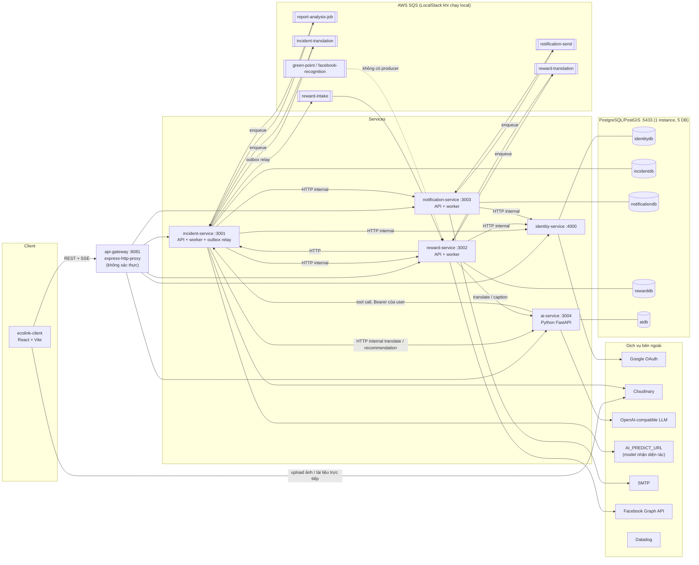

# 00 — Tổng quan hệ thống Ecolink

> Tài liệu này được viết dựa trên source code tại thời điểm 2026-09-23. Phạm vi gồm `ecolink-server/` (gateway, 5 service, 3 thư viện dùng chung) và `ecolink-client/` (web). Hai phần **không** thuộc phạm vi: `ecolink-mobile`, `ecolink-research-lab`, `ecolink-image-dedup-benchmark`.
> Mọi đường dẫn tính từ thư mục gốc `/Users/ngoc/ecolink`.

## Mục lục tài liệu

| File | Nội dung |
|---|---|
| [00-overview.md](00-overview.md) | Tổng quan, kiến trúc, giao tiếp, cấu hình |
| [01-data-model.md](01-data-model.md) | ERD và từ điển dữ liệu của 4 DB Prisma cùng DB của ai-service |
| [02-business-flows.md](02-business-flows.md) | Các luồng nghiệp vụ và sequence diagram |
| [03-business-rules.md](03-business-rules.md) | Bảng business rule BR-xxx |
| [04-state-machines.md](04-state-machines.md) | Vòng đời trạng thái của các entity |
| [05-permissions.md](05-permissions.md) | Xác thực và ma trận phân quyền |
| [06-frontend.md](06-frontend.md) | Web client: route, màn hình → API, state, xử lý lỗi |
| [99-open-issues.md](99-open-issues.md) | Vấn đề mở, nghi bug, lỗ hổng |
| [BUSINESS-OVERVIEW.md](BUSINESS-OVERVIEW.md) | Bản tổng hợp cho người không làm kỹ thuật |
| [services/api-gateway.md](services/api-gateway.md) | API Gateway |
| [services/identity-service.md](services/identity-service.md) | Tài khoản, đăng nhập, role |
| [services/incident-service.md](services/incident-service.md) | Report, campaign, tổ chức, đơn đăng ký tổ chức, SOS, vote |
| [services/notification-service.md](services/notification-service.md) | Thông báo in-app và email |
| [services/reward-service.md](services/reward-service.md) | Điểm xanh, quà tặng, gamification, season |
| [services/translation-worker.md](services/translation-worker.md) | Cơ chế dịch nội dung (nằm trong reward-service và incident-service, **không phải service riêng**) |
| [services/ai-service.md](services/ai-service.md) | Chatbot LLM, dịch, gợi ý xử lý report, caption Facebook |

## 1. Mô tả hệ thống

Ecolink là nền tảng cộng đồng về môi trường. Code thể hiện các chức năng chính sau:

- **Báo cáo điểm rác/ô nhiễm (report/incident):** người dùng gửi ảnh, toạ độ và mức độ nghiêm trọng. Hệ thống dùng AI phân tích ảnh và sinh gợi ý xử lý. Admin duyệt hoặc ban report (`incident-service/src/modules/report`).
- **Tổ chức (organization):** tổ chức nộp **đơn đăng ký** (xác thực email bằng OTP, kèm giấy tờ pháp lý). Admin thẩm định, sau đó hệ thống tạo tổ chức và **tài khoản đăng nhập của tổ chức**. Tổ chức có thể được gắn **Blue Tick** (`trustTier = VERIFIED`) (`incident-service/src/modules/organization_application`).
- **Chiến dịch (campaign):** chủ tổ chức tạo chiến dịch dọn dẹp, có thể gắn các report cần xử lý. Admin duyệt chiến dịch. Tình nguyện viên xin tham gia, được giao task và điểm danh bằng QR. Khi xong, manager gửi hoàn thành, admin duyệt, và người tham gia nhận **điểm xanh** (`incident-service/src/modules/campaign`).
- **SOS:** yêu cầu khẩn cấp gắn với một chiến dịch đang hoạt động (`incident-service/src/modules/sos`).
- **Vote và lưu (bookmark)** cho report và campaign.
- **Điểm thưởng và gamification:** điểm xanh, ví SP có hạn dùng, điểm xếp hạng CRP/VRP theo season, bảng xếp hạng, badge, đổi quà (`reward-service`).
- **Thông báo** in-app và email (`notification-service`).
- **Đa ngôn ngữ vi/en:** nội dung người dùng nhập được dịch tự động bằng LLM (`translation-worker.md`).
- **Trợ lý AI (chat):** chatbot có tool để tạo report giúp người dùng (`ai-service`).

## 2. Các vai trò người dùng (actor)

| Actor | Nhận diện trong code | Bằng chứng |
|---|---|---|
| Khách (chưa đăng nhập) | Không có JWT | Chỉ gọi được các route public: đăng ký, đăng nhập, đơn đăng ký tổ chức, danh sách quà, difficulty, leaderboard… |
| Người dùng (citizen / volunteer) | Tài khoản `accountType = PERSONAL`, role `USER` | `identity-service/src/modules/auth/auth.service.ts > signup()` |
| Admin | Claim JWT `role` so sánh không phân biệt hoa thường với `"admin"` | Ví dụ `identity-service/src/modules/user/user.controller.ts > requireAdmin()`, `reward-service/src/middleware/require-admin.middleware.ts`, các controller của incident |
| Tài khoản tổ chức (Org owner) | `accountType = ORG`, role `ORG_OWNER`, được tạo khi admin duyệt đơn; khớp `organizations.ownerId` | `identity-service/src/modules/auth/auth.service.ts > provisionOrgAccount()` |
| Chủ tổ chức (owner) | `organization.ownerId === userId` | `incident-service/src/modules/organization/organization.service.ts` |
| Campaign creator / manager | `campaign.createdBy`, bảng `campaign_managers` | `incident-service/src/modules/campaign/campaign_manager/campaign_manager.service.ts > canManageCampaign()` |
| Tình nguyện viên (volunteer) | `campaign_joining_requests.status = 14 (APPROVED)` | `campaign_joining_request.service.ts` |
| Thành viên tổ chức | Bảng `organization_members` | `organization.service.ts > processJoinRequest()` |
| Người nộp đơn tổ chức (ẩn danh) | Không có tài khoản, chứng minh quyền sở hữu hòm mail bằng OTP → `x-submission-token` / tracking token | `incident-service/src/modules/organization_application/submission-token.middleware.ts` |
| Service nội bộ | Header `x-internal-api-key` | `*/middleware/internal-*.middleware.ts` |

Lưu ý: "Người dùng", "tình nguyện viên" và "manager" **không phải role riêng** trong identity. Đó là các quan hệ lưu ở incident-service. Chi tiết ở [05-permissions.md](05-permissions.md).

## 3. Kiến trúc tổng

Nguồn:
- Bảng proxy: `ecolink-server/api-gateway/src/index.ts`
- Hạ tầng local: `ecolink-server/docker-compose.yml`
- Danh sách queue: `ecolink-server/localstack/init/ready.d/01-create-sqs-queues.sh`
- Các client HTTP nội bộ: `incident-service/src/modules/*/…client.ts`, `reward-service/src/modules/*/…client.ts`, `notification-service/src/lib/identity-user.client.ts`, `ai-service/app/tools/*.py`

## 4. Cách các service giao tiếp

| Kiểu | Chi tiết | Bằng chứng |
|---|---|---|
| **REST qua gateway** | Client gọi `/api/v1/...`; gateway proxy theo prefix và không kiểm tra token | `api-gateway/src/index.ts` |
| **SSE** | Chat AI: `POST /api/v1/chat/conversations/{id}/messages/stream`; gateway đặt `parseReqBody: false` | `api-gateway/src/index.ts`, `ai-service/app/chat/router.py` |
| **REST nội bộ (server-to-server)** | Các route `/internal/v1/*` và `POST /api/v1/notifications/jobs`, xác thực bằng header `x-internal-api-key`; gateway **không** proxy `/internal/*` | `identity-service/src/internal/internal.routes.ts`, `reward-service/src/internal/internal.routes.ts`, `ai-service/app/internal/router.py` |
| **Circuit breaker HTTP** | incident-service bọc các lời gọi tới identity, reward, notification (5 lỗi → OPEN 30s) | `incident-service/src/resilience/http-circuit.ts` |
| **Hàng đợi SQS (background job)** | Thư viện `@da2/queue`: ghi dòng job vào DB, gửi envelope `{jobId, version:1, jobType, createdAt, payload}`; worker retry với backoff `min(900s, 30s·2^(n-1))`, tối đa 5 lần | `ecolink-server/shared/da2-queue/src/*` |
| **Transactional outbox** | incident-service ghi `outbox_events` trong cùng transaction nghiệp vụ; relay đẩy lên SQS `reward-intake`, hoặc gọi identity để tạo tài khoản tổ chức (saga) | `incident-service/src/outbox/*` |
| **Upload trực tiếp** | Client upload ảnh lên Cloudinary rồi gửi URL; tài liệu đơn tổ chức dùng chữ ký presign (private) | `ecolink-client`, `incident-service/src/modules/organization_application/storage/cloudinary-document-storage.ts` |

Không có gRPC, WebSocket hay message broker nào khác. Không có service nào lắng nghe event từ identity-service.

### Bảng job và event

| Tên | Kiểu | Producer | Consumer | Tóm tắt payload |
|---|---|---|---|---|
| `ANALYZE_REPORT` | SQS job | incident `report.service.ts > createReport()/addReportImages()` | incident `ReportAnalysisWorker` | `{reportId, reportMediaFileIds[]}` |
| `TRANSLATE_TEXT` | SQS job | incident (report, organization, campaign), reward (gift, difficulty) | `TranslationWorker` trong chính service đó | `{resourceType, resourceId, translations[]}` |
| `REPORT_COMPLETION_GREEN_POINTS` | Outbox → SQS | incident `adminMarkReportDone()` | reward `RewardIntakeWorker` | `{reportId, userId, points}` |
| `REPORT_VOTE_MILESTONE_GREEN_POINTS` | Outbox → SQS | incident `vote.service.ts` | reward | `{reportId, reportCreatorUserId, voteCount}` |
| `CAMPAIGN_COMPLETION_GREEN_POINTS` | Outbox → SQS | incident `adminFinalizeCampaignCompletion()` | reward | `{campaignId, credits:[{userId, points}]}` |
| `CAMPAIGN_FACEBOOK_RECOGNITION` | Outbox → SQS | [CHƯA HOÀN THIỆN] emit bị comment | reward | — |
| `ORG_ACCOUNT_PROVISION` | Outbox → handler in-process | incident `organization-application-admin.service.ts > approve()` | incident → identity `POST /internal/v1/users/provision-org-account` | `{applicationId, organizationId, email, displayName, legalRepEmail}` |
| `SEND_NOTIFICATION` | SQS job | notification `POST /api/v1/notifications/jobs` | notification `NotificationSendWorker` | `{type, kind, userId?, payload?}` |

## 5. Cổng và cơ sở dữ liệu

| Thành phần | Cổng mặc định | DB | ORM |
|---|---|---|---|
| api-gateway | 8081 | — | — |
| identity-service | 4000 | identitydb | Prisma |
| incident-service | 3001 | incidentdb (có PostGIS) | Prisma, kèm raw SQL PostGIS |
| reward-service | 3002 | rewarddb | Prisma |
| notification-service | 3003 | notificationdb | Prisma |
| ai-service | 3004 | aidb | SQLAlchemy (`create_all`, không có migration) |
| PostgreSQL/PostGIS | 5433 → 5432 | 5 DB trên 1 instance | `scripts/init-postgis-db.sql` |
| LocalStack SQS | 4566 | — | — |

Mỗi service Node (incident, notification, reward) có `src/index.ts` import `./worker`, nên **process API cũng chạy luôn SQS worker** (và outbox relay ở incident). Xem [99-open-issues.md](99-open-issues.md).

## 6. Biến môi trường và cấu hình quan trọng

Bảng chỉ ghi tên biến và ý nghĩa, không ghi giá trị. Chi tiết của từng service nằm ở mục 8 trong `services/*.md`.

### Dùng chung

| Biến | Service | Ý nghĩa |
|---|---|---|
| `PORT`, `NODE_ENV`, `DATABASE_URL`, `CORS_ORIGIN` | tất cả | Cấu hình cơ bản |
| `JWT_SECRET` | identity, incident, notification, reward, ai | **Phải giống nhau** ở mọi service, vì mỗi service tự verify JWT. reward có fallback cứng khi thiếu biến (xem 99) |
| `JWT_EXPIRES_IN`, `JWT_REFRESH_EXPIRES_IN` | identity | TTL access/refresh token (code mặc định 30m / 30d) |
| `SWAGGER_SERVER_URL` | các service Node | URL server trong OpenAPI |
| `DD_API_KEY`, `DD_SITE`, `DD_SERVICE`, `DD_ENV`, `DD_VERSION` | tất cả | Datadog |

### URL và API key nội bộ

| Biến | Nơi dùng | Ý nghĩa |
|---|---|---|
| `IDENTITY_SERVICE_URL`, `INCIDENT_SERVICE_URL`, `REWARD_SERVICE_URL`, `NOTIFICATION_SERVICE_URL`, `AI_SERVICE_URL` | gateway và các service gọi nhau | URL upstream |
| `GATEWAY_PUBLIC_URL` | gateway | URL công khai ghi vào OpenAPI |
| `INTERNAL_IDENTITY_API_KEY` | identity (kiểm tra); incident, notification, reward (gửi) | Key cho `/internal/v1/*` của identity |
| `INTERNAL_INCIDENT_API_KEY` | incident | Key cho `POST /api/v1/organizations` |
| `INTERNAL_REWARD_API_KEY` | reward (kiểm tra); incident (gửi) | Key cho `/internal/v1/difficulties*` |
| `INTERNAL_NOTIFICATION_API_KEY` | notification (kiểm tra); incident (gửi) | Key cho `POST /api/v1/notifications/jobs` |
| `INTERNAL_AI_API_KEY` | ai (kiểm tra); incident, reward (gửi) | Key cho `POST /internal/v1/translate` |
| `INCIDENT_API_BASE_URL` | ai | URL incident dùng cho tool call |

### Hàng đợi

| Biến | Service |
|---|---|
| `AWS_REGION` / `AWS_DEFAULT_REGION`, `AWS_ENDPOINT_URL` / `AWS_SQS_ENDPOINT` / `AWS_GREENPOINT_ENDPOINT_URL`, `AWS_ACCESS_KEY_ID`, `AWS_SECRET_ACCESS_KEY` | incident, notification, reward |
| `SQS_REPORT_ANALYSIS_QUEUE_URL`, `SQS_INCIDENT_TRANSLATION_QUEUE_URL`, `SQS_REWARD_INTAKE_QUEUE_URL` | incident |
| `SQS_NOTIFICATION_QUEUE_URL` | notification |
| `SQS_GREEN_POINT_QUEUE_URL`, `SQS_FACEBOOK_RECOGNITION_QUEUE_URL`, `SQS_REWARD_TRANSLATION_QUEUE_URL`, `SQS_REWARD_INTAKE_QUEUE_URL` | reward (thiếu bất kỳ biến nào thì process không khởi động) |
| `OUTBOX_RELAY_*`, `OUTBOX_BREAKER_*`, `HTTP_BREAKER_*` | incident: tham số relay và circuit breaker |
| `*_CONCURRENCY`, `WORKER_*` | Số worker và tham số poll (một số biến không có tác dụng, xem 99) |

### Nghiệp vụ

| Biến | Service | Ý nghĩa |
|---|---|---|
| `PASSWORD_RESET_TTL_MS` | identity | TTL token reset mật khẩu (mặc định 1h) |
| `ORG_CONTACT_EMAIL_TOKEN_TTL_MS`, `ORG_ACCOUNT_ACTIVATION_TTL_MS` | identity | TTL link xác minh email tổ chức / kích hoạt tài khoản tổ chức (mặc định 72h) |
| `GOOGLE_OAUTH_CLIENT_ID`, `GOOGLE_OAUTH_CLIENT_SECRET`, `GOOGLE_OAUTH_REDIRECT_URI` | identity | Google OAuth (không có trong `.env.example`) |
| `APPLICATION_OTP_TTL_MS` (10 phút), `APPLICATION_OTP_MAX_ATTEMPTS` (5), `APPLICATION_SUBMISSION_TOKEN_TTL_MS` (30 phút), `APPLICATION_TRACKING_TOKEN_TTL_MS` (180 ngày) | incident | Luồng đơn đăng ký tổ chức |
| `OTP_RATE_*`, `APPLICATION_RATE_*`, `APPLICATION_RATE_LIMIT_DISABLED` | incident | Rate limit cho endpoint đơn tổ chức |
| `CLOUDINARY_CLOUD_NAME`, `CLOUDINARY_API_KEY`, `CLOUDINARY_API_SECRET` | incident | Ký upload tài liệu private |
| `PUBLIC_INCIDENT_API_URL`, `FRONTEND_APP_URL`, `APP_NAME` | incident | Tạo link trong email |
| `CAMPAIGN_COMPLETION_ADMIN_NOTIFY_USER_IDS` | incident | Danh sách user id admin nhận thông báo khi có campaign chờ duyệt hoàn thành |
| `REPORT_COMPLETION_GREEN_POINTS` | incident | Số điểm xanh khi report được đánh dấu hoàn thành (mặc định 0) |
| `AI_PREDICT_URL` | incident | Endpoint model nhận diện rác |
| `SMTP_HOST`, `SMTP_PORT`, `SMTP_SECURE`, `SMTP_USER`, `SMTP_PASS`, `SMTP_FROM` | notification | Gửi email (`SMTP_HOST` rỗng thì không gửi, chỉ lưu DB) |
| `OPENAI_API_KEY`, `OPENAI_BASE_URL`, `OPENAI_CHAT_MODEL` (mặc định `gpt-4o-mini`), `AUTO_CREATE_DB_TABLES` | ai | LLM |
| `FACEBOOK_APP_ID`, `FACEBOOK_APP_SECRET`, `FACEBOOK_ACCESS_TOKEN`, `FACEBOOK_FEED_OBJECT_ID`, `FACEBOOK_GRAPH_API_VERSION`, `FACEBOOK_RECOGNITION_WEBHOOK_URL` | reward | Đăng bài vinh danh lên Facebook |
| `VITE_*` | client | Xem [06-frontend.md](06-frontend.md) |

## 7. Thư viện dùng chung (`ecolink-server/shared`)

| Package | Nội dung |
|---|---|
| `@da2/constants` (`da2-constants`) | `GlobalStatus` (mã trạng thái số 1..25 dùng cho mọi bảng), `HTTP_STATUS` cùng envelope `{success, code, message, data}`, i18n `pickLocalizedText`, từ vựng đơn tổ chức và trust (`OrgType`, `ApplicationStatus`, `TrustTier`…), slug tổ chức, notification preferences |
| `@da2/queue` (`da2-queue`) | Background job qua SQS: dispatcher, worker, store, retry |
| `@da2/express-swagger` (`express-swagger`) | Mount `/openapi.json`, `/api-docs` và Swagger UI gộp ở gateway |
