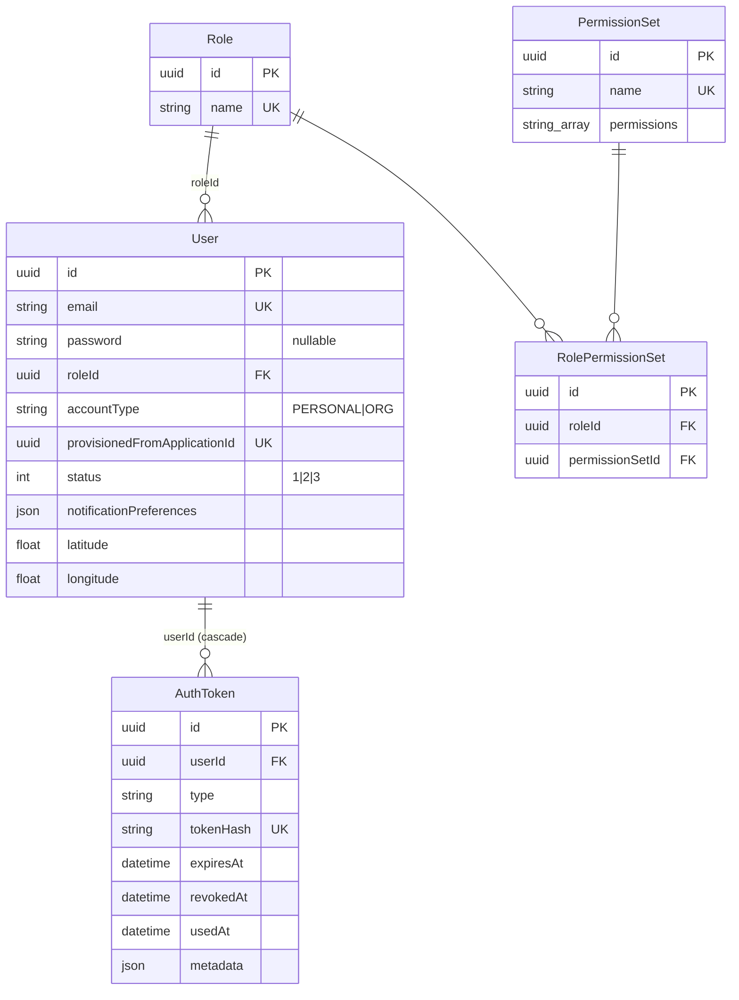
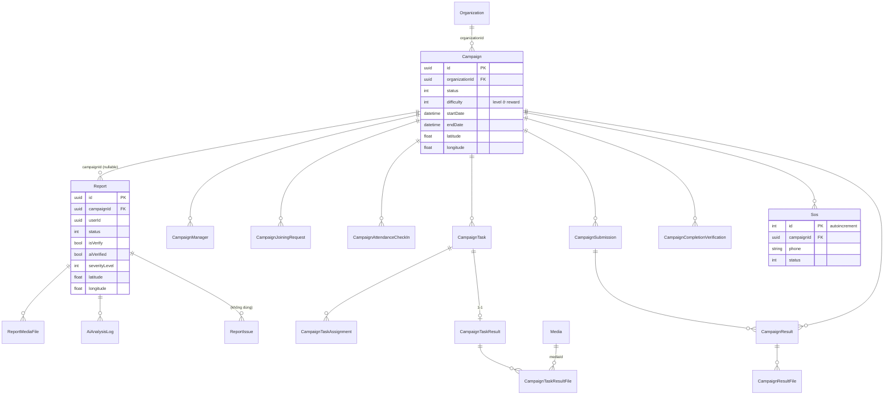
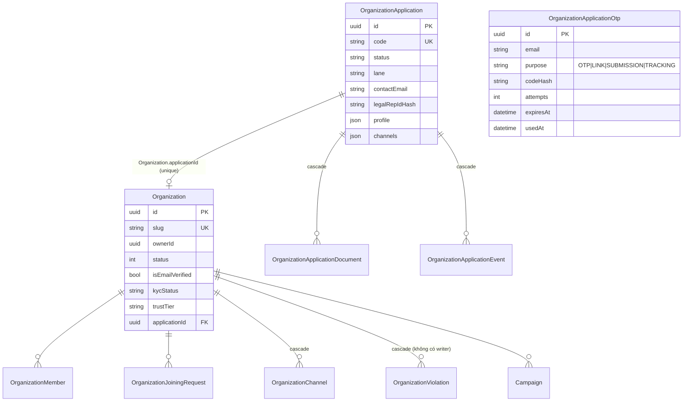
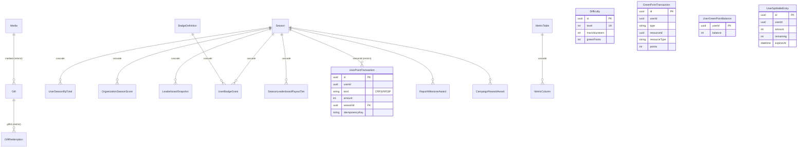
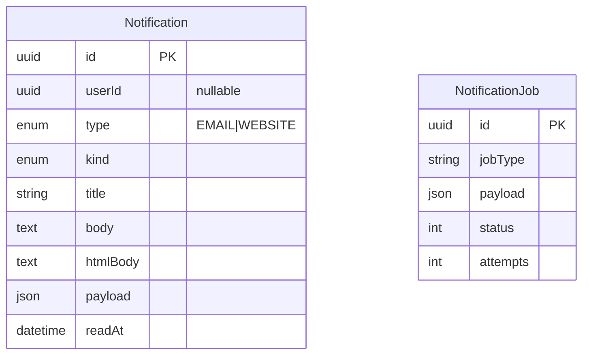

# 01 — Mô hình dữ liệu

> Nguồn:
> - `ecolink-server/services/identity-service/prisma/schema.prisma`
> - `ecolink-server/services/incident-service/prisma/schema.prisma`
> - `ecolink-server/services/reward-service/prisma/schema.prisma`
> - `ecolink-server/services/notification-service/prisma/schema.prisma`
> - `ecolink-server/services/ai-service/app/db/models.py`
> - Enum số / chuỗi dùng chung: `ecolink-server/shared/da2-constants/src/*`
>
> Mỗi service có một DB riêng trên cùng instance PostgreSQL. **Không có khoá ngoại giữa các DB**. Các cột `userId`, `ownerId`, `volunteerId`, `createdBy`… chỉ lưu UUID user của identity-service. Liên kết `campaigns.difficulty` sang `rewarddb.difficulties.level` cũng là liên kết logic, không có FK.

Quy ước chung:
- `id` là UUID, default `uuid()` hoặc `gen_random_uuid()`, trừ khi ghi khác.
- `createdAt` mặc định `now()`; `updatedAt` dùng `@updatedAt`.
- `deletedAt` nullable dùng cho **xoá mềm**; mọi truy vấn lọc `deletedAt IS NULL`.
- `?` nghĩa là nullable.
- Hầu hết cột `status` là **Int theo `GlobalStatus`** (xem mục 6), không phải enum của Prisma.

---

## 1. identity-service (`identitydb`)

### User (`users`)
| Field | Kiểu | Ràng buộc | Ghi chú |
|---|---|---|---|
| id | uuid | PK | |
| email | text | **unique** (không phân biệt deletedAt; có phân biệt hoa thường) | Sign-up lưu nguyên văn; Google và provision lưu lowercase |
| name | text | NOT NULL | |
| password | text? | | Hash bcrypt cost 10. NULL với tài khoản tổ chức chưa kích hoạt. Với user tạo qua Google là UUID dạng plaintext |
| avatar, bio | text? | | Avatar phải là URL http(s) |
| emailVerified | bool | default false | |
| verificationToken | text? | | Không được dùng |
| phoneNumber | text? | | ≤20 ký tự, regex |
| gender | text? | | male, female, other, prefer_not_to_say |
| dateOfBirth | date? | | |
| latitude, longitude | float? | | Vị trí nhà, dùng để mời người dân ở gần |
| locationUpdatedAt | datetime? | | |
| detailAddress | varchar(255)? | | |
| notificationPreferences | json | default `{}` | Xem mục 6.3 |
| roleId | uuid | FK → roles, RESTRICT | |
| accountType | varchar(16) | default `PERSONAL` | `PERSONAL` / `ORG` |
| provisionedFromApplicationId | uuid? | **unique** | Id đơn đăng ký tổ chức; khoá idempotent khi provision |
| status | int | default 1, index | 1 ACTIVE, 2 INACTIVE (bị ban), 3 PENDING_ACTIVATION (`identity-service/src/constants/user-status.ts`) |
| rejectReason | text? | | Lý do ban |
| createdAt, updatedAt, deletedAt | | index deletedAt | |

### AuthToken (`auth_tokens`)
| Field | Kiểu | Ràng buộc | Ghi chú |
|---|---|---|---|
| userId | uuid | FK → users, CASCADE; index (userId, type) | |
| type | varchar(32) | | `REFRESH`, `PASSWORD_RESET`, `ORGANIZATION_CONTACT_EMAIL`, `ORG_ACCOUNT_ACTIVATION` (`identity-service/src/constants/auth-token-type.ts`) |
| tokenHash | varchar(64) | **unique** | SHA-256 của token |
| expiresAt | datetime | index | REFRESH theo `exp` của JWT; reset 1h; các loại còn lại 72h |
| revokedAt, usedAt | datetime? | | Thu hồi / đã dùng (token một lần) |
| metadata | json? | | `{organizationId, contactEmail}` hoặc `{organizationId, applicationId}` |

### Role (`roles`), PermissionSet (`permission_sets`), RolePermissionSet (`role_permission_sets`)
- `Role.name` là **unique**. Các role có sẵn: `ADMIN`, `USER` (migration 0731 và seed), `ORG_OWNER` (migration 0922).
- `PermissionSet.permissions` là mảng text thuộc enum `Permission` (USER_READ/WRITE/DELETE, ROLE_*, PERMISSION_SET_*) (`identity-service/src/modules/role/permission.enum.ts`). **Không có tác dụng phân quyền** vì middleware `authorize()` không được dùng ở route nào.
- `RolePermissionSet` có unique (roleId, permissionSetId); unique này không tính deletedAt.

---

## 2. incident-service (`incidentdb`, có extension postgis và uuid-ossp)

### 2.1 ERD — Report, Campaign, SOS, Vote

`Vote`, `SavedResource`, `Media`, `BackgroundJob` và `OutboxEvent` không có relation Prisma tới các bảng khác. `resourceId` của `Vote` và `SavedResource` trỏ logic tới report hoặc campaign.

### 2.2 ERD — Organization và đơn đăng ký

### 2.3 Từ điển dữ liệu — Report và các bảng liên quan

**Report (`reports`)**
| Field | Kiểu | Ràng buộc / default | Ý nghĩa |
|---|---|---|---|
| campaignId | uuid? | FK → campaigns; index | Campaign đang xử lý report này |
| userId | uuid? | index | Người báo cáo |
| title, titleVi, titleEn | varchar(200)? | | Bản gốc và bản dịch |
| description, descriptionVi, descriptionEn | text? | | |
| wasteType | varchar(100)? | | Loại rác |
| severityLevel | int? | Validator: 1..5 | Mức độ nghiêm trọng |
| latitude, longitude | float? | | Tìm kiếm bằng PostGIS `ST_DWithin` qua raw SQL |
| detailAddress | text? | | |
| status | int? | default 12, index | `GlobalStatus`, xem [04-state-machines.md](04-state-machines.md) |
| isVerify | bool | default false | Admin đã duyệt |
| rejectReason | text? | | Lý do ban |
| aiVerified | bool | default false | Đã được AI phân tích |
| aiRecommendation | text? | | Gợi ý xử lý do LLM sinh (Markdown) |

**ReportMediaFile (`report_media_files`)**: gồm reportId (FK), mediaId (uuid, không có FK), uploadedBy, deletedAt.

**Media (`media`)**: gồm url (text), type varchar(50) (`REPORT`, `USER`, `REPORT_RESULT`, `AI_PREDICT`, `OTHER`, `CAMPAIGN_TASK_RESULT`, `CAMPAIGN_RESULT`).

**AiAnalysisLog (`ai_analysis_logs`)**: gồm reportId (FK), reportMediaFileId?, mediaId? (ảnh kết quả AI), detections int?, processedAt.

**ReportIssue (`report_issues`)**: không được code nào dùng.

### 2.4 Từ điển dữ liệu — Campaign

**Campaign (`campaigns`)**
| Field | Kiểu | Ràng buộc / default | Ý nghĩa |
|---|---|---|---|
| title | varchar(200) | NOT NULL | Kèm titleVi và titleEn |
| banner | varchar(2048)? | | |
| description (+Vi/En) | text? | | |
| status | int | default 12, index | `GlobalStatus` |
| rejectReason | text? | | Dùng chung cho lý do ban và lý do từ chối hoàn thành |
| startDate, endDate | datetime? | | Không được validate thứ tự ngày |
| detailAddress | varchar(255)? | | |
| latitude, longitude, radiusKm | float? | | |
| difficulty | int | default 1 | Level bên reward-service `difficulties.level` |
| organizationId | uuid | NOT NULL, FK → organizations | |
| createdBy | uuid? | index | Người tạo, được coi là "owner" của campaign |

| Bảng | Field chính | Ràng buộc |
|---|---|---|
| CampaignManager (`campaign_managers`) | campaignId, userId, assignedBy, assignedAt, deletedAt | PK kép (campaignId, userId) |
| CampaignJoiningRequest (`campaign_joining_requests`) | campaignId?, volunteerId?, status (default 12) | **Không có unique** (campaignId, volunteerId) |
| CampaignAttendanceCheckIn (`campaign_attendance_check_ins`) | campaignId (cascade), userId, checkedInAt | **unique (campaignId, userId)** |
| CampaignTask (`campaign_tasks`) | campaignId?, title/titleVi/titleEn, description*, priority (default 2; DTO 1..3), status (default 12), scheduledDate, scheduledTime varchar(50) | |
| CampaignTaskAssignment (`campaign_task_assignments`) | campaignTaskId?, volunteerId?, deletedAt | Không có unique |
| CampaignTaskResult (`campaign_task_results`) | campaignTaskId **unique** (cascade), description* | 1-1 với task |
| CampaignTaskResultFile (`campaign_task_result_files`) | campaignTaskResultId (cascade), mediaId (FK → media) | |
| CampaignSubmission (`campaign_submissions`) | campaignId, submittedBy, title*, description*, status (default 12) | |
| CampaignResult (`campaign_results`) | campaignId, campaignSubmissionId? (null = nháp), title NOT NULL | Không có API tạo bản nháp |
| CampaignResultFile (`campaign_result_files`) | campaignResultId, mediaId (không có FK) | |
| CampaignCompletionVerification (`campaign_completion_verifications`) | campaignId, userId, value (1 sạch / -1 chưa sạch / 0 huỷ) | **unique (userId, campaignId)** |

**Sos (`sos`)**
| Field | Kiểu | Ràng buộc | Ý nghĩa |
|---|---|---|---|
| id | **Int autoincrement** | PK | |
| campaignId | uuid | FK → campaigns | |
| content | text | NOT NULL | contentVi/contentEn? không bao giờ được ghi |
| phone | varchar(20) | | |
| address | varchar(500) | NOT NULL | Lấy từ campaign |
| detailAddress | varchar(255)? | | |
| latitude, longitude | float | NOT NULL | Lấy toạ độ của campaign |
| status | int | default 12 | Code tạo với giá trị 1; khi giải quyết đổi thành 17 |

### 2.5 Từ điển dữ liệu — Vote, Saved, Job, Outbox

| Bảng | Field | Ràng buộc |
|---|---|---|
| Vote (`votes`) | userId, value (1 / -1 / 0), resourceType (`report` hoặc `campaign`), resourceId | **unique (userId, resourceType, resourceId)** |
| SavedResource (`saved_resources`) | userId, resourceType, resourceId, deletedAt (khác null nghĩa là đã bỏ lưu) | **unique (userId, resourceType, resourceId)** |
| BackgroundJob (`background_jobs`) | jobType (`ANALYZE_REPORT`, `TRANSLATE_TEXT`), payload, status (12/22/17/23/11), attempts, maxAttempts (5, không dùng), runAfter (không dùng), processedAt | index (jobType, status, runAfter) |
| OutboxEvent (`outbox_events`) | aggregateType, aggregateId, eventType, payload, **dedupKey unique**, status (12/22/17/23), attempts, maxAttempts (10), runAfter, lastError, processedAt | index (status, runAfter) |

### 2.6 Từ điển dữ liệu — Organization

**Organization (`organizations`)**
| Field | Kiểu | Ràng buộc / default | Ý nghĩa |
|---|---|---|---|
| name | varchar(200) | | |
| slug | varchar(220) | **unique** | Sinh từ name (`slugifyOrganizationName`), không đổi khi đổi tên |
| description (+Vi/En) | text? | | |
| logoUrl | varchar(2048) | NOT NULL | |
| backgroundUrl | varchar(2048)? | | |
| contactEmail | varchar(320)? | | |
| address | varchar(500)? | | |
| latitude, longitude | float? | | |
| isEmailVerified | bool | default false | Email liên hệ đã được xác minh |
| status | int | default 1 | 1 ACTIVE, 2 INACTIVE (bị ban) |
| rejectReason | text? | | |
| orgType | varchar(32)? | | `OrgType` |
| kycStatus | varchar(20) | default `NOT_SUBMITTED` | `KycStatus` |
| trustTier | varchar(10) | default `NONE` | `TrustTier`; `VERIFIED` là **Blue Tick** |
| tickSuspended | bool | default false | Không có code ghi |
| domainVerified | bool | default false | Đặt bằng `lane A && documentsWaived` |
| verifiedAt, verifiedBy | | | |
| verificationExpiresAt | datetime? | | Lane B: +365 ngày; không có job xử lý hết hạn |
| tickRevokedReason, profileCompleteness, successfulCampaignCount, violationCount, legalRepLimitOverride | | | [CHƯA HOÀN THIỆN] không có code ghi |
| ownerId | uuid? | index | User tài khoản tổ chức; null trong lúc đang provision |
| applicationId | uuid? | **unique**, FK → organization_applications | |

| Bảng | Field chính | Ràng buộc |
|---|---|---|
| OrganizationMember (`organization_members`) | organizationId, userId, deletedAt | PK kép. Không có cột role |
| OrganizationJoiningRequest (`organization_joining_requests`) | organizationId, requesterId, status (12 / 14 / 18), deletedAt (xoá mềm nghĩa là đã huỷ) | |
| OrganizationChannel (`organization_channels`) | organizationId (cascade), type (`FACEBOOK_PAGE` / `WEBSITE` / `ZALO_OA`), url, isPrimary | Chỉ được ghi lúc duyệt đơn |
| OrganizationViolation (`organization_violations`) | organizationId, campaignId?, severity (`MINOR` / `MAJOR`), reason | [CHƯA HOÀN THIỆN] không có code ghi |

**OrganizationApplication (`organization_applications`)**
| Field | Kiểu | Ràng buộc / default | Ý nghĩa |
|---|---|---|---|
| code | varchar(16) | **unique** | `ORG-XXXXXXXX` |
| orgType | varchar(32) | NOT NULL | `OrgType` |
| status | varchar(20) | default `SUBMITTED` | `ApplicationStatus` |
| lane | varchar(1)? | | `A` / `B`, do admin đặt khi duyệt |
| documentsWaived, documentsWaivedReason | bool, text? | | Miễn nộp giấy tờ |
| profile | json | NOT NULL | `{name, contactEmail, logoUrl, backgroundUrl, address, latitude, longitude, description}` |
| channels | json | default `[]` | `[{type, url, isPrimary}]` |
| contactEmail | varchar(320) | index | Dạng chuẩn hoá, dùng cho rule "mỗi email chỉ 1 đơn mở" (không có ràng buộc DB) |
| legalRepName, legalRepPhone, legalRepEmail, legalRepPosition, legalRepIdType | | | Người đại diện pháp lý |
| legalRepIdHash | varchar(64)? | index | SHA-256 của số giấy tờ (viết hoa) |
| legalRepIdLast4 | varchar(4)? | | |
| submittedByUserId | uuid? | | Luôn null (xem 99) |
| emailVerifiedAt, consentedAt | datetime? | | |
| reviewerId, claimedAt, reviewedAt, reviewNote, rejectReason | | | Thông tin thẩm định |
| organizationId | uuid? | | Tổ chức được tạo ra |
| accountProvisionedAt | datetime? | | Thời điểm tạo xong tài khoản tổ chức ở identity |
| purgedAt | datetime? | | Không có job purge |

| Bảng | Field chính | Ghi chú |
|---|---|---|
| OrganizationApplicationDocument | applicationId? (null từ lúc presign tới lúc nộp; cascade), submissionEmail, docType, storageKey (khoá Cloudinary private), format, mimeType, sizeBytes (client tự khai), fileName, purgedAt | |
| OrganizationApplicationEvent | applicationId (cascade), eventType (`ApplicationEventType`), actorId? (null = người nộp hoặc relay), payload | Audit trail |
| OrganizationApplicationOtp | email, purpose (`OTP` / `LINK` / `SUBMISSION` / `TRACKING`), codeHash (sha256), attempts, expiresAt, usedAt | index (email, purpose) |

Migration `incident-service/prisma/migrations/20260922104500_truncate_legacy_organizations` chạy `TRUNCATE organizations … CASCADE`, nên dữ liệu campaign và report cũ trỏ tới tổ chức cũng bị xoá theo.

---

## 3. reward-service (`rewarddb`)

### 3.1 Điểm

Hệ thống có 3 sổ song song:

- **Green point (điểm xanh)**: sổ cũ ở `green_point_transactions` và số dư ở `user_green_point_balances`.
- **SP (spendable point, điểm tiêu được, có hạn)**: ví theo lô ở `user_sp_wallet` và sổ ở `user_point_transactions` với `kind = SP`.
- **RP (ranking point)**: `CRP` (citizen, từ report) và `VRP` (volunteer, từ campaign). Sổ ở `user_point_transactions` và tổng theo season ở `user_season_rp_totals`.

| Bảng | Field | Ràng buộc / ghi chú |
|---|---|---|
| Difficulty (`difficulties`) | level (**unique**), name/nameVi/nameEn varchar(64), maxVolunteers? (null nghĩa là không giới hạn), greenPoints, deletedAt | Mức khó của campaign: quyết định sức chứa tình nguyện viên và số điểm thưởng |
| UserGreenPointBalance (`user_green_point_balances`) | userId (PK), balance (default 0) | Không bị trừ khi đổi quà |
| GreenPointTransaction (`green_point_transactions`) | userId, type (`CAMPAIGN_COMPLETION`, `REPORT_COMPLETION`, `UPVOTE`, `REPORT_VOTE_MILESTONE`, `REFERRAL`, `GIFT_REDEEM`, `GIFT_REDEEM_REFUND`), resourceId, resourceType, points (âm là chi), metadata | **partial unique (user_id, type, resource_id, resource_type) WHERE deleted_at IS NULL**, dùng để chống cộng trùng |
| UserSpWalletEntry (`user_sp_wallet`) | userId, amount, remaining, sourceType, sourceId?, expiresAt | Trừ theo FIFO dựa trên `expiresAt` |
| UserPointTransaction (`user_point_transactions`) | userId, kind (`PointKind`), amount (âm là debit), sourceType (`PointSourceType`), sourceId?, seasonId? (bắt buộc với RP), metadata, idempotencyKey varchar(256)? | **partial unique (user_id, idempotency_key) WHERE idempotency_key IS NOT NULL** |
| UserSeasonRpTotal (`user_season_rp_totals`) | PK (userId, seasonId), citizenRp, volunteerRp | |
| OrganizationSeasonScore | PK (organizationId, seasonId), aggregateScore | Không có code ghi |
| ReportMilestoneAward, CampaignRewardAward | | Không được dùng; có các unique tương ứng |

### 3.2 Quà tặng

| Bảng | Field | Ghi chú |
|---|---|---|
| Media (`media`) | url, type (`GIFT`) | |
| Gift (`gifts`) | name (255), nameVi/nameEn?, mediaId? (FK restrict), description text (+Vi/En), greenPoints (giá, trừ bằng SP), stockRemaining? (null nghĩa là vô hạn), isActive (default true), deletedAt | |
| GiftRedemption (`gift_redemptions`) | userId, giftId (FK restrict), greenPointsSpent, phoneNumber varchar(32) (default ''), pickupLocation text (default ''), status (`GiftRedemptionStatus`, default PROCESSING), statusUpdatedAt, cancelledAt? | Không có cột updatedAt |

### 3.3 Gamification và season

| Bảng | Field | Ghi chú |
|---|---|---|
| Season (`seasons`) | label?, kind (`SeasonKind`), status Int (1 ACTIVE / 2 INACTIVE), startsAt, endsAt | |
| GamificationPointRules | baseReportPoint, reportMilestoneThresholds Int[], volunteerBonusCapByDifficulty json?, isActive, effectiveFrom | |
| SpendablePointRules | expirationDays (default 90), isActive, effectiveFrom | Hạn dùng của SP |
| VolunteerOrgMultiplierRule | code (**unique**), multiplier Decimal(4,2), priority, isActive | Chỉ có CRUD, không có code dùng |
| SeasonScheduleRules | kind (**unique**), autoRotate, metadata | Chỉ có CRUD, không có cron |
| SeasonLeaderboardPayoutTier | seasonId? (null nghĩa là tier mặc định), metric, rankMin, rankMax, spAmount | Chi SP khi finalize season |
| BadgeDefinition (`badge_definitions`) | slug (**unique**, max 128), name, symbol?, category, scope (default SEASON), isRepeatable, maxGrantsPerUser?, cooldownSeconds, rulesConfig json (AST điều kiện), reward json (`discountBps`…), isActive, publishedAt?, slugLockedAt?, deletedAt | |
| UserBadgeGrant | userId, badgeId (cascade), seasonId?, grantedAt, metadata | [CHƯA HOÀN THIỆN] không có code tạo |
| LeaderboardSnapshot | seasonId, subjectKind, subjectId, metric, score, rank | **unique (seasonId, subjectKind, subjectId, metric)** |
| MetricTable / MetricColumn | key (**unique**) / (tableId, key) **unique**, label, valueType, isActive | Metadata cho rule builder của badge |
| ReportVoteGreenPointRule | threshold (**unique**), points, isActive | Chỉ được đồng bộ từ point-rules; worker không đọc bảng này |
| RewardBackgroundJob (`reward_background_jobs`) | jobType, payload, status (12/22/17/23), attempts, maxAttempts, processedAt | |

---

## 4. notification-service (`notificationdb`)

| Bảng | Field | Ghi chú |
|---|---|---|
| Notification (`notifications`) | userId? (null khi email gửi thẳng tới `toEmail`), type `NotificationType`, kind `NotificationKind`, title (website: bản en; email: subject), body, htmlBody? (chỉ email), payload json (website có thêm `locales.{en,vi}`), readAt? (chỉ dùng cho WEBSITE) | index (userId, type, createdAt desc), (type, createdAt desc) |
| NotificationJob (`notification_jobs`) | jobType (`SEND_NOTIFICATION`), payload, status (12/22/17/23), attempts, maxAttempts (5, không được đọc), processedAt | |

---

## 5. ai-service (`aidb`, SQLAlchemy)

| Bảng | Field | Ghi chú |
|---|---|---|
| `ai_chat_media` | id (uuid4), user_id (index), url text, created_at | Ảnh người dùng đính kèm trong chat |
| `ai_chat_conversations` | id, user_id (index), agent_id String(64) (index), title?, created_at, updated_at | agent_id: `ecolink_assistant`, `translation_assistant`, hoặc giá trị legacy `ecolink_support` / `campaign_helper` |
| `ai_chat_messages` | id, conversation_id (FK, cascade), role `ChatMessageRole` (system / user / assistant / tool), content?, append_text? (khối `media_ids:` chỉ dành cho agent), tool_calls JSONB?, tool_call_id?, created_at | |

Nguồn: `ecolink-server/services/ai-service/app/db/models.py`. Bảng được tạo bằng `create_all` khi bật `AUTO_CREATE_DB_TABLES`.

---

## 6. Enum và hằng số

### 6.1 `GlobalStatus` (Int, `ecolink-server/shared/da2-constants/src/global-status.ts`)

Mọi cột `status` kiểu Int ở incident, notification và reward (job) đều dùng bộ mã này. Cột **"Dùng ở"** chỉ liệt kê những nơi code thực sự dùng giá trị đó.

| Giá trị | Tên | Dùng ở |
|---|---|---|
| 1 | `_STATUS_ACTIVE` | Campaign đã duyệt; Organization hoạt động; SOS đang mở; Season ACTIVE; User ACTIVE (identity có enum riêng, cùng số) |
| 2 | `_STATUS_INACTIVE` | Report, Campaign, Organization bị ban; Season INACTIVE; User bị ban |
| 3 | `_STATUS_DELETED` | Không dùng. identity dùng số 3 cho `PENDING_ACTIVATION` với nghĩa khác |
| 4 | `_STATUS_DRAFT` | Chỉ xuất hiện trong điều kiện chuyển trạng thái của campaign và organization |
| 5 | `_STATUS_NEW` | Chỉ xuất hiện trong điều kiện chuyển trạng thái của campaign |
| 6 | `_STATUS_WAITING_APPROVED` | Submission được xem là "chờ duyệt" |
| 7 | `_STATUS_WAITING_CONFIRMED` | Campaign chờ admin duyệt hoàn thành |
| 9 | `_STATUS_INREVIEW` | Campaign (được phép mark-done), Submission mới, Organization |
| 11 | `_STATUS_CANCELED` | BackgroundJob bị huỷ |
| 12 | `_STATUS_PENDING` | Mặc định: Report mới, Campaign mới, Join request, Job, Outbox |
| 14 | `_STATUS_APPROVED` | Join request được duyệt, Submission được duyệt |
| 17 | `_STATUS_COMPLETED` | Report, Campaign, Task, SOS, Job hoàn tất |
| 18 | `_STATUS_REJECTED` | Organization join request bị từ chối, Submission bị từ chối |
| 21 | `_STATUS_TODO` | Report đã được duyệt, chờ gán vào campaign; Task mới |
| 22 | `_STATUS_INPROCESS` | Report đang nằm trong campaign; Task đã được giao; Job đang chạy |
| 23 | `_STATUS_FAILED` | Job hoặc outbox thất bại |
| 8, 10, 13, 15, 16, 19, 20, 24, 25 | REVIEWED, ASSIGNED, VERIFIED, RECEIVED, CONFIRMED, RETURNED, OBSOLETE, CLOSED, REPROCESS | Không được dùng trong logic |

### 6.2 Từ vựng đơn đăng ký tổ chức và trust (`ecolink-server/shared/da2-constants/src/organization-trust.ts`)

| Enum | Giá trị | Ý nghĩa |
|---|---|---|
| `OrgType` | GOV, SCHOOL, CLUB, NGO, SOCIAL_ENTERPRISE | Loại pháp nhân do người nộp khai, admin xác nhận |
| `ApplicationLane` | A, B | A: fast-track cho cơ quan nhà nước hoặc trường học có domain chính thức. B: luồng tiêu chuẩn, cần giấy tờ pháp lý. Chỉ admin được đặt |
| `KycStatus` | NOT_SUBMITTED, APPROVED, EXPIRED, REVOKED | Kết luận về giấy tờ pháp lý. Code chỉ ghi APPROVED |
| `TrustTier` | NONE, BASIC, VERIFIED | Cấp tin cậy. VERIFIED là **Blue Tick**. BASIC không được dùng |
| `ApplicationStatus` | DRAFT, SUBMITTED, UNDER_REVIEW, NEEDS_MORE_INFO, APPROVED, REJECTED, WITHDRAWN | Vòng đời của đơn. DRAFT không được dùng. "Đơn mở" gồm SUBMITTED, UNDER_REVIEW, NEEDS_MORE_INFO |
| `ApplicationDocType` | ESTABLISHMENT_DECISION, BUSINESS_LICENSE, REP_ID_CARD, OTHER | Loại giấy tờ |
| `OrganizationChannelType` | FACEBOOK_PAGE, WEBSITE, ZALO_OA | Kênh chính thức |
| `LegalRepIdType` | CCCD, MSSV, PASSPORT, OTHER | Loại giấy tờ tuỳ thân của người đại diện |
| `ApplicationEventType` | SUBMITTED, RESUBMITTED, WITHDRAWN, CLAIMED, INFO_REQUESTED, APPROVED, REJECTED, DOCUMENTS_WAIVED, DOCUMENT_VIEWED, ACCOUNT_PROVISIONED | Audit trail |
| `ViolationSeverity` | MINOR, MAJOR | Chưa có code ghi |
| Hằng số | `DEFAULT_LEGAL_REP_ORG_LIMIT = 3`, `LANE_B_VERIFICATION_VALID_DAYS = 365`, `APPLICATION_DOCUMENT_LIMITS = {5 file, 10MB, pdf/jpeg/png}` | |

### 6.3 Notification (`notification-service/prisma/schema.prisma`, `ecolink-server/shared/da2-constants/src/notification-preferences.ts`)

- `NotificationType`: `EMAIL`, `WEBSITE` (in-app).
- `NotificationKind` (27 giá trị). Bảng dưới liệt kê từng kind, key preference tương ứng và nơi phát:

| Kind | Preference key | Có nơi phát? |
|---|---|---|
| CAMPAIGN_CREATED | campaignNew | Có |
| CAMPAIGN_VERIFY_INVITE, CAMPAIGN_COMPLETION_VERIFY_INVITE | campaignNearbyVerify | Có |
| CAMPAIGN_DONE, CAMPAIGN_COMPLETION_APPROVED_BY_ADMIN | campaignDone | Có |
| CAMPAIGN_COMPLETION_REJECTED_BY_ADMIN | campaignCompletionRejected | Có |
| VOLUNTEER_REQUEST, VOLUNTEER_APPROVED, VOLUNTEER_REJECTED | volunteerRequest | Có |
| REPORT_STATUS | reportStatus | Có |
| REPORT_READY | reportStatus | Không |
| CAMPAIGN_SUBMISSION_PENDING_REVIEW, CAMPAIGN_SUBMISSION_APPROVED, TASK_ASSIGNED | campaignNew | Không |
| CAMPAIGN_COMPLETION_PENDING_ADMIN | (luôn gửi) | Có |
| ORGANIZATION_CONTACT_VERIFY, ORGANIZATION_APPROVED, ORGANIZATION_REJECTED | (luôn gửi) | Có |
| ORG_APPLICATION_OTP, ORG_APPLICATION_RECEIVED, ORG_APPLICATION_NEEDS_INFO, ORG_APPLICATION_REJECTED, ORG_ACCOUNT_ACTIVATION | (luôn gửi) | Có |
| REPORT_APPROVED, REPORT_REJECTED | (luôn gửi) | Có |
| RESET_PASSWORD, GENERIC | (luôn gửi) | Không |

Các key preference (tất cả mặc định `true`): `campaignNew`, `campaignNearbyVerify`, `campaignDone`, `campaignCompletionRejected`, `volunteerRequest`, `reportStatus`.

### 6.4 reward-service (enum Prisma)

| Enum | Giá trị |
|---|---|
| GiftRedemptionStatus | PROCESSING, SHIPPED, DELIVERED, CANCELLED |
| SeasonKind | MONTHLY, QUARTERLY |
| PointKind | CRP (điểm xếp hạng công dân, từ report), VRP (điểm xếp hạng tình nguyện viên, từ campaign), SP (điểm tiêu được) |
| PointSourceType | REPORT, CAMPAIGN, SYSTEM, STORE, SEASON_END |
| LeaderboardSubjectKind | USER, ORGANIZATION |
| LeaderboardMetric | CRP, VRP, ORG_AGGREGATE; REPORT_UPVOTES, REPORT_COUNT, CAMPAIGN_COMPLETED (không dùng) |
| BadgeScope | LIFETIME, SEASON |
| BadgeCategory | REPORT, CAMPAIGN, CONTRIBUTION, RANK |

### 6.5 Khác

| Enum | Giá trị | Nguồn |
|---|---|---|
| identity `UserStatus` | 1 ACTIVE, 2 INACTIVE, 3 PENDING_ACTIVATION | `identity-service/src/constants/user-status.ts` |
| identity `AccountType` | PERSONAL, ORG | như trên |
| identity `AuthTokenType` | REFRESH, PASSWORD_RESET, ORGANIZATION_CONTACT_EMAIL, ORG_ACCOUNT_ACTIVATION | `identity-service/src/constants/auth-token-type.ts` |
| `VoteValue` | NONE 0, UP 1, DOWN -1 | `da2-constants/src/global-status.ts` |
| `VoteResourceType`, `SavedResourceType` | `report`, `campaign` | như trên |
| `MediaResourceType` | REPORT, USER, REPORT_RESULT, AI_PREDICT, OTHER | như trên |
| `MediaFileStage` | BEFORE, AFTER | Không dùng |
| `AppLocale` | `en`, `vi` | `da2-constants/src/i18n.ts` |
| Outbox `OutboxEventType` | REPORT_COMPLETION_GREEN_POINTS, CAMPAIGN_COMPLETION_GREEN_POINTS, REPORT_VOTE_MILESTONE_GREEN_POINTS, CAMPAIGN_FACEBOOK_RECOGNITION, ORG_ACCOUNT_PROVISION | `incident-service/src/outbox/outbox.types.ts` |
| Job type (incident) | ANALYZE_REPORT, TRANSLATE_TEXT | `incident-service/src/constants/job-type.enum.ts` |
| Job type (reward) | CAMPAIGN_COMPLETION_GREEN_POINTS, REPORT_COMPLETION_GREEN_POINTS, REPORT_VOTE_MILESTONE_GREEN_POINTS, UPVOTE_ADDING_GREEN_POINTS, REFERRAL_ADDING_GREEN_POINTS, CAMPAIGN_FACEBOOK_RECOGNITION, TRANSLATE_TEXT | reward-service `src/queue/*` |
| ai `ChatMessageRole` | system, user, assistant, tool | `ai-service/app/db/models.py` |
