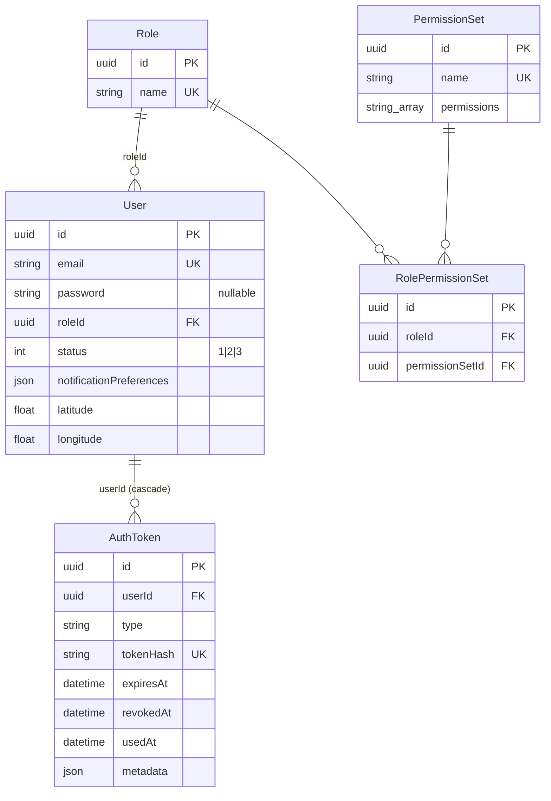
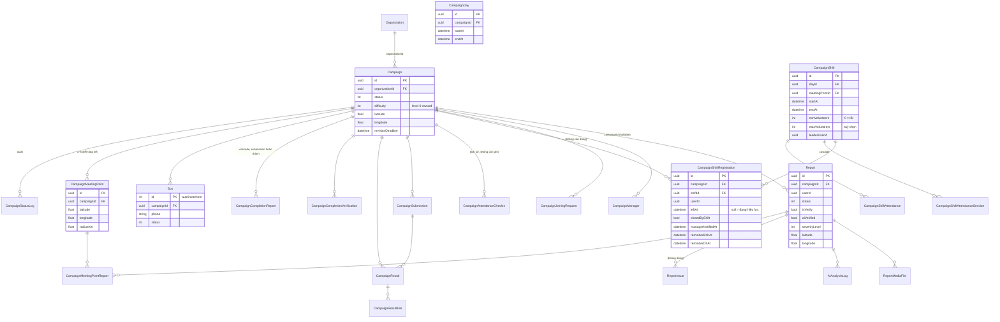
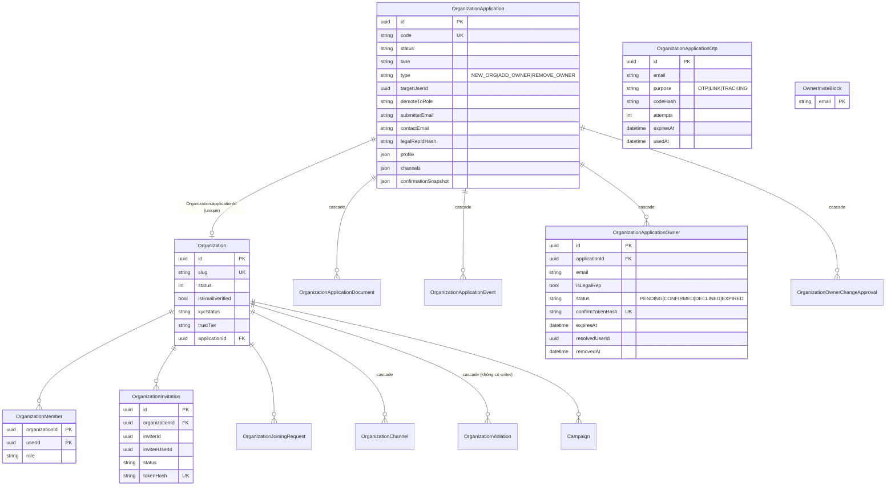
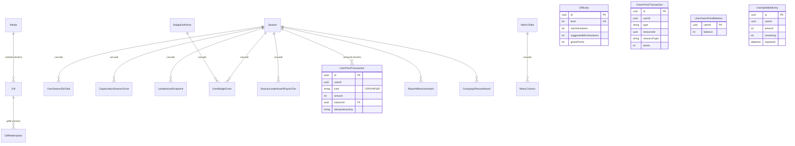
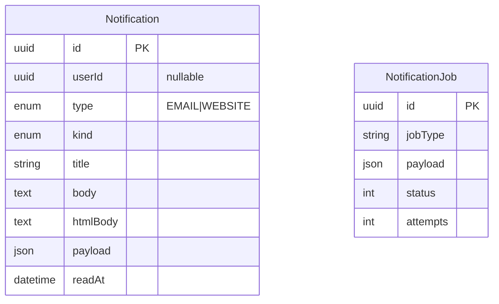

# 01 — Mô hình dữ liệu

> Nguồn:
> - `ecolink-server/services/identity-service/prisma/schema.prisma`
> - `ecolink-server/services/incident-service/prisma/schema.prisma`
> - `ecolink-server/services/reward-service/prisma/schema.prisma`
> - `ecolink-server/services/notification-service/prisma/schema.prisma`
> - `ecolink-server/services/ai-service/app/db/models.py`
> - Enum số / chuỗi dùng chung: `ecolink-server/shared/da2-constants/src/*`
>
> Mỗi service có một DB riêng trên cùng instance PostgreSQL. **Không có khoá ngoại giữa các DB**. Các cột `userId`, `organization_members.userId`, `volunteerId`, `createdBy`… chỉ lưu UUID user của identity-service. Liên kết `campaigns.difficulty` sang `rewarddb.difficulties.level` cũng là liên kết logic, không có FK.

Quy ước chung:
- `id` là UUID, default `uuid()` hoặc `gen_random_uuid()`, trừ khi ghi khác.
- `createdAt` mặc định `now()`; `updatedAt` dùng `@updatedAt`.
- `deletedAt` nullable dùng cho **xoá mềm**; mọi truy vấn lọc `deletedAt IS NULL`.
- `?` nghĩa là nullable.
- Hầu hết cột `status` là **Int theo `GlobalStatus`** (xem mục 6), không phải enum của Prisma.

---

## 1. identity-service (`identitydb`)

```mermaid
erDiagram
  Role ||--o{ User : "roleId"
  Role ||--o{ RolePermissionSet : ""
  PermissionSet ||--o{ RolePermissionSet : ""
  User ||--o{ AuthToken : "userId (cascade)"
  User {
    uuid id PK
    string email UK
    string password "nullable"
    uuid roleId FK
    int status "1|2|3"
    json notificationPreferences
    float latitude
    float longitude
  }
  AuthToken {
    uuid id PK
    uuid userId FK
    string type
    string tokenHash UK
    datetime expiresAt
    datetime revokedAt
    datetime usedAt
    json metadata
  }
  Role {
    uuid id PK
    string name UK
  }
  PermissionSet {
    uuid id PK
    string name UK
    string_array permissions
  }
  RolePermissionSet {
    uuid id PK
    uuid roleId FK
    uuid permissionSetId FK
  }
```

### User (`users`)
| Field | Kiểu | Ràng buộc | Ghi chú |
|---|---|---|---|
| id | uuid | PK | |
| email | text | **unique** (không phân biệt deletedAt; có phân biệt hoa thường) | Sign-up lưu nguyên văn; Google và ensure-users (duyệt đơn tổ chức) lưu lowercase |
| name | text | NOT NULL | |
| password | text? | | Hash bcrypt cost 10. NULL với tài khoản owner chưa kích hoạt (status 3). Với user tạo qua Google là UUID dạng plaintext |
| avatar, bio | text? | | Avatar phải là URL http(s) |
| emailVerified | bool | default false | |
| verificationToken | text? | | Không được dùng |
| phoneNumber | text? | | ≤20 ký tự, regex |
| gender | text? | | male, female, other, prefer_not_to_say |
| dateOfBirth | date? | | |
| latitude, longitude | float? | | Vị trí nhà, dùng để mời người dân ở gần |
| locationUpdatedAt | datetime? | | |
| detailAddress | varchar(255)? | | |
| notificationPreferences | json | default `{}` | Xem mục 6.3 |
| roleId | uuid | FK → roles, RESTRICT | |
| status | int | default 1, index | 1 ACTIVE, 2 INACTIVE (bị ban), 3 PENDING_ACTIVATION — tạo cho owner được duyệt chưa có tài khoản, `password = null` (`identity-service/src/constants/user-status.ts`) |
| rejectReason | text? | | Lý do ban |
| createdAt, updatedAt, deletedAt | | index deletedAt | |

### AuthToken (`auth_tokens`)
| Field | Kiểu | Ràng buộc | Ghi chú |
|---|---|---|---|
| userId | uuid | FK → users, CASCADE; index (userId, type) | |
| type | varchar(32) | | `REFRESH`, `PASSWORD_RESET`, `ORGANIZATION_CONTACT_EMAIL`, `ACCOUNT_ACTIVATION` (`identity-service/src/constants/auth-token-type.ts`) |
| tokenHash | varchar(64) | **unique** | SHA-256 của token |
| expiresAt | datetime | index | REFRESH theo `exp` của JWT; reset 1h; các loại còn lại 72h |
| revokedAt, usedAt | datetime? | | Thu hồi / đã dùng (token một lần) |
| metadata | json? | | `{organizationId, contactEmail}` hoặc `{organizationId, applicationId}` |

### Role (`roles`), PermissionSet (`permission_sets`), RolePermissionSet (`role_permission_sets`)
- `Role.name` là **unique**. Các role có sẵn: `ADMIN`, `USER` (migration 0731 và seed). `ORG_OWNER` (migration 0922) đã bị xoá bởi `20260926100000_drop_org_accounts`.
- `PermissionSet.permissions` là mảng text thuộc enum `Permission` (USER_READ/WRITE/DELETE, ROLE_*, PERMISSION_SET_*) (`identity-service/src/modules/role/permission.enum.ts`). **Không có tác dụng phân quyền** vì middleware `authorize()` không được dùng ở route nào.
- `RolePermissionSet` có unique (roleId, permissionSetId); unique này không tính deletedAt.

---

## 2. incident-service (`incidentdb`, có extension postgis và uuid-ossp)

### 2.1 ERD — Report, Campaign, SOS, Vote

```mermaid
erDiagram
  Organization ||--o{ Campaign : "organizationId"
  Campaign ||--o{ Report : "campaignId (nullable)"
  Report ||--o{ ReportMediaFile : ""
  Report ||--o{ AiAnalysisLog : ""
  Report ||--o{ ReportIssue : "(không dùng)"
  Campaign ||--o{ CampaignManager : ""
  Campaign ||--o{ CampaignJoiningRequest : "(không còn dùng)"
  Campaign ||--o{ CampaignShiftRegistration : ""
  CampaignShift ||--o{ CampaignShiftRegistration : "Restrict"
  Campaign ||--o{ CampaignAttendanceCheckIn : "(lịch sử, không còn ghi)"
  CampaignShift ||--o{ CampaignShiftAttendanceSession : "cascade"
  CampaignShift ||--o{ CampaignShiftAttendance : "cascade"
  Campaign ||--o{ CampaignSubmission : ""
  CampaignSubmission ||--o{ CampaignResult : ""
  Campaign ||--o{ CampaignResult : ""
  CampaignResult ||--o{ CampaignResultFile : ""
  Campaign ||--o{ CampaignCompletionVerification : ""
  Campaign ||--o{ CampaignCompletionReport : "cascade, submission hoàn thành"
  Campaign ||--o{ Sos : ""
  Campaign ||--o{ CampaignMeetingPoint : "1–5 điểm tập kết"
  CampaignMeetingPoint ||--o{ CampaignMeetingPointReport : ""
  Report ||--o{ CampaignMeetingPointReport : ""
  Campaign ||--o{ CampaignStatusLog : "audit"
  Report {
    uuid id PK
    uuid campaignId FK
    uuid userId
    int status
    bool isVerify
    bool aiVerified
    int severityLevel
    float latitude
    float longitude
  }
  Campaign {
    uuid id PK
    uuid organizationId FK
    int status
    int difficulty "level ở reward"
    float latitude
    float longitude
    datetime revisionDeadline
  }
  CampaignMeetingPoint {
    uuid id PK
    uuid campaignId FK
    float latitude
    float longitude
    float radiusKm
  }
  CampaignDay {
    uuid id PK
    uuid campaignId FK
    datetime startAt
    datetime endAt
  }
  CampaignShift {
    uuid id PK
    uuid dayId FK
    uuid meetingPointId FK
    datetime startAt
    datetime endAt
    int minVolunteers "0 = tắt"
    int maxVolunteers "tuỳ chọn"
    uuid leaderUserId
  }
  CampaignShiftRegistration {
    uuid id PK
    uuid campaignId FK
    uuid shiftId FK
    uuid userId
    datetime leftAt "null = đang hiệu lực"
    bool closedByShift
    datetime managerNotifiedAt
    datetime reminded24hAt
    datetime reminded1hAt
  }
  Sos {
    int id PK "autoincrement"
    uuid campaignId FK
    string phone
    int status
  }
```

`Vote`, `SavedResource`, `Media`, `BackgroundJob` và `OutboxEvent` không có relation Prisma tới các bảng khác. `resourceId` của `Vote` và `SavedResource` trỏ logic tới report hoặc campaign.

### 2.2 ERD — Organization và đơn đăng ký

```mermaid
erDiagram
  OrganizationApplication ||--o| Organization : "Organization.applicationId (unique)"
  OrganizationApplication ||--o{ OrganizationApplicationDocument : "cascade"
  OrganizationApplication ||--o{ OrganizationApplicationEvent : "cascade"
  OrganizationApplication ||--o{ OrganizationApplicationOwner : "cascade"
  OrganizationApplication ||--o{ OrganizationOwnerChangeApproval : "cascade"
  Organization ||--o{ OrganizationMember : ""
  Organization ||--o{ OrganizationInvitation : ""
  Organization ||--o{ OrganizationJoiningRequest : ""
  Organization ||--o{ OrganizationChannel : "cascade"
  Organization ||--o{ OrganizationViolation : "cascade (không có writer)"
  Organization ||--o{ Campaign : ""
  OrganizationApplicationOtp {
    uuid id PK
    string email
    string purpose "OTP|LINK|TRACKING"
    string codeHash
    int attempts
    datetime expiresAt
    datetime usedAt
  }
  Organization {
    uuid id PK
    string slug UK
    int status
    bool isEmailVerified
    string kycStatus
    string trustTier
    uuid applicationId FK
  }
  OrganizationApplication {
    uuid id PK
    string code UK
    string status
    string lane
    string type "NEW_ORG|ADD_OWNER|REMOVE_OWNER"
    uuid targetUserId
    string demoteToRole
    string submitterEmail
    string contactEmail
    string legalRepIdHash
    json profile
    json channels
    json confirmationSnapshot
  }
  OrganizationApplicationOwner {
    uuid id PK
    uuid applicationId FK
    string email
    bool isLegalRep
    string status "PENDING|CONFIRMED|DECLINED|EXPIRED"
    string confirmTokenHash UK
    datetime expiresAt
    uuid resolvedUserId
    datetime removedAt
  }
  OrganizationMember {
    uuid organizationId PK
    uuid userId PK
    string role
  }
  OwnerInviteBlock {
    string email PK
  }
  OrganizationInvitation {
    uuid id PK
    uuid organizationId FK
    uuid inviterId
    uuid inviteeUserId
    string status
    string tokenHash UK
  }
```

### 2.3 Từ điển dữ liệu — Report và các bảng liên quan

**Report (`reports`)**
| Field | Kiểu | Ràng buộc / default | Ý nghĩa |
|---|---|---|---|
| campaignId | uuid? | FK → campaigns; index | Campaign đang xử lý report này |
| userId | uuid? | index | Người báo cáo |
| title, titleVi, titleEn | varchar(200)? | | Bản gốc và bản dịch |
| description, descriptionVi, descriptionEn | text? | | |
| wasteType | varchar(100)? | | Loại rác |
| severityLevel | int? | Validator: 1..5 | Mức độ nghiêm trọng |
| latitude, longitude | float? | | Tìm kiếm bằng PostGIS `ST_DWithin` qua raw SQL |
| detailAddress | text? | | |
| status | int? | default 12, index | `GlobalStatus`, xem [04-state-machines.md](04-state-machines.md) |
| isVerify | bool | default false | Admin đã duyệt |
| rejectReason | text? | | Lý do ban |
| aiVerified | bool | default false | Đã được AI phân tích |
| aiRecommendation | text? | | Gợi ý xử lý do LLM sinh (Markdown) |

**ReportMediaFile (`report_media_files`)**: gồm reportId (FK), mediaId (uuid, không có FK), uploadedBy, deletedAt.

**Media (`media`)**: gồm url (text), type varchar(50) (`REPORT`, `USER`, `REPORT_RESULT`, `AI_PREDICT`, `OTHER`, `CAMPAIGN_RESULT`). Loại `CAMPAIGN_TASK_RESULT` đã bị xoá cùng tính năng Task (migration `20261006100000_drop_campaign_tasks`).

**AiAnalysisLog (`ai_analysis_logs`)**: gồm reportId (FK), reportMediaFileId?, mediaId? (ảnh kết quả AI), detections int?, processedAt.

**ReportIssue (`report_issues`)**: không được code nào dùng.

### 2.4 Từ điển dữ liệu — Campaign

**Campaign (`campaigns`)**
| Field | Kiểu | Ràng buộc / default | Ý nghĩa |
|---|---|---|---|
| title | varchar(200) | NOT NULL | Kèm titleVi và titleEn |
| banner | varchar(2048)? | | |
| description (+Vi/En) | text? | | |
| status | int | default 12 ở DB, index | `GlobalStatus`; code tạo mới luôn ghi DRAFT (4). Tên theo vòng đời ở `DC/campaign-lifecycle.ts > CampaignStatus` (xem 04 §2) |
| rejectReason | text? | | Lý do lần duyệt gần nhất (yêu cầu chỉnh sửa, chặn, ban) hoặc lý do từ chối hoàn thành; duyệt thì xoá |
| detailAddress | varchar(255)? | | Bản sao của điểm tập kết đầu tiên, ghi mỗi lần lưu lịch (`replaceSchedule()`). Không còn cột `startDate` / `endDate`: thời gian lấy từ `campaign_days` (bỏ ở migration `20260930130000_campaign_days_shifts`) |
| latitude, longitude, radiusKm | float? | | Như trên (dùng cho bản đồ, mời người dân ở gần, SOS) |
| contactName | varchar(120)? | | Người liên hệ (bắt buộc khi gửi duyệt) |
| contactPhone | varchar(20)? | | SĐT liên hệ; chỉ trả cho người quản lý, admin, volunteer đã được duyệt |
| safetyNotes | text? | | Dụng cụ, trang phục, rủi ro |
| requirements | jsonb? | | `{minAge, skills[], bringOwnTools}`; difficulty ≥ 3 thì mặc định minAge 18 |
| minVolunteersReason | text? | | Lý do khi tổng TNV tối thiểu của một ngày thấp hơn mức gợi ý của độ khó; bắt buộc khi đó lúc gửi duyệt (BR-164) |
| lastNearbyInviteAt | timestamp? | | Lần cuối manager mời lại người dân gần đó (`POST /:id/invite-nearby`); mời lại cách nhau ≥ 24h (spec 3.2) |
| completionSubmittedAt | datetime? (`completion_submitted_at`) | | Lần cuối manager báo hoàn thành (BR-165), migration `20261007100000_completion_review` |
| completionRejectionCount | int (`completion_rejection_count`) | default 0 | Số lần admin từ chối hoàn thành; đủ 3 thì chỉ còn duyệt hoặc huỷ (BR-378) |
| revisionDeadline | datetime? | | Hạn nộp lại khi NEEDS_REVISION (19) = lúc yêu cầu chỉnh sửa + 7 ngày |
| submittedAt | datetime? | | Lần gửi duyệt gần nhất |
| approvedAt | datetime? (`approved_at`) | | Lần admin duyệt đầu tiên (migration `20261002160000_campaign_approved_at`, backfill theo log `approve` hoặc `updated_at` của campaign đã qua duyệt). Có giá trị thì sửa sau này đi theo id và có thể đưa campaign về duyệt lại (BR-352). Migration `20261002180000_campaign_upcoming_backfill` chuyển các campaign ACTIVE 1 chưa tới ngày đầu (duyệt trước khi có UPCOMING) sang 27, log `backfill_upcoming` |
| lastSubmittedSnapshot | jsonb? | | Nội dung đã gửi duyệt lần trước; nộp lại thì diff với bản này được ghi vào `campaign_status_logs.changes` |
| difficulty | int | default 1 | Level bên reward-service `difficulties.level` |
| organizationId | uuid | NOT NULL, FK → organizations | |
| createdBy | uuid? | index | Người tạo, được coi là "owner" của campaign |

| Bảng | Field chính | Ràng buộc |
|---|---|---|
| CampaignManager (`campaign_managers`) | campaignId, userId, assignedBy, assignedAt, deletedAt | PK kép (campaignId, userId) |
| CampaignMeetingPoint (`campaign_meeting_points`) | campaignId, name? (≤120), latitude, longitude, detailAddress? (≤255), radiusKm, sortOrder, deletedAt | index campaignId; 1–5 điểm mỗi campaign (kiểm khi gửi duyệt). Giờ tập trung, số suất, người phụ trách nằm ở `campaign_shifts` |
| CampaignDay (`campaign_days`) | campaignId (cascade), startAt, endAt, sortOrder, understaffedNotifiedAt? (`understaffed_notified_at`, đã xét báo ca thiếu người 72h trước ngày, mỗi ngày một lần) | index campaignId, startAt; 1–7 ngày trong 14 ngày kể từ ngày đầu, mỗi ngày ≤ 12h và trong một ngày địa phương (kiểm khi gửi duyệt, BR-164). Lưu lại thì xoá hết và tạo lại |
| CampaignShift (`campaign_shifts`) | campaignId, dayId (cascade), meetingPointId (cascade), startAt / endAt (`start_at` / `end_at`, NOT NULL, index startAt; khung giờ ca, mặc định = giờ của ngày, migration `20261002100000_shift_registrations` backfill từ `campaign_days`), gatherAt?, minVolunteers (`min_volunteers`, default 0, **0 = ca tắt**), maxVolunteers? (`max_volunteers`, tối đa dự kiến), leaderUserId?, overMaxNotifiedAt? (`over_max_notified_at`, đã báo vượt tối đa; đặt lại null khi về ≤ max), endedAt? (`ended_at`, giờ kết thúc thực tế khi kết thúc ca sớm, BR-371), resultRemindedAt? (`result_reminded_at`, lần nhắc thiếu kết quả gần nhất, BR-375) — hai số chỉ để cảnh báo, không chặn (migration `20261001100000_shift_min_max_volunteers` đổi tên từ `slots`) | **unique (dayId, meetingPointId)**; server luôn lưu đủ lưới ngày × điểm tập trung (ô không gửi = 0). Người phụ trách các ca đang bật thành `campaign_managers` khi gửi duyệt. **Không có cột trạng thái**: trạng thái ca tính từ giờ, `endedAt` và việc đã có kết quả (BR-369) |
| CampaignMeetingPointReport (`campaign_meeting_point_reports`) | meetingPointId (cascade), reportId, campaignId | PK kép (meetingPointId, reportId); **unique (campaignId, reportId)**. Lưu lựa chọn điểm rác của cả bản nháp, **không khoá** report; khoá thật vẫn là `reports.campaignId` + status 22 (một cột nên mỗi report chỉ thuộc một campaign) |
| CampaignStatusLog (`campaign_status_logs`) | campaignId, type (`STATUS_CHANGE` \| `EDIT`), event (submit, approve, block, … hoặc `edit`), fromStatus?, toStatus?, actorId?, actorRole (`manager` \| `admin` \| `system`), reason?, changes (jsonb: diff `{field: {from, to}}`) | index (campaignId, createdAt); ghi ở `INC/modules/campaign/campaign-state-machine.ts > transitionCampaign(), logCampaignEdit()` |
| CampaignShiftRegistration (`campaign_shift_registrations`) | campaignId (cascade), shiftId (FK **Restrict**), userId, createdAt, leftAt? (null = đang hiệu lực), closedByShift (`closed_by_shift`, default false; rời vì manager tắt ca, không phải tự rời), managerNotifiedAt? (đã tính vào bản tin hằng ngày cho manager), reminded24hAt? / reminded1hAt? (`reminded_24h_at` / `reminded_1h_at`; đã nhắc lịch cho ngày của ca, BR-358, migration `20261003100000_shift_reminders`). Cột `late_leave` đã bỏ ở migration `20261002120000_staffing_alerts` (spec -6: không ghi nhận vi phạm) | **unique một phần (shift_id, user_id) WHERE left_at IS NULL** (viết bằng SQL trong migration, Prisma không biết); index (campaignId, leftAt), (userId, leftAt), shiftId. Đăng ký ca không duyệt, không giới hạn (BR-170..BR-174) |
| CampaignJoiningRequest (`campaign_joining_requests`) | campaignId?, volunteerId?, status (default 12) | **Không có unique** (campaignId, volunteerId). Bảng còn giữ nhưng server và web **không còn dùng** (đã thay bằng `campaign_shift_registrations`) |
| CampaignAttendanceCheckIn (`campaign_attendance_check_ins`) | campaignId (cascade), userId, checkedInAt | **unique (campaignId, userId)**. Điểm danh cũ theo campaign; chỉ còn là dữ liệu lịch sử, **không còn chỗ nào ghi** (thay bằng hai bảng dưới) |
| CampaignShiftAttendanceSession (`campaign_shift_attendance_sessions`) | id, campaignId (cascade), shiftId (cascade), openedBy, openedAt, expiresAt (≤ 60 phút, không quá giờ kết thúc ca + 30 phút), closedAt?, closedBy? | index (shiftId, openedAt). Phiên QR điểm danh của một ca (BR-359), migration `20261004100000_shift_attendance` |
| CampaignShiftAttendance (`campaign_shift_attendances`) | id, campaignId (cascade), shiftId (cascade), userId, checkInAt, checkOutAt?, checkInLatitude / checkInLongitude / checkInAccuracy?, checkOutLatitude / checkOutLongitude / checkOutAccuracy?, checkOutMethod? (`scan` \| `session_close`), manual (bool), manualReason?, recordedBy?, preRegistered (bool: lúc check-in có đăng ký ca này đang hiệu lực), offline (bool: request tới server trễ hơn một chu kỳ QR (10 phút) so với lúc quét), sessionId?, checkInDistanceM? / checkOutDistanceM? (Float, mét tới điểm tập trung lúc vào / ra), outOfArea (bool: có lần quét > 50 m từ điểm tập trung), lowAccuracy (bool: có lần quét GPS kém hơn 50 m), excludedAt?, excludedBy? (uuid), excludeReason?, createdAt, updatedAt | **unique (shiftId, userId)**; index (campaignId, userId). Mỗi người một dòng mỗi ca (BR-360..BR-364), cùng migration. Các cột khoảng cách, `outOfArea`, `lowAccuracy`, `excluded*` thêm ở migration `20261004120000_attendance_location_flags`; hai cờ chỉ bật, không tự tắt; `excludedAt` khác null = bị loại khỏi tính điểm (BR-368) |
| CampaignShiftResult (`campaign_shift_results`) | id, campaignId (cascade), shiftId (cascade, **unique**), description, wasteBags? (`waste_bags`), wasteKg? (`waste_kg`), submittedBy, submittedAt, updatedAt, reopenedAt? / reopenReason? / reopenedBy? (`reopened_at` / `reopen_reason` / `reopened_by`; admin mở lại ca khi từ chối hoàn thành, BR-378; lưu lại kết quả thì xoá) | index campaignId. Kết quả của một ca (spec 4.2, BR-370), migration `20261005100000_shift_results` (cột mở lại: `20261007100000_completion_review`); sửa được tới khi campaign rời ACTIVE |
| CampaignShiftResultReport (`campaign_shift_result_reports`) | id, resultId (cascade), reportId (không FK), status (`cleaned` \| `partial`), beforeUrls `text[]`, afterUrls `text[]` | **unique (resultId, reportId)**, index reportId. Điểm rác đã xử lý trong ca; điểm rác của điểm tập trung không có dòng = chưa xử lý |
| CampaignShiftMedia (`campaign_shift_media`) | id, campaignId (cascade), shiftId (cascade), url, kind (`image` \| `video`), uploadedBy, includedInResult (`included_in_result`, default false), createdAt, deletedAt? | index (shiftId, createdAt), campaignId. Kho ảnh / video hoạt động của ca (BR-372); người phụ trách chọn ảnh vào kết quả. Chưa lưu GPS / thời điểm chụp |
| CampaignSubmission (`campaign_submissions`) | campaignId, submittedBy, title*, description*, status (default 12) | |
| CampaignResult (`campaign_results`) | campaignId, campaignSubmissionId? (null = nháp), title NOT NULL | Không có API tạo bản nháp |
| CampaignResultFile (`campaign_result_files`) | campaignResultId, mediaId (không có FK) | |
| CampaignCompletionVerification (`campaign_completion_verifications`) | campaignId, userId, value (1 sạch / -1 chưa sạch / 0 huỷ) | **unique (userId, campaignId)**. Cờ đỏ ≥ 30% chưa sạch trên ≥ 5 phiếu tính khi đọc, không lưu (BR-377) |
| CampaignCompletionReport (`campaign_completion_reports`) | id, campaignId (cascade), reportId (không FK), status (`cleaned` \| `partial` \| `unhandled`), reason? (lý do chưa xử lý), beforeUrls `text[]`, afterUrls `text[]`, submittedAt | **unique (campaignId, reportId)**, index reportId. Submission hoàn thành (spec 5.1, BR-376): mỗi lần báo hoàn thành xoá và ghi lại; migration `20261007100000_completion_review` |

Tính năng Task đã bỏ: migration `20261006100000_drop_campaign_tasks` xoá 4 bảng `campaign_task_result_files`, `campaign_task_results`, `campaign_task_assignments`, `campaign_tasks` và các dòng `media` loại `CAMPAIGN_TASK_RESULT`. Kết quả công việc giờ ghi theo ca (`campaign_shift_results`).

**Sos (`sos`)**
| Field | Kiểu | Ràng buộc | Ý nghĩa |
|---|---|---|---|
| id | **Int autoincrement** | PK | |
| campaignId | uuid | FK → campaigns | |
| content | text | NOT NULL | contentVi/contentEn? không bao giờ được ghi |
| phone | varchar(20) | | |
| address | varchar(500) | NOT NULL | Lấy từ campaign |
| detailAddress | varchar(255)? | | |
| latitude, longitude | float | NOT NULL | Lấy toạ độ của campaign |
| status | int | default 12 | Code tạo với giá trị 1; khi giải quyết đổi thành 17 |

### 2.5 Từ điển dữ liệu — Vote, Saved, Job, Outbox

| Bảng | Field | Ràng buộc |
|---|---|---|
| Vote (`votes`) | userId, value (1 / -1 / 0), resourceType (`report` hoặc `campaign`), resourceId | **unique (userId, resourceType, resourceId)** |
| SavedResource (`saved_resources`) | userId, resourceType, resourceId, deletedAt (khác null nghĩa là đã bỏ lưu) | **unique (userId, resourceType, resourceId)** |
| BackgroundJob (`background_jobs`) | jobType (`ANALYZE_REPORT`, `TRANSLATE_TEXT`), payload, status (12/22/17/23/11), attempts, maxAttempts (5, không dùng), runAfter (không dùng), processedAt | index (jobType, status, runAfter) |
| OutboxEvent (`outbox_events`) | aggregateType, aggregateId, eventType, payload, **dedupKey unique**, status (12/22/17/23), attempts, maxAttempts (10), runAfter, lastError, processedAt | index (status, runAfter) |

### 2.6 Từ điển dữ liệu — Organization

**Organization (`organizations`)**
| Field | Kiểu | Ràng buộc / default | Ý nghĩa |
|---|---|---|---|
| name | varchar(200) | | |
| slug | varchar(220) | **unique** | Sinh từ name (`slugifyOrganizationName`), không đổi khi đổi tên |
| description (+Vi/En) | text? | | |
| logoUrl | varchar(2048) | NOT NULL | |
| backgroundUrl | varchar(2048)? | | |
| contactEmail | varchar(320)? | | |
| address | varchar(500)? | | |
| latitude, longitude | float? | | |
| isEmailVerified | bool | default false | Email liên hệ đã được xác minh |
| status | int | default 1 | 1 ACTIVE, 2 INACTIVE (bị ban) |
| rejectReason | text? | | |
| orgType | varchar(32)? | | `OrgType` |
| kycStatus | varchar(20) | default `NOT_SUBMITTED` | `KycStatus` |
| trustTier | varchar(10) | default `NONE` | `TrustTier`; `VERIFIED` là **Blue Tick** |
| tickSuspended | bool | default false | Không có code ghi. Blue Tick hiệu lực = `DC/organization-trust.ts > isOrganizationVerified()` (tier VERIFIED, không suspended, kycStatus APPROVED, chưa quá `verificationExpiresAt`); response trả kết quả ở `isVerified` |
| domainVerified | bool | default false | Đặt bằng `lane A && documentsWaived` |
| verifiedAt, verifiedBy | | | |
| verificationExpiresAt | datetime? | | Lane B: +365 ngày; không có job xử lý hết hạn |
| tickRevokedReason, profileCompleteness, successfulCampaignCount, violationCount | | | [CHƯA HOÀN THIỆN] không có code ghi |
| applicationId | uuid? | **unique**, FK → organization_applications | |

| Bảng | Field chính | Ràng buộc |
|---|---|---|
| OrganizationMember (`organization_members`) | organizationId, userId, **role** (`OrgMemberRole`, default `MEMBER`), source (`MembershipSource`: APPLICATION_APPROVAL / JOIN_REQUEST / INVITATION / INTERNAL), sourceRef (uuid, vd id đơn), deletedAt | PK kép `(organizationId, userId)` = một vai mỗi người mỗi tổ chức; index `(userId, role)`. Owner của tổ chức = membership vai `LEGAL_REPRESENTATIVE` hoặc `OWNER` (không còn `organizations.ownerId`) |
| OrganizationJoiningRequest (`organization_joining_requests`) | organizationId, requesterId, status (12 / 14 / 18), deletedAt (xoá mềm nghĩa là đã huỷ) | |
| OrganizationChannel (`organization_channels`) | organizationId (cascade), type (`FACEBOOK_PAGE` / `WEBSITE` / `ZALO_OA`), url, isPrimary | Chỉ được ghi lúc duyệt đơn |
| OrganizationViolation (`organization_violations`) | organizationId, campaignId?, severity (`MINOR` / `MAJOR`), reason | [CHƯA HOÀN THIỆN] không có code ghi |

**OrganizationApplication (`organization_applications`)**
| Field | Kiểu | Ràng buộc / default | Ý nghĩa |
|---|---|---|---|
| code | varchar(16) | **unique** | `ORG-XXXXXXXX` |
| type | varchar(16) | default `NEW_ORG` | `ApplicationType`; `ADD_OWNER` / `REMOVE_OWNER` = owner change (F18d–F18e), quyết trong tổ chức. Giá trị cũ `TRANSFER_OWNER` (tính năng đã gỡ) chỉ còn ở các dòng lịch sử; migration `20260927100000_drop_owner_transfer` chuyển các dòng đang mở sang WITHDRAWN |
| targetUserId | uuid? | | REMOVE_OWNER: owner bị thu hồi (migration `20260926160000_org_owner_changes`) |
| demoteToRole | varchar(32)? | | REMOVE_OWNER: vai người bị thu hồi giữ lại (`ADMIN` / `MEMBER`, mặc định MEMBER; dòng cũ có thể null = đã rời) |
| orgType | varchar(32)? | | `OrgType`; bắt buộc khi nộp |
| status | varchar(32) | default `DRAFT` | `ApplicationStatus` |
| lane | varchar(1)? | | `A` / `B`, do admin đặt khi duyệt |
| documentsWaived, documentsWaivedReason | bool, text? | | Miễn nộp giấy tờ |
| profile | json | default `{}` | `{name, contactEmail, logoUrl, backgroundUrl, address, latitude, longitude, description}` |
| channels | json | default `[]` | `[{type, url, isPrimary}]` |
| submitterEmail | varchar(320) | index | Email đã qua OTP; giữ link theo dõi; rule "mỗi email chỉ 1 đơn mở" (không có ràng buộc DB); luôn là một owner |
| contactEmail | varchar(320)? | index | Email liên hệ công khai của tổ chức, mặc định = submitterEmail; không bao giờ thành tài khoản |
| legalRepPhone, legalRepPosition, legalRepIdType | | | KYC của owner có `isLegalRep` (họ tên, email nằm trên dòng owner) |
| legalRepIdHash | varchar(64)? | index | SHA-256 của số giấy tờ (viết hoa) |
| legalRepIdLast4 | varchar(4)? | | |
| submittedByUserId | uuid? | | Luôn null (xem 99) |
| emailVerifiedAt, consentedAt | datetime? | | |
| submittedAt | datetime? | index `(status, submittedAt)` | Lần nộp / nộp lại gần nhất |
| confirmationSnapshot | json? | | `{snapshot: {name, orgType, legalRepEmail, ownerEmails}, fields: {<field>: fingerprint}}` — so với lần nộp trước để quyết định reset xác nhận và ghi `changedFields` |
| reviewerId, claimedAt, reviewedAt, reviewNote, rejectReason | | | Thông tin thẩm định |
| organizationId | uuid? | index `(organizationId, type, status)` | NEW_ORG: tổ chức được tạo ra khi duyệt; owner change: tổ chức liên quan (cột thường, không phải quan hệ `organization`) |
| purgedAt | datetime? | | Không có job purge |

| Bảng | Field chính | Ghi chú |
|---|---|---|
| OrganizationApplicationDocument | applicationId? (null từ lúc presign tới lúc nộp; cascade), submissionEmail, docType, storageKey (khoá Cloudinary private), format, mimeType, sizeBytes (client tự khai), fileName, purgedAt | |
| OrganizationApplicationEvent | applicationId (cascade), eventType (`ApplicationEventType`), actorId? (null = người nộp hoặc relay), payload | Audit trail; hiển thị ở card "Activity" trong modal Review của admin. RESUBMITTED ghi `changedFields` (tên trường, không có giá trị) |
| OrganizationApplicationOtp | email, purpose (`OTP` / `LINK` / `TRACKING`), codeHash (sha256), attempts, expiresAt, usedAt | index (email, purpose) |
| OrganizationApplicationOwner (`organization_application_owners`) | applicationId (cascade), email, fullName, isLegalRep, nationalIdDocumentId?, status (`OwnerCandidateStatus`), confirmTokenHash? (sha256, **unique**), expiresAt, sentAt, sentCount, respondedAt, declineReason, confirmIp, confirmUa, resolvedUserId (điền lúc duyệt), removedAt (gỡ khỏi danh sách, không xoá) | unique `(applicationId, email)`, index `(email, status)` |
| OwnerInviteBlock (`owner_invite_blocks`) | email (PK), sourceCandidateId, createdAt | Email đã chọn "chặn mọi lời mời sau này" |
| OrganizationInvitation (`organization_invitations`) | organizationId (FK), inviterId, inviteeUserId, inviteeEmail (snapshot để gửi mail), role (luôn `MEMBER`), status (`InvitationStatus`), approvedBy?, approvedAt?, tokenHash? (sha256, **unique**), expiresAt?, respondedAt? | index `(organizationId, status)`, `(inviteeUserId, status)`; **unique partial** `(organizationId, inviteeUserId) WHERE status IN ('PENDING_APPROVAL','SENT')` — một lời mời mở mỗi người mỗi tổ chức. Migration `20260926130000_org_invitations` |
| OrganizationOwnerChangeApproval (`organization_owner_change_approvals`) | applicationId (FK cascade), approverUserId, status (`OwnerApprovalStatus`, default PENDING), note?, decidedAt?, expiresAt (14 ngày), createdAt, updatedAt | unique `(applicationId, approverUserId)`; index `(approverUserId, status)`, `(status, expiresAt)`. Danh sách approver của owner change, chốt lúc tạo (BR-339); migration `20260926160000_org_owner_changes` |

Migration `incident-service/prisma/migrations/20260922104500_truncate_legacy_organizations` chạy `TRUNCATE organizations … CASCADE`, nên dữ liệu campaign và report cũ trỏ tới tổ chức cũng bị xoá theo. Migration `20260926100000_org_multi_owner` làm lại việc này (kèm `organization_applications`, `organization_application_otps`), bỏ `organizations.owner_id` và `legal_rep_limit_override`.

**Bất biến "tổ chức luôn có owner"** (cùng migration): hàm `assert_org_has_owner(org_id)` và hai constraint trigger `DEFERRABLE INITIALLY DEFERRED` — `organizations_owner_guard` (AFTER INSERT OR UPDATE OF `deleted_at` trên `organizations`) và `organization_members_owner_guard` (AFTER UPDATE OR DELETE trên `organization_members`). Tổ chức chưa xoá mà không còn membership chưa xoá vai `LEGAL_REPRESENTATIVE` / `OWNER` thì COMMIT bị raise `ORG_MUST_HAVE_OWNER` (SQLSTATE `check_violation`).

---

## 3. reward-service (`rewarddb`)

```mermaid
erDiagram
  Media ||--o{ Gift : "mediaId (restrict)"
  Gift ||--o{ GiftRedemption : "giftId (restrict)"
  Season ||--o{ UserSeasonRpTotal : "cascade"
  Season ||--o{ OrganizationSeasonScore : "cascade"
  Season ||--o{ LeaderboardSnapshot : "cascade"
  Season ||--o{ UserBadgeGrant : "cascade"
  Season ||--o{ SeasonLeaderboardPayoutTier : "cascade"
  Season ||--o{ UserPointTransaction : "seasonId (restrict)"
  Season ||--o{ ReportMilestoneAward : ""
  Season ||--o{ CampaignRewardAward : ""
  BadgeDefinition ||--o{ UserBadgeGrant : "cascade"
  MetricTable ||--o{ MetricColumn : "cascade"
  Difficulty {
    uuid id PK
    int level UK
    int maxVolunteers
    int suggestedMinVolunteers
    int greenPoints
  }
  GreenPointTransaction {
    uuid id PK
    uuid userId
    string type
    uuid resourceId
    string resourceType
    int points
  }
  UserGreenPointBalance {
    uuid userId PK
    int balance
  }
  UserSpWalletEntry {
    uuid id PK
    uuid userId
    int amount
    int remaining
    datetime expiresAt
  }
  UserPointTransaction {
    uuid id PK
    uuid userId
    string kind "CRP|VRP|SP"
    int amount
    uuid seasonId FK
    string idempotencyKey
  }
```

### 3.1 Điểm

Hệ thống có 3 sổ song song:

- **Green point (điểm xanh)**: sổ cũ ở `green_point_transactions` và số dư ở `user_green_point_balances`.
- **SP (spendable point, điểm tiêu được, có hạn)**: ví theo lô ở `user_sp_wallet` và sổ ở `user_point_transactions` với `kind = SP`.
- **RP (ranking point)**: `CRP` (citizen, từ report) và `VRP` (volunteer, từ campaign). Sổ ở `user_point_transactions` và tổng theo season ở `user_season_rp_totals`.

| Bảng | Field | Ràng buộc / ghi chú |
|---|---|---|
| Difficulty (`difficulties`) | level (**unique**), name/nameVi/nameEn varchar(64), maxVolunteers? (null nghĩa là không giới hạn; **không còn dùng** để giới hạn việc tham gia — đăng ký ca không giới hạn), suggestedMinVolunteers? (`suggested_min_volunteers`, TNV tối thiểu gợi ý mỗi ngày của campaign: 5 / 10 / 20 / 30 theo level), greenPoints, deletedAt | Mức khó của campaign: quyết định sức chứa tình nguyện viên và số điểm thưởng |
| UserGreenPointBalance (`user_green_point_balances`) | userId (PK), balance (default 0) | Không bị trừ khi đổi quà |
| GreenPointTransaction (`green_point_transactions`) | userId, type (`CAMPAIGN_COMPLETION`, `REPORT_COMPLETION`, `UPVOTE`, `REPORT_VOTE_MILESTONE`, `REFERRAL`, `GIFT_REDEEM`, `GIFT_REDEEM_REFUND`), resourceId, resourceType, points (âm là chi), metadata | **partial unique (user_id, type, resource_id, resource_type) WHERE deleted_at IS NULL**, dùng để chống cộng trùng |
| UserSpWalletEntry (`user_sp_wallet`) | userId, amount, remaining, sourceType, sourceId?, expiresAt | Trừ theo FIFO dựa trên `expiresAt` |
| UserPointTransaction (`user_point_transactions`) | userId, kind (`PointKind`), amount (âm là debit), sourceType (`PointSourceType`), sourceId?, seasonId? (bắt buộc với RP), metadata, idempotencyKey varchar(256)? | **partial unique (user_id, idempotency_key) WHERE idempotency_key IS NOT NULL** |
| UserSeasonRpTotal (`user_season_rp_totals`) | PK (userId, seasonId), citizenRp, volunteerRp | |
| OrganizationSeasonScore | PK (organizationId, seasonId), aggregateScore | Không có code ghi |
| ReportMilestoneAward, CampaignRewardAward | | Không được dùng; có các unique tương ứng |

### 3.2 Quà tặng

| Bảng | Field | Ghi chú |
|---|---|---|
| Media (`media`) | url, type (`GIFT`) | |
| Gift (`gifts`) | name (255), nameVi/nameEn?, mediaId? (FK restrict), description text (+Vi/En), greenPoints (giá, trừ bằng SP), stockRemaining? (null nghĩa là vô hạn), isActive (default true), deletedAt | |
| GiftRedemption (`gift_redemptions`) | userId, giftId (FK restrict), greenPointsSpent, phoneNumber varchar(32) (default ''), pickupLocation text (default ''), status (`GiftRedemptionStatus`, default PROCESSING), statusUpdatedAt, cancelledAt? | Không có cột updatedAt |

### 3.3 Gamification và season

| Bảng | Field | Ghi chú |
|---|---|---|
| Season (`seasons`) | label?, kind (`SeasonKind`), status Int (1 ACTIVE / 2 INACTIVE), startsAt, endsAt | |
| GamificationPointRules | baseReportPoint, reportMilestoneThresholds Int[], volunteerBonusCapByDifficulty json?, isActive, effectiveFrom | |
| SpendablePointRules | expirationDays (default 90), isActive, effectiveFrom | Hạn dùng của SP |
| VolunteerOrgMultiplierRule | code (**unique**), multiplier Decimal(4,2), priority, isActive | Chỉ có CRUD, không có code dùng |
| SeasonScheduleRules | kind (**unique**), autoRotate, metadata | Chỉ có CRUD, không có cron |
| SeasonLeaderboardPayoutTier | seasonId? (null nghĩa là tier mặc định), metric, rankMin, rankMax, spAmount | Chi SP khi finalize season |
| BadgeDefinition (`badge_definitions`) | slug (**unique**, max 128), name, symbol?, category, scope (default SEASON), isRepeatable, maxGrantsPerUser?, cooldownSeconds, rulesConfig json (AST điều kiện), reward json (`discountBps`…), isActive, publishedAt?, slugLockedAt?, deletedAt | |
| UserBadgeGrant | userId, badgeId (cascade), seasonId?, grantedAt, metadata | [CHƯA HOÀN THIỆN] không có code tạo |
| LeaderboardSnapshot | seasonId, subjectKind, subjectId, metric, score, rank | **unique (seasonId, subjectKind, subjectId, metric)** |
| MetricTable / MetricColumn | key (**unique**) / (tableId, key) **unique**, label, valueType, isActive | Metadata cho rule builder của badge |
| ReportVoteGreenPointRule | threshold (**unique**), points, isActive | Chỉ được đồng bộ từ point-rules; worker không đọc bảng này |
| RewardBackgroundJob (`reward_background_jobs`) | jobType, payload, status (12/22/17/23), attempts, maxAttempts, processedAt | |

---

## 4. notification-service (`notificationdb`)

```mermaid
erDiagram
  Notification {
    uuid id PK
    uuid userId "nullable"
    enum type "EMAIL|WEBSITE"
    enum kind
    string title
    text body
    text htmlBody
    json payload
    datetime readAt
  }
  NotificationJob {
    uuid id PK
    string jobType
    json payload
    int status
    int attempts
  }
```

| Bảng | Field | Ghi chú |
|---|---|---|
| Notification (`notifications`) | userId? (null khi email gửi thẳng tới `toEmail`), type `NotificationType`, kind `NotificationKind`, title (website: bản en; email: subject), body, htmlBody? (chỉ email), payload json (website có thêm `locales.{en,vi}`), readAt? (chỉ dùng cho WEBSITE) | index (userId, type, createdAt desc), (type, createdAt desc) |
| NotificationJob (`notification_jobs`) | jobType (`SEND_NOTIFICATION`), payload, status (12/22/17/23), attempts, maxAttempts (5, không được đọc), processedAt | |

---

## 5. ai-service (`aidb`, SQLAlchemy)

| Bảng | Field | Ghi chú |
|---|---|---|
| `ai_chat_media` | id (uuid4), user_id (index), url text, created_at | Ảnh người dùng đính kèm trong chat |
| `ai_chat_conversations` | id, user_id (index), agent_id String(64) (index), title?, created_at, updated_at | agent_id: `ecolink_assistant`, `translation_assistant`, hoặc giá trị legacy `ecolink_support` / `campaign_helper` |
| `ai_chat_messages` | id, conversation_id (FK, cascade), role `ChatMessageRole` (system / user / assistant / tool), content?, append_text? (khối `media_ids:` chỉ dành cho agent), tool_calls JSONB?, tool_call_id?, created_at | |

Nguồn: `ecolink-server/services/ai-service/app/db/models.py`. Bảng được tạo bằng `create_all` khi bật `AUTO_CREATE_DB_TABLES`.

---

## 6. Enum và hằng số

### 6.1 `GlobalStatus` (Int, `ecolink-server/shared/da2-constants/src/global-status.ts`)

Mọi cột `status` kiểu Int ở incident, notification và reward (job) đều dùng bộ mã này. Cột **"Dùng ở"** chỉ liệt kê những nơi code thực sự dùng giá trị đó.

| Giá trị | Tên | Dùng ở |
|---|---|---|
| 1 | `_STATUS_ACTIVE` | Campaign đang diễn ra (ACTIVE, từ ngày đầu); Organization hoạt động; SOS đang mở; Season ACTIVE; User ACTIVE (identity có enum riêng, cùng số) |
| 2 | `_STATUS_INACTIVE` | Report, Organization bị ban; Campaign bị chặn / ban (BLOCKED); Season INACTIVE; User bị ban |
| 3 | `_STATUS_DELETED` | Không dùng. identity dùng số 3 cho `PENDING_ACTIVATION` với nghĩa khác |
| 4 | `_STATUS_DRAFT` | Campaign nháp (DRAFT); điều kiện chuyển trạng thái của organization |
| 5 | `_STATUS_NEW` | Không còn dùng cho campaign |
| 6 | `_STATUS_WAITING_APPROVED` | Submission được xem là "chờ duyệt" |
| 7 | `_STATUS_WAITING_CONFIRMED` | Campaign chờ admin duyệt hoàn thành |
| 9 | `_STATUS_INREVIEW` | Campaign cũ (LEGACY_IN_REVIEW, vẫn được mark-done), Submission mới, Organization |
| 11 | `_STATUS_CANCELED` | BackgroundJob bị huỷ |
| 12 | `_STATUS_PENDING` | Mặc định: Report mới, Organization join request, Job, Outbox; Campaign chờ duyệt (PENDING_REVIEW) |
| 14 | `_STATUS_APPROVED` | Organization join request được duyệt, Submission được duyệt; `requestStatus` của campaign khi viewer đang đăng ký ca |
| 17 | `_STATUS_COMPLETED` | Report, Campaign, SOS, Job hoàn tất |
| 18 | `_STATUS_REJECTED` | Organization join request bị từ chối, Submission bị từ chối |
| 21 | `_STATUS_TODO` | Report đã được duyệt, chờ gán vào campaign |
| 22 | `_STATUS_INPROCESS` | Report đang nằm trong campaign; Job đang chạy |
| 23 | `_STATUS_FAILED` | Job hoặc outbox thất bại |
| 19 | `_STATUS_RETURNED` | Campaign cần chỉnh sửa (NEEDS_REVISION) |
| 20 | `_STATUS_OBSOLETE` | Campaign hết hạn duyệt (EXPIRED) |
| 27 | `_STATUS_UPCOMING` | Campaign đã duyệt, chưa tới ngày đầu (UPCOMING, "Sắp diễn ra"); 26 bỏ trống vì client đã dùng cho `UPLOAD_FAILED` |
| 8, 10, 13, 15, 16, 24, 25 | REVIEWED, ASSIGNED, VERIFIED, RECEIVED, CONFIRMED, CLOSED, REPROCESS | Không được dùng trong logic |

Vòng đời campaign dùng tên riêng trong `DC/campaign-lifecycle.ts > CampaignStatus` (DRAFT 4, PENDING_REVIEW 12, NEEDS_REVISION 19, UPCOMING 27, ACTIVE 1, PENDING_COMPLETION 7, LEGACY_IN_REVIEW 9, COMPLETED 17, BLOCKED 2, EXPIRED 20) cùng các tập trạng thái và hằng số tinh chỉnh (xem 03 §8, 04 §2).

### 6.2 Từ vựng đơn đăng ký tổ chức và trust (`ecolink-server/shared/da2-constants/src/organization-trust.ts`)

| Enum | Giá trị | Ý nghĩa |
|---|---|---|
| `OrgType` | GOV, SCHOOL, CLUB, NGO, SOCIAL_ENTERPRISE | Loại pháp nhân do người nộp khai, admin xác nhận |
| `ApplicationLane` | A, B | A: fast-track cho cơ quan nhà nước hoặc trường học có domain chính thức. B: luồng tiêu chuẩn, cần giấy tờ pháp lý. Chỉ admin được đặt |
| `KycStatus` | NOT_SUBMITTED, APPROVED, EXPIRED, REVOKED | Kết luận về giấy tờ pháp lý. Code chỉ ghi APPROVED |
| `TrustTier` | NONE, BASIC, VERIFIED | Cấp tin cậy. VERIFIED là **Blue Tick**. BASIC không được dùng |
| `ApplicationStatus` | DRAFT, AWAITING_OWNER_CONFIRMATION, PENDING_REVIEW, NEEDS_REVISION, APPROVED, REJECTED, WITHDRAWN | Vòng đời của đơn (xem 04 §7). "Đơn mở" (`OPEN_APPLICATION_STATUSES`) gồm DRAFT, AWAITING_OWNER_CONFIRMATION, PENDING_REVIEW, NEEDS_REVISION; sửa được (`EDITABLE_APPLICATION_STATUSES`) khi DRAFT, NEEDS_REVISION |
| `ApplicationType` | NEW_ORG, ADD_OWNER, REMOVE_OWNER | Hai loại sau là owner change (`OWNER_CHANGE_TYPES`, `isOwnerChangeType()`) trên tổ chức có sẵn (`organizationId` là cột thường, `profile` là snapshot tổ chức + `proposalReason`, `proposerName`, `subjectNames`) |
| `OwnerApprovalStatus` | PENDING, APPROVED, REJECTED, EXPIRED | Câu trả lời của một owner trên owner change (04 §7b) |
| `OwnerCandidateStatus` | PENDING, CONFIRMED, DECLINED, EXPIRED | Trạng thái xác nhận của một owner |
| `OrgMemberRole` | LEGAL_REPRESENTATIVE, OWNER, ADMIN, CAMPAIGN_MANAGER, MEMBER | `OWNER_ROLES` = LEGAL_REPRESENTATIVE, OWNER. ADMIN / CAMPAIGN_MANAGER gán qua "đổi vai" (BR-331) |
| `OrgPermission` | ORG_EDIT, MEMBER_APPROVE, MEMBER_INVITE, MEMBER_MANAGE, OWNER_PROPOSE, CAMPAIGN_CREATE, CAMPAIGN_MANAGE_ANY | Ma trận theo vai ở `DC/org-permissions.ts` (xem 05 §2.3) |
| `MembershipSource` | APPLICATION_APPROVAL, JOIN_REQUEST, INVITATION, INTERNAL | Nguồn gốc membership |
| `InvitationStatus` | PENDING_APPROVAL, SENT, ACCEPTED, DECLINED, REJECTED, CANCELLED, EXPIRED | Lời mời thành viên (04 §7c); `OPEN_INVITATION_STATUSES` = PENDING_APPROVAL, SENT |
| `ApplicationDocType` | ESTABLISHMENT_DECISION, BUSINESS_LICENSE, REP_ID_CARD, OTHER | Loại giấy tờ |
| `OrganizationChannelType` | FACEBOOK_PAGE, WEBSITE, ZALO_OA | Kênh chính thức |
| `LegalRepIdType` | CCCD, MSSV, PASSPORT, OTHER | Loại giấy tờ tuỳ thân của người đại diện |
| `ApplicationEventType` | SUBMITTED, RESUBMITTED, WITHDRAWN, CLAIMED, INFO_REQUESTED, APPROVED, REJECTED, DOCUMENTS_WAIVED, DOCUMENT_VIEWED, OWNER_CONFIRMED, OWNER_DECLINED, OWNER_EXPIRED, OWNER_CANDIDATE_REMOVED, OWNER_CONFIRMATIONS_RESET, OWNER_INVITE_RESENT, READY_FOR_REVIEW, OWNER_ATTACHED, DRAFT_UPDATE_NOTIFIED (dùng để giới hạn email "đã cập nhật" 1/giờ), OWNER_CHANGE_APPROVED_BY, OWNER_CHANGE_REJECTED_BY, OWNER_CHANGE_APPLIED (owner change) | Audit trail |
| `ViolationSeverity` | MINOR, MAJOR | Chưa có code ghi |
| Hằng số | `OWNER_ORG_LIMIT = 3`, `MAX_OWNERS_PER_APPLICATION = 5`, `OWNER_CONFIRM_TTL_DAYS = 14`, `OWNER_CONFIRM_RESEND_COOLDOWN_MS = 1h`, `MAX_PENDING_INVITES_PER_EMAIL = 2`, `ORG_INVITATION_TTL_DAYS = 7`, `LANE_B_VERIFICATION_VALID_DAYS = 365`, `APPLICATION_DOCUMENT_LIMITS = {5 file, 10MB, pdf/jpeg/png}` | |

### 6.3 Notification (`notification-service/prisma/schema.prisma`, `ecolink-server/shared/da2-constants/src/notification-preferences.ts`)

- `NotificationType`: `EMAIL`, `WEBSITE` (in-app).
- `NotificationKind` (58 giá trị). Bảng dưới liệt kê từng kind, key preference tương ứng và nơi phát:

| Kind | Preference key | Có nơi phát? |
|---|---|---|
| CAMPAIGN_CREATED, CAMPAIGN_APPROVED | campaignNew | Có |
| CAMPAIGN_PENDING_REVIEW, CAMPAIGN_REVISION_REQUESTED, CAMPAIGN_BLOCKED, CAMPAIGN_EXPIRED (migration `20260930100000_campaign_review_kinds`) | (luôn gửi) | Có |
| CAMPAIGN_VERIFY_INVITE, CAMPAIGN_COMPLETION_VERIFY_INVITE | campaignNearbyVerify | Có |
| CAMPAIGN_DONE, CAMPAIGN_COMPLETION_APPROVED_BY_ADMIN | campaignDone | Có |
| CAMPAIGN_COMPLETION_REJECTED_BY_ADMIN | campaignCompletionRejected | Có |
| VOLUNTEER_REQUEST, VOLUNTEER_APPROVED, VOLUNTEER_REJECTED | volunteerRequest | Có |
| REPORT_STATUS | reportStatus | Có |
| REPORT_READY | reportStatus | Không |
| CAMPAIGN_SUBMISSION_PENDING_REVIEW, CAMPAIGN_SUBMISSION_APPROVED | campaignNew | Không |
| CAMPAIGN_COMPLETION_PENDING_ADMIN | (luôn gửi) | Có |
| ORGANIZATION_CONTACT_VERIFY, ORGANIZATION_APPROVED, ORGANIZATION_REJECTED | (luôn gửi) | Có |
| ORG_APPLICATION_OTP, ORG_APPLICATION_DRAFT_STARTED, ORG_APPLICATION_DRAFT_UPDATED, ORG_APPLICATION_RECEIVED, ORG_APPLICATION_NEEDS_INFO, ORG_APPLICATION_REJECTED, ORG_OWNER_CONFIRMATION_REQUEST, ORG_OWNER_DECLINED, ORG_OWNER_CONFIRMATION_EXPIRED, ORG_APPLICATION_WITHDRAWN_NOTICE, ORG_OWNER_ATTACHED, ACCOUNT_ACTIVATION (đổi tên từ ORG_ACCOUNT_ACTIVATION), ORG_INVITATION | (luôn gửi) | Có |
| ORG_INVITATION_PENDING, ORG_INVITATION_REJECTED, ORG_MEMBERSHIP_CHANGED (website; migration `20260926130000_notification_org_membership_kinds`) | (luôn gửi) | Có |
| ORG_OWNER_CHANGE_APPROVAL_REQUEST, ORG_OWNER_REMOVAL_PROPOSED (website + email theo `userId`), ORG_OWNER_CHANGE_DECIDED, ORG_OWNER_LEFT (website); migration `20260926160000_notification_owner_change_kinds` | (luôn gửi) | Có |
| REPORT_APPROVED, REPORT_REJECTED | (luôn gửi) | Có |
| CAMPAIGN_REGISTRATION_DIGEST, CAMPAIGN_SHIFT_UNDERSTAFFED, CAMPAIGN_SHIFT_OVER_MAX (migration `20261002100000_campaign_registration_digest_kind`, `20261002120000_staffing_kinds`) | volunteerRequest | Có |
| CAMPAIGN_JOIN_INVITE (migration `20261002120000_staffing_kinds`) | campaignNearbyVerify | Có |
| CAMPAIGN_SHIFT_CLOSED (migration `20261002120000_staffing_kinds`); CAMPAIGN_CREATOR_TRANSFERRED, CAMPAIGN_SHIFT_LEADER_REMOVED (migration `20261002140000_campaign_team_kinds`); CAMPAIGN_UPDATED_NEEDS_REVIEW, CAMPAIGN_REREVIEW_EXPIRED (migration `20261002160000_campaign_update_kinds`) | (luôn gửi) | Có |
| CAMPAIGN_SHIFT_REMINDER (migration `20261003100000_campaign_reminder_kind`) | volunteerRequest | Có |
| CAMPAIGN_SHIFT_RESULT_MISSING (migration `20261005100000_shift_result_missing_kind`) | (luôn gửi) | Có |
| RESET_PASSWORD, GENERIC, TASK_ASSIGNED (giá trị enum còn giữ; tính năng Task đã bỏ, DC không còn ánh xạ) | (luôn gửi) | Không |

Các key preference (tất cả mặc định `true`): `campaignNew`, `campaignNearbyVerify`, `campaignDone`, `campaignCompletionRejected`, `volunteerRequest`, `reportStatus`.

### 6.4 reward-service (enum Prisma)

| Enum | Giá trị |
|---|---|
| GiftRedemptionStatus | PROCESSING, SHIPPED, DELIVERED, CANCELLED |
| SeasonKind | MONTHLY, QUARTERLY |
| PointKind | CRP (điểm xếp hạng công dân, từ report), VRP (điểm xếp hạng tình nguyện viên, từ campaign), SP (điểm tiêu được) |
| PointSourceType | REPORT, CAMPAIGN, SYSTEM, STORE, SEASON_END |
| LeaderboardSubjectKind | USER, ORGANIZATION |
| LeaderboardMetric | CRP, VRP, ORG_AGGREGATE; REPORT_UPVOTES, REPORT_COUNT, CAMPAIGN_COMPLETED (không dùng) |
| BadgeScope | LIFETIME, SEASON |
| BadgeCategory | REPORT, CAMPAIGN, CONTRIBUTION, RANK |

### 6.5 Khác

| Enum | Giá trị | Nguồn |
|---|---|---|
| identity `UserStatus` | 1 ACTIVE, 2 INACTIVE, 3 PENDING_ACTIVATION | `identity-service/src/constants/user-status.ts` |
| identity `AuthTokenType` | REFRESH, PASSWORD_RESET, ORGANIZATION_CONTACT_EMAIL, ACCOUNT_ACTIVATION | `identity-service/src/constants/auth-token-type.ts` |
| `VoteValue` | NONE 0, UP 1, DOWN -1 | `da2-constants/src/global-status.ts` |
| `VoteResourceType`, `SavedResourceType` | `report`, `campaign` | như trên |
| `MediaResourceType` | REPORT, USER, REPORT_RESULT, AI_PREDICT, OTHER | như trên |
| `MediaFileStage` | BEFORE, AFTER | Không dùng |
| `AppLocale` | `en`, `vi` | `da2-constants/src/i18n.ts` |
| Outbox `OutboxEventType` | REPORT_COMPLETION_GREEN_POINTS, CAMPAIGN_COMPLETION_GREEN_POINTS, REPORT_VOTE_MILESTONE_GREEN_POINTS, CAMPAIGN_FACEBOOK_RECOGNITION, ORG_OWNER_ONBOARD, WEBSITE_NOTIFICATION | `incident-service/src/outbox/outbox.types.ts` |
| Job type (incident) | ANALYZE_REPORT, TRANSLATE_TEXT | `incident-service/src/constants/job-type.enum.ts` |
| Job type (reward) | CAMPAIGN_COMPLETION_GREEN_POINTS, REPORT_COMPLETION_GREEN_POINTS, REPORT_VOTE_MILESTONE_GREEN_POINTS, UPVOTE_ADDING_GREEN_POINTS, REFERRAL_ADDING_GREEN_POINTS, CAMPAIGN_FACEBOOK_RECOGNITION, TRANSLATE_TEXT | reward-service `src/queue/*` |
| ai `ChatMessageRole` | system, user, assistant, tool | `ai-service/app/db/models.py` |
