# 02 — Luồng nghiệp vụ

> Mỗi luồng có: mục đích, actor, điều kiện tiên quyết, luồng chính, luồng thay thế/lỗi, sequence diagram, dữ liệu thay đổi, file code.
> Viết tắt đường dẫn: `ID/` = `ecolink-server/services/identity-service/src`, `INC/` = `ecolink-server/services/incident-service/src`, `RW/` = `ecolink-server/services/reward-service/src`, `NS/` = `ecolink-server/services/notification-service/src`, `AI/` = `ecolink-server/services/ai-service/app`, `FE/` = `ecolink-client`.
> Mọi request từ client đi qua **api-gateway**. Gateway chỉ proxy, nên trong sequence diagram gateway được gộp vào mũi tên client → service cho gọn (trừ flow F01).
> Mã BR-xxx trỏ tới [03-business-rules.md](03-business-rules.md).

## Danh sách luồng

| # | Luồng | Module |
|---|---|---|
| F01 | Đăng ký tài khoản | Tài khoản |
| F02 | Đăng nhập email/mật khẩu | Tài khoản |
| F03 | Đăng nhập Google | Tài khoản |
| F04 | Làm mới token (refresh) | Tài khoản |
| F05 | Đăng xuất | Tài khoản |
| F06 | Đổi mật khẩu | Tài khoản |
| F07 | Quên và đặt lại mật khẩu | Tài khoản |
| F08 | Cập nhật hồ sơ, vị trí, tuỳ chọn thông báo | Tài khoản |
| F09 | Admin ban người dùng | Tài khoản |
| F10 | Đăng ký tổ chức: OTP → nháp → nộp (kèm danh sách owner) | Tổ chức |
| F11 | Owner xác nhận / từ chối / hết hạn; nộp lại | Tổ chức |
| F12 | Thẩm định và duyệt đơn: Blue Tick, tạo tổ chức, gắn vai owner | Xác minh |
| F13 | Kích hoạt tài khoản owner mới và gửi lại email kích hoạt | Tài khoản |
| F14 | Người nộp theo dõi và rút đơn | Tổ chức |
| F15 | Xác minh email liên hệ tổ chức | Tổ chức |
| F16 | Owner cập nhật thông tin tổ chức | Tổ chức |
| F17 | Admin duyệt hoặc ban tổ chức | Tổ chức |
| F18 | Xin gia nhập, duyệt, huỷ, rời tổ chức | Tổ chức |
| F19 | Tạo báo cáo sự cố (report) và phân tích AI | Sự cố |
| F20 | Chủ report sửa, thêm ảnh, xoá ảnh, xoá report | Sự cố |
| F21 | Admin duyệt hoặc ban report | Sự cố |
| F22 | Admin đánh dấu report đã xử lý và cộng điểm | Sự cố |
| F23 | Vote report/campaign và thưởng mốc vote | Tương tác |
| F24 | Lưu (bookmark) report/campaign | Tương tác |
| F25 | Tạo chiến dịch | Chiến dịch |
| F26 | Sửa và xoá chiến dịch | Chiến dịch |
| F27 | Admin duyệt hoặc ban chiến dịch và mời người dân ở gần | Chiến dịch |
| F28 | Tình nguyện viên xin tham gia chiến dịch | Chiến dịch |
| F29 | Quản lý manager của chiến dịch | Chiến dịch |
| F30 | Quản lý task | Chiến dịch |
| F31 | Điểm danh bằng QR | Chiến dịch |
| F32 | Gửi SOS và giải quyết SOS | Chiến dịch |
| F33 | Gửi hoàn thành chiến dịch và cộng đồng xác nhận | Chiến dịch |
| F34 | Admin duyệt hoặc từ chối hoàn thành chiến dịch và trao điểm | Chiến dịch + Điểm |
| F35 | Submission kết quả chiến dịch | Chiến dịch |
| F36 | Reward nhận event và cộng điểm | Điểm |
| F37 | Đổi quà | Quà tặng |
| F38 | Xử lý đơn đổi quà | Quà tặng |
| F39 | Quản lý quà và mức độ khó (admin) | Quà tặng / Chiến dịch |
| F40 | Xem điểm, lịch sử, bảng xếp hạng | Điểm |
| F41 | Quản lý season và finalize season | Gamification |
| F42 | Cấu hình rule điểm và badge | Gamification |
| F43 | Gửi thông báo (in-app và email) | Thông báo |
| F44 | Xem và đánh dấu đã đọc thông báo | Thông báo |
| F45 | Dịch nội dung tự động | Đa ngôn ngữ |
| F46 | Dịch theo yêu cầu người dùng | Đa ngôn ngữ |
| F47 | Chat với trợ lý AI (tạo report qua chat) | AI |
| F48 | Vinh danh chiến dịch trên Facebook [CHƯA HOÀN THIỆN] | Điểm / Mạng xã hội |

---

## A. Tài khoản

### F01 — Đăng ký tài khoản
- **Mục đích:** tạo tài khoản cá nhân.
- **Actor:** khách.
- **Điều kiện tiên quyết:** email chưa tồn tại (trong các user chưa bị xoá).
- **Luồng chính:**
  1. Client `/sign-up` validate: name ≥3, email, password ≥6, tick điều khoản (`FE/src/pages/...sign-up`, xem 06-frontend.md).
  2. `POST /api/v1/auth/sign-up {name, email, password, roleId?}` → identity `auth.controller.ts > signup`, validate email, password ≥8, name (BR-001).
  3. `auth.service.ts > signup()`: `findByEmail`, 409 nếu trùng (BR-002).
  4. Lấy role: nếu có `roleId` trong body thì dùng giá trị đó, nếu không thì dùng role `USER` (BR-003). **Client tự chọn role được** (xem 99).
  5. Hash bcrypt, tạo `User` (status 1, `emailVerified=false`) → 201.
- **Luồng lỗi:**
  - Validate sai → 400.
  - Email trùng → 409.
  - Email trùng với user đã bị xoá mềm → vi phạm unique DB → 500.
  - Thiếu role USER → 500.
- **Ghi chú:** không cấp token, không gửi mail xác minh, không phát event. Client chuyển sang đăng nhập. Client yêu cầu mật khẩu ≥6 nhưng server yêu cầu ≥8.
- **Dữ liệu thay đổi:** `users` (insert).
- **File:** `ID/modules/auth/auth.controller.ts`, `ID/modules/auth/auth.service.ts > signup()`, `ID/modules/user/user.repository.ts`, `FE/apis/auth/signUp.ts`.

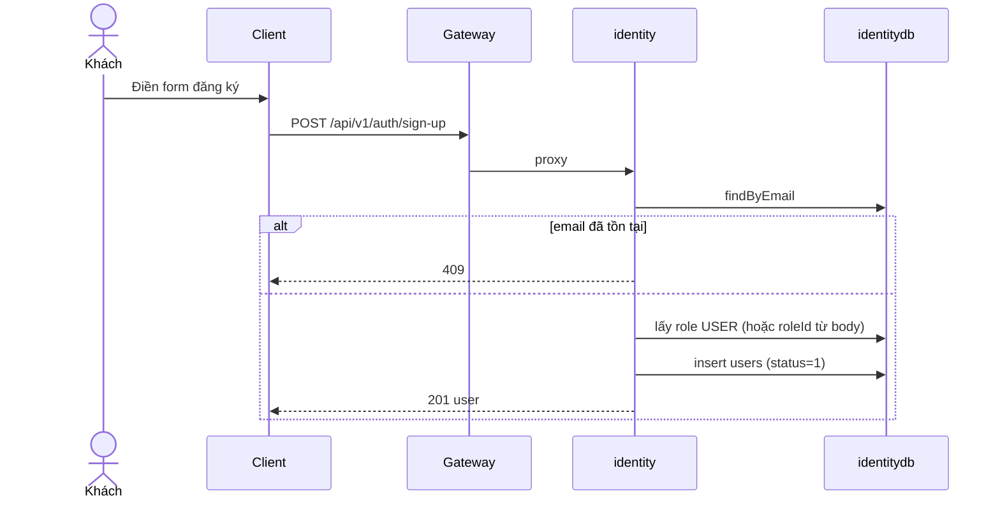
```mermaid
sequenceDiagram
  actor U as Khách
  participant FE as Client
  participant GW as Gateway
  participant ID as identity
  participant DB as identitydb
  U->>FE: Điền form đăng ký
  FE->>GW: POST /api/v1/auth/sign-up
  GW->>ID: proxy
  ID->>DB: findByEmail
  alt email đã tồn tại
    ID-->>FE: 409
  else
    ID->>DB: lấy role USER (hoặc roleId từ body)
    ID->>DB: insert users (status=1)
    ID-->>FE: 201 user
  end
```

### F02 — Đăng nhập email/mật khẩu
- **Actor:** người dùng, admin.
- **Luồng chính:**
  1. `POST /api/v1/auth/sign-in {email, password}` → `auth.service.ts > login()`.
  2. Tìm user. Kiểm tra status: 2 → 403 "Account banned"; 3 → 403 `ACCOUNT_PENDING_ACTIVATION` (BR-005); client hiện nút gửi lại email kích hoạt (F13).
  3. Kiểm tra password (null hoặc sai → 401) (BR-004).
  4. Ký access và refresh JWT `{userId, email, role: <tên role>}`. Lưu `sha256(refresh)` vào `auth_tokens` (type REFRESH). Set cookie `accessToken` (httpOnly, 15 phút).
  5. Trả `{user, access_token, refresh_token}`. Client lưu vào Zustand/localStorage (`FE/stores/useAuthStore.ts`).
- **Luồng lỗi:**
  - 401 sai thông tin.
  - 403 bị ban hoặc chưa kích hoạt. Thứ tự kiểm tra làm lộ trạng thái ban kể cả khi nhập sai mật khẩu.
- **Dữ liệu thay đổi:** `auth_tokens` (insert REFRESH).
- **File:** `ID/modules/auth/auth.controller.ts > login`, `auth.service.ts > login()`, `ID/utils/jwt.utils.ts`.

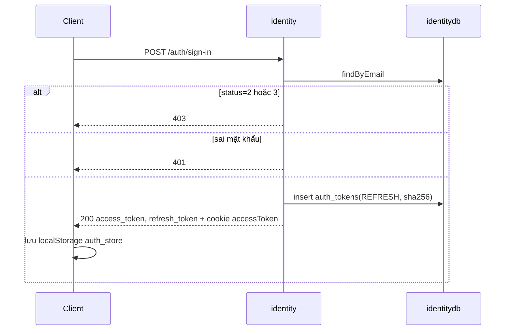
```mermaid
sequenceDiagram
  participant FE as Client
  participant ID as identity
  participant DB as identitydb
  FE->>ID: POST /auth/sign-in
  ID->>DB: findByEmail
  alt status=2 hoặc 3
    ID-->>FE: 403
  else sai mật khẩu
    ID-->>FE: 401
  else
    ID->>DB: insert auth_tokens(REFRESH, sha256)
    ID-->>FE: 200 access_token, refresh_token + cookie accessToken
    FE->>FE: lưu localStorage auth_store
  end
```

### F03 — Đăng nhập Google
- **Luồng chính:**
  1. `GET /auth/oauth/google?state` → trả `authorization_url`.
  2. Google redirect về `GET /auth/oauth/google/callback?code` → `google.service.ts > handleCallback()`:
     - Đổi code lấy token, gọi userinfo, lowercase email.
     - Nếu chưa có user: tạo user role USER, password = UUID ngẫu nhiên.
     - Nếu đã có: kiểm tra ban/pending; nếu Google báo email đã verified thì set `emailVerified=true`.
  3. Cấp token giống F02, trả JSON.
- **Luồng lỗi:**
  - Có query `error` → 400.
  - Thiếu `code` → 400 "no_code".
  - Google không trả email → 500.
  - Bị ban hoặc đang pending → 403.
- **Lưu ý:**
  - Không kiểm tra `state`.
  - Client gọi `/auth/oauth/google` **không có tiền tố `/api/v1`**, nên đi qua gateway sẽ bị 404. Route này chỉ tồn tại khi gọi thẳng identity (`/auth/*`). Xem 99.
- **File:** `ID/modules/oauth/*`, `FE/apis/auth/googleSignIn.ts`, `googleCallback.ts`.

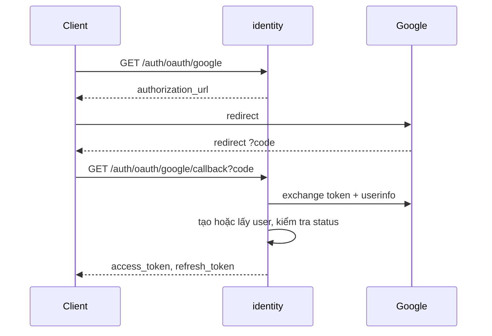
```mermaid
sequenceDiagram
  participant FE as Client
  participant ID as identity
  participant G as Google
  FE->>ID: GET /auth/oauth/google
  ID-->>FE: authorization_url
  FE->>G: redirect
  G-->>FE: redirect ?code
  FE->>ID: GET /auth/oauth/google/callback?code
  ID->>G: exchange token + userinfo
  ID->>ID: tạo hoặc lấy user, kiểm tra status
  ID-->>FE: access_token, refresh_token
```

### F04 — Làm mới token
1. Axios interceptor gặp 401 → `POST /api/v1/auth/refresh-token {refreshToken}` (`FE/libs/axiosClient.ts > onResponseError`).
2. identity `auth.service.ts > refreshAccessToken()`:
   - Verify JWT, tìm hash REFRESH còn hiệu lực, userId phải khớp.
   - **Revoke token cũ** rồi cấp cặp token mới với claim `role = user.roleId` (UUID).
3. Client lưu token mới và gửi lại request.
- **Luồng lỗi:** mọi lỗi → 401 → client logout và chuyển về `/sign-in?redirect=`.
- **Bug quan trọng:** sau khi refresh, claim `role` là UUID chứ không còn là `"admin"`, nên **admin mất quyền ở mọi service** cho tới khi đăng nhập lại (99, ISSUE-S05).
- **Dữ liệu thay đổi:** `auth_tokens` (update revokedAt cho token cũ, insert token mới).
- **File:** `ID/modules/auth/auth.service.ts > refreshAccessToken()` (khoảng dòng 189), `FE/libs/axiosClient.ts`.

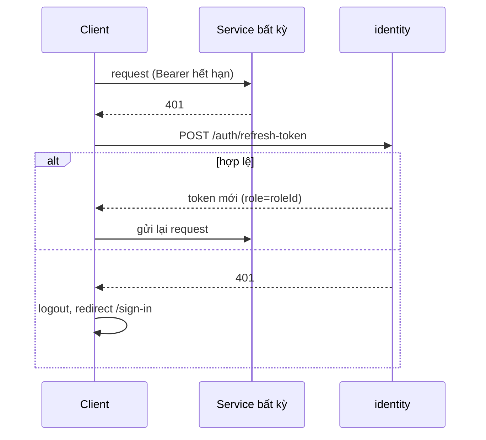
```mermaid
sequenceDiagram
  participant FE as Client
  participant X as Service bất kỳ
  participant ID as identity
  FE->>X: request (Bearer hết hạn)
  X-->>FE: 401
  FE->>ID: POST /auth/refresh-token
  alt hợp lệ
    ID-->>FE: token mới (role=roleId)
    FE->>X: gửi lại request
  else
    ID-->>FE: 401
    FE->>FE: logout, redirect /sign-in
  end
```

### F05 — Đăng xuất
- Server: `POST /api/v1/auth/logout` (cần JWT) → revoke mọi REFRESH của user, xoá cookie. Access token hiện tại **vẫn còn hiệu lực** tới khi hết hạn (`auth.service.ts > logout()`).
- Client gọi **`/api/v1/auth/sign-out`**, là route không tồn tại, nên server không revoke gì. Client vẫn tự xoá store (`FE/apis/auth/signOut.ts`, `FE/utils/logout.ts`). Xem 99.

### F06 — Đổi mật khẩu
- `POST /api/v1/auth/update-password {oldPassword, newPassword≥8}` (JWT) → so khớp mật khẩu cũ (sai → 400) → hash mật khẩu mới → revoke mọi REFRESH (`auth.service.ts > updatePassword()`).
- User tạo qua Google không đổi được mật khẩu (mật khẩu cũ không phải bcrypt).
- **[CHƯA HOÀN THIỆN] phía client:** `FE/apis/auth/updatePassword.ts` là file rỗng.

### F07 — Quên và đặt lại mật khẩu
1. `POST /api/v1/auth/request-password-reset {email}`:
   - Email không tồn tại → 404.
   - Có tồn tại → revoke token reset cũ, tạo token mới (TTL 1 giờ).
   - **Trả token thô trong response `data.reset_token`**. Không gửi email (99, ISSUE-S01).
2. `POST /api/v1/auth/reset-password {resetToken, newPassword≥8}` → token phải còn hiệu lực → set mật khẩu mới, đánh dấu đã dùng, revoke REFRESH.
- **Luồng lỗi:** token sai hoặc hết hạn → 400.
- **Client:** `/request-reset-password` rồi `/reset-password?reset_token=…`.
- **File:** `ID/modules/auth/auth.service.ts > requestPasswordReset(), resetPassword()`.

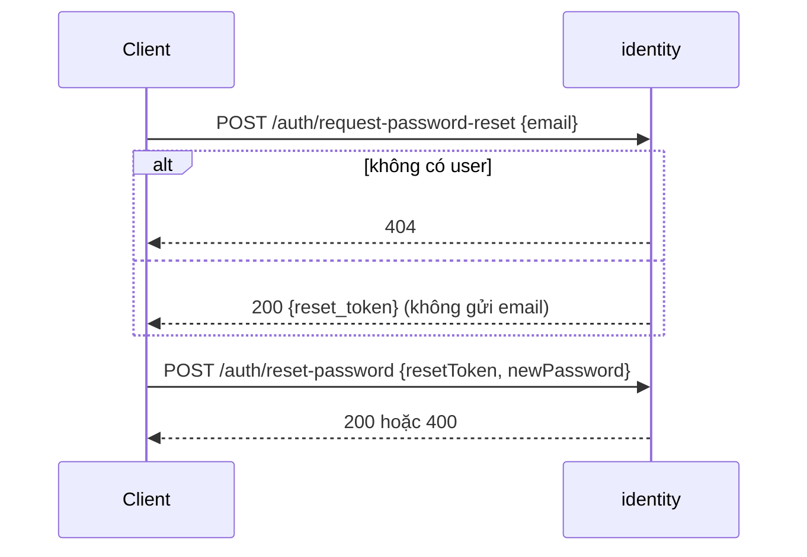
```mermaid
sequenceDiagram
  participant FE as Client
  participant ID as identity
  FE->>ID: POST /auth/request-password-reset {email}
  alt không có user
    ID-->>FE: 404
  else
    ID-->>FE: 200 {reset_token} (không gửi email)
  end
  FE->>ID: POST /auth/reset-password {resetToken, newPassword}
  ID-->>FE: 200 hoặc 400
```

### F08 — Cập nhật hồ sơ, vị trí, tuỳ chọn thông báo
- `PUT /api/v1/users/:id` (JWT) với các field avatar, name, bio, phone, gender, dateOfBirth, latitude/longitude (phải gửi cả cặp; cả cặp null thì xoá vị trí và địa chỉ), detailAddress, notificationPreferences (merge key hợp lệ), roleId (BR-020..BR-024).
- **Không kiểm tra `:id` có phải của chính người gọi hay không** (99, ISSUE-S03).
- Vị trí nhà được dùng để mời người dân ở gần khi campaign được duyệt hoặc gửi hoàn thành (F27, F33). Preference được dùng để lọc thông báo (F43).
- **Client:** `/profile/account`, `/profile/notification-settings`.
- **File:** `ID/modules/user/user.controller.ts > updateUser`, `user.service.ts > updateUser()`.

### F09 — Admin ban người dùng
1. Admin `/admin/users` → `GET /api/v1/users` (admin). Sau đó `PUT /api/v1/users/:id/ban {reject_reason}`.
2. `user.service.ts > adminBanUser()`:
   - Không được ban chính mình.
   - Đặt status=2 và rejectReason, revoke REFRESH.
   - Nếu user đã bị ban: lý do khác thì chỉ cập nhật lý do.
- **Hệ quả:** user không đăng nhập hoặc refresh được nữa, nhưng **access token còn hạn vẫn dùng được** vì `authenticate` ở mọi service không kiểm tra status. Không phát event sang service khác. **Không có chức năng gỡ ban.**
- **File:** `ID/modules/user/user.controller.ts > adminBanUser`, `user.service.ts > adminBanUser()`.

---

## B. Tổ chức và xác minh (Blue Tick)

### F10 — Đăng ký tổ chức: OTP → nháp → nộp
- **Mục đích:** lập hồ sơ xin tạo tổ chức, kèm danh sách owner. Thiết kế: [ORG_OWNERSHIP_FLOW.md](ORG_OWNERSHIP_FLOW.md).
- **Actor:** người nộp (ẩn danh, chứng minh sở hữu hòm mail; bắt buộc là một owner).
- **Luồng chính:**
  1. `/organizations/apply` → `POST /api/v1/organization-applications/email-otp {email}`:
     - Rate limit 3 lần/email/giờ và 10 lần/IP/giờ (BR-050).
     - Tạo OTP 6 số (lưu hash) và LINK token, TTL 10 phút; gửi `ORG_APPLICATION_OTP` kèm link `…/organizations/apply?t=<link>`.
  2. (Tuỳ chọn) mở link → `GET /email-otp/link?token` → biết email.
  3. `POST /email-otp/verify {email, otp}` (BR-054):
     - Sai → tăng số lần thử; ≥5 → 429.
     - Đúng → `openDraftForEmail()`: đã có đơn mở của email đó thì trả lại (`resumed=true`, BR-061); chưa có thì tạo đơn `DRAFT` (code `ORG-XXXXXXXX`, `submitterEmail`, `contactEmail` = email đó, `emailVerifiedAt`) kèm một owner là người nộp.
     - Đơn **mới** → gửi `ORG_APPLICATION_DRAFT_STARTED` (fire-and-forget) kèm `buildApplicationEditUrl(id, token)`; đơn mở lại → không gửi (BR-317).
     - Trả `{application_id, tracking_token (180 ngày), resumed}`. Client chuyển sang `/organizations/apply/edit/:id?token=`.
  4. Soạn nháp (lặp lại được, DRAFT hoặc NEEDS_REVISION — BR-067):
     - Giấy tờ: `POST /:id/documents/presign?token=` → chữ ký Cloudinary `authenticated` (BR-056) → trình duyệt upload thẳng.
     - `PUT /:id?token= {org_type?, profile?, channels?, legal_representative?, owners?, document_ids?, remove_document_ids?, consent?}` (`saveDraft()`): chỉ kiểm tra hình thức; gắn / gỡ giấy tờ; đồng bộ `owners` theo email (BR-069, BR-311). Client upload logo / ảnh bìa lên Cloudinary trước khi gửi.
  5. `POST /:id/submit?token= {consent?}` (`submitApplication()`):
     - Validate đủ (BR-057..BR-060, BR-069), owner đã DECLINED còn trong danh sách → 422 (BR-303).
     - Kiểm tra chặn sớm (BR-300..BR-302): identity `POST /internal/v1/users/lookup-by-emails`, đếm membership vai owner, đếm ứng tuyển ở đơn khác, `owner_invite_blocks`.
     - Transaction có `SELECT … FOR UPDATE` trên đơn: so snapshot để reset xác nhận (BR-306); người nộp → CONFIRMED với IP/UA (BR-304); owner cần link → token mới 14 ngày (BR-305); không còn ai chưa xác nhận → `PENDING_REVIEW`, ngược lại `AWAITING_OWNER_CONFIRMATION`; ghi `submittedAt`, `confirmationSnapshot`, event SUBMITTED / RESUBMITTED (kèm `changedFields`), `OWNER_CONFIRMATIONS_RESET`, `READY_FOR_REVIEW`.
     - Sau commit: `ORG_OWNER_CONFIRMATION_REQUEST` cho từng owner vừa có link; lần nộp đầu gửi thêm `ORG_APPLICATION_RECEIVED` (tracking token mới).
- **Luồng lỗi:**
  - 429 rate limit / thử OTP quá số lần; 503 không gửi được OTP hoặc không gọi được identity lúc nộp.
  - 401 TRACKING_TOKEN_INVALID; 404 đơn không thuộc email của token.
  - 409 ORGANIZATION_APPLICATION_NOT_EDITABLE.
  - 400 thiếu consent, sai orgType / channel / profile; 422 lỗi danh sách owner, OWNER_SUSPENDED, OWNER_QUOTA_EXCEEDED, TOO_MANY_PENDING_INVITES, OWNER_INVITE_BLOCKED, OWNER_DECLINED_MUST_BE_REPLACED; 404 / 422 giấy tờ.
- **Dữ liệu thay đổi:** `organization_application_otps` (OTP, LINK, TRACKING), `organization_applications`, `organization_application_owners`, `organization_application_documents`, `organization_application_events`.
- **File:** `INC/modules/organization_application/organization-application-otp.service.ts`, `organization-application.service.ts > openDraftForEmail(), saveDraft(), syncOwners(), submitApplication(), assertOwnersEligible()`, `owner-candidates.ts`, `FE/app/(pages)/(main)/organizations/apply/_context/ApplicationContext.tsx`.

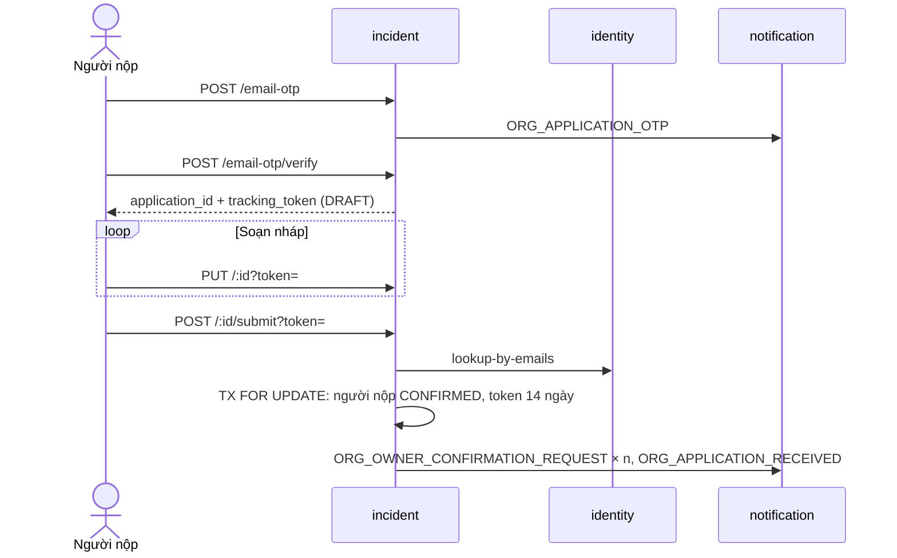
```mermaid
sequenceDiagram
  actor U as Người nộp
  participant INC as incident
  participant ID as identity
  participant NS as notification
  U->>INC: POST /email-otp
  INC->>NS: ORG_APPLICATION_OTP
  U->>INC: POST /email-otp/verify
  INC-->>U: application_id + tracking_token (DRAFT)
  loop Soạn nháp
    U->>INC: PUT /:id?token=
  end
  U->>INC: POST /:id/submit?token=
  INC->>ID: lookup-by-emails
  INC->>INC: TX FOR UPDATE: người nộp CONFIRMED, token 14 ngày
  INC->>NS: ORG_OWNER_CONFIRMATION_REQUEST × n, ORG_APPLICATION_RECEIVED
```

### F11 — Owner xác nhận / từ chối / hết hạn; nộp lại
- **Actor:** owner được mời (không cần đăng nhập), hệ thống (sweeper), người nộp.
- **Luồng chính:**
  1. Owner mở `/organizations/owner-confirm?token=` → `GET /api/v1/organization-applications/owner-confirmations/:token` (JWT tuỳ chọn qua `optionalAuthenticate`; email phiên khác email owner → `session_email_mismatch: true`).
  2. **Xác nhận** `POST …/:token/confirm` (BR-308): khoá đơn, kiểm tra thứ tự bị gỡ → đã từ chối → đơn không còn chờ → hết hạn; đặt CONFIRMED, lưu `confirmIp`, `confirmUa`, event `OWNER_CONFIRMED`. Không còn ai chưa xác nhận và đơn đang AWAITING → `PENDING_REVIEW` + event `READY_FOR_REVIEW` trong cùng transaction. Bấm lại → `already_done`.
  3. **Tôi không liên quan** `POST …/:token/decline {reason?, block_future?}` (BR-309): owner → DECLINED, đơn → NEEDS_REVISION (`reviewNote = "Owner … không xác nhận."`), tuỳ chọn ghi `owner_invite_blocks`, event `OWNER_DECLINED`; người nộp nhận `ORG_OWNER_DECLINED`.
  4. **Hết hạn** (BR-310): worker incident chạy `expireOverdue()` mỗi giờ; mỗi đơn xử lý trong transaction có khoá: owner PENDING quá hạn → EXPIRED, đơn → NEEDS_REVISION, event `OWNER_EXPIRED`, người nộp nhận `ORG_OWNER_CONFIRMATION_EXPIRED`.
  5. **Gửi lại** `POST /:id/owners/:candidateId/resend?token=` (BR-307): token mới, hạn mới, event `OWNER_INVITE_RESENT`.
  6. **Nộp lại**: người nộp sửa ở trình soạn nháp (gỡ / thay owner), rồi `POST /:id/submit` như F10 bước 5.
- **File:** `INC/modules/organization_application/owner-confirmation.service.ts`, `owner-confirmation-expiry.job.ts`, `INC/worker.ts`, `organization-application.service.ts > resendOwnerInvite()`, `FE/app/(pages)/(main)/organizations/owner-confirm/page.tsx`.

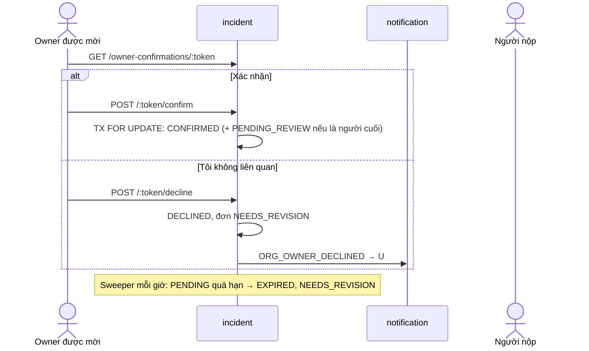
```mermaid
sequenceDiagram
  actor O as Owner được mời
  participant INC as incident
  participant NS as notification
  actor U as Người nộp
  O->>INC: GET /owner-confirmations/:token
  alt Xác nhận
    O->>INC: POST /:token/confirm
    INC->>INC: TX FOR UPDATE: CONFIRMED (+ PENDING_REVIEW nếu là người cuối)
  else Tôi không liên quan
    O->>INC: POST /:token/decline
    INC->>INC: DECLINED, đơn NEEDS_REVISION
    INC->>NS: ORG_OWNER_DECLINED → U
  end
  Note over INC: Sweeper mỗi giờ: PENDING quá hạn → EXPIRED, NEEDS_REVISION
```

### F12 — Thẩm định và duyệt đơn: Blue Tick, tạo tổ chức, gắn vai owner
- **Actor:** admin.
- **Điều kiện tiên quyết:** đơn ở `PENDING_REVIEW` (admin không thấy DRAFT / AWAITING — BR-071).
- **Luồng chính:**
  1. `GET /api/v1/admin/organization-applications` (loại DRAFT, AWAITING) và `GET /:id`: kèm `owners[]` với `confirm_ip`, `confirm_ua`, `account` (từ identity `lookup-by-emails`; lỗi thì để null), `active_owner_org_count`, `same_ip_cluster` (≥ 2 owner cùng IP trong 5 phút).
  2. **Claim** `PUT /:id/claim`: ghi `reviewerId`, không đổi status (BR-070).
  3. **Yêu cầu bổ sung** `PUT /:id/request-info {message}` → NEEDS_REVISION, email `ORG_APPLICATION_NEEDS_INFO` tới `submitterEmail` kèm tracking token mới.
  4. **Từ chối** `PUT /:id/decision {decision: REJECT, reject_reason}` (khoá đơn, kiểm lại PENDING_REVIEW) → REJECTED, email `ORG_APPLICATION_REJECTED`.
  5. **Duyệt** `PUT /:id/decision {decision: APPROVE, lane, documents_waived?, documents_waived_reason?, grant_blue_tick?}` (BR-074..BR-077, BR-312):
     - Identity `POST /internal/v1/users/ensure` cho mọi owner (**ngoài** transaction); có user status 2 → OWNER_SUSPENDED.
     - Transaction: `FOR UPDATE` đơn; kiểm lại PENDING_REVIEW và mọi owner CONFIRMED; tạo `organizations` (`isEmailVerified` chỉ khi contactEmail = submitterEmail — BR-313) và `organization_channels`; với từng owner `assertOwnerQuota()` (`pg_advisory_xact_lock(hashtextextended(userId,0))` rồi đếm) và `grantMembership()` vai `LEGAL_REPRESENTATIVE` / `OWNER`, ghi `resolvedUserId`, `emitOutbox(ORG_OWNER_ONBOARD, dedupKey = ORG_OWNER_ONBOARD:<candidateId>)`; đơn → APPROVED; event APPROVED (+ DOCUMENTS_WAIVED).
     - COMMIT chạy trigger `ORG_MUST_HAVE_OWNER` (BR-315).
  6. Outbox relay → `OrganizationOwnerOnboardPublisher` (BR-079): identity `POST /internal/v1/users/:id/activation-token`; có token → email `ACCOUNT_ACTIVATION` (`/activate-account?token=`); không có (user đã active) → `ORG_OWNER_ATTACHED` với link trang tổ chức; event `OWNER_ATTACHED`.
- **Luồng lỗi:** 404 đơn ẩn / không có; 409 NOT_PENDING_REVIEW, OWNERS_NOT_ALL_CONFIRMED, ORGANIZATION_APPLICATION_CLAIMED, ALREADY_DECIDED; 422 OWNER_QUOTA_EXCEEDED (rollback toàn bộ), OWNER_SUSPENDED; 503 identity lỗi; 400 thiếu lane / lý do / giấy tờ. Publisher lỗi → relay retry theo backoff.
- **Dữ liệu thay đổi:** `organizations`, `organization_channels`, `organization_members`, `organization_applications`, `organization_application_owners`, `organization_application_events`, `outbox_events`; identity `users`, `auth_tokens`.
- **File:** `INC/modules/organization_application/organization-application-admin.service.ts > list(), getById(), claim(), requestMoreInfo(), approve(), reject()`, `INC/modules/organization/organization-membership.service.ts`, `organization-owner-onboard.publisher.ts`, `identity-owner.client.ts`, `INC/outbox/outbox-relay.bootstrap.ts`, `ID/internal/internal.routes.ts`.

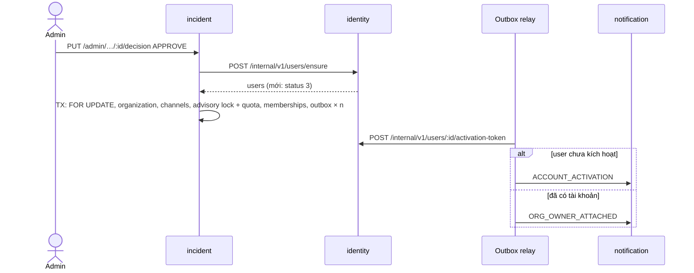
```mermaid
sequenceDiagram
  actor A as Admin
  participant INC as incident
  participant ID as identity
  participant RL as Outbox relay
  participant NS as notification
  A->>INC: PUT /admin/…/:id/decision APPROVE
  INC->>ID: POST /internal/v1/users/ensure
  ID-->>INC: users (mới: status 3)
  INC->>INC: TX: FOR UPDATE, organization, channels, advisory lock + quota, memberships, outbox × n
  RL->>ID: POST /internal/v1/users/:id/activation-token
  alt user chưa kích hoạt
    RL->>NS: ACCOUNT_ACTIVATION
  else đã có tài khoản
    RL->>NS: ORG_OWNER_ATTACHED
  end
```

### F13 — Kích hoạt tài khoản owner mới và gửi lại email kích hoạt
- `/activate-account?token` → client validate password ≥8 và khớp ô xác nhận → `POST /api/v1/auth/activate-account {token, new_password}`.
- identity `activateAccount()`: token `ACCOUNT_ACTIVATION` còn hiệu lực **và** user đang `PENDING_ACTIVATION` → set password, status=1, đánh dấu token đã dùng, revoke REFRESH (BR-011).
- **Gửi lại:** đăng nhập gặp `ACCOUNT_PENDING_ACTIVATION` → client hiện nút → `POST /api/v1/auth/activation/resend {email}` (BR-016): luôn 200; nếu user chờ kích hoạt và chưa quá 3 token/giờ thì phát token mới và identity gọi notification-service `POST /api/v1/notifications/jobs` (kind `ACCOUNT_ACTIVATION`).
- **File:** `ID/modules/auth/auth.service.ts > activateAccount(), requestActivationResend()`, `ID/modules/auth/account-activation-notify.client.ts`, `FE/apis/auth/activateAccount.ts`, `FE/app/(pages)/(auth)/activate-account/page.tsx`, `FE/app/(pages)/(auth)/sign-in/_components/SignInForm.tsx`.

### F14 — Người nộp theo dõi và rút đơn
- `/organizations/apply/status/:id?token=` → `GET /api/v1/organization-applications/:id?token=`: hồ sơ, giấy tờ, `owners[]` (trạng thái, còn bao nhiêu ngày, số lần gửi lại còn lại, `next_resend_at`), `confirmed_count / total_owners`, KYC người đại diện dạng rút gọn (4 số cuối).
- Rút: `POST /:id/withdraw?token=` ở mọi trạng thái mở, kể cả DRAFT (BR-068). Link chưa trả lời bị đặt hết hạn (giữ hash để trang xác nhận báo "đơn không còn hiệu lực"); owner đã xác nhận (trừ người nộp) nhận `ORG_APPLICATION_WITHDRAWN_NOTICE`.
- **File:** `organization-application.service.ts > getForApplicant(), withdrawApplication()`, `FE/app/(pages)/(main)/organizations/apply/status/page.tsx`, `_components/OwnerConfirmations.tsx`.

### F15 — Xác minh email liên hệ tổ chức
- **Kích hoạt khi:**
  - Tạo tổ chức qua route nội bộ `POST /api/v1/organizations` (x-internal-api-key, luồng legacy).
  - Owner đổi `contactEmail` (F16).
  - Owner bấm gửi lại (`POST /:id/resend-contact-email`).
- **Luồng:**
  1. incident gọi identity `POST /internal/v1/organization-contact-email/tokens` → token 72h, revoke token cũ của tổ chức.
  2. Gửi email `ORGANIZATION_CONTACT_VERIFY` với link `PUBLIC_INCIDENT_API_URL/api/v1/organizations/verify-contact-email?token=…`.
  3. Người nhận click → identity `…/tokens/verify` (dùng 1 lần) → kiểm tra email khớp → `isEmailVerified=true` → **302** về `/organizations/<slug>?verifiedEmail=1`.
  4. Nếu lỗi: 302 về `/organizations/email-verified?error=invalid_or_expired|not_found|mismatch`.
- **Lỗi khi resend:** 400 không có email hoặc email đã xác minh, 403 không phải owner, 502 gửi email lỗi.
- Tổ chức tạo qua duyệt đơn (F12) có `isEmailVerified` = true ngay.
- **File:** `INC/modules/organization/organization.service.ts > queueOrganizationContactVerificationEmail(), confirmOrganizationContactEmail(), resendOrganizationContactVerificationEmail()`, `identity-organization-contact-email.client.ts`, `ID/modules/auth/auth.service.ts > createOrganizationContactEmailToken(), verifyAndConsumeOrganizationContactEmailToken()`.

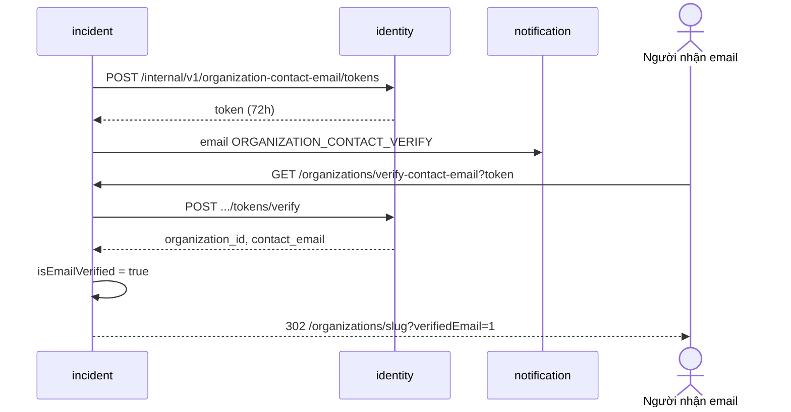
```mermaid
sequenceDiagram
  participant INC as incident
  participant ID as identity
  participant NS as notification
  actor O as Người nhận email
  INC->>ID: POST /internal/v1/organization-contact-email/tokens
  ID-->>INC: token (72h)
  INC->>NS: email ORGANIZATION_CONTACT_VERIFY
  O->>INC: GET /organizations/verify-contact-email?token
  INC->>ID: POST .../tokens/verify
  ID-->>INC: organization_id, contact_email
  INC->>INC: isEmailVerified = true
  INC-->>O: 302 /organizations/slug?verifiedEmail=1
```

### F16 — Owner cập nhật thông tin tổ chức
- `PUT /api/v1/organizations/:id` (chỉ người có vai owner) với name, description*, logoUrl, backgroundUrl, contactEmail (BR-083).
- Kiểm tra tên + email không trùng với tổ chức khác (BR-081).
- Nếu contactEmail thay đổi: `isEmailVerified=false` và gửi link xác minh (F15). Email liên hệ không liên quan tới tài khoản đăng nhập nào.
- Enqueue dịch mô tả (F45).
- **File:** `organization.service.ts > updateOrganization()`.

### F17 — Admin duyệt hoặc ban tổ chức
- `PUT /api/v1/organizations/:id/verify {status: 1|2, reject_reason}`:
  - Duyệt (1): từ DRAFT, INACTIVE, INREVIEW, PENDING. Đang ACTIVE thì no-op.
  - Ban (2): phải có lý do. Nếu đã ban mà lý do khác thì chỉ cập nhật lý do.
- Gửi thông báo in-app `ORGANIZATION_APPROVED` hoặc `ORGANIZATION_REJECTED` tới **mọi owner**.
- **Không đổi** `trustTier` (Blue Tick không bị gỡ khi ban).
- **Hệ quả của ban:** `GET /by-slug` trả 404; `GET /:id` và danh sách vẫn trả về; tạo campaign **không** kiểm tra status của tổ chức (99).
- **File:** `organization.controller.ts > adminVerifyOrganization`, `organization.service.ts > adminVerifyOrganization()`, `notifyOwnerOfOrganizationVerified()`.

### F18 — Xin gia nhập, duyệt, huỷ, rời tổ chức
1. Người dùng: `POST /api/v1/organizations/:id/join-requests`.
   - Chưa có membership nào (kể cả vai owner), chưa có yêu cầu PENDING (BR-085).
   - Tạo PENDING và gửi thông báo `VOLUNTEER_REQUEST` cho **mọi owner**.
2. Owner (bất kỳ): `GET /:id/join-requests`, rồi `PUT /join-requests/process {requestId, approved}`:
   - Duyệt: trong 1 transaction, request APPROVED (14) và upsert `organization_members` vai `MEMBER`, `source = JOIN_REQUEST`. Gửi `VOLUNTEER_APPROVED`.
   - Từ chối: request REJECTED (18). Gửi `VOLUNTEER_REJECTED`.
3. Người xin: `DELETE /join-requests/cancel {requestId}` → xoá mềm (chỉ khi PENDING).
4. Thành viên: `DELETE /:id/members/me` → xoá mềm membership. Người có vai owner không được rời (owner cuối cùng → 409 ORG_MUST_HAVE_OWNER, còn lại 400 — BR-088).
- **Ý nghĩa của thành viên:** khi tổ chức tạo campaign, các thành viên nhận thông báo `CAMPAIGN_CREATED` (F25).
- **File:** `INC/modules/organization/organization.service.ts > createJoinRequest(), processJoinRequest(), cancelJoinRequest(), leaveOrganization()`.

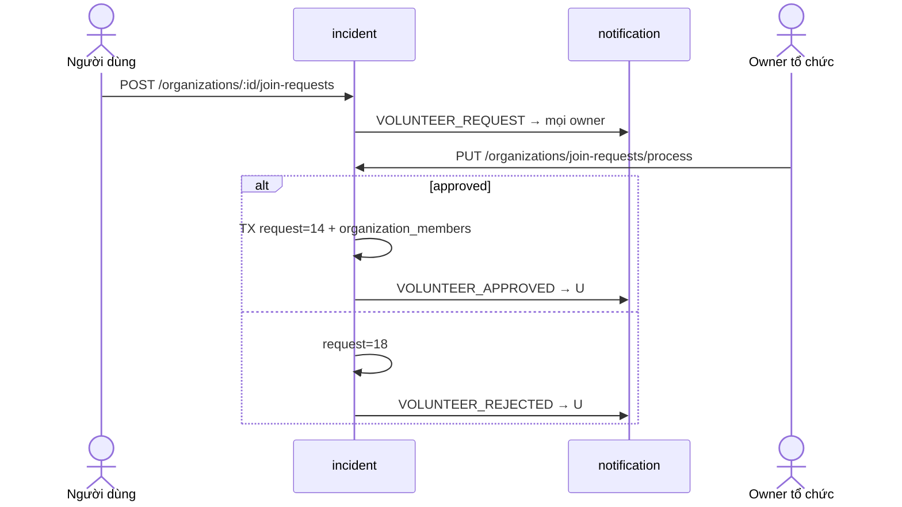
```mermaid
sequenceDiagram
  actor U as Người dùng
  participant INC as incident
  participant NS as notification
  actor O as Owner tổ chức
  U->>INC: POST /organizations/:id/join-requests
  INC->>NS: VOLUNTEER_REQUEST → mọi owner
  O->>INC: PUT /organizations/join-requests/process
  alt approved
    INC->>INC: TX request=14 + organization_members
    INC->>NS: VOLUNTEER_APPROVED → U
  else
    INC->>INC: request=18
    INC->>NS: VOLUNTEER_REJECTED → U
  end
```

---

## C. Báo cáo sự cố (report / incident)

### F19 — Tạo báo cáo sự cố và phân tích AI
- **Actor:** người dùng đã đăng nhập. Tạo qua form web hoặc qua chat AI (F47).
- **Luồng chính:**
  1. `/incidents/create`: chọn 1–10 ảnh, nén ảnh, upload Cloudinary lấy URL. Chọn vị trí trên bản đồ, severity 1–5.
  2. `POST /api/v1/reports {title, description?, wasteType?, severityLevel, latitude, longitude, detailAddress?, imageUrls[]}` (BR-100).
  3. `report.service.ts > createReport()` chạy trong 1 transaction: report (status PENDING 12), `media` (type REPORT), `report_media_files`.
  4. Enqueue `ANALYZE_REPORT` và `TRANSLATE_TEXT` (best-effort; lỗi chỉ ghi log).
  5. Trả 201 kèm vote, trạng thái saved, hồ sơ người báo cáo.
  6. Worker `ReportAnalysisWorker` → `report-ai-analysis.service.ts > analyzeReport()`:
     - Gọi `AI_PREDICT_URL {image_urls}` (model nhận diện rác).
     - Gọi ai-service `POST /api/v1/recommendations/report` → gợi ý Markdown tiếng Việt (lỗi thì bỏ qua).
     - Trong 1 transaction: media AI_PREDICT, `ai_analysis_logs`, `aiVerified=true`, `aiRecommendation`.
- **Luồng lỗi:**
  - Validate → 400. Mọi lỗi khác khi tạo → 500.
  - AI predict lỗi → job retry, tối đa 5 lần rồi FAILED. Report vẫn tồn tại với `aiVerified=false`.
  - Client xem tiến độ AI qua `GET /reports/:id/background-jobs/status`.
- **Dữ liệu thay đổi:** `reports`, `media`, `report_media_files`, `background_jobs`, `ai_analysis_logs`.
- **File:** `INC/modules/report/report.controller.ts > createReport`, `report.service.ts > createReport()`, `report-ai-analysis.service.ts`, `INC/queue/worker/report-analysis-worker.ts`, `AI/recommendation/*`, `FE/apis/report/*`.

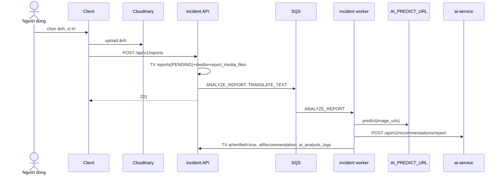
```mermaid
sequenceDiagram
  actor U as Người dùng
  participant FE as Client
  participant CLD as Cloudinary
  participant INC as incident API
  participant Q as SQS
  participant W as incident worker
  participant P as AI_PREDICT_URL
  participant AI as ai-service
  U->>FE: chọn ảnh, vị trí
  FE->>CLD: upload ảnh
  FE->>INC: POST /api/v1/reports
  INC->>INC: TX reports(PENDING)+media+report_media_files
  INC->>Q: ANALYZE_REPORT, TRANSLATE_TEXT
  INC-->>FE: 201
  Q->>W: ANALYZE_REPORT
  W->>P: predict(image_urls)
  W->>AI: POST /api/v1/recommendations/report
  W->>INC: TX aiVerified=true, aiRecommendation, ai_analysis_logs
```

### F20 — Chủ report sửa, thêm ảnh, xoá ảnh, xoá report
- Chỉ **chủ report**. Admin bị cấm. Report đã bị ban không sửa được (BR-104).
- Các thao tác:
  - `PUT /reports/:id`: cập nhật field và enqueue dịch lại.
  - `POST /reports/:id/media {imageUrls}`: thêm ảnh, đặt lại `status=PENDING` và `aiVerified=false`, enqueue ANALYZE_REPORT cho ảnh mới.
  - `DELETE /reports/:id/media/:mediaFileId`: xoá mềm ảnh.
  - `DELETE /reports/:id`: xoá mềm report.
- **Bug:** thêm ảnh vào report đã được duyệt làm report kẹt ở PENDING, vì verify sẽ là no-op khi `isVerify=true` (99).
- **File:** `report.service.ts > updateReport(), addReportImages(), deleteReportMediaFile(), deleteReport(), assertReporterMayEditReport()`.

### F21 — Admin duyệt hoặc ban report
- `/admin/incidents`:
  - `PUT /reports/:id/verify` → `status=TODO(21)`, `isVerify=true`, xoá rejectReason. Gửi thông báo `REPORT_APPROVED` cho chủ report. Đã duyệt thì no-op.
  - `PUT /reports/:id/ban {reject_reason}` → `status=INACTIVE(2)`. Gửi `REPORT_REJECTED`. Nếu đã ban thì chỉ cập nhật lý do, không gửi thông báo.
- Report ở TODO mới được gắn vào campaign (F25).
- **File:** `report.service.ts > adminVerifyReport(), adminBanReport()`, `report-status-notify.client.ts`.

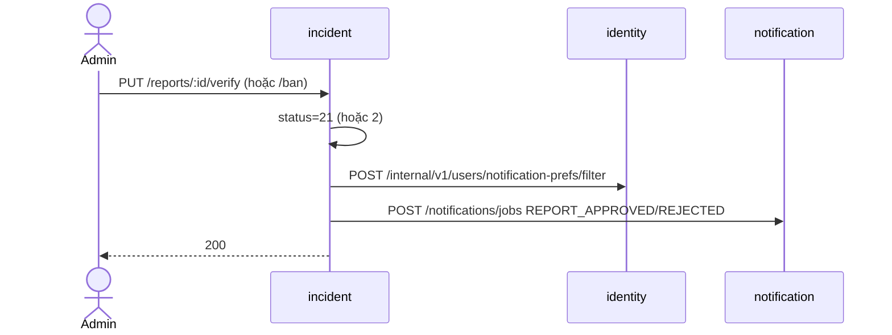
```mermaid
sequenceDiagram
  actor A as Admin
  participant INC as incident
  participant ID as identity
  participant NS as notification
  A->>INC: PUT /reports/:id/verify (hoặc /ban)
  INC->>INC: status=21 (hoặc 2)
  INC->>ID: POST /internal/v1/users/notification-prefs/filter
  INC->>NS: POST /notifications/jobs REPORT_APPROVED/REJECTED
  INC-->>A: 200
```

### F22 — Admin đánh dấu report đã xử lý và cộng điểm
- `PUT /reports/:id/mark-done` (admin):
  - Trong 1 transaction: `status=COMPLETED(17)` và outbox `REPORT_COMPLETION_GREEN_POINTS {reportId, userId, points = env REPORT_COMPLETION_GREEN_POINTS (mặc định 0)}`, dedup theo reportId.
  - Sau transaction: gửi thông báo `REPORT_STATUS {status: COMPLETED}` cho chủ report.
- Không kiểm tra trạng thái nguồn. Report PENDING hoặc đã bị ban vẫn được COMPLETED (99).
- Report cũng tự chuyển COMPLETED khi campaign chứa nó được duyệt hoàn thành (F34). Nhánh đó **không** phát outbox điểm cho report.
- Reward xử lý event: xem F36.
- **File:** `report.service.ts > adminMarkReportDone()`, `report.repository.ts > markReportAsDone()`, `INC/outbox/outbox.writer.ts`.

### F23 — Vote report/campaign và thưởng mốc vote
- `POST /api/v1/incident/votes/upvote|downvote {resourceId, resourceType}`. Vote hoạt động theo kiểu toggle (BR-130).
- Khi upvote một report có chủ và giá trị mới = 1: đếm số upvote, ghi outbox `REPORT_VOTE_MILESTONE_GREEN_POINTS {reportId, reportCreatorUserId, voteCount}`, dedup theo (reportId, voteCount).
- Reward tính điểm dựa vào ngưỡng mốc (F36).
- Tự vote cho report của mình vẫn được.
- **File:** `INC/modules/vote/vote.service.ts > upvote(), downvote(), emitReportVoteMilestoneIfNeeded()`.

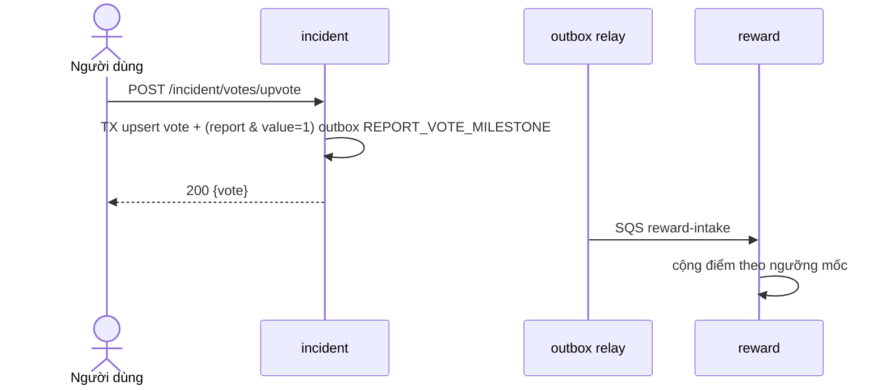
```mermaid
sequenceDiagram
  actor U as Người dùng
  participant INC as incident
  participant RL as outbox relay
  participant RW as reward
  U->>INC: POST /incident/votes/upvote
  INC->>INC: TX upsert vote + (report & value=1) outbox REPORT_VOTE_MILESTONE
  INC-->>U: 200 {vote}
  RL->>RW: SQS reward-intake
  RW->>RW: cộng điểm theo ngưỡng mốc
```

### F24 — Lưu (bookmark) report/campaign
- `POST /api/v1/incident/saved-resources/save {resourceId, resourceType}` hoạt động kiểu toggle: tạo mới, khôi phục, hoặc xoá mềm.
- `GET /api/v1/incident/saved-resources` → danh sách phân trang, kèm dữ liệu đầy đủ của report hoặc campaign.
- Dùng khi tạo campaign: chọn nhanh các report đã lưu.
- **File:** `INC/modules/saved_resource/*`.

---

## D. Chiến dịch (campaign)

### F25 — Tạo chiến dịch
- **Actor:** user có membership vai `LEGAL_REPRESENTATIVE` hoặc `OWNER` trong tổ chức.
- **Điều kiện tiên quyết:**
  - Tổ chức tồn tại (không kiểm tra status).
  - Difficulty có tier tương ứng ở reward.
  - Các report được gắn phải ở TODO và chưa thuộc campaign nào (BR-150..BR-153).
- **Luồng chính:**
  1. `/campaigns/create`: client tải `GET /organizations/my?is_owner=true`, `GET /reports/search?status=21`, `GET /incident/saved-resources`. Upload banner lên Cloudinary.
  2. `POST /api/v1/campaigns {organizationId, title, description?, banner?, startDate?, endDate?, detailAddress?, latitude?, longitude?, radiusKm?, difficulty, reportIds[]}`.
  3. `campaign.service.ts > createCampaign()`:
     - Kiểm tra org tồn tại và `organizationMemberRepository.isOwner(orgId, userId)` (BR-151).
     - Gọi reward `GET /internal/v1/difficulties/level/:l`.
     - `validateReportIds`.
     - Chạy transaction Serializable: tạo campaign (**PENDING 12**), upsert người tạo vào `campaign_managers`, report TODO → INPROCESS (22) và gán `campaignId`.
  4. Enqueue `TRANSLATE_TEXT` (CAMPAIGN).
  5. Gửi thông báo `CAMPAIGN_CREATED` cho thành viên tổ chức (trừ người tạo), có lọc theo preference.
- **Luồng lỗi:**
  - 404 không có tổ chức; 403 không phải owner.
  - 400 difficulty không hợp lệ (cũng xảy ra khi reward service chết).
  - 400 reportIds không hợp lệ.
- **Dữ liệu thay đổi:** `campaigns`, `campaign_managers`, `reports`, `background_jobs`.
- **File:** `INC/modules/campaign/campaign.controller.ts > createCampaign`, `campaign.service.ts > createCampaign(), validateReportIds(), assignReportsToCampaign()`, `INC/modules/reward/reward-service.client.ts`.

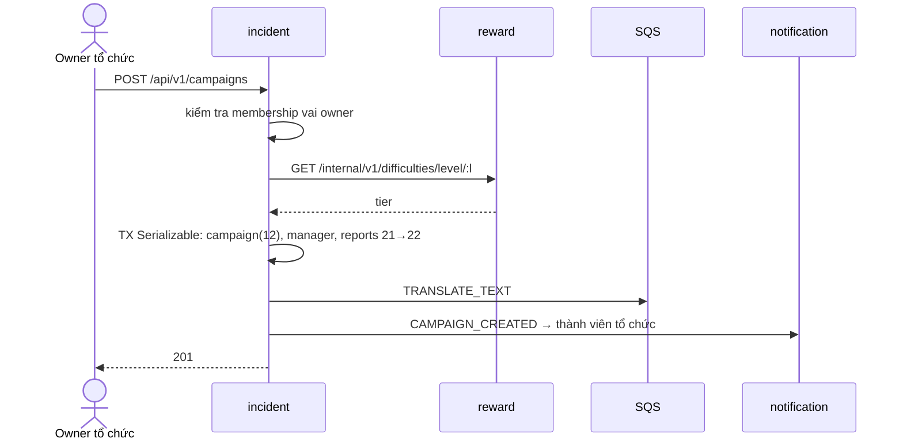
```mermaid
sequenceDiagram
  actor O as Owner tổ chức
  participant INC as incident
  participant RW as reward
  participant Q as SQS
  participant NS as notification
  O->>INC: POST /api/v1/campaigns
  INC->>INC: kiểm tra membership vai owner
  INC->>RW: GET /internal/v1/difficulties/level/:l
  RW-->>INC: tier
  INC->>INC: TX Serializable: campaign(12), manager, reports 21→22
  INC->>Q: TRANSLATE_TEXT
  INC->>NS: CAMPAIGN_CREATED → thành viên tổ chức
  INC-->>O: 201
```

### F26 — Sửa và xoá chiến dịch
- **Sửa:** `PUT /campaigns/:id`, **chỉ `createdBy`**. Body có thể gồm field bất kỳ, kể cả `status` là số tuỳ ý (**bỏ qua được bước duyệt của admin**, 99 ISSUE-S08), `reportIds` (thay toàn bộ; report bị gỡ trở về TODO), `managerIds` (đồng bộ, luôn giữ owner). Khi sửa **không enqueue dịch lại**.
- **Xoá:** `DELETE /campaigns/:id`, chỉ `createdBy`. Campaign bị xoá mềm; report gắn với nó trở về TODO và `campaignId=null`.
- **Client:** `UpdateCampaignPopover` có tồn tại nhưng không được render, nên UI hiện không có chỗ sửa campaign.
- **File:** `campaign.service.ts > updateCampaign(), deleteCampaign(), ensureOwner()`.

### F27 — Admin duyệt hoặc ban chiến dịch và mời người dân ở gần
- `/admin/campaigns` → `PUT /api/v1/campaigns/:id/verify {status: 1|2, reject_reason}`.
- **Duyệt (→ ACTIVE 1):**
  - Chỉ từ 12, 4, 5, 2 (BR-160).
  - Gửi thông báo `CAMPAIGN_VERIFY_INVITE` cho người dân **trong bán kính 5 km**, gồm:
    - user có vị trí nhà gần đó (identity `nearby-ids`),
    - người từng gửi report có toạ độ gần đó (PostGIS).
  - Trừ admin, người tạo và manager. Có lọc preference. Nếu campaign không có toạ độ thì bỏ qua bước mời.
- **Ban (→ INACTIVE 2):**
  - Chỉ từ 12, 4, 5, 1; bắt buộc có lý do.
  - Trong transaction: gỡ report (INPROCESS → TODO).
  - **Không gửi thông báo.**
- **File:** `campaign.controller.ts > adminVerifyCampaign`, `campaign.service.ts > adminVerifyCampaign(), banCampaignAndUnlinkReports(), notifyNearbyCitizensToJoinApprovedCampaign()`, `ID/internal/internal.routes.ts (nearby-ids)`.

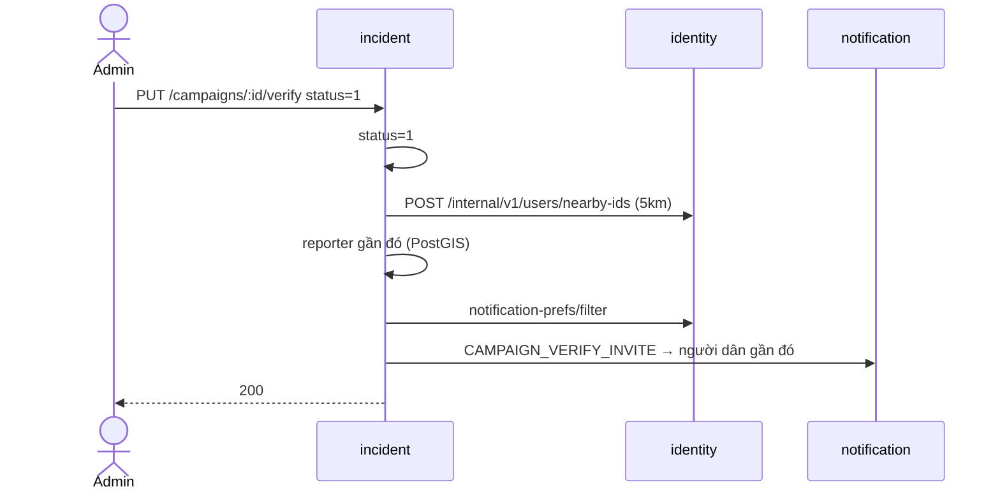
```mermaid
sequenceDiagram
  actor A as Admin
  participant INC as incident
  participant ID as identity
  participant NS as notification
  A->>INC: PUT /campaigns/:id/verify status=1
  INC->>INC: status=1
  INC->>ID: POST /internal/v1/users/nearby-ids (5km)
  INC->>INC: reporter gần đó (PostGIS)
  INC->>ID: notification-prefs/filter
  INC->>NS: CAMPAIGN_VERIFY_INVITE → người dân gần đó
  INC-->>A: 200
```

### F28 — Tình nguyện viên xin tham gia chiến dịch
1. `POST /api/v1/campaigns/volunteers/join-requests {campaignId}`:
   - Campaign phải tồn tại (không kiểm tra status).
   - Chưa có yêu cầu nào chưa bị xoá của cùng người (BR-170).
   - Tạo PENDING và gửi thông báo `VOLUNTEER_REQUEST` cho các manager.
2. Manager (có trong bảng `campaign_managers`): `GET /volunteers/join-requests?campaignId`, rồi `PUT /volunteers/join-requests/process {requestId, approved}`:
   - Duyệt: kiểm tra **sức chứa** — số APPROVED phải < `maxVolunteers` của tier difficulty, gọi reward (BR-172). Đạt thì → APPROVED (14) và gửi `VOLUNTEER_APPROVED`.
   - Từ chối: **xoá mềm** (không lưu REJECTED), gửi `VOLUNTEER_REJECTED`.
3. Người xin có thể huỷ khi còn PENDING: `DELETE /volunteers/join-requests/cancel`.
- **Không có API rời campaign** sau khi đã được duyệt.
- **File:** `INC/modules/campaign/campaign_joining_request/campaign_joining_request.service.ts`, `INC/modules/reward/reward-service.client.ts > assertCampaignHasCapacityForJoinApproval()`.

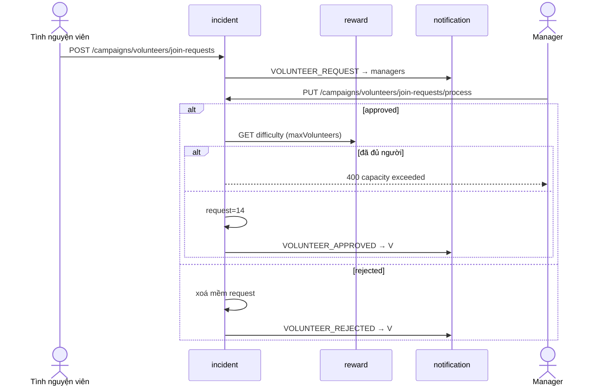
```mermaid
sequenceDiagram
  actor V as Tình nguyện viên
  participant INC as incident
  participant RW as reward
  participant NS as notification
  actor M as Manager
  V->>INC: POST /campaigns/volunteers/join-requests
  INC->>NS: VOLUNTEER_REQUEST → managers
  M->>INC: PUT /campaigns/volunteers/join-requests/process
  alt approved
    INC->>RW: GET difficulty (maxVolunteers)
    alt đã đủ người
      INC-->>M: 400 capacity exceeded
    else
      INC->>INC: request=14
      INC->>NS: VOLUNTEER_APPROVED → V
    end
  else rejected
    INC->>INC: xoá mềm request
    INC->>NS: VOLUNTEER_REJECTED → V
  end
```

### F29 — Quản lý manager của chiến dịch
- `POST /campaigns/:id/add-managers {userIds[]}`, `POST /:id/remove-manager`, `GET /:id/managers`.
- Người được làm: `createdBy` hoặc manager hiện tại (`canManageCampaign`).
- Không kiểm tra user có tồn tại hay không. Manager có thể gỡ cả người tạo khỏi bảng manager (99).
- **File:** `INC/modules/campaign/campaign_manager/campaign_manager.service.ts`.

### F30 — Quản lý task
1. `POST /campaigns/:id/tasks` (canManage) → task TODO (21), priority 1..3.
2. `POST /campaigns/tasks/:taskId/assign {volunteerId}`: volunteer phải APPROVED. Nếu task đang ở TODO thì chuyển sang INPROCESS (22).
3. `PUT /campaigns/tasks/:taskId`:
   - Field của task: chỉ canManage được sửa.
   - `result {description, file[]}`: volunteer được giao hoặc canManage. File được **thay toàn bộ**, tạo Media `CAMPAIGN_TASK_RESULT`.
4. `PUT /campaigns/tasks/:taskId/status {status}` (volunteer được giao) nhận số tuỳ ý. UI yêu cầu phải có kết quả khi chọn COMPLETED.
5. `POST /tasks/:taskId/unassign`, `DELETE /tasks/:taskId` (xoá mềm). `GET /tasks/my-assigned` lấy task của mình.
- Điều kiện để gửi hoàn thành campaign: **mọi task phải ở COMPLETED (17)** (F33).
- **File:** `INC/modules/campaign/campaign_task/campaign_task.service.ts`, `FE/components/client/shared/PopoverCreateUpdateTask.tsx`.

### F31 — Điểm danh bằng QR
1. Manager: `POST /campaigns/:id/attendance-qr` (campaign phải ACTIVE) → JWT `{purpose: "campaign_attendance_qr_v1", campaignId}`, TTL 1 giờ. Client hiển thị mã QR.
2. Tình nguyện viên quét: `POST /campaigns/:id/attendance-check-in {token}`:
   - Token hợp lệ và đúng campaign.
   - Campaign đang ACTIVE.
   - Người quét đã được APPROVED.
   - Tạo `campaign_attendance_check_ins`. Idempotent nhờ unique (campaignId, userId).
- **Ý nghĩa:** chỉ volunteer **vừa APPROVED vừa đã check-in** mới nhận điểm khi campaign hoàn thành (F34).
- **Lỗi:** token sai hoặc hết hạn → 500 (bug); QR không đúng campaign → 400; không phải thành viên → 403.
- **File:** `INC/modules/campaign/campaign_attendance/campaign_attendance.service.ts`, `campaign_attendance_jwt.util.ts`.

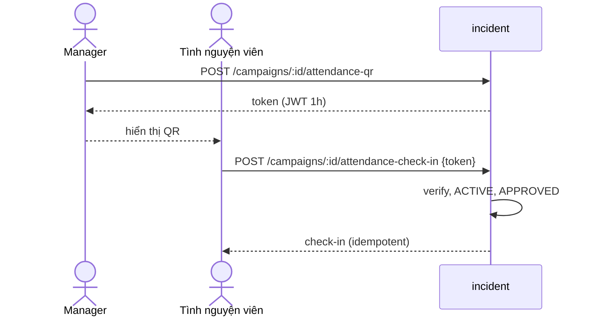
```mermaid
sequenceDiagram
  actor M as Manager
  actor V as Tình nguyện viên
  participant INC as incident
  M->>INC: POST /campaigns/:id/attendance-qr
  INC-->>M: token (JWT 1h)
  M-->>V: hiển thị QR
  V->>INC: POST /campaigns/:id/attendance-check-in {token}
  INC->>INC: verify, ACTIVE, APPROVED
  INC-->>V: check-in (idempotent)
```

### F32 — Gửi SOS và giải quyết SOS
- `POST /api/v1/sos {campaignId, content, phone}`: campaign phải ACTIVE và có toạ độ (BR-190). SOS lấy toạ độ và địa chỉ của campaign, status=1.
- `GET /api/v1/sos` (có lọc theo khoảng cách PostGIS nếu gửi lat/lng). Trang `/maps` poll mỗi 10 giây.
- `PUT /api/v1/sos/:id/solved` → COMPLETED (17). **Người dùng đăng nhập bất kỳ đều làm được** (99).
- Khi campaign được duyệt hoàn thành, mọi SOS chưa xong của campaign chuyển COMPLETED.
- **Không có thông báo** nào khi tạo SOS.
- **File:** `INC/modules/sos/*`.

### F33 — Gửi hoàn thành chiến dịch và cộng đồng xác nhận
1. Manager (bảng `campaign_managers`): `PUT /campaigns/:id/mark-done`:
   - Campaign phải ở ACTIVE hoặc INREVIEW.
   - Mọi task đã COMPLETED (campaign 0 task vẫn qua).
   - → **WAITING_CONFIRMED (7)**.
2. Gửi thông báo:
   - `CAMPAIGN_COMPLETION_PENDING_ADMIN` tới danh sách user id trong env `CAMPAIGN_COMPLETION_ADMIN_NOTIFY_USER_IDS` (không lọc preference).
   - `CAMPAIGN_COMPLETION_VERIFY_INVITE` tới người dân trong bán kính 5 km (trừ người gửi, người tạo, manager, volunteer).
3. Cộng đồng: `POST /campaigns/:id/completion-verification {value: 1|-1}` (chỉ khi campaign ở 7 hoặc 17; gửi lại cùng giá trị thì huỷ). Kết quả **chỉ để admin tham khảo**, không tự động làm gì.
- **Lỗi:** status sai → 500 (message không được map); còn task chưa xong → 400.
- **File:** `campaign.service.ts > submitCampaignCompletionForAdminApproval()`, `campaign_completion_verification.service.ts > submit()`.

### F34 — Admin duyệt hoặc từ chối hoàn thành chiến dịch và trao điểm
- `PUT /campaigns/:id/completion-review {decision: approve|reject, rejectReason?}`.
- **Approve** (campaign phải ở 7):
  1. Kiểm tra lại mọi task đã COMPLETED; lấy tier difficulty từ reward.
  2. Xác định người nhận điểm = volunteer APPROVED **∩** đã check-in; mỗi người nhận `tier.greenPoints`.
  3. Transaction Serializable:
     - campaign → COMPLETED (17), rejectReason=null.
     - Mọi report của campaign → 17.
     - Mọi SOS → 17.
     - Outbox `CAMPAIGN_COMPLETION_GREEN_POINTS {campaignId, credits[]}` (nếu có người nhận), dedup theo campaignId.
  4. Sau commit:
     - `CAMPAIGN_DONE` tới **mọi** volunteer APPROVED (kể cả người không check-in).
     - `CAMPAIGN_COMPLETION_APPROVED_BY_ADMIN` tới mọi owner tổ chức.
  5. Relay đẩy event lên SQS `reward-intake`; reward cộng điểm (F36).
- **Reject** (campaign phải ở 7, cần lý do):
  - Campaign về **ACTIVE (1)** kèm rejectReason.
  - Gửi `CAMPAIGN_COMPLETION_REJECTED_BY_ADMIN` tới mọi owner.
- **[CHƯA HOÀN THIỆN]:** outbox `CAMPAIGN_FACEBOOK_RECOGNITION` bị comment (F48).
- **File:** `campaign.service.ts > adminFinalizeCampaignCompletion(), adminRejectCampaign()`, `INC/outbox/*`.

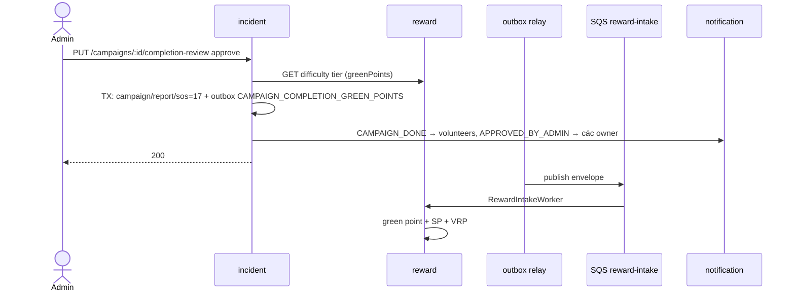
```mermaid
sequenceDiagram
  actor A as Admin
  participant INC as incident
  participant RW as reward
  participant RL as outbox relay
  participant Q as SQS reward-intake
  participant NS as notification
  A->>INC: PUT /campaigns/:id/completion-review approve
  INC->>RW: GET difficulty tier (greenPoints)
  INC->>INC: TX: campaign/report/sos=17 + outbox CAMPAIGN_COMPLETION_GREEN_POINTS
  INC->>NS: CAMPAIGN_DONE → volunteers, APPROVED_BY_ADMIN → các owner
  INC-->>A: 200
  RL->>Q: publish envelope
  Q->>RW: RewardIntakeWorker
  RW->>RW: green point + SP + VRP
```

### F35 — Submission kết quả chiến dịch
- Manager: `POST /campaigns/:id/submissions` → INREVIEW (9). Người nộp thêm kết quả: `POST /submissions/:id/results {title, mediaUrls[]}`.
- Manager duyệt: `PUT /submissions/:id/process` → APPROVED (14) hoặc REJECTED (18). Người nộp có thể tự duyệt submission của mình.
- **Không có side effect** lên campaign và không có thông báo.
- **[CHƯA HOÀN THIỆN]:**
  - Không có API tạo kết quả nháp, nên `current-results` luôn rỗng.
  - Admin có danh sách `GET /campaigns/admin/awaiting-multi-submission-review` nhưng không có hành động đi kèm.
- **File:** `INC/modules/campaign/campaign_submission/campaign_submission.service.ts`.

---

## E. Điểm, quà tặng, gamification

### F36 — Reward nhận event và cộng điểm
- **Actor:** hệ thống.
- **Nguồn event:**
  - `REPORT_COMPLETION_GREEN_POINTS` (F22)
  - `REPORT_VOTE_MILESTONE_GREEN_POINTS` (F23)
  - `CAMPAIGN_COMPLETION_GREEN_POINTS` (F34)
- **Luồng:**
  1. `RewardIntakeWorker` (2 instance) nhận message từ `SQS_REWARD_INTAKE_QUEUE_URL` → `greenPointService.applyQueuedJob` → strategy theo jobType → validate payload.
  2. Transaction Serializable, cho mỗi credit:
     - Insert `green_point_transactions`. Trùng (user, type, resource) thì bỏ qua (BR-240).
     - Upsert `user_green_point_balances += points`.
     - **SP:** ghi sổ và lô ví, hết hạn sau `expirationDays` (mặc định 90).
     - **RP:** `CAMPAIGN_COMPLETION` → VRP; report hoặc mốc vote → CRP. Gắn vào season hiện tại (không có season thì bỏ qua RP). Cập nhật `user_season_rp_totals`.
  3. Với mốc vote: điểm = `baseReportPoint × (vị trí ngưỡng + 1)` cho mỗi ngưỡng ≤ voteCount (`gamification-config.service.ts > resolveReportVoteMilestoneCredits()`).
- **Lỗi:** payload sai hoặc lỗi DB → retry với backoff, sau 5 lần thì xoá message. Queue intake **không ghi trạng thái job** (dùng NoopStore).
- **File:** `RW/queue/green-point-queue.bootstrap.ts`, `RW/modules/green-point/*`, `RW/modules/gamification/sp-credit.util.ts`, `rp-credit.util.ts`.

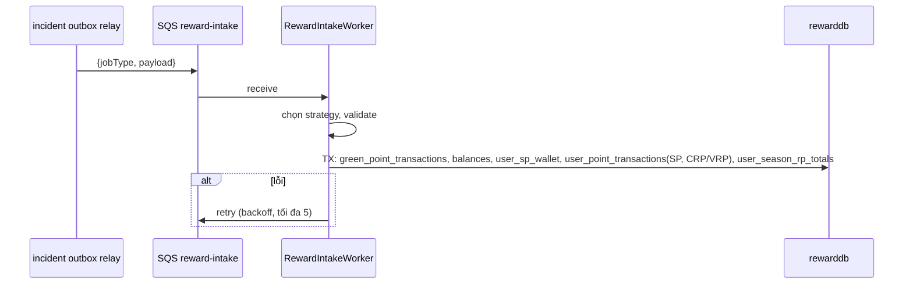
```mermaid
sequenceDiagram
  participant INC as incident outbox relay
  participant Q as SQS reward-intake
  participant W as RewardIntakeWorker
  participant DB as rewarddb
  INC->>Q: {jobType, payload}
  Q->>W: receive
  W->>W: chọn strategy, validate
  W->>DB: TX: green_point_transactions, balances, user_sp_wallet, user_point_transactions(SP, CRP/VRP), user_season_rp_totals
  alt lỗi
    W->>Q: retry (backoff, tối đa 5)
  end
```

### F37 — Đổi quà
1. `/gifts`: `GET /api/v1/gifts?isActive=true`. Người không phải admin chỉ thấy quà đang active.
2. `POST /api/v1/gifts/:id/redeem {phoneNumber, pickupLocation}` (JWT). `/exchange` là alias giống hệt.
3. `gift.service.ts > redeem()`:
   - Lấy mức giảm giá tốt nhất từ badge (luôn = 0, vì chưa có ai được cấp badge).
   - Transaction Serializable:
     - Quà phải active.
     - Trừ tồn kho theo kiểu nguyên tử (null nghĩa là vô hạn).
     - Tính giá = `ceil(greenPoints × (10000 − discountBps)/10000)`.
     - Kiểm tra số SP khả dụng (lô chưa hết hạn) ≥ giá.
     - Tạo đơn PROCESSING.
     - Trừ SP theo FIFO của hạn dùng; ghi sổ SP âm và `GIFT_REDEEM` âm.
- **Lỗi:** 404 quà không có hoặc không active; 422 hết hàng; 422 không đủ SP.
- **Lưu ý:** không trừ `user_green_point_balances` (99).
- **File:** `RW/modules/gift/gift.api.routes.ts`, `gift.service.ts > redeem()`, `RW/modules/gamification/sp-wallet.util.ts`.

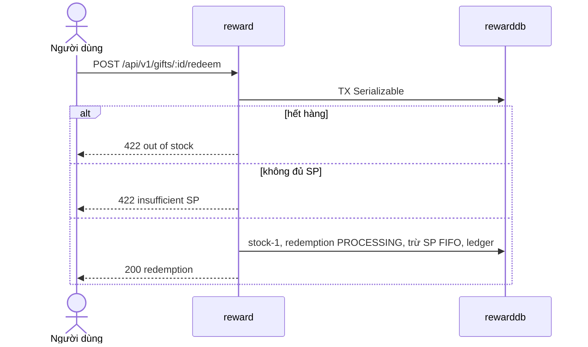
```mermaid
sequenceDiagram
  actor U as Người dùng
  participant RW as reward
  participant DB as rewarddb
  U->>RW: POST /api/v1/gifts/:id/redeem
  RW->>DB: TX Serializable
  alt hết hàng
    RW-->>U: 422 out of stock
  else không đủ SP
    RW-->>U: 422 insufficient SP
  else
    RW->>DB: stock-1, redemption PROCESSING, trừ SP FIFO, ledger
    RW-->>U: 200 redemption
  end
```

### F38 — Xử lý đơn đổi quà
- `/admin/gifts` → `GET /api/v1/admin/gift-redemptions` (admin) → `PATCH /admin/gift-redemptions/:id/status {status}`.
- Chuyển trạng thái: PROCESSING → SHIPPED | CANCELLED; SHIPPED → DELIVERED | CANCELLED (BR-230).
- Khi CANCELLED: **hoàn SP** (tạo lô mới với hạn mới), ghi `GIFT_REDEEM_REFUND`. **Không hoàn tồn kho.**
- **Lỗ hổng:** route PATCH **không có kiểm tra admin**, nên người dùng đăng nhập bất kỳ đều đổi được trạng thái (99, ISSUE-S09).
- Không có thông báo gửi cho người đổi.
- Người dùng xem đơn của mình ở `/profile/orders` qua `GET /me/redemptions`.
- **File:** `gift.service.ts > updateRedemptionStatus()`.

### F39 — Quản lý quà và mức độ khó (admin)
- Quà: `POST /api/v1/gifts`, `PUT /api/v1/gifts/:id` (admin). Ảnh được tạo thành Media GIFT. Sau khi ghi thì enqueue dịch (F45). Không có API xoá quà.
- Mức độ khó: `GET /api/v1/difficulties` (public), `PUT /api/v1/difficulties/:id` (admin) để sửa tên, `maxVolunteers`, `greenPoints`. Không có API tạo hoặc xoá.
- **Bug:** PUT difficulty mà không gửi tên thì tên vi/en bị ghi thành chuỗi rỗng (99).
- **File:** `RW/modules/gift/*`, `RW/modules/difficulty/*`.

### F40 — Xem điểm, lịch sử, bảng xếp hạng
- `GET /me/points`, `GET /me/points/transactions` (kèm thông tin campaign, report, quà liên quan, lấy từ incident và identity), `GET /leaderboard`, `GET /leaderboard/me` (legacy: tổng điểm dương).
- Gamification:
  - `GET /me/gamification/summary`, `point-transactions?kind=CRP|VRP|SP`, `points-by-season`, `GET /me/badges`.
  - `GET /gamification/leaderboards/:metric` (crp / vrp / org_aggregate): season đang ACTIVE lấy dữ liệu live; season INACTIVE lấy snapshot.
  - `GET /gamification/campaign-reward-estimate?difficultyLevel` để ước tính điểm thưởng.
- **Client:** chỉ có `/profile/points` (dùng API legacy). **Chưa có UI** cho leaderboard, season, badge (06-frontend.md).
- **File:** `RW/modules/user-points/*`, `RW/modules/gamification/gamification.controller.ts`, `gamification-leaderboard.service.ts`.

### F41 — Quản lý season và finalize season
- Admin:
  - `POST /api/v1/admin/seasons {kind, startsAt, endsAt, status}` — không kiểm tra ngày, không kiểm tra trùng season ACTIVE.
  - `PATCH /admin/seasons/:id` — đổi status mà **không** chốt sổ.
- **Finalize:** `POST /admin/seasons/:id/finalize {openNext?, startsAt?, endsAt?}`. Trong 1 transaction, nếu season đang ACTIVE:
  1. Xoá và tạo lại `leaderboard_snapshots` (CRP, VRP cho user; ORG_AGGREGATE cho tổ chức).
  2. **Chi SP** theo `season_leaderboard_payout_tiers` cho CRP và VRP (không có cho ORG_AGGREGATE). Idempotent theo key.
  3. Chuyển season sang INACTIVE.
  4. Nếu `openNext`: tạo season mới ACTIVE cùng kind (lỗi 422 nếu đã có season ACTIVE khác).
- **[CHƯA HOÀN THIỆN]:** không có cron tự động xoay season (`season_schedule_rules.autoRotate` chỉ lưu cấu hình).
- **File:** `RW/modules/gamification/season.service.ts > finalizeSeason(), freezeSeasonTx(), applyPayoutTiersTx()`.

```mermaid
sequenceDiagram
  actor A as Admin
  participant RW as reward
  participant DB as rewarddb
  A->>RW: POST /admin/seasons/:id/finalize {openNext}
  RW->>DB: TX: snapshot leaderboard, chi SP theo payout tier, season=INACTIVE
  opt openNext
    RW->>DB: tạo season mới ACTIVE
  end
  RW-->>A: {snapshotsWritten, closed, next}
```

### F42 — Cấu hình rule điểm và badge
- Admin (`/api/v1/admin/gamification/*`):
  - point-rules: `baseReportPoint`, ngưỡng mốc vote. Khi lưu sẽ đồng bộ sang `report_vote_green_point_rules`.
  - sp-rules: `expirationDays`.
  - multipliers, season-schedules.
  - payout-tiers (CRUD).
  - badges (tạo và sửa với `rulesConfig` AST, validate theo metric metadata; `reward.discountBps`…).
- **[CHƯA HOÀN THIỆN]:**
  - Không có code nào cấp badge (`evaluateBadge()` không được gọi).
  - Multiplier, season schedule, `bonus_sp`, `perks` chỉ được lưu, không có tác dụng.
- **File:** `RW/modules/gamification/gamification.controller.ts`, `gamification-config.service.ts`, `badge.service.ts`, `badge-rule-evaluator.service.ts`, `RW/modules/metrics/*`.

---

## F. Thông báo

### F43 — Gửi thông báo (in-app và email)
- **Producer duy nhất là incident-service.** identity và reward không gửi thông báo.
- **Luồng:**
  1. Với thông báo website gửi cho nhiều user: incident gọi identity `POST /internal/v1/users/notification-prefs/filter {userIds, kind}` để lọc theo preference. Nếu lời gọi lỗi thì gửi cho tất cả (fail-open).
  2. incident `POST /api/v1/notifications/jobs {type: website|email, kind, userId?, payload}` (x-internal-api-key, timeout 10s, circuit breaker; lỗi chỉ ghi log).
  3. notification: validate → ghi `notification_jobs` (12) → gửi SQS → 202.
  4. `NotificationSendWorker` chọn channel theo `type`:
     - **website:** render template en và vi → insert `notifications` (WEBSITE).
     - **email:** xác định người nhận (`payload.toEmail` với 6 kind về đơn tổ chức, hoặc identity `GET /internal/v1/users/:id/email`) → render theo locale → gửi SMTP → insert `notifications` (EMAIL).
  5. Job → COMPLETED. Nếu lỗi: retry backoff, tối đa 5 lần rồi FAILED.
- **Danh sách trigger:**

| Kind | Kênh | Người nhận | Khi nào | Nơi phát |
|---|---|---|---|---|
| ORG_APPLICATION_OTP | email | email người nộp | Xin mã OTP | `organization-application-otp.service.ts > requestOtp()` |
| ORG_APPLICATION_DRAFT_STARTED | email | người nộp | OTP mở đơn DRAFT **mới** (không gửi khi mở lại) | `organization-application.service.ts > openDraftForEmail()` |
| ORG_APPLICATION_DRAFT_UPDATED | email | người nộp | Bấm "Lưu nháp" thủ công, tối đa 1/giờ/hồ sơ (BR-318) | `organization-application.service.ts > saveDraft() → notifyDraftUpdated()` |
| ORG_APPLICATION_RECEIVED | email | người nộp | Nộp đơn lần đầu | `organization-application.service.ts > submitApplication()` |
| ORG_APPLICATION_NEEDS_INFO | email | người nộp | Admin yêu cầu bổ sung | `organization-application-admin.service.ts > requestMoreInfo()` |
| ORG_APPLICATION_REJECTED | email | người nộp | Admin từ chối | `... > reject()` |
| ORG_OWNER_CONFIRMATION_REQUEST | email | owner được mời | Nộp / nộp lại / gửi lại | `owner-candidates.ts > sendConfirmationEmails()` |
| ORG_OWNER_DECLINED | email | người nộp | Owner bấm "Tôi không liên quan" | `owner-confirmation.service.ts > decline()` |
| ORG_OWNER_CONFIRMATION_EXPIRED | email | người nộp | Sweeper đặt owner EXPIRED | `owner-confirmation.service.ts > expireOverdue()` |
| ORG_APPLICATION_WITHDRAWN_NOTICE | email | owner đã xác nhận (trừ người nộp) | Người nộp rút đơn | `organization-application.service.ts > withdrawApplication()` |
| ACCOUNT_ACTIVATION | email | owner chưa có tài khoản | Sau khi duyệt; hoặc tự yêu cầu gửi lại | `organization-owner-onboard.publisher.ts > publish()`, `ID/modules/auth/account-activation-notify.client.ts` |
| ORG_OWNER_ATTACHED | email | owner đã có tài khoản | Sau khi duyệt | `organization-owner-onboard.publisher.ts > publish()` |
| ORGANIZATION_CONTACT_VERIFY | email | email liên hệ | Tạo tổ chức nội bộ, đổi email, gửi lại | `organization.service.ts` |
| ORGANIZATION_APPROVED / REJECTED | website | mọi owner tổ chức | Admin duyệt hoặc ban tổ chức | `organization.service.ts > adminVerifyOrganization()` |
| VOLUNTEER_REQUEST | website | mọi owner tổ chức / manager campaign | Có người xin gia nhập | `organization.service.ts`, `campaign_joining_request.service.ts` |
| VOLUNTEER_APPROVED / REJECTED | website | người xin | Được duyệt hoặc bị từ chối | như trên |
| CAMPAIGN_CREATED | website | thành viên tổ chức | Tạo campaign | `campaign.service.ts > createCampaign()` |
| CAMPAIGN_VERIFY_INVITE | website | người dân trong 5 km | Admin duyệt campaign | `adminVerifyCampaign()` |
| CAMPAIGN_COMPLETION_PENDING_ADMIN | website | user id trong env | Manager gửi hoàn thành | `submitCampaignCompletionForAdminApproval()` |
| CAMPAIGN_COMPLETION_VERIFY_INVITE | website | người dân trong 5 km | Manager gửi hoàn thành | như trên |
| CAMPAIGN_DONE | website | volunteer đã được duyệt | Admin duyệt hoàn thành | `adminFinalizeCampaignCompletion()` |
| CAMPAIGN_COMPLETION_APPROVED_BY_ADMIN / REJECTED_BY_ADMIN | website | mọi owner tổ chức | Admin duyệt hoặc từ chối hoàn thành | `adminFinalizeCampaignCompletion()`, `adminRejectCampaign()` |
| REPORT_APPROVED / REPORT_REJECTED | website | người báo cáo | Admin duyệt hoặc ban report | `report.service.ts` |
| REPORT_STATUS | website | người báo cáo | Admin đánh dấu report đã xử lý | `adminMarkReportDone()` |

- **Kind không có nơi phát:** RESET_PASSWORD, REPORT_READY, TASK_ASSIGNED, GENERIC, CAMPAIGN_SUBMISSION_*.
- **Thiếu template:** nhiều kind chỉ có template cho 1 kênh; gửi sai kênh sẽ FAILED sau 5 lần (99).
- **File:** `NS/modules/notification/*`, `NS/channels/*`, `NS/queue/*`, `INC/modules/campaign/notification-jobs.client.ts`, `INC/modules/report/report-status-notify.client.ts`, `INC/modules/organization/identity-user.client.ts > filterUserIdsForNotificationKind()`.

```mermaid
sequenceDiagram
  participant INC as incident
  participant ID as identity
  participant NS as notification API
  participant Q as SQS notification-send
  participant W as notification worker
  participant SMTP as SMTP
  INC->>ID: notification-prefs/filter (website)
  INC->>NS: POST /api/v1/notifications/jobs
  NS->>NS: notification_jobs(12)
  NS->>Q: SEND_NOTIFICATION
  NS-->>INC: 202
  Q->>W: receive
  alt email
    W->>ID: GET /internal/v1/users/:id/email (nếu không có toEmail)
    W->>SMTP: sendMail
  end
  W->>W: insert notifications, job=17
```

### F44 — Xem và đánh dấu đã đọc thông báo
- Chuông thông báo (`NotificationMenu`) poll `GET /api/v1/notifications/my?limit=40` mỗi 20 giây. Chỉ trả thông báo WEBSITE của chính user, kèm `unreadCount`.
- `PATCH /api/v1/notifications/:id/read` → `readAt=now` (chỉ với thông báo của mình).
- **Không có:** "đánh dấu tất cả đã đọc", xem lịch sử email.
- **File:** `NS/modules/notification/notification.service.ts > listForUser(), markRead()`, `FE/apis/notification/*`.

---

## G. Đa ngôn ngữ và AI

### F45 — Dịch nội dung tự động
- **Kích hoạt khi:**
  - Tạo hoặc sửa report.
  - Tạo hoặc sửa tổ chức (chỉ phần mô tả).
  - **Tạo** campaign (sửa thì không dịch).
  - Tạo hoặc sửa quà, sửa difficulty.
- **Luồng:**
  1. Trước khi ghi DB, service điền tạm các cột ngôn ngữ còn thiếu bằng text gốc.
  2. Enqueue `TRANSLATE_TEXT {resourceType, resourceId, translations[{sourceText, viField?, enField?}]}` vào queue translation của chính service (incident hoặc reward).
  3. `TranslationWorker` gọi ai-service `POST /internal/v1/translate {content}` (x-internal-api-key). ai-service nhờ LLM phát hiện ngôn ngữ và trả `{detected_language, vn, en}`.
  4. Worker cập nhật các cột `*Vi` / `*En`.
- **Lỗi:** ai-service lỗi → ghi text gốc vào cả 2 cột và job vẫn COMPLETED. Lỗi payload hoặc DB → retry.
- **Hiển thị:** các service chọn text theo `Accept-Language` hoặc `?lang` (`pickLocalizedText`: ngôn ngữ yêu cầu → ngôn ngữ còn lại → bản gốc).
- **File:** `INC/queue/worker/translation-worker.ts`, `INC/modules/translation/translation.client.ts`, `RW/queue/workers/translation.worker.ts`, `RW/modules/translation/translation.client.ts`, `AI/chat/service.py > translate_text()`, xem thêm [services/translation-worker.md](services/translation-worker.md).

```mermaid
sequenceDiagram
  participant S as incident / reward
  participant Q as SQS translation
  participant W as TranslationWorker
  participant AI as ai-service
  participant LLM as OpenAI-compatible
  S->>S: ghi DB (tạm text gốc cho cột thiếu)
  S->>Q: TRANSLATE_TEXT
  Q->>W: receive
  W->>AI: POST /internal/v1/translate {content}
  AI->>LLM: chat completion (json)
  LLM-->>AI: {detected_language, vn, en}
  AI-->>W: {vn, en}
  W->>S: update *Vi / *En
```

### F46 — Dịch theo yêu cầu người dùng
- `POST /api/v1/translate` (gateway rewrite sang `/api/v1/chat/translate`), JWT → `translate_text()`.
- Client hiện chưa có UI gọi API này (06-frontend.md).

### F47 — Chat với trợ lý AI (tạo report qua chat)
1. Widget `AiChatWidget`: `POST /api/v1/chat/conversations {agentId: ecolink_assistant}`.
2. (Tuỳ chọn) upload ảnh lên Cloudinary rồi `POST /api/v1/chat/media {imageUrl}`, nhận `mediaId`.
3. `POST /api/v1/chat/conversations/:id/messages/stream {content, mediaIds≤10}` là stream **SSE**:
   - Lưu tin nhắn của user.
   - Gọi LLM (stream token).
   - Nếu LLM gọi tool (tối đa 8 vòng): gọi incident bằng **Bearer của user**. Các tool gồm `create_report`, `create_organization`, `list_organizations`, `list_report_media_files_by_ids`, `list_chat_media_by_ids`.
   - Phát các event `token`, `tool_start`, `tool_end`, `done`, `error`.
4. `GET …/messages` để xem lại lịch sử.
- **Prompt:** tự đề xuất tiêu đề và mô tả, chỉ hỏi severity 1–2, **không hỏi vị trí và luôn dùng toạ độ (1, 1)** (`AI/agents/prompts.py`).
- **Lỗi:**
  - Thiếu `OPENAI_API_KEY` → event error.
  - Quá 8 vòng tool → event error.
  - Tool `create_organization` luôn 401 (route yêu cầu internal key).
- **File:** `AI/chat/router.py`, `AI/chat/service.py > stream_chat_turn()`, `AI/tools/*`, `FE/components/client/ai-chat/aiChatClient.ts`.

```mermaid
sequenceDiagram
  actor U as Người dùng
  participant FE as Client
  participant AI as ai-service
  participant LLM as LLM
  participant INC as incident
  FE->>AI: POST /chat/conversations/:id/messages/stream (SSE)
  AI->>AI: lưu message user
  loop tối đa 8 vòng
    AI->>LLM: stream completion
    LLM-->>AI: token / tool_calls
    AI-->>FE: event token
    opt tool call
      AI-->>FE: tool_start
      AI->>INC: POST /api/v1/reports (Bearer user)
      INC-->>AI: kết quả
      AI-->>FE: tool_end
    end
  end
  AI-->>FE: done
```

### F48 — Vinh danh chiến dịch trên Facebook [CHƯA HOÀN THIỆN]
- Code phía reward đã có: `CAMPAIGN_FACEBOOK_RECOGNITION` → caption do ai-service sinh (`POST /api/v1/social/campaign-facebook-caption`, lỗi thì dùng mẫu tiếng Việt) → Facebook Graph `/photos` hoặc `/feed`, và/hoặc webhook.
- **Phía incident đã comment out đoạn phát event** (`campaign.service.ts` khoảng dòng 1607–1616). Queue `facebook-recognition` riêng cũng không có producer. Tính năng hiện **không chạy**.
- **File:** `RW/modules/facebook-recognition/facebook-recognition.service.ts`, `AI/social/*`.
