# 02 — Luồng nghiệp vụ

> Mỗi luồng có: mục đích, actor, điều kiện tiên quyết, luồng chính, luồng thay thế/lỗi, sequence diagram, dữ liệu thay đổi, file code.
> Viết tắt đường dẫn: `ID/` = `ecolink-server/services/identity-service/src`, `INC/` = `ecolink-server/services/incident-service/src`, `RW/` = `ecolink-server/services/reward-service/src`, `NS/` = `ecolink-server/services/notification-service/src`, `AI/` = `ecolink-server/services/ai-service/app`, `FE/` = `ecolink-client`.
> Mọi request từ client đi qua **api-gateway**. Gateway chỉ proxy, nên trong sequence diagram gateway được gộp vào mũi tên client → service cho gọn (trừ flow F01).
> Mã BR-xxx trỏ tới [03-business-rules.md](03-business-rules.md).

## Danh sách luồng

| # | Luồng | Module |
|---|---|---|
| F01 | Đăng ký tài khoản | Tài khoản |
| F02 | Đăng nhập email/mật khẩu | Tài khoản |
| F03 | Đăng nhập Google | Tài khoản |
| F04 | Làm mới token (refresh) | Tài khoản |
| F05 | Đăng xuất | Tài khoản |
| F06 | Đổi mật khẩu | Tài khoản |
| F07 | Quên và đặt lại mật khẩu | Tài khoản |
| F08 | Cập nhật hồ sơ, vị trí, tuỳ chọn thông báo | Tài khoản |
| F09 | Admin ban người dùng | Tài khoản |
| F10 | Đăng ký tổ chức: OTP → nháp → nộp (kèm danh sách owner) | Tổ chức |
| F11 | Owner xác nhận / từ chối / hết hạn; nộp lại | Tổ chức |
| F12 | Thẩm định và duyệt đơn: Blue Tick, tạo tổ chức, gắn vai owner | Xác minh |
| F13 | Kích hoạt tài khoản owner mới và gửi lại email kích hoạt | Tài khoản |
| F14 | Người nộp theo dõi và rút đơn | Tổ chức |
| F15 | Xác minh email liên hệ tổ chức | Tổ chức |
| F16 | Owner cập nhật thông tin tổ chức | Tổ chức |
| F17 | Admin duyệt hoặc ban tổ chức | Tổ chức |
| F18 | Xin gia nhập, duyệt, huỷ, rời tổ chức | Tổ chức |
| F18b | Mời thành viên (duyệt → chấp nhận qua email) | Tổ chức |
| F18c | Đổi vai, gỡ thành viên (không phải owner) | Tổ chức |
| F18d | Đề xuất thêm owner (owner change ADD_OWNER) | Tổ chức |
| F18e | Thu hồi owner khác (REMOVE_OWNER) | Tổ chức |
| F18g | Owner tự hạ vai / rời tổ chức | Tổ chức |
| F19 | Tạo báo cáo sự cố (report) và phân tích AI | Sự cố |
| F20 | Chủ report sửa, thêm ảnh, xoá ảnh, xoá report | Sự cố |
| F21 | Admin duyệt hoặc ban report | Sự cố |
| F22 | Admin đánh dấu report đã xử lý và cộng điểm | Sự cố |
| F23 | Vote report/campaign và thưởng mốc vote | Tương tác |
| F24 | Lưu (bookmark) report/campaign | Tương tác |
| F25 | Tạo chiến dịch (nháp) và gửi duyệt | Chiến dịch |
| F26 | Sửa và xoá chiến dịch | Chiến dịch |
| F27 | Admin duyệt, yêu cầu chỉnh sửa, chặn hoặc ban chiến dịch và mời người dân ở gần | Chiến dịch |
| F27b | Job vòng đời: bắt đầu chiến dịch sắp diễn ra, hết hạn duyệt, dọn bản nháp, bản tin đăng ký | Chiến dịch |
| F28 | Tình nguyện viên đăng ký ca của chiến dịch | Chiến dịch |
| F29 | Quản lý manager của chiến dịch | Chiến dịch |
| F30 | Quản lý task (đã bỏ) | Chiến dịch |
| F31 | Điểm danh theo ca (QR động, GPS) | Chiến dịch |
| F31b | Kết quả và trạng thái ca, kết thúc ca sớm, kho ảnh, tổng quan | Chiến dịch |
| F32 | Gửi SOS và giải quyết SOS | Chiến dịch |
| F33 | Gửi hoàn thành chiến dịch và cộng đồng xác nhận | Chiến dịch |
| F34 | Admin duyệt hoặc từ chối hoàn thành chiến dịch và trao điểm | Chiến dịch + Điểm |
| F35 | Submission kết quả chiến dịch | Chiến dịch |
| F36 | Reward nhận event và cộng điểm | Điểm |
| F37 | Đổi quà | Quà tặng |
| F38 | Xử lý đơn đổi quà | Quà tặng |
| F39 | Quản lý quà và mức độ khó (admin) | Quà tặng / Chiến dịch |
| F40 | Xem điểm, lịch sử, bảng xếp hạng | Điểm |
| F41 | Quản lý season và finalize season | Gamification |
| F42 | Cấu hình rule điểm và badge | Gamification |
| F43 | Gửi thông báo (in-app và email) | Thông báo |
| F44 | Xem và đánh dấu đã đọc thông báo | Thông báo |
| F45 | Dịch nội dung tự động | Đa ngôn ngữ |
| F46 | Dịch theo yêu cầu người dùng | Đa ngôn ngữ |
| F47 | Chat với trợ lý AI (tạo report qua chat) | AI |
| F48 | Vinh danh chiến dịch trên Facebook [CHƯA HOÀN THIỆN] | Điểm / Mạng xã hội |

---

## A. Tài khoản

### F01 — Đăng ký tài khoản
- **Mục đích:** tạo tài khoản cá nhân.
- **Actor:** khách.
- **Điều kiện tiên quyết:** email chưa tồn tại (trong các user chưa bị xoá).
- **Luồng chính:**
  1. Client `/sign-up` validate: name ≥3, email, password ≥6, tick điều khoản (`FE/src/pages/...sign-up`, xem 06-frontend.md).
  2. `POST /api/v1/auth/sign-up {name, email, password, roleId?}` → identity `auth.controller.ts > signup`, validate email, password ≥8, name (BR-001).
  3. `auth.service.ts > signup()`: `findByEmail`, 409 nếu trùng (BR-002).
  4. Lấy role: nếu có `roleId` trong body thì dùng giá trị đó, nếu không thì dùng role `USER` (BR-003). **Client tự chọn role được** (xem 99).
  5. Hash bcrypt, tạo `User` (status 1, `emailVerified=false`) → 201.
- **Luồng lỗi:**
  - Validate sai → 400.
  - Email trùng → 409.
  - Email trùng với user đã bị xoá mềm → vi phạm unique DB → 500.
  - Thiếu role USER → 500.
- **Ghi chú:** không cấp token, không gửi mail xác minh, không phát event. Client chuyển sang đăng nhập. Client yêu cầu mật khẩu ≥6 nhưng server yêu cầu ≥8.
- **Dữ liệu thay đổi:** `users` (insert).
- **File:** `ID/modules/auth/auth.controller.ts`, `ID/modules/auth/auth.service.ts > signup()`, `ID/modules/user/user.repository.ts`, `FE/apis/auth/signUp.ts`.

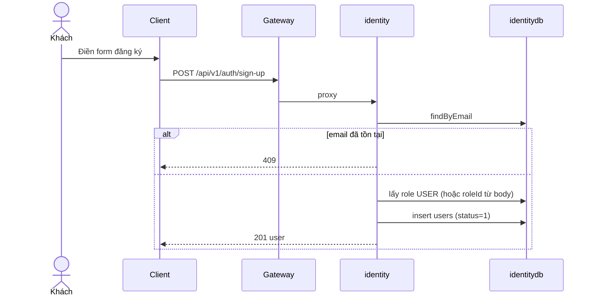
```mermaid
sequenceDiagram
  actor U as Khách
  participant FE as Client
  participant GW as Gateway
  participant ID as identity
  participant DB as identitydb
  U->>FE: Điền form đăng ký
  FE->>GW: POST /api/v1/auth/sign-up
  GW->>ID: proxy
  ID->>DB: findByEmail
  alt email đã tồn tại
    ID-->>FE: 409
  else
    ID->>DB: lấy role USER (hoặc roleId từ body)
    ID->>DB: insert users (status=1)
    ID-->>FE: 201 user
  end
```

### F02 — Đăng nhập email/mật khẩu
- **Actor:** người dùng, admin.
- **Luồng chính:**
  1. `POST /api/v1/auth/sign-in {email, password}` → `auth.service.ts > login()`.
  2. Tìm user. Kiểm tra status: 2 → 403 "Account banned"; 3 → 403 `ACCOUNT_PENDING_ACTIVATION` (BR-005); client hiện nút gửi lại email kích hoạt (F13).
  3. Kiểm tra password (null hoặc sai → 401) (BR-004).
  4. Ký access và refresh JWT `{userId, email, role: <tên role>}`. Lưu `sha256(refresh)` vào `auth_tokens` (type REFRESH). Set cookie `accessToken` (httpOnly, 15 phút).
  5. Trả `{user, access_token, refresh_token}`. Client lưu vào Zustand/localStorage (`FE/stores/useAuthStore.ts`).
- **Luồng lỗi:**
  - 401 sai thông tin.
  - 403 bị ban hoặc chưa kích hoạt. Thứ tự kiểm tra làm lộ trạng thái ban kể cả khi nhập sai mật khẩu.
- **Dữ liệu thay đổi:** `auth_tokens` (insert REFRESH).
- **File:** `ID/modules/auth/auth.controller.ts > login`, `auth.service.ts > login()`, `ID/utils/jwt.utils.ts`.

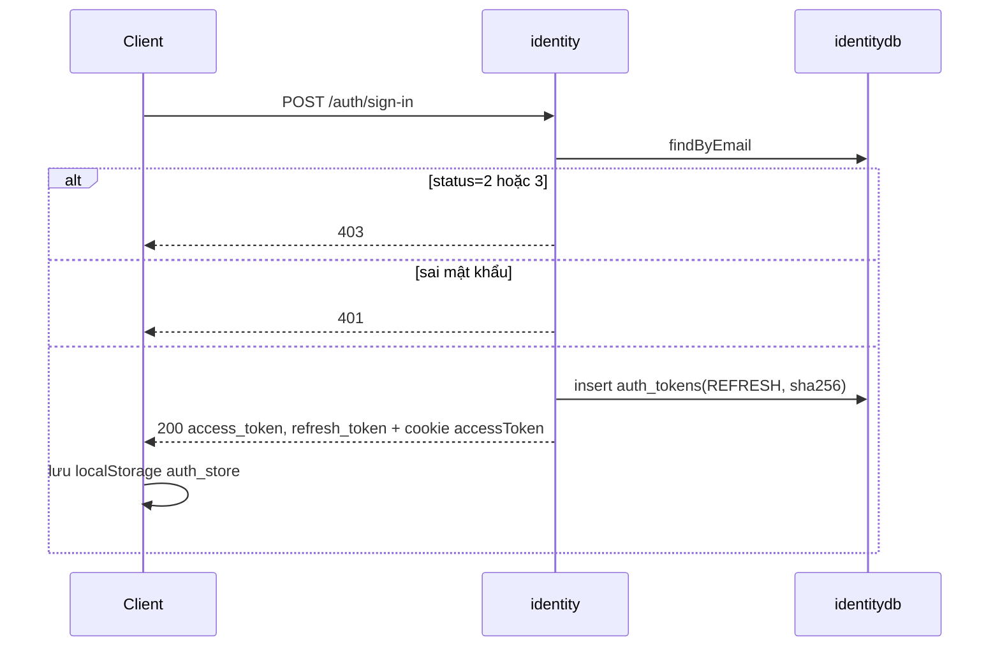
```mermaid
sequenceDiagram
  participant FE as Client
  participant ID as identity
  participant DB as identitydb
  FE->>ID: POST /auth/sign-in
  ID->>DB: findByEmail
  alt status=2 hoặc 3
    ID-->>FE: 403
  else sai mật khẩu
    ID-->>FE: 401
  else
    ID->>DB: insert auth_tokens(REFRESH, sha256)
    ID-->>FE: 200 access_token, refresh_token + cookie accessToken
    FE->>FE: lưu localStorage auth_store
  end
```

### F03 — Đăng nhập Google
- **Luồng chính:**
  1. `GET /auth/oauth/google?state` → trả `authorization_url`.
  2. Google redirect về `GET /auth/oauth/google/callback?code` → `google.service.ts > handleCallback()`:
     - Đổi code lấy token, gọi userinfo, lowercase email.
     - Nếu chưa có user: tạo user role USER, password = UUID ngẫu nhiên.
     - Nếu đã có: kiểm tra ban/pending; nếu Google báo email đã verified thì set `emailVerified=true`.
  3. Cấp token giống F02, trả JSON.
- **Luồng lỗi:**
  - Có query `error` → 400.
  - Thiếu `code` → 400 "no_code".
  - Google không trả email → 500.
  - Bị ban hoặc đang pending → 403.
- **Lưu ý:**
  - Không kiểm tra `state`.
  - Client gọi `/auth/oauth/google` **không có tiền tố `/api/v1`**, nên đi qua gateway sẽ bị 404. Route này chỉ tồn tại khi gọi thẳng identity (`/auth/*`). Xem 99.
- **File:** `ID/modules/oauth/*`, `FE/apis/auth/googleSignIn.ts`, `googleCallback.ts`.

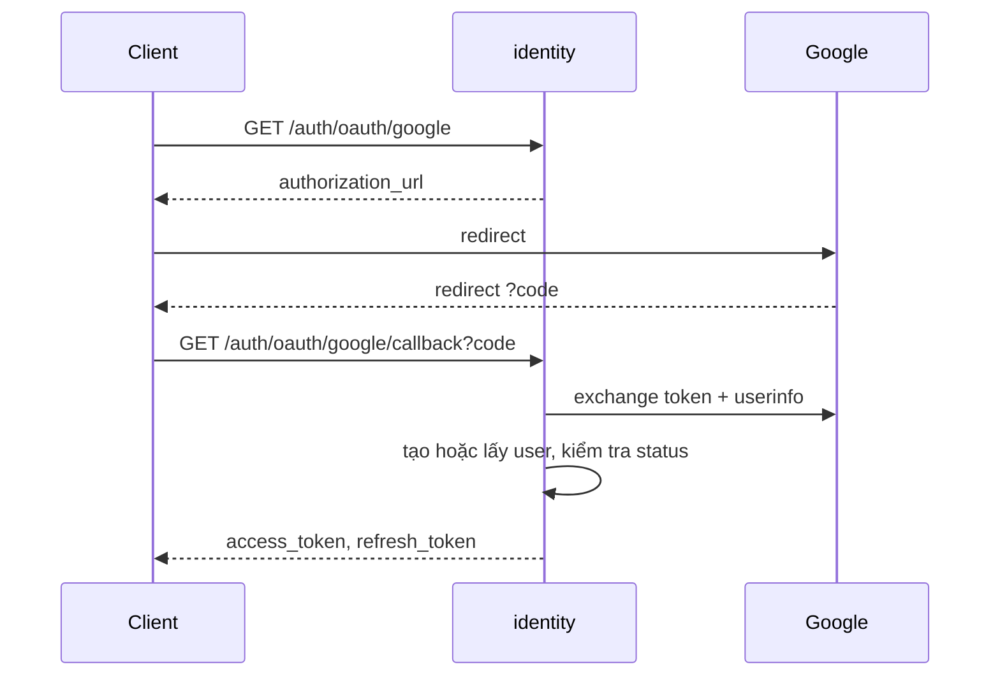
```mermaid
sequenceDiagram
  participant FE as Client
  participant ID as identity
  participant G as Google
  FE->>ID: GET /auth/oauth/google
  ID-->>FE: authorization_url
  FE->>G: redirect
  G-->>FE: redirect ?code
  FE->>ID: GET /auth/oauth/google/callback?code
  ID->>G: exchange token + userinfo
  ID->>ID: tạo hoặc lấy user, kiểm tra status
  ID-->>FE: access_token, refresh_token
```

### F04 — Làm mới token
1. Axios interceptor gặp 401 → `POST /api/v1/auth/refresh-token {refreshToken}` (`FE/libs/axiosClient.ts > onResponseError`).
2. identity `auth.service.ts > refreshAccessToken()`:
   - Verify JWT, tìm hash REFRESH còn hiệu lực, userId phải khớp.
   - **Revoke token cũ** rồi cấp cặp token mới với claim `role = user.roleId` (UUID).
3. Client lưu token mới và gửi lại request.
- **Luồng lỗi:** mọi lỗi → 401 → client logout và chuyển về `/sign-in?redirect=`.
- **Bug quan trọng:** sau khi refresh, claim `role` là UUID chứ không còn là `"admin"`, nên **admin mất quyền ở mọi service** cho tới khi đăng nhập lại (99, ISSUE-S05).
- **Dữ liệu thay đổi:** `auth_tokens` (update revokedAt cho token cũ, insert token mới).
- **File:** `ID/modules/auth/auth.service.ts > refreshAccessToken()` (khoảng dòng 189), `FE/libs/axiosClient.ts`.

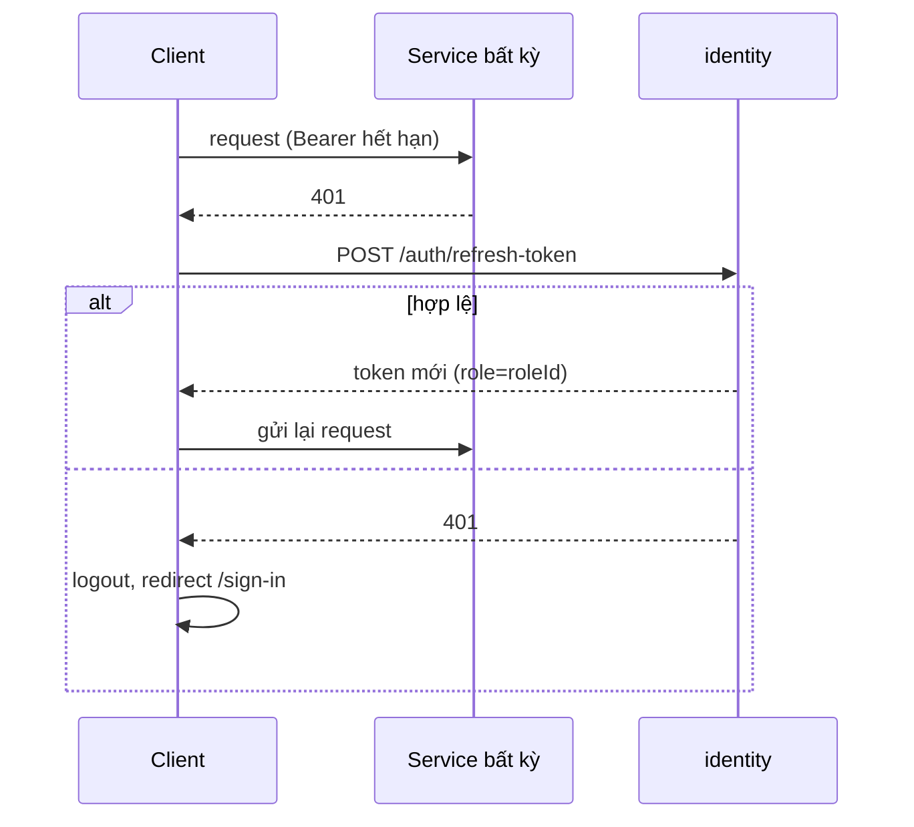
```mermaid
sequenceDiagram
  participant FE as Client
  participant X as Service bất kỳ
  participant ID as identity
  FE->>X: request (Bearer hết hạn)
  X-->>FE: 401
  FE->>ID: POST /auth/refresh-token
  alt hợp lệ
    ID-->>FE: token mới (role=roleId)
    FE->>X: gửi lại request
  else
    ID-->>FE: 401
    FE->>FE: logout, redirect /sign-in
  end
```

### F05 — Đăng xuất
- Server: `POST /api/v1/auth/logout` (cần JWT) → revoke mọi REFRESH của user, xoá cookie. Access token hiện tại **vẫn còn hiệu lực** tới khi hết hạn (`auth.service.ts > logout()`).
- Client gọi **`/api/v1/auth/sign-out`**, là route không tồn tại, nên server không revoke gì. Client vẫn tự xoá store (`FE/apis/auth/signOut.ts`, `FE/utils/logout.ts`). Xem 99.

### F06 — Đổi mật khẩu
- `POST /api/v1/auth/update-password {oldPassword, newPassword≥8}` (JWT) → so khớp mật khẩu cũ (sai → 400) → hash mật khẩu mới → revoke mọi REFRESH (`auth.service.ts > updatePassword()`).
- User tạo qua Google không đổi được mật khẩu (mật khẩu cũ không phải bcrypt).
- **[CHƯA HOÀN THIỆN] phía client:** `FE/apis/auth/updatePassword.ts` là file rỗng.

### F07 — Quên và đặt lại mật khẩu
1. `POST /api/v1/auth/request-password-reset {email}`:
   - Email không tồn tại → 404.
   - Có tồn tại → revoke token reset cũ, tạo token mới (TTL 1 giờ).
   - **Trả token thô trong response `data.reset_token`**. Không gửi email (99, ISSUE-S01).
2. `POST /api/v1/auth/reset-password {resetToken, newPassword≥8}` → token phải còn hiệu lực → set mật khẩu mới, đánh dấu đã dùng, revoke REFRESH.
- **Luồng lỗi:** token sai hoặc hết hạn → 400.
- **Client:** `/request-reset-password` rồi `/reset-password?reset_token=…`.
- **File:** `ID/modules/auth/auth.service.ts > requestPasswordReset(), resetPassword()`.

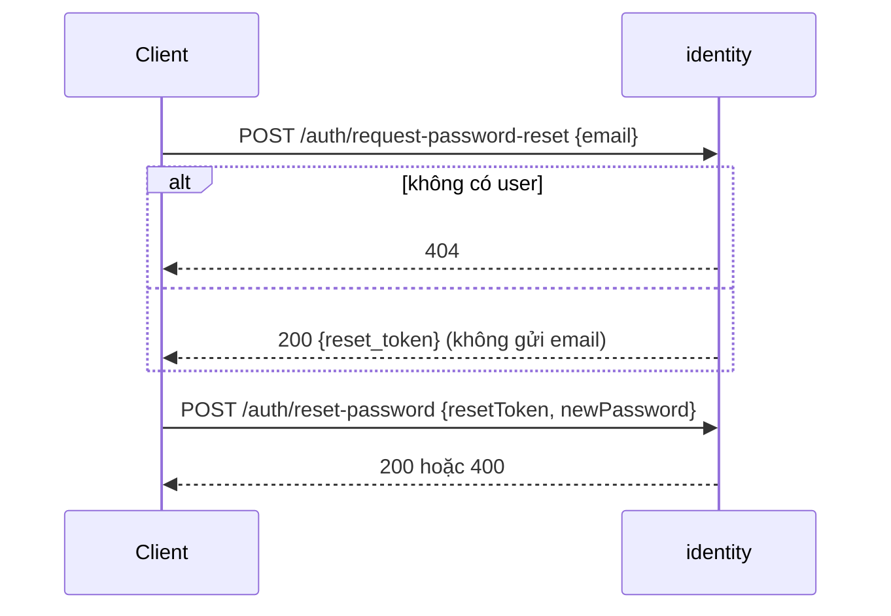
```mermaid
sequenceDiagram
  participant FE as Client
  participant ID as identity
  FE->>ID: POST /auth/request-password-reset {email}
  alt không có user
    ID-->>FE: 404
  else
    ID-->>FE: 200 {reset_token} (không gửi email)
  end
  FE->>ID: POST /auth/reset-password {resetToken, newPassword}
  ID-->>FE: 200 hoặc 400
```

### F08 — Cập nhật hồ sơ, vị trí, tuỳ chọn thông báo
- `PUT /api/v1/users/:id` (JWT) với các field avatar, name, bio, phone, gender, dateOfBirth, latitude/longitude (phải gửi cả cặp; cả cặp null thì xoá vị trí và địa chỉ), detailAddress, notificationPreferences (merge key hợp lệ), roleId (BR-020..BR-024).
- **Không kiểm tra `:id` có phải của chính người gọi hay không** (99, ISSUE-S03).
- Vị trí nhà được dùng để mời người dân ở gần khi campaign được duyệt hoặc gửi hoàn thành (F27, F33). Preference được dùng để lọc thông báo (F43).
- **Client:** `/profile/account`, `/profile/notification-settings`.
- **File:** `ID/modules/user/user.controller.ts > updateUser`, `user.service.ts > updateUser()`.

### F09 — Admin ban người dùng
1. Admin `/admin/users` → `GET /api/v1/users` (admin). Sau đó `PUT /api/v1/users/:id/ban {reject_reason}`.
2. `user.service.ts > adminBanUser()`:
   - Không được ban chính mình.
   - Đặt status=2 và rejectReason, revoke REFRESH.
   - Nếu user đã bị ban: lý do khác thì chỉ cập nhật lý do.
- **Hệ quả:** user không đăng nhập hoặc refresh được nữa, nhưng **access token còn hạn vẫn dùng được** vì `authenticate` ở mọi service không kiểm tra status. Không phát event sang service khác. **Không có chức năng gỡ ban.**
- **File:** `ID/modules/user/user.controller.ts > adminBanUser`, `user.service.ts > adminBanUser()`.

---

## B. Tổ chức và xác minh (Blue Tick)

### F10 — Đăng ký tổ chức: OTP → nháp → nộp
- **Mục đích:** lập hồ sơ xin tạo tổ chức, kèm danh sách owner. Thiết kế: [ORG_OWNERSHIP_FLOW.md](ORG_OWNERSHIP_FLOW.md).
- **Actor:** người nộp (ẩn danh, chứng minh sở hữu hòm mail; bắt buộc là một owner).
- **Luồng chính:**
  1. `/organizations/apply` → `POST /api/v1/organization-applications/email-otp {email}`:
     - Rate limit 3 lần/email/giờ và 10 lần/IP/giờ (BR-050).
     - Tạo OTP 6 số (lưu hash) và LINK token, TTL 10 phút; gửi `ORG_APPLICATION_OTP` kèm link `…/organizations/apply?t=<link>`.
  2. (Tuỳ chọn) mở link → `GET /email-otp/link?token` → biết email.
  3. `POST /email-otp/verify {email, otp}` (BR-054):
     - Sai → tăng số lần thử; ≥5 → 429.
     - Đúng → `openDraftForEmail()`: đã có đơn mở của email đó thì trả lại (`resumed=true`, BR-061); chưa có thì tạo đơn `DRAFT` (code `ORG-XXXXXXXX`, `submitterEmail`, `contactEmail` = email đó, `emailVerifiedAt`) kèm một owner là người nộp.
     - Đơn **mới** → gửi `ORG_APPLICATION_DRAFT_STARTED` (fire-and-forget) kèm `buildApplicationEditUrl(id, token)`; đơn mở lại → không gửi (BR-317).
     - Trả `{application_id, tracking_token (180 ngày), resumed}`. Client chuyển sang `/organizations/apply/edit/:id?token=`.
  4. Soạn nháp (lặp lại được, DRAFT hoặc NEEDS_REVISION — BR-067):
     - Giấy tờ: `POST /:id/documents/presign?token=` → chữ ký Cloudinary `authenticated` (BR-056) → trình duyệt upload thẳng.
     - `PUT /:id?token= {org_type?, profile?, channels?, legal_representative?, owners?, document_ids?, remove_document_ids?, consent?}` (`saveDraft()`): chỉ kiểm tra hình thức; gắn / gỡ giấy tờ; đồng bộ `owners` theo email (BR-069, BR-311). Client upload logo / ảnh bìa lên Cloudinary trước khi gửi.
  5. `POST /:id/submit?token= {consent?}` (`submitApplication()`):
     - Validate đủ (BR-057..BR-060, BR-069), owner đã DECLINED còn trong danh sách → 422 (BR-303).
     - Kiểm tra chặn sớm (BR-300..BR-302): identity `POST /internal/v1/users/lookup-by-emails`, đếm membership vai owner, đếm ứng tuyển ở đơn khác, `owner_invite_blocks`.
     - Transaction có `SELECT … FOR UPDATE` trên đơn: so snapshot để reset xác nhận (BR-306); người nộp → CONFIRMED với IP/UA (BR-304); owner cần link → token mới 14 ngày (BR-305); không còn ai chưa xác nhận → `PENDING_REVIEW`, ngược lại `AWAITING_OWNER_CONFIRMATION`; ghi `submittedAt`, `confirmationSnapshot`, event SUBMITTED / RESUBMITTED (kèm `changedFields`), `OWNER_CONFIRMATIONS_RESET`, `READY_FOR_REVIEW`.
     - Sau commit: `ORG_OWNER_CONFIRMATION_REQUEST` cho từng owner vừa có link; lần nộp đầu gửi thêm `ORG_APPLICATION_RECEIVED` (tracking token mới).
- **Luồng lỗi:**
  - 429 rate limit / thử OTP quá số lần; 503 không gửi được OTP hoặc không gọi được identity lúc nộp.
  - 401 TRACKING_TOKEN_INVALID; 404 đơn không thuộc email của token.
  - 409 ORGANIZATION_APPLICATION_NOT_EDITABLE.
  - 400 thiếu consent, sai orgType / channel / profile; 422 lỗi danh sách owner, OWNER_SUSPENDED, OWNER_QUOTA_EXCEEDED, TOO_MANY_PENDING_INVITES, OWNER_INVITE_BLOCKED, OWNER_DECLINED_MUST_BE_REPLACED; 404 / 422 giấy tờ.
- **Dữ liệu thay đổi:** `organization_application_otps` (OTP, LINK, TRACKING), `organization_applications`, `organization_application_owners`, `organization_application_documents`, `organization_application_events`.
- **File:** `INC/modules/organization_application/organization-application-otp.service.ts`, `organization-application.service.ts > openDraftForEmail(), saveDraft(), syncOwners(), submitApplication(), assertOwnersEligible()`, `owner-candidates.ts`, `FE/app/(pages)/(main)/organizations/apply/_context/ApplicationContext.tsx`.

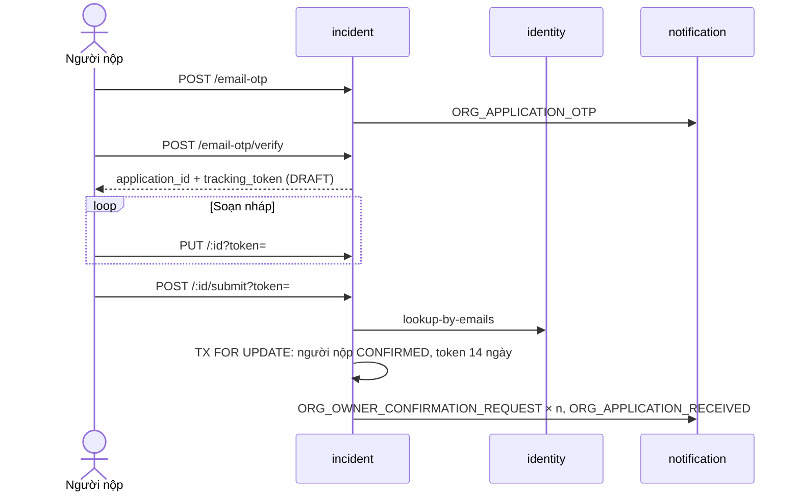
```mermaid
sequenceDiagram
  actor U as Người nộp
  participant INC as incident
  participant ID as identity
  participant NS as notification
  U->>INC: POST /email-otp
  INC->>NS: ORG_APPLICATION_OTP
  U->>INC: POST /email-otp/verify
  INC-->>U: application_id + tracking_token (DRAFT)
  loop Soạn nháp
    U->>INC: PUT /:id?token=
  end
  U->>INC: POST /:id/submit?token=
  INC->>ID: lookup-by-emails
  INC->>INC: TX FOR UPDATE: người nộp CONFIRMED, token 14 ngày
  INC->>NS: ORG_OWNER_CONFIRMATION_REQUEST × n, ORG_APPLICATION_RECEIVED
```

### F11 — Owner xác nhận / từ chối / hết hạn; nộp lại
- **Actor:** owner được mời (không cần đăng nhập), hệ thống (sweeper), người nộp.
- **Luồng chính:**
  1. Owner mở `/organizations/owner-confirm?token=` → `GET /api/v1/organization-applications/owner-confirmations/:token` (JWT tuỳ chọn qua `optionalAuthenticate`; email phiên khác email owner → `session_email_mismatch: true`).
  2. **Xác nhận** `POST …/:token/confirm` (BR-308): khoá đơn, kiểm tra thứ tự bị gỡ → đã từ chối → đơn không còn chờ → hết hạn; đặt CONFIRMED, lưu `confirmIp`, `confirmUa`, event `OWNER_CONFIRMED`. Không còn ai chưa xác nhận và đơn đang AWAITING → `PENDING_REVIEW` + event `READY_FOR_REVIEW` trong cùng transaction. Bấm lại → `already_done`.
  3. **Tôi không liên quan** `POST …/:token/decline {reason?, block_future?}` (BR-309): owner → DECLINED, đơn → NEEDS_REVISION (`reviewNote = "Owner … không xác nhận."`), tuỳ chọn ghi `owner_invite_blocks`, event `OWNER_DECLINED`; người nộp nhận `ORG_OWNER_DECLINED`.
  4. **Hết hạn** (BR-310): worker incident chạy `expireOverdue()` mỗi giờ; mỗi đơn xử lý trong transaction có khoá: owner PENDING quá hạn → EXPIRED, đơn → NEEDS_REVISION, event `OWNER_EXPIRED`, người nộp nhận `ORG_OWNER_CONFIRMATION_EXPIRED`.
  5. **Gửi lại** `POST /:id/owners/:candidateId/resend?token=` (BR-307): token mới, hạn mới, event `OWNER_INVITE_RESENT`.
  6. **Nộp lại**: người nộp sửa ở trình soạn nháp (gỡ / thay owner), rồi `POST /:id/submit` như F10 bước 5.
- **File:** `INC/modules/organization_application/owner-confirmation.service.ts`, `owner-confirmation-expiry.job.ts`, `INC/worker.ts`, `organization-application.service.ts > resendOwnerInvite()`, `FE/app/(pages)/(main)/organizations/owner-confirm/page.tsx`.

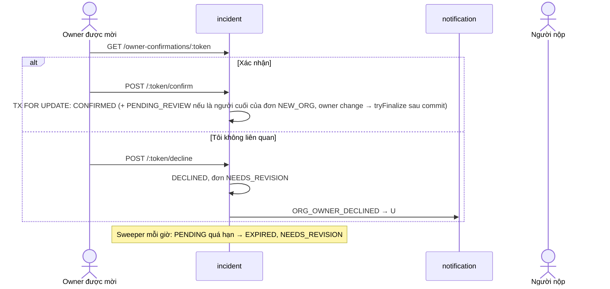
```mermaid
sequenceDiagram
  actor O as Owner được mời
  participant INC as incident
  participant NS as notification
  actor U as Người nộp
  O->>INC: GET /owner-confirmations/:token
  alt Xác nhận
    O->>INC: POST /:token/confirm
    INC->>INC: TX FOR UPDATE: CONFIRMED (+ PENDING_REVIEW nếu là người cuối của đơn NEW_ORG, owner change → tryFinalize sau commit)
  else Tôi không liên quan
    O->>INC: POST /:token/decline
    INC->>INC: DECLINED, đơn NEEDS_REVISION
    INC->>NS: ORG_OWNER_DECLINED → U
  end
  Note over INC: Sweeper mỗi giờ: PENDING quá hạn → EXPIRED, NEEDS_REVISION
```

### F12 — Thẩm định và duyệt đơn: Blue Tick, tạo tổ chức, gắn vai owner
- **Actor:** admin.
- **Điều kiện tiên quyết:** đơn `NEW_ORG` ở `PENDING_REVIEW` (admin không thấy DRAFT / AWAITING — BR-071; owner change không vào hàng đợi admin — BR-349).
- **Luồng chính:**
  1. `GET /api/v1/admin/organization-applications` (loại DRAFT, AWAITING) và `GET /:id`: kèm `owners[]` với `confirm_ip`, `confirm_ua`, `account` (từ identity `lookup-by-emails`; lỗi thì để null), `active_owner_org_count`, `same_ip_cluster` (≥ 2 owner cùng IP trong 5 phút).
  2. **Claim** `PUT /:id/claim`: ghi `reviewerId`, không đổi status (BR-070).
  3. **Yêu cầu bổ sung** `PUT /:id/request-info {message}` → NEEDS_REVISION, email `ORG_APPLICATION_NEEDS_INFO` tới `submitterEmail` kèm tracking token mới.
  4. **Từ chối** `PUT /:id/decision {decision: REJECT, reject_reason}` (khoá đơn, kiểm lại PENDING_REVIEW) → REJECTED, email `ORG_APPLICATION_REJECTED`.
  5. **Duyệt** `PUT /:id/decision {decision: APPROVE, lane, documents_waived?, documents_waived_reason?, grant_blue_tick?}` (BR-074..BR-077, BR-312):
     - Identity `POST /internal/v1/users/ensure` cho mọi owner (**ngoài** transaction); có user status 2 → OWNER_SUSPENDED.
     - Transaction: `FOR UPDATE` đơn; kiểm lại PENDING_REVIEW và mọi owner CONFIRMED; tạo `organizations` (`isEmailVerified` chỉ khi contactEmail = submitterEmail — BR-313) và `organization_channels`; với từng owner `assertOwnerQuota()` (`pg_advisory_xact_lock(hashtextextended(userId,0))` rồi đếm) và `grantMembership()` vai `LEGAL_REPRESENTATIVE` / `OWNER`, ghi `resolvedUserId`, `emitOutbox(ORG_OWNER_ONBOARD, dedupKey = ORG_OWNER_ONBOARD:<candidateId>)`; đơn → APPROVED; event APPROVED (+ DOCUMENTS_WAIVED).
     - COMMIT chạy trigger `ORG_MUST_HAVE_OWNER` (BR-315).
  6. Outbox relay → `OrganizationOwnerOnboardPublisher` (BR-079): identity `POST /internal/v1/users/:id/activation-token`; có token → email `ACCOUNT_ACTIVATION` (`/activate-account?token=`); không có (user đã active) → `ORG_OWNER_ATTACHED` với link trang tổ chức; event `OWNER_ATTACHED`.
- **Luồng lỗi:** 404 đơn ẩn / không có; 409 NOT_PENDING_REVIEW, OWNERS_NOT_ALL_CONFIRMED, ORGANIZATION_APPLICATION_CLAIMED, ALREADY_DECIDED; 422 OWNER_QUOTA_EXCEEDED (rollback toàn bộ), OWNER_SUSPENDED; 503 identity lỗi; 400 thiếu lane / lý do / giấy tờ. Publisher lỗi → relay retry theo backoff.
- **Dữ liệu thay đổi:** `organizations`, `organization_channels`, `organization_members`, `organization_applications`, `organization_application_owners`, `organization_application_events`, `outbox_events`; identity `users`, `auth_tokens`.
- **File:** `INC/modules/organization_application/organization-application-admin.service.ts > list(), getById(), claim(), requestMoreInfo(), approve(), reject()`, `INC/modules/organization/organization-membership.service.ts`, `organization-owner-onboard.publisher.ts`, `identity-owner.client.ts`, `INC/outbox/outbox-relay.bootstrap.ts`, `ID/internal/internal.routes.ts`.

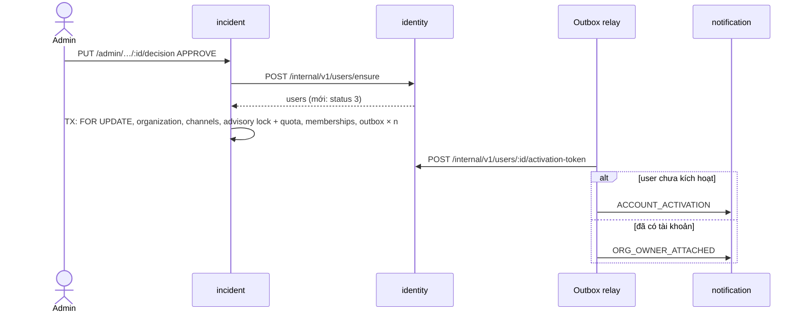
```mermaid
sequenceDiagram
  actor A as Admin
  participant INC as incident
  participant ID as identity
  participant RL as Outbox relay
  participant NS as notification
  A->>INC: PUT /admin/…/:id/decision APPROVE
  INC->>ID: POST /internal/v1/users/ensure
  ID-->>INC: users (mới: status 3)
  INC->>INC: TX: FOR UPDATE, organization, channels, advisory lock + quota, memberships, outbox × n
  RL->>ID: POST /internal/v1/users/:id/activation-token
  alt user chưa kích hoạt
    RL->>NS: ACCOUNT_ACTIVATION
  else đã có tài khoản
    RL->>NS: ORG_OWNER_ATTACHED
  end
```

### F13 — Kích hoạt tài khoản owner mới và gửi lại email kích hoạt
- `/activate-account?token` → client validate password ≥8 và khớp ô xác nhận → `POST /api/v1/auth/activate-account {token, new_password}`.
- identity `activateAccount()`: token `ACCOUNT_ACTIVATION` còn hiệu lực **và** user đang `PENDING_ACTIVATION` → set password, status=1, đánh dấu token đã dùng, revoke REFRESH (BR-011).
- **Gửi lại:** đăng nhập gặp `ACCOUNT_PENDING_ACTIVATION` → client hiện nút → `POST /api/v1/auth/activation/resend {email}` (BR-016): luôn 200; nếu user chờ kích hoạt và chưa quá 3 token/giờ thì phát token mới và identity gọi notification-service `POST /api/v1/notifications/jobs` (kind `ACCOUNT_ACTIVATION`).
- **File:** `ID/modules/auth/auth.service.ts > activateAccount(), requestActivationResend()`, `ID/modules/auth/account-activation-notify.client.ts`, `FE/apis/auth/activateAccount.ts`, `FE/app/(pages)/(auth)/activate-account/page.tsx`, `FE/app/(pages)/(auth)/sign-in/_components/SignInForm.tsx`.

### F14 — Người nộp theo dõi và rút đơn
- `/organizations/apply/status/:id?token=` → `GET /api/v1/organization-applications/:id?token=`: hồ sơ, giấy tờ, `owners[]` (trạng thái, còn bao nhiêu ngày, số lần gửi lại còn lại, `next_resend_at`), `confirmed_count / total_owners`, KYC người đại diện dạng rút gọn (4 số cuối).
- Rút: `POST /:id/withdraw?token=` ở mọi trạng thái mở, kể cả DRAFT (BR-068). Link chưa trả lời bị đặt hết hạn (giữ hash để trang xác nhận báo "đơn không còn hiệu lực"); owner đã xác nhận (trừ người nộp) nhận `ORG_APPLICATION_WITHDRAWN_NOTICE`.
- **File:** `organization-application.service.ts > getForApplicant(), withdrawApplication()`, `FE/app/(pages)/(main)/organizations/apply/status/page.tsx`, `_components/OwnerConfirmations.tsx`.

### F15 — Xác minh email liên hệ tổ chức
- **Kích hoạt khi:**
  - Tạo tổ chức qua route nội bộ `POST /api/v1/organizations` (x-internal-api-key, luồng legacy).
  - Owner đổi `contactEmail` (F16).
  - Owner bấm gửi lại (`POST /:id/resend-contact-email`).
- **Luồng:**
  1. incident gọi identity `POST /internal/v1/organization-contact-email/tokens` → token 72h, revoke token cũ của tổ chức.
  2. Gửi email `ORGANIZATION_CONTACT_VERIFY` với link `PUBLIC_INCIDENT_API_URL/api/v1/organizations/verify-contact-email?token=…`.
  3. Người nhận click → identity `…/tokens/verify` (dùng 1 lần) → kiểm tra email khớp → `isEmailVerified=true` → **302** về `/organizations/<slug>?verifiedEmail=1`.
  4. Nếu lỗi: 302 về `/organizations/email-verified?error=invalid_or_expired|not_found|mismatch`.
- **Lỗi khi resend:** 400 không có email hoặc email đã xác minh, 403 không phải owner, 502 gửi email lỗi.
- Tổ chức tạo qua duyệt đơn (F12) có `isEmailVerified` = true ngay.
- **File:** `INC/modules/organization/organization.service.ts > queueOrganizationContactVerificationEmail(), confirmOrganizationContactEmail(), resendOrganizationContactVerificationEmail()`, `identity-organization-contact-email.client.ts`, `ID/modules/auth/auth.service.ts > createOrganizationContactEmailToken(), verifyAndConsumeOrganizationContactEmailToken()`.

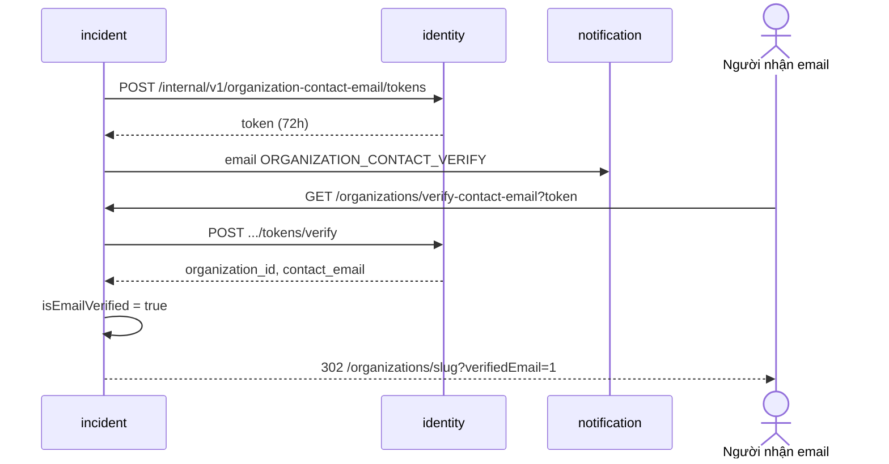
```mermaid
sequenceDiagram
  participant INC as incident
  participant ID as identity
  participant NS as notification
  actor O as Người nhận email
  INC->>ID: POST /internal/v1/organization-contact-email/tokens
  ID-->>INC: token (72h)
  INC->>NS: email ORGANIZATION_CONTACT_VERIFY
  O->>INC: GET /organizations/verify-contact-email?token
  INC->>ID: POST .../tokens/verify
  ID-->>INC: organization_id, contact_email
  INC->>INC: isEmailVerified = true
  INC-->>O: 302 /organizations/slug?verifiedEmail=1
```

### F16 — Owner cập nhật thông tin tổ chức
- `PUT /api/v1/organizations/:id` (người có quyền `ORG_EDIT`: owner, LR, ADMIN) với name, description*, logoUrl, backgroundUrl, contactEmail (BR-083).
- Kiểm tra tên + email không trùng với tổ chức khác (BR-081).
- Nếu contactEmail thay đổi: `isEmailVerified=false` và gửi link xác minh (F15). Email liên hệ không liên quan tới tài khoản đăng nhập nào.
- Enqueue dịch mô tả (F45).
- **File:** `organization.service.ts > updateOrganization()`.

### F17 — Admin duyệt hoặc ban tổ chức
- `PUT /api/v1/organizations/:id/verify {status: 1|2, reject_reason}`:
  - Duyệt (1): từ DRAFT, INACTIVE, INREVIEW, PENDING. Đang ACTIVE thì no-op.
  - Ban (2): phải có lý do. Nếu đã ban mà lý do khác thì chỉ cập nhật lý do.
- Gửi thông báo in-app `ORGANIZATION_APPROVED` hoặc `ORGANIZATION_REJECTED` tới **mọi owner**.
- **Không đổi** `trustTier` (Blue Tick không bị gỡ khi ban).
- **Hệ quả của ban:** `GET /by-slug` trả 404; `GET /:id` và danh sách vẫn trả về; tạo campaign **không** kiểm tra status của tổ chức (99).
- **File:** `organization.controller.ts > adminVerifyOrganization`, `organization.service.ts > adminVerifyOrganization()`, `notifyOwnerOfOrganizationVerified()`.
- **Khi ban:** cùng transaction huỷ các campaign nháp / chờ duyệt / chờ chỉnh sửa của tổ chức và gỡ report (`campaign-lifecycle.service.ts > cancelForLockedOrganization()`, BR-189); campaign đang chạy giữ nguyên.

### F18 — Xin gia nhập, duyệt, huỷ, rời tổ chức
1. Người dùng: `POST /api/v1/organizations/:id/join-requests`.
   - Chưa có membership nào (kể cả vai owner), chưa có yêu cầu PENDING (BR-085).
   - Tạo PENDING và gửi thông báo `VOLUNTEER_REQUEST` cho **mọi người có `MEMBER_APPROVE`** (owner, LR, ADMIN — `orgAccessService.userIdsWith()`).
2. Người có `MEMBER_APPROVE`: `GET /:id/join-requests`, rồi `PUT /join-requests/process {requestId, approved}` (BR-086):
   - Duyệt: trong 1 transaction, request APPROVED (14) và `grantMembership` vai `MEMBER`, `source = JOIN_REQUEST`. Gửi `VOLUNTEER_APPROVED`.
   - Từ chối: request REJECTED (18). Gửi `VOLUNTEER_REJECTED`.
3. Người xin: `DELETE /join-requests/cancel {requestId}` → xoá mềm (chỉ khi PENDING).
4. Thành viên: `DELETE /:id/members/me` → xoá mềm membership. Owner rời được khi còn owner khác (F18g, BR-348); owner cuối cùng → 409 ORG_MUST_HAVE_OWNER (BR-088).
- **Ý nghĩa của thành viên:** khi campaign của tổ chức được admin duyệt, các thành viên nhận thông báo `CAMPAIGN_APPROVED` (F27). `CAMPAIGN_CREATED` lúc gửi duyệt chỉ tới owner và manager (F25).
- **File:** `INC/modules/organization/organization.service.ts > createJoinRequest(), processJoinRequest(), cancelJoinRequest(), leaveOrganization()`.

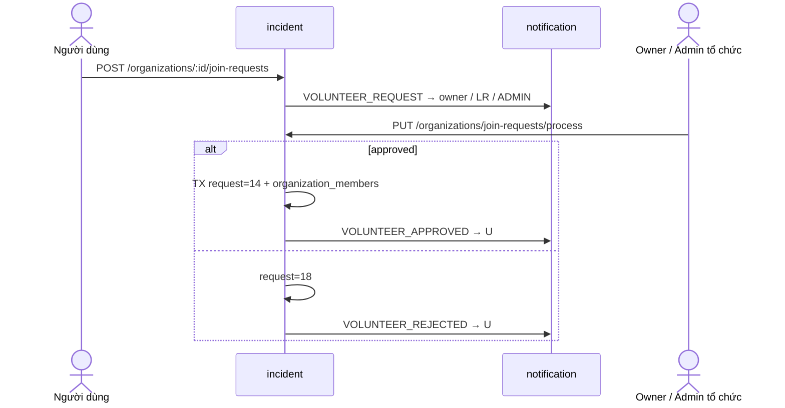
```mermaid
sequenceDiagram
  actor U as Người dùng
  participant INC as incident
  participant NS as notification
  actor O as Owner / Admin tổ chức
  U->>INC: POST /organizations/:id/join-requests
  INC->>NS: VOLUNTEER_REQUEST → owner / LR / ADMIN
  O->>INC: PUT /organizations/join-requests/process
  alt approved
    INC->>INC: TX request=14 + organization_members
    INC->>NS: VOLUNTEER_APPROVED → U
  else
    INC->>INC: request=18
    INC->>NS: VOLUNTEER_REJECTED → U
  end
```

### F18b — Mời thành viên
1. Thành viên bất kỳ (`MEMBER_INVITE`) mở dialog "Mời thành viên", tìm người qua `GET /api/v1/organizations/:id/user-search?q=` (incident gọi identity `POST /internal/v1/users/search`; email ẩn bớt trừ khi người gọi có `OWNER_PROPOSE` — BR-337).
2. `POST /api/v1/organizations/:id/invitations {user_id}` (BR-333): identity `POST /internal/v1/users/lookup-by-ids` kiểm tra ACTIVE và lấy email.
   - Người mời có `MEMBER_APPROVE` → lời mời **SENT** ngay: token 32 byte (lưu sha256), hạn 7 ngày, email `ORG_INVITATION` với link `/organizations/invitations?token=`.
   - Không có → **PENDING_APPROVAL**, website `ORG_INVITATION_PENDING` tới người có quyền duyệt.
3. Người duyệt: `PUT /:id/invitations/:invitationId/approve` → SENT + email; `/reject` → REJECTED + `ORG_INVITATION_REJECTED` cho người mời (BR-334). Người mời hoặc người duyệt huỷ được bằng `DELETE` khi còn mở (BR-335).
4. Người được mời mở link (không cần đăng nhập): `GET /api/v1/organization-invitations/:token` (có `session_mismatch` nếu đang đăng nhập tài khoản khác), `POST /:token/accept` → transaction khoá lời mời, `grantMembership(MEMBER, source INVITATION)` nếu chưa có vai, ACCEPTED; `POST /:token/decline` → DECLINED (BR-336).
5. Sweeper mỗi giờ chuyển lời mời SENT quá hạn sang EXPIRED (`owner-confirmation-expiry.job.ts`).
- **File:** `INC/modules/organization/organization-invitation.{service,controller,routes}.ts`, `organization-member-notify.client.ts`, `ID/internal/internal.routes.ts`.

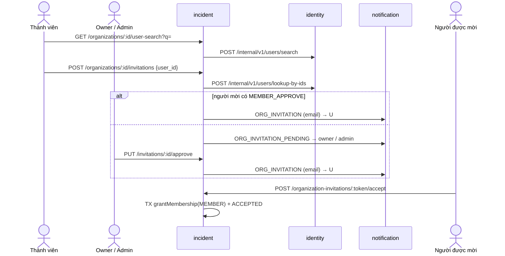
```mermaid
sequenceDiagram
  actor M as Thành viên
  actor A as Owner / Admin
  participant INC as incident
  participant ID as identity
  participant NS as notification
  actor U as Người được mời
  M->>INC: GET /organizations/:id/user-search?q=
  INC->>ID: POST /internal/v1/users/search
  M->>INC: POST /organizations/:id/invitations {user_id}
  INC->>ID: POST /internal/v1/users/lookup-by-ids
  alt người mời có MEMBER_APPROVE
    INC->>NS: ORG_INVITATION (email) → U
  else
    INC->>NS: ORG_INVITATION_PENDING → owner / admin
    A->>INC: PUT /invitations/:id/approve
    INC->>NS: ORG_INVITATION (email) → U
  end
  U->>INC: POST /organization-invitations/:token/accept
  INC->>INC: TX grantMembership(MEMBER) + ACCEPTED
```

### F18c — Đổi vai, gỡ thành viên
- `PATCH /api/v1/organizations/:id/members/:userId/role {role}` (BR-331): cần `MEMBER_MANAGE`; `role ∈ assignableRoles(actor)`; `canActOnMember(actor, target)`; cập nhật `organization_members.role` (`changeMembershipRole()`); website `ORG_MEMBERSHIP_CHANGED` tới người bị đổi.
- `DELETE /api/v1/organizations/:id/members/:userId` (BR-332): cùng giới hạn; xoá mềm; `ORG_MEMBERSHIP_CHANGED` (`removed`).
- Owner / LR không đổi vai hay gỡ được qua đây — vai owner chỉ đổi qua owner change (F18d–F18e) hoặc tự rút lui (F18g).
- **File:** `organization.service.ts > changeMemberRole(), removeMember()`, `organization-membership.service.ts > changeMembershipRole()`.

### F18d — Đề xuất thêm owner (ADD_OWNER)
Owner change được quyết **trong tổ chức**, không qua admin nền tảng. Hai loại ADD_OWNER / REMOVE_OWNER dùng chung bảng `organization_applications`, bảng approval `organization_owner_change_approvals` và `OwnerChangeExecutor` (BR-339..BR-347).
1. Owner mở "Đề xuất thêm owner", mỗi dòng chọn tài khoản có sẵn (AutoComplete, email đầy đủ) hoặc gõ email chưa có tài khoản, kèm họ tên; một lý do chung.
2. `POST /api/v1/organizations/:id/owner-changes {type:"ADD_OWNER", owners:[{user_id?, email?, full_name}], reason}` (BR-319): tạo đơn `type = ADD_OWNER`, `organizationId`, `submitterEmail` = email JWT, `profile` = snapshot tổ chức (+ `proposalReason`, `proposerName`, `subjectNames`), status AWAITING_OWNER_CONFIRMATION; chốt approver = mọi owner trừ người đề xuất (hạn 14 ngày). Mỗi người được đề xuất nhận `ORG_OWNER_CONFIRMATION_REQUEST` (`isAddOwner`); mỗi approver nhận `ORG_OWNER_CHANGE_APPROVAL_REQUEST` (website + email).
3. Người được đề xuất xác nhận / từ chối như F11. Từ chối hoặc hết hạn → WITHDRAWN, người đề xuất nhận email kèm link trang tổ chức (BR-320).
4. Owner khác đồng ý / từ chối trên trang tổ chức: `POST .../owner-changes/:applicationId/approve` | `.../reject {note?}`. Một người từ chối → REJECTED (BR-341).
5. Khi mọi candidate CONFIRMED và mọi approval APPROVED (hoặc void): `tryFinalize` — `ensureUsers` (tạo tài khoản PENDING_ACTIVATION cho email mới **lúc này**), khoá đơn + dòng owner, cấp / nâng vai `OWNER` dưới trần quota, outbox `ORG_OWNER_ONBOARD` như F12 bước 6 (BR-322, BR-345). Tổ chức chỉ có 1 owner → chỉ cần người được đề xuất xác nhận.
6. `GET /:id/owner-changes` (danh sách + trạng thái từng candidate / approver), huỷ (`POST .../cancel`, chỉ người đề xuất), gửi lại (`POST .../owners/:candidateId/resend`) — BR-321, BR-347.
- **File:** `INC/modules/organization_application/owner-change.{service,controller}.ts`, `owner-change-executor.ts`, `owner-change-notify.client.ts`, `owner-confirmation.service.ts`.

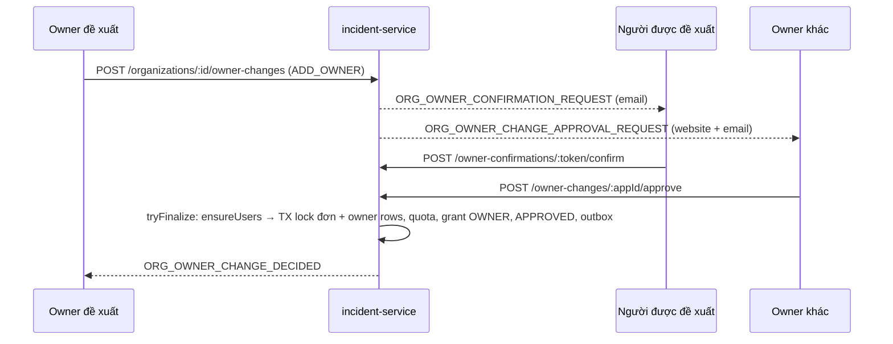
```mermaid
sequenceDiagram
  participant P as Owner đề xuất
  participant INC as incident-service
  participant C as Người được đề xuất
  participant O as Owner khác
  P->>INC: POST /organizations/:id/owner-changes (ADD_OWNER)
  INC-->>C: ORG_OWNER_CONFIRMATION_REQUEST (email)
  INC-->>O: ORG_OWNER_CHANGE_APPROVAL_REQUEST (website + email)
  C->>INC: POST /owner-confirmations/:token/confirm
  O->>INC: POST /owner-changes/:appId/approve
  INC->>INC: tryFinalize: ensureUsers → TX lock đơn + owner rows, quota, grant OWNER, APPROVED, outbox
  INC-->>P: ORG_OWNER_CHANGE_DECIDED
```

### F18e — Thu hồi owner khác (REMOVE_OWNER)
1. Owner bấm icon Remove (người-dấu-trừ) trên dòng một owner khác → modal thu hồi: người đó sẽ thành MEMBER (không có lựa chọn vai), nhập lý do.
2. `POST /:id/owner-changes {type:"REMOVE_OWNER", target_user_id, demote_to, reason}` (BR-343): target phải là owner, khác mình; một REMOVE_OWNER mở mỗi target (BR-342). Approver = mọi owner trừ người đề xuất và target. Target nhận `ORG_OWNER_REMOVAL_PROPOSED` (website + email), không phủ quyết được.
3. Không còn approver (tổ chức 2 owner) → áp dụng ngay trong request tạo. Còn approver → chờ tất cả đồng ý (một người từ chối → REJECTED; quá 14 ngày → WITHDRAWN).
4. Áp dụng: target hạ xuống `demote_to` (mặc định MEMBER); nhận `ORG_MEMBERSHIP_CHANGED`; các owner nhận `ORG_OWNER_CHANGE_DECIDED`; `reconcileOpenChanges` (BR-346). Trigger `ORG_MUST_HAVE_OWNER` vẫn bảo vệ; hai owner thu hồi nhau cùng lúc thì dòng owner bị khoá nên chỉ một bên thắng, bên kia REJECTED ("Người đề xuất không còn là owner.").
- **Thay người đại diện pháp lý (BR-344):** nếu target là LR (kể cả chính mình — LR tự hạ vai), modal bắt chọn **người thay** (`AutoCompleteUser`: owner có sẵn, tài khoản có sẵn hoặc email mới) và gửi `replacement`. Người thay nhận email xác nhận như owner mới; approver không gồm người thay. Khi áp dụng, người thay thành LR trước, rồi LR cũ xuống MEMBER; LR là owner duy nhất vẫn làm được vì đã có người thay.
- **File:** `owner-change.service.ts > create(), resolveReplacement()`, `owner-change-executor.ts > applyLocked(), demoteOrRemove()`.

### F18g — Owner tự hạ vai / rời tổ chức
1. Owner bấm icon Remove trên dòng của chính mình → modal hạ vai → `PATCH /api/v1/organizations/:id/members/me/role` (`role` mặc định MEMBER) (BR-348). Card Owners không còn nút Rời; owner đã hạ vai thành MEMBER mới dùng nút Rời ở đầu trang (`DELETE /members/me` cho owner vẫn còn ở API).
2. Transaction khoá các dòng owner của tổ chức (`FOR UPDATE`); chỉ còn mình là owner → 409 ORG_MUST_HAVE_OWNER (client vô hiệu icon Remove, tooltip gợi ý thêm owner khác trước). Ngược lại cập nhật vai / xoá mềm ngay.
3. LR không đi luồng này (422 LEGAL_REP_REPLACEMENT_REQUIRED) mà đi F18e với người thay.
4. Sau commit: `reconcileOpenChanges` — owner change do người này tạo bị huỷ, owner change đang chờ người này duyệt có thể được áp dụng; các owner còn lại nhận `ORG_OWNER_LEFT`.
- **File:** `INC/modules/organization/organization.service.ts > leaveOrganization(), stepDown(), ownerStepOut()`.

---

## C. Báo cáo sự cố (report / incident)

### F19 — Tạo báo cáo sự cố và phân tích AI
- **Actor:** người dùng đã đăng nhập. Tạo qua form web hoặc qua chat AI (F47).
- **Luồng chính:**
  1. `/incidents/create`: chọn 1–10 ảnh, nén ảnh, upload Cloudinary lấy URL. Chọn vị trí trên bản đồ, severity 1–5.
  2. `POST /api/v1/reports {title, description?, wasteType?, severityLevel, latitude, longitude, detailAddress?, imageUrls[]}` (BR-100).
  3. `report.service.ts > createReport()` chạy trong 1 transaction: report (status PENDING 12), `media` (type REPORT), `report_media_files`.
  4. Enqueue `ANALYZE_REPORT` và `TRANSLATE_TEXT` (best-effort; lỗi chỉ ghi log).
  5. Trả 201 kèm vote, trạng thái saved, hồ sơ người báo cáo.
  6. Worker `ReportAnalysisWorker` → `report-ai-analysis.service.ts > analyzeReport()`:
     - Gọi `AI_PREDICT_URL {image_urls}` (model nhận diện rác).
     - Gọi ai-service `POST /api/v1/recommendations/report` → gợi ý Markdown tiếng Việt (lỗi thì bỏ qua).
     - Trong 1 transaction: media AI_PREDICT, `ai_analysis_logs`, `aiVerified=true`, `aiRecommendation`.
- **Luồng lỗi:**
  - Validate → 400. Mọi lỗi khác khi tạo → 500.
  - AI predict lỗi → job retry, tối đa 5 lần rồi FAILED. Report vẫn tồn tại với `aiVerified=false`.
  - Client xem tiến độ AI qua `GET /reports/:id/background-jobs/status`.
- **Dữ liệu thay đổi:** `reports`, `media`, `report_media_files`, `background_jobs`, `ai_analysis_logs`.
- **File:** `INC/modules/report/report.controller.ts > createReport`, `report.service.ts > createReport()`, `report-ai-analysis.service.ts`, `INC/queue/worker/report-analysis-worker.ts`, `AI/recommendation/*`, `FE/apis/report/*`.

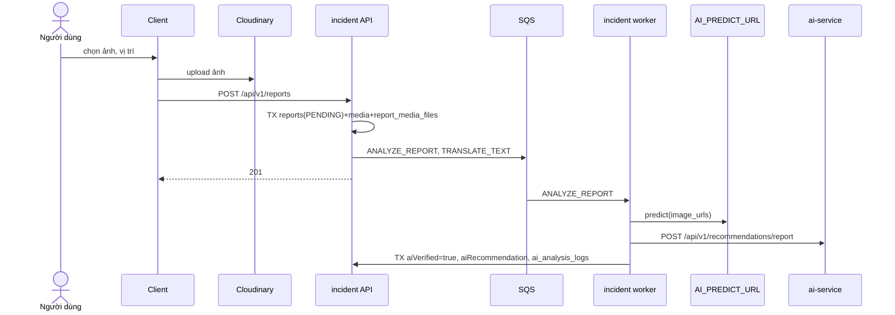
```mermaid
sequenceDiagram
  actor U as Người dùng
  participant FE as Client
  participant CLD as Cloudinary
  participant INC as incident API
  participant Q as SQS
  participant W as incident worker
  participant P as AI_PREDICT_URL
  participant AI as ai-service
  U->>FE: chọn ảnh, vị trí
  FE->>CLD: upload ảnh
  FE->>INC: POST /api/v1/reports
  INC->>INC: TX reports(PENDING)+media+report_media_files
  INC->>Q: ANALYZE_REPORT, TRANSLATE_TEXT
  INC-->>FE: 201
  Q->>W: ANALYZE_REPORT
  W->>P: predict(image_urls)
  W->>AI: POST /api/v1/recommendations/report
  W->>INC: TX aiVerified=true, aiRecommendation, ai_analysis_logs
```

### F20 — Chủ report sửa, thêm ảnh, xoá ảnh, xoá report
- Chỉ **chủ report**. Admin bị cấm. Report đã bị ban không sửa được (BR-104).
- Các thao tác:
  - `PUT /reports/:id`: cập nhật field và enqueue dịch lại.
  - `POST /reports/:id/media {imageUrls}`: thêm ảnh, đặt lại `status=PENDING` và `aiVerified=false`, enqueue ANALYZE_REPORT cho ảnh mới.
  - `DELETE /reports/:id/media/:mediaFileId`: xoá mềm ảnh.
  - `DELETE /reports/:id`: xoá mềm report.
- **Bug:** thêm ảnh vào report đã được duyệt làm report kẹt ở PENDING, vì verify sẽ là no-op khi `isVerify=true` (99).
- **File:** `report.service.ts > updateReport(), addReportImages(), deleteReportMediaFile(), deleteReport(), assertReporterMayEditReport()`.

### F21 — Admin duyệt hoặc ban report
- `/admin/incidents`:
  - `PUT /reports/:id/verify` → `status=TODO(21)`, `isVerify=true`, xoá rejectReason. Gửi thông báo `REPORT_APPROVED` cho chủ report. Đã duyệt thì no-op.
  - `PUT /reports/:id/ban {reject_reason}` → `status=INACTIVE(2)`. Gửi `REPORT_REJECTED`. Nếu đã ban thì chỉ cập nhật lý do, không gửi thông báo.
- Report ở TODO mới được gắn vào campaign (F25).
- **File:** `report.service.ts > adminVerifyReport(), adminBanReport()`, `report-status-notify.client.ts`.

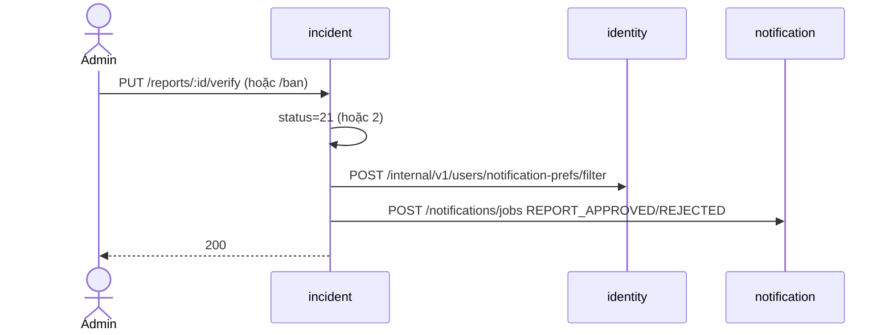
```mermaid
sequenceDiagram
  actor A as Admin
  participant INC as incident
  participant ID as identity
  participant NS as notification
  A->>INC: PUT /reports/:id/verify (hoặc /ban)
  INC->>INC: status=21 (hoặc 2)
  INC->>ID: POST /internal/v1/users/notification-prefs/filter
  INC->>NS: POST /notifications/jobs REPORT_APPROVED/REJECTED
  INC-->>A: 200
```

### F22 — Admin đánh dấu report đã xử lý và cộng điểm
- `PUT /reports/:id/mark-done` (admin):
  - Trong 1 transaction: `status=COMPLETED(17)` và outbox `REPORT_COMPLETION_GREEN_POINTS {reportId, userId, points = env REPORT_COMPLETION_GREEN_POINTS (mặc định 0)}`, dedup theo reportId.
  - Sau transaction: gửi thông báo `REPORT_STATUS {status: COMPLETED}` cho chủ report.
- Không kiểm tra trạng thái nguồn. Report PENDING hoặc đã bị ban vẫn được COMPLETED (99).
- Report cũng tự chuyển COMPLETED khi campaign chứa nó được duyệt hoàn thành (F34). Nhánh đó **không** phát outbox điểm cho report.
- Reward xử lý event: xem F36.
- **File:** `report.service.ts > adminMarkReportDone()`, `report.repository.ts > markReportAsDone()`, `INC/outbox/outbox.writer.ts`.

### F23 — Vote report/campaign và thưởng mốc vote
- `POST /api/v1/incident/votes/upvote|downvote {resourceId, resourceType}`. Vote hoạt động theo kiểu toggle (BR-130).
- Khi upvote một report có chủ và giá trị mới = 1: đếm số upvote, ghi outbox `REPORT_VOTE_MILESTONE_GREEN_POINTS {reportId, reportCreatorUserId, voteCount}`, dedup theo (reportId, voteCount).
- Reward tính điểm dựa vào ngưỡng mốc (F36).
- Tự vote cho report của mình vẫn được.
- **File:** `INC/modules/vote/vote.service.ts > upvote(), downvote(), emitReportVoteMilestoneIfNeeded()`.

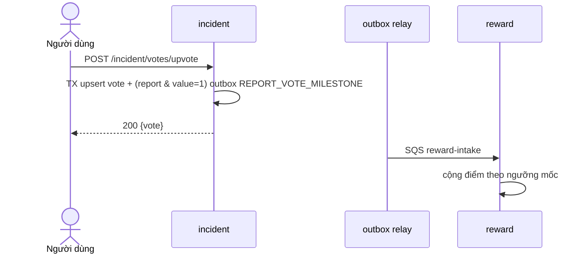
```mermaid
sequenceDiagram
  actor U as Người dùng
  participant INC as incident
  participant RL as outbox relay
  participant RW as reward
  U->>INC: POST /incident/votes/upvote
  INC->>INC: TX upsert vote + (report & value=1) outbox REPORT_VOTE_MILESTONE
  INC-->>U: 200 {vote}
  RL->>RW: SQS reward-intake
  RW->>RW: cộng điểm theo ngưỡng mốc
```

### F24 — Lưu (bookmark) report/campaign
- `POST /api/v1/incident/saved-resources/save {resourceId, resourceType}` hoạt động kiểu toggle: tạo mới, khôi phục, hoặc xoá mềm.
- `GET /api/v1/incident/saved-resources` → danh sách phân trang, kèm dữ liệu đầy đủ của report hoặc campaign.
- Dùng khi tạo campaign: chọn nhanh các report đã lưu.
- **File:** `INC/modules/saved_resource/*`.

---

## D. Chiến dịch (campaign)

### F25 — Tạo chiến dịch (nháp) và gửi duyệt
- **Actor:** thành viên có quyền `CAMPAIGN_CREATE` trong tổ chức (vai `LEGAL_REPRESENTATIVE`, `OWNER` hoặc `CAMPAIGN_MANAGER`) tạo nháp; người quản lý campaign (BR-159) gửi duyệt.
- **Điều kiện tiên quyết:**
  - Tổ chức tồn tại và status 1 (BR-151); các giới hạn của tổ chức (BR-163).
  - Difficulty có tier tương ứng ở reward (BR-152).
  - Report được chọn ở TODO và chưa thuộc campaign nào (BR-110).
- **Luồng chính — tạo nháp:**
  1. `/campaigns/create` (hoặc `?organizationId=<id>` từ tab campaign của trang tổ chức / `/campaigns/me`): nút "Tạo chiến dịch" (`CreateCampaignButton`) gọi `GET /api/v1/campaigns/create-eligibility?organizationId=` → `{canCreate, hidden, reasons[], isVerified, maxDifficulty, openCount/openLimit, reviewQueueCount/reviewQueueLimit}`; `hidden` thì ẩn nút, `!canCreate` thì khoá nút và hiện lý do. Form tải tổ chức, report TODO, thành viên tổ chức (chọn người phụ trách ca); upload banner lên Cloudinary.
  2. "Lưu nháp": `POST /api/v1/campaigns {organizationId, title, description?, banner?, difficulty, contactName?, contactPhone?, safetyNotes?, requirements?, days[], meetingPoints[], shifts[]}`. Lịch là lưới ngày × điểm tập trung (spec 1.4): `days[]` = `{startAt, endAt}` (1–7 ngày); mỗi điểm `{name?, latitude, longitude, detailAddress?, radiusKm, reportIds[]}`; mỗi ca `{dayIndex, meetingPointIndex, gatherAt?, slots, leaderUserId?}` (0 suất = tắt; ô không gửi = tắt). `scheduleFromRequest()` sắp ngày theo giờ bắt đầu và điền đủ lưới.
  3. `campaign.service.ts > createCampaign()`:
     - `campaignEligibilityService.assertCanCreateDraft()` (quyền + tổ chức không bị khoá).
     - `campaignLifecycleService.assertReportsSelectable()` (report TODO, chưa thuộc campaign nào); người phụ trách các ca phải là thành viên active (`assertScheduleUsable()` → `campaignManagerService.assertAllMembers()`).
     - Transaction Serializable: tạo campaign **DRAFT 4**, upsert người tạo vào `campaign_managers`, `replaceSchedule()` ghi `campaign_days`, `campaign_meeting_points`, `campaign_meeting_point_reports`, `campaign_shifts`, chép toạ độ / bán kính / địa chỉ của điểm đầu tiên sang `campaigns` (bản đồ, mời người ở gần, SOS). **Không khoá report**, không gửi thông báo.
  4. Enqueue `TRANSLATE_TEXT` (CAMPAIGN).
  5. Sửa nháp: `/campaigns/:id/edit` → `PUT /campaigns/:id` (F26).
- **Luồng chính — gửi duyệt:** "Gửi duyệt" (hoặc "Nộp lại" khi NEEDS_REVISION) → `POST /api/v1/campaigns/:id/submit` → `campaign-lifecycle.service.ts > submit()`:
  1. canManage; kiểm tier difficulty (ngoài transaction, gọi HTTP).
  2. Transaction Serializable:
     - `campaignEligibilityService.assertCanSubmit()` kiểm lại giới hạn (BR-163).
     - `validateCampaignForSubmit()` kiểm toàn bộ nội dung (BR-164); có lỗi → 400 `CAMPAIGN_INVALID` với `details[{field, code, message}]` liệt kê mọi lỗi.
     - `syncReportLocks()` khoá report 21 → 22 bằng compare-and-set (BR-169); bị campaign khác lấy trước → 409 `CAMPAIGN_REPORTS_TAKEN {reportIds}`.
     - Người tạo và người phụ trách các ca đang bật được upsert thành manager.
     - `transitionCampaign()` event `submit` (4 → 12) hoặc `resubmit` (19 → 12); lưu `submittedAt`, `requirements` (đã thêm mặc định), `lastSubmittedSnapshot`; nộp lại thì diff với snapshot trước vào `campaign_status_logs.changes`.
  3. Sau commit: `CAMPAIGN_PENDING_REVIEW` cho admin trong `CAMPAIGN_ADMIN_NOTIFY_USER_IDS`; `CAMPAIGN_CREATED` cho owner + manager (trừ người gửi; **không** gửi khi nộp lại). Thành viên thường chỉ nhận thông báo khi campaign được duyệt (F27).
- **Luồng lỗi:**
  - 404 không có tổ chức / campaign; 403 `ORG_PERMISSION_DENIED` khi vai không có `CAMPAIGN_CREATE`; 403 `CAMPAIGN_CREATE_NOT_ALLOWED {reasons}`; 403 `CAMPAIGN_PERMISSION_DENIED` khi gửi duyệt mà không phải người quản lý.
  - 400 difficulty không hợp lệ; 400 lịch không hợp lệ (ca trỏ tới ngày / điểm không có, trùng ô, gửi `startDate`); 422 `CAMPAIGN_MANAGER_NOT_MEMBER` (người phụ trách ca).
  - 400 `CAMPAIGN_INVALID`; 409 `CAMPAIGN_REPORTS_TAKEN`; 409 `CAMPAIGN_INVALID_TRANSITION` (gửi duyệt khi không ở 4 / 19, hoặc có người đổi status cùng lúc).
- **Client:** lỗi `details` được gắn vào từng trường của form và hiện tóm tắt; `CAMPAIGN_REPORTS_TAKEN` tô các report cần bỏ (`FE/app/(pages)/(main)/campaigns/create/_components/CampaignForm.tsx`).
- **Dữ liệu thay đổi:** `campaigns`, `campaign_managers`, `campaign_days`, `campaign_meeting_points`, `campaign_meeting_point_reports`, `campaign_shifts`, `campaign_status_logs`, `reports` (khi gửi duyệt), `background_jobs`.
- **File:** `INC/modules/campaign/campaign.controller.ts > createCampaign, getCreateEligibility, submitCampaign`, `campaign.service.ts > createCampaign(), submitCampaign()`, `campaign-eligibility.service.ts`, `campaign-lifecycle.service.ts > submit(), syncReportLocks(), notifySubmitted()`, `campaign-submit-validation.ts > validateCampaignForSubmit()`, `campaign-state-machine.ts > transitionCampaign()`, `INC/modules/reward/reward-service.client.ts`.

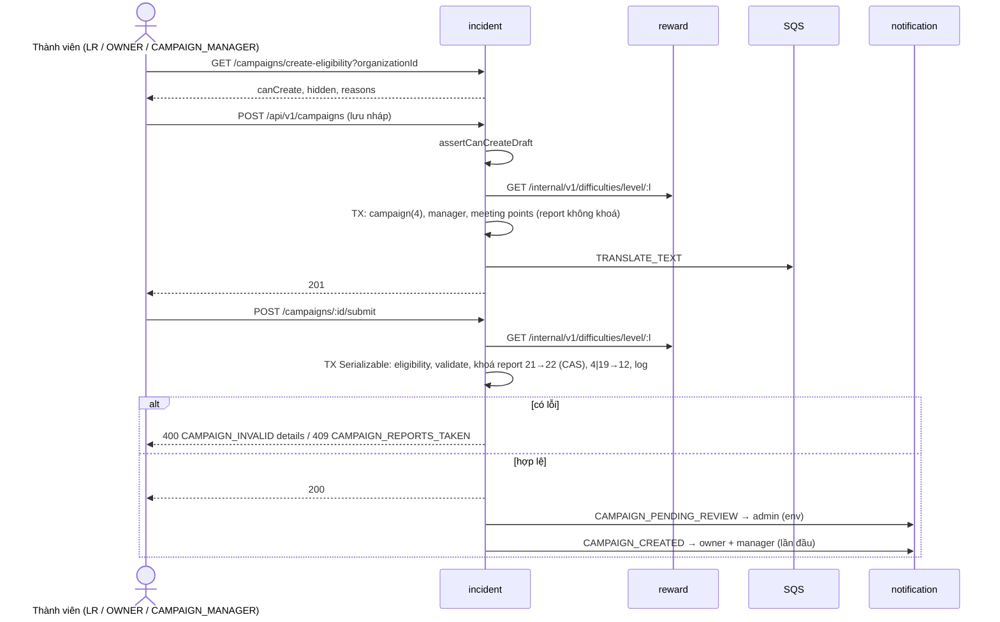
```mermaid
sequenceDiagram
  actor O as Thành viên (LR / OWNER / CAMPAIGN_MANAGER)
  participant INC as incident
  participant RW as reward
  participant Q as SQS
  participant NS as notification
  O->>INC: GET /campaigns/create-eligibility?organizationId
  INC-->>O: canCreate, hidden, reasons
  O->>INC: POST /api/v1/campaigns (lưu nháp)
  INC->>INC: assertCanCreateDraft
  INC->>RW: GET /internal/v1/difficulties/level/:l
  INC->>INC: TX: campaign(4), manager, meeting points (report không khoá)
  INC->>Q: TRANSLATE_TEXT
  INC-->>O: 201
  O->>INC: POST /campaigns/:id/submit
  INC->>RW: GET /internal/v1/difficulties/level/:l
  INC->>INC: TX Serializable: eligibility, validate, khoá report 21→22 (CAS), 4|19→12, log
  alt có lỗi
    INC-->>O: 400 CAMPAIGN_INVALID details / 409 CAMPAIGN_REPORTS_TAKEN
  else hợp lệ
    INC-->>O: 200
    INC->>NS: CAMPAIGN_PENDING_REVIEW → admin (env)
    INC->>NS: CAMPAIGN_CREATED → owner + manager (lần đầu)
  end
```

### F26 — Sửa và xoá chiến dịch
- **Sửa:** `PUT /campaigns/:id`, người quản lý campaign (người tạo, manager, hoặc LR / OWNER của tổ chức; đều phải còn là thành viên active — BR-159). Body **không** được có `status` (400). Trước khi duyệt (4 / 12 / 19) sửa được mọi trường, kể cả `meetingPoints` (thay toàn bộ), `managerIds` (đồng bộ, luôn giữ người tạo; mọi người phải là thành viên active, BR-155). Khi đang 12 / 19, khoá report đi theo điểm tập kết ngay (`syncReportLocks()`: report bị bỏ về TODO, report mới bị khoá, bị lấy mất → 409 `CAMPAIGN_REPORTS_TAKEN`) và diff được ghi log `EDIT` (`logCampaignEdit()`). Khi sửa **không enqueue dịch lại**.
- **Sau khi duyệt (spec 3.5, BR-352..BR-355):** campaign đã từng được duyệt (`approvedAt`) ở UPCOMING 27, hoặc đang PENDING_REVIEW 12 / NEEDS_REVISION 19 sau một lần sửa, đi `campaign-post-approval-edit.ts > applyPostApprovalEdit()`: ngày / điểm tập trung khớp theo `id`, sửa tại chỗ (không `replaceSchedule`), nên đăng ký giữ nguyên.
  1. Tự do: title, description, banner, contact*, safetyNotes, minVolunteersReason. Số người của ca: min / max / người phụ trách. Hai nhóm này lưu ngay, log `EDIT / edit`, không báo ai.
  2. Quan trọng: difficulty, requirements, thêm / bớt / sửa điểm tập trung hoặc điểm rác, thêm / bớt ngày, đổi ngày giờ của ngày hoặc giờ của ca đã có (≥ now + 48h, chưa bắt đầu). Kiểm lại bằng rule gửi duyệt (bỏ `START_TOO_SOON` nếu ngày đầu không mới và không đổi giờ); UPCOMING → PENDING_REVIEW qua `edit_major` (log có `changes`, đặt lại `lastSubmittedSnapshot`); outbox `CAMPAIGN_UPDATED_NEEDS_REVIEW` cho mọi TNV còn đăng ký; admin nhận `CAMPAIGN_PENDING_REVIEW` (`isResubmission`). Ca của ngày / điểm bị bỏ bị xoá cùng đăng ký của nó; TNV của ca đó nhận `CAMPAIGN_SHIFT_CLOSED`.
  3. Đổi giờ ngày / ca đã bắt đầu → 409 `SHIFT_ALREADY_STARTED`; hạ min của ca đang bật về 0 → 422 `SHIFT_MIN_REQUIRED`; `managerIds` → 409 `CAMPAIGN_NOT_EDITABLE`.
  4. Trong lúc duyệt lại: TNV đã đăng ký vẫn xem được campaign và rời ca được; người mới không đăng ký được (409 `CAMPAIGN_NOT_REGISTRABLE`), campaign không công khai. Admin duyệt → UPCOMING (`approvedAt` giữ nguyên; không mời lại người dân; CAMPAIGN_APPROVED cho owner, manager, TNV còn đăng ký). Hết hạn duyệt khi tới ngày → EXPIRED như thường, TNV nhận `CAMPAIGN_REREVIEW_EXPIRED`.
- **Đang diễn ra trở đi** (ACTIVE 1 và sau đó): `PUT /:id` luôn 409 `CAMPAIGN_NOT_EDITABLE`, kể cả trường tự do.
- Không có luồng dời lịch riêng (spec 3.6 bỏ theo quyết định sản phẩm 2026-10-02): đổi giờ đi qua sửa như trên.
- **Xoá:** `DELETE /campaigns/:id`, người tạo hoặc LR / OWNER của tổ chức, chỉ khi 4 / 12 / 19 / 2 / 20 (khác → 409 `CAMPAIGN_NOT_DELETABLE`). Campaign bị xoá mềm; report gắn với nó trở về TODO và `campaignId=null`.
- **Huỷ (spec -7 3.6, BR-356):** `POST /campaigns/:id/cancel` `{reason}`, người tạo hoặc LR / OWNER. Campaign UPCOMING / ACTIVE, hoặc đã duyệt đang 12 / 19 → transaction Serializable: `transitionCampaign(event=cancel)` → CANCELLED 11 (`rejectReason`), `releaseAllReports()`, outbox `CAMPAIGN_CANCELLED` (`byOrganizer`) cho TNV còn đăng ký và đội quản lý. Không cấp điểm. Client: nút "Cancel campaign" (`CancelCampaignButton.tsx`) trên overview và trang chi tiết khi `can_cancel_campaign`; trang chi tiết hiện banner "đã huỷ" kèm lý do. Campaign đã duyệt còn TNV thì không xoá được (409 `CAMPAIGN_HAS_VOLUNTEERS`, BR-357); bảng `/campaigns/me` ẩn nút xoá với campaign đã duyệt.
- **Lịch sử:** `GET /campaigns/:id/history` (người quản lý hoặc admin) trả các dòng `campaign_status_logs`.
- **Client:** `/campaigns/:id/edit` dùng chung `CampaignForm` với trang tạo, mở được tới UPCOMING; lối vào giống Draft / Pending: nút Edit ở từng mục và "Edit campaign" trên màn overview `/campaigns/:id/overview`. Campaign đã duyệt chạy y như nháp (Save draft / Continue tự lưu), chỉ khác: lần lưu có trường quan trọng thì hỏi xác nhận trước khi đưa về chờ duyệt, giờ ngày / ca đã có bị khoá, các trường quan trọng có nhãn "Needs review again". Trang chi tiết có banner khi đang duyệt lại. `/campaigns/me` có cột thao tác Sửa / Gửi duyệt / Xoá theo trạng thái.
- **File:** `campaign.service.ts > updateCampaign(), deleteCampaign()`, `campaign-post-approval-edit.ts > planPostApprovalEdit(), applyPostApprovalEdit()`, `campaign-lifecycle.service.ts > replaceSchedule(), syncReportLocks(), releaseAllReports(), getHistory(), notifyReReview()`, `campaign-access.service.ts > assertCanManage(), assertCanDelete()`.

### F27 — Admin duyệt, yêu cầu chỉnh sửa, chặn hoặc ban chiến dịch và mời người dân ở gần
- `/admin/campaigns` → `PUT /api/v1/campaigns/:id/review {decision: approve|request_revision|block, reason}` (lý do bắt buộc trừ approve, ≤ 5000). Chỉ JWT role admin; admin là thành viên active của tổ chức sở hữu campaign → 403 `CAMPAIGN_REVIEW_CONFLICT_OF_INTEREST` (BR-160). `PUT /:id/verify {status: 1|2, rejectReason}` còn giữ như alias deprecated (1 → approve, 2 → block).
- Chuyển trạng thái trong transaction Serializable qua `transitionCampaign()` (04 §2).
- **Duyệt (12 → UPCOMING 27, "Sắp diễn ra"):** job vòng đời chuyển sang ACTIVE 1 khi ngày đầu tới (F27).
  - Mở đăng ký ca (F28). Giữ khoá report, xoá rejectReason / revisionDeadline.
  - `CAMPAIGN_APPROVED` cho owner, manager và mọi thành viên active của tổ chức.
  - `CAMPAIGN_VERIFY_INVITE` cho người dân **trong bán kính 5 km** (BR-161): user có vị trí nhà gần đó (identity `nearby-ids`) và người từng gửi report có toạ độ gần đó (PostGIS). Trừ admin, người tạo và manager. Có lọc preference. Campaign không có toạ độ thì bỏ qua.
- **Yêu cầu chỉnh sửa (12 → NEEDS_REVISION 19):** rejectReason = lý do, `revisionDeadline` = now + 7 ngày, giữ khoá report; `CAMPAIGN_REVISION_REQUESTED` cho người tạo + owner. Người quản lý sửa rồi "Nộp lại" (F25).
- **Chặn (12 / 19 → BLOCKED 2), ban (1 → BLOCKED 2):** cùng `decision=block`; gỡ report (INPROCESS → TODO, BR-162); `CAMPAIGN_BLOCKED` cho người tạo + owner.
- **Client:** `ReviewCampaignConfirm`: campaign chờ duyệt → duyệt / yêu cầu chỉnh sửa / từ chối (nút "Reject", gửi `block`); campaign ACTIVE → ban. Tab "Chờ duyệt" gửi `excludeMemberOrgs=true`.
- **File:** `campaign.controller.ts > reviewCampaign, adminVerifyCampaign`, `campaign.service.ts > reviewCampaign(), notifyNearbyCitizensToJoinApprovedCampaign()`, `campaign-lifecycle.service.ts > review(), releaseAllReports(), notifyReviewed()`, `ID/internal/internal.routes.ts (nearby-ids)`.

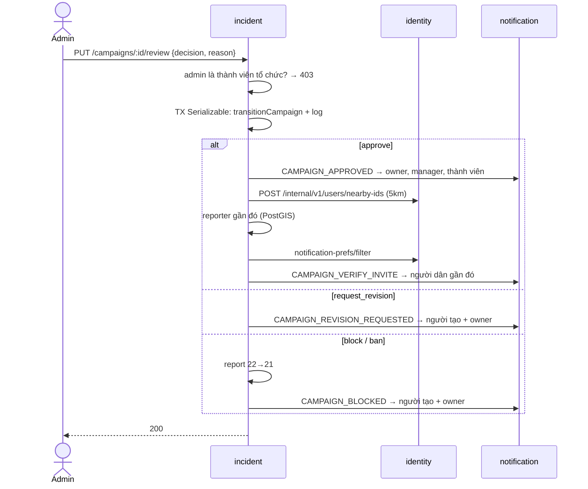
```mermaid
sequenceDiagram
  actor A as Admin
  participant INC as incident
  participant ID as identity
  participant NS as notification
  A->>INC: PUT /campaigns/:id/review {decision, reason}
  INC->>INC: admin là thành viên tổ chức? → 403
  INC->>INC: TX Serializable: transitionCampaign + log
  alt approve
    INC->>NS: CAMPAIGN_APPROVED → owner, manager, thành viên
    INC->>ID: POST /internal/v1/users/nearby-ids (5km)
    INC->>INC: reporter gần đó (PostGIS)
    INC->>ID: notification-prefs/filter
    INC->>NS: CAMPAIGN_VERIFY_INVITE → người dân gần đó
  else request_revision
    INC->>NS: CAMPAIGN_REVISION_REQUESTED → người tạo + owner
  else block / ban
    INC->>INC: report 22→21
    INC->>NS: CAMPAIGN_BLOCKED → người tạo + owner
  end
  INC-->>A: 200
```

### F27b — Job vòng đời chiến dịch (bắt đầu, hết hạn duyệt, dọn nháp, bản tin đăng ký)
- `INC/worker.ts` chạy `startCampaignLifecycleJob()` (`INC/modules/campaign/campaign-lifecycle.job.ts`): `setInterval` mỗi `CAMPAIGN_LIFECYCLE_INTERVAL_MS` (mặc định 15 phút), tắt bằng `CAMPAIGN_LIFECYCLE_ENABLED=false`.
- `startDueCampaigns()`: campaign UPCOMING 27 có ngày đầu đã tới → `transitionCampaign(event=start, actor=system)` → ACTIVE 1 (không thông báo, không gỡ report). Chạy trước `expireOverdue()`.
- `expireOverdue()`: campaign 12 / 19 có ngày đầu (`campaign_days.startAt`) đã tới, hoặc 19 quá `revisionDeadline` → `transitionCampaign(event=expire, actor=system)` → EXPIRED 20, gỡ report, `CAMPAIGN_EXPIRED` cho người tạo. Mỗi lượt tối đa 200 campaign; campaign bị người khác đổi trạng thái cùng lúc thì bỏ qua, lượt sau xét lại.
- `deleteStaleDrafts()`: DRAFT có `updatedAt` quá 30 ngày → xoá mềm (bản nháp không khoá report).
- `sendUnderstaffedAlerts()`: ngày bắt đầu trong vòng 72h (`CAMPAIGN_UNDERSTAFFED_NOTICE_HOURS`) có ca dưới số tối thiểu → `CAMPAIGN_SHIFT_UNDERSTAFFED` cho người tạo + manager; mỗi ngày xét một lần (`campaign_days.understaffed_notified_at`) (BR-172).
- `sendOverMaxAlerts()`: ca chưa bắt đầu vượt `maxVolunteers` → `CAMPAIGN_SHIFT_OVER_MAX` một lần; về ≤ max thì xoá dấu để lần vượt sau báo tiếp (BR-172).
- `sendShiftReminders()`: nhắc TNV 24h và 1h trước giờ tập trung của mỗi ngày đã đăng ký (`CAMPAIGN_SHIFT_REMINDER`, theo cài đặt `volunteerRequest`; dấu `reminded24hAt` / `reminded1hAt`) (BR-358).
- `sendShiftResultReminders()`: ca đang bật chưa có kết quả 24h sau giờ kết thúc thực tế, campaign ACTIVE → `CAMPAIGN_SHIFT_RESULT_MISSING` cho người phụ trách + người tạo + manager, lặp lại mỗi 24h (dấu `resultRemindedAt`) (BR-375).
- `sendRegistrationDigests()`: sau `CAMPAIGN_REGISTRATION_DIGEST_HOUR` (mặc định 20h giờ VN), bản tin đăng ký hằng ngày cho manager (F28, BR-174).
- **File:** `campaign-lifecycle.service.ts > startDueCampaigns(), expireOverdue(), deleteStaleDrafts(), notifyExpired()`, `INC/modules/campaign/campaign_registration/registration-digest.ts`, `staffing-alerts.ts`, `shift-reminders.ts` (BR-186).

### F28 — Tình nguyện viên đăng ký ca của chiến dịch
Thay luồng xin tham gia có duyệt (spec 3.1). Đăng ký có hiệu lực ngay, không cần duyệt, không giới hạn số người; chỉ để nhận thông báo và ước lượng số người, không ghi nhận vi phạm (spec -6). Ai thực sự tham gia được xác nhận khi điểm danh.
1. Người dùng bấm "Tham gia" (hoặc "Sửa ca đã đăng ký"): `GET /api/v1/campaigns/:id/registration-options` trả:
   - các ca còn đăng ký được (bật, chưa bắt đầu) cộng các ca người đó đang giữ;
   - mỗi ca: điểm tập trung, giờ ca, giờ tập trung, số đã đăng ký / tối thiểu – tối đa, `shortBy`, `overMax`, `registeredByMe`, `conflicts[]` (ca khác campaign của người đó bị chồng giờ);
   - điều kiện tham gia, lưu ý an toàn, `registrable` + `reason` (`STATUS` / `NO_SHIFT`).
2. Người dùng tick một hoặc nhiều ca (kể cả nhiều ca cùng ngày), tích xác nhận điều kiện, rồi `PUT /api/v1/campaigns/:id/registrations/me {shiftIds, acceptConditions}`:
   - thay toàn bộ tập ca của người đó trong một transaction; ca mới được kiểm theo BR-170, ca bị bỏ là rời ca, tự do trước giờ bắt đầu và không ghi nhận gì (BR-173). Nút "Rời chiến dịch" gửi đúng các ca đã bắt đầu đang giữ, tức bỏ mọi ca chưa bắt đầu;
   - trả `{shiftIds, added, left, warnings[]}`; `warnings` (`OVERLAP` / `OVER_MAX`) không chặn (BR-171).
3. Người quản lý (BR-159), TNV đã đăng ký, admin: `GET /api/v1/campaigns/:id/registrations` → `{shifts, nextInviteAt}`, từng ca kèm người đăng ký, **chỉ để xem** (manager không gỡ, không chuyển ca TNV).
3a. Ca thiếu người (spec 3.2): manager bấm "Mời người dân gần đây" → `POST /api/v1/campaigns/:id/invite-nearby`: tìm người dân trong 5 km quanh mọi điểm tập trung có ca mở (`nearby-users.ts > findNearbyUserIds()`: vị trí đã lưu + người từng báo cáo gần đó), trừ người tạo / manager / người đã đăng ký, gửi `CAMPAIGN_JOIN_INVITE` (payload `shortBy`); tối đa một lần mỗi 24h, giữ chỗ bằng compare-and-set trên `campaigns.last_nearby_invite_at` → `{invited}` (BR-174).
3b. Manager tắt một ca chưa bắt đầu (ngày đó còn ca bật khác): `POST /api/v1/campaigns/:id/shifts/:shiftId/close` → transaction: ca `minVolunteers = 0`, `maxVolunteers = null`; đăng ký đang hiệu lực của ca → `leftAt`, `closedByShift = true`; log `EDIT / close_shift`, và outbox `WEBSITE_NOTIFICATION` (cùng transaction) → relay của worker gửi `CAMPAIGN_SHIFT_CLOSED` cho các TNV đó, có thử lại nếu notification-service lỗi, mời mở popup chọn ca khác → `{notified}` (BR-174). Gộp ca **[CHƯA HOÀN THIỆN]**.
4. Không gửi thông báo theo từng lượt. Job vòng đời (F27b) gửi `CAMPAIGN_REGISTRATION_DIGEST` mỗi ngày một lần cho người tạo + manager của mỗi campaign có đăng ký mới, tách số theo ngày của campaign, rồi đánh dấu `managerNotifiedAt` (BR-174).
- `GET /campaigns/volunteers/approved` giữ đường dẫn, trả mỗi người có ≥ 1 đăng ký ca (BR-158). Điểm danh không yêu cầu đăng ký ca (người chưa đăng ký vẫn check-in được, F31).
- **File:** `INC/modules/campaign/campaign_registration/campaign_registration.service.ts > getOptions(), setMyShifts(), listByShift(), inviteNearby(), closeShift()`, `campaign_registration.repository.ts`, `registration-digest.ts`, `staffing-alerts.ts`, `staffing-shared.ts`, `INC/modules/campaign/nearby-users.ts`.

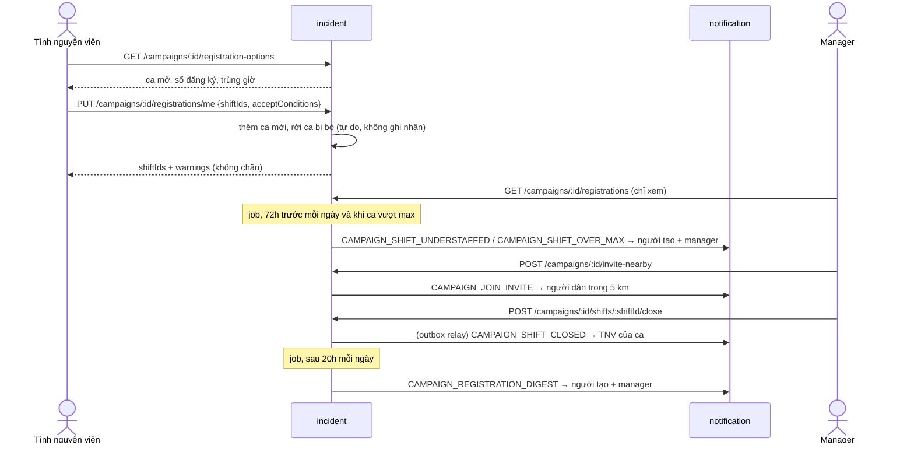
```mermaid
sequenceDiagram
  actor V as Tình nguyện viên
  participant INC as incident
  participant NS as notification
  actor M as Manager
  V->>INC: GET /campaigns/:id/registration-options
  INC-->>V: ca mở, số đăng ký, trùng giờ
  V->>INC: PUT /campaigns/:id/registrations/me {shiftIds, acceptConditions}
  INC->>INC: thêm ca mới, rời ca bị bỏ (tự do, không ghi nhận)
  INC-->>V: shiftIds + warnings (không chặn)
  M->>INC: GET /campaigns/:id/registrations (chỉ xem)
  Note over INC: job, 72h trước mỗi ngày và khi ca vượt max
  INC->>NS: CAMPAIGN_SHIFT_UNDERSTAFFED / CAMPAIGN_SHIFT_OVER_MAX → người tạo + manager
  M->>INC: POST /campaigns/:id/invite-nearby
  INC->>NS: CAMPAIGN_JOIN_INVITE → người dân trong 5 km
  M->>INC: POST /campaigns/:id/shifts/:shiftId/close
  INC->>NS: (outbox relay) CAMPAIGN_SHIFT_CLOSED → TNV của ca
  Note over INC: job, sau 20h mỗi ngày
  INC->>NS: CAMPAIGN_REGISTRATION_DIGEST → người tạo + manager
```

### F29 — Quản lý manager của chiến dịch
- `POST /campaigns/:id/add-managers {userIds[]}`, `POST /:id/remove-manager`, `GET /:id/managers`.
- Người được làm: người quản lý campaign (người tạo, manager hiện tại, LR / OWNER của tổ chức — BR-159).
- Người được thêm phải là thành viên active của tổ chức sở hữu campaign, nếu không → 422 `CAMPAIGN_MANAGER_NOT_MEMBER` (BR-155). Thêm lại người từng bị gỡ thì khôi phục dòng cũ. Không gỡ được người tạo → 422 `CANNOT_REMOVE_CAMPAIGN_CREATOR` (BR-156).
- Gỡ manager đang phụ trách ca chưa kết thúc → 409 `CAMPAIGN_MANAGER_LEADS_SHIFTS` kèm danh sách ca; gán người khác trước (BR-156).
- Người phụ trách ca phải thuộc đội quản lý: người tạo, manager, LR / OWNER (BR-350). Đổi người phụ trách: `PUT /campaigns/:id/shifts/:shiftId/leader {leaderUserId}` (BR-351).
- Rời hoặc bị gỡ khỏi tổ chức, cùng transaction (BR-157): dòng manager ở mọi campaign của tổ chức bị xoá mềm; campaign người đó tạo chuyển cho owner lâu năm nhất (log `transfer_creator`, `CAMPAIGN_CREATOR_TRANSFERRED`); ca chưa kết thúc người đó phụ trách bị bỏ người phụ trách (log `clear_shift_leader`, `CAMPAIGN_SHIFT_LEADER_REMOVED` cho đội). Owner hạ vai chỉ mất ca của campaign mà người đó không còn trong đội.
- **Client:** tab Managers của `/campaigns/:id` có nút "Add manager" (dialog `AutoCompleteUser` theo tổ chức của campaign, chỉ chọn được thành viên chưa là manager) và icon gỡ trên từng manager trừ người tạo, chỉ khi `can_manage_campaign`; manager đang phụ trách ca sắp tới thì dialog gỡ liệt kê ca (link sang trang ca) và khoá nút gỡ. Trang ca có nút đổi người phụ trách; ca thiếu người phụ trách hiện nhãn đỏ "Cần gán người phụ trách".
- **File:** `INC/modules/campaign/campaign_manager/campaign_manager.service.ts > removeManager(), assertLeadsNoShifts(), setShiftLeader()`, `campaign_manager/campaign-team.ts`, `campaign_manager/campaign-team-cleanup.ts > onMemberGone(), onRightsReduced()`.

### F30 — Quản lý task (đã bỏ)
Tính năng Task đã bị gỡ: không còn endpoint `/campaigns/:id/tasks`, `/campaigns/tasks/*` (gọi vào trả 404; riêng `GET /campaigns/tasks/my-assigned` rơi vào `GET /campaigns/:id` nên trả 400 vì id không phải UUID), bốn bảng task bị xoá ở migration `20261006100000_drop_campaign_tasks`. Kết quả công việc ghi theo ca (F31b); Báo hoàn thành và admin duyệt không còn kiểm task (F33, F34).

### F31 — Điểm danh theo ca (QR động, GPS)
Spec -8 4.1. Điểm danh theo **từng ca**, check-in và check-out; thay QR theo campaign cũ (hai endpoint cũ `POST /campaigns/:id/attendance-qr`, `POST /campaigns/:id/attendance-check-in` luôn trả 410 `ATTENDANCE_LEGACY_GONE`, bảng `campaign_attendance_check_ins` chỉ còn là lịch sử — BR-367).
1. Người phụ trách ca hoặc người quản lý campaign mở phiên: `POST /campaigns/:id/shifts/:shiftId/attendance/session` → `{session: {id, openedBy, expiresAt}}` (đang có phiên mở thì trả phiên đó). Phiên ≤ 60 phút, không quá giờ kết thúc ca + 30 phút, mở lại được. Chỉ khi ca bật, campaign UPCOMING / ACTIVE, now trong [min(gatherAt, startAt) − 30 phút, endAt + 30 phút], ngoài ra 409 `ATTENDANCE_NOT_OPEN` (BR-359).
2. Màn hình người phụ trách gọi `GET /campaigns/:id/shifts/:shiftId/attendance/qr` mỗi `periodSec` (600 giây = 10 phút; spec -8 ghi 15–30 giây, đổi theo quyết định sản phẩm) → `{token, periodSec, sessionId, sessionExpiresAt}`; token là JWT `{purpose: "shift_attendance_qr_v2", campaignId, shiftId, sessionId, ts}` ký bằng `JWT_SECRET`, không có `exp`. QR mã hoá `${origin}/campaigns/:id?attendance=<jwt>` (BR-360).
3. Người tham gia quét bằng camera, web mở link, lấy GPS chính xác rồi `POST /campaigns/:id/attendance/scan {token, latitude, longitude, accuracy, scannedAt?}`. Server kiểm theo thứ tự (BR-361): `scannedAt` không ở tương lai quá 1 phút; chữ ký + purpose, `0 ≤ scannedAt − ts ≤ 2 chu kỳ` (lệch đồng hồ 5 giây) → 422 `ATTENDANCE_QR_INVALID`; đúng campaign; phiên còn mở lúc quét → 409 `ATTENDANCE_NOT_OPEN`; khung giờ ca; người quét là người phụ trách ca hoặc người mở phiên → 403 `ATTENDANCE_SELF_CHECK_IN`. Vì mã hợp lệ tới 2 chu kỳ, một mã (hoặc ảnh chụp của nó) dùng được tối đa khoảng 20 phút. Vị trí **không còn chặn**: cách điểm tập trung của ca > 50 m hoặc `accuracy` > 50 m thì vẫn ghi check-in / check-out nhưng gắn cờ `outOfArea` / `lowAccuracy` (kèm khoảng cách) và log `EDIT / attendance_flagged` (actorRole `volunteer`, `changes {shiftId, userId, phase, distanceM, accuracy, outOfArea, lowAccuracy}`).
4. Kết quả (BR-362): lần đầu = check-in (không sau giờ kết thúc ca; ghi `preRegistered`, người chưa đăng ký vẫn vào được); lần sau ≥ 10 phút sau check-in = check-out (`checkOutMethod = scan`), sớm hơn → `already_checked_in`, đã ra → `already_checked_out`. Response `{action, shiftId, checkInAt, checkOutAt, eligible, flags {outOfArea, lowAccuracy, distanceM}}`; bị gắn cờ thì client vẫn báo thành công kèm cảnh báo vàng. Client gửi `scannedAt` khi đồng bộ offline (dành cho app mobile; web chỉ quét online), request tới trễ hơn một chu kỳ (10 phút) thì gắn `offline`.
5. Điểm danh tay (BR-364): `POST /campaigns/:id/shifts/:shiftId/attendance/manual {userId, reason, checkInAt?}` (người phụ trách / người quản lý, trong khung giờ phiên, không cho chính mình, tối đa max(1, 20% số người có mặt)); transaction Serializable, log `EDIT / manual_attendance`.
6. Kết thúc (BR-363): `POST /campaigns/:id/shifts/:shiftId/attendance/close` → đóng phiên đang mở, check-out mọi người còn trong ca tại min(now, giờ kết thúc thực tế của ca) với `checkOutMethod = session_close` → `{checkedOut}`.
7. Xem (BR-366): `GET /campaigns/:id/shifts/:shiftId/attendance` (người phụ trách, người quản lý, platform admin) → phiên, `canRun`, số có mặt / tay / đủ điều kiện / `flagged` (gắn cờ, chưa loại), từng dòng (kèm cờ, khoảng cách, `excluded`, `excludeReason`); dòng gắn cờ xếp trước.
8. Loại / khôi phục (BR-368): người phụ trách ca hoặc người quản lý xem các dòng gắn cờ rồi `POST /campaigns/:id/shifts/:shiftId/attendance/:userId/exclude {reason}` (ghi `excludedAt`, `excludedBy`, `excludeReason`, log `attendance_excluded`) hoặc `.../restore` (xoá các cột đó, log `attendance_restored`); không có dòng → 404; campaign COMPLETED → 409 `CAMPAIGN_NOT_EDITABLE`. Dòng gắn cờ mà không bị loại vẫn được tính điểm (quyết định sản phẩm).
- **Ý nghĩa:** một ca đủ điều kiện khi có check-out, thời gian có mặt trong giờ ca ≥ 60% độ dài ca và không bị loại (BR-365); điểm khi hoàn thành chia theo tỉ lệ ca đủ điều kiện / ca đã đăng ký (F34, BR-167).
- Kết quả và trạng thái ca (spec -8 4.2): F31b. Xử lý chiến dịch quá ngày kết thúc (spec -8 4.4) **[CHƯA HOÀN THIỆN]**.
- **File:** `INC/modules/campaign/campaign_attendance/shift-attendance.service.ts > openSession(), issueQr(), scan(), closeSession(), addManual(), setExcluded(), listForShift(), completionCredits()`, `shift-attendance-qr.ts > signShiftQr(), verifyShiftQr()`, `campaign_attendance.repository.ts`, `DC/campaign-lifecycle.ts` (hằng `CAMPAIGN_ATTENDANCE_*`), `FE/app/(pages)/(main)/campaigns/[id]/_components/ShiftAttendancePanel.tsx`, `CampaignAttendanceCheckInHandler.tsx`.

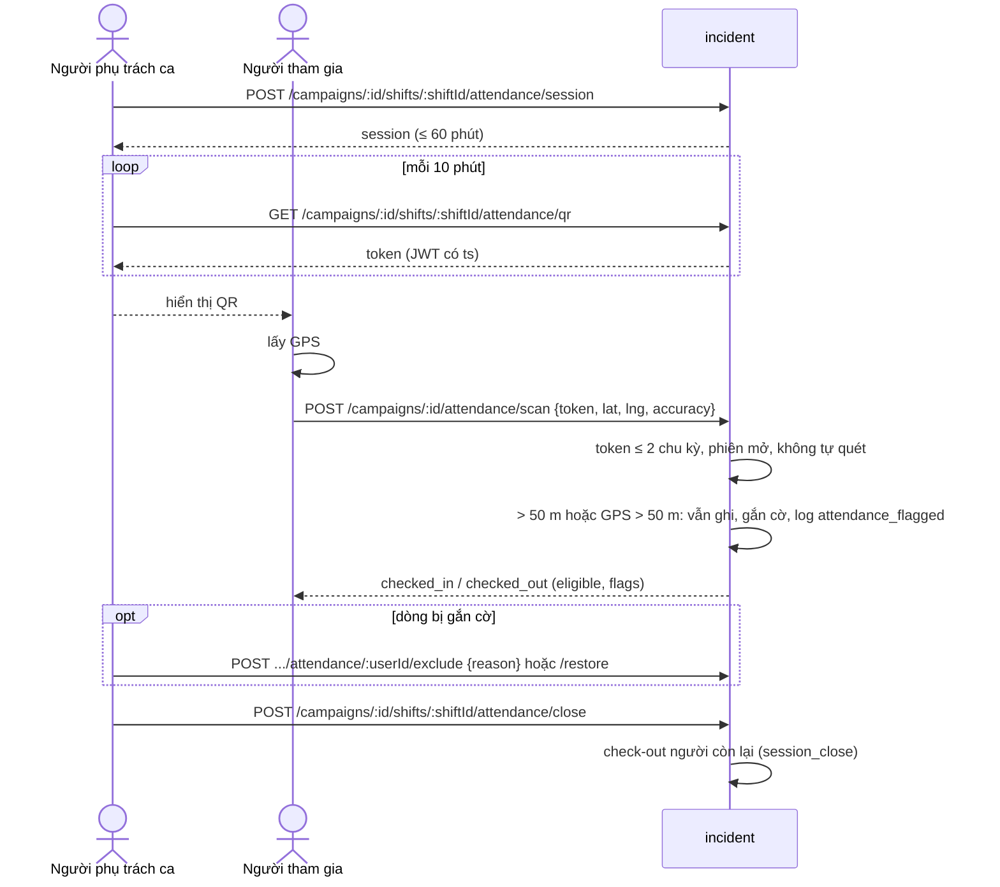
```mermaid
sequenceDiagram
  actor L as Người phụ trách ca
  actor V as Người tham gia
  participant INC as incident
  L->>INC: POST /campaigns/:id/shifts/:shiftId/attendance/session
  INC-->>L: session (≤ 60 phút)
  loop mỗi 10 phút
    L->>INC: GET /campaigns/:id/shifts/:shiftId/attendance/qr
    INC-->>L: token (JWT có ts)
  end
  L-->>V: hiển thị QR
  V->>V: lấy GPS
  V->>INC: POST /campaigns/:id/attendance/scan {token, lat, lng, accuracy}
  INC->>INC: token ≤ 2 chu kỳ, phiên mở, không tự quét
  INC->>INC: > 50 m hoặc GPS > 50 m: vẫn ghi, gắn cờ, log attendance_flagged
  INC-->>V: checked_in / checked_out (eligible, flags)
  opt dòng bị gắn cờ
    L->>INC: POST .../attendance/:userId/exclude {reason} hoặc /restore
  end
  L->>INC: POST /campaigns/:id/shifts/:shiftId/attendance/close
  INC->>INC: check-out người còn lại (session_close)
```

### F31b — Kết quả và trạng thái ca
Spec -8 4.2 (và 5.1 cho Báo hoàn thành).
- **Trạng thái ca** tính từ dữ liệu, không lưu cột (BR-369): `off` (ca tắt) → `upcoming` → `running` → `awaiting_result` (đã qua giờ kết thúc thực tế `endedAt ?? endAt`, chưa có kết quả) → `ended` (có kết quả). Trả trong `shifts[].status` của chi tiết campaign.
1. Từ lúc ca bắt đầu, người phụ trách ca hoặc người quản lý mở tab Kết quả của ca: `GET /campaigns/:id/shifts/:shiftId/result` → trạng thái, quyền (`canEdit`, `canView`, `canContribute`, `locked`), điểm rác của điểm tập trung (`reportIds`), kết quả đã lưu và kho ảnh (BR-373).
2. TNV đã điểm danh ca (chưa bị loại), người phụ trách và người quản lý upload ảnh / video thẳng lên Cloudinary từ client rồi `POST /campaigns/:id/shifts/:shiftId/media {url, kind}`; xoá bằng `DELETE …/media/:mediaId` (người đăng, người phụ trách, người quản lý) (BR-372).
3. Người phụ trách nộp / sửa kết quả: `PUT /campaigns/:id/shifts/:shiftId/result {description, wasteBags?, wasteKg?, reports[{reportId, status: cleaned|partial, beforeUrls[], afterUrls[]}], mediaIds[]}` → kiểm điểm rác thuộc điểm tập trung, có ≥ 1 ảnh sau (ảnh trước không bắt buộc), có mô tả và có ≥ 1 điểm rác hoặc ≥ 1 ảnh; upsert kết quả, thay danh sách điểm rác, đánh dấu ảnh được chọn `includedInResult`; log `EDIT / shift_result` (BR-370). Sửa được tới khi campaign rời ACTIVE (Báo hoàn thành).
4. Ca đang chạy đã có kết quả có thể kết thúc sớm: `POST /campaigns/:id/shifts/:shiftId/end` → transaction: `endedAt = now`, đóng phiên điểm danh và check-out mọi người tại now, log `EDIT / shift_ended_early`; ca thành `ended`, điều kiện 60% tính trên độ dài thực tế (BR-371, BR-365).
5. Ca qua giờ kết thúc mà chưa có kết quả ở `awaiting_result`; sau 24h job vòng đời nhắc người phụ trách và đội quản lý mỗi ngày (`CAMPAIGN_SHIFT_RESULT_MISSING`, BR-375).
6. Người quản lý / platform admin xem tổng quan: `GET /campaigns/:id/shift-overview` → từng ca (trạng thái, đăng ký, có mặt, đủ điều kiện, khối lượng) và tổng (ca Kết thúc / ca bật, có mặt / đăng ký, tỉ lệ, túi, kg, điểm rác sạch / làm dở / chưa xử lý) (BR-374). Web vẽ lưới ngày × điểm tập trung ở tab "Progress" (Tiến độ) của trang chiến dịch; bấm một ô ca mở popover kết quả của ca đó (gọi `GET …/shifts/:shiftId/result` khi mở).
7. Báo hoàn thành (F33) chỉ qua khi mọi ca đang bật đã `ended` (409 `CAMPAIGN_SHIFTS_NOT_ENDED {shiftIds}`).
- **[CHƯA HOÀN THIỆN]:** chưa kiểm GPS hay thời điểm chụp của ảnh (chỉ lưu URL); admin từ chối để mở lại ca (spec 5.2) chưa có; bản đồ điểm rác (sạch / làm dở / chưa xử lý) chưa có; Báo hoàn thành chưa tự tổng hợp submission từ kết quả ca (spec 5.1).
- **File:** `INC/modules/campaign/campaign_shift_result/shift-status.ts > shiftStatusOf(), effectiveEnd()`, `shift-result.service.ts > get(), save(), endEarly(), addMedia(), removeMedia(), overview(), assertAllShiftsEnded()`, `shift-result-reminders.ts > sendShiftResultReminders()`, `shift-attendance.service.ts > closeAllInTx()`, `FE/app/(pages)/(main)/campaigns/[id]/_components/ShiftResultPanel.tsx`, `ShiftProgressCard.tsx`.

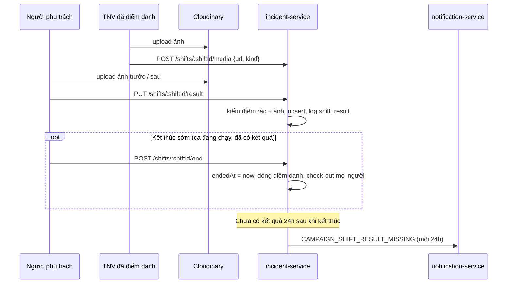
```mermaid
sequenceDiagram
  participant L as Người phụ trách
  participant V as TNV đã điểm danh
  participant C as Cloudinary
  participant INC as incident-service
  participant NS as notification-service
  V->>C: upload ảnh
  V->>INC: POST /shifts/:shiftId/media {url, kind}
  L->>C: upload ảnh trước / sau
  L->>INC: PUT /shifts/:shiftId/result
  INC->>INC: kiểm điểm rác + ảnh, upsert, log shift_result
  opt Kết thúc sớm (ca đang chạy, đã có kết quả)
    L->>INC: POST /shifts/:shiftId/end
    INC->>INC: endedAt = now, đóng điểm danh, check-out mọi người
  end
  Note over INC: Chưa có kết quả 24h sau khi kết thúc
  INC->>NS: CAMPAIGN_SHIFT_RESULT_MISSING (mỗi 24h)
```

### F32 — Gửi SOS và giải quyết SOS
- `POST /api/v1/sos {campaignId, content, phone}`: campaign phải ACTIVE và có toạ độ (BR-190). SOS lấy toạ độ và địa chỉ của campaign, status=1.
- `GET /api/v1/sos` (có lọc theo khoảng cách PostGIS nếu gửi lat/lng). Trang `/maps` poll mỗi 10 giây.
- `PUT /api/v1/sos/:id/solved` → COMPLETED (17). Chỉ platform admin hoặc người quản lý campaign của SOS; người khác → 403 `SOS_PERMISSION_DENIED` (BR-192).
- Khi campaign được duyệt hoàn thành, mọi SOS chưa xong của campaign chuyển COMPLETED.
- **Không có thông báo** nào khi tạo SOS; thông báo và leo thang SOS (spec -8 4.3) **[CHƯA HOÀN THIỆN]**.
- **File:** `INC/modules/sos/*`.

### F33 — Gửi hoàn thành chiến dịch và cộng đồng xác nhận
1. Người quản lý campaign (BR-159): `PUT /campaigns/:id/mark-done`:
   - Campaign phải ở ACTIVE hoặc INREVIEW.
   - Mọi ca đang bật (`minVolunteers > 0`) đã Kết thúc, tức đã qua giờ kết thúc thực tế và có kết quả (BR-374); còn thì 409 `CAMPAIGN_SHIFTS_NOT_ENDED {shiftIds}`. Tự tổng hợp submission từ kết quả ca (spec 5.1) **[CHƯA HOÀN THIỆN]**.
   - → **WAITING_CONFIRMED (7)** qua `transitionCampaign(event=submit_completion)`.
2. Gửi thông báo:
   - `CAMPAIGN_COMPLETION_PENDING_ADMIN` tới danh sách user id trong env `CAMPAIGN_ADMIN_NOTIFY_USER_IDS` (tên cũ `CAMPAIGN_COMPLETION_ADMIN_NOTIFY_USER_IDS` vẫn được đọc khi chưa đặt tên mới; không lọc preference).
   - `CAMPAIGN_COMPLETION_VERIFY_INVITE` tới người dân trong bán kính 5 km (trừ người gửi, người tạo, manager, volunteer).
3. Cộng đồng: `POST /campaigns/:id/completion-verification {value: 1|-1}` (chỉ khi campaign ở 7 hoặc 17; gửi lại cùng giá trị thì huỷ). Kết quả **chỉ để admin tham khảo**, không tự động làm gì.
- **Lỗi:** status sai → 500 (message không được map); còn ca chưa Kết thúc → 409 `CAMPAIGN_SHIFTS_NOT_ENDED`. Không còn điều kiện về task (tính năng Task đã bỏ).
- **File:** `campaign.service.ts > submitCampaignCompletionForAdminApproval()`, `campaign_completion_verification.service.ts > submit()`.

### F34 — Admin duyệt hoặc từ chối hoàn thành chiến dịch và trao điểm
- `PUT /campaigns/:id/completion-review {decision: approve|reject, rejectReason?}`.
- **Approve** (campaign phải ở 7):
  1. Lấy tier difficulty từ reward (không còn kiểm task).
  2. `shift-attendance.service.ts > completionCredits()`: mỗi người có ≥ 1 ca đủ điều kiện (BR-365) nhận `round(tier.greenPoints × min(1, số ca đủ điều kiện / số ca đăng ký đang hiệu lực))`, 0 ca đăng ký tính là 1 (người không đăng ký trước nhận 100%); hệ số duyệt một phần (spec 5.2) tạm 100% (BR-167).
  3. Transaction Serializable:
     - campaign → COMPLETED (17), rejectReason=null.
     - Mọi report của campaign → 17.
     - Mọi SOS → 17.
     - Outbox `CAMPAIGN_COMPLETION_GREEN_POINTS {campaignId, credits[]}` (nếu có người nhận), dedup theo campaignId.
  4. Sau commit:
     - `CAMPAIGN_DONE` tới mọi người đang đăng ký ca **cộng** mọi người được cộng điểm (kể cả người không điểm danh).
     - `CAMPAIGN_COMPLETION_APPROVED_BY_ADMIN` tới mọi owner tổ chức.
  5. Relay đẩy event lên SQS `reward-intake`; reward cộng điểm (F36).
- **Reject** (campaign phải ở 7, cần lý do):
  - Campaign về **ACTIVE (1)** kèm rejectReason.
  - Gửi `CAMPAIGN_COMPLETION_REJECTED_BY_ADMIN` tới mọi owner.
- **[CHƯA HOÀN THIỆN]:** outbox `CAMPAIGN_FACEBOOK_RECOGNITION` bị comment (F48).
- **File:** `campaign.service.ts > adminFinalizeCampaignCompletion(), adminRejectCampaign()`, `INC/outbox/*`.

```mermaid
sequenceDiagram
  actor A as Admin
  participant INC as incident
  participant RW as reward
  participant RL as outbox relay
  participant Q as SQS reward-intake
  participant NS as notification
  A->>INC: PUT /campaigns/:id/completion-review approve
  INC->>RW: GET difficulty tier (greenPoints)
  INC->>INC: TX: campaign/report/sos=17 + outbox CAMPAIGN_COMPLETION_GREEN_POINTS
  INC->>NS: CAMPAIGN_DONE → volunteers, APPROVED_BY_ADMIN → các owner
  INC-->>A: 200
  RL->>Q: publish envelope
  Q->>RW: RewardIntakeWorker
  RW->>RW: green point + SP + VRP
```

### F35 — Submission kết quả chiến dịch
- Người quản lý campaign: `POST /campaigns/:id/submissions` → INREVIEW (9). Người nộp thêm kết quả: `POST /submissions/:id/results {title, mediaUrls[]}`.
- Manager duyệt: `PUT /submissions/:id/process` → APPROVED (14) hoặc REJECTED (18). Người nộp có thể tự duyệt submission của mình.
- **Không có side effect** lên campaign và không có thông báo.
- **[CHƯA HOÀN THIỆN]:**
  - Không có API tạo kết quả nháp, nên `current-results` luôn rỗng.
  - Admin có danh sách `GET /campaigns/admin/awaiting-multi-submission-review` nhưng không có hành động đi kèm.
- **File:** `INC/modules/campaign/campaign_submission/campaign_submission.service.ts`.

---

## E. Điểm, quà tặng, gamification

### F36 — Reward nhận event và cộng điểm
- **Actor:** hệ thống.
- **Nguồn event:**
  - `REPORT_COMPLETION_GREEN_POINTS` (F22)
  - `REPORT_VOTE_MILESTONE_GREEN_POINTS` (F23)
  - `CAMPAIGN_COMPLETION_GREEN_POINTS` (F34)
- **Luồng:**
  1. `RewardIntakeWorker` (2 instance) nhận message từ `SQS_REWARD_INTAKE_QUEUE_URL` → `greenPointService.applyQueuedJob` → strategy theo jobType → validate payload.
  2. Transaction Serializable, cho mỗi credit:
     - Insert `green_point_transactions`. Trùng (user, type, resource) thì bỏ qua (BR-240).
     - Upsert `user_green_point_balances += points`.
     - **SP:** ghi sổ và lô ví, hết hạn sau `expirationDays` (mặc định 90).
     - **RP:** `CAMPAIGN_COMPLETION` → VRP; report hoặc mốc vote → CRP. Gắn vào season hiện tại (không có season thì bỏ qua RP). Cập nhật `user_season_rp_totals`.
  3. Với mốc vote: điểm = `baseReportPoint × (vị trí ngưỡng + 1)` cho mỗi ngưỡng ≤ voteCount (`gamification-config.service.ts > resolveReportVoteMilestoneCredits()`).
- **Lỗi:** payload sai hoặc lỗi DB → retry với backoff, sau 5 lần thì xoá message. Queue intake **không ghi trạng thái job** (dùng NoopStore).
- **File:** `RW/queue/green-point-queue.bootstrap.ts`, `RW/modules/green-point/*`, `RW/modules/gamification/sp-credit.util.ts`, `rp-credit.util.ts`.

```mermaid
sequenceDiagram
  participant INC as incident outbox relay
  participant Q as SQS reward-intake
  participant W as RewardIntakeWorker
  participant DB as rewarddb
  INC->>Q: {jobType, payload}
  Q->>W: receive
  W->>W: chọn strategy, validate
  W->>DB: TX: green_point_transactions, balances, user_sp_wallet, user_point_transactions(SP, CRP/VRP), user_season_rp_totals
  alt lỗi
    W->>Q: retry (backoff, tối đa 5)
  end
```

### F37 — Đổi quà
1. `/gifts`: `GET /api/v1/gifts?isActive=true`. Người không phải admin chỉ thấy quà đang active.
2. `POST /api/v1/gifts/:id/redeem {phoneNumber, pickupLocation}` (JWT). `/exchange` là alias giống hệt.
3. `gift.service.ts > redeem()`:
   - Lấy mức giảm giá tốt nhất từ badge (luôn = 0, vì chưa có ai được cấp badge).
   - Transaction Serializable:
     - Quà phải active.
     - Trừ tồn kho theo kiểu nguyên tử (null nghĩa là vô hạn).
     - Tính giá = `ceil(greenPoints × (10000 − discountBps)/10000)`.
     - Kiểm tra số SP khả dụng (lô chưa hết hạn) ≥ giá.
     - Tạo đơn PROCESSING.
     - Trừ SP theo FIFO của hạn dùng; ghi sổ SP âm và `GIFT_REDEEM` âm.
- **Lỗi:** 404 quà không có hoặc không active; 422 hết hàng; 422 không đủ SP.
- **Lưu ý:** không trừ `user_green_point_balances` (99).
- **File:** `RW/modules/gift/gift.api.routes.ts`, `gift.service.ts > redeem()`, `RW/modules/gamification/sp-wallet.util.ts`.

```mermaid
sequenceDiagram
  actor U as Người dùng
  participant RW as reward
  participant DB as rewarddb
  U->>RW: POST /api/v1/gifts/:id/redeem
  RW->>DB: TX Serializable
  alt hết hàng
    RW-->>U: 422 out of stock
  else không đủ SP
    RW-->>U: 422 insufficient SP
  else
    RW->>DB: stock-1, redemption PROCESSING, trừ SP FIFO, ledger
    RW-->>U: 200 redemption
  end
```

### F38 — Xử lý đơn đổi quà
- `/admin/gifts` → `GET /api/v1/admin/gift-redemptions` (admin) → `PATCH /admin/gift-redemptions/:id/status {status}`.
- Chuyển trạng thái: PROCESSING → SHIPPED | CANCELLED; SHIPPED → DELIVERED | CANCELLED (BR-230).
- Khi CANCELLED: **hoàn SP** (tạo lô mới với hạn mới), ghi `GIFT_REDEEM_REFUND`. **Không hoàn tồn kho.**
- **Lỗ hổng:** route PATCH **không có kiểm tra admin**, nên người dùng đăng nhập bất kỳ đều đổi được trạng thái (99, ISSUE-S09).
- Không có thông báo gửi cho người đổi.
- Người dùng xem đơn của mình ở `/profile/orders` qua `GET /me/redemptions`.
- **File:** `gift.service.ts > updateRedemptionStatus()`.

### F39 — Quản lý quà và mức độ khó (admin)
- Quà: `POST /api/v1/gifts`, `PUT /api/v1/gifts/:id` (admin). Ảnh được tạo thành Media GIFT. Sau khi ghi thì enqueue dịch (F45). Không có API xoá quà.
- Mức độ khó: `GET /api/v1/difficulties` (public), `PUT /api/v1/difficulties/:id` (admin) để sửa tên, `maxVolunteers`, `greenPoints`. Không có API tạo hoặc xoá.
- **Bug:** PUT difficulty mà không gửi tên thì tên vi/en bị ghi thành chuỗi rỗng (99).
- **File:** `RW/modules/gift/*`, `RW/modules/difficulty/*`.

### F40 — Xem điểm, lịch sử, bảng xếp hạng
- `GET /me/points`, `GET /me/points/transactions` (kèm thông tin campaign, report, quà liên quan, lấy từ incident và identity), `GET /leaderboard`, `GET /leaderboard/me` (legacy: tổng điểm dương).
- Gamification:
  - `GET /me/gamification/summary`, `point-transactions?kind=CRP|VRP|SP`, `points-by-season`, `GET /me/badges`.
  - `GET /gamification/leaderboards/:metric` (crp / vrp / org_aggregate): season đang ACTIVE lấy dữ liệu live; season INACTIVE lấy snapshot.
  - `GET /gamification/campaign-reward-estimate?difficultyLevel` để ước tính điểm thưởng.
- **Client:** chỉ có `/profile/points` (dùng API legacy). **Chưa có UI** cho leaderboard, season, badge (06-frontend.md).
- **File:** `RW/modules/user-points/*`, `RW/modules/gamification/gamification.controller.ts`, `gamification-leaderboard.service.ts`.

### F41 — Quản lý season và finalize season
- Admin:
  - `POST /api/v1/admin/seasons {kind, startsAt, endsAt, status}` — không kiểm tra ngày, không kiểm tra trùng season ACTIVE.
  - `PATCH /admin/seasons/:id` — đổi status mà **không** chốt sổ.
- **Finalize:** `POST /admin/seasons/:id/finalize {openNext?, startsAt?, endsAt?}`. Trong 1 transaction, nếu season đang ACTIVE:
  1. Xoá và tạo lại `leaderboard_snapshots` (CRP, VRP cho user; ORG_AGGREGATE cho tổ chức).
  2. **Chi SP** theo `season_leaderboard_payout_tiers` cho CRP và VRP (không có cho ORG_AGGREGATE). Idempotent theo key.
  3. Chuyển season sang INACTIVE.
  4. Nếu `openNext`: tạo season mới ACTIVE cùng kind (lỗi 422 nếu đã có season ACTIVE khác).
- **[CHƯA HOÀN THIỆN]:** không có cron tự động xoay season (`season_schedule_rules.autoRotate` chỉ lưu cấu hình).
- **File:** `RW/modules/gamification/season.service.ts > finalizeSeason(), freezeSeasonTx(), applyPayoutTiersTx()`.

```mermaid
sequenceDiagram
  actor A as Admin
  participant RW as reward
  participant DB as rewarddb
  A->>RW: POST /admin/seasons/:id/finalize {openNext}
  RW->>DB: TX: snapshot leaderboard, chi SP theo payout tier, season=INACTIVE
  opt openNext
    RW->>DB: tạo season mới ACTIVE
  end
  RW-->>A: {snapshotsWritten, closed, next}
```

### F42 — Cấu hình rule điểm và badge
- Admin (`/api/v1/admin/gamification/*`):
  - point-rules: `baseReportPoint`, ngưỡng mốc vote. Khi lưu sẽ đồng bộ sang `report_vote_green_point_rules`.
  - sp-rules: `expirationDays`.
  - multipliers, season-schedules.
  - payout-tiers (CRUD).
  - badges (tạo và sửa với `rulesConfig` AST, validate theo metric metadata; `reward.discountBps`…).
- **[CHƯA HOÀN THIỆN]:**
  - Không có code nào cấp badge (`evaluateBadge()` không được gọi).
  - Multiplier, season schedule, `bonus_sp`, `perks` chỉ được lưu, không có tác dụng.
- **File:** `RW/modules/gamification/gamification.controller.ts`, `gamification-config.service.ts`, `badge.service.ts`, `badge-rule-evaluator.service.ts`, `RW/modules/metrics/*`.

---

## F. Thông báo

### F43 — Gửi thông báo (in-app và email)
- **Producer duy nhất là incident-service.** identity và reward không gửi thông báo.
- **Luồng:**
  1. Với thông báo website gửi cho nhiều user: incident gọi identity `POST /internal/v1/users/notification-prefs/filter {userIds, kind}` để lọc theo preference. Nếu lời gọi lỗi thì gửi cho tất cả (fail-open).
  2. incident `POST /api/v1/notifications/jobs {type: website|email, kind, userId?, payload}` (x-internal-api-key, timeout 10s, circuit breaker; lỗi chỉ ghi log).
  3. notification: validate → ghi `notification_jobs` (12) → gửi SQS → 202.
  4. `NotificationSendWorker` chọn channel theo `type`:
     - **website:** render template en và vi → insert `notifications` (WEBSITE).
     - **email:** xác định người nhận (`payload.toEmail` với 6 kind về đơn tổ chức, hoặc identity `GET /internal/v1/users/:id/email`) → render theo locale → gửi SMTP → insert `notifications` (EMAIL).
  5. Job → COMPLETED. Nếu lỗi: retry backoff, tối đa 5 lần rồi FAILED.
- **Danh sách trigger:**

| Kind | Kênh | Người nhận | Khi nào | Nơi phát |
|---|---|---|---|---|
| ORG_APPLICATION_OTP | email | email người nộp | Xin mã OTP | `organization-application-otp.service.ts > requestOtp()` |
| ORG_APPLICATION_DRAFT_STARTED | email | người nộp | OTP mở đơn DRAFT **mới** (không gửi khi mở lại) | `organization-application.service.ts > openDraftForEmail()` |
| ORG_APPLICATION_DRAFT_UPDATED | email | người nộp | Bấm "Lưu nháp" thủ công, tối đa 1/giờ/hồ sơ (BR-318) | `organization-application.service.ts > saveDraft() → notifyDraftUpdated()` |
| ORG_APPLICATION_RECEIVED | email | người nộp | Nộp đơn lần đầu | `organization-application.service.ts > submitApplication()` |
| ORG_APPLICATION_NEEDS_INFO | email | người nộp | Admin yêu cầu bổ sung | `organization-application-admin.service.ts > requestMoreInfo()` |
| ORG_APPLICATION_REJECTED | email | người nộp | Admin từ chối | `... > reject()` |
| ORG_OWNER_CONFIRMATION_REQUEST | email | owner được mời | Nộp / nộp lại / gửi lại | `owner-candidates.ts > sendConfirmationEmails()` |
| ORG_OWNER_DECLINED | email | người nộp | Owner bấm "Tôi không liên quan" | `owner-confirmation.service.ts > decline()` |
| ORG_OWNER_CONFIRMATION_EXPIRED | email | người nộp | Sweeper đặt owner EXPIRED | `owner-confirmation.service.ts > expireOverdue()` |
| ORG_APPLICATION_WITHDRAWN_NOTICE | email | owner đã xác nhận (trừ người nộp) | Người nộp rút đơn | `organization-application.service.ts > withdrawApplication()` |
| ACCOUNT_ACTIVATION | email | owner chưa có tài khoản | Sau khi duyệt; hoặc tự yêu cầu gửi lại | `organization-owner-onboard.publisher.ts > publish()`, `ID/modules/auth/account-activation-notify.client.ts` |
| ORG_OWNER_ATTACHED | email | owner đã có tài khoản | Sau khi duyệt | `organization-owner-onboard.publisher.ts > publish()` |
| ORGANIZATION_CONTACT_VERIFY | email | email liên hệ | Tạo tổ chức nội bộ, đổi email, gửi lại | `organization.service.ts` |
| ORGANIZATION_APPROVED / REJECTED | website | mọi owner tổ chức | Admin duyệt hoặc ban tổ chức | `organization.service.ts > adminVerifyOrganization()` |
| ORG_INVITATION | email | người được mời | Lời mời SENT (tạo bởi người có quyền duyệt hoặc vừa được duyệt) | `organization-invitation.service.ts > sendInvitationEmail()` |
| ORG_INVITATION_PENDING | website | owner / LR / ADMIN | Lời mời cần duyệt | `organization-member-notify.client.ts` |
| ORG_INVITATION_REJECTED | website | người mời | Lời mời bị từ chối | `organization-member-notify.client.ts` |
| ORG_MEMBERSHIP_CHANGED | website | thành viên bị đổi vai / gỡ | Đổi vai, gỡ | `organization-member-notify.client.ts` |
| VOLUNTEER_REQUEST | website | owner / LR / ADMIN tổ chức | Có người xin gia nhập tổ chức | `organization.service.ts` |
| VOLUNTEER_APPROVED / REJECTED | website | người xin | Được duyệt hoặc bị từ chối gia nhập tổ chức | như trên |
| CAMPAIGN_REGISTRATION_DIGEST | website | người tạo + manager của campaign | Mỗi ngày một lần sau `CAMPAIGN_REGISTRATION_DIGEST_HOUR`, khi campaign có đăng ký ca mới; payload `campaignId`, `total`, `breakdown` ("dd/MM: +n · …"), tiêu đề | `INC/modules/campaign/campaign_registration/registration-digest.ts > sendRegistrationDigests()` |
| CAMPAIGN_SHIFT_UNDERSTAFFED | website | người tạo + manager | Job: ngày bắt đầu trong vòng 72h có ca dưới số tối thiểu, mỗi ngày một lần; payload `campaignId`, `day`, `shifts` ("Điểm 07:00: 2/5 · …"), tiêu đề | `INC/modules/campaign/campaign_registration/staffing-alerts.ts > sendUnderstaffedAlerts()` |
| CAMPAIGN_SHIFT_OVER_MAX | website | người tạo + manager | Job: ca chưa bắt đầu vượt `maxVolunteers` (một lần, báo lại nếu về ≤ max rồi vượt lần nữa); payload `day`, `shift`, `registered`, `max` | `staffing-alerts.ts > sendOverMaxAlerts()` |
| CAMPAIGN_JOIN_INVITE | website | người dân trong 5 km quanh các điểm tập trung (trừ người tạo, manager, người đã đăng ký) | Manager bấm mời lại (tối đa một lần mỗi 24h); payload `campaignId`, `shortBy`, tiêu đề | `campaign_registration.service.ts > inviteNearby()` |
| CAMPAIGN_SHIFT_CLOSED | website (bỏ qua tắt thông báo) | TNV đang đăng ký ca bị tắt | Manager tắt ca; payload `day`, `shift`, tiêu đề; mời chọn ca khác | `campaign_registration.service.ts > closeShift()` |
| CAMPAIGN_CREATOR_TRANSFERRED | website (bỏ qua tắt thông báo) | Owner nhận vai người tạo (`forYou`); các manager còn lại (thông báo riêng) | Người tạo rời / bị gỡ khỏi tổ chức (BR-157); payload tiêu đề | `campaign-team-cleanup.ts > onMemberGone()` → outbox `WEBSITE_NOTIFICATION` |
| CAMPAIGN_SHIFT_LEADER_REMOVED | website (bỏ qua tắt thông báo) | Người tạo và manager của campaign | Người phụ trách ca rời tổ chức hoặc không còn trong đội (BR-157); payload `shifts`, tiêu đề | `campaign-team-cleanup.ts > onMemberGone(), onRightsReduced()` → outbox `WEBSITE_NOTIFICATION` |
| CAMPAIGN_UPDATED_NEEDS_REVIEW | website (bỏ qua tắt thông báo) | Mọi TNV còn đăng ký | Sửa trường quan trọng của campaign đã duyệt (BR-353); payload `underReview` | `campaign-post-approval-edit.ts > applyPostApprovalEdit()` → outbox `WEBSITE_NOTIFICATION` |
| CAMPAIGN_REREVIEW_EXPIRED | website (bỏ qua tắt thông báo) | TNV còn đăng ký | Campaign đang duyệt lại hết hạn vì tới ngày (BR-355) | `campaign-lifecycle.service.ts > notifyExpired()` |
| CAMPAIGN_PENDING_REVIEW | website | user id trong `CAMPAIGN_ADMIN_NOTIFY_USER_IDS` | Gửi duyệt / nộp lại campaign | `campaign-lifecycle.service.ts > submit() → notifySubmitted()` |
| CAMPAIGN_CREATED | website | owner + manager của campaign (trừ người gửi) | Gửi duyệt lần đầu | như trên |
| CAMPAIGN_APPROVED | website | owner, manager, thành viên active của tổ chức | Admin duyệt campaign | `campaign-lifecycle.service.ts > review() → notifyReviewed()` |
| CAMPAIGN_REVISION_REQUESTED / CAMPAIGN_BLOCKED | website | người tạo + owner | Admin yêu cầu chỉnh sửa / chặn / ban | như trên |
| CAMPAIGN_EXPIRED | website | người tạo | Job hết hạn duyệt | `campaign-lifecycle.service.ts > expireOverdue() → notifyExpired()` |
| CAMPAIGN_CANCELLED | website | người tạo + owner | Admin khoá tổ chức, campaign 4 / 12 / 19 bị huỷ (BR-189) | `organization.service.ts > adminVerifyOrganization()` → `campaign-lifecycle.service.ts > notifyCancelledForLockedOrganization()` |
| CAMPAIGN_CANCELLED (`byOrganizer = 1`) | website (bỏ qua tắt thông báo) | TNV còn đăng ký; đội quản lý trừ người huỷ | Người tạo / owner huỷ campaign (BR-356); payload `reason` | `campaign-lifecycle.service.ts > cancel()` → outbox `WEBSITE_NOTIFICATION` |
| CAMPAIGN_SHIFT_REMINDER | website (theo `volunteerRequest`) | TNV | 24h / 1h trước giờ tập trung (BR-358); payload `hours`, `soon`, `day`, `gatherTime`, `meetingPoint`, `address`, `safetyNotes` | `shift-reminders.ts > sendShiftReminders()` |
| CAMPAIGN_VERIFY_INVITE | website | người dân trong 5 km | Admin duyệt campaign | `campaign.service.ts > reviewCampaign() → notifyNearbyCitizensToJoinApprovedCampaign()` |
| CAMPAIGN_COMPLETION_PENDING_ADMIN | website | user id trong env | Manager gửi hoàn thành | `submitCampaignCompletionForAdminApproval()` |
| CAMPAIGN_COMPLETION_VERIFY_INVITE | website | người dân trong 5 km | Manager gửi hoàn thành | như trên |
| CAMPAIGN_DONE | website | người đang đăng ký ca và người được cộng điểm | Admin duyệt hoàn thành | `adminFinalizeCampaignCompletion()` |
| CAMPAIGN_COMPLETION_APPROVED_BY_ADMIN / REJECTED_BY_ADMIN | website | mọi owner tổ chức | Admin duyệt hoặc từ chối hoàn thành | `adminFinalizeCampaignCompletion()`, `adminRejectCampaign()` |
| REPORT_APPROVED / REPORT_REJECTED | website | người báo cáo | Admin duyệt hoặc ban report | `report.service.ts` |
| REPORT_STATUS | website | người báo cáo | Admin đánh dấu report đã xử lý | `adminMarkReportDone()` |

- **Kind không có nơi phát:** RESET_PASSWORD, REPORT_READY, TASK_ASSIGNED, GENERIC, CAMPAIGN_SUBMISSION_*.
- **Thiếu template:** nhiều kind chỉ có template cho 1 kênh; gửi sai kênh sẽ FAILED sau 5 lần (99).
- **File:** `NS/modules/notification/*`, `NS/channels/*`, `NS/queue/*`, `INC/modules/campaign/notification-jobs.client.ts`, `INC/modules/report/report-status-notify.client.ts`, `INC/modules/organization/identity-user.client.ts > filterUserIdsForNotificationKind()`.

```mermaid
sequenceDiagram
  participant INC as incident
  participant ID as identity
  participant NS as notification API
  participant Q as SQS notification-send
  participant W as notification worker
  participant SMTP as SMTP
  INC->>ID: notification-prefs/filter (website)
  INC->>NS: POST /api/v1/notifications/jobs
  NS->>NS: notification_jobs(12)
  NS->>Q: SEND_NOTIFICATION
  NS-->>INC: 202
  Q->>W: receive
  alt email
    W->>ID: GET /internal/v1/users/:id/email (nếu không có toEmail)
    W->>SMTP: sendMail
  end
  W->>W: insert notifications, job=17
```

### F44 — Xem và đánh dấu đã đọc thông báo
- Chuông thông báo (`NotificationMenu`) poll `GET /api/v1/notifications/my?limit=40` mỗi 20 giây. Chỉ trả thông báo WEBSITE của chính user, kèm `unreadCount`.
- `PATCH /api/v1/notifications/:id/read` → `readAt=now` (chỉ với thông báo của mình).
- **Không có:** "đánh dấu tất cả đã đọc", xem lịch sử email.
- **File:** `NS/modules/notification/notification.service.ts > listForUser(), markRead()`, `FE/apis/notification/*`.

---

## G. Đa ngôn ngữ và AI

### F45 — Dịch nội dung tự động
- **Kích hoạt khi:**
  - Tạo hoặc sửa report.
  - Tạo hoặc sửa tổ chức (chỉ phần mô tả).
  - **Tạo** campaign (sửa thì không dịch).
  - Tạo hoặc sửa quà, sửa difficulty.
- **Luồng:**
  1. Trước khi ghi DB, service điền tạm các cột ngôn ngữ còn thiếu bằng text gốc.
  2. Enqueue `TRANSLATE_TEXT {resourceType, resourceId, translations[{sourceText, viField?, enField?}]}` vào queue translation của chính service (incident hoặc reward).
  3. `TranslationWorker` gọi ai-service `POST /internal/v1/translate {content}` (x-internal-api-key). ai-service nhờ LLM phát hiện ngôn ngữ và trả `{detected_language, vn, en}`.
  4. Worker cập nhật các cột `*Vi` / `*En`.
- **Lỗi:** ai-service lỗi → ghi text gốc vào cả 2 cột và job vẫn COMPLETED. Lỗi payload hoặc DB → retry.
- **Hiển thị:** các service chọn text theo `Accept-Language` hoặc `?lang` (`pickLocalizedText`: ngôn ngữ yêu cầu → ngôn ngữ còn lại → bản gốc).
- **File:** `INC/queue/worker/translation-worker.ts`, `INC/modules/translation/translation.client.ts`, `RW/queue/workers/translation.worker.ts`, `RW/modules/translation/translation.client.ts`, `AI/chat/service.py > translate_text()`, xem thêm [services/translation-worker.md](services/translation-worker.md).

```mermaid
sequenceDiagram
  participant S as incident / reward
  participant Q as SQS translation
  participant W as TranslationWorker
  participant AI as ai-service
  participant LLM as OpenAI-compatible
  S->>S: ghi DB (tạm text gốc cho cột thiếu)
  S->>Q: TRANSLATE_TEXT
  Q->>W: receive
  W->>AI: POST /internal/v1/translate {content}
  AI->>LLM: chat completion (json)
  LLM-->>AI: {detected_language, vn, en}
  AI-->>W: {vn, en}
  W->>S: update *Vi / *En
```

### F46 — Dịch theo yêu cầu người dùng
- `POST /api/v1/translate` (gateway rewrite sang `/api/v1/chat/translate`), JWT → `translate_text()`.
- Client hiện chưa có UI gọi API này (06-frontend.md).

### F47 — Chat với trợ lý AI (tạo report qua chat)
1. Widget `AiChatWidget`: `POST /api/v1/chat/conversations {agentId: ecolink_assistant}`.
2. (Tuỳ chọn) upload ảnh lên Cloudinary rồi `POST /api/v1/chat/media {imageUrl}`, nhận `mediaId`.
3. `POST /api/v1/chat/conversations/:id/messages/stream {content, mediaIds≤10}` là stream **SSE**:
   - Lưu tin nhắn của user.
   - Gọi LLM (stream token).
   - Nếu LLM gọi tool (tối đa 8 vòng): gọi incident bằng **Bearer của user**. Các tool gồm `create_report`, `create_organization`, `list_organizations`, `list_report_media_files_by_ids`, `list_chat_media_by_ids`.
   - Phát các event `token`, `tool_start`, `tool_end`, `done`, `error`.
4. `GET …/messages` để xem lại lịch sử.
- **Prompt:** tự đề xuất tiêu đề và mô tả, chỉ hỏi severity 1–2, **không hỏi vị trí và luôn dùng toạ độ (1, 1)** (`AI/agents/prompts.py`).
- **Lỗi:**
  - Thiếu `OPENAI_API_KEY` → event error.
  - Quá 8 vòng tool → event error.
  - Tool `create_organization` luôn 401 (route yêu cầu internal key).
- **File:** `AI/chat/router.py`, `AI/chat/service.py > stream_chat_turn()`, `AI/tools/*`, `FE/components/client/ai-chat/aiChatClient.ts`.

```mermaid
sequenceDiagram
  actor U as Người dùng
  participant FE as Client
  participant AI as ai-service
  participant LLM as LLM
  participant INC as incident
  FE->>AI: POST /chat/conversations/:id/messages/stream (SSE)
  AI->>AI: lưu message user
  loop tối đa 8 vòng
    AI->>LLM: stream completion
    LLM-->>AI: token / tool_calls
    AI-->>FE: event token
    opt tool call
      AI-->>FE: tool_start
      AI->>INC: POST /api/v1/reports (Bearer user)
      INC-->>AI: kết quả
      AI-->>FE: tool_end
    end
  end
  AI-->>FE: done
```

### F48 — Vinh danh chiến dịch trên Facebook [CHƯA HOÀN THIỆN]
- Code phía reward đã có: `CAMPAIGN_FACEBOOK_RECOGNITION` → caption do ai-service sinh (`POST /api/v1/social/campaign-facebook-caption`, lỗi thì dùng mẫu tiếng Việt) → Facebook Graph `/photos` hoặc `/feed`, và/hoặc webhook.
- **Phía incident đã comment out đoạn phát event** (`campaign.service.ts` khoảng dòng 1607–1616). Queue `facebook-recognition` riêng cũng không có producer. Tính năng hiện **không chạy**.
- **File:** `RW/modules/facebook-recognition/facebook-recognition.service.ts`, `AI/social/*`.
