# 04 — Máy trạng thái

> Mã số trạng thái theo `GlobalStatus` (`ecolink-server/shared/da2-constants/src/global-status.ts`). Xem bảng đầy đủ ở [01-data-model.md §6.1](01-data-model.md).
> "Mgr(table)" nghĩa là người dùng có dòng trong `campaign_managers`. "canManage" nghĩa là `createdBy` hoặc manager (`campaign_manager.service.ts > canManageCampaign()`).
> Đường dẫn viết tắt giống [02-business-flows.md](02-business-flows.md).

## 1. Report (`reports.status`, `isVerify`, `aiVerified`)

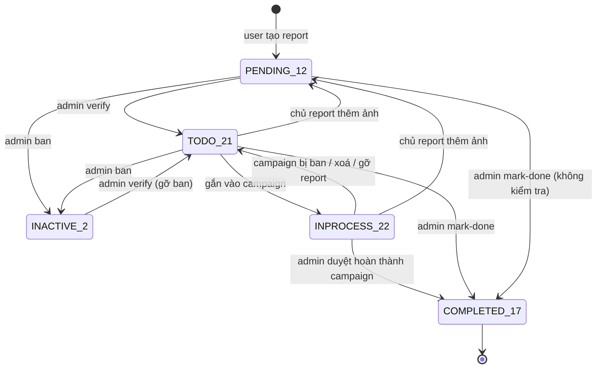

| Từ → sang | Ai | Điều kiện | Side effect | File |
|---|---|---|---|---|
| (mới) → PENDING 12 | User đăng nhập, hoặc qua tool chat AI | BR-100 | Tạo media và report_media_files; enqueue ANALYZE_REPORT và TRANSLATE_TEXT | `INC/modules/report/report.service.ts > createReport()` |
| PENDING / INACTIVE / … → TODO 21 (isVerify=true) | Admin | Chưa được duyệt, hoặc đang bị ban | Thông báo REPORT_APPROVED cho chủ report | `adminVerifyReport()` |
| bất kỳ (≠ 2) → INACTIVE 2 | Admin | Có lý do | Thông báo REPORT_REJECTED. Từ 2 sang 2 thì chỉ đổi lý do | `adminBanReport()` |
| bất kỳ (≠ 17) → COMPLETED 17 | Admin | Không kiểm tra trạng thái nguồn | Outbox REPORT_COMPLETION_GREEN_POINTS; thông báo REPORT_STATUS | `adminMarkReportDone()` |
| TODO 21 → INPROCESS 22 | Owner tổ chức (tạo campaign) hoặc `createdBy` (sửa campaign) | Report chưa thuộc campaign nào | Gán campaignId | `INC/modules/campaign/campaign.service.ts > assignReportsToCampaign()` |
| INPROCESS 22 → TODO 21 | `createdBy` (xoá campaign / đổi reportIds) hoặc admin (ban campaign) | — | campaignId = null | `deleteCampaign()`, `banCampaignAndUnlinkReports()`, `updateCampaign()` |
| INPROCESS 22 → COMPLETED 17 | Admin duyệt hoàn thành campaign | Campaign đang ở 7 | **Không** phát outbox điểm cho report | `adminFinalizeCampaignCompletion()` |
| bất kỳ (không bị ban) → PENDING 12, aiVerified=false | Chủ report | Report không bị ban | Enqueue ANALYZE_REPORT. Nếu `isVerify` đã true thì report bị kẹt (99) | `addReportImages()` |
| aiVerified false → true | Worker | Có kết quả predict | aiRecommendation, ai_analysis_logs | `report-ai-analysis.service.ts > analyzeReport()` |
| → xoá mềm | Chủ report | Report không bị ban | — | `deleteReport()` |

## 2. Campaign (`campaigns.status`)

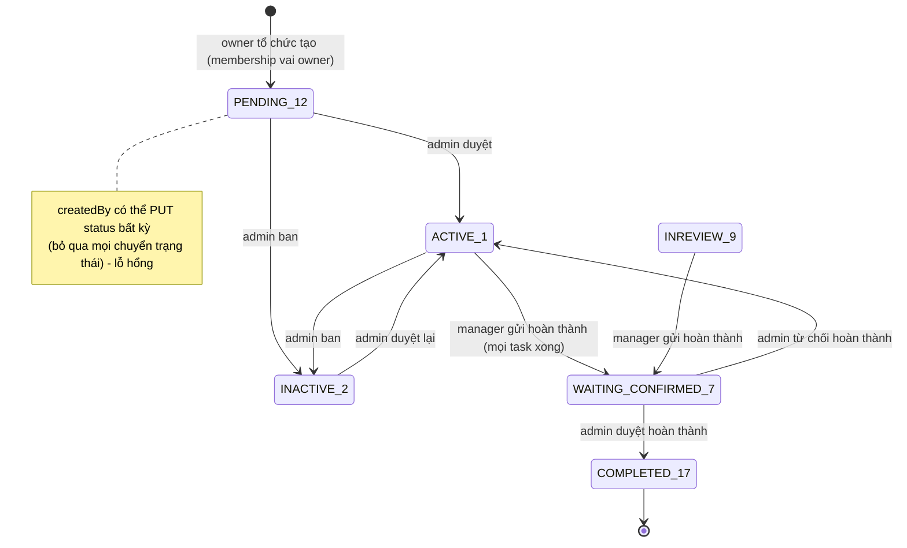

| Từ → sang | Ai | Điều kiện | Side effect | File |
|---|---|---|---|---|
| (mới) → PENDING 12 | Owner tổ chức | BR-150..BR-153 | Người tạo thành manager; report 21 → 22; TRANSLATE_TEXT; thông báo CAMPAIGN_CREATED cho thành viên | `createCampaign()` |
| 12 / 4 / 5 / 2 → ACTIVE 1 | Admin | — | rejectReason = reason \|\| null; thông báo CAMPAIGN_VERIFY_INVITE cho người dân trong 5 km | `adminVerifyCampaign()` |
| 12 / 4 / 5 / 1 → INACTIVE 2 | Admin | Có lý do | Gỡ report (22 → 21); không gửi thông báo | `banCampaignAndUnlinkReports()` |
| 1 / 9 → WAITING_CONFIRMED 7 | Mgr(table) | Mọi task đều 17 | Thông báo CAMPAIGN_COMPLETION_PENDING_ADMIN (admin trong env) và COMPLETION_VERIFY_INVITE (người dân gần) | `submitCampaignCompletionForAdminApproval()` |
| 7 → COMPLETED 17 | Admin | Mọi task 17; có tier | Report và SOS → 17; outbox CAMPAIGN_COMPLETION_GREEN_POINTS; thông báo CAMPAIGN_DONE và APPROVED_BY_ADMIN | `adminFinalizeCampaignCompletion()` |
| 7 → ACTIVE 1 | Admin | Có lý do | rejectReason; thông báo REJECTED_BY_ADMIN | `adminRejectCampaign()` |
| bất kỳ → bất kỳ | `createdBy` | `PUT /campaigns/:id` với `status` | **Không có kiểm soát** (99) | `updateCampaign()` |
| → xoá mềm | `createdBy` | — | Gỡ report | `deleteCampaign()` |

Không có code nào chuyển campaign sang INREVIEW (9). Trạng thái này chỉ xuất hiện trong điều kiện của mark-done.

## 3. Yêu cầu tham gia campaign (`campaign_joining_requests.status`)

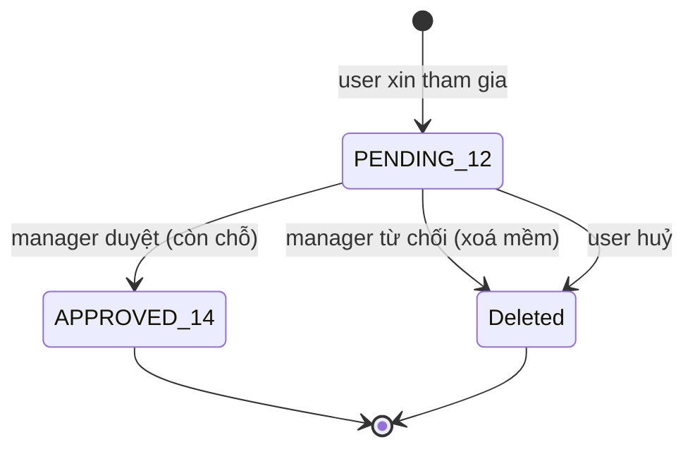

| Từ → sang | Ai | Điều kiện | Side effect | File |
|---|---|---|---|---|
| (mới) → 12 | User đăng nhập | Chưa có yêu cầu nào chưa bị xoá | Thông báo VOLUNTEER_REQUEST cho các manager | `campaign_joining_request.service.ts > createJoinRequest()` |
| 12 → 14 | Mgr(table) | Còn chỗ theo `maxVolunteers` | VOLUNTEER_APPROVED | `processJoinRequest()` |
| 12 → xoá mềm | Mgr(table), khi từ chối | — | VOLUNTEER_REJECTED | `processJoinRequest()` |
| 12 → xoá mềm | Chính người xin | — | — | `cancelJoinRequest()` |
| 14 → ? | — | Không có API rời hoặc huỷ sau khi được duyệt | — | — |

## 4. Task của campaign (`campaign_tasks.status`)

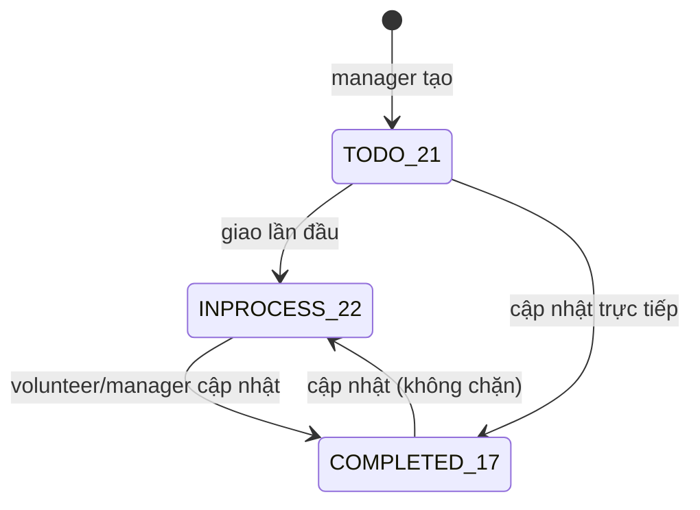

| Từ → sang | Ai | Điều kiện | File |
|---|---|---|---|
| (mới) → 21 | canManage | — | `campaign_task.service.ts > createTask()` |
| 21 → 22 | Tự động khi assign | Task đang 21 | `assignTask()` |
| bất kỳ → số nguyên bất kỳ | canManage (`PUT /tasks/:id`) hoặc volunteer được giao (`PUT /tasks/:id/status`) | **Không validate giá trị** | `updateTask()`, `updateTaskStatusByVolunteer()` |
| → xoá mềm | canManage | — | `deleteTask()` |

## 5. Submission (`campaign_submissions.status`)

| Từ → sang | Ai | Điều kiện | Side effect | File |
|---|---|---|---|---|
| (mới) → INREVIEW 9 | Mgr(table) | — | Gắn kết quả nháp (luôn rỗng) | `campaign_submission.service.ts > createSubmission()` |
| 9 / 6 / 12 → APPROVED 14 hoặc REJECTED 18 | Mgr(table), kể cả chính người nộp | — | Không có | `processSubmission()` |

## 6. SOS (`sos.status`)

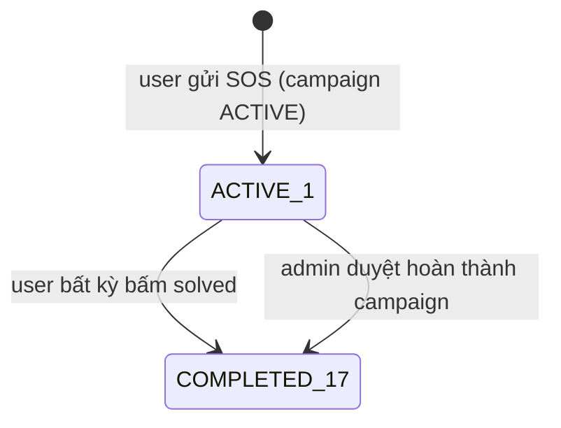

| Từ → sang | Ai | Điều kiện | File |
|---|---|---|---|
| (mới) → 1 | User đăng nhập | Campaign ACTIVE, có toạ độ | `INC/modules/sos/sos.service.ts > create()` |
| 1 → 17 | **User đăng nhập bất kỳ** | — | `solveSos()` |
| 1 → 17 | Admin, gián tiếp | Duyệt hoàn thành campaign | `adminFinalizeCampaignCompletion()` |

## 7. Đơn đăng ký tổ chức (`organization_applications.status`) và owner (`organization_application_owners.status`)

Thiết kế: [ORG_OWNERSHIP_FLOW.md](ORG_OWNERSHIP_FLOW.md). Điểm then chốt: **`PENDING_REVIEW` chỉ đạt được khi mọi owner (chưa bị gỡ) đã CONFIRMED**, và admin không thấy đơn trước trạng thái đó.

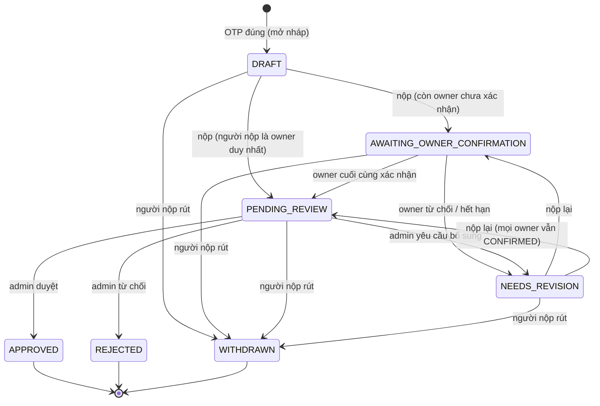

| Từ → sang | Ai | Điều kiện | Side effect | File |
|---|---|---|---|---|
| (mới) → DRAFT | Người nộp ẩn danh (OTP) | Email chưa có đơn mở (có rồi thì trả đơn đó) | Code `ORG-…`; owner đầu tiên = người nộp; tracking token | `INC/modules/organization_application/organization-application.service.ts > openDraftForEmail()` |
| DRAFT / NEEDS_REVISION → AWAITING_OWNER_CONFIRMATION hoặc PENDING_REVIEW | Người nộp (tracking token) | BR-057..BR-060, BR-069, BR-300..BR-303; row lock | Người nộp CONFIRMED; token 14 ngày cho owner cần link; reset xác nhận nếu snapshot đổi (BR-306); event SUBMITTED / RESUBMITTED (`changedFields`), OWNER_CONFIRMATIONS_RESET, READY_FOR_REVIEW; email ORG_OWNER_CONFIRMATION_REQUEST (+ ORG_APPLICATION_RECEIVED lần đầu) | `submitApplication()` |
| AWAITING → PENDING_REVIEW | Hệ thống, trong transaction của lần xác nhận cuối | Không còn owner nào khác CONFIRMED | event OWNER_CONFIRMED, READY_FOR_REVIEW; `submittedAt` | `owner-confirmation.service.ts > confirm()` |
| AWAITING / NEEDS_REVISION → NEEDS_REVISION | Hệ thống (owner bấm "Tôi không liên quan") | Owner đang PENDING / EXPIRED | reviewNote; event OWNER_DECLINED; email ORG_OWNER_DECLINED | `decline()` |
| AWAITING → NEEDS_REVISION | Sweeper mỗi giờ | Owner PENDING có `expiresAt < now` | event OWNER_EXPIRED; email ORG_OWNER_CONFIRMATION_EXPIRED | `expireOverdue()`, `owner-confirmation-expiry.job.ts` |
| PENDING_REVIEW → NEEDS_REVISION | Admin | Có message | reviewNote; event INFO_REQUESTED; email ORG_APPLICATION_NEEDS_INFO | `organization-application-admin.service.ts > requestMoreInfo()` |
| PENDING_REVIEW (claim) | Admin | reviewerId trống hoặc là chính mình (BR-070) | reviewerId, claimedAt; event CLAIMED; **không đổi status** | `claim()` |
| PENDING_REVIEW → APPROVED | Admin | BR-074..BR-076, BR-312 | Tổ chức + channels + membership từng owner; outbox ORG_OWNER_ONBOARD mỗi owner; event APPROVED (+ DOCUMENTS_WAIVED) | `approve()` |
| PENDING_REVIEW → REJECTED | Admin | Có lý do | Email ORG_APPLICATION_REJECTED; event REJECTED | `reject()` |
| mở → WITHDRAWN | Người nộp | — | Link chưa trả lời hết hạn ngay; email ORG_APPLICATION_WITHDRAWN_NOTICE cho owner đã xác nhận; event WITHDRAWN | `withdrawApplication()` |

**Owner (`OwnerCandidateStatus`)**

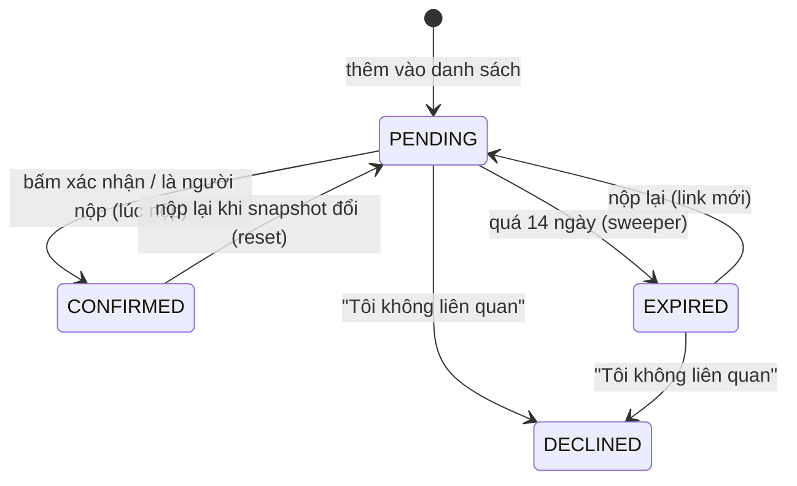

| Từ → sang | Ai | Ghi chú | File |
|---|---|---|---|
| (mới) → PENDING | Người nộp (lưu nháp) | Chưa có link cho tới khi nộp | `syncOwners()` |
| PENDING → CONFIRMED | Owner / hệ thống (người nộp) | Lưu `respondedAt`, `confirmIp`, `confirmUa` | `confirm()`, `submitApplication()` |
| PENDING / EXPIRED → DECLINED | Owner | Tuỳ chọn `owner_invite_blocks` | `decline()` |
| PENDING → EXPIRED | Sweeper | Giữ hash để link cũ báo "hết hạn" | `expireOverdue()` |
| bất kỳ → gỡ (`removedAt`) | Người nộp (lưu nháp) | Không xoá bản ghi; event OWNER_CANDIDATE_REMOVED; thêm lại thì về PENDING | `syncOwners()` |
| CONFIRMED / EXPIRED → PENDING | Người nộp (nộp lại) | Reset do BR-306, hoặc cấp link mới cho EXPIRED | `submitApplication()` |

## 8. Tổ chức (`organizations.status`, `trustTier`, `isEmailVerified`) và owner

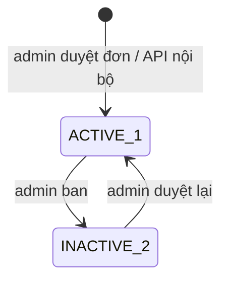

| Trục | Từ → sang | Ai | Điều kiện | Side effect | File |
|---|---|---|---|---|---|
| status | (mới) → ACTIVE 1 | Admin (qua duyệt đơn) hoặc service nội bộ | Phải có ≥ 1 membership vai owner lúc COMMIT (trigger) | Membership owner; email xác minh và TRANSLATE_TEXT (chỉ với luồng nội bộ) | `approve()`, `organization.service.ts > createOrganization()`, `organization.repository.ts > create()` |
| status | 4 / 2 / 9 / 12 → ACTIVE 1 | Admin | — | Thông báo ORGANIZATION_APPROVED tới mọi owner | `adminVerifyOrganization()` |
| status | 4 / 12 / 9 / 1 → INACTIVE 2 | Admin | Có lý do | Thông báo ORGANIZATION_REJECTED tới mọi owner | `adminVerifyOrganization()` |
| trustTier | (mới) → VERIFIED hoặc NONE | Admin (khi duyệt đơn) | `grant_blue_tick` / lane A | — | `approve()` |
| trustTier | VERIFIED → ? | — | **Không có code gỡ hoặc tạm dừng Blue Tick**, không có job xử lý hết hạn | — | [CHƯA HOÀN THIỆN] |
| kycStatus | NOT_SUBMITTED → APPROVED | Admin (khi duyệt đơn) | — | — | `approve()` |
| isEmailVerified | (mới) → true | Admin (khi duyệt đơn) | contactEmail = submitterEmail đã qua OTP | — | `approve()` |
| isEmailVerified | false → true | Người click link | Token hợp lệ, email khớp | — | `confirmOrganizationContactEmail()` |
| isEmailVerified | true → false | Owner | Đổi contactEmail | Gửi link mới | `updateOrganization()` |
| owner | (mới) → membership `LEGAL_REPRESENTATIVE` / `OWNER` | Admin (duyệt đơn) | Trần 3 tổ chức dưới advisory lock | Outbox ORG_OWNER_ONBOARD | `organization-membership.service.ts > grantMembership()` |
| owner | owner cuối cùng → rời / xoá | — | **DB chặn** (`ORG_MUST_HAVE_OWNER`); chưa có luồng thu hồi / chuyển giao | — | trigger `organization_members_owner_guard` [CHƯA HOÀN THIỆN] |

## 9. Yêu cầu gia nhập tổ chức (`organization_joining_requests.status`) và thành viên

| Từ → sang | Ai | Điều kiện | Side effect | File |
|---|---|---|---|---|
| (mới) → PENDING 12 | User chưa có membership | BR-085 | VOLUNTEER_REQUEST cho mọi owner | `organization.service.ts > createJoinRequest()` |
| 12 → APPROVED 14 | Owner bất kỳ | — | Upsert organization_members vai MEMBER; VOLUNTEER_APPROVED | `processJoinRequest()` |
| 12 → REJECTED 18 | Owner bất kỳ | — | VOLUNTEER_REJECTED | `processJoinRequest()` |
| 12 → xoá mềm | Người xin | — | — | `cancelJoinRequest()` |
| Thành viên: đang hoạt động → xoá mềm | Chính thành viên (không có vai owner) | BR-088 | — | `leaveOrganization()` |

## 10. Tài khoản người dùng (`users.status`)

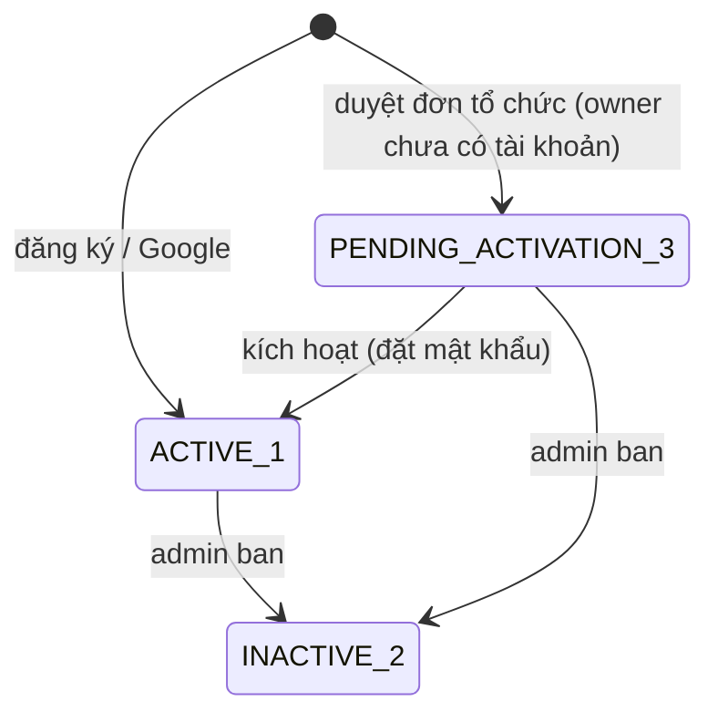

| Từ → sang | Ai | Điều kiện | Side effect | File |
|---|---|---|---|---|
| (mới) → 1 | Khách | Email chưa có | — | `ID/modules/auth/auth.service.ts > signup()`, `google.service.ts > handleCallback()` |
| (mới) → 3 | Service nội bộ (incident, ensure-users) | Email chưa có user | Không mật khẩu; token kích hoạt phát sau qua outbox | `ensureUsersForOwners()`, `issueActivationToken()` |
| 3 → 1 | Người cầm token kích hoạt | Token `ACCOUNT_ACTIVATION` còn hạn **và** user đang 3 | Đặt password; revoke REFRESH | `activateAccount()` |
| 1 / 3 → 2 | Admin | Không ban chính mình | Revoke REFRESH | `ID/modules/user/user.service.ts > adminBanUser()` |
| 2 → 1 | — | Không có API gỡ ban. Kích hoạt kiểm tra status nên tài khoản bị ban khi đang ở 3 không còn chuyển về 1 được | — | — |
| → xoá mềm | **User đăng nhập bất kỳ** (`DELETE /users/:id`) | — | Không revoke token | `user.service.ts > deleteUser()` |

## 11. Đơn đổi quà (`gift_redemptions.status`)

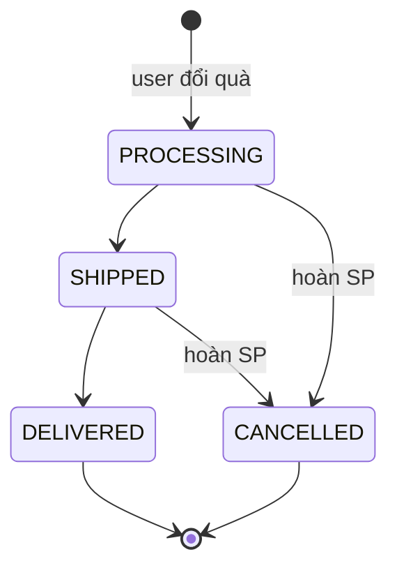

| Từ → sang | Ai (thực tế trong code) | Điều kiện | Side effect | File |
|---|---|---|---|---|
| (mới) → PROCESSING | User đăng nhập | BR-222..BR-225 | Trừ tồn kho; trừ SP theo FIFO; ghi sổ âm | `RW/modules/gift/gift.service.ts > redeem()` |
| PROCESSING → SHIPPED; SHIPPED → DELIVERED | **User đăng nhập bất kỳ** (thiếu kiểm tra admin) | BR-230 | statusUpdatedAt | `updateRedemptionStatus()` |
| PROCESSING / SHIPPED → CANCELLED | như trên | BR-230 | cancelledAt; hoàn SP (lô mới); ghi GIFT_REDEEM_REFUND; không hoàn tồn kho | `updateRedemptionStatus()` |

Không có thông báo nào được gửi khi đơn đổi quà đổi trạng thái.

## 12. Season (`seasons.status`)

| Từ → sang | Ai | Điều kiện | Side effect | File |
|---|---|---|---|---|
| (mới) → ACTIVE 1 hoặc INACTIVE 2 | Admin | BR-247 | — | `season.service.ts > createSeason()` |
| ACTIVE → INACTIVE (finalize) | Admin | BR-248 | Snapshot bảng xếp hạng; chi SP theo payout tier; nếu `openNext` thì mở season mới | `finalizeSeason()` |
| ACTIVE ↔ INACTIVE (PATCH) | Admin | Không có điều kiện | **Không** snapshot, không chi SP | `patchSeason()` |

## 13. Background job, outbox, notification job (hạ tầng)

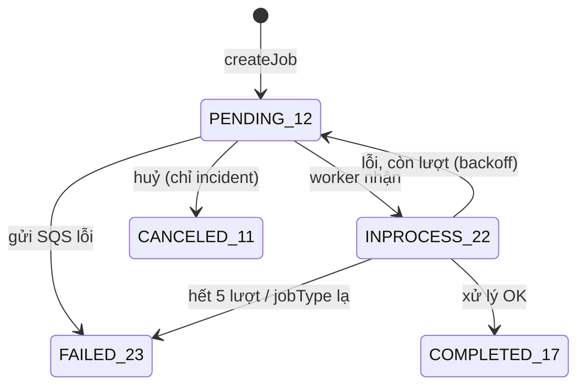

- Áp dụng cho `background_jobs` (incident), `notification_jobs`, `reward_background_jobs` (`ecolink-server/shared/da2-queue/src/core/queue-worker.ts`, các `*/queue/background-job-store.ts`).
- **Outbox** (`outbox_events`, `INC/outbox/outbox-relay.ts`): 12 → 22 (claim bằng `FOR UPDATE SKIP LOCKED`) → 17 (publish OK) / 12 (retry, `min(900s, 30s·2^(a-1))`) / 23 (sau 10 lần). Nếu process crash sau khi claim, dòng bị kẹt ở 22. Circuit breaker của relay: 5 lỗi thì OPEN 30s.
- Queue `reward-intake` dùng NoopStore: không có dòng trạng thái nào.

## 14. Trạng thái nhị phân khác

| Entity | Trạng thái | Chuyển | File |
|---|---|---|---|
| Vote.value | 0 / 1 / -1 | Toggle (BR-130) | `INC/modules/vote/vote.service.ts` |
| SavedResource | active / deleted | Toggle (BR-133) | `saved_resource.service.ts` |
| CampaignCompletionVerification.value | 0 / 1 / -1 | Gửi lại cùng giá trị thì thành 0 | `campaign_completion_verification.service.ts` |
| CampaignAttendanceCheckIn | chưa có / có | Chỉ thêm, idempotent | `campaign_attendance.service.ts` |
| Notification.readAt | null → thời điểm | Chỉ một chiều | `NS/modules/notification/notification.service.ts > markRead()` |
| AuthToken | active → revoked / used / hết hạn | Xem BR-008..BR-012 | `ID/modules/auth/*` |
| OTP đơn tổ chức | active → used / expired | Xem BR-053, BR-054 | `organization-application-otp.service.ts` |
| Gift.isActive, BadgeDefinition.isActive / publishedAt | bật / tắt | Admin | `RW/modules/*` |
