# 04 — Máy trạng thái

> Mã số trạng thái theo `GlobalStatus` (`ecolink-server/shared/da2-constants/src/global-status.ts`). Xem bảng đầy đủ ở [01-data-model.md §6.1](01-data-model.md).
> "canManage" nghĩa là người quản lý campaign: thành viên active của tổ chức sở hữu campaign và là người tạo, manager trong `campaign_managers`, hoặc LR / OWNER (`INC/modules/campaign/campaign-access.service.ts`, BR-159). "canDelete" = người tạo hoặc LR / OWNER.
> Đường dẫn viết tắt giống [02-business-flows.md](02-business-flows.md).

## 1. Report (`reports.status`, `isVerify`, `aiVerified`)

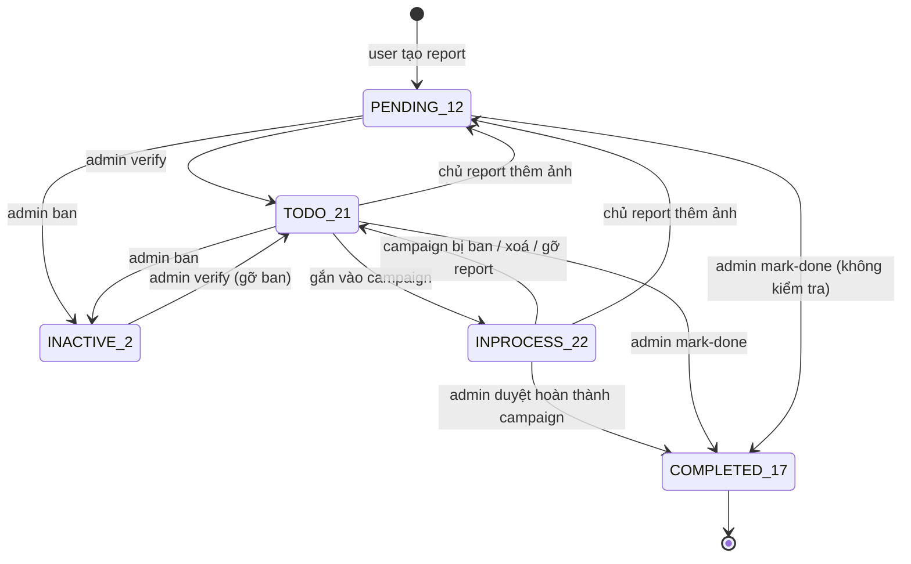
```mermaid
stateDiagram-v2
  [*] --> PENDING_12: user tạo report
  PENDING_12 --> TODO_21: admin verify
  PENDING_12 --> INACTIVE_2: admin ban
  TODO_21 --> INACTIVE_2: admin ban
  INACTIVE_2 --> TODO_21: admin verify (gỡ ban)
  TODO_21 --> INPROCESS_22: gắn vào campaign
  INPROCESS_22 --> TODO_21: campaign bị ban / xoá / gỡ report
  INPROCESS_22 --> COMPLETED_17: admin duyệt hoàn thành campaign
  TODO_21 --> COMPLETED_17: admin mark-done
  PENDING_12 --> COMPLETED_17: admin mark-done (không kiểm tra)
  TODO_21 --> PENDING_12: chủ report thêm ảnh
  INPROCESS_22 --> PENDING_12: chủ report thêm ảnh
  COMPLETED_17 --> [*]
```

| Từ → sang | Ai | Điều kiện | Side effect | File |
|---|---|---|---|---|
| (mới) → PENDING 12 | User đăng nhập, hoặc qua tool chat AI | BR-100 | Tạo media và report_media_files; enqueue ANALYZE_REPORT và TRANSLATE_TEXT | `INC/modules/report/report.service.ts > createReport()` |
| PENDING / INACTIVE / … → TODO 21 (isVerify=true) | Admin | Chưa được duyệt, hoặc đang bị ban | Thông báo REPORT_APPROVED cho chủ report | `adminVerifyReport()` |
| bất kỳ (≠ 2) → INACTIVE 2 | Admin | Có lý do | Thông báo REPORT_REJECTED. Từ 2 sang 2 thì chỉ đổi lý do | `adminBanReport()` |
| bất kỳ (≠ 17) → COMPLETED 17 | Admin | Không kiểm tra trạng thái nguồn | Outbox REPORT_COMPLETION_GREEN_POINTS; thông báo REPORT_STATUS | `adminMarkReportDone()` |
| TODO 21 → INPROCESS 22 | canManage gửi duyệt campaign, hoặc sửa điểm tập kết khi campaign đang 12 / 19 | Report chưa thuộc campaign nào (compare-and-set; bị lấy mất → 409 `CAMPAIGN_REPORTS_TAKEN`). Bản nháp **không** khoá report | Gán campaignId | `INC/modules/campaign/campaign-lifecycle.service.ts > syncReportLocks()` |
| INPROCESS 22 → TODO 21 | canDelete (xoá campaign), canManage (bỏ report khỏi điểm tập kết khi 12 / 19), admin (block / ban), system (hết hạn) | — | campaignId = null | `syncReportLocks()`, `releaseAllReports()` (gọi từ `deleteCampaign()`, `review()`, `expireOverdue()`) |
| INPROCESS 22 → COMPLETED 17 | Admin duyệt hoàn thành campaign | Campaign đang ở 7 | **Không** phát outbox điểm cho report | `adminFinalizeCampaignCompletion()` |
| bất kỳ (không bị ban) → PENDING 12, aiVerified=false | Chủ report | Report không bị ban | Enqueue ANALYZE_REPORT. Nếu `isVerify` đã true thì report bị kẹt (99) | `addReportImages()` |
| aiVerified false → true | Worker | Có kết quả predict | aiRecommendation, ai_analysis_logs | `report-ai-analysis.service.ts > analyzeReport()` |
| → xoá mềm | Chủ report | Report không bị ban | — | `deleteReport()` |

## 2. Campaign (`campaigns.status`)

Tên trạng thái theo `DC/campaign-lifecycle.ts > CampaignStatus`; cột vẫn là số `GlobalStatus`. Mọi chuyển trạng thái nằm trong bảng `CAMPAIGN_TRANSITIONS` và chỉ đi qua `INC/modules/campaign/campaign-state-machine.ts > transitionCampaign()`: kiểm rule (trạng thái nguồn, actor, lý do bắt buộc), cập nhật kiểu compare-and-set (`updateMany` có điều kiện `status` cũ; có người đổi trước thì 409 `CAMPAIGN_INVALID_TRANSITION`) và ghi một dòng `campaign_status_logs`. Chuyển không có trong bảng → 409 `CAMPAIGN_INVALID_TRANSITION`; sai actor → 403 `CAMPAIGN_PERMISSION_DENIED`; thiếu lý do → 400.

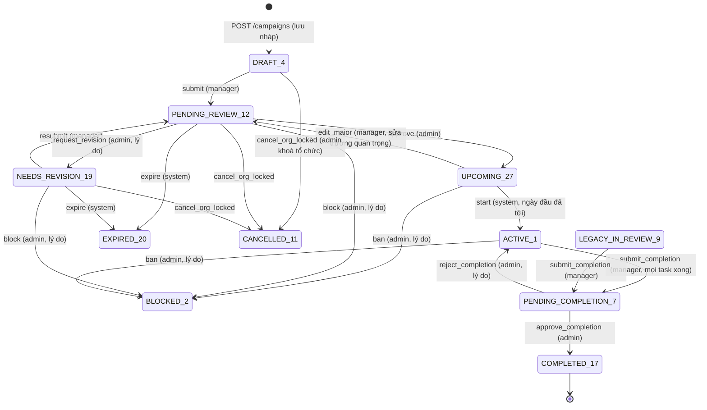
```mermaid
stateDiagram-v2
  [*] --> DRAFT_4: POST /campaigns (lưu nháp)
  DRAFT_4 --> PENDING_REVIEW_12: submit (manager)
  NEEDS_REVISION_19 --> PENDING_REVIEW_12: resubmit (manager)
  PENDING_REVIEW_12 --> UPCOMING_27: approve (admin)
  UPCOMING_27 --> PENDING_REVIEW_12: edit_major (manager, sửa trường quan trọng)
  UPCOMING_27 --> ACTIVE_1: start (system, ngày đầu đã tới)
  UPCOMING_27 --> BLOCKED_2: ban (admin, lý do)
  PENDING_REVIEW_12 --> NEEDS_REVISION_19: request_revision (admin, lý do)
  PENDING_REVIEW_12 --> BLOCKED_2: block (admin, lý do)
  NEEDS_REVISION_19 --> BLOCKED_2: block (admin, lý do)
  ACTIVE_1 --> BLOCKED_2: ban (admin, lý do)
  PENDING_REVIEW_12 --> EXPIRED_20: expire (system)
  NEEDS_REVISION_19 --> EXPIRED_20: expire (system)
  DRAFT_4 --> CANCELLED_11: cancel_org_locked (admin khoá tổ chức)
  PENDING_REVIEW_12 --> CANCELLED_11: cancel_org_locked
  NEEDS_REVISION_19 --> CANCELLED_11: cancel_org_locked
  ACTIVE_1 --> PENDING_COMPLETION_7: submit_completion (manager, mọi task xong)
  LEGACY_IN_REVIEW_9 --> PENDING_COMPLETION_7: submit_completion (manager)
  PENDING_COMPLETION_7 --> COMPLETED_17: approve_completion (admin)
  PENDING_COMPLETION_7 --> ACTIVE_1: reject_completion (admin, lý do)
  COMPLETED_17 --> [*]
```

| Sự kiện | Từ → sang | Ai | Điều kiện | Side effect | File |
|---|---|---|---|---|---|
| (tạo) | (mới) → DRAFT 4 | Thành viên có `CAMPAIGN_CREATE`, tổ chức status 1 | BR-150..BR-153 | Người tạo thành manager; lưu điểm tập kết và lựa chọn report (**không khoá** report); TRANSLATE_TEXT. Không gửi thông báo, không ghi log | `INC/modules/campaign/campaign.service.ts > createCampaign()` |
| `submit` | DRAFT 4 → PENDING_REVIEW 12 | canManage | Giới hạn tổ chức (BR-163) và mọi rule nội dung (BR-164) kiểm lại trong transaction Serializable | Khoá report (21 → 22, BR-169); người tạo + trưởng điểm thành manager; lưu `submittedAt`, `lastSubmittedSnapshot`; thông báo CAMPAIGN_PENDING_REVIEW (admin trong env) và CAMPAIGN_CREATED (owner + manager) | `INC/modules/campaign/campaign-lifecycle.service.ts > submit()` |
| `resubmit` | NEEDS_REVISION 19 → PENDING_REVIEW 12 | canManage | Như submit | Như submit, xoá `revisionDeadline`; diff với lần gửi trước ghi vào `changes`; chỉ báo admin (không gửi CAMPAIGN_CREATED) | `submit()` |
| `approve` | PENDING_REVIEW 12 → UPCOMING 27 (Sắp diễn ra) | Admin không phải thành viên của tổ chức | — | Mở đăng ký ca (BR-170); giữ khoá report; xoá rejectReason; đặt `approvedAt` lần đầu; thông báo CAMPAIGN_APPROVED (owner, manager, thành viên) và CAMPAIGN_VERIFY_INVITE (người dân trong 5 km) | `campaign-lifecycle.service.ts > review()`, `campaign.service.ts > reviewCampaign()` |
| `edit_major` | UPCOMING 27 → PENDING_REVIEW 12 | canManage | Sửa trường quan trọng của campaign đã duyệt (BR-353) | Giữ khoá report và đăng ký; `changes` = diff trước / sau; `submittedAt`, `lastSubmittedSnapshot` đặt lại; outbox CAMPAIGN_UPDATED_NEEDS_REVIEW cho TNV; admin nhận CAMPAIGN_PENDING_REVIEW. Duyệt lại (`approve`) giữ `approvedAt`, không mời người dân, báo owner / manager / TNV | `campaign-post-approval-edit.ts > applyPostApprovalEdit()` |
| `start` | UPCOMING 27 → ACTIVE 1 | system (job) | Có `campaign_days.startAt` ≤ now (campaign duyệt trước khi có UPCOMING mà chưa tới ngày đã được migration `20261002180000_campaign_upcoming_backfill` đưa về 27, log `backfill_upcoming`) | Không gửi thông báo, không gỡ report; điểm danh và SOS chỉ mở từ ACTIVE | `campaign-lifecycle.service.ts > startDueCampaigns()`, `campaign-lifecycle.job.ts` |
| `request_revision` | PENDING_REVIEW 12 → NEEDS_REVISION 19 | Admin (như trên) | Có lý do ≤ 5000 | rejectReason; `revisionDeadline` = now + 7 ngày; giữ khoá report; thông báo CAMPAIGN_REVISION_REQUESTED (người tạo + owner) | `review()` |
| `block` | PENDING_REVIEW 12 / NEEDS_REVISION 19 → BLOCKED 2 | Admin (như trên) | Có lý do | Gỡ report (22 → 21); thông báo CAMPAIGN_BLOCKED (người tạo + owner) | `review()`, `releaseAllReports()` |
| `ban` | UPCOMING 27 / ACTIVE 1 → BLOCKED 2 | Admin (như trên) | Có lý do; là `decision=block` trên campaign đang UPCOMING hoặc ACTIVE | Như block | `review()` |
| `cancel_org_locked` | DRAFT 4 / PENDING_REVIEW 12 / NEEDS_REVISION 19 → CANCELLED 11 | admin (qua ban tổ chức) | Lý do = lý do ban tổ chức (BR-189) | Gỡ report; `rejectReason` = lý do; thông báo CAMPAIGN_CANCELLED cho người tạo + owner. Campaign UPCOMING / ACTIVE / 7 không bị đụng (chạy nốt; admin vẫn ban từng campaign). Mở khoá tổ chức không khôi phục | `campaign-lifecycle.service.ts > cancelForLockedOrganization()`, gọi trong `organization.service.ts > adminVerifyOrganization()` |
| `expire` | PENDING_REVIEW 12 / NEEDS_REVISION 19 → EXPIRED 20 | system (job) | Ngày đầu (`campaign_days.startAt`) đã tới, hoặc NEEDS_REVISION quá `revisionDeadline` (BR-186) | Gỡ report; thông báo CAMPAIGN_EXPIRED cho người tạo; `reason` = `start_passed` / `revision_overdue` | `campaign-lifecycle.service.ts > expireOverdue()`, `INC/modules/campaign/campaign-lifecycle.job.ts` |
| `submit_completion` | ACTIVE 1 / LEGACY_IN_REVIEW 9 → PENDING_COMPLETION 7 | canManage | Mọi task đều 17 | Thông báo CAMPAIGN_COMPLETION_PENDING_ADMIN (admin trong env) và COMPLETION_VERIFY_INVITE (người dân gần) | `submitCampaignCompletionForAdminApproval()` |
| `approve_completion` | PENDING_COMPLETION 7 → COMPLETED 17 | Admin | Mọi task 17; có tier | Report và SOS → 17; outbox CAMPAIGN_COMPLETION_GREEN_POINTS; thông báo CAMPAIGN_DONE và APPROVED_BY_ADMIN | `adminFinalizeCampaignCompletion()` |
| `reject_completion` | PENDING_COMPLETION 7 → ACTIVE 1 | Admin | Có lý do | rejectReason; thông báo REJECTED_BY_ADMIN | `adminRejectCampaign()` |
| (xoá) | DRAFT 4 / PENDING_REVIEW 12 / NEEDS_REVISION 19 / BLOCKED 2 / EXPIRED 20 → xoá mềm | canDelete | Trạng thái khác → 409 `CAMPAIGN_NOT_DELETABLE` | Gỡ report | `deleteCampaign()` |
| (dọn nháp) | DRAFT 4 → xoá mềm | system (job) | `updatedAt` quá 30 ngày | Không có report nào bị khoá nên không cần gỡ | `deleteStaleDrafts()` |

- `PUT /campaigns/:id` **không** đổi được status: body có `status` → 400 (validator). Sửa khi đang PENDING_REVIEW / NEEDS_REVISION ghi log `type=EDIT` (`logCampaignEdit()`).
- Không còn đường BLOCKED 2 → ACTIVE 1 ("duyệt lại"). `PUT /:id/verify` (deprecated) chỉ là alias của `review`: status 1 → approve, status 2 → block/ban.
- Không có code nào chuyển campaign sang LEGACY_IN_REVIEW (9). Trạng thái này chỉ còn trong điều kiện của mark-done.
- Dời lịch (BR-356) không đổi trạng thái: chỉ ghi log `EDIT / reschedule`.
- **[CHƯA HOÀN THIỆN]** (các đợt sau của đặc tả): huỷ chiến dịch đã duyệt; lựa chọn "huỷ hay chạy tiếp" khi khoá tổ chức cho campaign UPCOMING.

## 3. Đăng ký ca của campaign (`campaign_shift_registrations`)

Thay cho yêu cầu tham gia có duyệt (`campaign_joining_requests` không còn được server/web dùng). Không có cột status: một dòng **đang hiệu lực** khi `leftAt` null.

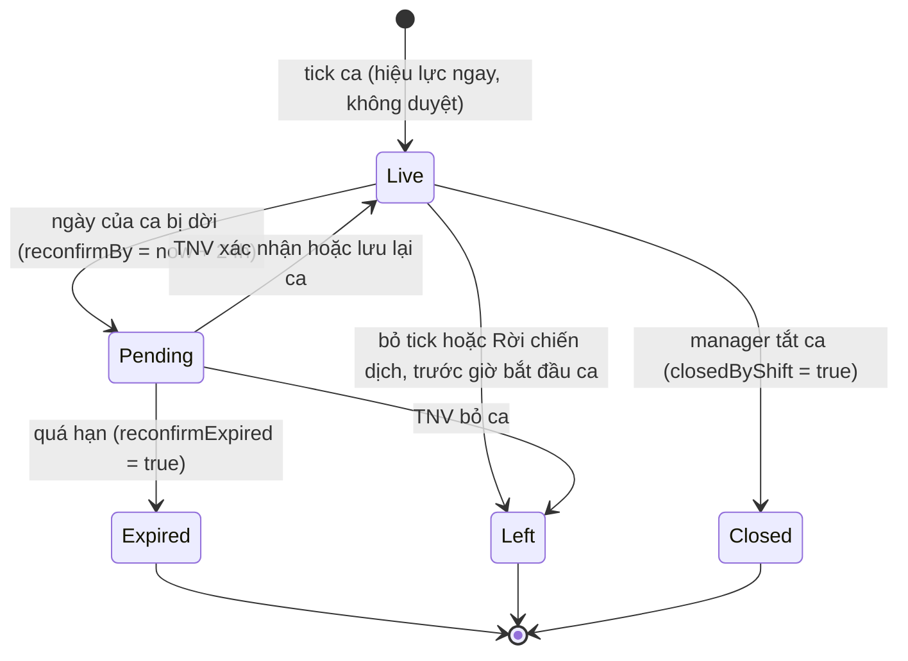
```mermaid
stateDiagram-v2
  [*] --> Live: tick ca (hiệu lực ngay, không duyệt)
  Live --> Left: bỏ tick hoặc Rời chiến dịch, trước giờ bắt đầu ca
  Live --> Closed: manager tắt ca (closedByShift = true)
  Live --> Pending: ngày của ca bị dời (reconfirmBy = now + 24h)
  Pending --> Live: TNV xác nhận hoặc lưu lại ca
  Pending --> Expired: quá hạn (reconfirmExpired = true)
  Pending --> Left: TNV bỏ ca
  Expired --> [*]
  Left --> [*]
  Closed --> [*]
```

| Từ → sang | Ai | Điều kiện | Side effect | File |
|---|---|---|---|---|
| (mới) → đang hiệu lực | User đăng nhập (kể cả manager) | BR-170: campaign UPCOMING / ACTIVE, ca bật và chưa bắt đầu, `acceptConditions = true`; không chặn theo số người hay trùng giờ | Trả `warnings[]`; được tính vào bản tin hằng ngày cho manager (`managerNotifiedAt`) | `INC/modules/campaign/campaign_registration/campaign_registration.service.ts > setMyShifts()` |
| đang hiệu lực → đã rời | Chính người đăng ký (bỏ tick, hoặc nút "Rời chiến dịch") | Ca chưa bắt đầu (ca đã bắt đầu được giữ nguyên) | `leftAt = now`; không ghi nhận vi phạm (spec -6) | `setMyShifts()` |
| đang hiệu lực → đã rời vì tắt ca | Manager (BR-159) | Ca bật, chưa bắt đầu, ngày còn ca bật khác (BR-174) | `leftAt = now`, `closedByShift = true`; `CAMPAIGN_SHIFT_CLOSED` cho TNV | `closeShift()` |
| đang hiệu lực → chờ xác nhận | Manager dời lịch (BR-356) | Ca thuộc ngày bị dời | `reconfirmBy = now + 24h`; `CAMPAIGN_RESCHEDULED` | `campaign-reschedule.ts > rescheduleCampaign()` |
| chờ xác nhận → đang hiệu lực | Chính TNV | Trước khi job quét | `reconfirmBy = null` | `reconfirm()`, `setMyShifts()` |
| chờ xác nhận → đã rời vì không xác nhận | Hệ thống (job 15 phút) | `reconfirmBy ≤ now`, ca chưa bắt đầu | `leftAt = now`, `reconfirmExpired = true`; `CAMPAIGN_RECONFIRM_EXPIRED` | `reconfirm-expiry.ts > expireReconfirmations()` |
| đã rời → (mới) | Chính người đó | Như đăng ký mới | Tạo dòng mới; unique một phần `(shift_id, user_id) WHERE left_at IS NULL` | `setMyShifts()` |

Ngoài dòng đăng ký, job vòng đời còn đặt hai dấu báo số người (BR-172): `campaign_days.understaffed_notified_at` (đã xét thiếu người 72h trước ngày, một lần) và `campaign_shifts.over_max_notified_at` (đã báo vượt max; xoá khi về ≤ max).

## 4. Task của campaign (`campaign_tasks.status`)

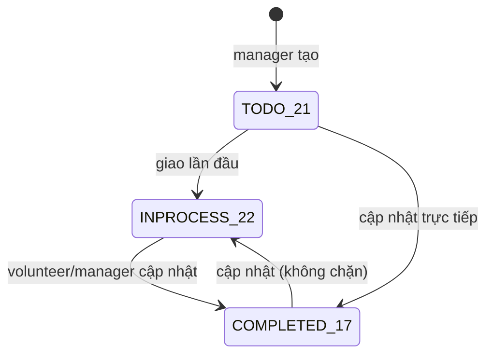
```mermaid
stateDiagram-v2
  [*] --> TODO_21: manager tạo
  TODO_21 --> INPROCESS_22: giao lần đầu
  INPROCESS_22 --> COMPLETED_17: volunteer/manager cập nhật
  TODO_21 --> COMPLETED_17: cập nhật trực tiếp
  COMPLETED_17 --> INPROCESS_22: cập nhật (không chặn)
```

| Từ → sang | Ai | Điều kiện | File |
|---|---|---|---|
| (mới) → 21 | canManage | — | `campaign_task.service.ts > createTask()` |
| 21 → 22 | Tự động khi assign | Task đang 21 | `assignTask()` |
| bất kỳ → số nguyên bất kỳ | canManage (`PUT /tasks/:id`) hoặc volunteer được giao (`PUT /tasks/:id/status`) | **Không validate giá trị** | `updateTask()`, `updateTaskStatusByVolunteer()` |
| → xoá mềm | canManage | — | `deleteTask()` |

## 5. Submission (`campaign_submissions.status`)

| Từ → sang | Ai | Điều kiện | Side effect | File |
|---|---|---|---|---|
| (mới) → INREVIEW 9 | canManage | — | Gắn kết quả nháp (luôn rỗng) | `campaign_submission.service.ts > createSubmission()` |
| 9 / 6 / 12 → APPROVED 14 hoặc REJECTED 18 | canManage, kể cả chính người nộp | — | Không có | `processSubmission()` |

## 6. SOS (`sos.status`)

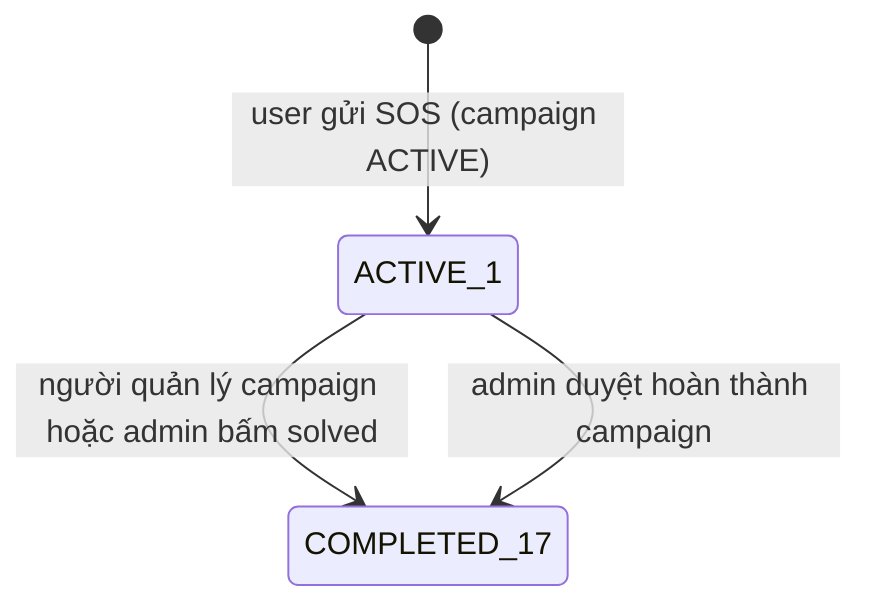
```mermaid
stateDiagram-v2
  [*] --> ACTIVE_1: user gửi SOS (campaign ACTIVE)
  ACTIVE_1 --> COMPLETED_17: người quản lý campaign hoặc admin bấm solved
  ACTIVE_1 --> COMPLETED_17: admin duyệt hoàn thành campaign
```

| Từ → sang | Ai | Điều kiện | File |
|---|---|---|---|
| (mới) → 1 | User đăng nhập | Campaign ACTIVE, có toạ độ | `INC/modules/sos/sos.service.ts > create()` |
| 1 → 17 | Platform admin hoặc canManage của campaign (BR-192) | Sai → 403 `SOS_PERMISSION_DENIED` | `solveSos()` |
| 1 → 17 | Admin, gián tiếp | Duyệt hoàn thành campaign | `adminFinalizeCampaignCompletion()` |

## 7. Đơn đăng ký tổ chức (`organization_applications.status`) và owner (`organization_application_owners.status`)

Thiết kế: [ORG_OWNERSHIP_FLOW.md](ORG_OWNERSHIP_FLOW.md). Điểm then chốt: **`PENDING_REVIEW` chỉ đạt được khi mọi owner (chưa bị gỡ) đã CONFIRMED**, và admin không thấy đơn trước trạng thái đó.

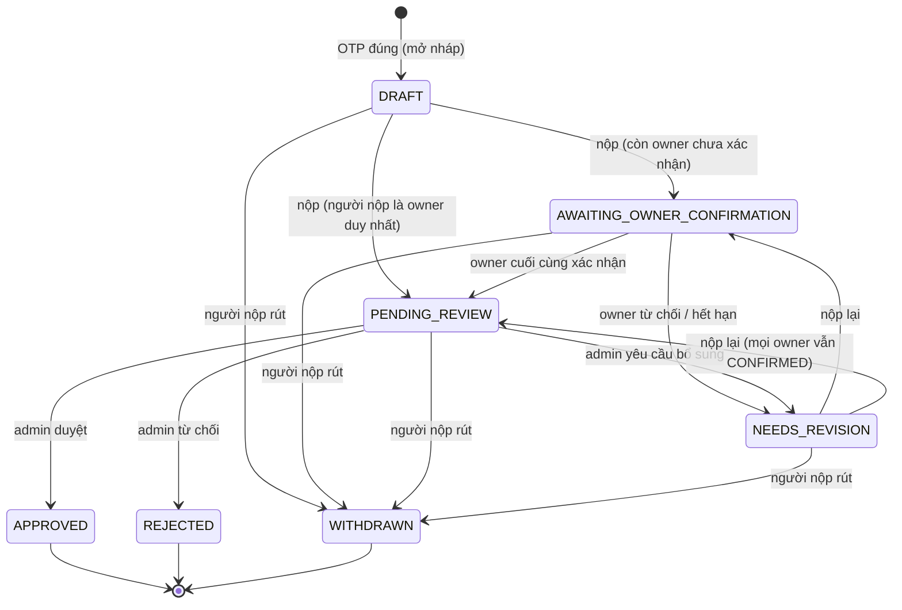
```mermaid
stateDiagram-v2
  [*] --> DRAFT: OTP đúng (mở nháp)
  DRAFT --> AWAITING_OWNER_CONFIRMATION: nộp (còn owner chưa xác nhận)
  DRAFT --> PENDING_REVIEW: nộp (người nộp là owner duy nhất)
  AWAITING_OWNER_CONFIRMATION --> PENDING_REVIEW: owner cuối cùng xác nhận
  AWAITING_OWNER_CONFIRMATION --> NEEDS_REVISION: owner từ chối / hết hạn
  PENDING_REVIEW --> NEEDS_REVISION: admin yêu cầu bổ sung
  NEEDS_REVISION --> AWAITING_OWNER_CONFIRMATION: nộp lại
  NEEDS_REVISION --> PENDING_REVIEW: nộp lại (mọi owner vẫn CONFIRMED)
  PENDING_REVIEW --> APPROVED: admin duyệt
  PENDING_REVIEW --> REJECTED: admin từ chối
  DRAFT --> WITHDRAWN: người nộp rút
  AWAITING_OWNER_CONFIRMATION --> WITHDRAWN: người nộp rút
  PENDING_REVIEW --> WITHDRAWN: người nộp rút
  NEEDS_REVISION --> WITHDRAWN: người nộp rút
  APPROVED --> [*]
  REJECTED --> [*]
  WITHDRAWN --> [*]
```

| Từ → sang | Ai | Điều kiện | Side effect | File |
|---|---|---|---|---|
| (mới) → DRAFT | Người nộp ẩn danh (OTP) | Email chưa có đơn mở (có rồi thì trả đơn đó) | Code `ORG-…`; owner đầu tiên = người nộp; tracking token | `INC/modules/organization_application/organization-application.service.ts > openDraftForEmail()` |
| DRAFT / NEEDS_REVISION → AWAITING_OWNER_CONFIRMATION hoặc PENDING_REVIEW | Người nộp (tracking token) | BR-057..BR-060, BR-069, BR-300..BR-303; row lock | Người nộp CONFIRMED; token 14 ngày cho owner cần link; reset xác nhận nếu snapshot đổi (BR-306); event SUBMITTED / RESUBMITTED (`changedFields`), OWNER_CONFIRMATIONS_RESET, READY_FOR_REVIEW; email ORG_OWNER_CONFIRMATION_REQUEST (+ ORG_APPLICATION_RECEIVED lần đầu) | `submitApplication()` |
| AWAITING → PENDING_REVIEW | Hệ thống, trong transaction của lần xác nhận cuối | Không còn owner nào khác CONFIRMED | event OWNER_CONFIRMED, READY_FOR_REVIEW; `submittedAt` | `owner-confirmation.service.ts > confirm()` |
| AWAITING / NEEDS_REVISION → NEEDS_REVISION | Hệ thống (owner bấm "Tôi không liên quan") | Owner đang PENDING / EXPIRED | reviewNote; event OWNER_DECLINED; email ORG_OWNER_DECLINED | `decline()` |
| AWAITING → NEEDS_REVISION | Sweeper mỗi giờ | Owner PENDING có `expiresAt < now` | event OWNER_EXPIRED; email ORG_OWNER_CONFIRMATION_EXPIRED | `expireOverdue()`, `owner-confirmation-expiry.job.ts` |
| PENDING_REVIEW → NEEDS_REVISION | Admin | Có message | reviewNote; event INFO_REQUESTED; email ORG_APPLICATION_NEEDS_INFO | `organization-application-admin.service.ts > requestMoreInfo()` |
| PENDING_REVIEW (claim) | Admin | reviewerId trống hoặc là chính mình (BR-070) | reviewerId, claimedAt; event CLAIMED; **không đổi status** | `claim()` |
| PENDING_REVIEW → APPROVED | Admin | BR-074..BR-076, BR-312 | Tổ chức + channels + membership từng owner; outbox ORG_OWNER_ONBOARD mỗi owner; event APPROVED (+ DOCUMENTS_WAIVED) | `approve()` |
| PENDING_REVIEW → REJECTED | Admin | Có lý do | Email ORG_APPLICATION_REJECTED; event REJECTED | `reject()` |
| mở → WITHDRAWN | Người nộp | — | Link chưa trả lời hết hạn ngay; email ORG_APPLICATION_WITHDRAWN_NOTICE cho owner đã xác nhận; event WITHDRAWN | `withdrawApplication()` |

**Owner (`OwnerCandidateStatus`)**

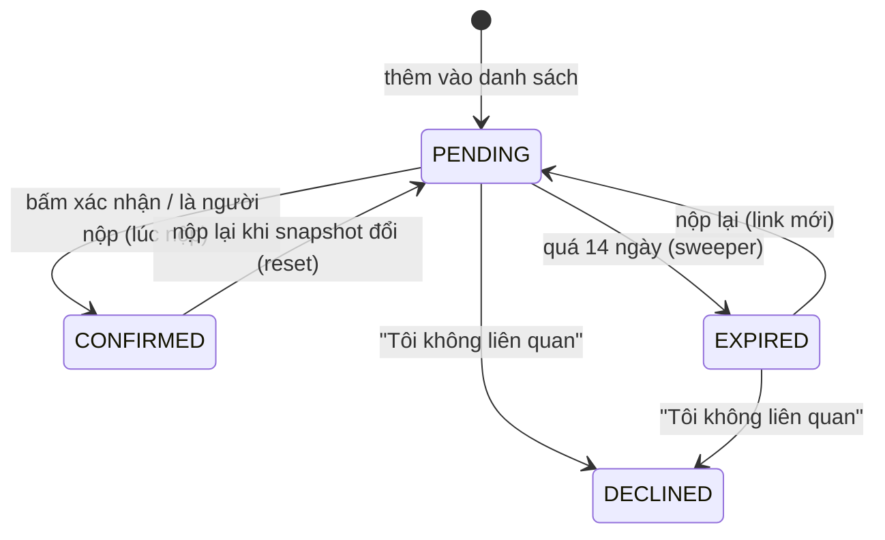
```mermaid
stateDiagram-v2
  [*] --> PENDING: thêm vào danh sách
  PENDING --> CONFIRMED: bấm xác nhận / là người nộp (lúc nộp)
  PENDING --> DECLINED: "Tôi không liên quan"
  PENDING --> EXPIRED: quá 14 ngày (sweeper)
  EXPIRED --> DECLINED: "Tôi không liên quan"
  EXPIRED --> PENDING: nộp lại (link mới)
  CONFIRMED --> PENDING: nộp lại khi snapshot đổi (reset)
```

| Từ → sang | Ai | Ghi chú | File |
|---|---|---|---|
| (mới) → PENDING | Người nộp (lưu nháp) | Chưa có link cho tới khi nộp | `syncOwners()` |
| PENDING → CONFIRMED | Owner / hệ thống (người nộp) | Lưu `respondedAt`, `confirmIp`, `confirmUa` | `confirm()`, `submitApplication()` |
| PENDING / EXPIRED → DECLINED | Owner | Tuỳ chọn `owner_invite_blocks` | `decline()` |
| PENDING → EXPIRED | Sweeper | Giữ hash để link cũ báo "hết hạn" | `expireOverdue()` |
| bất kỳ → gỡ (`removedAt`) | Người nộp (lưu nháp) | Không xoá bản ghi; event OWNER_CANDIDATE_REMOVED; thêm lại thì về PENDING | `syncOwners()` |
| CONFIRMED / EXPIRED → PENDING | Người nộp (nộp lại) | Reset do BR-306, hoặc cấp link mới cho EXPIRED | `submitApplication()` |

### 7b. Owner change (`type` = `ADD_OWNER` / `REMOVE_OWNER`)

Dùng chung bảng và state `organization_applications`, nhưng không có DRAFT / NEEDS_REVISION / PENDING_REVIEW: quyết trong tổ chức, không qua admin nền tảng; bị từ chối là kết thúc.

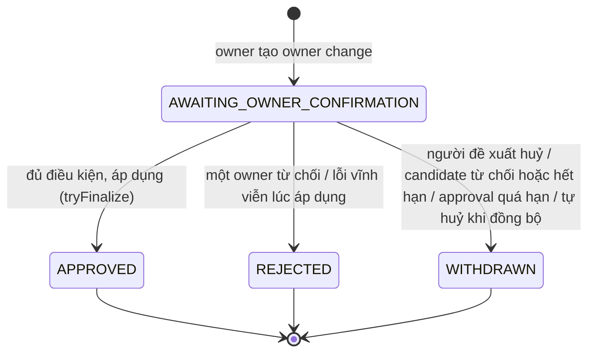
```mermaid
stateDiagram-v2
  [*] --> AWAITING_OWNER_CONFIRMATION: owner tạo owner change
  AWAITING_OWNER_CONFIRMATION --> APPROVED: đủ điều kiện, áp dụng (tryFinalize)
  AWAITING_OWNER_CONFIRMATION --> REJECTED: một owner từ chối / lỗi vĩnh viễn lúc áp dụng
  AWAITING_OWNER_CONFIRMATION --> WITHDRAWN: người đề xuất huỷ / candidate từ chối hoặc hết hạn / approval quá hạn / tự huỷ khi đồng bộ
  APPROVED --> [*]
  REJECTED --> [*]
  WITHDRAWN --> [*]
```

"Đủ điều kiện" = mọi candidate (ADD: người được đề xuất; REMOVE: không có) CONFIRMED **và** mọi approval APPROVED hoặc void (approver không còn là owner) — BR-339.

| Từ → sang | Ai | Điều kiện | Side effect | File |
|---|---|---|---|---|
| (mới) → AWAITING_OWNER_CONFIRMATION | Người có `OWNER_PROPOSE` | BR-319 / BR-343, BR-342 | Chốt approver; email xác nhận candidate; ORG_OWNER_CHANGE_APPROVAL_REQUEST; REMOVE: ORG_OWNER_REMOVAL_PROPOSED | `owner-change.service.ts > create()` |
| AWAITING → APPROVED | Hệ thống sau hành động cuối (tạo, đồng ý, xác nhận, owner rời) hoặc sweeper | BR-345 | Cấp / hạ / gỡ membership; outbox ORG_OWNER_ONBOARD (ADD); ORG_OWNER_CHANGE_DECIDED, ORG_MEMBERSHIP_CHANGED; `reconcileOpenChanges` | `owner-change-executor.ts > tryFinalize()` |
| AWAITING → REJECTED | Approver (từ chối) / hệ thống (lỗi vĩnh viễn) | BR-341, BR-345 | `rejectReason`; ORG_OWNER_CHANGE_DECIDED | `owner-change.service.ts > reject()`, `owner-change-executor.ts > end()` |
| AWAITING → WITHDRAWN | Người đề xuất (huỷ) / candidate (từ chối) / sweeper (hết hạn) / đồng bộ | BR-320, BR-321, BR-340, BR-346 | `reviewNote`; link chờ hết hạn; báo người đã xác nhận | `cancel()`, `decline()`, `expireOverdue()`, `sweep()`, `reconcileOpenChanges()` |

**Approval** (`organization_owner_change_approvals.status`, `OwnerApprovalStatus`):

| Từ → sang | Ai | Điều kiện | File |
|---|---|---|---|
| (mới) → PENDING | Hệ thống lúc tạo owner change | Hạn 14 ngày | `owner-change.service.ts > create()` |
| PENDING → APPROVED / REJECTED | Chính approver | Owner change còn mở, chưa quá hạn (BR-347) | `owner-change.service.ts > answer()` |
| PENDING → EXPIRED | Sweeper | Quá hạn và approver còn là owner (BR-340) | `owner-change-executor.ts > sweep()` |
| PENDING (void) | — | Approver không còn là owner: dòng giữ PENDING nhưng không tính | `isOwnerChangeReady()` |

### 7c. Lời mời thành viên (`organization_invitations.status`)

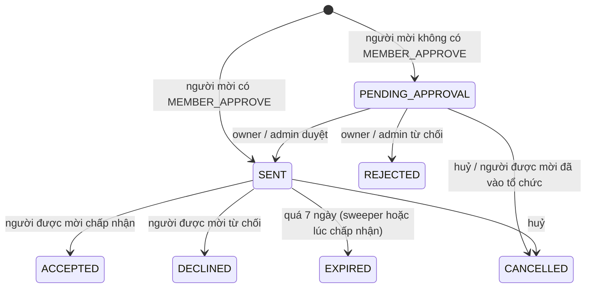
```mermaid
stateDiagram-v2
  [*] --> PENDING_APPROVAL: người mời không có MEMBER_APPROVE
  [*] --> SENT: người mời có MEMBER_APPROVE
  PENDING_APPROVAL --> SENT: owner / admin duyệt
  PENDING_APPROVAL --> REJECTED: owner / admin từ chối
  PENDING_APPROVAL --> CANCELLED: huỷ / người được mời đã vào tổ chức
  SENT --> ACCEPTED: người được mời chấp nhận
  SENT --> DECLINED: người được mời từ chối
  SENT --> EXPIRED: quá 7 ngày (sweeper hoặc lúc chấp nhận)
  SENT --> CANCELLED: huỷ
```

| Từ → sang | Ai | Điều kiện | Side effect | File |
|---|---|---|---|---|
| (mới) → PENDING_APPROVAL / SENT | Thành viên (`MEMBER_INVITE`) | BR-333 | SENT: token 7 ngày + email ORG_INVITATION; PENDING: ORG_INVITATION_PENDING | `organization-invitation.service.ts > create()` |
| PENDING_APPROVAL → SENT / REJECTED | Owner / LR / ADMIN | BR-334 | Email / ORG_INVITATION_REJECTED | `approve()`, `reject()` |
| PENDING_APPROVAL / SENT → CANCELLED | Người mời hoặc người duyệt | BR-335 | — | `cancel()` |
| SENT → ACCEPTED | Người có token | Chưa hết hạn; idempotent | `grantMembership(MEMBER, INVITATION)` nếu chưa có vai | `accept()` |
| SENT → DECLINED | Người có token | — | — | `decline()` |
| SENT → EXPIRED | Sweeper mỗi giờ / lúc chấp nhận | `expiresAt < now` | — | `expireOverdue()`, `accept()` |

## 8. Tổ chức (`organizations.status`, `trustTier`, `isEmailVerified`) và owner

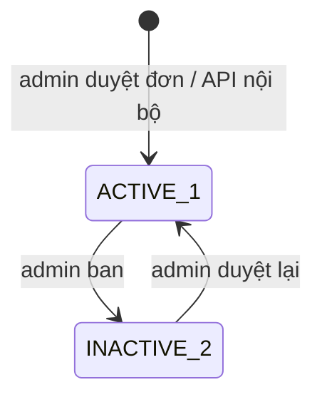
```mermaid
stateDiagram-v2
  [*] --> ACTIVE_1: admin duyệt đơn / API nội bộ
  ACTIVE_1 --> INACTIVE_2: admin ban
  INACTIVE_2 --> ACTIVE_1: admin duyệt lại
```

| Trục | Từ → sang | Ai | Điều kiện | Side effect | File |
|---|---|---|---|---|---|
| status | (mới) → ACTIVE 1 | Admin (qua duyệt đơn) hoặc service nội bộ | Phải có ≥ 1 membership vai owner lúc COMMIT (trigger) | Membership owner; email xác minh và TRANSLATE_TEXT (chỉ với luồng nội bộ) | `approve()`, `organization.service.ts > createOrganization()`, `organization.repository.ts > create()` |
| status | 4 / 2 / 9 / 12 → ACTIVE 1 | Admin | — | Thông báo ORGANIZATION_APPROVED tới mọi owner | `adminVerifyOrganization()` |
| status | 4 / 12 / 9 / 1 → INACTIVE 2 | Admin | Có lý do | Thông báo ORGANIZATION_REJECTED tới mọi owner. Cùng transaction: campaign 4 / 12 / 19 của tổ chức → CANCELLED 11, gỡ report (BR-189) | `adminVerifyOrganization()`, `campaign-lifecycle.service.ts > cancelForLockedOrganization()` |
| trustTier | (mới) → VERIFIED hoặc NONE | Admin (khi duyệt đơn) | `grant_blue_tick` / lane A | — | `approve()` |
| trustTier | VERIFIED → ? | — | **Không có code gỡ hoặc tạm dừng Blue Tick**, không có job xử lý hết hạn | — | [CHƯA HOÀN THIỆN] |
| kycStatus | NOT_SUBMITTED → APPROVED | Admin (khi duyệt đơn) | — | — | `approve()` |
| isEmailVerified | (mới) → true | Admin (khi duyệt đơn) | contactEmail = submitterEmail đã qua OTP | — | `approve()` |
| isEmailVerified | false → true | Người click link | Token hợp lệ, email khớp | — | `confirmOrganizationContactEmail()` |
| isEmailVerified | true → false | Owner | Đổi contactEmail | Gửi link mới | `updateOrganization()` |
| owner | (mới) → membership `LEGAL_REPRESENTATIVE` / `OWNER` | Admin (duyệt đơn) | Trần 3 tổ chức dưới advisory lock | Outbox ORG_OWNER_ONBOARD | `organization-membership.service.ts > grantMembership()` |
| owner | membership vai khác → `OWNER` | Hệ thống (áp dụng ADD_OWNER) | Candidate xác nhận + owner khác đồng ý; trần 3 tổ chức dưới advisory lock | Outbox ORG_OWNER_ONBOARD | `owner-change-executor.ts > applyLocked()` |
| owner | owner → ADMIN / MEMBER / xoá mềm | Hệ thống (áp dụng REMOVE_OWNER) | Mọi owner còn lại đồng ý (không còn ai → ngay) | ORG_MEMBERSHIP_CHANGED | `applyLocked() > demoteOrRemove()` |
| owner | owner → ADMIN / MEMBER / rời | Chính owner | Còn owner khác (khoá dòng owner) | ORG_OWNER_LEFT; `reconcileOpenChanges` | `organization.service.ts > stepDown(), leaveOrganization()` |
| owner | owner cuối cùng → rời / xoá / hạ vai | — | **Bị chặn**: 409 ORG_MUST_HAVE_OWNER ở code và trigger DB | — | `ownerStepOut()`, trigger `organization_members_owner_guard` |

## 9. Yêu cầu gia nhập tổ chức (`organization_joining_requests.status`) và thành viên

| Từ → sang | Ai | Điều kiện | Side effect | File |
|---|---|---|---|---|
| (mới) → PENDING 12 | User chưa có membership | BR-085 | VOLUNTEER_REQUEST cho owner / LR / ADMIN | `organization.service.ts > createJoinRequest()` |
| 12 → APPROVED 14 | Người có `MEMBER_APPROVE` | — | `grantMembership` vai MEMBER; VOLUNTEER_APPROVED | `processJoinRequest()` |
| 12 → REJECTED 18 | Người có `MEMBER_APPROVE` | — | VOLUNTEER_REJECTED | `processJoinRequest()` |
| 12 → xoá mềm | Người xin | — | — | `cancelJoinRequest()` |
| Thành viên: đang hoạt động → xoá mềm | Chính thành viên (không có vai owner) | BR-088 | — | `leaveOrganization()` |
| Thành viên: đang hoạt động → xoá mềm | Người có `MEMBER_MANAGE` | BR-332 (không phải owner; admin không gỡ admin) | ORG_MEMBERSHIP_CHANGED | `removeMember()` |
| Vai: ADMIN / CAMPAIGN_MANAGER / MEMBER ↔ nhau | Người có `MEMBER_MANAGE` | BR-331 (`assignableRoles`, `canActOnMember`) | ORG_MEMBERSHIP_CHANGED | `changeMemberRole()` |
| (mới) → MEMBER | Người được mời (chấp nhận) | BR-336 | — | `organization-invitation.service.ts > accept()` |

## 10. Tài khoản người dùng (`users.status`)

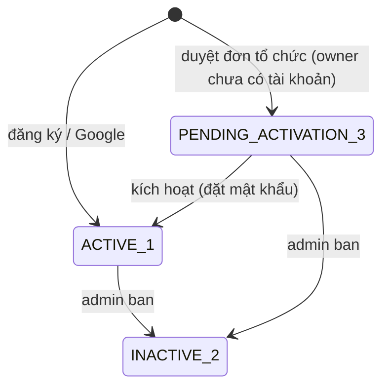
```mermaid
stateDiagram-v2
  [*] --> ACTIVE_1: đăng ký / Google
  [*] --> PENDING_ACTIVATION_3: duyệt đơn tổ chức (owner chưa có tài khoản)
  PENDING_ACTIVATION_3 --> ACTIVE_1: kích hoạt (đặt mật khẩu)
  ACTIVE_1 --> INACTIVE_2: admin ban
  PENDING_ACTIVATION_3 --> INACTIVE_2: admin ban
```

| Từ → sang | Ai | Điều kiện | Side effect | File |
|---|---|---|---|---|
| (mới) → 1 | Khách | Email chưa có | — | `ID/modules/auth/auth.service.ts > signup()`, `google.service.ts > handleCallback()` |
| (mới) → 3 | Service nội bộ (incident, ensure-users) | Email chưa có user | Không mật khẩu; token kích hoạt phát sau qua outbox | `ensureUsersForOwners()`, `issueActivationToken()` |
| 3 → 1 | Người cầm token kích hoạt | Token `ACCOUNT_ACTIVATION` còn hạn **và** user đang 3 | Đặt password; revoke REFRESH | `activateAccount()` |
| 1 / 3 → 2 | Admin | Không ban chính mình | Revoke REFRESH | `ID/modules/user/user.service.ts > adminBanUser()` |
| 2 → 1 | — | Không có API gỡ ban. Kích hoạt kiểm tra status nên tài khoản bị ban khi đang ở 3 không còn chuyển về 1 được | — | — |
| → xoá mềm | **User đăng nhập bất kỳ** (`DELETE /users/:id`) | — | Không revoke token | `user.service.ts > deleteUser()` |

## 11. Đơn đổi quà (`gift_redemptions.status`)

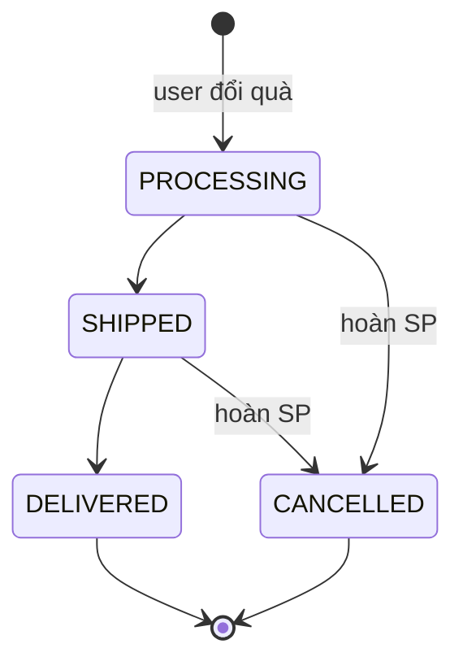
```mermaid
stateDiagram-v2
  [*] --> PROCESSING: user đổi quà
  PROCESSING --> SHIPPED
  PROCESSING --> CANCELLED: hoàn SP
  SHIPPED --> DELIVERED
  SHIPPED --> CANCELLED: hoàn SP
  DELIVERED --> [*]
  CANCELLED --> [*]
```

| Từ → sang | Ai (thực tế trong code) | Điều kiện | Side effect | File |
|---|---|---|---|---|
| (mới) → PROCESSING | User đăng nhập | BR-222..BR-225 | Trừ tồn kho; trừ SP theo FIFO; ghi sổ âm | `RW/modules/gift/gift.service.ts > redeem()` |
| PROCESSING → SHIPPED; SHIPPED → DELIVERED | **User đăng nhập bất kỳ** (thiếu kiểm tra admin) | BR-230 | statusUpdatedAt | `updateRedemptionStatus()` |
| PROCESSING / SHIPPED → CANCELLED | như trên | BR-230 | cancelledAt; hoàn SP (lô mới); ghi GIFT_REDEEM_REFUND; không hoàn tồn kho | `updateRedemptionStatus()` |

Không có thông báo nào được gửi khi đơn đổi quà đổi trạng thái.

## 12. Season (`seasons.status`)

| Từ → sang | Ai | Điều kiện | Side effect | File |
|---|---|---|---|---|
| (mới) → ACTIVE 1 hoặc INACTIVE 2 | Admin | BR-247 | — | `season.service.ts > createSeason()` |
| ACTIVE → INACTIVE (finalize) | Admin | BR-248 | Snapshot bảng xếp hạng; chi SP theo payout tier; nếu `openNext` thì mở season mới | `finalizeSeason()` |
| ACTIVE ↔ INACTIVE (PATCH) | Admin | Không có điều kiện | **Không** snapshot, không chi SP | `patchSeason()` |

## 13. Background job, outbox, notification job (hạ tầng)

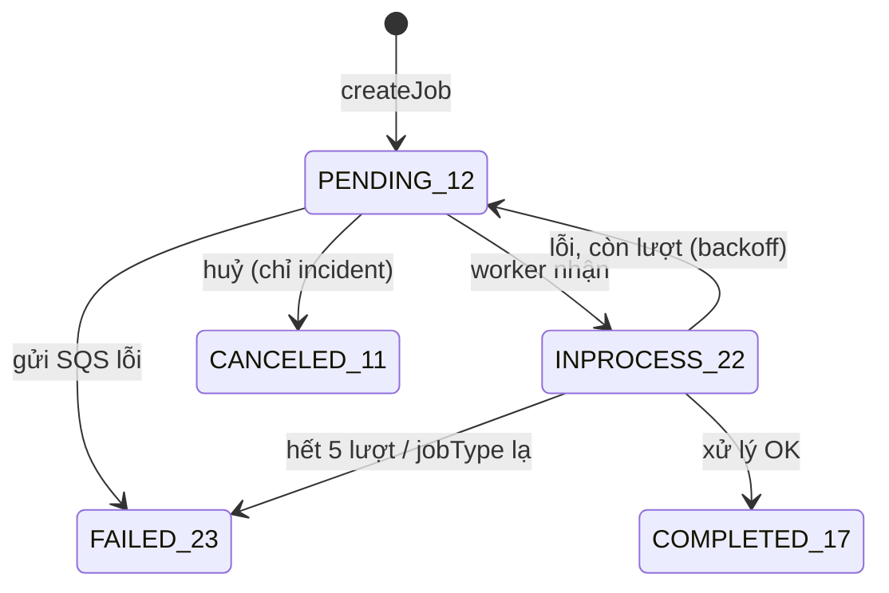
```mermaid
stateDiagram-v2
  [*] --> PENDING_12: createJob
  PENDING_12 --> FAILED_23: gửi SQS lỗi
  PENDING_12 --> INPROCESS_22: worker nhận
  INPROCESS_22 --> COMPLETED_17: xử lý OK
  INPROCESS_22 --> PENDING_12: lỗi, còn lượt (backoff)
  INPROCESS_22 --> FAILED_23: hết 5 lượt / jobType lạ
  PENDING_12 --> CANCELED_11: huỷ (chỉ incident)
```

- Áp dụng cho `background_jobs` (incident), `notification_jobs`, `reward_background_jobs` (`ecolink-server/shared/da2-queue/src/core/queue-worker.ts`, các `*/queue/background-job-store.ts`).
- **Outbox** (`outbox_events`, `INC/outbox/outbox-relay.ts`): 12 → 22 (claim bằng `FOR UPDATE SKIP LOCKED`) → 17 (publish OK) / 12 (retry, `min(900s, 30s·2^(a-1))`) / 23 (sau 10 lần). Nếu process crash sau khi claim, dòng bị kẹt ở 22. Circuit breaker của relay: 5 lỗi thì OPEN 30s.
- Queue `reward-intake` dùng NoopStore: không có dòng trạng thái nào.

## 14. Trạng thái nhị phân khác

| Entity | Trạng thái | Chuyển | File |
|---|---|---|---|
| Vote.value | 0 / 1 / -1 | Toggle (BR-130) | `INC/modules/vote/vote.service.ts` |
| SavedResource | active / deleted | Toggle (BR-133) | `saved_resource.service.ts` |
| CampaignCompletionVerification.value | 0 / 1 / -1 | Gửi lại cùng giá trị thì thành 0 | `campaign_completion_verification.service.ts` |
| CampaignAttendanceCheckIn | chưa có / có | Chỉ thêm, idempotent | `campaign_attendance.service.ts` |
| Notification.readAt | null → thời điểm | Chỉ một chiều | `NS/modules/notification/notification.service.ts > markRead()` |
| AuthToken | active → revoked / used / hết hạn | Xem BR-008..BR-012 | `ID/modules/auth/*` |
| OTP đơn tổ chức | active → used / expired | Xem BR-053, BR-054 | `organization-application-otp.service.ts` |
| Gift.isActive, BadgeDefinition.isActive / publishedAt | bật / tắt | Admin | `RW/modules/*` |
