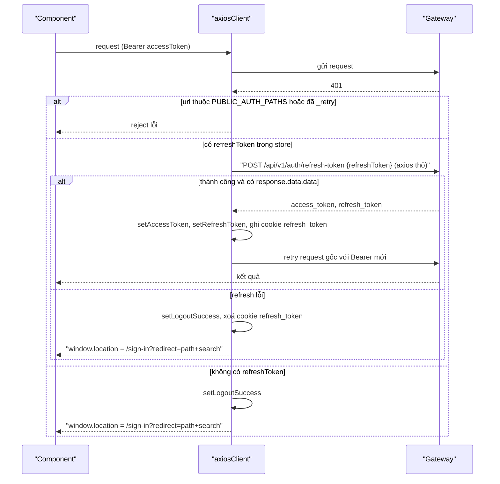

# 06 — Frontend (ecolink-client)

> Tài liệu viết dựa hoàn toàn vào code trong `ecolink-client/` (bỏ qua `node_modules`, `dist`). Mọi đường dẫn bằng chứng tính từ `/Users/ngoc/ecolink`. Chỗ ghi **[CHƯA HOÀN THIỆN]** là code dở dang, mock, TODO hoặc logic bị comment out.

---

## 1. Tổng quan kiến trúc client

### 1.1 Stack

| Thành phần | Công nghệ | Bằng chứng |
|---|---|---|
| Build / dev server | Vite 7 (port 5173 cho cả `dev` và `preview`), CSR thuần | `ecolink-client/vite.config.ts`, `ecolink-client/package.json > scripts` |
| UI | React 19.2, Tailwind 4, Radix/shadcn (`components/ui`), antd 6 (Image preview), sonner (toast) | `ecolink-client/package.json` |
| Routing | `react-router-dom` 7, `createBrowserRouter` | `ecolink-client/src/routes/index.tsx > router` |
| Server state | TanStack Query v5 (wrapper `useGet`/`usePost`) | `ecolink-client/hooks/reactQuery.ts`, `ecolink-client/libs/queryClient.ts` |
| Client state | Zustand + `persist` (localStorage key `auth_store`) | `ecolink-client/stores/useAuthStore.ts` |
| HTTP | axios instance + interceptor | `ecolink-client/libs/axiosClient.ts`, `ecolink-client/utils/requestApi.ts` |
| Form | react-hook-form (không dùng zod/yup — toàn bộ rule khai báo inline `rules`/`register`) | các file form, xem mục 8 |
| i18n | i18next + react-i18next, 2 ngôn ngữ `en`/`vi` | `ecolink-client/i18n/index.ts` |
| Bản đồ | Leaflet / react-leaflet; geocoding gọi thẳng `https://nominatim.openstreetmap.org` | `.../campaigns/create/_components/LeafletAddress.tsx`, `.../incidents/create/_components/Address.tsx` |
| Upload media | Cloudinary unsigned preset (gọi axios thô) | `ecolink-client/app/(pages)/(main)/incidents/create/_services/upload.service.ts > uploadToCloudinary()` |
| Deploy | Docker multi-stage → nginx (port 3000, SPA fallback `try_files ... /index.html`); `vercel.json` rewrite mọi path về `/index.html` | `ecolink-client/Dockerfile`, `ecolink-client/nginx.conf`, `ecolink-client/vercel.json` |
| Test | Không có test; cổng kiểm tra duy nhất là `npm run build` (`tsc -b && vite build`) | `ecolink-client/CLAUDE.md`, `ecolink-client/package.json` |

**Lưu ý quan trọng**: thư mục `app/(pages)/...` trông như Next.js App Router nhưng repo là Vite + react-router. `(main)`, `[id]`, `loading.tsx` chỉ là tên thư mục/dead code; route chỉ tồn tại khi đăng ký trong `src/routes/index.tsx` bằng helper `lazyPage` (`ecolink-client/CLAUDE.md`, `ecolink-client/src/routes/index.tsx > lazyPage()`). `libs/router.tsx` bọc react-router thành API kiểu Next (`useRouter().push/replace/back/refresh`, `<Link href>`, `usePathname`, `useSearchParams` trả `URLSearchParams`) (`ecolink-client/libs/router.tsx`).

### 1.2 Cấu trúc thư mục

```
ecolink-client/
├── src/                 main.tsx, App.tsx (RouterProvider), routes/index.tsx, layouts/*, pages/NotFound.tsx
├── app/(pages)/         các màn hình: (main) người dùng cuối, (auth), (admin), (maps)
│   └── <route>/         page.tsx + _components/ _context/ _hooks/ _services/ (Context-per-page pattern)
├── apis/<domain>/       hàm gọi API + hook useGet/usePost; apis/<domain>/models/* là type
├── components/          ui/ (shadcn), client/ (layout, shared, ai-chat, providers), admin/ (shell, DataTable), form/
├── modules/             component nghiệp vụ dùng lại (OrganizationCard, ReportDetailCard, ReportSummaryCard...)
├── hooks/               reactQuery.ts (useGet/usePost), useGetParam, useQueryString, useDebounce, useMediaQuery, useLocalizedDisplay
├── stores/              useAuthStore.ts (Zustand)
├── libs/                axiosClient, queryClient, router, compressImage, getCroppedImage, getApiLocale, notificationDisplay...
├── utils/               requestApi, showMessage, logout, campaignTaskMedia, scheduledTimeRange...
├── constants/           roles, status, severity, difficulty, priority, notificationPreferences, organizationApplicationStatus, gamification, i18n
├── i18n/                index.ts + locales/{en,vi}/common.json (1057 key mỗi file, không lệch key)
├── types/               BaseResponse, PaginationResponse
└── vite/reverseGeocode.ts   middleware `/api/reverse-geocode` chỉ chạy ở Vite dev/preview
```

Cây provider: `main.tsx` → `App` (`RouterProvider`) → `RootLayout` (`ReactQueryProvider` → `TooltipProvider` → `I18nProvider` → `<Outlet/>`, `<Toaster/>`) (`ecolink-client/src/layouts/RootLayout.tsx > RootLayout()`).

### 1.3 i18n

- Khởi tạo cứng `lng: "en"`, `fallbackLng: "en"`, 1 namespace `common` (`ecolink-client/i18n/index.ts`).
- `I18nProvider` đọc `localStorage["i18nextLng"]` sau mount, chuẩn hoá về `en|vi` (`resolveUiLanguage`) rồi `changeLanguage` (`ecolink-client/components/client/providers/I18nProvider.tsx`, `ecolink-client/constants/i18n.ts`).
- Mọi request axios gắn header `Accept-Language` (`vi-VN,vi;q=0.9,en;q=0.8` hoặc `en-US,...`), và mọi request **GET** tự thêm query `lang=<en|vi>` nếu chưa có (`ecolink-client/libs/axiosClient.ts > onRequest()`, `ecolink-client/libs/getApiLocale.ts`).
- Quy ước: key là câu tiếng Anh, phải thêm vào cả `en/common.json` và `vi/common.json` (`ecolink-client/CLAUDE.md`). Hiện 2 file có 1057 key, trùng khớp.
- Nội dung đa ngôn ngữ từ server (thông báo): `payload.locales.{en,vi}` được chọn theo ngôn ngữ UI (`ecolink-client/libs/notificationDisplay.ts > getLocalizedNotificationText()`).

### 1.4 Biến môi trường (chỉ tên)

| Biến | Ý nghĩa | Nơi dùng |
|---|---|---|
| `VITE_API_URL` | Base URL API (gateway, mặc định local `http://localhost:8081` trong `.env.example`); nếu trống, axios dùng `window.location.origin` | `ecolink-client/libs/axiosClient.ts > getBaseUrl()`, `components/client/ai-chat/aiChatClient.ts > isChatApiConfigured()` |
| `VITE_CLOUDINARY_CLOUD_NAME` | Cloud name Cloudinary (fallback `"example"`) | `.../incidents/create/_services/upload.service.ts` |
| `VITE_CLOUDINARY_UPLOAD_PRESET` | Unsigned upload preset (fallback `"example"`) | như trên |

Các biến `VITE_*` được inline lúc build (build-arg trong `ecolink-client/Dockerfile`).

---

## 2. Danh sách route (React Router)

Nguồn: `ecolink-client/src/routes/index.tsx > router`. Tổng: **45 route entry** (gồm 3 redirect và 2 route `*`).

**Kết luận về guard**: chỉ có **1 guard phía client** là `AdminLayout` (chỉ kiểm tra đăng nhập, **không kiểm tra role** vì đoạn so `roleId` bị comment out). Mọi trang khác không có guard route; việc "cần đăng nhập" thực tế do server trả 401 → interceptor axios đá về `/sign-in?redirect=...` (`ecolink-client/libs/axiosClient.ts > onResponseError()`). Cột "Cần đăng nhập?" dưới đây ghi **"Có (qua API 401)"** khi trang gọi API cần auth ngay lúc tải; **"Không"** khi trang dùng được ẩn danh.

### 2.1 Nhóm `MainLayout` (Header + Footer + AiChatWidget)

| Path | Component (file) | Layout | Cần đăng nhập? | Role | Guard (file > hàm) |
|---|---|---|---|---|---|
| `/` | `app/(pages)/(main)/(hompage)/page.tsx > Home` | Main | Không (nếu có token thì gọi `getMe` để làm mới user) | — | Không |
| `/campaigns` | `app/(pages)/(main)/campaigns/(search)/page.tsx` | Main | Tab explore: tuỳ server `GET /api/v1/campaigns`; tab `?tab=mine` gọi `/campaigns/my` (server `authenticate`) | — | Không |
| `/campaigns/create` | `app/(pages)/(main)/campaigns/create/page.tsx > CreateCampaignPage` | Main | Có (qua API 401) | UI chỉ cho chọn tổ chức mình sở hữu (`is_owner: true`) | Không |
| `/campaigns/me` | `app/(pages)/(main)/campaigns/me/page.tsx` | Main | Có (qua API 401) | — | Không |
| `/campaigns/:id` | `app/(pages)/(main)/campaigns/[id]/page.tsx > CampaignDetailPage` | Main | Tuỳ server `GET /campaigns/:id` | Hành động ẩn/hiện theo owner/manager (mục 9) | Không |
| `/incidents` | `app/(pages)/(main)/incidents/(search)/page.tsx` | Main | Có (qua API 401 — `GET /reports/search` có `authenticate`, `ecolink-server/services/incident-service/src/modules/report/report.routes.ts`) | — | Không |
| `/incidents/create` | `app/(pages)/(main)/incidents/create/page.tsx` | Main | Có (qua API 401 khi submit) | — | Không |
| `/incidents/me` | `app/(pages)/(main)/incidents/me/page.tsx` | Main | Có (qua API 401) | — | Không |
| `/incidents/:id` | `app/(pages)/(main)/incidents/[id]/page.tsx` | Main | Tuỳ server `GET /reports/:id` | — | Không |
| `/organizations` | `app/(pages)/(main)/organizations/(search)/page.tsx` | Main | Tab explore: tuỳ server; tab `mine` gọi `/organizations/my` | — | Không |
| `/organizations/create` | `<Navigate to="/organizations/apply" replace />` | Main | — | — | Redirect (comment trong router: chỉ lập tổ chức qua pipeline hồ sơ) |
| `/organizations/apply` | `app/(pages)/(main)/organizations/apply/page.tsx` | Main | **Không** (cổng OTP email; xác thực xong chuyển sang `/apply/edit/:id?token=`) | — | Không |
| `/organizations/apply/status/:id` | `.../organizations/apply/status/page.tsx > ApplicationStatusPage` | Main | Không (`?token=` tracking) | — | Không |
| `/organizations/owner-confirm` | `.../organizations/owner-confirm/page.tsx > OwnerConfirmPage` | Main | Không (`?token=` xác nhận owner; JWT nếu có chỉ để cảnh báo lệch email) | — | Không |
| `/organizations/apply/edit/:id` | `.../organizations/apply/edit/page.tsx > ApplicationEditPage` | Main | Không (`?token=`); trình soạn nháp, chỉ khi status ∈ `EDITABLE_APPLICATION_STATUSES` (DRAFT, NEEDS_REVISION). Status DRAFT hiện `_components/DraftLinkNotice.tsx` (đã gửi link tới email người nộp + nút sao chép `window.location.href`) | — | Kiểm tra status trong page; context tự `replace` sang trang theo dõi nếu status đổi |
| `/organizations/email-verified` | `.../organizations/email-verified/page.tsx` | Main | Không; chỉ hiển thị lỗi theo `?error=` | — | Không |
| `/organizations/me` | `.../organizations/me/page.tsx` | Main | Có (qua API 401) | — | Không |
| `/organizations/:slug` | `.../organizations/[id]/page.tsx` | Main | Tuỳ server `GET /organizations/by-slug/:slug` | Tab/nút theo owner/member | Không |
| `/gifts` | `app/(pages)/(main)/gifts/page.tsx` | Main | Xem: tuỳ server; đổi quà: Có (qua API 401) | — | Không |
| `/profile` | `ProfileLayout` → index `<Navigate to="/profile/account" replace />` | Main + Profile | — | — | Redirect |
| `/profile/account` | `.../profile/account/page.tsx` | Main + Profile | Không guard; đọc `user` từ store; cập nhật gọi `PUT /users/:id` | — | Không |
| `/profile/notification-settings` | `.../profile/notification-settings/page.tsx` | Main + Profile | như trên | — | Không |
| `/profile/points` | `.../profile/points/page.tsx` | Main + Profile | Có (qua API 401) | — | Không |
| `/profile/orders` | `.../profile/orders/page.tsx` | Main + Profile | Có (qua API 401) | — | Không |
| `*` | `src/pages/NotFound.tsx` | Main | — | — | — |

### 2.2 Nhóm `MapsLayout`

| Path | Component | Layout | Cần đăng nhập? | Role | Guard |
|---|---|---|---|---|---|
| `/maps` | `app/(pages)/(maps)/maps/page.tsx` → `_components/MapPage.tsx` | Maps (full-screen, không Header) | Có (qua API 401 — `GET /campaigns/all`, `/reports/all`, `/sos` đều `authenticate`) | — | Không |

### 2.3 Nhóm `AuthLayout` (ảnh nền + LanguageSwitcher)

| Path | Component | Cần đăng nhập? | Guard |
|---|---|---|---|
| `/sign-in` | `app/(pages)/(auth)/sign-in/page.tsx` (`?redirect=` → mặc định `/`) | Không | Không (người đã đăng nhập vẫn vào được) |
| `/sign-up` | `.../sign-up/page.tsx` | Không | Không |
| `/authenticate` | `.../authenticate/page.tsx` (landing chọn đăng ký/đăng nhập) | Không | Không |
| `/reset-password` | `.../reset-password/page.tsx` (`?reset_token=`) | Không | Không |
| `/activate-account` | `.../activate-account/page.tsx > ActivateAccountPage` (`?token=`) | Không | Không |
| `/request-reset-password` | `.../request-reset-password/page.tsx` | Không | Không |
| `/google-callback` | `.../google-callback/page.tsx` → `GoogleCallbackView` | Không | Không |
| `/auth/oauth/google/callback` | `.../auth/oauth/google/callback/page.tsx` → cùng `GoogleCallbackView` | Không | Không |

### 2.4 Nhóm `/admin` (`AdminLayout` → `AdminShell`)

| Path | Component | Cần đăng nhập? | Role (thực tế client) | Guard |
|---|---|---|---|---|
| `/admin` | `app/(pages)/(admin)/admin/page.tsx` (placeholder "Dashboard content goes here") | **Có** | **Không kiểm tra role** | `ecolink-client/src/layouts/AdminLayout.tsx > AdminLayout()` |
| `/admin/campaigns` | `.../admin/campaigns/page.tsx` | Có | như trên | như trên |
| `/admin/incidents` | `.../admin/incidents/page.tsx` | Có | như trên | như trên |
| `/admin/organizations` | `.../admin/organizations/page.tsx` | Có | như trên | như trên |
| `/admin/organization-applications` | `.../admin/organization-applications/page.tsx` | Có | như trên | như trên |
| `/admin/users` | `.../admin/users/page.tsx` | Có | như trên | như trên |
| `/admin/gifts` | `.../admin/gifts/page.tsx` | Có | như trên | như trên |
| `/admin/settings` | `.../admin/settings/page.tsx` (placeholder "Admin settings placeholder.") | Có | như trên | như trên |
| `/admin/*` | `NotFound` | Có | như trên | như trên |

Logic `AdminLayout`:
1. `has_hydrated === false` → render `null` (chờ Zustand đọc localStorage).
2. `is_authenticated === false` → `<Navigate to="/sign-in?redirect=<pathname+search>" replace />`.
3. Đoạn `if (roleId !== ADMIN_ROLE_ID) return <Navigate to="/" />` và dòng lấy `roleId` **bị comment out** → **[CHƯA HOÀN THIỆN]**: mọi user đã đăng nhập đều vào được giao diện admin. Enforcement thật phải nằm ở server (`ecolink-client/src/layouts/AdminLayout.tsx > AdminLayout()`).

Menu admin: `app/(pages)/(admin)/_config/adminNav.ts > adminNavItems` (Dashboard, Incidents, Organizations, Organization applications, Users, Campaigns, Gifts, Settings). Theme sáng/tối admin lưu `localStorage["ecolink-admin-theme"]` (`app/(pages)/(admin)/_context/AdminLayoutContext.tsx`).

---

## 3. Mỗi màn hình gọi API nào

Ghi chú: `(hook)` = hàm trong `apis/`, path là path gửi tới `VITE_API_URL` (gateway). Tất cả đường dẫn file tính từ `ecolink-client/`. Mapping được xác định bằng đồ thị import từ `page.tsx` + đọc context/component.

### 3.1 Layout dùng chung (xuất hiện trên mọi trang MainLayout)

| Thành phần | Hàm api (file) | Method + path | Ghi chú |
|---|---|---|---|
| Header — menu user | `signOut` (`apis/auth/signOut.ts`) | POST `/api/v1/auth/sign-out` | Sau đó `clearAuthStorage()` + `setLogoutSuccess()` + push `/authenticate` (`components/client/layout/Header.tsx`). **Server không có `/sign-out`, chỉ có `/logout`** (mục 10) |
| Header — NotificationMenu | `listMyNotifications` (`apis/notification/listMyNotifications.ts`) | GET `/api/v1/notifications/my?limit=40` | Chỉ khi có `user`; `refetchInterval: 20_000` (`components/client/layout/NotificationMenu.tsx`) |
| NotificationMenu | `markNotificationRead` (`apis/notification/markNotificationRead.ts`) | PATCH `/api/v1/notifications/:id/read` | Click item → điều hướng theo `getNotificationHref()` (`libs/notificationDisplay.ts`) |
| AiChatWidget (ẩn trên `/maps`) | `createConversation`, `listMessages`, `streamAssistantReply` (`components/client/ai-chat/aiChatClient.ts`) | POST `/api/v1/chat/conversations` (body `agentId="ecolink_assistant"`, `title`); GET `/api/v1/chat/conversations/:id/messages`; POST `/api/v1/chat/conversations/:id/messages/stream` (SSE bằng `fetch`, header `Accept: text/event-stream`, Bearer + `X-Refresh-Token`) | Chỉ chat khi `has_hydrated && accessToken`; conversationId lưu `sessionStorage` theo userId. Những hàm này nằm ngoài `apis/` |
| AiChatWidget — ảnh | `uploadToCloudinary` → `registerChatMedia` (`apis/chat-media/registerChatMedia.ts`) | Cloudinary upload → POST `/api/v1/chat/media` body `{ imageUrl }` | Tối đa 8 ảnh/tin |
| AiChatWidget — AddressPickerCard | `fetch` Nominatim | GET `https://nominatim.openstreetmap.org/reverse` | Gọi trực tiếp từ trình duyệt |

### 3.2 Auth

| Màn hình | Hàm api (file) | Method + path |
|---|---|---|
| `/sign-in` | `useSignIn` (`apis/auth/signIn.ts`) | POST `/api/v1/auth/sign-in` |
| `/sign-in` (nút Google) | `getGoogleAuthorizationUrl` (`apis/auth/googleSignIn.ts`) | GET `/auth/oauth/google` **(thiếu `/api/v1`, gateway không proxy — mục 10)** → `window.location` sang Google |
| `/google-callback`, `/auth/oauth/google/callback` | `googleCallback` (`apis/auth/googleCallback.ts`) | GET `/auth/oauth/google/callback?code=` **(thiếu `/api/v1`)** |
| như trên (nhánh `?success=true`) | `getMe` (`apis/auth/getMe.ts`) | GET `/api/v1/auth/me` |
| `/sign-up` | `useSignUp` (`apis/auth/signUp.ts`) | POST `/api/v1/auth/sign-up` → thành công push `/sign-in` |
| `/request-reset-password` | `useRequestPasswordReset` (`apis/auth/requestPasswordReset.ts`) | POST `/api/v1/auth/request-password-reset` |
| `/reset-password` | `useResetPassword` (`apis/auth/resetPassword.ts`) | POST `/api/v1/auth/reset-password` body `{ resetToken, newPassword }` |
| `/activate-account` | `useActivateAccount` (`apis/auth/activateAccount.ts`) | POST `/api/v1/auth/activate-account` body `{ token, newPassword }` |
| `/sign-in` (lỗi `ACCOUNT_PENDING_ACTIVATION`) | `useResendActivation` (`apis/auth/activateAccount.ts`) | POST `/api/v1/auth/activation/resend` body `{ email }` |
| `/authenticate` | — (nút "Sign up with Google" **không có onClick** → [CHƯA HOÀN THIỆN]) | — |
| `/` (homepage) | `getMe` | GET `/api/v1/auth/me` (chỉ khi store có `accessToken`) |

### 3.3 Campaigns

| Màn hình | Hàm api (file) | Method + path |
|---|---|---|
| `/campaigns` tab explore | `useGetCampaigns` (`apis/campaign/getCampaigns.ts`) | GET `/api/v1/campaigns` |
| `/campaigns?tab=mine` | `useGetMyCampaigns` | GET `/api/v1/campaigns/my` |
| `/campaigns/create` | `useGetMyOrganizations` qua `components/form/SelectListOrganization.tsx` | GET `/api/v1/organizations/my?page=1&limit=100&is_owner=true` |
| | `useGetReports` (`apis/incident/getReport.ts`) — tab "explore" của IncidentList | GET `/api/v1/reports/search?page=1&limit=20&status=21 (TODO)` |
| | `useGetSavedResources` (`apis/saved-resource/getSavedResource.ts`) — tab "saved" | GET `api/v1/incident/saved-resources?resource_type=report...` |
| | `useSaveResource`, `useUpvote`, `useDownvote` (qua `modules/ReportDetailCard`) | POST `/api/v1/incident/saved-resources/save`; POST `/api/v1/incident/votes/upvote` / `downvote` |
| | `uploadToCloudinary` (banner) → `useCreateCampaign` (`apis/campaign/createCampaign.ts`) | Cloudinary → POST `/api/v1/campaigns` → push `/campaigns/me` |
| | Nominatim (`LeafletAddress.tsx`) | GET `https://nominatim.openstreetmap.org/reverse` và `/search` |
| `/campaigns/me` | `useGetMyCampaigns` (`app/(pages)/(main)/campaigns/me/_context/CampaignMeContext.tsx`), `useGetMyOrganizations` (filter) | GET `/api/v1/campaigns/my`; GET `/api/v1/organizations/my?is_owner=true` |
| `/campaigns/:id` | `useGetCampaignById` (`apis/campaign/campaignById.ts`) | GET `/api/v1/campaigns/:id` |
| | `useGetMyJoinRequests` (`apis/campaign/joinCampaign.ts`) — chỉ khi `request_status=PENDING` mà thiếu `join_request_id` | GET `/api/v1/campaigns/volunteers/join-requests/my?campaign_id=&status=12` |
| | `useJoinCampaign` | POST `/api/v1/campaigns/volunteers/join-requests` body `{ campaign_id }` |
| | `useCancelJoinCampaign` | DELETE `/api/v1/campaigns/volunteers/join-requests/cancel` body `{ requestId }` |
| | `useMarkDoneCampaign` | PUT `/api/v1/campaigns/:id/mark-done` |
| | `issueCampaignAttendanceQr` (`apis/campaign/campaignAttendance.ts`) | POST `/api/v1/campaigns/:id/attendance-qr` → sinh QR tới `/campaigns/:id?attendance=<token>` |
| | `checkInCampaignAttendance` (khi URL có `?attendance=`) | POST `/api/v1/campaigns/:id/attendance-check-in` body `{ token }` |
| | `useSubmitCompletionVerification` (`apis/campaign/submitCompletionVerification.ts`) | POST `/api/v1/campaigns/:id/completion-verification` body `{ value: 1 | -1 }` |
| | `useGetCampaignVolunteer` (`apis/campaign/campaignVolunteer.ts`) | GET `/api/v1/campaigns/volunteers/approved?campaignId=&limit=100` |
| | `useGetCampaignManager` (`apis/campaign/campaignManager.ts`) | GET `/api/v1/campaigns/:campaignId/managers?limit=100` |
| | `useGetCampaignTasks` / `useCreateCampaignTask` / `useUpdateCampaignTask` / `useDeleteCampaignTask` (`apis/campaign/campaignTask.ts`) | GET `/api/v1/campaigns/:id/tasks`; POST `/api/v1/campaigns/:id/tasks`; PUT `/api/v1/campaigns/tasks/:taskId`; DELETE `/api/v1/campaigns/tasks/:taskId` |
| | `uploadMultipleImages` (evidence của task) | Cloudinary `image/upload` hoặc `video/upload` |
| | `useGetJoinRequests` / `useProcessJoinCampaign` (tab Join requests, chỉ owner) | GET `/api/v1/campaigns/volunteers/join-requests?campaignId=&status=12`; PUT `/api/v1/campaigns/volunteers/join-requests/process` body `{ request_id, approved }` |

### 3.4 Incidents (reports)

| Màn hình | Hàm api (file) | Method + path |
|---|---|---|
| `/incidents` | `useGetReports` (`apis/incident/getReport.ts`, trong `.../incidents/(search)/_context/IncidentSearchContext.tsx`) | GET `/api/v1/reports/search` (mặc định `statuses=[TODO]`) |
| | `useSaveResource`, `useUpvote`, `useDownvote` (`modules/ReportDetailCard`) | POST `/api/v1/incident/saved-resources/save` body `{ resource_id, resource_type:"report" }`; POST `/api/v1/incident/votes/upvote` / `downvote` body `{ resource_id, resource_type:"report" }` |
| `/incidents/create` | `uploadMultipleImages` → `useCreateReport` (`apis/incident/createReport.ts`) | Cloudinary → POST `/api/v1/reports` → push `/incidents/me` |
| | Nominatim (`Address.tsx`) | GET reverse/search trực tiếp |
| `/incidents/me` | `useGetMyReports` (`IncidentMeContext.tsx`, `StatsCards.tsx`) | GET `/api/v1/reports/my` |
| | `useReverseGeocode` (`.../incidents/me/_hooks/useReverseGeocode.ts`) | GET `/api/reverse-geocode?lat=&lon=` (**chỉ tồn tại ở Vite dev/preview** — mục 10) |
| `/incidents/:id` | `useGetReportDetail` (`apis/incident/getReportDetail.ts`) | GET `/api/v1/reports/:id` |
| | save/vote như trên | |

### 3.5 Organizations

| Màn hình | Hàm api (file) | Method + path |
|---|---|---|
| `/organizations` explore | `useGetOrganizations` (`apis/organization/getOrganizations.ts`) | GET `/api/v1/organizations` |
| `/organizations?tab=mine` | `useGetMyOrganizations` | GET `/api/v1/organizations/my` |
| (OrganizationCard) | `useCreateOrganizationJoinRequest`, `useCancelJoinRequest`, `useLeaveOrganization` | POST `api/v1/organizations/:id/join-requests`; DELETE `api/v1/organizations/join-requests/cancel` body `{ request_id }`; DELETE `/api/v1/organizations/:id/members/me` |
| `/organizations/:slug` | `useGetOrganizationBySlug` (`apis/organization/organizationBySlug.ts`) | GET `/api/v1/organizations/by-slug/:slug` |
| | join/cancel/leave như trên (`.../organizations/[id]/_context/OrganizationDetailContext.tsx`) | |
| | `useGetCampaigns` (tab campaign) | GET `/api/v1/campaigns?organization_id=...` |
| | `useGetMembersByOrg` (`apis/organization/organizationById.ts`) | GET `/api/v1/organizations/:organization_id/members` |
| | `useGetJoinRequestsByOrg` + `useProcessJoinRequest` (chỉ owner) | GET `/api/v1/organizations/:organization_id/join-requests`; PUT `api/v1/organizations/join-requests/process` |
| | `useResendContactEmail` (owner, khi email chưa verify) | POST `/api/v1/organizations/:id/resend-contact-email` |
| | `useUpdateOrganization` (owner — "Edit group", `UpdateOrganizationPopover`) + `uploadToCloudinary` | PUT `/api/v1/organizations/:id` |
| `/organizations/me` | `useGetMyOrganizations` (`is_owner: true`), `useLeaveOrganization`, `useUpdateOrganization` | GET `/api/v1/organizations/my`; DELETE `/api/v1/organizations/:id/members/me`; PUT `/api/v1/organizations/:id` |
| `/organizations/apply` (bước email) | `useRequestApplicationOtp`, `useVerifyApplicationOtp` (`apis/organization-application/emailOtp.ts`) | POST `/api/v1/organization-applications/email-otp`; POST `/api/v1/organization-applications/email-otp/verify` → nhận `{application_id, tracking_token, resumed}` rồi push `/organizations/apply/edit/:id?token=` |
| | `useResolveApplicationEmailLink` (khi URL có `?t=`) | GET `/api/v1/organization-applications/email-otp/link?token=` |
| `/organizations/apply/status/:id` | `useGetApplication`, `useWithdrawApplication` (confirm dialog), `useResendOwnerInvite` (`_components/OwnerConfirmations.tsx`) | GET `/api/v1/organization-applications/:id?token=`; POST `/:id/withdraw?token=`; POST `/:id/owners/:candidateId/resend?token=` |
| `/organizations/owner-confirm` | `useGetOwnerConfirmation`, `useConfirmOwner`, `useDeclineOwner` (`apis/organization-application/ownerConfirmation.ts`) | GET `/api/v1/organization-applications/owner-confirmations/:token`; POST `…/:token/confirm`; POST `…/:token/decline` body `{ reason, block_future }` |
| Xem giấy tờ (status, edit — file đã nộp) | `buildApplicantDocumentUrl` (`apis/organization-application/getApplication.ts`) → link mở tab mới | GET `/api/v1/organization-applications/:id/documents/:docId/file?token=` |
| Xem giấy tờ vừa chọn (form Apply / file mới ở edit) | `ApplicationContext > openDocumentPreview` (object URL của file trên máy, không gọi API) | — |
| Icon loại file của giấy tờ | `components/ui/FileTypeIcon.tsx` chọn icon theo `mime_type` (PDF đỏ, JPG/PNG xanh; không có MIME thì theo đuôi file). Dùng ở `StepDocuments`, `StepReview`, `ApplicationDetails`, modal Review của admin; file vừa chọn lấy `mimeType` từ `File.type` (chỉ để hiển thị, không gửi API) | — |
| `/organizations/apply/edit/:id` | `useGetApplication`, `uploadApplicationDocument` → `presignDocumentForApplication`, `uploadToCloudinary` (logo, background, trước mỗi lần lưu), `useSaveApplication`, `useSubmitApplication` (`apis/organization-application/saveApplication.ts`) | GET như trên; POST `/:id/documents/presign?token=` → POST `upload_url` (axios thô); PUT `/:id?token=` (lưu nháp mỗi lần "Continue" / "Save draft", kèm `owners`, `document_ids`, `remove_document_ids`); POST `/:id/submit?token=` → push trang theo dõi |
| `/organizations/email-verified` | — (không gọi API) | — |

### 3.6 Gifts, profile, maps

| Màn hình | Hàm api (file) | Method + path |
|---|---|---|
| `/gifts` | `useGetGifts` (`apis/gift/getGifts.ts`, trong `.../gifts/_context/GiftContext.tsx`, luôn `isActive: true`) | GET `/api/v1/gifts` |
| | `useRedeemGift` (`apis/gift/redeemGift.ts`) | POST `/api/v1/gifts/:id/redeem` body `{ phoneNumber, pickupLocation }` |
| `/profile/account` | `updateUser` (`apis/user/updateUser.ts`, trong `ProfileGeneralInformation.tsx`, `ProfileLocationSection.tsx`) + `uploadToCloudinary` (avatar) | PUT `/api/v1/users/:userId` |
| | `signOut` (nút Logout trong mục Security) | POST `/api/v1/auth/sign-out` |
| | Nominatim (`ProfileLocationSection.tsx`) | GET reverse/search trực tiếp |
| `/profile/notification-settings` | `updateUser` (`ProfileNotificationSection.tsx`) | PUT `/api/v1/users/:userId` body `{ notification_preferences: {campaign_new,...} }` |
| `/profile/points` | `useGetPoints`, `useGetPointTransactions` (`apis/points/getPoints.tsx`) | GET `/api/v1/me/points`; GET `/api/v1/me/points/transactions` |
| `/profile/orders` | `useGetGiftRedemptions` (`apis/gift/getGiftRedemptions.ts`) | GET `/api/v1/me/redemptions` |
| `/maps` | `getAllCampaigns`, `getAllReports`, `getAllSOS` (`MapPage.tsx`, `Promise.allSettled`, **polling 10 s**) | GET `/api/v1/campaigns/all`; GET `/api/v1/reports/all`; GET `/api/v1/sos` |
| | `useCreateSOS` (`apis/sos/createSos.ts`, `SOSForm.tsx`) | POST `/api/v1/sos` body `{ content, phone, campaign_id? ... }` |

### 3.7 Admin

| Màn hình | Hàm api (file) | Method + path |
|---|---|---|
| `/admin` | — (placeholder) | — |
| `/admin/campaigns` | `useGetCampaigns` (`.../admin/campaigns/_context/CampaignContext.tsx`) | GET `/api/v1/campaigns` (list công khai, không phải `/all`) |
| | `useGetMyOrganizations` (filter tổ chức qua `SelectListOrganization`) | GET `/api/v1/organizations/my?is_owner=true` |
| | `useVerifyCampaign` (`apis/campaign/processCampaign.ts`) | PUT `/api/v1/campaigns/:id/verify` body `{ status: 1 (ACTIVE) }` hoặc `{ status: 2 (INACTIVE), reject_reason }` |
| | `useReviewCampaignCompletion` | PUT `/api/v1/campaigns/:id/completion-review` body `{ decision: "approve"|"reject", rejectReason }` |
| `/admin/incidents` | `useGetIncidents` (`apis/incident/getIncidents.ts` → `getReports`) | GET `/api/v1/reports/search` (không phải `/all`) |
| | `useVerifyReport` / `useBanReport` | PUT `/api/v1/reports/:id/verify`; PUT `/api/v1/reports/:id/ban` body `{ reject_reason }` |
| | save/vote (qua preview `ReportDetailCard`) | như 3.4 |
| `/admin/organizations` | `useGetOrganizations` | GET `/api/v1/organizations` |
| | `useVerifyOrganization` (`apis/organization/organizationById.ts`) | PUT `/api/v1/organizations/:id/verify` body `{ status: 1 }` hoặc `{ status: 2, reject_reason }` |
| | join/cancel/leave (OrganizationCard trong `PreviewOrganizationPopover`) | như 3.5 |
| `/admin/organization-applications` | `useGetAdminApplications` (`apis/organization-application/adminApplications.ts`) | GET `/api/v1/admin/organization-applications?q=&status=&org_type=&lane=&page=&limit=` (`status=open` được map thành `PENDING_REVIEW,NEEDS_REVISION`; server không bao giờ trả DRAFT / AWAITING_OWNER_CONFIRMATION) |
| | `useGetAdminApplicationById` | GET `/api/v1/admin/organization-applications/:id` |
| | `useClaimApplication` | PUT `/api/v1/admin/organization-applications/:id/claim` |
| | `useRequestMoreInfo` | PUT `/api/v1/admin/organization-applications/:id/request-info` body `{ message }` |
| | `useDecideApplication` | PUT `/api/v1/admin/organization-applications/:id/decision` body `{ decision:"APPROVE", lane, documents_waived, documents_waived_reason, grant_blue_tick }` hoặc `{ decision:"REJECT", reject_reason }` |
| | `fetchApplicationDocument` (qua `requestApi`, `responseType: "blob"`, có Bearer) → object URL mở tab mới | GET `/api/v1/admin/organization-applications/:id/documents/:docId/file` |
| `/admin/users` | `useGetUsers` (`apis/user/getUsers.ts`), `useBanUser` (`apis/user/banUser.ts`) | GET `/api/v1/users`; PUT `/api/v1/users/:id/ban` body `{ reject_reason }` |
| `/admin/gifts` | `useGetGifts`, `useCreateGift`, `useUpdateGift` + `uploadToCloudinary` | GET `/api/v1/gifts`; POST `/api/v1/gifts`; PUT `/api/v1/gifts/:id` |
| | `useGetAdminGiftRedemptions`, `useUpdateGiftRedemptionStatus` (`apis/gift/adminGiftRedemptions.ts`, trong `RedeemsTable.tsx`) | GET `/api/v1/admin/gift-redemptions`; PATCH `/api/v1/admin/gift-redemptions/:id/status` body `{ status }` |
| `/admin/settings` | — (placeholder) | — |

---

## 4. Bảng toàn bộ hàm trong `apis/`

Tổng số file hàm (không tính `models/`): 70; trong đó `apis/auth/updatePassword.ts` **rỗng** ([CHƯA HOÀN THIỆN] — server có `POST /api/v1/auth/update-password` nhưng client chưa có hàm). Hook `useXxx` bọc hàm thô cùng tên; cột "Dùng ở đâu" ghi nơi thật sự import (UNUSED = không nơi nào dùng).

| Tên | Method | Path | Dùng ở đâu |
|---|---|---|---|
| `registerAdminMedia` | POST | `/api/v1/admin/media` | UNUSED |
| `activateAccount` / `useActivateAccount` | POST | `/api/v1/auth/activate-account` | `app/(pages)/(auth)/activate-account/page.tsx` |
| `resendActivation` / `useResendActivation` | POST | `/api/v1/auth/activation/resend` | `app/(pages)/(auth)/sign-in/_components/SignInForm.tsx` |
| `getMe` | GET | `/api/v1/auth/me` | homepage `page.tsx`, `GoogleCallbackView.tsx` |
| `googleCallback` | GET | `/auth/oauth/google/callback?code=` | `GoogleCallbackView.tsx` |
| `getGoogleAuthorizationUrl` | GET | `/auth/oauth/google` | `sign-in/_components/SignInForm.tsx` |
| `refreshToken` / `useRefreshToken` | POST | `/api/v1/auth/refresh-token` | UNUSED (interceptor tự gọi axios thô, không dùng hàm này) |
| `requestPasswordReset` / `useRequestPasswordReset` | POST | `/api/v1/auth/request-password-reset` | `request-reset-password/page.tsx` |
| `resetPassword` / `useResetPassword` | POST | `/api/v1/auth/reset-password` | `reset-password/page.tsx` |
| `signIn` / `useSignIn` | POST | `/api/v1/auth/sign-in` | `SignInForm.tsx` |
| `signOut` | POST | `/api/v1/auth/sign-out` | `components/client/layout/Header.tsx`, `profile/account/page.tsx` |
| `useSignOut` | POST | như trên | UNUSED |
| `signUp` / `useSignUp` | POST | `/api/v1/auth/sign-up` | `sign-up/page.tsx` |
| `issueCampaignAttendanceQr` | POST | `/api/v1/campaigns/:id/attendance-qr` | `campaigns/[id]/_components/CampaignAttendanceQrButton.tsx` |
| `checkInCampaignAttendance` | POST | `/api/v1/campaigns/:id/attendance-check-in` | `campaigns/[id]/_components/CampaignAttendanceCheckInHandler.tsx` |
| `getCampaignById` / `useGetCampaignById` | GET | `/api/v1/campaigns/:id` | `campaigns/[id]/_context/CampaignDetailContext.tsx` |
| `markDoneCampaign` / `useMarkDoneCampaign` | PUT | `/api/v1/campaigns/:id/mark-done` | `campaigns/[id]/page.tsx` |
| `getCampaignManager` / `useGetCampaignManager` | GET | `/api/v1/campaigns/:campaignId/managers` | `campaigns/[id]/_components/CurrentMember.tsx` |
| `getCampaignTasks` / `useGetCampaignTasks` | GET | `/api/v1/campaigns/:campaignId/tasks` | `campaigns/[id]/_components/CampaignTask.tsx` |
| `createCampaignTask` / `useCreateCampaignTask` | POST | `/api/v1/campaigns/:campaignId/tasks` | `components/client/shared/PopoverCreateUpdateTask.tsx` |
| `updateCampaignTask` / `useUpdateCampaignTask` | PUT | `/api/v1/campaigns/tasks/:id` | `PopoverCreateUpdateTask.tsx` |
| `deleteCampaignTask` / `useDeleteCampaignTask` | DELETE | `/api/v1/campaigns/tasks/:id` (kèm body) | `CampaignTask.tsx` |
| `getCampaignVolunteer` / `useGetCampaignVolunteer` | GET | `/api/v1/campaigns/volunteers/approved` | `CurrentMember.tsx` |
| `createCampaign` / `useCreateCampaign` | POST | `/api/v1/campaigns` | `campaigns/create/_context/CampaignContext.tsx` |
| `getCampaigns` / `useGetCampaigns` | GET | `/api/v1/campaigns` | campaigns search, organizations `[id]/CampaignList`, admin campaigns |
| `getMyCampaigns` / `useGetMyCampaigns` | GET | `/api/v1/campaigns/my` | campaigns search (tab mine), `campaigns/me` |
| `getAllCampaigns` | GET | `/api/v1/campaigns/all` | `maps/_components/MapPage.tsx` |
| `useGetAllCampaigns` | GET | `/api/v1/campaigns/all` | `components/form/SelectListCampaign.tsx` |
| `joinCampaign` / `useJoinCampaign` | POST | `/api/v1/campaigns/volunteers/join-requests` | `CampaignDetailContext.tsx` |
| `getJoinRequests` / `useGetJoinRequests` | GET | `/api/v1/campaigns/volunteers/join-requests` | `CampaignJoinRequest.tsx`, `CampaignTabs.tsx` |
| `getMyJoinRequests` / `useGetMyJoinRequests` (campaign) | GET | `/api/v1/campaigns/volunteers/join-requests/my` | `CampaignDetailContext.tsx` |
| `cancelJoinCampaign` / `useCancelJoinCampaign` | DELETE | `/api/v1/campaigns/volunteers/join-requests/cancel` (body) | `CampaignDetailContext.tsx` |
| `processJoinCampaign` / `useProcessJoinCampaign` | PUT | `/api/v1/campaigns/volunteers/join-requests/process` | `CampaignJoinRequest.tsx` |
| `verifyCampaign` / `useVerifyCampaign` | PUT | `/api/v1/campaigns/:id/verify` | `admin/campaigns/_components/VerifyCampaignConfirm.tsx` |
| `reviewCampaignCompletion` / `useReviewCampaignCompletion` | PUT | `/api/v1/campaigns/:id/completion-review` | `admin/campaigns/_components/CompletionReviewCampaignConfirm.tsx` |
| `submitCompletionVerification` / `useSubmitCompletionVerification` | POST | `/api/v1/campaigns/:campaignId/completion-verification` | `CampaignCompletionVerifyButton.tsx` |
| `updateCampaignMe` / `useUpdateCampaignMe` (nằm ngoài `apis/`: `app/(pages)/(main)/campaigns/me/_services/campaignMe.service.ts`) | PUT | `/api/v1/campaigns/:id` | chỉ `UpdateCampaignPopover.tsx` — mà component này **không được render ở đâu** → thực tế UNUSED |
| `registerChatMedia` | POST | `/api/v1/chat/media` | `components/client/ai-chat/AiChatWidget.tsx` |
| `getAdminGiftRedemptions` / `useGetAdminGiftRedemptions` | GET | `/api/v1/admin/gift-redemptions` | `admin/gifts/_components/RedeemsTable.tsx` |
| `updateGiftRedemptionStatus` / `useUpdateGiftRedemptionStatus` | PATCH | `/api/v1/admin/gift-redemptions/:id/status` | `RedeemsTable.tsx` |
| `createGift` / `useCreateGift` | POST | `/api/v1/gifts` | `admin/gifts/_components/GiftFormDialog.tsx` |
| `getGiftRedemptions` / `useGetGiftRedemptions` | GET | `/api/v1/me/redemptions` | `profile/orders/page.tsx` |
| `getGifts` / `useGetGifts` | GET | `/api/v1/gifts` | `gifts/_context/GiftContext.tsx`, `admin/gifts/_context/GiftContext.tsx` |
| `redeemGift` / `useRedeemGift` | POST | `/api/v1/gifts/:id/redeem` | `gifts/_context/GiftContext.tsx` |
| `updateGift` / `useUpdateGift` | PUT | `/api/v1/gifts/:id` | `GiftFormDialog.tsx` |
| `addReportMedia` / `useAddReportMedia` | POST | `/api/v1/reports/:id/media` | UNUSED |
| `banReport` / `useBanReport` | PUT | `/api/v1/reports/:id/ban` | `admin/incidents/_components/VerifyIncidentConfirm.tsx` |
| `createReport` / `useCreateReport` | POST | `/api/v1/reports` | `incidents/create/_context/IncidentContext.tsx` |
| `deleteReport` / `useDeleteReport` | DELETE | `/api/v1/reports/:id` | UNUSED |
| `deleteReportMedia` / `useDeleteReportMedia` | DELETE | `/api/v1/reports/:id/media` | UNUSED (và sai path so với server, mục 10) |
| `useGetIncidents` | GET | `/api/v1/reports/search` | `admin/incidents/_context/IncidentContext.tsx` |
| `getReports` / `useGetReports` | GET | `/api/v1/reports/search` | incidents search, campaigns create `IncidentList.tsx` |
| `getMyReports` / `useGetMyReports` | GET | `/api/v1/reports/my` | `incidents/me` |
| `getAllReports` | GET | `/api/v1/reports/all` | `MapPage.tsx` |
| `useGetAllReports` | GET | `/api/v1/reports/all` | UNUSED |
| `getReportDetail` / `useGetReportDetail` | GET | `/api/v1/reports/:id` | `incidents/[id]/page.tsx` |
| `updateReport` / `useUpdateReport` | PUT | `/api/v1/reports/:id` | UNUSED |
| `verifyReport` / `useVerifyReport` | PUT | `/api/v1/reports/:id/verify` | `VerifyIncidentConfirm.tsx` |
| `listMyNotifications` | GET | `/api/v1/notifications/my` | `components/client/layout/NotificationMenu.tsx` |
| `markNotificationRead` | PATCH | `/api/v1/notifications/:id/read` | `NotificationMenu.tsx` |
| `getAdminApplications` / `useGetAdminApplications` | GET | `/api/v1/admin/organization-applications` | `admin/organization-applications/_context/ApplicationsContext.tsx` |
| `getAdminApplicationById` / `useGetAdminApplicationById` | GET | `/api/v1/admin/organization-applications/:id` | `ApplicationReviewDialog.tsx` |
| `fetchApplicationDocument` | GET (blob) | `/api/v1/admin/organization-applications/:id/documents/:docId/file` | `ApplicationReviewDialog.tsx > openDocument` |
| `claimApplication` / `useClaimApplication` | PUT | `/api/v1/admin/organization-applications/:id/claim` | `ApplicationReviewDialog.tsx` |
| `requestMoreInfo` / `useRequestMoreInfo` | PUT | `/api/v1/admin/organization-applications/:id/request-info` | `ApplicationReviewDialog.tsx` |
| `decideApplication` / `useDecideApplication` | PUT | `/api/v1/admin/organization-applications/:id/decision` | `ApplicationReviewDialog.tsx` |
| `saveApplication` / `useSaveApplication` | PUT | `/api/v1/organization-applications/:id?token=` | `organizations/apply/_context/ApplicationContext.tsx > saveDraft()` |
| `submitApplication` / `useSubmitApplication` | POST | `/api/v1/organization-applications/:id/submit?token=` | `ApplicationContext.tsx > submit()` |
| `resendOwnerInvite` / `useResendOwnerInvite` | POST | `/api/v1/organization-applications/:id/owners/:candidateId/resend?token=` | `apply/_components/OwnerConfirmations.tsx` |
| `getOwnerConfirmation` / `useGetOwnerConfirmation`, `confirmOwner` / `useConfirmOwner`, `declineOwner` / `useDeclineOwner` | GET / POST | `/api/v1/organization-applications/owner-confirmations/:token(/confirm|/decline)` | `organizations/owner-confirm/page.tsx` |
| `withdrawApplication` / `useWithdrawApplication` | POST | `/api/v1/organization-applications/:id/withdraw?token=` | `organizations/apply/status/page.tsx` |
| `requestApplicationOtp` / `useRequestApplicationOtp` | POST | `/api/v1/organization-applications/email-otp` | `ApplicationContext.tsx` |
| `verifyApplicationOtp` / `useVerifyApplicationOtp` | POST | `/api/v1/organization-applications/email-otp/verify` | `ApplicationContext.tsx` |
| `resolveApplicationEmailLink` / `useResolveApplicationEmailLink` | GET | `/api/v1/organization-applications/email-otp/link` | `ApplicationContext.tsx` |
| `getApplication` / `useGetApplication` | GET | `/api/v1/organization-applications/:id?token=` | `apply/status`, `apply/edit` |
| `presignDocumentForApplication` | POST | `/api/v1/organization-applications/:id/documents/presign?token=` | qua `uploadApplicationDocument` |
| `uploadApplicationDocument` | POST (storage) | `upload_url` do server trả (axios thô) | `ApplicationContext.tsx` |
| `getJoinRequestsByOrg` / `useGetJoinRequestsByOrg` (file `getJoinRequestsByOrg.ts`) | GET | `/api/v1/organizations/:id/join-requests` | UNUSED (bản trùng trong `organizationById.ts` mới được dùng) |
| `getMembersByOrg` / `useGetMembersByOrg` (file `getMembersByOrg.ts`) | GET | `/api/v1/organizations/:id/members` | UNUSED (trùng) |
| `getMyOrganizations` / `useGetMyOrganizations` | GET | `/api/v1/organizations/my` | organizations search, `organizations/me`, `SelectListOrganization.tsx` |
| `getOrganizations` / `useGetOrganizations` | GET | `/api/v1/organizations` | organizations search, admin organizations |
| `getOwnedOrganizations` / `useGetOwnedOrganizations` | GET | `/api/v1/organizations/owned` | UNUSED (server không có route này) |
| `createOrganizationJoinRequest` / `useCreateOrganizationJoinRequest` | POST | `api/v1/organizations/:id/join-requests` | `OrganizationDetailContext.tsx`, `modules/OrganizationCard/OrganizationCard.tsx` |
| `getMyJoinRequests` / `useGetMyJoinRequests` (organization) | GET | `api/v1/organizations/join-requests/my` | UNUSED (tên trùng với hàm campaign; nơi import là bản campaign) |
| `processJoinRequest` / `useProcessJoinRequest` | PUT | `api/v1/organizations/join-requests/process` | `organizations/[id]/_components/OrganizationJoinRequests.tsx` |
| `cancelJoinRequest` / `useCancelJoinRequest` | DELETE | `api/v1/organizations/join-requests/cancel` (body) | `OrganizationDetailContext.tsx`, `OrganizationCard.tsx` |
| `leaveOrganization` / `useLeaveOrganization` | DELETE | `/api/v1/organizations/:id/members/me` | `organizations/me/_components/DataTable.tsx`, `OrganizationDetailContext.tsx`, `OrganizationCard.tsx` |
| `getOrganizationById` / `useGetOrganizationById` | GET | `/api/v1/organizations/:id` | UNUSED |
| `verifyOrganization` / `useVerifyOrganization` | PUT | `/api/v1/organizations/:id/verify` | `admin/organizations/_components/ApproveOrganizationConfirm.tsx` |
| `rejectOrganizationMock` | — | (setTimeout 280ms, không gọi API) | UNUSED — **mock** [CHƯA HOÀN THIỆN] |
| `updateOrganization` / `useUpdateOrganization` | PUT | `/api/v1/organizations/:id` | `organizations/me/_components/UpdateOrganizationPopover.tsx` |
| `resendContactEmail` / `useResendContactEmail` | POST | `/api/v1/organizations/:id/resend-contact-email` | `organizations/[id]/_components/GeneralInformation.tsx` |
| `createJoinRequest` / `useCreateJoinRequest` | POST | `/api/v1/organizations/:id/join-requests` | UNUSED (trùng `createOrganizationJoinRequest`) |
| `getMembersByOrg` / `useGetMembersByOrg` (trong `organizationById.ts`) | GET | `/api/v1/organizations/:organization_id/members` | `organizations/[id]/_components/OrganizationMembers.tsx` |
| `getJoinRequestsByOrg` / `useGetJoinRequestsByOrg` (trong `organizationById.ts`) | GET | `/api/v1/organizations/:organization_id/join-requests` | `OrganizationDetailTabs.tsx`, `OrganizationJoinRequests.tsx` |
| `getOrganizationBySlug` / `useGetOrganizationBySlug` | GET | `/api/v1/organizations/by-slug/:slug` | `OrganizationDetailContext.tsx` |
| `verifyEmail` / `useVerifyEmail` | GET | `/api/v1/organizations/verify-contact-email` | UNUSED (server redirect thẳng; trang `/organizations/email-verified` chỉ hiển thị lỗi) |
| `getPoints` / `useGetPoints` | GET | `/api/v1/me/points` | `profile/points/_context/PointsContext.tsx` |
| `getPointTransactions` / `useGetPointTransactions` | GET | `/api/v1/me/points/transactions` | `PointsContext.tsx` |
| `getSavedResources` / `useGetSavedResources` | GET | `api/v1/incident/saved-resources` | `campaigns/create/_components/IncidentList.tsx` |
| `postSaveResource` / `useSaveResource` | POST | `/api/v1/incident/saved-resources/save` | `modules/ReportDetailCard/components/ReportHeader.tsx` |
| `createSOS` / `useCreateSOS` | POST | `/api/v1/sos` | `maps/_components/SOSForm.tsx` |
| `getAllSOS` | GET | `/api/v1/sos` | `MapPage.tsx` |
| `useGetAllSOS` | GET | `/api/v1/sos` | UNUSED |
| `banUser` / `useBanUser` | PUT | `/api/v1/users/:id/ban` | `admin/users/_components/BanUserConfirm.tsx` |
| `getUsers` / `useGetUsers` | GET | `/api/v1/users` | `admin/users/_context/UserContext.tsx` |
| `updateUser` | PUT | `/api/v1/users/:userId` | profile account/location/notification components |
| `postUpvote` / `useUpvote` | POST | `/api/v1/incident/votes/upvote` | `modules/ReportDetailCard/hooks/useReportVotes.ts` |
| `postDownvote` / `useDownvote` | POST | `/api/v1/incident/votes/downvote` | `useReportVotes.ts` |

Ngoài `apis/` còn có các lời gọi trực tiếp: chat (`components/client/ai-chat/aiChatClient.ts`), Cloudinary (`incidents/create/_services/upload.service.ts`), storage presigned (`presignDocument.ts > uploadApplicationDocument`), Nominatim (6 file: `ApplicationAddress.tsx`, `ProfileLocationSection.tsx`, `LeafletAddress.tsx`, `Address.tsx`, `AddressPickerCard.tsx`, `vite/reverseGeocode.ts`), `/api/reverse-geocode` (`incidents/me/_hooks/useReverseGeocode.ts`).

---

## 5. Quản lý state

### 5.1 Auth store (Zustand)

`ecolink-client/stores/useAuthStore.ts > useAuthStore`

- State: `is_verified`, `is_authenticated`, `accessToken?`, `refreshToken?`, `user?: IUser`, `permissions?`, `ip?`, `has_hydrated`.
- `persist` (storage mặc định = **localStorage**, key `auth_store`), `partialize` chỉ lưu `accessToken, user, refreshToken, permissions, ip`. **`is_authenticated` không được persist**; `onRehydrateStorage` đặt lại `is_authenticated=true, is_verified=true` nếu còn cả `accessToken` và `user`, rồi `has_hydrated=true`.
- Actions: `setLoginSuccess(accessToken, user, refreshToken, permissions?)`, `setLogoutSuccess()` (xoá token/user/permissions/ip, `is_authenticated=false`), `setAccessToken`, `setRefreshToken`, `setUser`, `setIsAuthenticated`, `setHasHydrated`...
- `permissions` không được client điền ở luồng nào (sign-in gọi `setLoginSuccess` không truyền permissions) — trường thừa.
- `IUser.roleId` là trường duy nhất client dùng để phân quyền UI (`ecolink-client/apis/auth/models/user.ts`).

### 5.2 Lưu token ở đâu

| Dữ liệu | Nơi lưu | Bằng chứng |
|---|---|---|
| `accessToken`, `refreshToken`, `user` | `localStorage["auth_store"]` (Zustand persist) | `stores/useAuthStore.ts` |
| `refresh_token` | Cookie do JS đặt: `refresh_token=<token>; path=/; Max-Age=2592000 (30 ngày); Secure; SameSite=Lax` (không HttpOnly) | `app/(pages)/(auth)/sign-in/_services/auth.service.ts > handleSignInSuccess()`, `libs/axiosClient.ts > onResponseError()` |
| conversationId chat | `sessionStorage` theo userId | `components/client/ai-chat/AiChatWidget.tsx` |
| ngôn ngữ | `localStorage["i18nextLng"]` | `constants/i18n.ts` |

Cookie `refresh_token` chỉ được ghi/xoá, không có chỗ nào đọc lại (interceptor đọc refresh token từ store).

### 5.3 Luồng đăng nhập

1. `SignInForm` → `useSignIn` → POST `/api/v1/auth/sign-in`.
2. `handleSignInSuccess(res, router, redirect)`: lấy `access_token`, `refresh_token`, `user` từ `res.data` → `setLoginSuccess` → ghi cookie `refresh_token` → `router.push(redirect)` (redirect lấy nguyên văn từ `?redirect=`, mặc định `/`) (`app/(pages)/(auth)/sign-in/page.tsx > resolveRedirect()`).
3. Google: `getGoogleAuthorizationUrl` → chuyển hướng Google → quay về `/google-callback` hoặc `/auth/oauth/google/callback`. `GoogleCallbackView`: `?error=` → `/sign-in?error=...`; `?code=` → `googleCallback(code)` → `handleSignInSuccess(..., "/")`; `?success=true` → `getMe()` rồi `setUser` + `setIsAuthenticated(true)` (không có accessToken trong store) → push `/`; còn lại → `/sign-in?error=google_oauth_failed` (`app/(pages)/(auth)/google-callback/_components/GoogleCallbackView.tsx > handleCallback()`).
4. Đăng xuất: `signOut()` (lỗi bị nuốt) → `clearAuthStorage()` (xoá `auth_store`, `accessToken`, `refreshToken` trong local/sessionStorage và **mọi cookie** của domain) → `setLogoutSuccess()` → `/authenticate` (`components/client/layout/Header.tsx`, `app/(pages)/(main)/profile/account/page.tsx`, `utils/logout.ts`).

### 5.4 Request interceptor

`ecolink-client/libs/axiosClient.ts > onRequest()`:
- `Authorization: Bearer <accessToken>` nếu có.
- **`X-Refresh-Token: <refreshToken>` gắn vào MỌI request** nếu có.
- `Accept-Language` + `lang` cho GET (mục 1.3).
- Config: `baseURL = getBaseUrl()`, `timeout: 120000`, `Content-Type: application/json`, `paramsSerializer` = `query-string` với `arrayFormat: "comma"` (mảng → `a,b,c`).

### 5.5 Refresh token flow (response interceptor)

`ecolink-client/libs/axiosClient.ts > onResponseError()`



- `PUBLIC_AUTH_PATHS` (so khớp bằng `url.includes`): `/api/v1/auth/sign-in`, `/sign-up`, `/refresh-token`, `/request-password-reset`, `/reset-password`, `/activate-account`, `/activation/resend`, `/api/v1/auth/oauth/`, và `/api/v1/organization-applications` (401 ở form hồ sơ nghĩa là tracking link hết hạn, không được đá về sign-in).
- Chỉ retry 1 lần (`_retry`). Không có hàng đợi/khóa: nhiều request 401 đồng thời sẽ gọi refresh song song (mục 10).
- Nếu refresh trả 2xx nhưng không có `data.data` → không làm gì, rơi xuống reject lỗi 401 gốc (không logout).
- Refresh dùng `window.location.href` (full reload), không dùng router.
- Chuẩn hoá lỗi trả ra: nếu `error.response.data` là object và status ≠ 404 → reject `{ ...response.data, status }`; ngược lại reject nguyên `AxiosError`.

### 5.6 React Query

- `queryClient`: `staleTime` 5 phút, `refetchOnWindowFocus: false`, `retry: 1`; `QueryCache`/`MutationCache` có `onError: handleGlobalError` nhưng **thân hàm bị comment out toàn bộ** (logic logout/redirect khi 401) → [CHƯA HOÀN THIỆN] (`ecolink-client/libs/queryClient.ts > handleGlobalError()`).
- `useGet(options)`: bọc `useQuery`; nhận `silentError`, `messageError` nhưng **không dùng** — query lỗi không tự toast (`ecolink-client/hooks/reactQuery.ts > useGet()`).
- `usePost(options)`: bọc `useMutation`:
  - `onMutate`: `cancelQueries(queryKey)` nếu có `queryKey`.
  - `onSuccess`: toast success nếu có `messageSuccess.content` (qua `t()`).
  - `onError`: nếu `errors[0].extensions.status_code === 401` hoặc `message` chứa `"401"` → `setLogoutSuccess()` + xoá cookie `refresh_token` (không redirect). Nếu không `silentError` → toast error với ưu tiên `errors[0].message` → `messageError.content` → `error.message`, qua `t()`.
  - `onSettled`: `invalidateQueries(queryKey)` nếu có.
- Query key theo domain: `['campaign', id]`, `['campaigns', params]`, `['my-campaigns', ...]`, `['all-campaigns']`, `['campaign-tasks']`, `['campaign-join-requests']`, `['my-campaign-join-requests']`, `['campaign-volunteers']`, `['campaign-managers']`, `['reports']`, `['incidents']`, `['my-reports']`, `['all-reports']`, `['report-detail', id]`, `['organizations']`, `['my-organizations']`, `['organization-by-slug', slug]`, `['organization-members', ...]`, `['organization-join-requests', ...]`, `['my-join-requests']`, `['gifts']`, `['gift-redemptions', 'me'|'admin', req]`, `['points']`, `['point-transactions']`, `['sos']`, `['users']`, `['organization-applications']`, `['organization-application', id, token]`, `['organization-application-admin', id]`, `['application-email-link', req]`, `['saved-resources']`, `['notifications', ...]`.
- Polling: NotificationMenu 20 s (`refetchInterval`); MapPage 10 s (`setInterval` gọi thẳng hàm thô, ngoài React Query).
- State trang: mỗi trang dùng React Context riêng (`_context/*Context.tsx`) giữ filter/pagination, đồng bộ vào URL qua `useGetParam` (`hooks/useGetParam.ts`) và `URLSearchParams`.

---

## 6. Xử lý lỗi phía client

| Cơ chế | Hành vi | Bằng chứng |
|---|---|---|
| Interceptor 401 | Refresh 1 lần; thất bại/không có refresh token → logout + `window.location` về `/sign-in?redirect=` | `libs/axiosClient.ts > onResponseError()` |
| Interceptor 403 | **Không xử lý riêng** — reject về component | như trên |
| Interceptor 404 | Reject nguyên `AxiosError` (không bóc `response.data`) → toast hiển thị message mặc định của axios | như trên |
| `usePost` onError | Toast error (sonner, qua `showMessage`), logout nếu phát hiện 401 trong body/message | `hooks/reactQuery.ts > usePost()` |
| `useGet` | Không toast; component tự hiển thị trạng thái `isError` (vd "Campaign not found", "This tracking link is invalid or has expired.") | `hooks/reactQuery.ts > useGet()`, `campaigns/[id]/page.tsx`, `organizations/apply/status/page.tsx` |
| Global QueryCache/MutationCache | Hàm rỗng (logic bị comment) | `libs/queryClient.ts > handleGlobalError()` |
| `showMessage` | Chỉ 1 kiểu `MessageType.Toast`; gọi `toast[level](content || title, { closeButton: true, onAutoClose })`; tham số `duration` bị bỏ qua | `utils/showMessage.ts > showMessage()` |
| Toast trực tiếp | Một số chỗ gọi `toast` của sonner trực tiếp (trái quy ước CLAUDE.md): `CampaignAttendanceQrButton.tsx`, `CampaignAttendanceCheckInHandler.tsx`, `PopoverCreateUpdateTask.tsx`, `AiChatWidget.tsx`, `UploadBanner.tsx`, `FileUpload.tsx`... | các file nêu |
| Check-in điểm danh | 403 → toast "You are not an approved member of this campaign" + về `/`; 401 → im lặng (interceptor lo); lỗi khác → toast + xoá query `attendance` | `campaigns/[id]/_components/CampaignAttendanceCheckInHandler.tsx` |
| Link email hồ sơ hết hạn | `useResolveApplicationEmailLink` lỗi → toast "This link has expired, please request a new code" + `replace('/organizations/apply')` | `organizations/apply/_context/ApplicationContext.tsx` |
| Upload thất bại | Cloudinary: `throw new Error("Failed to upload media to Cloudinary")`; incident create chỉ `console.error` (không toast); document/ảnh hồ sơ → toast | `upload.service.ts`, `IncidentContext.tsx`, `ApplicationContext.tsx` |
| Chat | `parseApiError` đọc `detail` (FastAPI) hoặc `message`; SSE lỗi → `Error(detail/statusText)` | `components/client/ai-chat/aiChatClient.ts` |
| Google OAuth lỗi | Redirect `/sign-in?error=<error|google_oauth_failed>` | `GoogleCallbackView.tsx` |
| Route không tồn tại | `NotFound` (cả trong Main và Admin) | `src/pages/NotFound.tsx` |

---

## 7. Quyền theo UI (ẩn/hiện theo role/quan hệ)

Client chỉ có **1 role cứng**: `ADMIN_ROLE_ID = "40ed59d7-5d7c-4ab2-88a2-a24efae7931e"` (`ecolink-client/constants/roles.ts`). Các quyền còn lại dựa trên quan hệ (owner/manager/member) trả về từ API.

| Thành phần | Điều kiện hiển thị | Nơi kiểm tra |
|---|---|---|
| Link "Admin" trong menu user | `user.roleId === ADMIN_ROLE_ID` | `components/client/layout/Header.tsx` |
| Notification bell | có `user` trong store | `Header.tsx`, `NotificationMenu.tsx` (`enabled: Boolean(user)`) |
| Toàn bộ `/admin/*` | chỉ cần `is_authenticated` (check role bị comment) | `src/layouts/AdminLayout.tsx` |
| Chat AI | `has_hydrated && accessToken && VITE_API_URL`; ẩn trên `/maps` | `AiChatWidget.tsx > canChat`, `shouldHideOnRoute` |
| Campaign detail — nút Join | không phải owner, `request_status` ≠ APPROVED và ≠ PENDING | `campaigns/[id]/page.tsx > CampaignDetailBody` |
| — nút Cancel (hủy xin tham gia) | không phải owner, `request_status === PENDING` | như trên |
| — nút Verify (Clean/Not clean) | `campaign.status` ∈ {WAITING_CONFIRMED (7), COMPLETED (17)} (mọi user) | như trên |
| — nút "Mark done" | `isCampaignOwner` (`campaign.owner.id === user.id`; `campaign.owner` giờ là **người tạo campaign**, server lấy từ `createdBy`) và status ∈ {ACTIVE (1), INREVIEW (9)} | như trên |
| — banner "awaiting admin" | owner và status = WAITING_CONFIRMED | như trên |
| — nút "Attendance QR" | `campaign.can_manage_campaign` (owner hoặc manager, do API trả) và status = ACTIVE | `page.tsx`, `CampaignAttendanceQrButton.tsx` |
| — tab "Join requests" + badge đếm | chỉ `isCampaignOwner` (manager không thấy) | `campaigns/[id]/_components/CampaignTabs.tsx` |
| — nút "Add task", sửa/xoá task | chỉ `isCampaignOwner`; sửa/xoá ẩn khi task `status === COMPLETED` | `CampaignTask.tsx`, `components/client/shared/CampaignTaskCard.tsx` |
| Organization detail — tag "Your group", nút "Edit group", tab "Join requests", nút "Resend contact email" | `organization.is_owner` do API trả (resend thêm điều kiện có contact email và chưa verify). Tab thành viên hiện danh sách `owners[]` (kèm nhãn người đại diện pháp lý) tách khỏi thành viên thường | `organizations/[id]/_context/OrganizationDetailContext.tsx > showYourGroupTag`, `HeroSection.tsx`, `OrganizationDetailTabs.tsx`, `GeneralInformation.tsx` |
| — nút Join | `!is_owner`, `!is_member`, `joinListingShowsJoinButton(request_status)` | như trên, `modules/OrganizationCard/OrganizationCard.tsx` |
| — nút Cancel | `joinListingShowsCancelButton(request_status)` | như trên |
| — nút Leave | `!is_owner` và `is_member` | như trên |
| Chọn tổ chức khi tạo campaign / filter | chỉ tổ chức `is_owner: true` | `components/form/SelectListOrganization.tsx` |
| Application status — "Withdraw" | status ∈ {DRAFT, AWAITING_OWNER_CONFIRMATION, PENDING_REVIEW, NEEDS_REVISION}; có dialog xác nhận | `organizations/apply/status/page.tsx` |
| — bảng "Owner confirmations" | ẩn khi DRAFT; nút "Resend (n left)" khi AWAITING / NEEDS_REVISION, owner PENDING, còn lượt và qua `next_resend_at`; nút "Replace" khi NEEDS_REVISION và owner DECLINED / EXPIRED | `apply/_components/OwnerConfirmations.tsx` |
| — "Continue your application" / "Edit application" | status ∈ {DRAFT, NEEDS_REVISION} | như trên; `apply/edit/page.tsx` chặn nếu khác |
| Owner confirm — nút Xác nhận / "I'm not involved" | `active && status === PENDING && !expired`; cảnh báo khi `session_email_mismatch` | `organizations/owner-confirm/page.tsx` |
| Admin campaigns — "Ban" | status = ACTIVE | `admin/campaigns/_components/DataTable.tsx` |
| — "Verify" (approve/ban) | status ∉ {INACTIVE, COMPLETED, WAITING_CONFIRMED} và ≠ ACTIVE | như trên |
| — "Completion review" | status = WAITING_CONFIRMED | như trên |
| Admin incidents — preview + verify/ban | ẩn khi status = INACTIVE; mode `verify` nếu status = PENDING, còn lại `ban` | `admin/incidents/_components/DataTable.tsx` |
| Dấu tick cạnh tên tổ chức | Chỉ hiện `BlueTickBadge` khi `trust_tier === "VERIFIED" && !tick_suspended`; không còn icon ✅/❌ theo `is_email_verified` (email đã bắt buộc xác minh bằng OTP trước khi nộp đơn). Áp dụng cho card tìm kiếm, trang chi tiết (ngay cạnh tên tổ chức trong `HeroSection.tsx`), bảng My organizations, bảng admin Organizations. Hover/focus vào tick hiện tooltip giải thích ý nghĩa | `components/ui/BlueTickBadge.tsx > isBlueTickVisible()`, `BlueTickBadge` |
| Admin organizations — "Ban" / "Approve" | ACTIVE → ban; khác INACTIVE → approve/ban; INACTIVE → không nút | `admin/organizations/_components/DataTable.tsx` |
| Admin users — "Ban" | status = ACTIVE | `admin/users/_components/DataTable.tsx` |
| Admin gift redemptions — đổi trạng thái | PROCESSING → SHIPPED/CANCELLED; SHIPPED → DELIVERED/CANCELLED; trạng thái khác không có lựa chọn | `admin/gifts/_components/RedeemsTable.tsx > nextStatuses()` |
| Admin gift form | Gift `isActive === false` ở chế độ edit → form bị disable | `admin/gifts/_components/GiftFormDialog.tsx` |
| Admin application review | `isClosed` (APPROVED/REJECTED/WITHDRAWN) hoặc NEEDS_REVISION khoá quyết định; nút "Claim" ẩn khi đã có `claimed_at`; card "Owners" (`OwnerRow`): giờ + IP xác nhận, tài khoản Ecolink, số tổ chức đang làm owner (≥ 2 tô màu), cảnh báo `same_ip_cluster`; email liên hệ khác email người nộp thì ghi "chưa xác thực" | `admin/organization-applications/_components/ApplicationReviewDialog.tsx` |
| Admin application review — tab "Activity" | Modal chia 2 tab dưới header (tên tổ chức + trạng thái): "Information" (các card hồ sơ + khối Decision) và "Activity" (kèm số event). Timeline `events` mới nhất trước; người thao tác = `actor_name` → "Admin" (có `actor_id`) → "System" (ACCOUNT_PROVISIONED) / "Applicant"; DOCUMENT_VIEWED ẩn mặc định, bật bằng checkbox "Show document views"; RESUBMITTED hiện chip các trường đã sửa và ±số giấy tờ | `admin/organization-applications/_components/ApplicationActivity.tsx` |
| Admin DataTable chung | `permission.role === 'staff'` mà không khai báo `canSelect`/`canEdit` → không cho chọn/sửa (hạ tầng, không trang nào truyền role staff) | `components/admin/shared/DataTable/DataTable.tsx` |

---

## 8. Rule validation phía client

| Form / màn hình | Rule | File |
|---|---|---|
| Sign in | email bắt buộc, regex `/^[a-zA-Z0-9_.+-]+@[a-zA-Z0-9-]+\.[a-zA-Z0-9-.]+$/`; password bắt buộc, ≥ 6 ký tự | `app/(pages)/(auth)/sign-in/_components/SignInForm.tsx` |
| Sign up | name bắt buộc ≥ 3; email như trên; password ≥ 6; phải tick điều khoản (`isAgreed`) mới bật nút submit | `app/(pages)/(auth)/sign-up/page.tsx` |
| Request reset | email bắt buộc + regex | `request-reset-password/page.tsx` |
| Reset password | cần `?reset_token=` (thiếu → màn "Invalid Reset Token"); newPassword ≥ 6 | `reset-password/page.tsx` |
| Activate account | cần `?token=`; newPassword ≥ 8 (comment: "identity-service rejects anything shorter"); confirm phải khớp | `activate-account/page.tsx` |
| Tạo incident | title bắt buộc; ≥ 1 ảnh, tối đa 10 ảnh, chỉ `image/*`; ảnh nén (cạnh dài ≤ 1280px, JPEG quality 0.5); detailAddress bắt buộc; latitude/longitude bắt buộc (chọn trên bản đồ); severity 1–5 (mặc định 1); `waste_type` = mảng join bằng dấu phẩy | `incidents/create/_components/{Information,FileUpload,Address}.tsx`, `incidents/create/_services/incident.service.ts`, `libs/compressImage.ts`, `constants/severity.ts` |
| Tạo campaign | organization bắt buộc (chỉ tổ chức sở hữu); title bắt buộc, ≤ 200 (cắt thêm khi gửi); detail_address ≤ 255 (tự cắt); difficulty clamp 1–4; banner ảnh crop + nén; `report_ids` chỉ gồm report `status === TODO (21)`; **start/end date không có rule bắt buộc hay so sánh** | `campaigns/create/_services/campaign.service.ts > transformToApiData()`, `GeneralInformation.tsx`, `LeafletAddress.tsx`, `constants/difficulty.ts` |
| Task (tạo/sửa) | title bắt buộc; status bắt buộc khi sửa (TODO/IN_PROGRESS/COMPLETED); scheduled_date, time from/to bắt buộc, to > from; khi status = COMPLETED phải có mô tả kết quả hoặc media; tối đa 20 file evidence; video ≤ 100 MB; ảnh được nén; chỉ image/video | `components/client/shared/PopoverCreateUpdateTask.tsx` |
| SOS | content bắt buộc; phone bắt buộc, regex `/^[0-9+\s\-(). ]{7,20}$/` | `maps/_components/SOSForm.tsx` |
| Đổi quà | phone `required`, `minLength=7`, `maxLength=32` (thuộc tính HTML); pickupLocation `required`, `maxLength=1000` | `gifts/_components/RedeemGiftDialog.tsx` |
| Hồ sơ cá nhân | name bắt buộc (không toàn khoảng trắng); phone tuỳ chọn, ≤ 20, regex `/^[0-9+\s\-().]{7,20}$/`; DOB dạng `YYYY-MM-DD`; avatar `image/jpeg,png,webp` qua Cloudinary; detail_address ≤ 255 | `profile/account/_components/ProfileGeneralInformation.tsx`, `ProfileLocationSection.tsx` |
| Hồ sơ tổ chức — email | email bắt buộc, regex `/^[^\s@]+@[^\s@]+\.[^\s@]+$/`; OTP bắt buộc đúng 6 chữ số | `organizations/apply/_components/StepEmail.tsx` |
| — profile | orgType bắt buộc; name bắt buộc; logo bắt buộc; address/lat/lng không bắt buộc | `StepProfile.tsx`, `ApplicationImageField.tsx` |
| — contact | email liên hệ bắt buộc + regex (placeholder = email người nộp); channel đầu tiên bắt buộc, mọi URL phải khớp `/^https?:\/\/.+/i` | `StepContact.tsx` |
| — owners | 1–5 dòng (email + họ tên bắt buộc, email người nộp khoá không sửa / xoá được), radio chọn đúng 1 người đại diện pháp lý; `validateOwnerList()` giống server; KYC: phone bắt buộc, ID number bắt buộc nếu chưa có `id_last4` đã lưu (≥ 4) | `StepOwners.tsx`, `_services/application.service.ts > validateOwnerList()` |
| — documents | chỉ PDF/JPG/PNG; mỗi file ≤ 10 MB; tổng ≤ 5 (tính cả tài liệu cũ còn giữ); **không bắt buộc tối thiểu 1** ở client | `StepDocuments.tsx`, `ApplicationContext.tsx > STEP_FIELDS` |
| — review | consent phải `true` | `StepReview.tsx` |
| — luồng | Cổng OTP chỉ có bước email; trình soạn nháp có profile → contact → owners → documents → review. "Continue" validate bước rồi lưu im lặng; "Save draft" lưu có toast; ảnh chọn từ máy được upload Cloudinary trước khi lưu; submit = lưu + `POST /submit` | `ApplicationContext.tsx > next(), saveDraft(), submit()` |
| Sửa tổ chức (owner) | name bắt buộc; contact email bắt buộc + regex | `organizations/me/_components/UpdateOrganizationPopover.tsx` |
| Admin ban/reject (campaign, incident, organization, user) | lý do bắt buộc (trim), `maxLength=5000` | `VerifyCampaignConfirm.tsx`, `CompletionReviewCampaignConfirm.tsx`, `VerifyIncidentConfirm.tsx`, `ApproveOrganizationConfirm.tsx`, `BanUserConfirm.tsx` |
| Admin duyệt hồ sơ | REJECT cần lý do; REQUEST_INFO cần ≥ 1 lý do (các lý do nối bằng dấu phẩy), chọn "Other" phải nhập text; APPROVE + waive documents cần lý do waive | `ApplicationReviewDialog.tsx` |
| Admin gift | name, description bắt buộc; greenPoints ≥ 0; stock số nguyên ≥ 0 trừ khi "unlimited" (gửi `null`); ảnh bắt buộc khi tạo (khi sửa giữ `gift.mediaId` nếu không chọn ảnh mới) | `admin/gifts/_components/GiftFormDialog.tsx`, `_services/gift-form.service.ts` |
| Chat AI | ≤ 8 ảnh/tin nhắn | `AiChatWidget.tsx` |

---

## 9. Hằng số dùng chung

- `STATUS` (số): ACTIVE 1, INACTIVE 2, DELETED 3, DRAFT 4, NEW 5, WAITING_APPROVED 6, WAITING_CONFIRMED 7, REVIEWED 8, INREVIEW 9, ASSIGNED 10, CANCELED 11, PENDING 12, VERIFIED 13, APPROVED 14, RECEIVED 15, CONFIRMED 16, COMPLETED 17, REJECTED 18, RETURNED 19, OBSOLETE 20, TODO 21, IN_PROGRESS 22, FAILED 23, CLOSED 24, UPLOAD_FAILED 26, TODO_BYPASS 100 (`ecolink-client/constants/status.ts`). Cần đối chiếu với `shared/da2-constants` phía server.
- `SEVERITY_LEVEL` 1–5 (Low, Moderate, Substantial, Severe, Critical) (`constants/severity.ts`); `DIFFICULTY_LEVEL` 1–4 (Easy..Very Hard) (`constants/difficulty.ts`); `PRIORITY` URGENT 1, MEDIUM 2, LOW 3 (`constants/priority.ts`).
- Trạng thái hồ sơ tổ chức: DRAFT, AWAITING_OWNER_CONFIRMATION, PENDING_REVIEW, NEEDS_REVISION, APPROVED, REJECTED, WITHDRAWN; trạng thái owner: PENDING, CONFIRMED, DECLINED, EXPIRED (`constants/organizationApplicationStatus.ts`).
- Mã lỗi API → câu i18n: `constants/apiErrorMessages.ts > apiErrorMessage()` (chèn `{{email}}` lấy từ phần sau `": "` của message), được `hooks/reactQuery.ts > usePost` ưu tiên trước message của server.
- Notification preferences: `campaign_new`, `campaign_nearby_verify`, `campaign_done`, `campaign_completion_rejected`, `volunteer_request`, `report_status` (mặc định true) (`constants/notificationPreferences.ts`).
- `PAYOUT_METRIC_OPTIONS`: CRP, VRP, ORG_AGGREGATE (`constants/gamification.ts`) — không nơi nào dùng.

---

## 10. Vấn đề cần xác nhận

### 10.1 Guard chỉ ở client / phân quyền

1. **Check role admin bị comment out** trong `ecolink-client/src/layouts/AdminLayout.tsx > AdminLayout()` — mọi user đã đăng nhập vào được `/admin/*`. Mâu thuẫn với `ecolink-client/CLAUDE.md` (ghi rằng `roleId !== ADMIN_ROLE_ID → /`). Cần xác nhận server chặn tất cả API admin (verify/ban campaign, report, organization, user; gift CRUD; gift redemptions; organization applications).
2. `ADMIN_ROLE_ID` là UUID cứng (`constants/roles.ts`) — phụ thuộc seed DB identity; đổi seed sẽ làm mất link Admin.
3. Không có guard nào cho `/campaigns/create`, `/campaigns/me`, `/incidents/create`, `/incidents/me`, `/organizations/me`, `/profile/*`, `/maps`: chặn thật chỉ là 401 → redirect. Trang `/profile/account` với user ẩn danh không gọi API khi tải nên sẽ hiển thị form rỗng.
4. Người đã đăng nhập vẫn vào được `/sign-in`, `/sign-up` (không redirect ngược).
5. Campaign manager (`can_manage_campaign`) chỉ thấy nút Attendance QR; tab Join requests và quản lý task chỉ dành cho owner (`isCampaignOwner`) — cần xác nhận có đúng nghiệp vụ không (server có `add-managers`).
6. `IUpdateUserRequest` có trường `roleId` (`apis/user/updateUser.ts`) — client không gửi, nhưng cần xác nhận `PUT /api/v1/users/:id` phía identity không cho user tự đổi `roleId` (mass-assignment).
7. Admin campaigns/incidents dùng list công khai `GET /api/v1/campaigns` và `GET /api/v1/reports/search` (không phải `/all`) — cần xác nhận admin có thấy đủ bản ghi mọi trạng thái (INACTIVE, PENDING...).
8. `sign-in?redirect=` được `router.push` nguyên văn (không kiểm tra) (`sign-in/page.tsx > resolveRedirect()`); react-router chỉ điều hướng nội bộ nên rủi ro thấp, nhưng nên xác nhận.

### 10.2 Path client gọi mà gateway không proxy / không khớp server

| Client gọi | Vấn đề | Bằng chứng |
|---|---|---|
| GET `/auth/oauth/google`, GET `/auth/oauth/google/callback` | Thiếu tiền tố `/api/v1`. Gateway chỉ proxy `/api/v1/auth` → qua gateway sẽ 404. Chỉ chạy nếu `VITE_API_URL` trỏ thẳng identity-service (identity mount cả `/auth` lẫn `/api/v1/auth`). Đồng thời `PUBLIC_AUTH_PATHS` khai báo `/api/v1/auth/oauth/` nên không khớp các URL này | `apis/auth/googleSignIn.ts`, `apis/auth/googleCallback.ts`, `ecolink-server/api-gateway/src/index.ts`, `ecolink-server/services/identity-service/src/index.ts` (dòng `app.use("/auth", authRoutes)`) |
| POST `/api/v1/auth/sign-out` | Identity chỉ có `POST /api/v1/auth/logout` (có `authenticate`) → luôn 404; lỗi bị nuốt nên đăng xuất chỉ xoá local, **refresh token không bị thu hồi phía server** | `apis/auth/signOut.ts`, `ecolink-server/services/identity-service/src/modules/auth/auth.routes.ts` |
| GET `/api/reverse-geocode` | Chỉ tồn tại trong middleware Vite dev/preview; bản build chạy nginx/Vercel sẽ trả `index.html` → hook `useReverseGeocode` ở `/incidents/me` hỏng ở production | `vite/reverseGeocode.ts`, `app/(pages)/(main)/incidents/me/_hooks/useReverseGeocode.ts`, `nginx.conf`, `vercel.json` |
| DELETE `/api/v1/reports/:id/media` | Server là `DELETE /api/v1/reports/:id/media/:mediaFileId` (hàm client đang UNUSED) | `apis/incident/deleteReportMedia.ts`, `ecolink-server/services/incident-service/src/modules/report/report.routes.ts` |
| GET `/api/v1/organizations/owned` | Server không có `/owned` → sẽ rơi vào `GET /:id` với id=`owned` (hàm UNUSED) | `apis/organization/getOwnedOrganizations.ts`, `incident-service/src/modules/organization/organization.routes.ts` |
| Path tương đối không có `/` đầu (`api/v1/organizations/join-requests...`, `api/v1/incident/saved-resources`) | axios vẫn nối đúng với `baseURL`, nhưng không nhất quán (và nếu `VITE_API_URL` có path con sẽ khác hành vi) | `apis/organization/joinRequest.ts`, `apis/saved-resource/getSavedResource.ts` |

Các prefix gateway có nhưng client **không dùng**: `/api/v1/roles`, `/api/v1/difficulties`, `/api/v1/leaderboard`, `/api/v1/seasons`, `/api/v1/me/gamification`, `/api/v1/me/badges`, `/api/v1/metric-tables`, `/api/v1/metric-columns`, `/api/v1/gamification`, `/api/v1/admin/gamification`, `/api/v1/admin/seasons`, `/api/v1/translate`, `/api/v1/admin/media` (hàm có nhưng UNUSED). Tức là toàn bộ tính năng gamification/season/badge/leaderboard của reward-service chưa có UI.

### 10.3 Bảo mật / độ bền token

1. Access token và refresh token lưu `localStorage` (Zustand persist) và refresh token còn ghi vào cookie không HttpOnly → lộ nếu có XSS (`stores/useAuthStore.ts`, `sign-in/_services/auth.service.ts`).
2. `X-Refresh-Token` được gửi kèm **mọi** request tới mọi service (và cả luồng SSE chat) — refresh token bị phát tán không cần thiết (`libs/axiosClient.ts > onRequest()`, `components/client/ai-chat/aiChatClient.ts > chatStreamAuthHeaders()`).
3. Không có khoá/hàng đợi khi refresh: nhiều request 401 đồng thời (vd `/maps` bắn 3 request mỗi 10 s, NotificationMenu 20 s) sẽ gọi refresh song song; nếu server xoay vòng refresh token (one-time use) thì request thứ hai sẽ thất bại và logout người dùng.
4. `clearAuthStorage()` xoá **mọi cookie** của domain, không chỉ cookie auth (`utils/logout.ts > clearAllCookies()`).
5. Nhánh Google `?success=true` chỉ `setUser` + `setIsAuthenticated(true)`, không có `accessToken` → sau reload `onRehydrateStorage` không khôi phục phiên (cần cả accessToken và user); `getMe` cũng không có Bearer (chỉ chạy nếu cookie `accessToken` cùng site) (`GoogleCallbackView.tsx`).
6. `usePost` logout khi `error.message?.includes("401")` — so khớp chuỗi lỏng, bất kỳ message nào chứa "401" sẽ đăng xuất (`hooks/reactQuery.ts`).
7. Trang ẩn danh `/maps`, `/incidents` gọi API có `authenticate` → khách bị đá về `/sign-in` ngay khi mở (có thể là cố ý, cần xác nhận).

### 10.4 [CHƯA HOÀN THIỆN] / TODO / mock / dead code

| Vị trí | Mô tả |
|---|---|
| `src/layouts/AdminLayout.tsx` | Check `roleId` bị comment out |
| `libs/queryClient.ts > handleGlobalError()` | Toàn bộ logic xử lý 401 toàn cục bị comment out |
| `apis/auth/updatePassword.ts` | File rỗng (server có `POST /api/v1/auth/update-password`) — không có UI đổi mật khẩu |
| `apis/organization/organizationById.ts > rejectOrganizationMock()` | Mock "Placeholder until the backend exposes a reject endpoint", setTimeout 280ms; không dùng |
| `app/(pages)/(main)/campaigns/[id]/_services/campaignDetailService.ts > MOCK_ARCHIVED_TASKS = 8` | "Mock until tasks API is wired to campaign detail" — `archivedTasksCount` luôn = 8 trong context campaign detail |
| `modules/ReportDetailCard/_services/voting.service.ts` | Mock vote ngẫu nhiên (`Math.random`); không nơi nào import (vote thật dùng `apis/vote`) |
| `app/(pages)/(auth)/authenticate/page.tsx` | Nút "Sign up with Google" không có `onClick` |
| `app/(pages)/(admin)/admin/page.tsx`, `admin/settings/page.tsx` | Placeholder ("Dashboard content goes here", "Admin settings placeholder.") |
| `app/(pages)/(main)/campaigns/me/_components/UpdateCampaignPopover.tsx` + `_services/campaignMe.service.ts` | Component sửa campaign (PENDING sửa hết, ACTIVE chỉ sửa ngày) không được render ở đâu → owner không có UI sửa campaign |
| `app/(pages)/(main)/organizations/create/*` | Route `/organizations/create` đã redirect sang `/apply`; thư mục còn `OrganizationImageUpload.tsx`, `organization.service.ts` (chỉ `upload.service.ts` còn được `UpdateOrganizationPopover` import lại) |
| `app/(pages)/(main)/gifts/_context/GiftContext.tsx > onViewMore()` | push `/gifts/:id` — route không tồn tại; hàm cũng không được component nào gọi |
| `components/client/layout/Header.tsx` (menu nav) links `/about`, `/mission`, `/partnership`, `/support` | Không có route → NotFound |
| `libs/notificationDisplay.ts > getNotificationHref()` | Fallback `/organizations/<organizationId>` dùng id làm slug → trang detail tra `by-slug` sẽ không tìm thấy |
| Hàm API UNUSED | `registerAdminMedia`, `useRefreshToken`, `useSignOut`, `addReportMedia`, `deleteReport`, `deleteReportMedia`, `updateReport`, `useGetAllReports`, `useGetAllSOS`, `getOwnedOrganizations`, `getOrganizationById`, `createJoinRequest`, `verifyEmail`, `usePresignDocument`, org `getMyJoinRequests`, file trùng `getJoinRequestsByOrg.ts`/`getMembersByOrg.ts` → không có UI sửa/xoá report hay quản lý media report |
| `constants/gamification.ts > PAYOUT_METRIC_OPTIONS` | Không dùng |
| `loading.tsx` trong nhiều thư mục | Dead code (router không dùng) |
| `components/client/shared/PopoverCreateUpdateTask.tsx` | Còn `console.log("defaultValues", ...)` |
| `app/(pages)/(admin)/admin/users/_components/PreviewUserPopover.tsx` | Cột `role_id` bị comment out |
| `hooks/reactQuery.ts > useGet()` | Nhận `silentError`/`messageError` nhưng bỏ qua |
| `utils/showMessage.ts` | Tham số `duration` bị bỏ qua; chỉ có 1 `MessageType` |

### 10.5 Nghi bug / thiếu validation

1. Tạo campaign không bắt buộc và không so sánh `start_date`/`end_date` ở client (`GeneralInformation.tsx`).
2. Hồ sơ tổ chức không yêu cầu tối thiểu 1 tài liệu ở client, dù comment trong `application.service.ts` nói lane B cần giấy tờ — phụ thuộc hoàn toàn server.
3. `IncidentContext.onSubmit`: upload Cloudinary lỗi chỉ `console.error`, người dùng không nhận thông báo.
4. Cloudinary preset fallback `"example"` nếu thiếu env — upload âm thầm thất bại.
5. Nominatim bị gọi trực tiếp từ trình duyệt ở 5 component (không qua proxy có User-Agent như `vite/reverseGeocode.ts`) — có thể bị rate-limit/chính sách sử dụng Nominatim.
6. Tên hàm trùng lặp giữa domain (`useGetMyJoinRequests` ở `apis/campaign/joinCampaign.ts` và `apis/organization/joinRequest.ts`; `useGetMembersByOrg`/`useGetJoinRequestsByOrg` ở 2 file) — dễ import nhầm.
7. Body hủy xin tham gia không nhất quán: campaign gửi `{ requestId }` (camelCase), organization gửi `{ request_id }` (`apis/campaign/joinCampaign.ts`, `OrganizationDetailContext.tsx`); completion-review gửi `rejectReason` trong khi các API khác gửi `reject_reason` (`apis/campaign/processCampaign.ts`). Incident-service có middleware `camelCaseRequestBody` nên có thể vẫn chạy — cần xác nhận.
8. Admin campaign "Verify" dùng `status: STATUS.ACTIVE (1)` để duyệt và `STATUS.INACTIVE (2)` để ban (`VerifyCampaignConfirm.tsx`); admin organization tương tự (`ApproveOrganizationConfirm.tsx`) — cần đối chiếu enum server.
