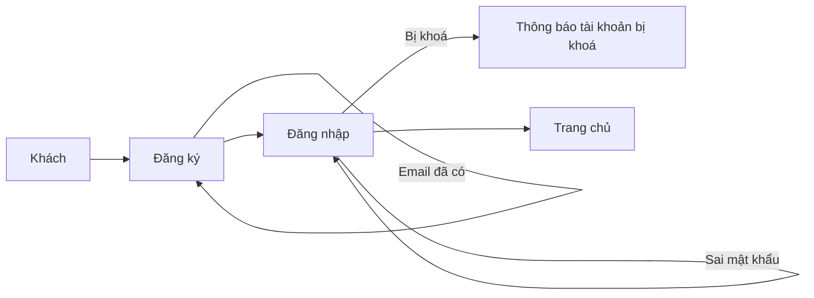
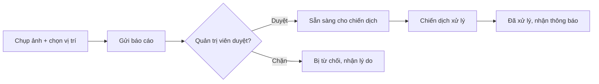
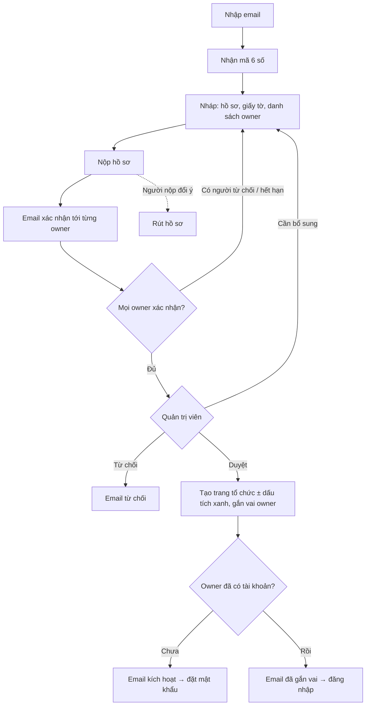
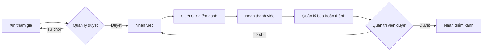
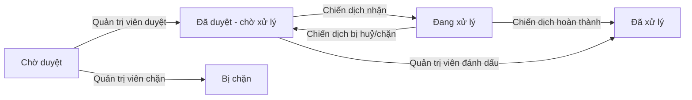
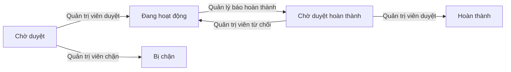
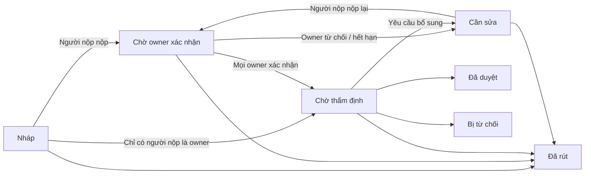

# Ecolink — Tổng quan nghiệp vụ

> Tài liệu dành cho PM, BA, khách hàng, nhà tài trợ và tình nguyện viên nòng cốt. Nội dung tổng hợp từ bộ tài liệu kỹ thuật trong thư mục `docs/`, và được viết dựa trên **đúng những gì sản phẩm đang làm** tại thời điểm 26/09/2026. Nó không mô tả những gì sản phẩm "dự định" làm.
> Những chỗ sản phẩm chưa làm xong, hoặc đang làm khác với mong đợi, được nêu rõ ở mục 3 (cột Trạng thái) và mục 10.

---

## 1. Giới thiệu sản phẩm

### Ecolink là gì?
Ecolink là nền tảng kết nối cộng đồng để **phát hiện và dọn dẹp các điểm rác, ô nhiễm**. Người dân chụp ảnh và báo cáo điểm rác. Các tổ chức (trường học, câu lạc bộ, NGO, cơ quan nhà nước…) mở **chiến dịch** dọn dẹp. Tình nguyện viên đăng ký tham gia. Khi chiến dịch hoàn thành, người tham gia nhận **điểm xanh** để đổi quà và leo bảng xếp hạng.

### Sản phẩm giải quyết vấn đề gì?
- Người dân thấy rác nhưng không biết báo cho ai. Ecolink cho phép gửi báo cáo kèm ảnh và vị trí chỉ trong vài bước, và có trợ lý AI hỗ trợ.
- Tổ chức muốn làm chiến dịch nhưng khó tìm địa điểm và khó huy động người. Ecolink cung cấp danh sách điểm rác đã được xác nhận, tự mời người dân sống gần khu vực, và hỗ trợ quản lý người tham gia, phân công việc, điểm danh.
- Cộng đồng khó phân biệt tổ chức uy tín. Ecolink thẩm định hồ sơ pháp lý của tổ chức và gắn **dấu tích xanh** cho tổ chức đã được xác minh.
- Tình nguyện viên thiếu động lực duy trì. Ecolink có điểm thưởng, quà tặng, bảng xếp hạng theo mùa và huy hiệu.

### Giá trị cho từng nhóm người dùng

| Nhóm | Giá trị |
|---|---|
| Người dân | Báo cáo điểm rác dễ dàng, nhận thông báo khi báo cáo được duyệt hoặc xử lý, được mời tham gia chiến dịch gần nhà, tích điểm đổi quà |
| Tình nguyện viên | Tìm chiến dịch, đăng ký tham gia, nhận việc, điểm danh, nhận điểm và thứ hạng |
| Tổ chức | Có trang tổ chức riêng, tạo và quản lý chiến dịch, có thành viên, có dấu tích xanh tạo uy tín |
| Quản trị viên | Kiểm duyệt báo cáo, chiến dịch và tổ chức; thẩm định hồ sơ; quản lý quà tặng và cấu hình điểm thưởng |
| Nhà tài trợ | Quà tặng được trưng bày trong cửa hàng đổi điểm |

---

## 2. Các nhóm người dùng

| Vai trò | Là ai | Muốn làm gì | Được làm | Không được làm |
|---|---|---|---|---|
| **Khách** | Người chưa đăng nhập | Tìm hiểu, đăng ký tài khoản, nộp hồ sơ tổ chức | Đăng ký, đăng nhập, xem danh sách quà và bảng xếp hạng, **nộp hồ sơ đăng ký tổ chức** (không cần tài khoản) | Xem báo cáo, chiến dịch, bản đồ (sẽ được yêu cầu đăng nhập) |
| **Người dùng** (người dân) | Người có tài khoản cá nhân | Báo cáo rác, theo dõi, bình chọn, tham gia | Gửi và sửa báo cáo của mình; bình chọn và lưu báo cáo hoặc chiến dịch; xin tham gia chiến dịch hoặc tổ chức; gửi yêu cầu khẩn cấp (SOS); chat với trợ lý AI; đổi quà; cài đặt thông báo | Duyệt nội dung; tạo chiến dịch (chỉ owner của tổ chức được tạo) |
| **Tình nguyện viên** | Người dùng đã được chấp nhận vào một chiến dịch | Làm việc trong chiến dịch và nhận điểm | Nhận việc được giao, cập nhật kết quả, điểm danh bằng mã QR, nhận điểm khi chiến dịch hoàn thành | Quản lý chiến dịch |
| **Owner tổ chức** (gồm người đại diện pháp lý) | Người dùng cá nhân được gắn vai owner sau khi hồ sơ được duyệt. Một tổ chức có thể có nhiều owner (tối đa 5 lúc đăng ký); một người làm owner tối đa 3 tổ chức. Tổ chức **không** có tài khoản đăng nhập riêng | Quản lý tổ chức và chiến dịch | Sửa thông tin tổ chức; duyệt người xin gia nhập; **tạo chiến dịch**; sửa và xoá chiến dịch do mình tạo | Tự tạo tổ chức mà không qua thẩm định; tự rời tổ chức (luồng rời / chuyển giao chưa có) |
| **Người quản lý chiến dịch** | Owner đã tạo chiến dịch và những người được thêm làm quản lý | Vận hành chiến dịch | Duyệt người tham gia, tạo và giao việc, tạo mã điểm danh, báo hoàn thành chiến dịch, thêm hoặc bớt người quản lý | Tự duyệt hoàn thành chiến dịch (cần quản trị viên) |
| **Thành viên tổ chức** | Người dùng được owner chấp nhận | Theo dõi hoạt động của tổ chức | Nhận thông báo khi tổ chức mở chiến dịch mới; rời tổ chức | Quản lý tổ chức |
| **Người nộp hồ sơ tổ chức** | Người lập hồ sơ, không cần tài khoản; bắt buộc là một trong các owner | Đăng ký tổ chức lên Ecolink | Xác thực email bằng mã, lưu nháp, khai danh sách owner, nộp hồ sơ và giấy tờ, gửi lại email xác nhận cho owner, theo dõi, sửa, rút hồ sơ qua đường link trong email | — |
| **Owner được mời** | Người được ghi tên làm owner trong một hồ sơ | Đồng ý hoặc từ chối | Mở link trong email (không cần đăng nhập), bấm **Xác nhận** hoặc **Tôi không liên quan**, có thể chặn email mình khỏi mọi lời mời sau này | Được gán vai khi chưa tự xác nhận |
| **Quản trị viên** | Nhân sự vận hành Ecolink | Kiểm duyệt và vận hành | Duyệt hoặc chặn báo cáo, chiến dịch, tổ chức, người dùng; thẩm định hồ sơ tổ chức và cấp dấu tích xanh; duyệt hoàn thành chiến dịch; quản lý quà và đơn đổi quà; cấu hình điểm, mùa, huy hiệu | Sửa báo cáo của người dân (bị cấm) |

> Chi tiết kỹ thuật: xem `docs/05-permissions.md`.

---

## 3. Tính năng theo nhóm

Trạng thái: ✅ đã có · 🟡 đang làm dở / có hạn chế · ❌ chưa có

### 3.1 Tài khoản
| Tính năng | Mô tả | Ai dùng | Trạng thái |
|---|---|---|---|
| Đăng ký, đăng nhập bằng email | Tạo tài khoản bằng email và mật khẩu. Không cần xác minh email | Khách | ✅ |
| Đăng nhập bằng Google | Đăng nhập bằng tài khoản Google | Khách | 🟡 Đang lỗi đường dẫn trên bản web (mục 10) |
| Quên mật khẩu | Yêu cầu đặt lại và đặt mật khẩu mới | Người dùng | 🟡 Hệ thống **không gửi email**; cách làm hiện tại không an toàn (mục 10) |
| Đổi mật khẩu | Đổi mật khẩu khi đang đăng nhập | Người dùng | 🟡 Hệ thống đã có, nhưng giao diện chưa có |
| Hồ sơ cá nhân | Ảnh đại diện, giới thiệu, số điện thoại, giới tính, ngày sinh, **vị trí nhà** (để được mời vào chiến dịch gần nhà) | Người dùng | ✅ |
| Cài đặt thông báo | Bật hoặc tắt 6 nhóm thông báo | Người dùng | ✅ |
| Đăng xuất | | Người dùng | 🟡 Trên web, đăng xuất chỉ xoá phiên trên trình duyệt, chưa báo được cho hệ thống |
| Chặn người dùng | Quản trị viên chặn tài khoản kèm lý do | Quản trị viên | 🟡 Chưa có chức năng gỡ chặn |

### 3.2 Tổ chức
| Tính năng | Mô tả | Ai dùng | Trạng thái |
|---|---|---|---|
| Trang tổ chức | Tên, logo, ảnh bìa, mô tả, email liên hệ, danh sách thành viên và chiến dịch; có đường dẫn riêng theo tên | Mọi người đăng nhập | ✅ |
| Cập nhật thông tin tổ chức | Owner sửa thông tin; đổi email liên hệ thì phải xác minh lại email đó | Owner | ✅ |
| Xác minh email liên hệ | Gửi đường link xác minh về email liên hệ | Owner | ✅ |
| Gia nhập tổ chức | Người dùng xin gia nhập, owner duyệt hoặc từ chối (mọi owner đều nhận thông báo); thành viên có thể rời | Người dùng, owner | ✅ |
| Nhiều owner | Trang tổ chức hiển thị danh sách owner và người đại diện pháp lý | Mọi người đăng nhập | ✅ Thêm owner sau khi tổ chức đã hoạt động, mời quản trị viên / quản lý chiến dịch, rời hoặc chuyển giao quyền owner: ❌ chưa có |
| Duyệt hoặc chặn tổ chức | Quản trị viên chặn tổ chức vi phạm, hoặc bỏ chặn | Quản trị viên | 🟡 Tổ chức bị chặn vẫn tạo được chiến dịch |

### 3.3 Xác minh và dấu tích xanh
| Tính năng | Mô tả | Ai dùng | Trạng thái |
|---|---|---|---|
| Nộp hồ sơ đăng ký tổ chức | Xác thực email bằng mã một lần, lưu nháp, khai thông tin, kênh chính thức (Facebook, website, Zalo OA), danh sách owner (tối đa 5, đúng một người đại diện pháp lý), tải lên tối đa 5 giấy tờ | Người nộp hồ sơ | ✅ |
| Owner xác nhận | Mỗi owner nhận email riêng và phải tự xác nhận trong 14 ngày; đủ xác nhận mới vào hàng chờ thẩm định | Owner được mời | ✅ |
| Theo dõi, sửa, rút hồ sơ | Qua đường link trong email, không cần tài khoản; thấy ai đã xác nhận, gửi lại email (tối đa 3 lần) | Người nộp hồ sơ | ✅ |
| Thẩm định hồ sơ | Quản trị viên nhận xử lý, xem giấy tờ (mỗi lần xem đều được ghi lại), yêu cầu bổ sung, duyệt hoặc từ chối | Quản trị viên | ✅ |
| Dấu tích xanh | Gắn khi duyệt hồ sơ. Mặc định có với luồng ưu tiên dành cho cơ quan nhà nước và trường học; luồng tiêu chuẩn thì quản trị viên tự quyết | Quản trị viên | 🟡 Đã hiển thị cho người dùng; chưa có tạm dừng, thu hồi hay xử lý hết hạn |
| Gắn vai owner khi duyệt | Duyệt hồ sơ xong, mỗi owner được gắn vai. Ai chưa có tài khoản được tạo tài khoản cá nhân và nhận email kích hoạt (72 giờ); ai đã có tài khoản nhận email "đã được gắn vai" | Hệ thống | ✅ Hết hạn email kích hoạt thì tự yêu cầu gửi lại từ trang đăng nhập |

### 3.4 Chiến dịch
| Tính năng | Mô tả | Ai dùng | Trạng thái |
|---|---|---|---|
| Tạo chiến dịch | Owner tạo chiến dịch cho tổ chức: tiêu đề, mô tả, ảnh bìa, thời gian, địa điểm, **mức độ khó** (quyết định số người tối đa và số điểm thưởng), gắn các điểm rác cần xử lý | Owner | ✅ |
| Sửa và xoá chiến dịch | | Người tạo chiến dịch | 🟡 Giao diện chưa có chỗ sửa; hệ thống cho phép tự đổi trạng thái (mục 10) |
| Duyệt chiến dịch | Quản trị viên duyệt, khi đó người dân quanh khu vực 5 km được mời tham gia; hoặc chặn | Quản trị viên | ✅ |
| Đăng ký tham gia | Tình nguyện viên xin tham gia; người quản lý duyệt, có giới hạn số người theo mức độ khó | Người dùng, quản lý | ✅ |
| Quản lý người quản lý | Thêm hoặc bớt người quản lý chiến dịch | Quản lý | ✅ |
| Công việc | Tạo việc, giao cho tình nguyện viên, cập nhật kết quả kèm ảnh hoặc video | Quản lý, tình nguyện viên | ✅ |
| Điểm danh QR | Quản lý hiển thị mã QR, tình nguyện viên quét để điểm danh | Quản lý, tình nguyện viên | ✅ |
| Yêu cầu khẩn cấp (SOS) | Gửi yêu cầu khẩn cấp tại chiến dịch đang diễn ra; hiện trên bản đồ | Người dùng | 🟡 Chưa có thông báo; ai cũng đánh dấu "đã giải quyết" được |
| Báo hoàn thành | Khi mọi việc xong, quản lý báo hoàn thành; người dân quanh khu vực được mời xác nhận khu vực "đã sạch" | Quản lý, người dân | ✅ |
| Duyệt hoàn thành và trao điểm | Quản trị viên duyệt, tình nguyện viên **đã điểm danh** nhận điểm; hoặc từ chối để chiến dịch tiếp tục | Quản trị viên | ✅ |
| Nộp kết quả (submission) | Quản lý nộp bộ kết quả và duyệt nội bộ | Quản lý | 🟡 Chưa gắn với luồng hoàn thành, hiện không có tác dụng |
| Vinh danh trên Facebook | Tự đăng bài cảm ơn tình nguyện viên lên Facebook | Hệ thống | ❌ Đã viết nhưng đang tắt |

### 3.5 Báo cáo sự cố (điểm rác)
| Tính năng | Mô tả | Ai dùng | Trạng thái |
|---|---|---|---|
| Gửi báo cáo | 1–10 ảnh, vị trí trên bản đồ, mức độ nghiêm trọng, mô tả | Người dùng | ✅ |
| AI phân tích ảnh | Tự nhận diện rác trong ảnh và gợi ý cách xử lý (nên mang gì, cảnh báo an toàn, cách phân loại) | Hệ thống | ✅ |
| Tìm kiếm và bản đồ | Tìm theo trạng thái, mức độ, khoảng cách; bản đồ hiển thị báo cáo, chiến dịch và SOS | Người dùng | ✅ |
| Sửa, thêm ảnh, xoá báo cáo | Chỉ người gửi | Người dùng | 🟡 Thêm ảnh vào báo cáo đã duyệt làm báo cáo bị kẹt |
| Kiểm duyệt | Quản trị viên duyệt hoặc chặn báo cáo, hoặc đánh dấu "đã xử lý" | Quản trị viên | ✅ |
| Bình chọn và lưu | Bình chọn lên hoặc xuống, lưu để xem lại | Người dùng | ✅ |
| Báo cáo qua trợ lý AI | Chat, gửi ảnh, trợ lý tự tạo báo cáo | Người dùng | 🟡 Báo cáo tạo qua chat **không có vị trí thật** |

### 3.6 Điểm thưởng, quà tặng, xếp hạng
| Tính năng | Mô tả | Ai dùng | Trạng thái |
|---|---|---|---|
| Điểm xanh | Nhận khi chiến dịch hoàn thành, khi báo cáo được xử lý, khi báo cáo đạt mốc bình chọn | Người dùng | ✅ |
| Điểm tiêu dùng có hạn | Mỗi điểm xanh nhận được sinh ra một lượng điểm tiêu dùng tương đương, **hết hạn sau 90 ngày**, dùng để đổi quà | Người dùng | ✅ |
| Cửa hàng quà | Xem quà, đổi quà (nhập số điện thoại và nơi nhận) | Người dùng | ✅ |
| Quản lý đơn đổi quà | Chuyển trạng thái đang xử lý → đã gửi → đã giao, hoặc huỷ (có hoàn điểm) | Quản trị viên | 🟡 Đang thiếu kiểm tra quyền (mục 10); không báo cho người đổi |
| Lịch sử điểm | Xem điểm và lịch sử cộng trừ | Người dùng | ✅ |
| Mùa giải và bảng xếp hạng | Điểm xếp hạng công dân (từ báo cáo) và tình nguyện viên (từ chiến dịch) theo mùa; cuối mùa thưởng thêm điểm tiêu dùng theo thứ hạng | Người dùng, quản trị viên | 🟡 Hệ thống đã có, giao diện người dùng chưa có |
| Huy hiệu | Quản trị viên định nghĩa huy hiệu kèm điều kiện đạt và ưu đãi giảm giá | Quản trị viên | 🟡 Định nghĩa được, nhưng **chưa có ai được trao** |

### 3.7 Thông báo
| Tính năng | Mô tả | Trạng thái |
|---|---|---|
| Thông báo trong ứng dụng | Chuông thông báo, tự làm mới mỗi 20 giây, đánh dấu đã đọc | ✅ |
| Email | Mã xác thực, xác nhận hồ sơ, lời mời xác nhận owner, owner từ chối / hết hạn, hồ sơ bị rút, yêu cầu bổ sung, từ chối, kích hoạt tài khoản, "đã được gắn làm owner", xác minh email liên hệ | ✅ |
| Tuỳ chọn nhận thông báo | 6 nhóm có thể tắt; các thông báo quan trọng luôn được gửi | ✅ |
| Đánh dấu tất cả đã đọc | | ❌ |

### 3.8 Đa ngôn ngữ
| Tính năng | Mô tả | Trạng thái |
|---|---|---|
| Giao diện Việt và Anh | Chọn ngôn ngữ hiển thị | ✅ |
| Tự dịch nội dung | Báo cáo, mô tả tổ chức, chiến dịch (chỉ khi tạo), quà tặng được AI tự dịch sang tiếng Việt và tiếng Anh | 🟡 Sửa chiến dịch thì không dịch lại; dịch lỗi thì giữ nguyên bản gốc |

### 3.9 Trợ lý AI
| Tính năng | Mô tả | Trạng thái |
|---|---|---|
| Chat hỗ trợ | Hỏi đáp, gửi ảnh, nhờ tạo báo cáo | 🟡 Tạo tổ chức qua chat luôn thất bại; báo cáo qua chat không có vị trí thật |

---

## 4. Hành trình người dùng

### 4.1 Đăng ký và đăng nhập
1. Khách vào trang Đăng ký, nhập tên, email, mật khẩu, và đồng ý điều khoản.
2. Hệ thống tạo tài khoản ngay, không cần xác minh email. Người dùng chuyển sang Đăng nhập.
3. Đăng nhập bằng email và mật khẩu, hoặc bằng Google.

Các trường hợp thường gặp:
- Email đã được dùng: thông báo "email đã tồn tại".
- Mật khẩu ngắn: giao diện cho phép 6 ký tự, nhưng hệ thống yêu cầu ít nhất 8 khi đăng ký, nên người dùng có thể gặp lỗi khó hiểu.
- Tài khoản bị chặn: thông báo "tài khoản đã bị khoá".
- Tài khoản chưa kích hoạt (tạo cho owner được duyệt): thông báo cần dùng link kích hoạt, kèm nút **Gửi lại email kích hoạt**.
- Phiên đăng nhập hết hạn: hệ thống thử làm mới phiên; không được thì đưa về trang đăng nhập.

### 4.2 Báo cáo điểm rác
1. Người dùng bấm "Báo cáo", chọn ảnh (tối đa 10), chọn vị trí trên bản đồ, chọn mức độ nghiêm trọng, nhập tiêu đề và mô tả.
2. Báo cáo được ghi nhận ở trạng thái **chờ duyệt**. AI phân tích ảnh ở chế độ nền và đưa ra gợi ý xử lý.
3. Quản trị viên duyệt báo cáo, người gửi nhận thông báo **đã được duyệt**. Báo cáo lúc này có thể được một chiến dịch nhận xử lý.
4. Khi chiến dịch chứa báo cáo hoàn thành, hoặc quản trị viên đánh dấu đã xử lý, báo cáo chuyển sang **đã xử lý** và người gửi được thông báo.

Các trường hợp thường gặp:
- Báo cáo bị từ chối (chặn): người gửi nhận thông báo kèm lý do; báo cáo không còn xem được và không sửa được.
- Thêm ảnh sau khi đã được duyệt: báo cáo quay về "chờ duyệt" và hiện có thể bị kẹt ở trạng thái đó (mục 10).

### 4.3 Đăng ký tổ chức và nhận dấu tích xanh
> Thiết kế đầy đủ, kèm lý do từng lựa chọn: `docs/ORG_OWNERSHIP_FLOW.md`. Điểm khác lớn nhất so với trước: **tổ chức không có tài khoản đăng nhập riêng**. Người quản lý tổ chức là các **owner** — người dùng cá nhân — và mỗi owner phải tự xác nhận trước khi quản trị viên được thẩm định.

1. Người lập hồ sơ vào "Đăng ký tổ chức" và nhập **email của chính mình**. Hệ thống gửi **mã xác thực một lần** gồm 6 số, hiệu lực 10 phút.
2. Nhập mã. Hệ thống mở một **bản nháp** và gửi **đường link theo dõi** (hiệu lực 180 ngày), nên có thể lưu nháp và quay lại sau. Nếu email này đã có hồ sơ đang mở thì mở lại hồ sơ đó.
3. Điền hồ sơ: loại tổ chức, tên, logo, mô tả, địa chỉ, email liên hệ, ít nhất 1 kênh chính thức, **danh sách owner** (1–5 người: email, họ tên; đúng một người là **người đại diện pháp lý**, kèm số điện thoại và giấy tờ tuỳ thân), tối đa 5 giấy tờ (PDF hoặc ảnh, mỗi file ≤ 10MB), và đồng ý xử lý dữ liệu cá nhân. Người lập hồ sơ bắt buộc có tên trong danh sách owner.
4. Nộp hồ sơ. Hệ thống kiểm tra ngay (trước khi gửi bất kỳ email nào): tài khoản bị đình chỉ, người đã làm owner 3 tổ chức, email đang có tên ở quá nhiều hồ sơ khác, email đã chặn lời mời. Người lập hồ sơ được tính là đã xác nhận.
5. **Mỗi owner khác nhận một email riêng** tóm tắt hồ sơ (tổ chức, người nộp, các owner khác, vai của họ) với hai nút **Xác nhận** và **Tôi không liên quan**. Không cần đăng nhập. Hạn 14 ngày; người lập hồ sơ gửi lại được tối đa 3 lần, cách nhau 1 giờ.
   - Có người bấm "Tôi không liên quan" hoặc hết hạn: hồ sơ quay về **cần sửa**, người lập hồ sơ nhận email, thay người rồi nộp lại.
   - Đủ xác nhận: hồ sơ vào **hàng chờ thẩm định**. Trước thời điểm này quản trị viên không nhìn thấy hồ sơ.
6. Quản trị viên thẩm định, xem cả **con người** (giờ và IP xác nhận, đã có tài khoản chưa, đang làm owner mấy tổ chức). Có 3 khả năng:
   - **Yêu cầu bổ sung:** người nộp nhận email, sửa qua link, rồi nộp lại.
   - **Từ chối:** người nộp nhận email kèm lý do.
   - **Duyệt:** trang tổ chức được tạo, quản trị viên chọn có gắn **dấu tích xanh** hay không, và từng owner được gắn vai.
7. Owner chưa có tài khoản Ecolink nhận email **kích hoạt** (72 giờ) để đặt mật khẩu; owner đã có tài khoản nhận email "tài khoản của bạn vừa được gắn làm owner" và đăng nhập như bình thường.

Các trường hợp thường gặp:
- Xin mã quá nhiều lần (quá 3 lần mỗi giờ): phải chờ.
- Nhập sai mã 5 lần: phải xin mã mới.
- Email này đã có một hồ sơ đang mở: mở lại hồ sơ đó thay vì tạo hồ sơ mới.
- Một owner đã làm owner 3 tổ chức: không nộp được (kiểm tra lại lúc duyệt).
- Một email đã có tên ở 2 hồ sơ khác đang xử lý: không ghi tên thêm được (chống spam).
- Owner đã có tài khoản Ecolink: **được phép**, không cần xử lý thủ công.
- Sửa tên, loại tổ chức, người đại diện pháp lý hoặc danh sách owner sau khi đã có người xác nhận: mọi xác nhận bị đặt lại, tất cả phải xác nhận lại. Sửa mô tả, logo, giấy tờ, kênh thì giữ nguyên.
- Email kích hoạt hết hạn: tự bấm "Gửi lại email kích hoạt" ở trang đăng nhập.
- Người nộp có thể **rút hồ sơ** bất cứ lúc nào trước khi có quyết định, kể cả khi đang là nháp hoặc đang chờ owner xác nhận. Các owner đã xác nhận được báo qua email.

### 4.4 Tổ chức mở chiến dịch
1. Owner của tổ chức vào "Tạo chiến dịch", chọn tổ chức, nhập thông tin, chọn mức độ khó và chọn các điểm rác đã được duyệt cần xử lý.
2. Chiến dịch được tạo ở trạng thái **chờ duyệt**. Thành viên tổ chức nhận thông báo "tổ chức có chiến dịch mới".
3. Quản trị viên duyệt, chiến dịch **đang hoạt động**, và người dân trong bán kính 5 km được mời tham gia.

Các trường hợp thường gặp:
- Người tạo không phải owner của tổ chức: bị từ chối.
- Điểm rác đã thuộc chiến dịch khác hoặc chưa được duyệt: không chọn được.
- Chiến dịch bị chặn: các điểm rác được trả về danh sách chờ để chiến dịch khác nhận. Tổ chức **không nhận thông báo** về việc bị chặn.

### 4.5 Tình nguyện viên tham gia chiến dịch
1. Tình nguyện viên mở chiến dịch và bấm "Tham gia". Người quản lý nhận thông báo.
2. Người quản lý duyệt, tình nguyện viên nhận thông báo "được chấp nhận". Nếu chiến dịch đã đủ người theo mức độ khó thì không duyệt được.
3. Tình nguyện viên được giao việc và cập nhật kết quả (ảnh hoặc video).
4. Ngày diễn ra, người quản lý mở **mã QR**, tình nguyện viên quét để điểm danh. Chỉ người **đã điểm danh** mới được nhận điểm.
5. Xong mọi việc, người quản lý báo hoàn thành. Quản trị viên được báo; người dân gần đó được mời xác nhận khu vực đã sạch.
6. Quản trị viên duyệt hoàn thành:
   - Chiến dịch **hoàn thành**, các điểm rác chuyển sang **đã xử lý**.
   - Tình nguyện viên đã điểm danh nhận điểm xanh theo mức độ khó.
   - Mọi tình nguyện viên nhận thông báo "chiến dịch hoàn thành".
   - Nếu quản trị viên từ chối, chiến dịch tiếp tục hoạt động và các owner của tổ chức nhận lý do.

Các trường hợp thường gặp:
- Bị từ chối tham gia: người xin nhận thông báo và có thể xin lại.
- Tự huỷ yêu cầu: được khi yêu cầu còn đang chờ.
- Đã được chấp nhận: hiện **không có cách rời** chiến dịch.
- Mã QR sai chiến dịch hoặc hết hạn (sau 1 giờ): không điểm danh được.

### 4.6 Đổi quà
1. Người dùng vào "Quà tặng", chọn quà, nhập số điện thoại và nơi nhận.
2. Hệ thống kiểm tra còn hàng và **điểm tiêu dùng còn hạn** đủ để đổi, rồi trừ điểm (điểm sắp hết hạn được trừ trước) và tạo đơn **đang xử lý**.
3. Quản trị viên cập nhật đơn thành **đã gửi**, rồi **đã giao**. Nếu huỷ, điểm được hoàn lại.

Các trường hợp thường gặp:
- Hết hàng: thông báo "hết quà".
- Không đủ điểm: thông báo "không đủ điểm". Điểm đã hết hạn không dùng được.
- Người đổi **không nhận thông báo** khi đơn thay đổi trạng thái; phải tự vào xem ở mục Đơn hàng.

### 4.7 Yêu cầu khẩn cấp (SOS)
1. Tại một chiến dịch đang diễn ra, người dùng gửi SOS kèm nội dung và số điện thoại.
2. SOS hiện trên bản đồ tại vị trí chiến dịch (bản đồ tự làm mới mỗi 10 giây).
3. Người hỗ trợ đánh dấu "đã giải quyết". Khi chiến dịch hoàn thành, mọi SOS của chiến dịch cũng tự đóng.

Các trường hợp thường gặp:
- Chiến dịch chưa hoạt động hoặc không có vị trí: không gửi được SOS.
- Hiện **không có thông báo** nào gửi đi khi có SOS.

### 4.8 Chat với trợ lý AI
1. Người dùng mở khung chat, gõ câu hỏi, có thể đính kèm ảnh (tối đa 8).
2. Trợ lý trả lời dần theo thời gian thực. Nếu người dùng nhờ báo cáo rác, trợ lý tự đề xuất tiêu đề và mô tả, chỉ hỏi mức độ nghiêm trọng, rồi tạo báo cáo.

Các trường hợp thường gặp:
- Báo cáo tạo qua chat hiện không có vị trí thật.
- Nhờ tạo tổ chức qua chat luôn thất bại.

> Chi tiết kỹ thuật: xem `docs/02-business-flows.md`.

---

## 5. Quy định nghiệp vụ

Mã BR-xxx dùng để đối chiếu với `docs/03-business-rules.md`.

### 5.1 Tài khoản
- **BR-001, BR-002:** Đăng ký cần email hợp lệ, tên và mật khẩu ít nhất 8 ký tự. Mỗi email chỉ đăng ký được một tài khoản.
- **BR-003:** Người đăng ký mới là người dùng thường. *(Hiện hệ thống cho phép tự chọn vai trò khi đăng ký, xem mục 10.)*
- **BR-004, BR-005:** Sai email hoặc mật khẩu thì không đăng nhập được. Tài khoản bị khoá, và tài khoản chưa kích hoạt, cũng không đăng nhập được, kể cả qua Google.
- **BR-006, BR-007, BR-008, BR-012:** Phiên đăng nhập có thời hạn và được tự làm mới. Đăng xuất, đổi mật khẩu hoặc bị khoá sẽ chấm dứt khả năng làm mới phiên, nhưng phiên đang dùng vẫn còn hiệu lực đến khi hết hạn.
- **BR-009:** Đổi mật khẩu cần nhập đúng mật khẩu cũ.
- **BR-010:** Đường link đặt lại mật khẩu dùng một lần và hết hạn sau 1 giờ.
- **BR-011, BR-016:** Link kích hoạt tài khoản (cho owner chưa có tài khoản) dùng một lần và hết hạn sau 72 giờ; mật khẩu ít nhất 8 ký tự. Người dùng tự yêu cầu gửi lại được từ trang đăng nhập (tối đa 3 lần mỗi giờ).
- **BR-013:** Đăng nhập Google lần đầu sẽ tự tạo tài khoản.
- **BR-014, BR-015:** Chỉ quản trị viên làm được các việc quản trị. Các hệ thống bên trong Ecolink trao đổi với nhau bằng khoá bí mật riêng.
- **BR-020, BR-021, BR-022:** Hồ sơ cá nhân: số điện thoại 7–20 ký tự; ngày sinh theo dạng năm-tháng-ngày; vị trí nhà phải có đủ cả vĩ độ và kinh độ, xoá vị trí thì địa chỉ cũng bị xoá theo.
- **BR-023:** Tuỳ chọn thông báo được lưu theo từng nhóm, nhóm nào không chỉnh thì giữ nguyên.
- **BR-024:** Vị trí nhà chỉ chính người đó nhìn thấy.
- **BR-025, BR-026, BR-027:** Quản trị viên khoá tài khoản phải ghi lý do, và không được tự khoá chính mình. Khoá lại người đã bị khoá chỉ cập nhật lý do. Chưa có chức năng mở khoá.
- **BR-028:** Tên vai trò không được trùng.
- **BR-029:** Khi duyệt hồ sơ, owner đã có tài khoản thì dùng tài khoản đó; owner chưa có thì được tạo một tài khoản cá nhân chờ kích hoạt. Không còn tài khoản riêng cho tổ chức.
- **BR-030, BR-091:** Link xác minh email liên hệ tổ chức hiệu lực 72 giờ, dùng một lần; gửi link mới thì link cũ mất hiệu lực. Email trong link phải trùng email liên hệ hiện tại.
- **BR-031:** "Người dân ở gần" là người có vị trí nhà trong bán kính 5 km (mặc định).
- **BR-032, BR-033:** Hệ thống chỉ lấy thông tin tối đa 100 người mỗi lần và tôn trọng tuỳ chọn tắt thông báo của từng người.

### 5.2 Hồ sơ đăng ký tổ chức
- **BR-050, BR-051, BR-052:** Mỗi email xin mã tối đa 3 lần mỗi giờ; mỗi mạng internet tối đa 10 lần mỗi giờ. Các thao tác khác trên form hồ sơ tối đa 60 lần mỗi giờ. Trên hệ thống thật không tắt được giới hạn này.
- **BR-053, BR-054:** Mã xác thực gồm 6 số, hiệu lực 10 phút; nhập sai quá 5 lần phải xin mã mới. Nhập đúng thì hệ thống mở bản nháp và gửi link theo dõi — không còn giới hạn 30 phút.
- **BR-055, BR-066:** Mọi thao tác sau đó (lưu, nộp, tải giấy tờ, gửi lại lời mời, rút) dùng link theo dõi (180 ngày).
- **BR-056:** Giấy tờ phải là PDF, JPG hoặc PNG, mỗi file tối đa 10MB, mỗi hồ sơ tối đa 5 file. Loại giấy tờ gồm: quyết định thành lập, giấy phép kinh doanh, giấy tờ tuỳ thân người đại diện, khác.
- **BR-057:** Bắt buộc đồng ý cho xử lý dữ liệu cá nhân trước khi nộp.
- **BR-058:** Loại tổ chức phải là: cơ quan nhà nước, trường học, câu lạc bộ, NGO, hoặc doanh nghiệp xã hội.
- **BR-059:** Phải có tên và logo. Email liên hệ của tổ chức mặc định là email người nộp; dùng email khác thì tổ chức chưa được coi là đã xác minh email.
- **BR-060:** Phải có ít nhất một kênh chính thức (trang Facebook, website, Zalo OA) với địa chỉ web hợp lệ.
- **BR-061:** Mỗi email chỉ có **một hồ sơ đang mở**; xác thực lại thì mở lại hồ sơ đó.
- **BR-063:** Với người đại diện pháp lý, hệ thống **không lưu số giấy tờ đầy đủ**, chỉ lưu dạng mã hoá cùng 4 số cuối.
- **BR-064:** Giấy tờ đính kèm phải do chính email người nộp tải lên.
- **BR-065:** Mỗi hồ sơ có một mã riêng dạng ORG-XXXXXXXX.
- **BR-067:** Chỉ sửa hồ sơ khi đang là nháp, hoặc đã bị trả về để sửa.
- **BR-068:** Rút được bất cứ lúc nào trước khi có quyết định; không rút được hồ sơ đã có quyết định.
- **BR-069:** Danh sách owner: 1–5 người, không trùng email, người nộp phải có tên, đúng một người đại diện pháp lý.

### 5.2b Owner xác nhận
- **BR-300:** Owner bị đình chỉ, hoặc đã làm owner **3 tổ chức**, thì không nộp được — kiểm tra ngay lúc nộp, trước khi gửi email.
- **BR-301:** Một email không được có tên ở quá 2 hồ sơ khác đang xử lý (chống dội email).
- **BR-302, BR-309:** Owner bấm "Tôi không liên quan" có thể chặn email mình khỏi mọi lời mời sau này.
- **BR-303:** Owner đã từ chối phải được gỡ hoặc thay trước khi nộp lại.
- **BR-304:** Người nộp được tính là đã xác nhận.
- **BR-305, BR-310:** Mỗi owner có 14 ngày để xác nhận; quá hạn thì hồ sơ trả về người nộp.
- **BR-306:** Đổi tên, loại tổ chức, người đại diện pháp lý hoặc danh sách owner sau khi đã có người xác nhận thì mọi người phải xác nhận lại.
- **BR-307:** Gửi lại email xác nhận tối đa 3 lần cho mỗi owner, cách nhau ít nhất 1 giờ.
- **BR-308:** Xác nhận không cần đăng nhập; hệ thống ghi lại thời điểm, IP và trình duyệt làm bằng chứng. Đủ xác nhận thì hồ sơ tự vào hàng chờ thẩm định.

### 5.3 Thẩm định và dấu tích xanh
- **BR-070:** Một hồ sơ chỉ do một quản trị viên nhận xử lý tại một thời điểm (không bắt buộc nhận trước khi quyết định).
- **BR-071:** Quản trị viên chỉ thấy hồ sơ khi mọi owner đã xác nhận; chỉ thao tác được hồ sơ đang chờ thẩm định.
- **BR-072:** Yêu cầu bổ sung phải có nội dung.
- **BR-073:** Từ chối phải có lý do.
- **BR-074:** Khi duyệt, quản trị viên phải chọn **luồng ưu tiên** (cơ quan nhà nước hoặc trường học có tên miền chính thức) hoặc **luồng tiêu chuẩn**.
- **BR-075:** Hồ sơ không có giấy tờ chỉ được duyệt khi quản trị viên chủ động miễn giấy tờ và ghi lý do.
- **BR-076:** Hồ sơ phải có tên và logo mới được duyệt.
- **BR-077:** Dấu tích xanh mặc định được gắn cho luồng ưu tiên; luồng tiêu chuẩn thì quản trị viên tự quyết. Xác minh theo luồng tiêu chuẩn có hạn 1 năm.
- **BR-078:** Mỗi lần mở giấy tờ đều được ghi lại. Đường tải giấy tờ chỉ có hiệu lực 5 phút.
- **BR-079, BR-312:** Duyệt xong, mỗi owner được gắn vai (kiểm tra lại trần 3 tổ chức); owner chưa có tài khoản nhận email kích hoạt, owner đã có tài khoản nhận email "đã được gắn vai" — không bao giờ nhận link đổi mật khẩu.
- **BR-315:** Mỗi tổ chức luôn phải còn ít nhất một owner.

### 5.4 Tổ chức
- **BR-080:** Tổ chức chỉ được tạo qua thẩm định hồ sơ, hoặc bởi hệ thống nội bộ.
- **BR-081:** Không có hai tổ chức đang hoạt động trùng cả tên lẫn email liên hệ.
- **BR-082:** Đường dẫn trang tổ chức sinh từ tên (bỏ dấu); trùng thì thêm số, và không đổi khi đổi tên.
- **BR-083:** Chỉ owner sửa được thông tin. Đổi email liên hệ thì phải xác minh lại email mới.
- **BR-084:** Quản trị viên chặn tổ chức phải ghi lý do.
- **BR-085:** Owner và người đã là thành viên không được xin gia nhập; mỗi người chỉ có một yêu cầu đang chờ.
- **BR-086:** Owner nào của tổ chức cũng duyệt được yêu cầu gia nhập.
- **BR-087:** Người xin chỉ huỷ được yêu cầu khi còn đang chờ.
- **BR-088:** Owner không được rời tổ chức (chưa có luồng rời hoặc chuyển giao).
- **BR-089:** Tổ chức bị chặn không xem được qua đường dẫn trang.
- **BR-090:** Chỉ gửi lại email xác minh khi email liên hệ chưa được xác minh.

### 5.5 Báo cáo sự cố
- **BR-100:** Báo cáo cần tiêu đề, vị trí, mức độ nghiêm trọng từ 1 đến 5, và ít nhất 1 ảnh.
- **BR-101:** Báo cáo mới luôn ở trạng thái chờ duyệt và được AI phân tích tự động.
- **BR-102:** Tìm theo khoảng cách mặc định trong bán kính 50 km.
- **BR-103:** Báo cáo bị chặn không xem được.
- **BR-104:** Chỉ người gửi sửa hoặc xoá được báo cáo. Quản trị viên không được sửa. Báo cáo bị chặn không sửa được.
- **BR-105:** Thêm ảnh thì báo cáo quay về chờ duyệt và được phân tích lại.
- **BR-106, BR-107:** Quản trị viên duyệt báo cáo; chặn báo cáo phải có lý do.
- **BR-108:** Báo cáo được đánh dấu đã xử lý thì người gửi có thể được cộng điểm (số điểm do cấu hình vận hành, hiện mặc định là 0).
- **BR-109:** Ảnh của báo cáo chưa duyệt chỉ người gửi xem được.
- **BR-110:** Chỉ báo cáo đã duyệt và chưa thuộc chiến dịch nào mới được gắn vào chiến dịch. Mỗi báo cáo chỉ thuộc một chiến dịch.
- **BR-111:** Tiêu đề và mô tả ưu tiên hiển thị bản tiếng Việt.
- **BR-112:** AI cần ít nhất một ảnh hợp lệ để phân tích.

### 5.6 Bình chọn và lưu
- **BR-130:** Mỗi người có một lượt bình chọn cho mỗi báo cáo hoặc chiến dịch; bấm lại thì huỷ.
- **BR-131:** Chỉ bình chọn và lưu được báo cáo hoặc chiến dịch còn tồn tại.
- **BR-132:** Báo cáo đạt các mốc bình chọn thì người gửi được thưởng điểm.
- **BR-133:** Bấm "Lưu" lần nữa thì bỏ lưu.

### 5.7 Chiến dịch
- **BR-150:** Chiến dịch cần tiêu đề và mức độ khó; vị trí và thời gian là tuỳ chọn.
- **BR-151:** Chỉ **owner** (kể cả người đại diện pháp lý) tạo được chiến dịch cho tổ chức mình.
- **BR-152:** Mức độ khó phải thuộc danh sách mức độ do quản trị viên cấu hình.
- **BR-153:** Chiến dịch mới chờ quản trị viên duyệt; người tạo tự động là người quản lý.
- **BR-154:** Chỉ người tạo sửa hoặc xoá được chiến dịch. Xoá thì các điểm rác được trả lại danh sách chờ.
- **BR-160:** Quản trị viên duyệt hoặc chặn chiến dịch; chặn phải có lý do.
- **BR-161:** Khi được duyệt, người dân trong 5 km quanh chiến dịch được mời tham gia.
- **BR-162:** Chiến dịch bị chặn thì các điểm rác được trả lại danh sách chờ.
- **BR-165:** Chỉ báo hoàn thành được khi **mọi công việc đã xong**.
- **BR-166:** Quản trị viên chỉ duyệt hoặc từ chối khi chiến dịch đang chờ duyệt hoàn thành; từ chối phải có lý do.
- **BR-167:** Điểm thưởng theo mức độ khó, chỉ dành cho tình nguyện viên **đã được chấp nhận và đã điểm danh**.
- **BR-168:** Chiến dịch hoàn thành thì các điểm rác và SOS liên quan cũng hoàn thành; bị từ chối thì chiến dịch tiếp tục hoạt động.
- **BR-170:** Mỗi người chỉ có một yêu cầu tham gia cho mỗi chiến dịch.
- **BR-171:** Chỉ người quản lý xử lý yêu cầu tham gia.
- **BR-172:** Số tình nguyện viên được chấp nhận không vượt quá giới hạn của mức độ khó.
- **BR-173:** Người bị từ chối có thể xin lại.
- **BR-174:** Người xin chỉ huỷ được khi yêu cầu còn đang chờ.
- **BR-175:** Người tạo và người quản lý quản lý được công việc, người quản lý khác và mã điểm danh.
- **BR-176:** Công việc có 3 mức ưu tiên; mặc định là trung bình.
- **BR-177:** Chỉ giao việc cho tình nguyện viên đã được chấp nhận.
- **BR-178, BR-179:** Tình nguyện viên chỉ cập nhật kết quả và trạng thái của việc được giao cho mình.
- **BR-180, BR-181:** Mã QR điểm danh chỉ tạo được khi chiến dịch đang hoạt động, hiệu lực 1 giờ; mỗi người chỉ điểm danh một lần; chỉ tình nguyện viên đã được chấp nhận mới điểm danh được.
- **BR-182:** Người dân chỉ xác nhận "đã sạch" hoặc "chưa sạch" sau khi chiến dịch báo hoàn thành.
- **BR-183:** Chỉ người quản lý nộp và duyệt bộ kết quả.
- **BR-184:** Danh sách hiển thị tối đa 100 mục mỗi trang.

### 5.8 Yêu cầu khẩn cấp
- **BR-190, BR-191:** SOS chỉ gửi được tại chiến dịch đang hoạt động và có vị trí; cần nội dung (tối đa 2000 ký tự) và số điện thoại hợp lệ; vị trí SOS lấy theo vị trí chiến dịch.
- **BR-192:** SOS đã giải quyết thì không cần xử lý thêm.

### 5.9 Thông báo
- **BR-200:** Mỗi thông báo trong ứng dụng gửi cho đúng một người; email về hồ sơ tổ chức gửi thẳng tới địa chỉ email người nộp.
- **BR-201:** Người dùng tắt nhóm thông báo nào thì không nhận nhóm đó. Thông báo quan trọng (hồ sơ tổ chức, kết quả kiểm duyệt, bảo mật) luôn được gửi.
- **BR-202:** Email gửi theo ngôn ngữ của người nhận; thông báo trong ứng dụng có cả hai ngôn ngữ.
- **BR-203:** Nếu chưa cấu hình máy chủ gửi thư thì email không được gửi, nhưng hệ thống vẫn ghi nhận.
- **BR-204:** Gửi thất bại sẽ được thử lại tối đa 5 lần.
- **BR-205, BR-206:** Người dùng chỉ thấy và chỉ đánh dấu đã đọc được thông báo của mình.

### 5.10 Quà tặng
- **BR-220:** Người dùng chỉ thấy quà đang được mở bán.
- **BR-221:** Quà cần tên, ảnh, mô tả, số điểm; tồn kho có thể không giới hạn.
- **BR-222:** Đổi quà cần số điện thoại (7–32 ký tự) và nơi nhận.
- **BR-223:** Quà phải còn mở bán và còn hàng.
- **BR-224:** Giá quà có thể được giảm theo huy hiệu người dùng đang có (hiện chưa có ai có huy hiệu).
- **BR-225:** Phải đủ điểm tiêu dùng **còn hạn**; điểm sắp hết hạn được trừ trước.
- **BR-230:** Đơn đi theo thứ tự: đang xử lý → đã gửi → đã giao, và có thể huỷ trước khi giao.
- **BR-231:** Huỷ đơn thì hoàn điểm (với hạn dùng mới), nhưng không hoàn tồn kho.
- **BR-232:** Mức độ khó gồm tên, số tình nguyện viên tối đa và số điểm thưởng.

### 5.11 Điểm và xếp hạng
- **BR-240:** Mỗi hoạt động chỉ được cộng điểm một lần.
- **BR-241:** Mỗi điểm xanh nhận được sinh ra một lượng điểm tiêu dùng tương đương, hết hạn sau 90 ngày (cấu hình được).
- **BR-242:** Điểm từ chiến dịch tính vào xếp hạng **tình nguyện viên**; điểm từ báo cáo và bình chọn tính vào xếp hạng **công dân**. Điểm xếp hạng tính theo mùa.
- **BR-243:** "Mùa hiện tại" là mùa đang mở trong khoảng thời gian hiện tại.
- **BR-244:** Thưởng mốc bình chọn tăng dần: mốc càng cao thì thưởng càng nhiều.
- **BR-245:** Dữ liệu cộng điểm không hợp lệ sẽ bị từ chối.
- **BR-246:** Bảng xếp hạng chỉ tính người có điểm dương; mùa đã đóng thì hiển thị bảng chốt cuối mùa.
- **BR-247:** Mùa có loại theo tháng hoặc theo quý.
- **BR-248, BR-249:** Kết thúc mùa: chốt bảng xếp hạng, thưởng điểm tiêu dùng cho các thứ hạng đã cấu hình, và có thể mở mùa mới ngay. Không mở được mùa mới khi đang có mùa khác mở.
- **BR-250:** Thưởng cuối mùa cấu hình theo khoảng thứ hạng.
- **BR-251, BR-252:** Huy hiệu có nhóm (báo cáo, chiến dịch, đóng góp, thứ hạng), điều kiện đạt, và ưu đãi giảm giá tối đa 100%. Huy hiệu đã trao thì không đổi được nhóm.
- **BR-253:** Quản trị viên cấu hình điểm cơ bản, các mốc bình chọn và hạn dùng điểm.
- **BR-254:** Người dùng xem được ước tính điểm thưởng theo mức độ khó.

### 5.12 Trợ lý AI và dịch
- **BR-270, BR-271:** Có hai trợ lý: trợ lý Ecolink và trợ lý dịch. Mỗi người chỉ xem được cuộc trò chuyện của mình.
- **BR-272:** Mỗi tin nhắn cần có nội dung hoặc ảnh; tối đa 10 ảnh và chỉ dùng ảnh của chính mình.
- **BR-273:** Mỗi lượt, trợ lý thực hiện tối đa 8 bước hành động.
- **BR-274:** Báo cáo qua trợ lý cần ít nhất 1 ảnh; mức độ nghiêm trọng chỉ 1 hoặc 2.
- **BR-275, BR-276:** Nội dung được tự dịch giữa tiếng Việt và tiếng Anh; dịch lỗi thì giữ nguyên bản gốc.
- **BR-277:** Bài vinh danh trên Facebook không được chứa email của tình nguyện viên.

### 5.13 Quy định trên giao diện
- **BR-290:** Form đăng nhập yêu cầu mật khẩu ít nhất 6 ký tự; đăng ký phải đồng ý điều khoản.
- **BR-291:** Báo cáo có 1–10 ảnh, ảnh được nén trước khi gửi.
- **BR-292:** Tiêu đề chiến dịch tối đa 200 ký tự; mức độ khó 1–4.
- **BR-293:** Công việc hoàn thành phải kèm kết quả; tối đa 20 ảnh hoặc video, mỗi video ≤ 100MB.
- **BR-294:** Chat tối đa 8 ảnh.
- **BR-295:** Form hồ sơ tổ chức bắt buộc logo và kênh chính thức đầu tiên.

> Chi tiết kỹ thuật: xem `docs/03-business-rules.md`.

---

## 6. Vòng đời và trạng thái

### 6.1 Báo cáo sự cố

| Bước | Ai làm | Người gửi nhận được |
|---|---|---|
| Gửi → Chờ duyệt | Người dùng | Gợi ý xử lý từ AI |
| → Đã duyệt | Quản trị viên | Thông báo "đã duyệt" |
| → Bị chặn | Quản trị viên | Thông báo kèm lý do |
| → Đang xử lý | Owner (khi tạo chiến dịch) | — |
| → Đã xử lý | Quản trị viên | Thông báo "đã xử lý" (+ điểm nếu có cấu hình) |

### 6.2 Chiến dịch

| Bước | Ai làm | Ai nhận được gì |
|---|---|---|
| Tạo → Chờ duyệt | Owner | Thành viên tổ chức: "có chiến dịch mới" |
| → Đang hoạt động | Quản trị viên | Người dân trong 5 km: lời mời tham gia |
| → Bị chặn | Quản trị viên | (không có thông báo) |
| → Chờ duyệt hoàn thành | Người quản lý | Quản trị viên: "có chiến dịch chờ duyệt"; người dân gần đó: mời xác nhận đã sạch |
| → Hoàn thành | Quản trị viên | Tình nguyện viên: "hoàn thành" và điểm (nếu đã điểm danh); các owner: "được duyệt" |
| → Quay lại hoạt động | Quản trị viên | Các owner: lý do từ chối |

### 6.3 Yêu cầu tham gia chiến dịch hoặc tổ chức
| Trạng thái | Ai chuyển | Người xin nhận được |
|---|---|---|
| Đang chờ | Người xin | (Người quản lý hoặc các owner nhận thông báo) |
| Được chấp nhận | Người quản lý / owner | Thông báo "được chấp nhận" |
| Bị từ chối | Người quản lý / owner | Thông báo "bị từ chối" |
| Đã huỷ | Người xin | — |

### 6.4 Hồ sơ đăng ký tổ chức

| Trạng thái | Ai chuyển | Người nộp nhận được |
|---|---|---|
| Nháp | Người nộp (xác thực email) | Link theo dõi |
| Chờ owner xác nhận | Người nộp (nộp) | Email xác nhận kèm mã hồ sơ; các owner khác nhận email xác nhận |
| Chờ thẩm định | Hệ thống (owner cuối cùng xác nhận) | — |
| Cần sửa | Quản trị viên (yêu cầu bổ sung) hoặc hệ thống (owner từ chối / hết hạn) | Email nội dung cần sửa và link |
| Đã duyệt | Quản trị viên | Các owner: email kích hoạt hoặc "đã được gắn vai" |
| Bị từ chối | Quản trị viên | Email kèm lý do |
| Đã rút | Người nộp | Các owner đã xác nhận nhận email báo rút |

### 6.5 Tổ chức
| Trạng thái | Ai chuyển | Các owner nhận được |
|---|---|---|
| Đang hoạt động (± dấu tích xanh) | Quản trị viên (khi duyệt hồ sơ) | Email kích hoạt hoặc "đã được gắn làm owner" |
| Bị chặn | Quản trị viên | Thông báo kèm lý do |
| Hoạt động lại | Quản trị viên | Thông báo "được duyệt" |

Dấu tích xanh hiện chỉ được gắn một lần khi duyệt hồ sơ, và chưa có cơ chế thu hồi.

### 6.6 Tài khoản
| Trạng thái | Ai chuyển |
|---|---|
| Hoạt động | Người dùng tự đăng ký; tài khoản tạo cho owner sau khi kích hoạt |
| Chờ kích hoạt | Hệ thống (tài khoản tạo khi duyệt hồ sơ cho owner chưa có tài khoản) |
| Bị khoá | Quản trị viên (chưa có chức năng mở khoá) |

### 6.7 Đơn đổi quà
Đang xử lý → Đã gửi → Đã giao, hoặc Huỷ (từ Đang xử lý hoặc Đã gửi; hoàn điểm). Người đổi **không nhận thông báo** ở bước nào.

### 6.8 Yêu cầu khẩn cấp
Đang mở → Đã giải quyết (người hỗ trợ bấm, hoặc tự động khi chiến dịch hoàn thành).

### 6.9 Mùa giải
Đang mở → Đã đóng (quản trị viên kết thúc mùa: chốt bảng xếp hạng và thưởng), có thể mở mùa mới ngay.

> Chi tiết kỹ thuật: xem `docs/04-state-machines.md`.

---

## 7. Phân quyền tóm tắt

Có = được · Không = không được · ĐK = có điều kiện

| Việc | Khách | Người dùng | Tình nguyện viên | Quản lý chiến dịch | Owner tổ chức | Quản trị viên |
|---|---|---|---|---|---|---|
| Đăng ký, đăng nhập | Có | — | — | — | — | — |
| Nộp hồ sơ tổ chức | Có | Có | Có | Có | Có | Có |
| Xem báo cáo, chiến dịch, bản đồ | Không | Có | Có | Có | Có | Có |
| Gửi báo cáo | Không | Có | Có | Có | Có | Có |
| Sửa hoặc xoá báo cáo | Không | ĐK: chỉ báo cáo của mình, chưa bị chặn | ĐK | ĐK | ĐK | Không |
| Duyệt, chặn, đánh dấu báo cáo đã xử lý | Không | Không | Không | Không | Không | Có |
| Bình chọn, lưu | Không | Có | Có | Có | Có | Có |
| Tạo chiến dịch | Không | Không | Không | Không | Có | Không |
| Sửa hoặc xoá chiến dịch | Không | Không | Không | ĐK: chỉ người tạo | ĐK: chiến dịch mình tạo | Không |
| Duyệt hoặc chặn chiến dịch | Không | Không | Không | Không | Không | Có |
| Xin tham gia chiến dịch | Không | Có | — | Có | Có | Có |
| Duyệt người tham gia | Không | Không | Không | Có | ĐK: nếu còn là quản lý | Không |
| Tạo và giao việc, tạo mã điểm danh | Không | Không | Không | Có | Có | Không |
| Cập nhật kết quả việc | Không | Không | ĐK: việc được giao | Có | Có | Không |
| Điểm danh | Không | Không | Có | — | — | — |
| Báo hoàn thành chiến dịch | Không | Không | Không | Có | ĐK: nếu còn là quản lý | Không |
| Duyệt hoàn thành, trao điểm | Không | Không | Không | Không | Không | Có |
| Gửi SOS | Không | ĐK: chiến dịch đang hoạt động | ĐK | ĐK | ĐK | ĐK |
| Sửa thông tin tổ chức, duyệt thành viên | Không | Không | Không | Không | Có | Không |
| Xin gia nhập tổ chức, rời tổ chức | Không | Có | Có | Có | Không (owner không rời được) | Có |
| Xác nhận / từ chối làm owner (link trong email) | Có | Có | Có | Có | Có | Có |
| Thẩm định hồ sơ, cấp dấu tích xanh | Không | Không | Không | Không | Không | Có |
| Duyệt hoặc chặn tổ chức, khoá người dùng | Không | Không | Không | Không | Không | Có |
| Đổi quà | Không | Có | Có | Có | Có | Có |
| Quản lý quà, đơn đổi quà, cấu hình điểm, mùa, huy hiệu | Không | Không | Không | Không | Không | Có |
| Chat với trợ lý AI | Không | Có | Có | Có | Có | Có |

> Bảng trên là quyền **theo thiết kế thể hiện trong code**. Hiện có một số chỗ hệ thống **cho phép nhiều hơn** thiết kế, ví dụ ai cũng đổi được trạng thái đơn quà hoặc đóng SOS. Các chỗ này được liệt kê ở mục 10.
> Chi tiết kỹ thuật: xem `docs/05-permissions.md`.

---

## 8. Thông báo

Kênh gồm **trong ứng dụng** (chuông thông báo) và **email**. Hiện chưa có thông báo đẩy về điện thoại hay SMS.

| Khi nào | Ai nhận | Kênh | Nội dung đại ý | Tắt được? |
|---|---|---|---|---|
| Xin mã xác thực hồ sơ tổ chức | Người nộp | Email | Mã 6 số và link quay lại form | Không |
| Nộp hồ sơ thành công | Người nộp | Email | Mã hồ sơ và link theo dõi | Không |
| Quản trị viên yêu cầu bổ sung | Người nộp | Email | Nội dung cần bổ sung và link sửa | Không |
| Hồ sơ bị từ chối | Người nộp | Email | Lý do từ chối | Không |
| Được ghi tên làm owner | Owner được mời | Email | Tóm tắt hồ sơ, nút xác nhận / "Tôi không liên quan", hạn 14 ngày | Không |
| Owner từ chối hoặc hết hạn xác nhận | Người nộp | Email | Ai chưa xác nhận và link sửa | Không |
| Hồ sơ bị rút | Owner đã xác nhận | Email | Tổ chức sẽ không được tạo | Không |
| Hồ sơ được duyệt | Từng owner | Email | Chưa có tài khoản: link kích hoạt (72 giờ); đã có: "đã được gắn làm owner" | Không |
| Cần xác minh email liên hệ tổ chức | Email liên hệ | Email | Link xác minh (72 giờ) | Không |
| Tổ chức được duyệt hoặc bị chặn | Các owner | Ứng dụng | Kết quả và lý do | Không |
| Có người xin gia nhập tổ chức hoặc tham gia chiến dịch | Các owner / quản lý | Ứng dụng | Tên người xin và tên tổ chức/chiến dịch | Có (nhóm "Yêu cầu tình nguyện") |
| Yêu cầu được chấp nhận hoặc bị từ chối | Người xin | Ứng dụng | Kết quả | Có (nhóm "Yêu cầu tình nguyện") |
| Tổ chức mở chiến dịch mới | Thành viên tổ chức | Ứng dụng | Tên chiến dịch | Có (nhóm "Chiến dịch mới") |
| Chiến dịch được duyệt | Người dân trong 5 km | Ứng dụng | Mời tham gia | Có (nhóm "Chiến dịch gần bạn") |
| Chiến dịch báo hoàn thành | Người dân trong 5 km | Ứng dụng | Mời xác nhận khu vực đã sạch | Có (nhóm "Chiến dịch gần bạn") |
| Chiến dịch báo hoàn thành | Quản trị viên được chỉ định | Ứng dụng | Có chiến dịch chờ duyệt | Không |
| Chiến dịch hoàn thành | Tình nguyện viên | Ứng dụng | Chiến dịch đã hoàn thành | Có (nhóm "Chiến dịch hoàn thành") |
| Hoàn thành được duyệt hoặc bị từ chối | Các owner | Ứng dụng | Kết quả và lý do | Duyệt: có; Từ chối: có (nhóm riêng) |
| Báo cáo được duyệt hoặc bị chặn | Người gửi | Ứng dụng | Kết quả và lý do | Không |
| Báo cáo đã được xử lý | Người gửi | Ứng dụng | Trạng thái mới | Có (nhóm "Trạng thái báo cáo") |

Hiện **không có** thông báo cho các sự kiện: đặt lại mật khẩu, đơn đổi quà đổi trạng thái, có SOS mới, chiến dịch bị chặn, được giao việc.

> Chi tiết kỹ thuật: xem `docs/services/notification-service.md`.

---

## 9. Thuật ngữ

| Thuật ngữ | Giải thích |
|---|---|
| **Báo cáo / sự cố** | Một điểm rác hoặc ô nhiễm do người dân gửi, kèm ảnh, vị trí và mức độ nghiêm trọng (1–5) |
| **Tổ chức** | Trường học, câu lạc bộ, NGO, cơ quan nhà nước hoặc doanh nghiệp xã hội đã được Ecolink thẩm định; có trang riêng; không có tài khoản đăng nhập riêng, do các owner quản lý |
| **Hồ sơ đăng ký tổ chức** | Bộ thông tin và giấy tờ tổ chức nộp để được lên Ecolink |
| **Mã xác thực một lần** | Mã 6 số gửi qua email để chứng minh người nộp sở hữu email đó (thường gọi là OTP) |
| **Luồng ưu tiên / luồng tiêu chuẩn** | Hai cách thẩm định: ưu tiên dành cho cơ quan nhà nước và trường học có tên miền chính thức (thường được miễn giấy tờ); tiêu chuẩn cần giấy tờ pháp lý |
| **Dấu tích xanh** | Nhãn xác nhận tổ chức đã được Ecolink xác minh uy tín |
| **Owner** | Người dùng được gắn vai quản lý một tổ chức sau khi tự xác nhận và được duyệt; mỗi người làm owner tối đa 3 tổ chức |
| **Người đại diện pháp lý** | Owner đứng tên chịu trách nhiệm pháp lý cho tổ chức; mỗi hồ sơ có đúng một người |
| **Chiến dịch** | Hoạt động dọn dẹp do tổ chức mở, gắn với một hoặc nhiều điểm rác |
| **Mức độ khó** | Cấp độ của chiến dịch, quyết định số tình nguyện viên tối đa và số điểm thưởng |
| **Người quản lý chiến dịch** | Người tạo chiến dịch và những người được thêm vào để vận hành |
| **Tình nguyện viên** | Người dùng đã được chấp nhận tham gia một chiến dịch |
| **Công việc** | Một đầu việc trong chiến dịch được giao cho tình nguyện viên |
| **Điểm danh QR** | Tình nguyện viên quét mã QR do quản lý hiển thị để xác nhận có mặt; bắt buộc để nhận điểm |
| **SOS** | Yêu cầu hỗ trợ khẩn cấp gửi tại một chiến dịch đang diễn ra |
| **Xác nhận đã sạch** | Người dân quanh khu vực đánh giá khu vực đã sạch hay chưa sau khi chiến dịch báo hoàn thành; chỉ để quản trị viên tham khảo |
| **Điểm xanh** | Điểm thưởng ghi nhận đóng góp (hoàn thành chiến dịch, báo cáo được xử lý, báo cáo đạt mốc bình chọn) |
| **Điểm tiêu dùng** | Điểm dùng để đổi quà, sinh ra cùng lúc với điểm xanh, **hết hạn sau 90 ngày** |
| **Điểm xếp hạng công dân / tình nguyện viên** | Điểm tính thứ hạng theo mùa: từ báo cáo (công dân) và từ chiến dịch (tình nguyện viên) |
| **Mùa giải** | Chu kỳ xếp hạng theo tháng hoặc quý; cuối mùa chốt bảng và thưởng |
| **Huy hiệu** | Danh hiệu trao khi đạt điều kiện; có thể kèm ưu đãi giảm giá quà |
| **Mốc bình chọn** | Các ngưỡng số lượt bình chọn mà báo cáo đạt được thì người gửi được thưởng |
| **Trợ lý AI** | Chatbot của Ecolink, có thể tạo báo cáo giúp người dùng |
| **Tự dịch** | Nội dung người dùng nhập được AI dịch tự động giữa tiếng Việt và tiếng Anh |

---

## 10. Các điểm cần quyết định

Phần này viết lại các vấn đề trong `docs/99-open-issues.md` theo góc nhìn nghiệp vụ, và bỏ qua các lỗi thuần kỹ thuật không ảnh hưởng tới người dùng.

### 10.1 Rủi ro cần xử lý ngay (ảnh hưởng an toàn tài khoản và tính công bằng)

| # | Vấn đề | Ảnh hưởng | Cần quyết định |
|---|---|---|---|
| 1 | Chức năng "quên mật khẩu" trả mã đặt lại ngay trên màn hình thay vì gửi qua email | Ai biết email của người khác, kể cả quản trị viên, đều chiếm được tài khoản đó | Gửi mã qua email; tạm khoá chức năng cho tới khi sửa xong |
| 2 | Người đăng ký tự chọn được vai trò, kể cả quản trị viên; người dùng sửa hoặc xoá được tài khoản người khác; ai cũng chỉnh được danh sách vai trò | Mất kiểm soát toàn hệ thống | Sửa trước khi mở rộng người dùng |
| 3 | Tổ chức tự đổi được trạng thái chiến dịch (tự duyệt, tự hoàn thành, tự bỏ chặn) | Bỏ qua kiểm duyệt của quản trị viên | Chỉ quản trị viên được đổi trạng thái |
| 4 | Người dùng bất kỳ đổi được trạng thái đơn đổi quà của người khác | Huỷ đơn người khác, hoặc tự đánh dấu "đã giao" | Chỉ quản trị viên |
| 5 | Người bị khoá vẫn thao tác được thêm một thời gian (tới khi phiên hết hạn, có thể lên đến 30 ngày tuỳ cấu hình) | Khoá tài khoản không có hiệu lực ngay | Có cần hiệu lực tức thì không? |
| 6 | Mã QR điểm danh có thể chụp và chia sẻ để điểm danh từ xa | Nhận điểm dù không có mặt | Có cần gắn điểm danh với vị trí hoặc thời gian thực không? |
| 7 | Một số thông tin cá nhân (email, số điện thoại trong SOS, danh sách thành viên) hiện ai đăng nhập cũng xem được | Quyền riêng tư | Ai được xem những thông tin này? |
| 8 | Khoá bí mật của trang Facebook đang nằm trong mã nguồn | Có thể bị lạm dụng tài khoản Facebook | Thu hồi và cấp lại khoá |

### 10.2 Quy trình chưa rõ, cần chủ sản phẩm quyết định

| # | Chủ đề | Hiện trạng | Câu hỏi |
|---|---|---|---|
| 9 | **Dấu tích xanh** | Chỉ gắn một lần khi duyệt hồ sơ. Không hiển thị cho người dùng. Không có tạm dừng hay thu hồi. Luồng tiêu chuẩn có hạn 1 năm nhưng không có gì xảy ra khi hết hạn. Tổ chức bị chặn vẫn giữ dấu tích | Hiển thị dấu tích ở đâu? Khi nào thu hồi (vi phạm, đổi email, hết hạn)? Tiêu chí "lịch sử hoạt động" cho luồng tiêu chuẩn là gì? |
| 10 | **Tổ chức bị chặn** | Vẫn tạo được chiến dịch và vẫn hiện trong danh sách | Chặn thì được làm gì và không được làm gì? |
| 11 | **Thẩm định** | Quản trị viên có thể duyệt hoặc từ chối mà không cần "nhận xử lý" trước | Có bắt buộc nhận xử lý trước khi quyết định không? |
| 12 | ~~Email kích hoạt bị lỗi~~ | **Đã giải quyết (26/09/2026):** người dùng tự gửi lại từ trang đăng nhập | — |
| 13 | ~~Email liên hệ tổ chức đã có tài khoản cá nhân~~ | **Đã giải quyết (26/09/2026):** tổ chức không còn tài khoản riêng; owner đã có tài khoản được gắn vai trực tiếp | — |
| 14 | **Hạn mức 3 tổ chức cho mỗi owner** | Cố định 3, tính theo tài khoản (cả owner lẫn người đại diện pháp lý); không có ngoại lệ | Có cần ngoại lệ không? |
| 15 | **Ai được tạo chiến dịch** | Chỉ owner (kể cả người đại diện pháp lý). Vai quản lý chiến dịch / quản trị viên tổ chức đã có trong dữ liệu nhưng chưa có luồng mời (Phase 2) | Có muốn thành viên được tạo không? |
| 16 | **Ai quản lý chiến dịch** | Có 3 cách hiểu khác nhau về "người quản lý". Người quản lý có thể gỡ cả người tạo | Chuẩn hoá vai trò: chủ chiến dịch, quản lý, tình nguyện viên |
| 17 | **Điểm thưởng chiến dịch** | Chỉ người đã điểm danh nhận điểm, nhưng mọi người được chấp nhận đều nhận thông báo "hoàn thành" | Người không điểm danh có được ghi nhận gì không? |
| 18 | **Điểm cho người báo cáo** | Được điểm khi quản trị viên đánh dấu trực tiếp, nhưng **không** được điểm khi báo cáo được xử lý qua chiến dịch. Mức điểm mặc định là 0 | Người báo cáo có nên nhận điểm khi chiến dịch xử lý điểm rác của họ không? Bao nhiêu điểm? |
| 19 | **Chiến dịch không có công việc nào** | Vẫn báo hoàn thành được | Có bắt buộc phải có công việc không? |
| 20 | **Rời chiến dịch** | Đã được chấp nhận thì không rời được; người bị từ chối có thể xin lại ngay | Cho phép rời không? Có giới hạn số lần xin lại không? |
| 21 | **Xác nhận "đã sạch" của cộng đồng** | Chỉ để tham khảo, không ảnh hưởng quyết định | Có dùng làm điều kiện duyệt không? |
| 22 | **Nộp kết quả (submission)** | Có chức năng nhưng không gắn với luồng hoàn thành | Giữ lại (và gắn vào luồng hoàn thành) hay bỏ? |
| 23 | **SOS** | Không báo cho ai; ai cũng đóng được | Ai cần nhận SOS (quản lý, quản trị viên, lực lượng cứu hộ)? Ai được đóng? |
| 24 | **Đơn đổi quà** | Không báo cho người đổi; huỷ đơn không trả lại tồn kho; điểm hoàn có hạn dùng mới | Có thông báo không? Huỷ đơn có trả lại quà vào kho không? Hạn dùng của điểm hoàn tính thế nào? |
| 25 | **Hai hệ điểm song song** | "Điểm xanh" (dùng cho lịch sử và bảng xếp hạng cũ) và "điểm tiêu dùng / điểm xếp hạng" (dùng để đổi quà và xếp hạng mùa). Đổi quà không trừ điểm xanh | Người dùng nhìn thấy loại điểm nào? Có gộp lại không? |
| 26 | **Mùa giải và huy hiệu** | Đã cấu hình được nhưng giao diện chưa có. Huy hiệu chưa được trao cho ai. Mùa không tự chuyển | Thời điểm ra mắt? Ai phụ trách mở và đóng mùa? |
| 27 | **Mật khẩu** | Giao diện cho 6 ký tự, hệ thống yêu cầu 8 | Thống nhất một quy định |
| 28 | **Xác minh email khi đăng ký** | Không có | Có cần không? |
| 29 | **Mở khoá tài khoản** | Không có | Có cần không, và quy trình thế nào? |
| 30 | **Báo cáo qua trợ lý AI** | Không lấy vị trí thật, nên không được mời vào chiến dịch gần và không hiện đúng trên bản đồ | Bắt buộc gửi vị trí khi báo cáo qua chat? |
| 31 | **Thêm ảnh vào báo cáo đã duyệt** | Báo cáo bị đưa về chờ duyệt và có thể kẹt ở đó | Có cần duyệt lại không? |
| 32 | **Quản trị viên đánh dấu "đã xử lý"** | Làm được với cả báo cáo chưa duyệt hoặc đã bị chặn, và vẫn cộng điểm | Có giới hạn trạng thái không? |
| 33 | **Vinh danh trên Facebook** | Đã làm nhưng đang tắt | Có bật lại không? Có cần tình nguyện viên đồng ý trước khi nêu tên không? |
| 34 | **Chiến dịch bị chặn** | Tổ chức không được báo | Có cần thông báo kèm lý do không? |
| 35 | **Người tắt thông báo** | Quản trị viên nhận thông báo chiến dịch chờ duyệt theo danh sách cấu hình cố định | Ai là người duyệt hoàn thành chiến dịch? Có phân công không? |

### 10.3 Lỗi ảnh hưởng trực tiếp tới người dùng

- Đăng nhập Google trên bản web đang không hoạt động do sai đường dẫn.
- Đăng xuất trên web chưa báo được cho hệ thống.
- Giao diện quản trị mở cho mọi người đăng nhập (dữ liệu vẫn được bảo vệ ở phía sau).
- Một số thông báo không bao giờ tới được người nhận vì thiếu mẫu nội dung cho kênh tương ứng.
- Chỉnh sửa mức độ khó có thể xoá mất tên tiếng Việt và tiếng Anh.
- Lọc chiến dịch theo điểm thưởng đang hiển thị sai.
- Tra địa chỉ từ vị trí (trong "Báo cáo của tôi") chỉ chạy trên máy phát triển, chưa chạy trên bản thật.
