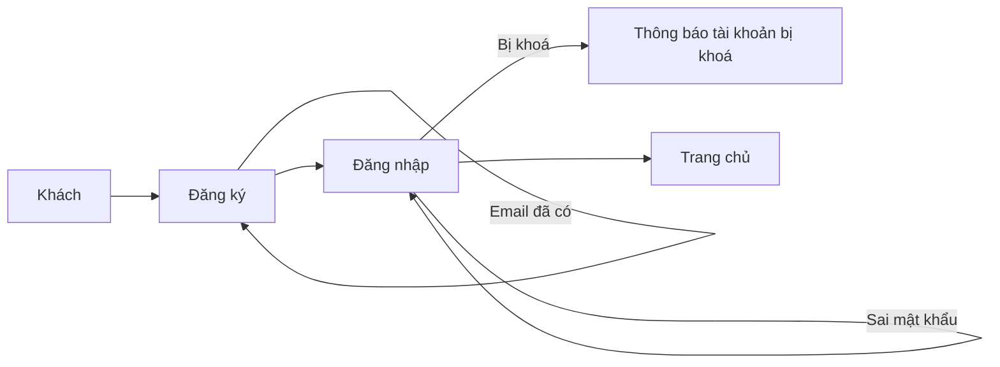
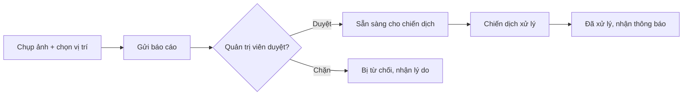
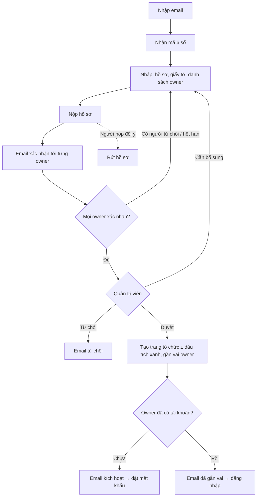
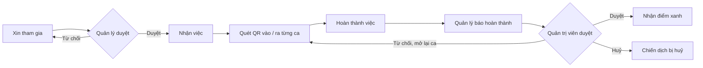
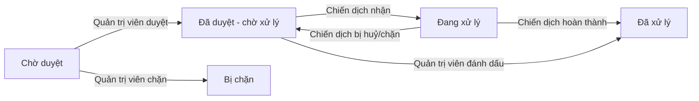
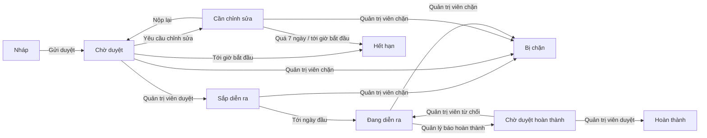
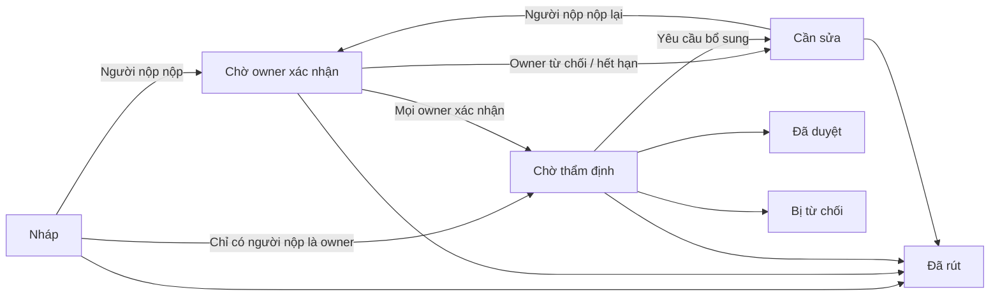

# Ecolink — Tổng quan nghiệp vụ

> Tài liệu dành cho PM, BA, khách hàng, nhà tài trợ và tình nguyện viên nòng cốt. Nội dung tổng hợp từ bộ tài liệu kỹ thuật trong thư mục `docs/`, và được viết dựa trên **đúng những gì sản phẩm đang làm** tại thời điểm 06/10/2026. Nó không mô tả những gì sản phẩm "dự định" làm.
> Những chỗ sản phẩm chưa làm xong, hoặc đang làm khác với mong đợi, được nêu rõ ở mục 3 (cột Trạng thái) và mục 10.

---

## 1. Giới thiệu sản phẩm

### Ecolink là gì?
Ecolink là nền tảng kết nối cộng đồng để **phát hiện và dọn dẹp các điểm rác, ô nhiễm**. Người dân chụp ảnh và báo cáo điểm rác. Các tổ chức (trường học, câu lạc bộ, NGO, cơ quan nhà nước…) mở **chiến dịch** dọn dẹp. Tình nguyện viên đăng ký tham gia. Khi chiến dịch hoàn thành, người tham gia nhận **điểm xanh** để đổi quà và leo bảng xếp hạng.

### Sản phẩm giải quyết vấn đề gì?
- Người dân thấy rác nhưng không biết báo cho ai. Ecolink cho phép gửi báo cáo kèm ảnh và vị trí chỉ trong vài bước, và có trợ lý AI hỗ trợ.
- Tổ chức muốn làm chiến dịch nhưng khó tìm địa điểm và khó huy động người. Ecolink cung cấp danh sách điểm rác đã được xác nhận, tự mời người dân sống gần khu vực, và hỗ trợ quản lý người tham gia, điểm danh, theo dõi tiến độ và kết quả từng ca.
- Cộng đồng khó phân biệt tổ chức uy tín. Ecolink thẩm định hồ sơ pháp lý của tổ chức và gắn **dấu tích xanh** cho tổ chức đã được xác minh.
- Tình nguyện viên thiếu động lực duy trì. Ecolink có điểm thưởng, quà tặng, bảng xếp hạng theo mùa và huy hiệu.

### Giá trị cho từng nhóm người dùng

| Nhóm | Giá trị |
|---|---|
| Người dân | Báo cáo điểm rác dễ dàng, nhận thông báo khi báo cáo được duyệt hoặc xử lý, được mời tham gia chiến dịch gần nhà, tích điểm đổi quà |
| Tình nguyện viên | Tìm chiến dịch, đăng ký tham gia, nhận việc, điểm danh, nhận điểm và thứ hạng |
| Tổ chức | Có trang tổ chức riêng, tạo và quản lý chiến dịch, có thành viên, có dấu tích xanh tạo uy tín |
| Quản trị viên | Kiểm duyệt báo cáo, chiến dịch và tổ chức; thẩm định hồ sơ; quản lý quà tặng và cấu hình điểm thưởng |
| Nhà tài trợ | Quà tặng được trưng bày trong cửa hàng đổi điểm |

---

## 2. Các nhóm người dùng

| Vai trò | Là ai | Muốn làm gì | Được làm | Không được làm |
|---|---|---|---|---|
| **Khách** | Người chưa đăng nhập | Tìm hiểu, đăng ký tài khoản, nộp hồ sơ tổ chức | Đăng ký, đăng nhập, xem danh sách quà và bảng xếp hạng, **nộp hồ sơ đăng ký tổ chức** (không cần tài khoản) | Xem báo cáo, chiến dịch, bản đồ (sẽ được yêu cầu đăng nhập) |
| **Người dùng** (người dân) | Người có tài khoản cá nhân | Báo cáo rác, theo dõi, bình chọn, tham gia | Gửi và sửa báo cáo của mình; bình chọn và lưu báo cáo hoặc chiến dịch; đăng ký ca của chiến dịch, xin gia nhập tổ chức; gửi yêu cầu khẩn cấp (SOS) khi đang ở chiến dịch, tới giúp SOS gần mình, bật "Sẵn sàng hỗ trợ SOS"; chat với trợ lý AI; đổi quà; cài đặt thông báo | Duyệt nội dung; tạo chiến dịch (chỉ owner hoặc quản lý chiến dịch của tổ chức được tạo) |
| **Tình nguyện viên** | Người dùng đã được chấp nhận vào một chiến dịch | Làm việc trong chiến dịch và nhận điểm | Nhận việc được giao, cập nhật kết quả, điểm danh vào / ra từng ca bằng mã QR tại điểm tập trung, nhận điểm khi chiến dịch hoàn thành | Quản lý chiến dịch |
| **Owner tổ chức** (gồm người đại diện pháp lý) | Người dùng cá nhân được gắn vai owner sau khi hồ sơ được duyệt, hoặc qua **đề xuất thêm owner** được các owner khác đồng ý. Một tổ chức có thể có nhiều owner (tối đa 5 lúc đăng ký); một người làm owner tối đa 3 tổ chức. Tổ chức **không** có tài khoản đăng nhập riêng | Quản lý tổ chức và chiến dịch | Mọi quyền của Admin tổ chức, cộng: nâng / hạ vai Admin, **đề xuất thêm owner**, **đề xuất thu hồi owner khác**, đồng ý / từ chối đề xuất của owner khác, **tự hạ vai hoặc rời tổ chức** (khi còn owner khác; người đại diện pháp lý phải chọn người thay, người thay xác nhận và các owner khác đồng ý); **tạo chiến dịch**; quản lý, sửa và xoá **mọi** chiến dịch của tổ chức (kể cả chiến dịch người khác tạo) | Tự tạo tổ chức mà không qua thẩm định; rời tổ chức khi là owner duy nhất |
| **Admin tổ chức** | Thành viên được owner nâng vai | Vận hành tổ chức thay owner | Sửa thông tin tổ chức; duyệt người xin gia nhập và lời mời; đổi vai / gỡ Quản lý chiến dịch và Thành viên | Đụng tới owner hoặc admin khác; đề xuất owner; tạo hoặc quản lý chiến dịch (trừ khi được thêm làm người quản lý của một chiến dịch) |
| **Quản lý chiến dịch của tổ chức** (vai trong tổ chức) | Thành viên được owner / admin gán vai | Chạy chiến dịch cho tổ chức | Mời thành viên (cần duyệt); **tạo chiến dịch** cho tổ chức (tự thành người quản lý chiến dịch đó) | Quản lý thành viên; quản lý chiến dịch người khác tạo (trừ khi được thêm làm người quản lý) |
| **Người quản lý chiến dịch** | Người đã tạo chiến dịch, những người được thêm làm quản lý (phải là thành viên của tổ chức), và mọi owner của tổ chức. Rời tổ chức là mất quyền quản lý | Vận hành chiến dịch | Sửa chiến dịch, gửi duyệt / nộp lại, duyệt người tham gia, xem danh sách tình nguyện viên, tạo và giao việc, mở điểm danh từng ca (hiện mã QR, thêm tay, kết thúc điểm danh), báo hoàn thành chiến dịch, thêm hoặc bớt người quản lý, đóng SOS của chiến dịch | Tự duyệt hoàn thành chiến dịch (cần quản trị viên); gỡ người tạo khỏi danh sách quản lý; xoá chiến dịch (chỉ người tạo hoặc owner) |
| **Thành viên tổ chức** | Người dùng được owner / admin chấp nhận yêu cầu gia nhập, hoặc nhận lời mời | Theo dõi hoạt động của tổ chức | Nhận thông báo khi chiến dịch của tổ chức được duyệt; **mời người khác** (lời mời chờ owner / admin duyệt); rời tổ chức | Quản lý tổ chức |
| **Người được mời vào tổ chức** | Người dùng đã có tài khoản được một thành viên mời | Nhận hoặc từ chối | Mở link trong email (không cần đăng nhập), bấm Chấp nhận hoặc Từ chối trong 7 ngày | Vào tổ chức khi chưa tự chấp nhận |
| **Người nộp hồ sơ tổ chức** | Người lập hồ sơ, không cần tài khoản; bắt buộc là một trong các owner | Đăng ký tổ chức lên Ecolink | Xác thực email bằng mã, lưu nháp, khai danh sách owner, nộp hồ sơ và giấy tờ, gửi lại email xác nhận cho owner, theo dõi, sửa, rút hồ sơ qua đường link trong email | — |
| **Owner được mời** | Người được ghi tên làm owner trong một hồ sơ | Đồng ý hoặc từ chối | Mở link trong email (không cần đăng nhập), bấm **Xác nhận** hoặc **Tôi không liên quan**, có thể chặn email mình khỏi mọi lời mời sau này | Được gán vai khi chưa tự xác nhận |
| **Quản trị viên** | Nhân sự vận hành Ecolink | Kiểm duyệt và vận hành | Duyệt hoặc chặn báo cáo, chiến dịch (kèm yêu cầu chỉnh sửa; trừ chiến dịch của tổ chức mình là thành viên), tổ chức, người dùng; thẩm định hồ sơ tổ chức và cấp dấu tích xanh; duyệt hoàn thành chiến dịch; quản lý quà và đơn đổi quà; cấu hình điểm, mùa, huy hiệu | Sửa báo cáo của người dân (bị cấm) |

> Chi tiết kỹ thuật: xem `docs/05-permissions.md`.

---

## 3. Tính năng theo nhóm

Trạng thái: ✅ đã có · 🟡 đang làm dở / có hạn chế · ❌ chưa có

### 3.1 Tài khoản
| Tính năng | Mô tả | Ai dùng | Trạng thái |
|---|---|---|---|
| Đăng ký, đăng nhập bằng email | Tạo tài khoản bằng email và mật khẩu. Không cần xác minh email | Khách | ✅ |
| Đăng nhập bằng Google | Đăng nhập bằng tài khoản Google | Khách | 🟡 Đang lỗi đường dẫn trên bản web (mục 10) |
| Quên mật khẩu | Yêu cầu đặt lại và đặt mật khẩu mới | Người dùng | 🟡 Hệ thống **không gửi email**; cách làm hiện tại không an toàn (mục 10) |
| Đổi mật khẩu | Đổi mật khẩu khi đang đăng nhập | Người dùng | 🟡 Hệ thống đã có, nhưng giao diện chưa có |
| Hồ sơ cá nhân | Ảnh đại diện, giới thiệu, số điện thoại, giới tính, ngày sinh, **vị trí nhà** (để được mời vào chiến dịch gần nhà) | Người dùng | ✅ |
| Cài đặt thông báo | Bật hoặc tắt 6 nhóm thông báo | Người dùng | ✅ |
| Đăng xuất | | Người dùng | 🟡 Trên web, đăng xuất chỉ xoá phiên trên trình duyệt, chưa báo được cho hệ thống |
| Chặn người dùng | Quản trị viên chặn tài khoản kèm lý do | Quản trị viên | 🟡 Chưa có chức năng gỡ chặn |

### 3.2 Tổ chức
| Tính năng | Mô tả | Ai dùng | Trạng thái |
|---|---|---|---|
| Trang tổ chức | Tên, logo, ảnh bìa, mô tả, email liên hệ, danh sách thành viên và chiến dịch; có đường dẫn riêng theo tên | Mọi người đăng nhập | ✅ |
| Cập nhật thông tin tổ chức | Owner / Admin tổ chức sửa thông tin; đổi email liên hệ thì phải xác minh lại email đó | Owner, Admin tổ chức | ✅ |
| Xác minh email liên hệ | Gửi đường link xác minh về email liên hệ | Owner, Admin tổ chức | ✅ |
| Gia nhập tổ chức | Người dùng xin gia nhập, owner / admin duyệt hoặc từ chối (đều nhận thông báo); thành viên có thể rời | Người dùng, owner, admin | ✅ |
| Vai trong tổ chức | 5 vai: người đại diện pháp lý, owner, admin, quản lý chiến dịch, thành viên; trang tổ chức hiện nhãn vai của từng người và ẩn / hiện nút theo quyền | Mọi người đăng nhập | ✅ (kể cả quyền với chiến dịch theo vai) |
| Đổi vai, gỡ thành viên | Owner nâng / hạ Admin, Quản lý chiến dịch, Thành viên; Admin đổi Quản lý chiến dịch / Thành viên; không ai đụng được owner | Owner, Admin tổ chức | ✅ |
| Mời thành viên | Thành viên nào cũng mời được người đã có tài khoản (tìm theo tên / email, email hiển thị bị che bớt); lời mời cần owner / admin duyệt, rồi người được mời bấm chấp nhận qua email | Mọi thành viên | ✅ |
| Đề xuất thêm owner | Owner chọn người có sẵn hoặc nhập email (chưa có tài khoản cũng được); từng người xác nhận qua email **và** mọi owner khác đồng ý là có hiệu lực — **không cần quản trị viên nền tảng**. Người chưa có tài khoản được tạo tài khoản lúc đó và nhận email kích hoạt | Owner | ✅ |
| Thu hồi owner | Owner đề xuất thu hồi một owner khác (người đó giữ vai Admin / Thành viên hoặc bị gỡ); mọi owner còn lại phải đồng ý; tổ chức chỉ có 2 owner thì có hiệu lực ngay. Người bị thu hồi được báo nhưng không phủ quyết được | Owner | ✅ |
| Owner tự rút lui | Owner tự hạ xuống Admin / Thành viên hoặc rời tổ chức, có hiệu lực ngay, miễn còn owner khác; owner duy nhất phải thêm owner khác trước | Owner | ✅ |
| Chọn ngữ cảnh tổ chức | Menu người dùng cho chọn "Cá nhân" hoặc một tổ chức mình có vai, có lối tắt quản lý tổ chức | Người dùng có vai trong tổ chức | ✅ Trang "Chiến dịch của tôi" mặc định lọc theo tổ chức đang chọn; form tạo chiến dịch chọn sẵn tổ chức đó |
| Duyệt hoặc chặn tổ chức | Quản trị viên chặn tổ chức vi phạm, hoặc bỏ chặn | Quản trị viên | ✅ Tổ chức bị chặn không tạo và không gửi duyệt được chiến dịch (từ 30/09/2026) |

### 3.3 Xác minh và dấu tích xanh
| Tính năng | Mô tả | Ai dùng | Trạng thái |
|---|---|---|---|
| Nộp hồ sơ đăng ký tổ chức | Xác thực email bằng mã một lần, lưu nháp, khai thông tin, kênh chính thức (Facebook, website, Zalo OA), danh sách owner (tối đa 5, đúng một người đại diện pháp lý), tải lên tối đa 5 giấy tờ | Người nộp hồ sơ | ✅ |
| Owner xác nhận | Mỗi owner nhận email riêng và phải tự xác nhận trong 14 ngày; đủ xác nhận mới vào hàng chờ thẩm định | Owner được mời | ✅ |
| Theo dõi, sửa, rút hồ sơ | Qua đường link trong email, không cần tài khoản; thấy ai đã xác nhận, gửi lại email (cách nhau ít nhất 1 giờ) | Người nộp hồ sơ | ✅ |
| Thẩm định hồ sơ | Quản trị viên nhận xử lý, xem giấy tờ (mỗi lần xem đều được ghi lại), yêu cầu bổ sung, duyệt hoặc từ chối | Quản trị viên | ✅ |
| Dấu tích xanh | Gắn khi duyệt hồ sơ. Mặc định có với luồng ưu tiên dành cho cơ quan nhà nước và trường học; luồng tiêu chuẩn thì quản trị viên tự quyết | Quản trị viên | 🟡 Đã hiển thị cho người dùng; chưa có tạm dừng, thu hồi hay xử lý hết hạn |
| Gắn vai owner khi duyệt | Duyệt hồ sơ xong, mỗi owner được gắn vai. Ai chưa có tài khoản được tạo tài khoản cá nhân và nhận email kích hoạt (72 giờ); ai đã có tài khoản nhận email "đã được gắn vai" | Hệ thống | ✅ Hết hạn email kích hoạt thì tự yêu cầu gửi lại từ trang đăng nhập |

### 3.4 Chiến dịch
| Tính năng | Mô tả | Ai dùng | Trạng thái |
|---|---|---|---|
| Tạo chiến dịch | Owner hoặc quản lý chiến dịch của tổ chức tạo **bản nháp** (từ "Chiến dịch của tôi" hoặc tab chiến dịch trên trang tổ chức): tiêu đề, mô tả, ảnh bìa, một ngày diễn ra với giờ bắt đầu / kết thúc, người liên hệ, lưu ý an toàn, **mức độ khó** (quyết định số người tối đa và số điểm thưởng), và 1–5 **điểm tập kết** (mỗi điểm có trưởng điểm, giờ tập trung, số chỗ và các điểm rác cần xử lý quanh đó). Lưu nháp bao nhiêu lần cũng được; bấm "Gửi duyệt" thì hệ thống kiểm đủ thông tin và giữ các điểm rác cho chiến dịch. Nút tạo bị ẩn với người không có quyền, bị khoá kèm lý do khi tổ chức đang bị khoá hoặc vượt giới hạn | Owner, quản lý chiến dịch của tổ chức | ✅ Chiến dịch nhiều ngày chưa hỗ trợ |
| Sửa và xoá chiến dịch | Sửa: người quản lý chiến dịch — trước khi được duyệt sửa được mọi thứ, sau khi duyệt và trước khi diễn ra vẫn sửa được: mô tả, ảnh bìa, liên hệ, số người của ca lưu ngay; địa điểm, ngày và giờ, điểm rác, mức độ khó, điều kiện thì chiến dịch quay về chờ duyệt lại, tình nguyện viên giữ chỗ và được báo. Không có chức năng dời lịch riêng. Xoá: người tạo hoặc owner, chỉ khi chưa được duyệt, bị chặn hoặc hết hạn | Người quản lý / owner | ✅ |
| Duyệt chiến dịch | Quản trị viên xem danh sách chờ duyệt (không thấy chiến dịch của tổ chức mình là thành viên), đánh dấu đủ 6 mục kiểm tra rồi duyệt — khi đó thành viên tổ chức được báo và người dân quanh khu vực 5 km được mời tham gia; hoặc **yêu cầu chỉnh sửa** (tổ chức có 7 ngày để nộp lại, xem được lịch sử thay đổi), hoặc **chặn** kèm lý do. Chiến dịch chờ duyệt tới giờ bắt đầu mà chưa được duyệt thì tự **hết hạn** | Quản trị viên | ✅ |
| Đăng ký tham gia | Tình nguyện viên chọn một hoặc nhiều ca (kể cả nhiều ca cùng ngày); có hiệu lực ngay, không cần duyệt, không giới hạn số người. Hệ thống chỉ cảnh báo khi trùng giờ hoặc ca đã vượt dự kiến. Tình nguyện viên rời ca tự do trước giờ bắt đầu (bỏ tick hoặc nút "Rời chiến dịch"), không bị ghi nhận gì. Người quản lý nhận một bản tin số đăng ký mỗi tối, xem danh sách theo ca (chỉ xem, không gỡ hay chuyển ca của ai), được báo khi ca thiếu người (72 giờ trước mỗi ngày) hoặc vượt dự kiến, có thể mời lại người dân trong 5 km (mỗi ngày một lần) và tắt bớt ca | Người dùng, quản lý | ✅ (chưa có gộp ca) |
| Quản lý người quản lý | Thêm người quản lý (chỉ chọn được thành viên của tổ chức) hoặc bớt người quản lý (trừ người tạo) ngay trên trang chiến dịch | Quản lý | ✅ |
| Điểm danh theo ca | Người phụ trách ca hoặc quản lý mở điểm danh cho từng ca và hiện **mã QR đổi mỗi 10 phút** (spec yêu cầu 15–30 giây, đổi theo quyết định sản phẩm); người tham gia quét khi đến (vào) và khi về (ra). Quét xa điểm tập trung quá **50 m** hoặc vị trí không chính xác vẫn được ghi nhận nhưng bị **gắn cờ**; người phụ trách ca hoặc quản lý xem lại và có thể **loại** (kèm lý do) hoặc khôi phục. Người bị loại không được tính điểm ca đó; người bị gắn cờ mà không bị loại vẫn được tính. Người chưa đăng ký ca vẫn điểm danh được. Quản lý thêm tay được người quên điện thoại (có lý do, tối đa 20% số người có mặt). Kết thúc điểm danh thì mọi người còn trong ca được tính là đã ra | Người phụ trách ca, quản lý, tình nguyện viên | ✅ (chỉ quét online trên web) |
| Kết quả và trạng thái ca | Mỗi ca có trạng thái riêng: **Chưa bắt đầu → Đang diễn ra → Chờ kết quả → Kết thúc** (hoặc Đã tắt); ca chỉ Kết thúc khi đã có kết quả. Người phụ trách ca (hoặc quản lý) nộp kết quả từ lúc ca bắt đầu: từng điểm rác của điểm tập trung "Đã sạch" / "Làm dở" kèm ảnh sau (ảnh trước không bắt buộc; không khai = chưa xử lý). Ảnh trước / sau gửi bản gốc kèm **ghim vị trí chụp trên bản đồ**; hệ thống chấm ngay **Đạt / Cảnh báo / Không đạt** theo giờ chụp (trong 48 giờ), vị trí trong ảnh so với ghim và ghim so với điểm rác (trong 100 m), và phát hiện ảnh dùng lại, ảnh hoạt động chọn từ "Ảnh hoạt động của ca", mô tả, số túi và số kg; sửa được tới khi báo hoàn thành. Tình nguyện viên đã điểm danh xem kết quả và đóng góp ảnh / video. Ca đã có kết quả có thể **kết thúc sớm** (mọi người được check-out, điều kiện 60% tính tới lúc kết thúc). Ca chờ kết quả quá 24 giờ thì người phụ trách và quản lý được nhắc mỗi ngày | Người phụ trách ca, quản lý, tình nguyện viên | 🟡 Chưa có chụp trực tiếp (Live Camera) trên điện thoại, chỉ chọn ảnh thư viện kèm ghim; chưa có bản đồ điểm rác **[CHƯA HOÀN THIỆN]** |
| Tiến độ các ca | Tab **Tiến độ** (Progress) trên trang chiến dịch, mọi người đã đăng nhập thấy khi chiến dịch đã công khai (quản lý và quản trị viên thấy ở mọi trạng thái; thay tab Công việc cũ): lưới ngày × điểm tập trung tô màu theo trạng thái ca, cùng số ca đã Kết thúc, số người có mặt / đăng ký và tỉ lệ, tổng khối lượng, số điểm rác đã sạch / làm dở / chưa xử lý. Bấm một ô ca mở khung xem nhanh kết quả của ca: số người đăng ký / có mặt / đủ điều kiện, từng điểm rác (đã sạch / làm dở / chưa xử lý, ảnh trước / sau), ảnh hoạt động đưa vào kết quả, mô tả và khối lượng (túi, kg); các phần thu gọn được, có link sang trang ca; chưa nộp thì ghi "Chưa nộp kết quả". Ảnh trong kho chưa chọn vào kết quả chỉ quản lý, người phụ trách ca và người đã điểm danh thấy. Quản trị viên còn xem ở tab Kết quả (Result) của khung Xem trước chiến dịch, kèm hồ sơ đề nghị hoàn tất nếu đã gửi | Mọi người đã đăng nhập (chiến dịch công khai), quản lý, quản trị viên | ✅ |
| Xử lý chiến dịch quá ngày kết thúc | Spec 4.4 | Hệ thống | **[CHƯA HOÀN THIỆN]** |
| Yêu cầu khẩn cấp (SOS) | 3 loại (Nhân lực / Dụng cụ, Rác nguy hại, Y tế) phát tại ca đang chạy; báo ngay cho đội của ca rồi lan dần tới tình nguyện viên "Sẵn sàng" ở gần, tổ chức lân cận và quản trị viên; "Tôi tới giúp" kèm bộ đếm, chỉ đường; tự leo thang và hết hạn; bản đồ theo màu từng loại | Người ở hiện trường phát; mọi người tới giúp; đội, quản trị viên và người phát đóng SOS | ✅ Web (thời gian thực bằng tự làm mới; chưa có mobile, chưa có thông báo đẩy / SMS) |
| Báo hoàn thành | Khi **mọi ca đang bật đã Kết thúc** (nút bị khoá kèm "Còn N ca chưa Kết thúc"), quản lý báo hoàn thành: hệ thống tự gom kết quả các ca thành bộ hồ sơ (từng điểm rác: đã sạch / làm dở kèm ảnh trước / sau); điểm rác chưa ca nào xử lý phải ghi lý do; điểm rác có ảnh Không đạt / Cảnh báo được liệt kê để sửa trước (không chặn). Mỗi **điểm tập trung** có điểm rác "Đã sạch" mở **72 giờ xác thực**: người báo cáo ban đầu của các điểm rác trong đó được mời xác nhận (mỗi người một lời mời cho mỗi điểm tập trung), người dân quanh từng điểm tập trung được mời bỏ phiếu | Quản lý, người dân | ✅ |
| Xác thực kết quả (3 lớp) | (1) Mỗi ảnh và mỗi điểm rác "Đã sạch" được **chấm ảnh tự động**; mức của điểm tập trung là mức thấp nhất trong các điểm rác của nó. Bầu chọn theo **điểm tập trung** (một khu vực cùng các điểm rác của nó): người xem ảnh trước / sau của mọi điểm rác trong đó rồi bỏ **một phiếu** cho cả khu vực; (2) **người báo cáo ban đầu** của bất kỳ điểm rác nào trong đó xác nhận (một phiếu nặng 10, dù báo cáo nhiều điểm); (3) **cộng đồng bỏ phiếu** "Đã sạch" / "Chưa sạch" (Chưa sạch phải kèm ghi chú hoặc ảnh **và chọn điểm rác nào chưa sạch**), phiếu nặng 3 khi đứng tại chỗ (GPS trong 30 m quanh điểm tập trung hoặc một điểm rác của nó), 1 khi ở gần (trong 5 km), 0 khi ở xa hoặc tài khoản dưới 7 ngày / email chưa xác thực. Thành viên tổ chức, đội quản lý và tình nguyện viên đã điểm danh không được bỏ phiếu; mỗi người tối đa 20 phiếu mới mỗi ngày. Đạt 15 điểm → **Đã xác thực**; có phiếu chưa sạch và ≤ 3 điểm → **Gắn cờ** cho quản trị viên; hết 72 giờ mà không ai phản đối thì kết quả chấm ảnh quyết định (Đạt → xác thực, Cảnh báo → gắn cờ, Không đạt → từ chối) | Người báo cáo, người dân | ✅ |
| Quyết định hoàn thành và trao điểm | **Hệ thống tự quyết**: mọi điểm tập trung đã xác thực → chiến dịch **hoàn thành** (điểm rác đã sạch thành đã xử lý; làm dở và chưa xử lý trở về danh sách chờ; người có ít nhất một ca **điểm danh đủ** nhận điểm theo tỉ lệ số ca đủ / số ca đã đăng ký); có điểm tập trung bị từ chối → chiến dịch **trở lại đang diễn ra**, chỉ các ca đã nộp ảnh cho **điểm rác chưa đạt** được mở lại kèm lý do. Quản trị viên chỉ: xử lý điểm tập trung bị gắn cờ trong 48 giờ (Xác thực / Từ chối kèm lý do và chọn điểm rác chưa đạt; quá hạn thì tự từ chối); **Duyệt** (chốt mức độ khó) hoặc **Huỷ** chiến dịch khi được chuyển tới (bị từ chối quá 3 lần, hoặc không có điểm rác nào "Đã sạch"); **Huỷ** được bất cứ lúc nào. Không có "Duyệt một phần" | Hệ thống, quản trị viên | ✅ |
| Khiếu nại kết quả xác thực | Tổ chức khiếu nại khi điểm rác hoặc chiến dịch bị từ chối | Quản lý | ❌ Để đợt sau **[CHƯA HOÀN THIỆN]** |
| Trang kết quả công khai, đánh giá, chia sẻ (spec 5.4) | Trang công khai kết quả chiến dịch, đánh giá, chia sẻ Facebook | Mọi người | **[CHƯA HOÀN THIỆN]** |
| Nộp kết quả (submission) | Quản lý nộp bộ kết quả và duyệt nội bộ | Quản lý | 🟡 Chưa gắn với luồng hoàn thành, hiện không có tác dụng |
| Vinh danh trên Facebook | Tự đăng bài cảm ơn tình nguyện viên lên Facebook | Hệ thống | ❌ Đã viết nhưng đang tắt |

### 3.5 Báo cáo sự cố (điểm rác)
| Tính năng | Mô tả | Ai dùng | Trạng thái |
|---|---|---|---|
| Gửi báo cáo | 1–10 ảnh, vị trí trên bản đồ, mức độ nghiêm trọng, mô tả | Người dùng | ✅ |
| AI phân tích ảnh | Tự nhận diện rác trong ảnh và gợi ý cách xử lý (nên mang gì, cảnh báo an toàn, cách phân loại) | Hệ thống | ✅ |
| Tìm kiếm và bản đồ | Tìm theo trạng thái, mức độ, khoảng cách; bản đồ hiển thị báo cáo, chiến dịch và SOS | Người dùng | ✅ |
| Sửa, thêm ảnh, xoá báo cáo | Chỉ người gửi | Người dùng | 🟡 Thêm ảnh vào báo cáo đã duyệt làm báo cáo bị kẹt |
| Kiểm duyệt | Quản trị viên duyệt hoặc chặn báo cáo, hoặc đánh dấu "đã xử lý" | Quản trị viên | ✅ |
| Bình chọn và lưu | Bình chọn lên hoặc xuống, lưu để xem lại | Người dùng | ✅ |
| Báo cáo qua trợ lý AI | Chat, gửi ảnh, trợ lý tự tạo báo cáo | Người dùng | 🟡 Báo cáo tạo qua chat **không có vị trí thật** |

### 3.6 Điểm thưởng, quà tặng, xếp hạng
| Tính năng | Mô tả | Ai dùng | Trạng thái |
|---|---|---|---|
| Điểm xanh | Nhận khi chiến dịch hoàn thành, khi báo cáo được xử lý, khi báo cáo đạt mốc bình chọn | Người dùng | ✅ |
| Điểm tiêu dùng có hạn | Mỗi điểm xanh nhận được sinh ra một lượng điểm tiêu dùng tương đương, **hết hạn sau 90 ngày**, dùng để đổi quà | Người dùng | ✅ |
| Cửa hàng quà | Xem quà, đổi quà (nhập số điện thoại và nơi nhận) | Người dùng | ✅ |
| Quản lý đơn đổi quà | Chuyển trạng thái đang xử lý → đã gửi → đã giao, hoặc huỷ (có hoàn điểm) | Quản trị viên | 🟡 Đang thiếu kiểm tra quyền (mục 10); không báo cho người đổi |
| Lịch sử điểm | Xem điểm và lịch sử cộng trừ | Người dùng | ✅ |
| Mùa giải và bảng xếp hạng | Điểm xếp hạng công dân (từ báo cáo) và tình nguyện viên (từ chiến dịch) theo mùa; cuối mùa thưởng thêm điểm tiêu dùng theo thứ hạng | Người dùng, quản trị viên | 🟡 Hệ thống đã có, giao diện người dùng chưa có |
| Huy hiệu | Quản trị viên định nghĩa huy hiệu kèm điều kiện đạt và ưu đãi giảm giá | Quản trị viên | 🟡 Định nghĩa được, nhưng **chưa có ai được trao** |

### 3.7 Thông báo
| Tính năng | Mô tả | Trạng thái |
|---|---|---|
| Thông báo trong ứng dụng | Chuông thông báo, tự làm mới mỗi 20 giây, đánh dấu đã đọc | ✅ |
| Email | Mã xác thực, xác nhận hồ sơ, lời mời xác nhận owner, owner từ chối / hết hạn, hồ sơ bị rút, yêu cầu bổ sung, từ chối, kích hoạt tài khoản, "đã được gắn làm owner", xác minh email liên hệ | ✅ |
| Tuỳ chọn nhận thông báo | 6 nhóm có thể tắt; các thông báo quan trọng luôn được gửi | ✅ |
| Đánh dấu tất cả đã đọc | | ❌ |

### 3.8 Đa ngôn ngữ
| Tính năng | Mô tả | Trạng thái |
|---|---|---|
| Giao diện Việt và Anh | Chọn ngôn ngữ hiển thị | ✅ |
| Tự dịch nội dung | Báo cáo, mô tả tổ chức, chiến dịch (chỉ khi tạo), quà tặng được AI tự dịch sang tiếng Việt và tiếng Anh | 🟡 Sửa chiến dịch thì không dịch lại; dịch lỗi thì giữ nguyên bản gốc |

### 3.9 Trợ lý AI
| Tính năng | Mô tả | Trạng thái |
|---|---|---|
| Chat hỗ trợ | Hỏi đáp, gửi ảnh, nhờ tạo báo cáo | 🟡 Tạo tổ chức qua chat luôn thất bại; báo cáo qua chat không có vị trí thật |

---

## 4. Hành trình người dùng

### 4.1 Đăng ký và đăng nhập
1. Khách vào trang Đăng ký, nhập tên, email, mật khẩu, và đồng ý điều khoản.
2. Hệ thống tạo tài khoản ngay, không cần xác minh email. Người dùng chuyển sang Đăng nhập.
3. Đăng nhập bằng email và mật khẩu, hoặc bằng Google.

Các trường hợp thường gặp:
- Email đã được dùng: thông báo "email đã tồn tại".
- Mật khẩu ngắn: giao diện cho phép 6 ký tự, nhưng hệ thống yêu cầu ít nhất 8 khi đăng ký, nên người dùng có thể gặp lỗi khó hiểu.
- Tài khoản bị chặn: thông báo "tài khoản đã bị khoá".
- Tài khoản chưa kích hoạt (tạo cho owner được duyệt): thông báo cần dùng link kích hoạt, kèm nút **Gửi lại email kích hoạt**.
- Phiên đăng nhập hết hạn: hệ thống thử làm mới phiên; không được thì đưa về trang đăng nhập.

```mermaid
flowchart LR
  A[Khách] --> B[Đăng ký]
  B -->|Email đã có| B
  B --> C[Đăng nhập]
  C -->|Sai mật khẩu| C
  C -->|Bị khoá| X[Thông báo tài khoản bị khoá]
  C --> D[Trang chủ]
```

### 4.2 Báo cáo điểm rác
1. Người dùng bấm "Báo cáo", chọn ảnh (tối đa 10), chọn vị trí trên bản đồ, chọn mức độ nghiêm trọng, nhập tiêu đề và mô tả.
2. Báo cáo được ghi nhận ở trạng thái **chờ duyệt**. AI phân tích ảnh ở chế độ nền và đưa ra gợi ý xử lý.
3. Quản trị viên duyệt báo cáo, người gửi nhận thông báo **đã được duyệt**. Báo cáo lúc này có thể được một chiến dịch nhận xử lý.
4. Khi chiến dịch chứa báo cáo hoàn thành, hoặc quản trị viên đánh dấu đã xử lý, báo cáo chuyển sang **đã xử lý** và người gửi được thông báo.

Các trường hợp thường gặp:
- Báo cáo bị từ chối (chặn): người gửi nhận thông báo kèm lý do; báo cáo không còn xem được và không sửa được.
- Thêm ảnh sau khi đã được duyệt: báo cáo quay về "chờ duyệt" và hiện có thể bị kẹt ở trạng thái đó (mục 10).

```mermaid
flowchart LR
  A[Chụp ảnh + chọn vị trí] --> B[Gửi báo cáo]
  B --> C{Quản trị viên duyệt?}
  C -->|Duyệt| D[Sẵn sàng cho chiến dịch]
  C -->|Chặn| E[Bị từ chối, nhận lý do]
  D --> F[Chiến dịch xử lý]
  F --> G[Đã xử lý, nhận thông báo]
```

### 4.3 Đăng ký tổ chức và nhận dấu tích xanh
> Thiết kế đầy đủ, kèm lý do từng lựa chọn: `docs/ORG_OWNERSHIP_FLOW.md`. Điểm khác lớn nhất so với trước: **tổ chức không có tài khoản đăng nhập riêng**. Người quản lý tổ chức là các **owner** — người dùng cá nhân — và mỗi owner phải tự xác nhận trước khi quản trị viên được thẩm định.

1. Người lập hồ sơ vào "Đăng ký tổ chức" và nhập **email của chính mình**. Hệ thống gửi **mã xác thực một lần** gồm 6 số, hiệu lực 10 phút.
2. Nhập mã. Hệ thống mở một **bản nháp** và gửi **đường link theo dõi** (hiệu lực 180 ngày), nên có thể lưu nháp và quay lại sau. Nếu email này đã có hồ sơ đang mở thì mở lại hồ sơ đó.
3. Điền hồ sơ: loại tổ chức, tên, logo, mô tả, địa chỉ, email liên hệ, ít nhất 1 kênh chính thức, **danh sách owner** (1–5 người: email, họ tên; đúng một người là **người đại diện pháp lý**, kèm số điện thoại và giấy tờ tuỳ thân), tối đa 5 giấy tờ (PDF hoặc ảnh, mỗi file ≤ 10MB), và đồng ý xử lý dữ liệu cá nhân. Người lập hồ sơ bắt buộc có tên trong danh sách owner.
4. Nộp hồ sơ. Hệ thống kiểm tra ngay (trước khi gửi bất kỳ email nào): tài khoản bị đình chỉ, người đã làm owner 3 tổ chức, email đang có tên ở quá nhiều hồ sơ khác, email đã chặn lời mời. Người lập hồ sơ được tính là đã xác nhận.
5. **Mỗi owner khác nhận một email riêng** tóm tắt hồ sơ (tổ chức, người nộp, các owner khác, vai của họ) với hai nút **Xác nhận** và **Tôi không liên quan**. Không cần đăng nhập. Hạn 14 ngày; người lập hồ sơ gửi lại được bao nhiêu lần cũng được, mỗi lần cách nhau ít nhất 1 giờ.
   - Có người bấm "Tôi không liên quan" hoặc hết hạn: hồ sơ quay về **cần sửa**, người lập hồ sơ nhận email, thay người rồi nộp lại.
   - Đủ xác nhận: hồ sơ vào **hàng chờ thẩm định**. Trước thời điểm này quản trị viên không nhìn thấy hồ sơ.
6. Quản trị viên thẩm định, xem cả **con người** (giờ và IP xác nhận, đã có tài khoản chưa, đang làm owner mấy tổ chức). Có 3 khả năng:
   - **Yêu cầu bổ sung:** người nộp nhận email, sửa qua link, rồi nộp lại.
   - **Từ chối:** người nộp nhận email kèm lý do.
   - **Duyệt:** trang tổ chức được tạo, quản trị viên chọn có gắn **dấu tích xanh** hay không, và từng owner được gắn vai.
7. Owner chưa có tài khoản Ecolink nhận email **kích hoạt** (72 giờ) để đặt mật khẩu; owner đã có tài khoản nhận email "tài khoản của bạn vừa được gắn làm owner" và đăng nhập như bình thường.

Các trường hợp thường gặp:
- Xin mã quá nhiều lần (quá 3 lần mỗi giờ): phải chờ.
- Nhập sai mã 5 lần: phải xin mã mới.
- Email này đã có một hồ sơ đang mở: mở lại hồ sơ đó thay vì tạo hồ sơ mới.
- Một owner đã làm owner 3 tổ chức: không nộp được (kiểm tra lại lúc duyệt).
- Một email đã có tên ở 2 hồ sơ khác đang xử lý: không ghi tên thêm được (chống spam).
- Owner đã có tài khoản Ecolink: **được phép**, không cần xử lý thủ công.
- Sửa tên, loại tổ chức, người đại diện pháp lý hoặc danh sách owner sau khi đã có người xác nhận: mọi xác nhận bị đặt lại, tất cả phải xác nhận lại. Sửa mô tả, logo, giấy tờ, kênh thì giữ nguyên.
- Email kích hoạt hết hạn: tự bấm "Gửi lại email kích hoạt" ở trang đăng nhập.
- Người nộp có thể **rút hồ sơ** bất cứ lúc nào trước khi có quyết định, kể cả khi đang là nháp hoặc đang chờ owner xác nhận. Các owner đã xác nhận được báo qua email.

```mermaid
flowchart TD
  A[Nhập email] --> B[Nhận mã 6 số]
  B --> C[Nháp: hồ sơ, giấy tờ, danh sách owner]
  C --> D[Nộp hồ sơ]
  D --> M[Email xác nhận tới từng owner]
  M --> Q{Mọi owner xác nhận?}
  Q -->|Có người từ chối / hết hạn| C
  Q -->|Đủ| E{Quản trị viên}
  E -->|Cần bổ sung| C
  E -->|Từ chối| G[Email từ chối]
  E -->|Duyệt| H[Tạo trang tổ chức ± dấu tích xanh, gắn vai owner]
  H --> T{Owner đã có tài khoản?}
  T -->|Chưa| I[Email kích hoạt → đặt mật khẩu]
  T -->|Rồi| J[Email đã gắn vai → đăng nhập]
  D -.->|Người nộp đổi ý| K[Rút hồ sơ]
```

### 4.4 Tổ chức mở chiến dịch
1. Owner hoặc quản lý chiến dịch của tổ chức vào "Tạo chiến dịch" (hoặc nút "Tạo chiến dịch" ở tab chiến dịch của trang tổ chức), chọn tổ chức (được chọn sẵn theo tổ chức đang dùng), nhập thông tin, chọn mức độ khó, khai báo lịch 1–7 ngày (không cần liên tiếp, trong 14 ngày kể từ ngày đầu, mỗi ngày có giờ riêng), thêm 1–5 điểm tập kết và chọn các điểm rác đã được duyệt quanh mỗi điểm, rồi nhập cho từng **ca** (một điểm tập kết trong một ngày) **số tình nguyện viên tối thiểu** cần và, nếu muốn, **số tối đa dự kiến**, kèm giờ tập trung và người phụ trách của ca. Hai con số này chỉ để cảnh báo, không giới hạn số người đăng ký. Nhập 0 để tắt một ca; nút "Áp dụng cho mọi ngày" chép số của ngày đầu. Nếu tổng tối thiểu của một ngày thấp hơn mức hệ thống gợi ý theo mức độ khó (dễ 5, trung bình 10, khó 20, rất khó 30), người tạo phải ghi lý do để quản trị viên xem khi duyệt. Bấm "Lưu nháp" để lưu dở; bản nháp chỉ người quản lý thấy và không giữ điểm rác.
2. Bấm "Gửi duyệt": hệ thống kiểm tra đủ thông tin (ngày đầu bắt đầu sau ít nhất 48 giờ, mỗi ngày tối đa 12 giờ, mỗi ngày có ít nhất một ca, ngày thấp hơn mức gợi ý thì có lý do, có liên hệ, điểm rác nằm trong bán kính điểm tập kết…) và báo **mọi** chỗ còn thiếu cùng lúc. Hợp lệ thì chiến dịch **chờ duyệt**, các điểm rác được giữ cho chiến dịch; quản trị viên được báo, owner và người quản lý nhận "tổ chức có chiến dịch mới".
3. Quản trị viên duyệt: chiến dịch **đang hoạt động**, thành viên tổ chức được báo, người dân trong bán kính 5 km được mời tham gia. Hoặc yêu cầu chỉnh sửa: tổ chức sửa và "Nộp lại" trong 7 ngày.

Các trường hợp thường gặp:
- Người không phải owner hay quản lý chiến dịch của tổ chức (Admin tổ chức, Thành viên): bị từ chối; nút tạo chiến dịch không hiện.
- Điểm rác đã thuộc chiến dịch khác hoặc chưa được duyệt: không chọn được. Nếu có chiến dịch khác vừa giữ mất điểm rác lúc gửi duyệt, hệ thống chỉ ra điểm rác cần bỏ.
- Tổ chức bị khoá, đã có 3 chiến dịch đang chờ duyệt / chờ chỉnh sửa, hoặc tổ chức chưa có dấu tích xanh đang chạy 2 chiến dịch: nút tạo bị khoá kèm lý do. Tổ chức chưa có dấu tích xanh chỉ chọn được mức độ khó thấp nhất.
- Chiến dịch bị chặn: các điểm rác được trả về danh sách chờ để chiến dịch khác nhận; người tạo và owner nhận thông báo kèm lý do.
- Quá hạn nộp lại 7 ngày, hoặc tới giờ bắt đầu mà chưa được duyệt: chiến dịch **hết hạn**, điểm rác được trả lại, người tạo được báo. Bản nháp không đụng tới trong 30 ngày tự bị xoá.

### 4.5 Tình nguyện viên tham gia chiến dịch
1. Chiến dịch đã được duyệt ("Sắp diễn ra" hoặc "Đang diễn ra"). Tình nguyện viên bấm "Tham gia", chọn các ca muốn đi (mỗi ca: điểm tập trung, giờ, số người đã đăng ký; nhãn "Còn thiếu N người", "Đã vượt dự kiến", "Trùng giờ"), xác nhận đáp ứng điều kiện tham gia. Đăng ký **có hiệu lực ngay**, không cần duyệt và không bị chặn vì đủ người; chỉ có cảnh báo.
2. Tình nguyện viên sửa ca bằng "Sửa ca đã đăng ký" hoặc bấm "Rời chiến dịch"; rời ca được bất cứ lúc nào trước khi ca bắt đầu và **không bị ghi nhận gì** — đăng ký chỉ để nhận thông báo và để tổ chức ước lượng số người. Người quản lý không nhận thông báo từng lượt mà nhận **một bản tin mỗi tối** (khoảng 20h) về số đăng ký mới theo ngày, và xem danh sách đăng ký theo ca (chỉ xem).
2a. 72 giờ trước mỗi ngày, ca nào còn dưới số tối thiểu thì người quản lý được báo; ca vượt số tối đa dự kiến cũng được báo để chuẩn bị thêm dụng cụ. Người quản lý có thể **mời lại người dân trong 5 km** quanh các điểm tập trung (mỗi 24 giờ một lần) hoặc **tắt một ca** chưa bắt đầu (ngày đó phải còn ca khác): tình nguyện viên của ca bị tắt được báo để chọn ca khác. Ca vẫn thiếu người vào ngày diễn ra thì vẫn chạy.
4. Ngày diễn ra, từ 30 phút trước giờ tập trung, người phụ trách ca (hoặc quản lý) mở điểm danh cho ca và hiện **mã QR đổi mỗi 10 phút**. Người tham gia quét khi đến và quét lại khi về (sau ít nhất 10 phút). Quét xa điểm tập trung quá **50 m** hoặc vị trí không đủ chính xác vẫn được ghi nhận nhưng bị gắn cờ; người phụ trách / quản lý thấy số người bị gắn cờ cần kiểm tra và có thể loại (kèm lý do) hoặc khôi phục cho tới khi chiến dịch hoàn thành. Người không đăng ký trước vẫn điểm danh được. Người quên điện thoại được thêm tay (có lý do, tối đa 20% số người có mặt). Người phụ trách và người mở điểm danh không tự điểm danh ở ca mình chạy. Cuối ca, "Kết thúc điểm danh" tính mọi người còn lại là đã ra. Một ca **đủ** khi có giờ ra, có mặt ≥ 60% thời gian ca và không bị loại; quên quét ra (và không ai kết thúc điểm danh) thì ca không được tính.
4a. Từ lúc ca bắt đầu, người phụ trách ca nộp **kết quả ca** (điểm rác đã sạch / làm dở kèm ảnh sau, ảnh trước nếu có, ảnh hoạt động, mô tả, khối lượng); tình nguyện viên đã điểm danh góp ảnh vào kho ảnh của ca để người phụ trách chọn. Ca chỉ **Kết thúc** khi có kết quả; có kết quả rồi thì có thể kết thúc ca sớm. Quá 24 giờ sau giờ kết thúc mà chưa có kết quả thì người phụ trách và quản lý được nhắc mỗi ngày.
5. Khi mọi ca đang bật đã Kết thúc, người quản lý báo hoàn thành: màn báo hoàn thành tóm tắt kết quả các ca, liệt kê điểm rác có ảnh chưa đạt và yêu cầu lý do cho từng điểm rác chưa ca nào xử lý. Mỗi điểm tập trung có điểm rác "Đã sạch" mở 72 giờ xác thực: người báo cáo ban đầu của các điểm rác trong đó được mời xác nhận, một lời mời cho mỗi điểm tập trung (nhắc một lần sau 24 giờ); người dân quanh từng điểm tập trung được mời bỏ phiếu. Điểm tập trung chỉ có điểm rác "Làm dở" / "chưa xử lý" thì không mở bầu chọn.
6. Hệ thống quyết định theo từng điểm tập trung rồi cả chiến dịch:
   - **Mọi điểm tập trung đã xác thực**: chiến dịch **hoàn thành**, điểm rác đã sạch chuyển sang **đã xử lý**, điểm rác làm dở và chưa xử lý trở về danh sách chờ. Người có ít nhất một ca điểm danh đủ nhận điểm xanh theo mức độ khó, nhân tỉ lệ số ca đủ / số ca đã đăng ký (tối đa 100%; người không đăng ký trước nhận đủ). Mọi người đang đăng ký ca và mọi người được cộng điểm nhận thông báo "chiến dịch hoàn thành"; đội tổ chức nhận thông báo "kết quả đã được xác thực".
   - **Có điểm tập trung bị từ chối** (không còn điểm tập trung nào đang chờ): chiến dịch tiếp tục hoạt động, chỉ các ca đã nộp ảnh cho điểm rác chưa đạt quay về "Chờ kết quả" với nhãn "Cần bổ sung" và lý do (điểm tập trung, điểm rác chưa đạt); owner và người quản lý được báo. Lưu lại kết quả các ca đó rồi báo hoàn thành lại; chỉ điểm tập trung bị từ chối được xác thực lại, điểm đã xác thực giữ nguyên. Lần từ chối thứ 4 thì chuyển quản trị viên.
   - **Điểm tập trung bị gắn cờ**: quản trị viên xem ảnh từng điểm rác, kết quả chấm ảnh và từng phiếu (nhất là phiếu chưa sạch chỉ ra điểm rác nào), chọn Xác thực hoặc Từ chối (kèm lý do và điểm rác chưa đạt) trong 48 giờ.
7. Quản trị viên quyết định cả chiến dịch khi được chuyển tới (bị từ chối quá 3 lần, hoặc không có điểm rác nào "Đã sạch"):
   - **Duyệt** (có thể chốt lại mức độ khó): như hoàn thành ở trên.
   - **Huỷ**: chiến dịch bị huỷ, không ai nhận điểm, điểm rác trở về danh sách chờ; tình nguyện viên và đội tổ chức được báo.

Các trường hợp thường gặp:
- Bị từ chối tham gia: người xin nhận thông báo và có thể xin lại.
- Tự huỷ yêu cầu: được khi yêu cầu còn đang chờ.
- Đã được chấp nhận: hiện **không có cách rời** chiến dịch.
- Mã QR cũ (quá khoảng 20 phút), sai chiến dịch, điểm danh chưa mở hoặc đã kết thúc: không điểm danh được. Đứng xa điểm tập trung quá 50 m hoặc vị trí không đủ chính xác: vẫn điểm danh được, người tham gia thấy cảnh báo màu vàng ("đã ghi nhận, ban tổ chức sẽ kiểm tra").

```mermaid
flowchart LR
  A[Xin tham gia] --> B{Quản lý duyệt}
  B -->|Từ chối| A
  B -->|Duyệt| C[Nhận việc]
  C --> D[Quét QR vào / ra từng ca]
  D --> E[Hoàn thành việc]
  E --> F[Quản lý báo hoàn thành]
  F --> G{Quản trị viên duyệt}
  G -->|Từ chối, mở lại ca| D
  G -->|Duyệt| H[Nhận điểm xanh]
  G -->|Huỷ| I[Chiến dịch bị huỷ]
```

### 4.6 Đổi quà
1. Người dùng vào "Quà tặng", chọn quà, nhập số điện thoại và nơi nhận.
2. Hệ thống kiểm tra còn hàng và **điểm tiêu dùng còn hạn** đủ để đổi, rồi trừ điểm (điểm sắp hết hạn được trừ trước) và tạo đơn **đang xử lý**.
3. Quản trị viên cập nhật đơn thành **đã gửi**, rồi **đã giao**. Nếu huỷ, điểm được hoàn lại.

Các trường hợp thường gặp:
- Hết hàng: thông báo "hết quà".
- Không đủ điểm: thông báo "không đủ điểm". Điểm đã hết hạn không dùng được.
- Người đổi **không nhận thông báo** khi đơn thay đổi trạng thái; phải tự vào xem ở mục Đơn hàng.

### 4.7 Yêu cầu khẩn cấp (SOS)
1. **Ai phát được:** chỉ khi chiến dịch có ca đang chạy. Quản lý chiến dịch (chọn ca), trưởng ca, tình nguyện viên đã điểm danh ca, hoặc người dân đang đứng trong 500 m quanh điểm tập trung có ca đang chạy (cần email đã xác thực và có số điện thoại trong hồ sơ). Giới hạn 3 SOS mỗi giờ mỗi người theo spec hiện đang tạm tắt (bật lại được bằng cấu hình).
2. **Chọn loại rồi điền chi tiết:** Nhân lực / Dụng cụ (cần mấy người, dụng cụ gì), Rác nguy hại (chọn một hoặc nhiều loại rác, bắt buộc có ảnh), Y tế / Tai nạn (tỉnh hay bất tỉnh, mấy người). Ứng dụng lấy vị trí GPS (không có thì dùng điểm tập trung). Nếu gần đó (200 m) đã có SOS cùng loại, ứng dụng gợi ý mở SOS đó. SOS Y tế luôn nhắc **gọi 115** trước.
3. **Ai được báo:** ngay lập tức là đội của ca (trưởng ca, quản lý, tình nguyện viên đã điểm danh), rồi tình nguyện viên bật "Sẵn sàng hỗ trợ SOS" trong 3 km (tối đa 5 lời mời mỗi ngày, Y tế không tính). Y tế báo ngay owner tổ chức và quản trị viên kèm email; Rác nguy hại báo quản trị viên kèm email và cảnh báo tình nguyện viên trong ca "không chạm vào". Y tế và Rác nguy hại còn báo ngay owner các tổ chức ở gần (5 km).
4. **Tới giúp:** người nhận mở SOS, xem bộ đếm ("2 / 5 người đang đến"), bấm chỉ đường (Google Maps), bấm "Tôi tới giúp ngay"; tới gần trong 50 m thì tự thành "đã tới". Mỗi người chỉ đang đến một SOS mỗi lúc. Rác nguy hại không mời ai tới, chỉ cảnh báo.
5. **Đóng:** người phát, đội hoặc quản trị viên bấm "Đã giải quyết" (hoặc đánh dấu báo nhầm / không có thật); người đang đến được báo "không cần tới nữa". Đội hoặc quản trị viên có thể "Nhận xử lý" để dừng leo thang. Chiến dịch hoàn thành thì mọi SOS còn mở tự đóng.
6. **Tự động:** sau 10 phút chưa ai nhận lời, owner tổ chức được báo (Nhân lực, Rác nguy hại); Nhân lực chưa đủ người sau 15 phút thì mở rộng 5 km và hỏi các tổ chức ở gần; Nhân lực hết hạn sau 4 giờ hoặc khi ca kết thúc; Rác nguy hại chưa ai nhận xử lý sau 2 giờ thì chuyển quản trị viên.

Các trường hợp thường gặp:
- Không có ca đang chạy, người dân ở xa hoặc chưa xác thực email / thiếu số điện thoại: không phát được SOS, ứng dụng nói rõ lý do.
- Bản đồ chỉ hiện vị trí và loại SOS; số điện thoại và tên người phát chỉ đội và quản trị viên thấy, chi tiết y tế chỉ người liên quan thấy.
- Người bị đóng SOS là "báo nhầm / không có thật" 3 lần trong 30 ngày sẽ được báo cho quản trị viên xem xét.
- **Khác với spec:** chưa xác thực số điện thoại bằng mã OTP (dùng email đã xác thực thay thế); màn SOS tự làm mới mỗi 5 giây, bản đồ mỗi 10 giây (chưa thời gian thực); chưa có thông báo đẩy / SMS, chưa có Apple Maps, chưa có app mobile.

### 4.8 Chat với trợ lý AI
1. Người dùng mở khung chat, gõ câu hỏi, có thể đính kèm ảnh (tối đa 8).
2. Trợ lý trả lời dần theo thời gian thực. Nếu người dùng nhờ báo cáo rác, trợ lý tự đề xuất tiêu đề và mô tả, chỉ hỏi mức độ nghiêm trọng, rồi tạo báo cáo.

Các trường hợp thường gặp:
- Báo cáo tạo qua chat hiện không có vị trí thật.
- Nhờ tạo tổ chức qua chat luôn thất bại.

> Chi tiết kỹ thuật: xem `docs/02-business-flows.md`.

---

## 5. Quy định nghiệp vụ

Mã BR-xxx dùng để đối chiếu với `docs/03-business-rules.md`.

### 5.1 Tài khoản
- **BR-001, BR-002:** Đăng ký cần email hợp lệ, tên và mật khẩu ít nhất 8 ký tự. Mỗi email chỉ đăng ký được một tài khoản.
- **BR-003:** Người đăng ký mới là người dùng thường. *(Hiện hệ thống cho phép tự chọn vai trò khi đăng ký, xem mục 10.)*
- **BR-004, BR-005:** Sai email hoặc mật khẩu thì không đăng nhập được. Tài khoản bị khoá, và tài khoản chưa kích hoạt, cũng không đăng nhập được, kể cả qua Google.
- **BR-006, BR-007, BR-008, BR-012:** Phiên đăng nhập có thời hạn và được tự làm mới. Đăng xuất, đổi mật khẩu hoặc bị khoá sẽ chấm dứt khả năng làm mới phiên, nhưng phiên đang dùng vẫn còn hiệu lực đến khi hết hạn.
- **BR-009:** Đổi mật khẩu cần nhập đúng mật khẩu cũ.
- **BR-010:** Đường link đặt lại mật khẩu dùng một lần và hết hạn sau 1 giờ.
- **BR-011, BR-016:** Link kích hoạt tài khoản (cho owner chưa có tài khoản) dùng một lần và hết hạn sau 72 giờ; mật khẩu ít nhất 8 ký tự. Người dùng tự yêu cầu gửi lại được từ trang đăng nhập (tối đa 3 lần mỗi giờ).
- **BR-013:** Đăng nhập Google lần đầu sẽ tự tạo tài khoản.
- **BR-014, BR-015:** Chỉ quản trị viên làm được các việc quản trị. Các hệ thống bên trong Ecolink trao đổi với nhau bằng khoá bí mật riêng.
- **BR-020, BR-021, BR-022:** Hồ sơ cá nhân: số điện thoại 7–20 ký tự; ngày sinh theo dạng năm-tháng-ngày; vị trí nhà phải có đủ cả vĩ độ và kinh độ, xoá vị trí thì địa chỉ cũng bị xoá theo.
- **BR-023:** Tuỳ chọn thông báo được lưu theo từng nhóm, nhóm nào không chỉnh thì giữ nguyên.
- **BR-024:** Vị trí nhà chỉ chính người đó nhìn thấy.
- **BR-025, BR-026, BR-027:** Quản trị viên khoá tài khoản phải ghi lý do, và không được tự khoá chính mình. Khoá lại người đã bị khoá chỉ cập nhật lý do. Chưa có chức năng mở khoá.
- **BR-028:** Tên vai trò không được trùng.
- **BR-029:** Khi duyệt hồ sơ, owner đã có tài khoản thì dùng tài khoản đó; owner chưa có thì được tạo một tài khoản cá nhân chờ kích hoạt. Không còn tài khoản riêng cho tổ chức.
- **BR-030, BR-091:** Link xác minh email liên hệ tổ chức hiệu lực 72 giờ, dùng một lần; gửi link mới thì link cũ mất hiệu lực. Email trong link phải trùng email liên hệ hiện tại.
- **BR-031:** "Người dân ở gần" là người có vị trí nhà trong bán kính 5 km (mặc định).
- **BR-032, BR-033:** Hệ thống chỉ lấy thông tin tối đa 100 người mỗi lần và tôn trọng tuỳ chọn tắt thông báo của từng người.

### 5.2 Hồ sơ đăng ký tổ chức
- **BR-050, BR-051, BR-052:** Mỗi email xin mã tối đa 3 lần mỗi giờ; mỗi mạng internet tối đa 10 lần mỗi giờ. Các thao tác khác trên form hồ sơ tối đa 60 lần mỗi giờ. Trên hệ thống thật không tắt được giới hạn này.
- **BR-053, BR-054:** Mã xác thực gồm 6 số, hiệu lực 10 phút; nhập sai quá 5 lần phải xin mã mới. Nhập đúng thì hệ thống mở bản nháp và gửi link theo dõi — không còn giới hạn 30 phút.
- **BR-055, BR-066:** Mọi thao tác sau đó (lưu, nộp, tải giấy tờ, gửi lại lời mời, rút) dùng link theo dõi (180 ngày).
- **BR-056:** Giấy tờ phải là PDF, JPG hoặc PNG, mỗi file tối đa 10MB, mỗi hồ sơ tối đa 5 file. Loại giấy tờ gồm: quyết định thành lập, giấy phép kinh doanh, giấy tờ tuỳ thân người đại diện, khác.
- **BR-057:** Bắt buộc đồng ý cho xử lý dữ liệu cá nhân trước khi nộp.
- **BR-058:** Loại tổ chức phải là: cơ quan nhà nước, trường học, câu lạc bộ, NGO, hoặc doanh nghiệp xã hội.
- **BR-059:** Phải có tên và logo. Email liên hệ của tổ chức mặc định là email người nộp; dùng email khác thì tổ chức chưa được coi là đã xác minh email.
- **BR-060:** Phải có ít nhất một kênh chính thức (trang Facebook, website, Zalo OA) với địa chỉ web hợp lệ.
- **BR-061:** Mỗi email chỉ có **một hồ sơ đang mở**; xác thực lại thì mở lại hồ sơ đó.
- **BR-063:** Với người đại diện pháp lý, hệ thống **không lưu số giấy tờ đầy đủ**, chỉ lưu dạng mã hoá cùng 4 số cuối.
- **BR-064:** Giấy tờ đính kèm phải do chính email người nộp tải lên.
- **BR-065:** Mỗi hồ sơ có một mã riêng dạng ORG-XXXXXXXX.
- **BR-067:** Chỉ sửa hồ sơ khi đang là nháp, hoặc đã bị trả về để sửa.
- **BR-068:** Rút được bất cứ lúc nào trước khi có quyết định; không rút được hồ sơ đã có quyết định.
- **BR-069:** Danh sách owner: 1–5 người, không trùng email, người nộp phải có tên, đúng một người đại diện pháp lý.

### 5.2b Owner xác nhận
- **BR-300:** Owner bị đình chỉ, hoặc đã làm owner **3 tổ chức**, thì không nộp được — kiểm tra ngay lúc nộp, trước khi gửi email.
- **BR-301:** Một email không được có tên ở quá 2 hồ sơ khác đang xử lý (chống dội email).
- **BR-302, BR-309:** Owner bấm "Tôi không liên quan" có thể chặn email mình khỏi mọi lời mời sau này.
- **BR-303:** Owner đã từ chối phải được gỡ hoặc thay trước khi nộp lại.
- **BR-304:** Người nộp được tính là đã xác nhận.
- **BR-305, BR-310:** Mỗi owner có 14 ngày để xác nhận; quá hạn thì hồ sơ trả về người nộp.
- **BR-306:** Đổi tên, loại tổ chức, người đại diện pháp lý hoặc danh sách owner sau khi đã có người xác nhận thì mọi người phải xác nhận lại.
- **BR-307:** Gửi lại email xác nhận cho owner không giới hạn số lần, nhưng mỗi lần cách nhau ít nhất 1 giờ.
- **BR-308:** Xác nhận không cần đăng nhập; hệ thống ghi lại thời điểm, IP và trình duyệt làm bằng chứng. Đủ xác nhận thì hồ sơ tự vào hàng chờ thẩm định.

### 5.3 Thẩm định và dấu tích xanh
- **BR-070:** Một hồ sơ chỉ do một quản trị viên nhận xử lý tại một thời điểm (không bắt buộc nhận trước khi quyết định).
- **BR-071:** Quản trị viên chỉ thấy hồ sơ khi mọi owner đã xác nhận; chỉ thao tác được hồ sơ đang chờ thẩm định.
- **BR-072:** Yêu cầu bổ sung phải có nội dung.
- **BR-073:** Từ chối phải có lý do.
- **BR-074:** Khi duyệt, quản trị viên phải chọn **luồng ưu tiên** (cơ quan nhà nước hoặc trường học có tên miền chính thức) hoặc **luồng tiêu chuẩn**.
- **BR-075:** Hồ sơ không có giấy tờ chỉ được duyệt khi quản trị viên chủ động miễn giấy tờ và ghi lý do.
- **BR-076:** Hồ sơ phải có tên và logo mới được duyệt.
- **BR-077:** Dấu tích xanh mặc định được gắn cho luồng ưu tiên; luồng tiêu chuẩn thì quản trị viên tự quyết. Xác minh theo luồng tiêu chuẩn có hạn 1 năm.
- **BR-078:** Mỗi lần mở giấy tờ đều được ghi lại. Đường tải giấy tờ chỉ có hiệu lực 5 phút.
- **BR-079, BR-312:** Duyệt xong, mỗi owner được gắn vai (kiểm tra lại trần 3 tổ chức); owner chưa có tài khoản nhận email kích hoạt, owner đã có tài khoản nhận email "đã được gắn vai" — không bao giờ nhận link đổi mật khẩu.
- **BR-315:** Mỗi tổ chức luôn phải còn ít nhất một owner.
- **BR-319..BR-322, BR-339..BR-349:** Thêm, thu hồi owner được quyết trong tổ chức: người liên quan xác nhận qua email, các owner khác đồng ý trong 14 ngày (một người từ chối là huỷ); quản trị viên nền tảng không tham gia. Owner tự hạ vai / rời có hiệu lực ngay khi còn owner khác.

### 5.4 Tổ chức
- **BR-080:** Tổ chức chỉ được tạo qua thẩm định hồ sơ, hoặc bởi hệ thống nội bộ.
- **BR-081:** Không có hai tổ chức đang hoạt động trùng cả tên lẫn email liên hệ.
- **BR-082:** Đường dẫn trang tổ chức sinh từ tên (bỏ dấu); trùng thì thêm số, và không đổi khi đổi tên.
- **BR-083:** Owner và Admin tổ chức sửa được thông tin. Đổi email liên hệ thì phải xác minh lại email mới.
- **BR-084:** Quản trị viên chặn tổ chức phải ghi lý do.
- **BR-085:** Owner và người đã là thành viên không được xin gia nhập; mỗi người chỉ có một yêu cầu đang chờ.
- **BR-086:** Owner hoặc Admin tổ chức duyệt được yêu cầu gia nhập.
- **BR-087:** Người xin chỉ huỷ được yêu cầu khi còn đang chờ.
- **BR-088:** Owner rời được tổ chức khi còn owner khác; owner duy nhất phải thêm owner khác trước.
- **BR-089:** Tổ chức bị chặn không xem được qua đường dẫn trang.
- **BR-090:** Chỉ gửi lại email xác minh khi email liên hệ chưa được xác minh.
- **BR-330, BR-331, BR-332:** Quyền trong tổ chức theo vai (bảng ở mục 7). Owner gán được Admin / Quản lý chiến dịch / Thành viên; Admin chỉ gán Quản lý chiến dịch / Thành viên và không đụng admin khác; vai owner chỉ đổi qua thêm / thu hồi được đồng ý hoặc owner tự rút lui.
- **BR-333 đến BR-338:** Mời thành viên: ai trong tổ chức cũng mời được người đã có tài khoản; mỗi người chỉ một lời mời đang chờ; lời mời cần owner / admin duyệt (owner / admin tự mời thì gửi luôn); link hiệu lực 7 ngày; chấp nhận rồi mới thành thành viên. Ô tìm người che bớt email, trừ với owner.
- **BR-319 đến BR-322:** Đề xuất thêm owner: chỉ owner đề xuất; mỗi tổ chức một đề xuất đang mở; người được đề xuất phải tự xác nhận trong 14 ngày, một người từ chối hoặc quá hạn thì đề xuất bị huỷ; quản trị viên nền tảng duyệt, lúc đó mới tạo tài khoản cho email chưa có tài khoản và vẫn giữ giới hạn 3 tổ chức mỗi người.

### 5.5 Báo cáo sự cố
- **BR-100:** Báo cáo cần tiêu đề, vị trí, mức độ nghiêm trọng từ 1 đến 5, và ít nhất 1 ảnh.
- **BR-101:** Báo cáo mới luôn ở trạng thái chờ duyệt và được AI phân tích tự động.
- **BR-102:** Tìm theo khoảng cách mặc định trong bán kính 50 km.
- **BR-103:** Báo cáo bị chặn không xem được.
- **BR-104:** Chỉ người gửi sửa hoặc xoá được báo cáo. Quản trị viên không được sửa. Báo cáo bị chặn không sửa được.
- **BR-105:** Thêm ảnh thì báo cáo quay về chờ duyệt và được phân tích lại.
- **BR-106, BR-107:** Quản trị viên duyệt báo cáo; chặn báo cáo phải có lý do.
- **BR-108:** Báo cáo được đánh dấu đã xử lý thì người gửi có thể được cộng điểm (số điểm do cấu hình vận hành, hiện mặc định là 0).
- **BR-109:** Ảnh của báo cáo chưa duyệt chỉ người gửi xem được.
- **BR-110:** Chỉ báo cáo đã duyệt và chưa thuộc chiến dịch nào mới được gắn vào chiến dịch. Mỗi báo cáo chỉ thuộc một chiến dịch.
- **BR-111:** Tiêu đề và mô tả ưu tiên hiển thị bản tiếng Việt.
- **BR-112:** AI cần ít nhất một ảnh hợp lệ để phân tích.

### 5.6 Bình chọn và lưu
- **BR-130:** Mỗi người có một lượt bình chọn cho mỗi báo cáo hoặc chiến dịch; bấm lại thì huỷ.
- **BR-131:** Chỉ bình chọn và lưu được báo cáo hoặc chiến dịch còn tồn tại.
- **BR-132:** Báo cáo đạt các mốc bình chọn thì người gửi được thưởng điểm.
- **BR-133:** Bấm "Lưu" lần nữa thì bỏ lưu.

### 5.7 Chiến dịch
- **BR-150:** Bản nháp chỉ cần tiêu đề và mức độ khó; các thông tin khác bổ sung dần.
- **BR-151:** Chỉ **owner** (kể cả người đại diện pháp lý) và **quản lý chiến dịch** của tổ chức tạo được chiến dịch cho tổ chức đó; tổ chức phải đang hoạt động (không bị khoá).
- **BR-152:** Mức độ khó phải thuộc danh sách mức độ do quản trị viên cấu hình.
- **BR-153:** Chiến dịch mới là **bản nháp**, chưa giữ điểm rác; người tạo tự động là người quản lý.
- **BR-154:** Người quản lý chiến dịch sửa được chiến dịch (sau khi duyệt chỉ sửa mô tả, ảnh bìa, lưu ý an toàn, liên hệ); không ai tự đổi được trạng thái chiến dịch. Chỉ người tạo hoặc owner của tổ chức xoá được, và chỉ khi chiến dịch chưa được duyệt, bị chặn hoặc hết hạn. Xoá thì các điểm rác được trả lại danh sách chờ.
- **BR-155, BR-156:** Người quản lý được thêm phải là thành viên của tổ chức; không gỡ được người tạo khỏi danh sách quản lý.
- **BR-157:** Rời hoặc bị gỡ khỏi tổ chức thì tự động thôi quản lý mọi chiến dịch của tổ chức.
- **BR-158:** Danh sách tình nguyện viên chỉ người quản lý, tình nguyện viên đã được chấp nhận và quản trị viên xem được.
- **BR-159:** Người quản lý chiến dịch = người tạo, người được thêm làm quản lý, hoặc owner của tổ chức, với điều kiện vẫn là thành viên của tổ chức.
- **BR-160:** Quản trị viên duyệt, yêu cầu chỉnh sửa hoặc chặn chiến dịch; yêu cầu chỉnh sửa và chặn phải có lý do. Quản trị viên là thành viên của tổ chức thì không duyệt được chiến dịch của tổ chức đó.
- **BR-161:** Khi được duyệt, người dân trong 5 km quanh chiến dịch được mời tham gia.
- **BR-162:** Chiến dịch bị chặn, hết hạn hoặc bị xoá thì các điểm rác được trả lại danh sách chờ.
- **BR-163:** Mỗi tổ chức tối đa 3 chiến dịch đang chờ duyệt hoặc chờ chỉnh sửa. Tổ chức chưa có dấu tích xanh chạy tối đa 2 chiến dịch cùng lúc và chỉ dùng mức độ khó thấp nhất. Dấu tích xanh của tổ chức xác thực theo hồ sơ thường (lane B) hết hiệu lực sau 365 ngày, khi đó tổ chức bị tính là chưa xác thực.
- **BR-189:** Khi admin khoá một tổ chức, các chiến dịch còn là nháp, đang chờ duyệt hoặc chờ chỉnh sửa của tổ chức đó bị huỷ và điểm rác được trả lại; người tạo và owner nhận thông báo. Chiến dịch đang chạy vẫn chạy nốt. Tổ chức bị khoá không tạo được chiến dịch mới.
- **BR-164:** Gửi duyệt cần: tiêu đề 10–120 ký tự, mô tả từ 100 ký tự, ảnh bìa, lịch 1–7 ngày trong vòng 14 ngày (ngày đầu bắt đầu sau ít nhất 48 giờ, mỗi ngày tối đa 12 giờ), người liên hệ và số điện thoại, 1–5 điểm tập kết cách nhau tối đa 5 km, mỗi điểm rác (nếu chọn) thuộc đúng một điểm tập kết và nằm trong bán kính của nó — hiện tạm thời chưa bắt buộc phải có điểm rác; mỗi ca đang bật có người phụ trách và giờ tập trung trong ngày đó; mỗi ngày có ít nhất một ca; ngày nào có tổng tối thiểu thấp hơn mức gợi ý theo mức độ khó thì cần lý do. Sau khi được duyệt chưa sửa được lịch hay số chỗ (chưa làm). Mức độ khó từ 3 trở lên mặc định yêu cầu người tham gia đủ 18 tuổi.
- **BR-169:** Điểm rác được giữ cho chiến dịch từ lúc gửi duyệt; mỗi điểm rác chỉ thuộc một chiến dịch.
- **BR-165:** Chỉ báo hoàn thành được khi **mọi ca đang bật đã Kết thúc**; mỗi điểm rác "Đã sạch" mở 72 giờ xác thực.
- **BR-166:** Quản trị viên Huỷ được bất cứ lúc nào khi chiến dịch đang chờ hoàn thành; chỉ Duyệt (có thể chốt lại mức độ khó) khi xác thực kết quả chuyển chiến dịch cho quản trị viên. Không còn Từ chối theo ca, không có Duyệt một phần.
- **BR-167:** Điểm thưởng theo mức độ khó đã chốt khi duyệt, nhân tỉ lệ số ca điểm danh đủ / số ca đã đăng ký; không cần đăng ký trước mới được điểm.
- **BR-168:** Chiến dịch hoàn thành thì các điểm rác đã xử lý và SOS liên quan cũng hoàn thành; điểm rác chưa xử lý trở về danh sách chờ.
- **BR-170:** Đăng ký ca có hiệu lực ngay, không cần duyệt, không giới hạn số người; chỉ đăng ký được ca đang bật, chưa bắt đầu, của chiến dịch "Sắp diễn ra" hoặc "Đang diễn ra", và phải xác nhận điều kiện tham gia.
- **BR-171:** Trùng giờ hay ca đã vượt dự kiến chỉ hiện cảnh báo, không chặn; không ghi nhận vắng mặt hay rời ca.
- **BR-172:** Người quản lý được báo khi ca còn thiếu người 72 giờ trước ngày diễn ra (mỗi ngày một lần) và khi ca vượt số tối đa dự kiến.
- **BR-173:** Bỏ tick hoặc "Rời chiến dịch" là rời ca, tự do trước giờ bắt đầu; ca đã bắt đầu không rời được. Người quản lý không gỡ hay chuyển ca của tình nguyện viên.
- **BR-174:** Danh sách đăng ký theo ca chỉ để xem; người quản lý nhận một bản tin đăng ký mỗi tối, mời lại người dân gần đó tối đa mỗi 24 giờ một lần, và tắt được ca chưa bắt đầu nếu ngày đó còn ca khác.
- **BR-175:** Người quản lý chiến dịch thêm / bớt được người quản lý khác.
- **BR-359..BR-368:** Điểm danh theo ca: người phụ trách ca hoặc quản lý mở điểm danh (mỗi lần tối đa 60 phút, từ 30 phút trước giờ tập trung tới 30 phút sau khi ca kết thúc); mã QR đổi mỗi 10 phút (lệch spec 15–30 giây, theo quyết định sản phẩm; một mã dùng được tối đa khoảng 20 phút); quét ngoài 50 m quanh điểm tập trung hoặc vị trí kém chính xác hơn 50 m vẫn được ghi nhưng gắn cờ, người phụ trách / quản lý loại (có lý do) hoặc khôi phục, người bị loại không được điểm ca đó; quét lần đầu là vào, quét lại sau ít nhất 10 phút là ra; thêm tay tối đa 20% số người có mặt, có lý do; không tự điểm danh ở ca mình chạy; ca đủ khi có mặt ≥ 60% thời gian ca và không bị loại. Cách điểm danh cũ (một mã cho cả chiến dịch, hiệu lực 1 giờ) đã bỏ.
- **BR-369..BR-375:** Kết quả và trạng thái ca: trạng thái tính từ giờ ca và việc đã có kết quả (Chưa bắt đầu / Đang diễn ra / Chờ kết quả / Kết thúc / Đã tắt); chỉ người phụ trách ca hoặc quản lý nộp kết quả, khi ca đã bắt đầu và chiến dịch đang diễn ra; mỗi điểm rác khai báo cần ít nhất một ảnh sau (ảnh trước không bắt buộc); kết quả phải có mô tả và ít nhất một điểm rác hoặc một ảnh; kết thúc sớm chỉ khi đã có kết quả; chỉ tình nguyện viên đã điểm danh (chưa bị loại) mới góp ảnh; báo hoàn thành bị chặn khi còn ca chưa Kết thúc; nhắc thiếu kết quả mỗi 24 giờ.
- **BR-376:** Báo hoàn thành tự gom kết quả các ca thành bộ hồ sơ; điểm rác chưa ca nào xử lý phải có lý do (tối đa 500 ký tự).
- **BR-377, BR-378 (đã thay thế):** cờ đỏ 30% cấp chiến dịch và việc quản trị viên từ chối chọn ca đã bỏ; thay bằng BR-380..BR-397 dưới đây.
- **BR-379:** Quản trị viên có thể huỷ chiến dịch đang chờ duyệt hoàn thành (kèm lý do): không ai nhận điểm, điểm rác trở về danh sách chờ.
- **BR-182 (đã thay thế):** phiếu "đã sạch / chưa sạch" cho cả chiến dịch đã bỏ; người dân bỏ phiếu theo từng điểm tập trung.
- **BR-380..BR-383:** Ảnh trước / sau gửi bản gốc kèm ghim vị trí; hệ thống chấm giờ chụp (trong 48 giờ), vị trí trong ảnh so với ghim và ghim so với điểm rác (trong 100 m), ảnh trước phải chụp sớm hơn ảnh sau, không được dùng lại ảnh của điểm rác hay chiến dịch khác. Thiếu thông tin trong ảnh chỉ là Cảnh báo.
- **BR-384, BR-385:** Báo hoàn thành mở 72 giờ xác thực cho từng điểm tập trung có điểm rác "Đã sạch" và chưa được xác thực; mức chấm ảnh của điểm tập trung là mức thấp nhất trong các điểm rác của nó. Người báo cáo ban đầu được mời trước (một lời mời mỗi điểm tập trung) và nhắc một lần sau 24 giờ. Không có điểm "Đã sạch" nào thì chuyển quản trị viên.
- **BR-386..BR-388:** Thành viên tổ chức, đội quản lý và tình nguyện viên đã điểm danh không được bỏ phiếu. Mỗi người một phiếu cho mỗi điểm tập trung. Phiếu "Chưa sạch" phải có ghi chú hoặc ảnh và chọn ít nhất một điểm rác chưa sạch; tối đa 20 phiếu mới mỗi ngày. Trọng số: người báo cáo một điểm rác bất kỳ trong đó 10 (một lần), tại chỗ (quanh điểm tập trung hoặc một điểm rác của nó) 3, ở gần 1, còn lại 0; tài khoản dưới 7 ngày hoặc email chưa xác thực nặng 0.
- **BR-389..BR-391:** Đạt 15 điểm thì xác thực ngay; có phiếu chưa sạch và ≤ 3 điểm thì gắn cờ; hết 72 giờ không ai phản đối thì kết quả chấm ảnh quyết định; quản trị viên không xử lý cờ trong 48 giờ thì điểm tập trung bị từ chối.
- **BR-392..BR-395, BR-397:** Quản trị viên xác thực / từ chối điểm tập trung bị gắn cờ; từ chối phải có lý do và chỉ rõ điểm rác chưa đạt. Mọi điểm tập trung xác thực → hoàn thành; có điểm tập trung bị từ chối → chiến dịch trở lại và chỉ mở lại các ca đã nộp ảnh cho điểm rác chưa đạt (do quản trị viên chọn; bị từ chối vì chấm ảnh thì là các điểm rác Không đạt; quá hạn cờ thì là các điểm rác bị phiếu chưa sạch chỉ ra, không có thì mọi điểm rác "Đã sạch" của khu vực), lần thứ 4 chuyển quản trị viên. Mọi người xem được trang xác thực khi chiến dịch đang chờ hoàn thành hoặc đã hoàn thành; ai mở được trang cũng thấy ai đã bỏ phiếu gì (kèm ghi chú, ảnh, điểm rác bị chỉ ra); chỉ đội tổ chức và quản trị viên thấy trọng số từng phiếu và điểm xác thực.
- **BR-396:** Chưa làm: khiếu nại, chụp trực tiếp trên điện thoại, xác thực số điện thoại (đang dùng email đã xác thực). Rủi ro đã biết: bỏ phiếu theo điểm tập trung nên một điểm rác chưa sạch có thể bị các điểm rác khác che lấp; hiện giảm bằng cách bắt phiếu chưa sạch chỉ ra điểm rác, và chấm ảnh vẫn theo từng điểm rác.
- **BR-183:** Chỉ người quản lý nộp và duyệt bộ kết quả.
- **BR-184:** Danh sách hiển thị tối đa 100 mục mỗi trang.
- **BR-185:** "Chiến dịch của tôi" của owner gồm mọi chiến dịch của tổ chức mình.
- **BR-186:** Yêu cầu chỉnh sửa cho 7 ngày để nộp lại; quá hạn, hoặc tới giờ bắt đầu mà chưa được duyệt, thì chiến dịch hết hạn. Bản nháp không đụng tới trong 30 ngày bị xoá.
- **BR-187:** Người ngoài chỉ thấy chiến dịch đã được duyệt trở đi. Bản nháp chỉ người quản lý thấy; chiến dịch chờ duyệt, bị chặn, hết hạn thì người quản lý và quản trị viên thấy. Số điện thoại liên hệ chỉ hiện cho người quản lý, quản trị viên và tình nguyện viên đã được chấp nhận.
- **BR-188:** Mọi lần đổi trạng thái và mọi lần sửa khi đang chờ duyệt đều được ghi lịch sử.

### 5.8 Yêu cầu khẩn cấp
- **BR-193, BR-194:** Chỉ người ở hiện trường của ca đang chạy phát được SOS (quản lý, trưởng ca, tình nguyện viên đã điểm danh, người dân trong 500 m có email đã xác thực và số điện thoại); giới hạn 3 SOS / giờ tạm tắt, bật lại bằng cấu hình.
- **BR-195:** Mỗi loại SOS có thông tin bắt buộc riêng; Rác nguy hại phải có ảnh.
- **BR-415–420:** Thứ tự người nhận và leo thang: đội ngay, tình nguyện viên "Sẵn sàng" trong 3 km (5 km sau 15 phút với Nhân lực), owner sau 10 phút (Y tế: ngay), tổ chức lân cận trong 5 km, quản trị viên (Y tế và Rác nguy hại: ngay, kèm email; Rác nguy hại chưa ai nhận sau 2 giờ: chuyển hẳn).
- **BR-192, BR-197:** Người phát, đội hoặc quản trị viên đóng SOS; Nhân lực tự hết hạn sau 4 giờ hoặc khi ca kết thúc.
- **BR-198, BR-199:** Bản đồ không lộ thông tin cá nhân; số điện thoại người phát chỉ đội và quản trị viên thấy.
- **BR-416, BR-425:** Tình nguyện viên tự bật "Sẵn sàng hỗ trợ SOS" và chọn khung giờ; vị trí chỉ lưu gần đúng (~500 m) và không hiện cho ai.

### 5.9 Thông báo
- **BR-200:** Mỗi thông báo trong ứng dụng gửi cho đúng một người; email về hồ sơ tổ chức gửi thẳng tới địa chỉ email người nộp.
- **BR-201:** Người dùng tắt nhóm thông báo nào thì không nhận nhóm đó. Thông báo quan trọng (hồ sơ tổ chức, kết quả kiểm duyệt, bảo mật) luôn được gửi.
- **BR-202:** Email gửi theo ngôn ngữ của người nhận; thông báo trong ứng dụng có cả hai ngôn ngữ.
- **BR-203:** Nếu chưa cấu hình máy chủ gửi thư thì email không được gửi, nhưng hệ thống vẫn ghi nhận.
- **BR-204:** Gửi thất bại sẽ được thử lại tối đa 5 lần.
- **BR-205, BR-206:** Người dùng chỉ thấy và chỉ đánh dấu đã đọc được thông báo của mình.

### 5.10 Quà tặng
- **BR-220:** Người dùng chỉ thấy quà đang được mở bán.
- **BR-221:** Quà cần tên, ảnh, mô tả, số điểm; tồn kho có thể không giới hạn.
- **BR-222:** Đổi quà cần số điện thoại (7–32 ký tự) và nơi nhận.
- **BR-223:** Quà phải còn mở bán và còn hàng.
- **BR-224:** Giá quà có thể được giảm theo huy hiệu người dùng đang có (hiện chưa có ai có huy hiệu).
- **BR-225:** Phải đủ điểm tiêu dùng **còn hạn**; điểm sắp hết hạn được trừ trước.
- **BR-230:** Đơn đi theo thứ tự: đang xử lý → đã gửi → đã giao, và có thể huỷ trước khi giao.
- **BR-231:** Huỷ đơn thì hoàn điểm (với hạn dùng mới), nhưng không hoàn tồn kho.
- **BR-232:** Mức độ khó gồm tên, số tình nguyện viên tối đa và số điểm thưởng.

### 5.11 Điểm và xếp hạng
- **BR-240:** Mỗi hoạt động chỉ được cộng điểm một lần.
- **BR-241:** Mỗi điểm xanh nhận được sinh ra một lượng điểm tiêu dùng tương đương, hết hạn sau 90 ngày (cấu hình được).
- **BR-242:** Điểm từ chiến dịch tính vào xếp hạng **tình nguyện viên**; điểm từ báo cáo và bình chọn tính vào xếp hạng **công dân**. Điểm xếp hạng tính theo mùa.
- **BR-243:** "Mùa hiện tại" là mùa đang mở trong khoảng thời gian hiện tại.
- **BR-244:** Thưởng mốc bình chọn tăng dần: mốc càng cao thì thưởng càng nhiều.
- **BR-245:** Dữ liệu cộng điểm không hợp lệ sẽ bị từ chối.
- **BR-246:** Bảng xếp hạng chỉ tính người có điểm dương; mùa đã đóng thì hiển thị bảng chốt cuối mùa.
- **BR-247:** Mùa có loại theo tháng hoặc theo quý.
- **BR-248, BR-249:** Kết thúc mùa: chốt bảng xếp hạng, thưởng điểm tiêu dùng cho các thứ hạng đã cấu hình, và có thể mở mùa mới ngay. Không mở được mùa mới khi đang có mùa khác mở.
- **BR-250:** Thưởng cuối mùa cấu hình theo khoảng thứ hạng.
- **BR-251, BR-252:** Huy hiệu có nhóm (báo cáo, chiến dịch, đóng góp, thứ hạng), điều kiện đạt, và ưu đãi giảm giá tối đa 100%. Huy hiệu đã trao thì không đổi được nhóm.
- **BR-253:** Quản trị viên cấu hình điểm cơ bản, các mốc bình chọn và hạn dùng điểm.
- **BR-254:** Người dùng xem được ước tính điểm thưởng theo mức độ khó.

### 5.12 Trợ lý AI và dịch
- **BR-270, BR-271:** Có hai trợ lý: trợ lý Ecolink và trợ lý dịch. Mỗi người chỉ xem được cuộc trò chuyện của mình.
- **BR-272:** Mỗi tin nhắn cần có nội dung hoặc ảnh; tối đa 10 ảnh và chỉ dùng ảnh của chính mình.
- **BR-273:** Mỗi lượt, trợ lý thực hiện tối đa 8 bước hành động.
- **BR-274:** Báo cáo qua trợ lý cần ít nhất 1 ảnh; mức độ nghiêm trọng chỉ 1 hoặc 2.
- **BR-275, BR-276:** Nội dung được tự dịch giữa tiếng Việt và tiếng Anh; dịch lỗi thì giữ nguyên bản gốc.
- **BR-277:** Bài vinh danh trên Facebook không được chứa email của tình nguyện viên.

### 5.13 Quy định trên giao diện
- **BR-290:** Form đăng nhập yêu cầu mật khẩu ít nhất 6 ký tự; đăng ký phải đồng ý điều khoản.
- **BR-291:** Báo cáo có 1–10 ảnh, ảnh được nén trước khi gửi.
- **BR-292:** Form chiến dịch kiểm trước các điều kiện gửi duyệt (BR-164) và chỉ ra lỗi ở từng ô; mức độ khó 1–4 (tổ chức chưa có dấu tích xanh bị giới hạn).
- **BR-294:** Chat tối đa 8 ảnh.
- **BR-295:** Form hồ sơ tổ chức bắt buộc logo và kênh chính thức đầu tiên.

> Chi tiết kỹ thuật: xem `docs/03-business-rules.md`.

---

## 6. Vòng đời và trạng thái

### 6.1 Báo cáo sự cố

```mermaid
flowchart LR
  A[Chờ duyệt] -->|Quản trị viên duyệt| B[Đã duyệt - chờ xử lý]
  A -->|Quản trị viên chặn| X[Bị chặn]
  B -->|Chiến dịch nhận| C[Đang xử lý]
  C -->|Chiến dịch bị huỷ/chặn| B
  C -->|Chiến dịch hoàn thành| D[Đã xử lý]
  B -->|Quản trị viên đánh dấu| D
```
| Bước | Ai làm | Người gửi nhận được |
|---|---|---|
| Gửi → Chờ duyệt | Người dùng | Gợi ý xử lý từ AI |
| → Đã duyệt | Quản trị viên | Thông báo "đã duyệt" |
| → Bị chặn | Quản trị viên | Thông báo kèm lý do |
| → Đang xử lý | Owner (khi tạo chiến dịch) | — |
| → Đã xử lý | Quản trị viên | Thông báo "đã xử lý" (+ điểm nếu có cấu hình) |

### 6.2 Chiến dịch

```mermaid
flowchart LR
  N[Nháp] -->|Gửi duyệt| A[Chờ duyệt]
  A -->|Quản trị viên duyệt| U[Sắp diễn ra]
  U -->|Tới ngày đầu| B[Đang diễn ra]
  U -->|Quản trị viên chặn| X
  A -->|Yêu cầu chỉnh sửa| R[Cần chỉnh sửa]
  R -->|Nộp lại| A
  A -->|Quản trị viên chặn| X[Bị chặn]
  R -->|Quản trị viên chặn| X
  B -->|Quản trị viên chặn| X
  A -->|Tới giờ bắt đầu| E[Hết hạn]
  R -->|Quá 7 ngày / tới giờ bắt đầu| E
  B -->|Quản lý báo hoàn thành| C[Chờ duyệt hoàn thành]
  C -->|Quản trị viên duyệt| D[Hoàn thành]
  C -->|Quản trị viên từ chối| B
```
| Bước | Ai làm | Ai nhận được gì |
|---|---|---|
| Tạo → Nháp | Owner / quản lý chiến dịch của tổ chức | (không có thông báo) |
| Nháp → Chờ duyệt | Người quản lý | Quản trị viên: "có chiến dịch chờ duyệt"; owner và người quản lý: "có chiến dịch mới" |
| → Sắp diễn ra | Quản trị viên | Owner, người quản lý, thành viên tổ chức: "đã được duyệt"; người dân trong 5 km: lời mời tham gia. Mở đăng ký ca |
| → Đang diễn ra | Hệ thống (tới ngày đầu) | — (mở điểm danh và SOS) |
| → Cần chỉnh sửa | Quản trị viên | Người tạo và owner: lý do và hạn nộp lại |
| Cần chỉnh sửa → Chờ duyệt | Người quản lý | Quản trị viên: "có chiến dịch nộp lại" |
| → Bị chặn | Quản trị viên | Người tạo và owner: lý do |
| → Hết hạn | Hệ thống | Người tạo: "chiến dịch đã hết hạn" |
| → Chờ duyệt hoàn thành | Người quản lý | Người báo cáo ban đầu: mời xác nhận điểm tập trung chứa điểm rác của họ; người dân gần đó: mời bỏ phiếu; quản trị viên chỉ được báo khi chiến dịch được chuyển tới |
| Chờ duyệt hoàn thành → Hoàn thành / Đang diễn ra | Hệ thống (xác thực kết quả) hoặc quản trị viên | Đội tổ chức: kết quả đã được xác thực / bị từ chối kèm lý do; tình nguyện viên: chiến dịch hoàn thành |
| → Hoàn thành | Quản trị viên | Người đăng ký ca và người được cộng điểm: "hoàn thành"; điểm cho người có ca điểm danh đủ; các owner: "được duyệt" |
| → Quay lại hoạt động | Quản trị viên | Các owner: lý do từ chối |

Đổi ngày giờ sau khi duyệt đi qua sửa chiến dịch (quay về chờ duyệt lại). Người tạo hoặc owner huỷ được chiến dịch sắp hoặc đang diễn ra (bắt buộc lý do): điểm rác được trả lại, mọi tình nguyện viên được báo, không ai nhận điểm. Tình nguyện viên được nhắc lịch 24 giờ và 1 giờ trước giờ tập trung.

### 6.3 Đăng ký ca chiến dịch và yêu cầu gia nhập tổ chức
Đăng ký ca chiến dịch không có bước duyệt: tick ca là có hiệu lực, bỏ tick là rời, tự do trước giờ bắt đầu và không ghi nhận vi phạm. Ca bị người quản lý tắt thì đăng ký của ca đó kết thúc và tình nguyện viên được báo. Người quản lý nhận bản tin hằng ngày.

Yêu cầu gia nhập tổ chức:

| Trạng thái | Ai chuyển | Người xin nhận được |
|---|---|---|
| Đang chờ | Người xin | (Các owner nhận thông báo) |
| Được chấp nhận | Owner | Thông báo "được chấp nhận" |
| Bị từ chối | Owner | Thông báo "bị từ chối" |
| Đã huỷ | Người xin | — |

### 6.4 Hồ sơ đăng ký tổ chức

```mermaid
flowchart LR
  N[Nháp] -->|Người nộp nộp| W[Chờ owner xác nhận]
  N -->|Chỉ có người nộp là owner| P
  W -->|Mọi owner xác nhận| P[Chờ thẩm định]
  W -->|Owner từ chối / hết hạn| C[Cần sửa]
  P -->|Yêu cầu bổ sung| C
  C -->|Người nộp nộp lại| W
  P --> D[Đã duyệt]
  P --> E[Bị từ chối]
  N --> F[Đã rút]
  W --> F
  P --> F
  C --> F
```
| Trạng thái | Ai chuyển | Người nộp nhận được |
|---|---|---|
| Nháp | Người nộp (xác thực email) | Link theo dõi |
| Chờ owner xác nhận | Người nộp (nộp) | Email xác nhận kèm mã hồ sơ; các owner khác nhận email xác nhận |
| Chờ thẩm định | Hệ thống (owner cuối cùng xác nhận) | — |
| Cần sửa | Quản trị viên (yêu cầu bổ sung) hoặc hệ thống (owner từ chối / hết hạn) | Email nội dung cần sửa và link |
| Đã duyệt | Quản trị viên | Các owner: email kích hoạt hoặc "đã được gắn vai" |
| Bị từ chối | Quản trị viên | Email kèm lý do |
| Đã rút | Người nộp | Các owner đã xác nhận nhận email báo rút |

### 6.5 Tổ chức
| Trạng thái | Ai chuyển | Các owner nhận được |
|---|---|---|
| Đang hoạt động (± dấu tích xanh) | Quản trị viên (khi duyệt hồ sơ) | Email kích hoạt hoặc "đã được gắn làm owner" |
| Bị chặn | Quản trị viên | Thông báo kèm lý do |
| Hoạt động lại | Quản trị viên | Thông báo "được duyệt" |

Dấu tích xanh hiện chỉ được gắn một lần khi duyệt hồ sơ, và chưa có cơ chế thu hồi.

### 6.6 Tài khoản
| Trạng thái | Ai chuyển |
|---|---|
| Hoạt động | Người dùng tự đăng ký; tài khoản tạo cho owner sau khi kích hoạt |
| Chờ kích hoạt | Hệ thống (tài khoản tạo khi duyệt hồ sơ cho owner chưa có tài khoản) |
| Bị khoá | Quản trị viên (chưa có chức năng mở khoá) |

### 6.7 Đơn đổi quà
Đang xử lý → Đã gửi → Đã giao, hoặc Huỷ (từ Đang xử lý hoặc Đã gửi; hoàn điểm). Người đổi **không nhận thông báo** ở bước nào.

### 6.8 Yêu cầu khẩn cấp
Đang mở → Đã giải quyết (người hỗ trợ bấm, hoặc tự động khi chiến dịch hoàn thành).

### 6.9 Mùa giải
Đang mở → Đã đóng (quản trị viên kết thúc mùa: chốt bảng xếp hạng và thưởng), có thể mở mùa mới ngay.

> Chi tiết kỹ thuật: xem `docs/04-state-machines.md`.

---

## 7. Phân quyền tóm tắt

Có = được · Không = không được · ĐK = có điều kiện

| Việc | Khách | Người dùng | Tình nguyện viên | Quản lý chiến dịch | Owner tổ chức | Quản trị viên |
|---|---|---|---|---|---|---|
| Đăng ký, đăng nhập | Có | — | — | — | — | — |
| Nộp hồ sơ tổ chức | Có | Có | Có | Có | Có | Có |
| Xem báo cáo, chiến dịch, bản đồ | Không | Có | Có | Có | Có | Có |
| Gửi báo cáo | Không | Có | Có | Có | Có | Có |
| Sửa hoặc xoá báo cáo | Không | ĐK: chỉ báo cáo của mình, chưa bị chặn | ĐK | ĐK | ĐK | Không |
| Duyệt, chặn, đánh dấu báo cáo đã xử lý | Không | Không | Không | Không | Không | Có |
| Bình chọn, lưu | Không | Có | Có | Có | Có | Có |
| Tạo chiến dịch | Không | Không | Không | ĐK: có vai quản lý chiến dịch trong tổ chức | Có | Không |
| Sửa hoặc xoá chiến dịch | Không | Không | Không | Sửa: Có; xoá: ĐK chỉ người tạo | Có (mọi chiến dịch của tổ chức) | Không |
| Gửi duyệt chiến dịch | Không | Không | Không | Có | Có | Không |
| Duyệt, yêu cầu chỉnh sửa hoặc chặn chiến dịch | Không | Không | Không | Không | Không | ĐK: không phải thành viên của tổ chức đó |
| Xin tham gia chiến dịch | Không | Có | — | Có | Có | Có |
| Duyệt người tham gia | Không | Không | Không | Có | Có | Không |
| Mở điểm danh ca (cả người phụ trách ca), thêm / bớt người quản lý | Không | Không | Không | Có | Có | Không |
| Xem danh sách tình nguyện viên | Không | Không | Có | Có | Có | Có |
| Điểm danh (quét QR) | Không | Có | Có | ĐK: không ở ca mình phụ trách / mở điểm danh | ĐK: như quản lý | Có |
| Nộp kết quả ca, kết thúc ca sớm | Không | Không | Không | Có (cả người phụ trách ca) | Có | Không |
| Góp ảnh vào kết quả ca | Không | Không | ĐK: đã điểm danh ca | Có | Có | Không |
| Báo hoàn thành chiến dịch | Không | Không | Không | Có | Có | Không |
| Bỏ phiếu xác thực điểm tập trung | Không | Có | ĐK: chưa điểm danh ca nào của chiến dịch | Không | Không | Có |
| Xử lý điểm tập trung bị gắn cờ; duyệt hoặc huỷ chiến dịch được chuyển tới | Không | Không | Không | Không | Không | Có |
| Phát SOS | Không | ĐK: đứng trong 500 m quanh ca đang chạy, email đã xác thực, có số điện thoại | ĐK: đã điểm danh ca đang chạy | ĐK: có ca đang chạy | ĐK: có ca đang chạy | ĐK: như người dùng |
| Tới giúp SOS | Không | Có (trừ SOS của mình; Rác nguy hại không nhận người tới) | Có | Có | Có | Có |
| Nhận xử lý, đóng SOS | Không | ĐK: SOS của mình (chỉ đóng) | ĐK: SOS của mình, hoặc là trưởng ca của SOS | Có | Có | Có |
| Sửa thông tin tổ chức, duyệt thành viên và lời mời | Không | Không | Không | Không | Có (Admin tổ chức cũng có) | Không |
| Mời người vào tổ chức | Không | ĐK: là thành viên tổ chức (cần duyệt) | ĐK | ĐK | Có (gửi luôn) | Không |
| Đổi vai, gỡ thành viên (không phải owner) | Không | Không | Không | Không | Có (Admin tổ chức: trừ admin khác) | Không |
| Đề xuất thêm / thu hồi owner | Không | Không | Không | Không | Có | Không |
| Đồng ý / từ chối đề xuất thay đổi owner | Không | Không | Không | Không | Có (owner được hỏi) | Không |
| Xin gia nhập tổ chức, rời tổ chức | Không | Có | Có | Có | Rời / hạ vai khi còn owner khác | Có |
| Xác nhận / từ chối làm owner (link trong email) | Có | Có | Có | Có | Có | Có |
| Thẩm định hồ sơ, cấp dấu tích xanh | Không | Không | Không | Không | Không | Có |
| Duyệt hoặc chặn tổ chức, khoá người dùng | Không | Không | Không | Không | Không | Có |
| Đổi quà | Không | Có | Có | Có | Có | Có |
| Quản lý quà, đơn đổi quà, cấu hình điểm, mùa, huy hiệu | Không | Không | Không | Không | Không | Có |
| Chat với trợ lý AI | Không | Có | Có | Có | Có | Có |

> Cột "Quản lý chiến dịch" ở đây là người quản lý **một chiến dịch** (người tạo và người được thêm, đều phải còn là thành viên tổ chức), trừ dòng "Tạo chiến dịch" là vai "Quản lý chiến dịch" **trong tổ chức**. Cột "Owner tổ chức" quản lý được mọi chiến dịch của tổ chức mình. Vai "Admin" trong tổ chức không có quyền với chiến dịch.
> Bảng trên là quyền **theo thiết kế thể hiện trong code**. Hiện có một số chỗ hệ thống **cho phép nhiều hơn** thiết kế, ví dụ ai cũng đổi được trạng thái đơn quà. Các chỗ này được liệt kê ở mục 10.
> Chi tiết kỹ thuật: xem `docs/05-permissions.md`.

---

## 8. Thông báo

Kênh gồm **trong ứng dụng** (chuông thông báo) và **email**. Hiện chưa có thông báo đẩy về điện thoại hay SMS.

| Khi nào | Ai nhận | Kênh | Nội dung đại ý | Tắt được? |
|---|---|---|---|---|
| Xin mã xác thực hồ sơ tổ chức | Người nộp | Email | Mã 6 số và link quay lại form | Không |
| Nộp hồ sơ thành công | Người nộp | Email | Mã hồ sơ và link theo dõi | Không |
| Quản trị viên yêu cầu bổ sung | Người nộp | Email | Nội dung cần bổ sung và link sửa | Không |
| Hồ sơ bị từ chối | Người nộp | Email | Lý do từ chối | Không |
| Được ghi tên làm owner | Owner được mời | Email | Tóm tắt hồ sơ, nút xác nhận / "Tôi không liên quan", hạn 14 ngày | Không |
| Owner từ chối hoặc hết hạn xác nhận | Người nộp | Email | Ai chưa xác nhận và link sửa | Không |
| Hồ sơ bị rút | Owner đã xác nhận | Email | Tổ chức sẽ không được tạo | Không |
| Hồ sơ được duyệt | Từng owner | Email | Chưa có tài khoản: link kích hoạt (72 giờ); đã có: "đã được gắn làm owner" | Không |
| Cần xác minh email liên hệ tổ chức | Email liên hệ | Email | Link xác minh (72 giờ) | Không |
| Tổ chức được duyệt hoặc bị chặn | Các owner | Ứng dụng | Kết quả và lý do | Không |
| Có người xin gia nhập tổ chức | Các owner | Ứng dụng | Tên người xin và tên tổ chức | Có (nhóm "Yêu cầu tình nguyện") |
| Bản tin đăng ký ca mỗi tối (khi chiến dịch có người đăng ký mới) | Người tạo và người quản lý chiến dịch | Ứng dụng | Tên chiến dịch, số đăng ký mới theo từng ngày | Có (nhóm "Yêu cầu tình nguyện") |
| Ca còn thiếu người (72 giờ trước ngày diễn ra) / ca vượt số tối đa dự kiến | Người tạo và người quản lý chiến dịch | Ứng dụng | Ngày, các ca thiếu và số đã đăng ký / số tối thiểu; hoặc ca vượt và số người | Có (nhóm "Yêu cầu tình nguyện") |
| Chiến dịch gần bạn đang cần người (người quản lý mời lại) | Người dân trong 5 km quanh các điểm tập trung, chưa đăng ký | Ứng dụng | Tên chiến dịch, số người còn thiếu | Có (nhóm "Chiến dịch gần bạn") |
| Ca của bạn đã bị tắt | Tình nguyện viên đã đăng ký ca đó | Ứng dụng | Ca, ngày; mời chọn ca khác | Không (luôn gửi) |
| Yêu cầu được chấp nhận hoặc bị từ chối | Người xin | Ứng dụng | Kết quả | Có (nhóm "Yêu cầu tình nguyện") |
| Tổ chức gửi duyệt chiến dịch mới | Owner và người quản lý chiến dịch | Ứng dụng | Tên chiến dịch | Có (nhóm "Chiến dịch mới") |
| Có chiến dịch chờ duyệt (gửi lần đầu hoặc nộp lại) | Quản trị viên được chỉ định | Ứng dụng | Tên chiến dịch, tên tổ chức | Không |
| Chiến dịch được duyệt | Owner, người quản lý, thành viên tổ chức | Ứng dụng | Chiến dịch đã được duyệt | Có (nhóm "Chiến dịch mới") |
| Chiến dịch được duyệt | Người dân trong 5 km | Ứng dụng | Mời tham gia | Có (nhóm "Chiến dịch gần bạn") |
| Chiến dịch cần chỉnh sửa hoặc bị chặn | Người tạo và owner | Ứng dụng | Lý do; hạn nộp lại (nếu cần chỉnh sửa) | Không |
| Chiến dịch hết hạn duyệt | Người tạo | Ứng dụng | Chiến dịch đã hết hạn, điểm rác được trả lại | Không |
| Ca chưa có kết quả 24 giờ sau khi kết thúc (nhắc mỗi ngày) | Người phụ trách ca và quản lý | Ứng dụng | Ca nào, ngày nào chưa có kết quả | Không (luôn gửi) |
| Chiến dịch báo hoàn thành | Người dân trong 5 km | Ứng dụng | Mời bỏ phiếu xác thực từng điểm tập trung | Có (nhóm "Chiến dịch gần bạn") |
| Chiến dịch báo hoàn thành | Người báo cáo ban đầu của điểm rác | Ứng dụng | Mời xác nhận khu vực (điểm tập trung) chứa điểm rác mình báo đã sạch, một lời mời mỗi điểm tập trung (nhắc một lần sau 24 giờ) | Không (luôn gửi) |
| Điểm tập trung bị gắn cờ | Quản trị viên được chỉ định | Ứng dụng | Cần xem và quyết định trong 48 giờ | Không |
| Chiến dịch được chuyển quản trị viên (bị từ chối quá 3 lần hoặc không có điểm "Đã sạch") | Quản trị viên được chỉ định | Ứng dụng | Chọn Hoàn thành hoặc Huỷ | Không |
| Điểm tập trung bị từ chối; kết quả được xác thực / bị từ chối | Owner, người tạo, người quản lý | Ứng dụng | Điểm tập trung, điểm rác chưa đạt và lý do; ca cần nộp lại | Xác thực: nhóm "Chiến dịch hoàn thành"; từ chối: nhóm riêng |
| Chiến dịch hoàn thành | Tình nguyện viên | Ứng dụng | Chiến dịch đã hoàn thành | Có (nhóm "Chiến dịch hoàn thành") |
| Quản trị viên duyệt hoàn thành | Các owner | Ứng dụng | Kết quả | Có (nhóm "Chiến dịch hoàn thành") |
| Báo cáo được duyệt hoặc bị chặn | Người gửi | Ứng dụng | Kết quả và lý do | Không |
| Có SOS mới | Đội của ca (trưởng ca, quản lý, tình nguyện viên đã điểm danh) | Ứng dụng | Loại SOS, điểm tập trung | Không |
| SOS Y tế / Rác nguy hại | Owner tổ chức và quản trị viên (Y tế); quản trị viên (Rác nguy hại); tình nguyện viên trong ca được cảnh báo (Rác nguy hại) | Ứng dụng + email (email luôn tiếng Anh) | Cảnh báo khẩn | Không |
| Mời tới giúp / cảnh báo SOS gần mình | Tình nguyện viên bật "Sẵn sàng hỗ trợ SOS" (tối đa 5 / ngày, Y tế không tính) | Ứng dụng | Loại SOS, chiến dịch, số người cần | Có (nhóm "Chiến dịch gần bạn"; tắt nhóm này cũng tắt cả cảnh báo Rác nguy hại gửi cho tình nguyện viên trong ca) |
| SOS cần thêm người / leo thang | Owner tổ chức lân cận, owner tổ chức của chiến dịch, quản trị viên | Ứng dụng | Nhờ hỗ trợ / chưa ai nhận | Không |
| SOS đổi vị trí, hết hạn, đã giải quyết | Người đang trên đường tới | Ứng dụng | Vị trí mới / không cần tới nữa | Không |
| Báo cáo đã được xử lý | Người gửi | Ứng dụng | Trạng thái mới | Có (nhóm "Trạng thái báo cáo") |

Hiện **không có** thông báo cho các sự kiện: đặt lại mật khẩu, đơn đổi quà đổi trạng thái.

> Chi tiết kỹ thuật: xem `docs/services/notification-service.md`.

---

## 9. Thuật ngữ

| Thuật ngữ | Giải thích |
|---|---|
| **Báo cáo / sự cố** | Một điểm rác hoặc ô nhiễm do người dân gửi, kèm ảnh, vị trí và mức độ nghiêm trọng (1–5) |
| **Tổ chức** | Trường học, câu lạc bộ, NGO, cơ quan nhà nước hoặc doanh nghiệp xã hội đã được Ecolink thẩm định; có trang riêng; không có tài khoản đăng nhập riêng, do các owner quản lý |
| **Hồ sơ đăng ký tổ chức** | Bộ thông tin và giấy tờ tổ chức nộp để được lên Ecolink |
| **Mã xác thực một lần** | Mã 6 số gửi qua email để chứng minh người nộp sở hữu email đó (thường gọi là OTP) |
| **Luồng ưu tiên / luồng tiêu chuẩn** | Hai cách thẩm định: ưu tiên dành cho cơ quan nhà nước và trường học có tên miền chính thức (thường được miễn giấy tờ); tiêu chuẩn cần giấy tờ pháp lý |
| **Dấu tích xanh** | Nhãn xác nhận tổ chức đã được Ecolink xác minh uy tín |
| **Owner** | Người dùng được gắn vai quản lý một tổ chức sau khi tự xác nhận và được duyệt; mỗi người làm owner tối đa 3 tổ chức |
| **Người đại diện pháp lý** | Owner đứng tên chịu trách nhiệm pháp lý cho tổ chức; mỗi hồ sơ có đúng một người |
| **Chiến dịch** | Hoạt động dọn dẹp do tổ chức mở, gắn với một hoặc nhiều điểm rác |
| **Mức độ khó** | Cấp độ của chiến dịch, quyết định số tình nguyện viên tối đa và số điểm thưởng |
| **Người quản lý chiến dịch** | Người tạo chiến dịch và những người được thêm vào để vận hành |
| **Tình nguyện viên** | Người dùng đã được chấp nhận tham gia một chiến dịch |
| **Điểm danh theo ca** | Người tham gia quét mã QR (đổi mỗi 10 phút) do người phụ trách ca hiển thị, khi đến và khi về; quét xa điểm tập trung quá 50 m thì bị gắn cờ để ban tổ chức kiểm tra và có thể loại; ca có mặt ≥ 60% thời gian và không bị loại mới được tính điểm |
| **SOS** | Yêu cầu hỗ trợ khẩn cấp phát tại một ca đang chạy của chiến dịch, theo 3 loại: Nhân lực / Dụng cụ, Rác nguy hại, Y tế |
| **Sẵn sàng hỗ trợ SOS** | Cài đặt trong hồ sơ: tình nguyện viên bật để nhận lời mời tới giúp SOS ở gần trong khung giờ đã chọn |
| **Xác nhận đã sạch** | Người dân quanh khu vực đánh giá khu vực đã sạch hay chưa sau khi chiến dịch báo hoàn thành; chỉ để quản trị viên tham khảo |
| **Điểm xanh** | Điểm thưởng ghi nhận đóng góp (hoàn thành chiến dịch, báo cáo được xử lý, báo cáo đạt mốc bình chọn) |
| **Điểm tiêu dùng** | Điểm dùng để đổi quà, sinh ra cùng lúc với điểm xanh, **hết hạn sau 90 ngày** |
| **Điểm xếp hạng công dân / tình nguyện viên** | Điểm tính thứ hạng theo mùa: từ báo cáo (công dân) và từ chiến dịch (tình nguyện viên) |
| **Mùa giải** | Chu kỳ xếp hạng theo tháng hoặc quý; cuối mùa chốt bảng và thưởng |
| **Huy hiệu** | Danh hiệu trao khi đạt điều kiện; có thể kèm ưu đãi giảm giá quà |
| **Mốc bình chọn** | Các ngưỡng số lượt bình chọn mà báo cáo đạt được thì người gửi được thưởng |
| **Trợ lý AI** | Chatbot của Ecolink, có thể tạo báo cáo giúp người dùng |
| **Tự dịch** | Nội dung người dùng nhập được AI dịch tự động giữa tiếng Việt và tiếng Anh |

---

## 10. Các điểm cần quyết định

Phần này viết lại các vấn đề trong `docs/99-open-issues.md` theo góc nhìn nghiệp vụ, và bỏ qua các lỗi thuần kỹ thuật không ảnh hưởng tới người dùng.

### 10.1 Rủi ro cần xử lý ngay (ảnh hưởng an toàn tài khoản và tính công bằng)

| # | Vấn đề | Ảnh hưởng | Cần quyết định |
|---|---|---|---|
| 1 | Chức năng "quên mật khẩu" trả mã đặt lại ngay trên màn hình thay vì gửi qua email | Ai biết email của người khác, kể cả quản trị viên, đều chiếm được tài khoản đó | Gửi mã qua email; tạm khoá chức năng cho tới khi sửa xong |
| 2 | Người đăng ký tự chọn được vai trò, kể cả quản trị viên; người dùng sửa hoặc xoá được tài khoản người khác; ai cũng chỉnh được danh sách vai trò | Mất kiểm soát toàn hệ thống | Sửa trước khi mở rộng người dùng |
| 3 | ~~Tổ chức tự đổi được trạng thái chiến dịch (tự duyệt, tự hoàn thành, tự bỏ chặn)~~ | **Đã giải quyết (30/09/2026):** trạng thái chỉ đổi qua gửi duyệt, quản trị viên duyệt và báo hoàn thành | — |
| 4 | Người dùng bất kỳ đổi được trạng thái đơn đổi quà của người khác | Huỷ đơn người khác, hoặc tự đánh dấu "đã giao" | Chỉ quản trị viên |
| 5 | Người bị khoá vẫn thao tác được thêm một thời gian (tới khi phiên hết hạn, có thể lên đến 30 ngày tuỳ cấu hình) | Khoá tài khoản không có hiệu lực ngay | Có cần hiệu lực tức thì không? |
| 6 | Mã QR điểm danh có thể chụp và chia sẻ để điểm danh từ xa | **Mới giảm nhẹ (03/10/2026):** mã QR đổi mỗi 10 phút nên ảnh chụp vẫn dùng được tới khoảng 20 phút; điểm danh ở xa vẫn được ghi, chỉ bị gắn cờ để người phụ trách / quản lý loại tay. Người bị gắn cờ mà không ai loại vẫn được điểm | Có chấp nhận rủi ro này không, hay rút ngắn chu kỳ mã / chặn hẳn điểm danh ở xa? |
| 7 | Một số thông tin cá nhân (email, danh sách thành viên) hiện ai đăng nhập cũng xem được (số điện thoại trong SOS đã được ẩn từ 06/10/2026, chỉ đội và quản trị viên thấy) | Quyền riêng tư | Ai được xem những thông tin này? |
| 8 | Khoá bí mật của trang Facebook đang nằm trong mã nguồn | Có thể bị lạm dụng tài khoản Facebook | Thu hồi và cấp lại khoá |

### 10.2 Quy trình chưa rõ, cần chủ sản phẩm quyết định

| # | Chủ đề | Hiện trạng | Câu hỏi |
|---|---|---|---|
| 9 | **Dấu tích xanh** | Chỉ gắn một lần khi duyệt hồ sơ. Không hiển thị cho người dùng. Không có tạm dừng hay thu hồi. Luồng tiêu chuẩn có hạn 1 năm nhưng không có gì xảy ra khi hết hạn. Tổ chức bị chặn vẫn giữ dấu tích | Hiển thị dấu tích ở đâu? Khi nào thu hồi (vi phạm, đổi email, hết hạn)? Tiêu chí "lịch sử hoạt động" cho luồng tiêu chuẩn là gì? |
| 10 | **Tổ chức bị chặn** | Không tạo và không gửi duyệt được chiến dịch (từ 30/09/2026), nhưng vẫn hiện trong danh sách | Chặn thì được làm gì và không được làm gì? |
| 11 | **Thẩm định** | Quản trị viên có thể duyệt hoặc từ chối mà không cần "nhận xử lý" trước | Có bắt buộc nhận xử lý trước khi quyết định không? |
| 12 | ~~Email kích hoạt bị lỗi~~ | **Đã giải quyết (26/09/2026):** người dùng tự gửi lại từ trang đăng nhập | — |
| 13 | ~~Email liên hệ tổ chức đã có tài khoản cá nhân~~ | **Đã giải quyết (26/09/2026):** tổ chức không còn tài khoản riêng; owner đã có tài khoản được gắn vai trực tiếp | — |
| 14 | **Hạn mức 3 tổ chức cho mỗi owner** | Cố định 3, tính theo tài khoản (cả owner lẫn người đại diện pháp lý); không có ngoại lệ | Có cần ngoại lệ không? |
| 15 | **Ai được tạo chiến dịch** | Owner (kể cả người đại diện pháp lý) và vai quản lý chiến dịch của tổ chức (từ 27/09/2026). Admin tổ chức và thành viên thường không tạo được | Có muốn thành viên thường được tạo không? |
| 16 | ~~Ai quản lý chiến dịch~~ | **Đã giải quyết (27/09/2026):** một quy tắc chung — người tạo, người được thêm (phải là thành viên tổ chức) và owner của tổ chức; rời tổ chức là mất quyền; không gỡ được người tạo | — |
| 17 | **Điểm thưởng chiến dịch** | Điểm chia theo số ca điểm danh đủ (≥ 60% thời gian ca); người không điểm danh không được điểm nhưng vẫn nhận thông báo "hoàn thành" nếu đang đăng ký | Người không điểm danh có được ghi nhận gì không? |
| 18 | **Điểm cho người báo cáo** | Được điểm khi quản trị viên đánh dấu trực tiếp, nhưng **không** được điểm khi báo cáo được xử lý qua chiến dịch. Mức điểm mặc định là 0 | Người báo cáo có nên nhận điểm khi chiến dịch xử lý điểm rác của họ không? Bao nhiêu điểm? |
| 19 | ~~Chiến dịch không có công việc nào~~ | **Không còn (04/10/2026):** tính năng Công việc đã bỏ; báo hoàn thành chỉ cần mọi ca đang bật đã Kết thúc | — |
| 20 | **Rời chiến dịch** | Đã được chấp nhận thì không rời được; người bị từ chối có thể xin lại ngay | Cho phép rời không? Có giới hạn số lần xin lại không? |
| 21 | **Xác nhận "đã sạch" của cộng đồng** | Chỉ để tham khảo, không ảnh hưởng quyết định | Có dùng làm điều kiện duyệt không? |
| 22 | **Nộp kết quả (submission)** | Có chức năng nhưng không gắn với luồng hoàn thành | Giữ lại (và gắn vào luồng hoàn thành) hay bỏ? |
| 23 | ~~SOS báo cho ai~~ | **Đã giải quyết (06/10/2026, theo spec "Cải tiến tính năng SOS"):** đội của ca nhận ngay; rồi tình nguyện viên "Sẵn sàng" ở gần, owner tổ chức (sau 10 phút, Y tế ngay), tổ chức lân cận và quản trị viên theo loại và mức ưu tiên (mục 4.7). Chưa kết nối lực lượng cứu hộ bên ngoài; SOS Y tế nhắc gọi 115 | — |
| 24 | **Đơn đổi quà** | Không báo cho người đổi; huỷ đơn không trả lại tồn kho; điểm hoàn có hạn dùng mới | Có thông báo không? Huỷ đơn có trả lại quà vào kho không? Hạn dùng của điểm hoàn tính thế nào? |
| 25 | **Hai hệ điểm song song** | "Điểm xanh" (dùng cho lịch sử và bảng xếp hạng cũ) và "điểm tiêu dùng / điểm xếp hạng" (dùng để đổi quà và xếp hạng mùa). Đổi quà không trừ điểm xanh | Người dùng nhìn thấy loại điểm nào? Có gộp lại không? |
| 26 | **Mùa giải và huy hiệu** | Đã cấu hình được nhưng giao diện chưa có. Huy hiệu chưa được trao cho ai. Mùa không tự chuyển | Thời điểm ra mắt? Ai phụ trách mở và đóng mùa? |
| 27 | **Mật khẩu** | Giao diện cho 6 ký tự, hệ thống yêu cầu 8 | Thống nhất một quy định |
| 28 | **Xác minh email khi đăng ký** | Không có | Có cần không? |
| 29 | **Mở khoá tài khoản** | Không có | Có cần không, và quy trình thế nào? |
| 30 | **Báo cáo qua trợ lý AI** | Không lấy vị trí thật, nên không được mời vào chiến dịch gần và không hiện đúng trên bản đồ | Bắt buộc gửi vị trí khi báo cáo qua chat? |
| 31 | **Thêm ảnh vào báo cáo đã duyệt** | Báo cáo bị đưa về chờ duyệt và có thể kẹt ở đó | Có cần duyệt lại không? |
| 32 | **Quản trị viên đánh dấu "đã xử lý"** | Làm được với cả báo cáo chưa duyệt hoặc đã bị chặn, và vẫn cộng điểm | Có giới hạn trạng thái không? |
| 33 | **Vinh danh trên Facebook** | Đã làm nhưng đang tắt | Có bật lại không? Có cần tình nguyện viên đồng ý trước khi nêu tên không? |
| 34 | ~~**Chiến dịch bị chặn**~~ | **Đã giải quyết (30/09/2026):** người tạo và owner nhận thông báo kèm lý do | — |
| 35 | **Người tắt thông báo** | Quản trị viên nhận thông báo chiến dịch chờ duyệt theo danh sách cấu hình cố định | Ai là người duyệt hoàn thành chiến dịch? Có phân công không? |
| 36 | **Bỏ phiếu theo điểm tập trung** | Từ bản 2 của quy chế xác thực, người dân bỏ một phiếu cho cả khu vực thay vì từng điểm rác, nên ít thao tác hơn nhưng một điểm rác chưa sạch có thể bị các điểm khác che lấp. Hiện giảm rủi ro bằng cách bắt phiếu "Chưa sạch" và quyết định từ chối chỉ ra điểm rác, và chấm ảnh vẫn theo từng điểm rác | Có cần thêm biện pháp (vd. tự gắn cờ khi một điểm rác bị chỉ ra nhiều lần) không? |

### 10.3 Lỗi ảnh hưởng trực tiếp tới người dùng

- Đăng nhập Google trên bản web đang không hoạt động do sai đường dẫn.
- Đăng xuất trên web chưa báo được cho hệ thống.
- Giao diện quản trị mở cho mọi người đăng nhập (dữ liệu vẫn được bảo vệ ở phía sau).
- Một số thông báo không bao giờ tới được người nhận vì thiếu mẫu nội dung cho kênh tương ứng.
- Chỉnh sửa mức độ khó có thể xoá mất tên tiếng Việt và tiếng Anh.
- Lọc chiến dịch theo điểm thưởng đang hiển thị sai.
- Tra địa chỉ từ vị trí (trong "Báo cáo của tôi") chỉ chạy trên máy phát triển, chưa chạy trên bản thật.
