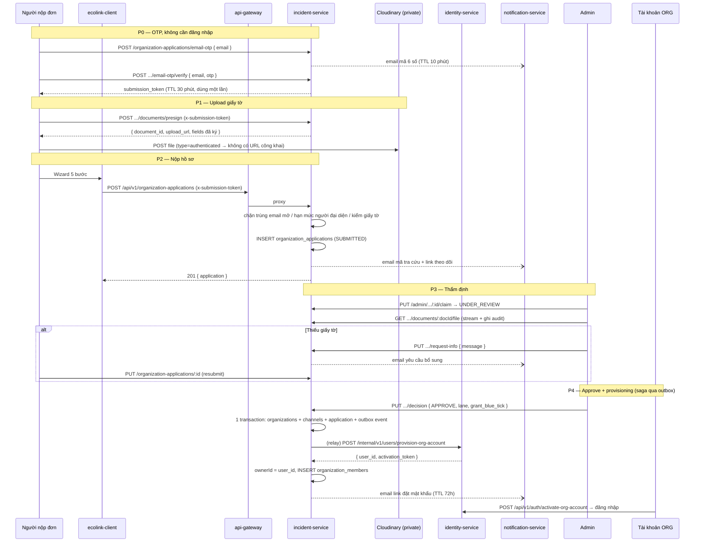

# 🏢 Flow tạo Organization (Tổ chức)

> Tài liệu mô tả **hiện trạng (as-is)** của luồng đăng ký tổ chức trên Ecolink sau đợt refactor
> theo `REFACTOR_ORG_CREATION_FLOW.md`, tính đến **2026-09-22**.
> Mọi đường dẫn file được ghi tương đối từ thư mục gốc `ecolink/`.

---

## 📌 Tóm tắt

Tổ chức **không còn được tạo trực tiếp**. Người dùng (kể cả chưa đăng nhập) nộp một
**hồ sơ đăng ký** (`organization_applications`); chỉ khi admin duyệt, hệ thống mới sinh ra
bản ghi trong `organizations` **và một tài khoản đăng nhập riêng cho tổ chức**
(`accountType = ORG`).

Hệ quả: bảng `organizations` chỉ chứa tổ chức đã được duyệt, không còn bản ghi rác ở `PENDING`.

### Năm trục trạng thái độc lập

| Trục | Trường | Giá trị | Ai điều khiển |
| --- | --- | --- | --- |
| Vòng đời tổ chức | `organizations.status` | `ACTIVE(1)` / `INACTIVE(2)` | Admin |
| Sở hữu hòm mail | `organizations.isEmailVerified` | bool | **Kế thừa từ OTP lúc nộp đơn** |
| Loại chủ thể | `organizations.orgType` | `GOV`/`SCHOOL`/`CLUB`/`NGO`/`SOCIAL_ENTERPRISE` | User khai, admin xác nhận |
| Hồ sơ pháp lý | `organizations.kycStatus` | `NOT_SUBMITTED`/`APPROVED`/`EXPIRED`/`REVOKED` | Admin, qua hồ sơ |
| Mức tin cậy (Blue Tick) | `organizations.trustTier` | `NONE`/`BASIC`/`VERIFIED` | Admin |

> **`kycStatus = APPROVED` ≠ có Blue Tick.** Giấy tờ hợp lệ không tự động sinh đặc quyền;
> `trustTier = VERIFIED` mới là tick. Lane B có thể ở `APPROVED` nhiều tháng mà `trustTier = NONE`.

---

## 🗺️ Sơ đồ luồng



---

## 🧭 Bản đồ thành phần

| Lớp | Đường dẫn |
| --- | --- |
| Wizard công khai | `ecolink-client/app/(pages)/(main)/organizations/apply/` |
| Trang theo dõi hồ sơ | `.../organizations/apply/status/page.tsx` |
| API client | `ecolink-client/apis/organization-application/` |
| Màn thẩm định | `ecolink-client/app/(pages)/(admin)/admin/organization-applications/` |
| Gateway | `ecolink-server/api-gateway/src/index.ts:170` |
| Backend hồ sơ | `ecolink-server/services/incident-service/src/modules/organization_application/` |
| Saga provisioning | `.../organization_application/organization-account-provision.publisher.ts` |
| Tài khoản ORG | `ecolink-server/services/identity-service/src/internal/internal.routes.ts` |
| Email | `ecolink-server/services/notification-service/templates/notifications/ORG_*` |
| Schema DB | `ecolink-server/services/incident-service/prisma/schema.prisma` |

---

# Phần 1 — Flow nghiệp vụ

### Bước 1 — Xác minh hòm mail (không cần tài khoản)

Vào `/organizations/apply`, nhập **email liên hệ** → nhận mã 6 số → nhập mã.
Mã có hiệu lực **10 phút**, sai tối đa **5 lần**, giới hạn **3 mã / email / giờ** và
**10 mã / IP / giờ**. Đổi mã đúng lấy một `submission_token` (30 phút, dùng một lần) —
đây là "giấy thông hành" cho toàn bộ các bước sau.

> Địa chỉ này về sau vừa là **email liên hệ công khai**, vừa là **tài khoản đăng nhập của tổ chức**.

### Bước 2 — Hồ sơ tổ chức

Loại hình (bắt buộc), tên (bắt buộc), địa chỉ, mô tả, **logo** và ảnh bìa.
Chọn `SCHOOL`/`GOV` chỉ hiện *gợi ý* rằng admin có thể miễn giấy tờ — **không** bỏ qua bước upload.

### Bước 3 — Kênh chính thức & người đại diện

Ít nhất **một kênh** (Fanpage / Website / Zalo OA) — hiển thị công khai.
Người đại diện pháp lý (tên, loại + số giấy tờ, điện thoại) — **chỉ dùng để thẩm định**,
không bao giờ hiển thị công khai.

### Bước 4 — Giấy tờ pháp lý

Tối đa **5 tệp**, mỗi tệp **≤ 10 MB**, chỉ `pdf | jpg | png`. Tệp đi thẳng lên kho riêng tư.

### Bước 5 — Kiểm tra & nộp

Bắt buộc tick **đồng ý xử lý dữ liệu cá nhân**. Nộp xong nhận **mã tra cứu** và
**link theo dõi** qua email (hiệu lực 180 ngày, dùng lại được).

### Bước 6 — Admin thẩm định

Tại `/admin/organization-applications`:

- **Claim** → `UNDER_REVIEW` (hai admin không đụng nhau).
- **Request more information** → `NEEDS_MORE_INFO`; người nộp sửa rồi resubmit → `SUBMITTED`.
- **Reject** → bắt buộc lý do.
- **Approve** → chọn **lane A** (duyệt nhanh) hoặc **lane B** (tiêu chuẩn), tuỳ chọn
  **miễn giấy tờ** (bắt buộc nhập lý do) và **cấp Blue Tick**.

Màn hình hiển thị `contact_email` **tách rõ phần trước và sau dấu `@`** ngay đầu hồ sơ, vì
tên miền là thứ quyết định lane A.

### Bước 7 — Tổ chức và tài khoản ORG ra đời

Approve sinh ra tổ chức (`ACTIVE`, `kycStatus = APPROVED`, `isEmailVerified` kế thừa từ OTP)
và lên lịch tạo **một tài khoản đăng nhập riêng**. Email kích hoạt (TTL 72h) gửi tới email
liên hệ, CC email cá nhân người đại diện nếu có. **Không gửi mật khẩu tạm.**

### Vòng đời hồ sơ

```
SUBMITTED ──claim──> UNDER_REVIEW ──decision──> APPROVED | REJECTED
     ▲                     │
  resubmit                 └──request-info──> NEEDS_MORE_INFO ──┐
     └─────────────────────────────────────────────────────────┘
WITHDRAWN ← người nộp tự rút, từ bất kỳ trạng thái mở nào
```

### ⚠️ Ba điểm dễ hiểu nhầm

1. **Mặc định mọi hồ sơ phải nộp giấy tờ.** Việc tự khai `orgType = SCHOOL` không miễn gì cả —
   nếu không, ai dùng Gmail cũng khai SCHOOL. Chỉ admin bấm miễn, và **bắt buộc nhập lý do**,
   lý do đó được ghi vào `organization_application_events`.
2. **Không auto-detect tên miền.** Không có whitelist, không có regex. `.edu.vn` do VNNIC cấp
   cho cả cá nhân lẫn tổ chức, nên whitelist vừa không kín vừa tạo ảo giác an toàn.
3. **Một tài khoản đăng nhập duy nhất cho tổ chức.** Người nộp đơn (kể cả khi chính là người
   đại diện) **không** có quyền gì sau khi duyệt.

---

# Phần 2 — Chi tiết kỹ thuật

## 2.1 API

| Method | Endpoint | Quyền |
| --- | --- | --- |
| POST | `/api/v1/organization-applications/email-otp` | public, rate-limited |
| POST | `/api/v1/organization-applications/email-otp/verify` | public |
| POST | `/api/v1/organization-applications/documents/presign` | `x-submission-token` |
| POST | `/api/v1/organization-applications` | `x-submission-token` |
| GET | `/api/v1/organization-applications/:id?token=` | link tra cứu |
| PUT | `/api/v1/organization-applications/:id?token=` | chỉ khi `NEEDS_MORE_INFO` |
| POST | `/api/v1/organization-applications/:id/withdraw?token=` | người nộp |
| GET | `/api/v1/admin/organization-applications` | admin |
| GET | `/api/v1/admin/organization-applications/:id` | admin |
| GET | `.../:id/documents/:docId/file` | admin, **ghi audit mỗi lượt xem** |
| PUT | `.../:id/claim` \| `.../:id/request-info` \| `.../:id/decision` | admin |
| POST | `/internal/v1/users/provision-org-account` | internal (identity) |
| POST | `/api/v1/auth/activate-org-account` | public, token một lần |
| POST | `/api/v1/organizations` | **internal-only** (`x-internal-api-key`) |

## 2.2 Frontend

`ecolink-client/app/(pages)/(main)/organizations/apply/` theo đúng pattern
`_context` + `FormProvider` + `_services` + `_hooks` của repo.

- `_context/ApplicationContext.tsx` — RHF, state bước, `submissionToken`, upload, submit.
- `_services/application.service.ts` — form values + `toCreateApplicationRequest()`.
- `_components/Step{Email,Profile,Contact,Documents,Review}.tsx`.
- `/organizations/create` → **redirect** sang `/organizations/apply`.
- `libs/axiosClient.ts` — `/api/v1/organization-applications` nằm trong `PUBLIC_AUTH_PATHS`
  nên 401 (token hết hạn) **không** đá người dùng ẩn danh về `/sign-in`.
- `src/layouts/AdminLayout.tsx` — guard mới cho toàn bộ `/admin` (chờ `has_hydrated` rồi mới quyết).
- `components/ui/BlueTickBadge.tsx` — badge dựa trên `trust_tier`, ẩn khi `tick_suspended`.

**Logo/ảnh bìa vẫn đi Cloudinary public preset; chỉ giấy tờ pháp lý đi kho riêng tư.**

## 2.3 Backend — module `organization_application`

`ecolink-server/services/incident-service/src/modules/organization_application/`

| File | Vai trò |
| --- | --- |
| `organization-application-otp.service.ts` | Sinh/kiểm OTP (lưu **hash**), phát `submission_token` và `tracking token` |
| `organization-application.service.ts` | Presign giấy tờ, nộp/sửa/rút hồ sơ, các ràng buộc nghiệp vụ |
| `organization-application-admin.service.ts` | Danh sách, claim, request-info, decision (**saga bước 1**) |
| `organization-account-provision.publisher.ts` | **Saga bước 2**: gọi identity, gắn owner, gửi email kích hoạt |
| `identity-org-account.client.ts` | HTTP client + circuit breaker sang identity-service |
| `storage/cloudinary-document-storage.ts` | Ký upload `type=authenticated`, stream file về cho admin |
| `submission-token.middleware.ts` | Guard cho các endpoint công khai |

### Ràng buộc nghiệp vụ

- `profile.contact_email` **phải khớp** hòm mail đã xác thực (token gắn với đúng một địa chỉ).
- Một `contact_email` chỉ có **một hồ sơ đang mở**.
- Một người đại diện đứng tên tối đa **3 tổ chức**, đếm theo `legal_rep_id_hash` gồm cả hồ sơ
  đang mở lẫn đã duyệt. Admin nâng hạn mức qua `organizations.legalRepLimitOverride`.
  ⚠️ Không kín: cùng một người khai hai số giấy tờ sẽ ra hai hash.
- Không có giấy tờ **và** không miễn → không duyệt được.

### Saga provisioning — vì sao dùng outbox

Approve ghi vào **hai database khác nhau**. Thay vì viết cron retry riêng, saga tái dùng
**transactional outbox** đã có (`outbox_events` + `OutboxRelay`):

1. **Một transaction**: `organizations` + `organization_channels` + cập nhật hồ sơ +
   `emitOutbox(ORG_ACCOUNT_PROVISION)` — không có khoảnh khắc nào tổ chức tồn tại mà chưa có
   gì lên lịch tạo tài khoản cho nó.
2. `RoutingOutboxPublisher` (`src/outbox/outbox-publisher.ts`) định tuyến theo `eventType`:
   event thưởng → SQS reward, event provisioning → handler gọi identity.
3. Identity **idempotent theo `applicationId`** (`users.provisioned_from_application_id` unique),
   nên relay retry không tạo tài khoản trùng.
4. Lỗi → ném ra, relay giữ event `PENDING` và retry với backoff mũ. **Không rollback tổ chức.**
   Màn admin hiện cảnh báo đỏ khi `APPROVED` mà `account_provisioned_at IS NULL`.

## 2.4 Bảo vệ dữ liệu cá nhân

- Số CCCD/MSSV: lưu **sha256 + 4 ký tự cuối**, không lưu số thô (`legal_rep_id_hash`,
  `legal_rep_id_last4`).
- Giấy tờ: Cloudinary `type=authenticated` → không có URL công khai. Admin xem qua endpoint
  proxy của chính API, mỗi lượt ghi `DOCUMENT_VIEWED` vào `organization_application_events`.
- `legal_rep_*` **không** xuất hiện ở bất kỳ endpoint public nào và **không** được copy sang
  bảng `organizations` khi duyệt.
- Form có checkbox đồng ý, lưu `consented_at`.

> ⏳ **Chưa làm**: job `application-purge` xoá giấy tờ + `legal_rep_*` sau 90 ngày
> (cột `purged_at` đã có sẵn, chưa có writer).

## 2.5 Data model

Bảng mới: `organization_applications`, `organization_application_documents`,
`organization_application_events`, `organization_application_otps`, `organization_channels`,
`organization_violations`.

Thay đổi trên `organizations`: thêm `org_type`, `kyc_status`, `trust_tier`, `tick_suspended`,
`domain_verified`, `verified_at/by`, `verification_expires_at`, `tick_revoked_reason`,
`profile_completeness`, `successful_campaign_count`, `violation_count`, `address`,
`application_id`, `legal_rep_limit_override`; **`owner_id` → NULLABLE**;
**`status` default `12` → `1`**.

Thay đổi trên `users` (identity): thêm `account_type`, `provisioned_from_application_id` (unique),
**`password` → nullable**, `UserStatus.PENDING_ACTIVATION = 3` (bị chặn đăng nhập).

### Migration

```
incident-service:
  20260922100000_organization_applications
  20260922100500_organization_application_documents
  20260922101000_organization_application_events
  20260922101500_organization_application_otps
  20260922102000_organization_channels
  20260922102500_organization_violations
  20260922103000_organizations_trust_fields
  20260922103500_organizations_owner_id_nullable
  20260922104000_organizations_status_default_active
  20260922104500_truncate_legacy_organizations   ← ⚠️ DESTRUCTIVE
identity-service:      20260922100000_user_org_accounts
notification-service:  20260922100000_notification_org_application_kinds
```

> ⚠️ `20260922104500_truncate_legacy_organizations` dùng `TRUNCATE ... CASCADE`, lan sang
> **mọi bảng tham chiếu**: campaigns và toàn bộ bảng con, **reports**, votes, saved_resources,
> media links. Chạy xong phải `npm run prisma:seed` lại. Chi tiết trong file migration.

## 2.6 Phạm vi chưa làm (P5)

Cột `trust_tier` / `kyc_status` / `tick_suspended` đã ghi dữ liệu và badge đã hiển thị, nhưng
**Blue Tick chưa mang đặc quyền nào**: chưa nối vào `campaign`, chưa có
`evaluateBlueTickEligibility()`, chưa có cron sweep, chưa có writer cho
`organization_violations`. Lane B hiện admin cấp tick **thủ công**.

---

# Phần 3 — Kiểm thử thủ công

### Chuẩn bị

```bash
# ecolink-server/
docker compose up -d                 # LocalStack (SQS)
npm run dev                          # gateway + identity + incident + notification
npm run dev:worker                   # relay outbox (bắt buộc cho provisioning)

# ecolink-client/
npm run dev
```

Biến môi trường then chốt:

| Nơi | Biến |
| --- | --- |
| incident-service | `CLOUDINARY_CLOUD_NAME/API_KEY/API_SECRET`, `INTERNAL_INCIDENT_API_KEY`, `IDENTITY_SERVICE_URL`, `INTERNAL_IDENTITY_API_KEY`, `NOTIFICATION_SERVICE_URL`, `INTERNAL_NOTIFICATION_API_KEY`, `FRONTEND_APP_URL` |
| identity-service | `ORG_ACCOUNT_ACTIVATION_TTL_MS` (mặc định 72h) |
| notification-service | `SMTP_HOST/PORT/SECURE/USER/PASS/FROM` — xem hướng dẫn trong `.env.example` |

> ⚠️ **Toàn bộ flow này chạy bằng email**, nên `notification-service` phải chạy **cả hai tiến
> trình**: `npm run dev` (API, cổng 3003 — nơi nhận job) và `npm run dev:worker` (worker — nơi
> gửi thật). Thiếu API thì `POST /email-otp` trả **503**; thiếu worker thì trả 200 nhưng mã
> không bao giờ được gửi.
>
> `SMTP_HOST` để trống thì không có mail nào rời khỏi máy, nhưng row vẫn được lưu — lấy mã bằng:
> ```sql
> select body, created_at from notifications
> where kind = 'ORG_APPLICATION_OTP' order by created_at desc limit 1;
> ```

### Kịch bản

1. Chưa đăng nhập → `/organizations/apply` → nhập email → lấy mã trong log
   notification-service → xác minh → điền hồ sơ → upload 1 PDF → nộp.
2. Kiểm tra `GET /api/v1/organization-applications/:id?token=` **không** chứa `legal_rep_*`.
3. Đăng nhập admin → `/admin/organization-applications` → **Claim** → mở giấy tờ →
   kiểm tra có dòng `DOCUMENT_VIEWED` trong `organization_application_events`.
4. **Request more information** → mở link tra cứu → resubmit → trạng thái về `SUBMITTED`.
5. **Approve** lane A + miễn giấy tờ (nhập lý do) + cấp tick.
6. Kiểm DB:
   ```sql
   select status, kyc_status, trust_tier, owner_id, application_id from organizations order by created_at desc limit 1;
   select status, processed_at from outbox_events where event_type = 'ORG_ACCOUNT_PROVISION';
   ```
7. Mở link kích hoạt → đặt mật khẩu → đăng nhập bằng tài khoản ORG.
8. **Test saga**: tắt identity-service rồi approve hồ sơ khác → tổ chức vẫn được tạo,
   `account_provisioned_at` NULL, màn admin hiện cảnh báo đỏ; bật lại → relay tự hoàn tất.
9. `POST /api/v1/organizations` bằng token user thường → `401`.
