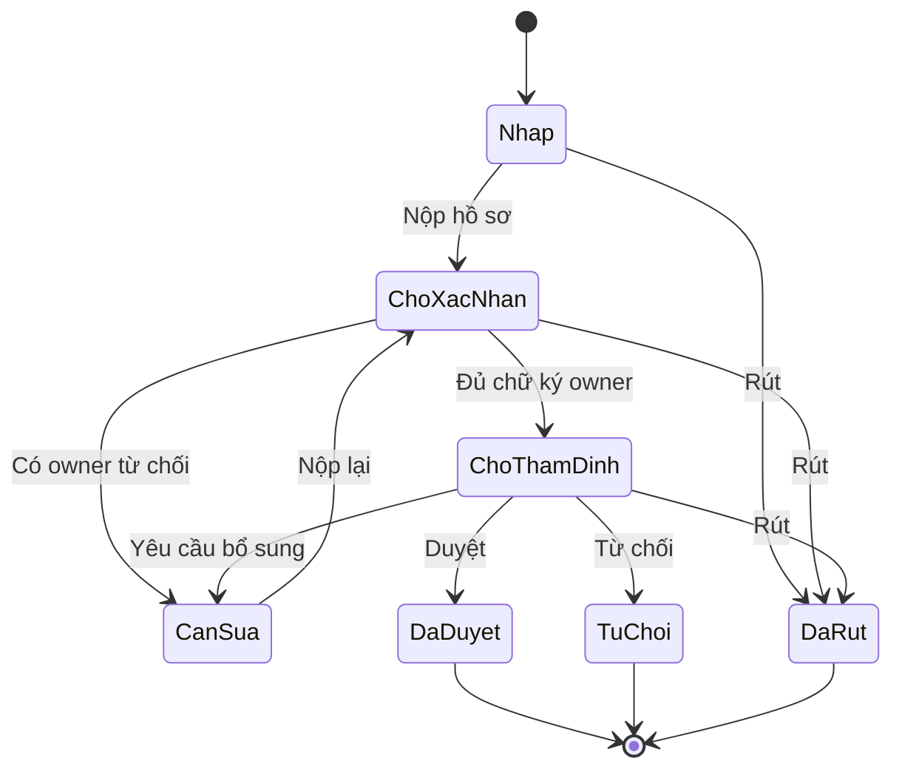
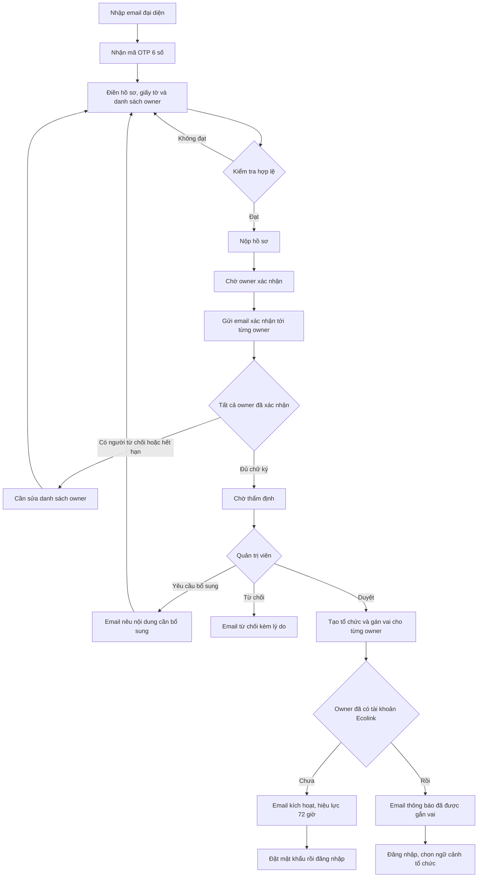
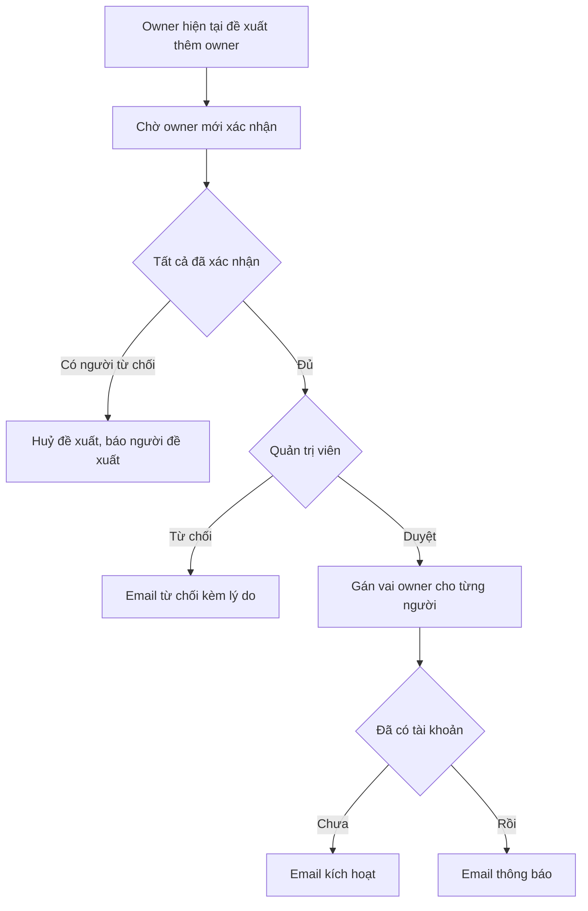

# Luồng đăng ký tổ chức và gán vai Owner — Thiết kế mới

Sep 26, 2026 · @Minh

> **Trạng thái triển khai (2026-09-26): Phase 1 đã có trong code.** Tài liệu này thay thế mục 4.3 cũ và thiết kế "một tài khoản ORG duy nhất" trong `REFACTOR_ORG_CREATION_FLOW.md`. Mô tả as-is chi tiết: `ORG_CREATION_FLOW.md`, `02-business-flows.md` (F10–F14), `03-business-rules.md`, `04-state-machines.md` §7.
>
> **Đã làm (Phase 1):** mô hình `OrgMembership` có `role`, bỏ tài khoản `accountType = ORG`, hồ sơ `NEW_ORG` nhiều owner, email xác nhận từng owner, nộp lại / rút, duyệt tạo membership, hai nhánh email (kích hoạt / "đã gắn vai"), tự gửi lại email kích hoạt từ trang đăng nhập.
>
> **Ngoài phạm vi Phase 1 [CHƯA HOÀN THIỆN]:** hồ sơ `ADD_OWNER` (cột `type` đã có sẵn), invitation nhẹ cho `ADMIN` / `CAMPAIGN_MANAGER` / `MEMBER`, bộ chọn ngữ cảnh tổ chức, luồng đi ra (thu hồi owner, owner tự rời, chuyển giao), vòng đời riêng của dấu tích xanh.
>
> **Điều chỉnh cho kiến trúc microservice** (tài liệu gốc viết như thể chỉ có một DB):
> - `User` nằm ở identity-service; `Organization`, hồ sơ và membership nằm ở incident-service. `OrgMembership` = bảng `organization_members` sẵn có, thêm cột `role`.
> - Không thể `SELECT … FOR UPDATE` bảng `User` từ incident, nên trần 3 tổ chức được chống race bằng `pg_advisory_xact_lock(hashtextextended(userId, 0))` trong DB incident (nơi đếm membership).
> - User không được tạo trong transaction duyệt: incident gọi identity `POST /internal/v1/users/ensure` (find-or-create, idempotent theo email) **trước** transaction.
> - Email xác nhận owner gửi sau commit (không qua outbox); email onboarding sau duyệt đi qua outbox `ORG_OWNER_ONBOARD`.
> - Hết hạn 14 ngày do một sweeper chạy mỗi giờ trong worker incident; chuyển sang `PENDING_REVIEW` vẫn nằm trong transaction của lần xác nhận cuối.
> - `membershipVersion` **chưa làm**: JWT không mang membership, incident đọc membership trực tiếp mỗi request. Để lại cho Phase 2 cùng bộ chọn ngữ cảnh.
> - Bất biến 1 được bảo vệ bằng constraint trigger `DEFERRABLE INITIALLY DEFERRED` (xem `01-data-model.md`).

## Tóm tắt

Tài liệu mô tả luồng đăng ký tổ chức mới, thay thế mục 4.3 trong tài liệu hiện hành. Thay đổi lớn nhất: tổ chức có thể có nhiều owner, và mỗi owner phải tự xác nhận trước khi quản trị viên được phép duyệt.

### Ba vấn đề của luồng cũ

**1. Gộp pháp nhân với người đăng nhập.** Luồng cũ tạo "tài khoản tổ chức" từ email liên hệ trong hồ sơ, nên hệ thống coi tổ chức như một người dùng. Ba edge case trong tài liệu cũ đều là triệu chứng của việc này chứ không phải ba vấn đề riêng: email liên hệ đã có tài khoản thì phải xử lý thủ công; đếm "đã đứng tên 3 tổ chức" thì cần một khái niệm "người" tách khỏi "tổ chức"; và thành viên tổ chức không tạo được chiến dịch dù họ mới là người thực hiện.

**2. Không truy vết được người thật.** Nếu tài khoản tổ chức là một entity đăng nhập chung, audit log chỉ ghi được "tổ chức X đã làm gì", không bao giờ biết ai trong tổ chức đã bấm nút. Với hành động có hậu quả như chốt mức khó chiến dịch hay nộp tổng kết nghiệm thu, đây là lỗ hổng không chấp nhận được.

**3. Không có bằng chứng đồng thuận.** Một người có thể bị ghi tên làm đại diện tổ chức mà không hề biết.

### Bốn thay đổi

| Thay đổi | Nội dung |
| --- | --- |
| Tách danh tính khỏi vai trò | `User` luôn là một con người. `Organization` không đăng nhập. Quan hệ giữa hai bên là `OrgMembership` |
| Nhiều owner | Hồ sơ nộp kèm danh sách owner, mỗi người một vai cụ thể |
| Bắt buộc xác nhận | Mỗi owner nhận email riêng và phải tự bấm xác nhận. Đủ chữ ký mới vào hàng chờ thẩm định |
| Thêm owner sau này | Đi qua một hồ sơ loại `ADD_OWNER`, nhẹ hơn nhưng vẫn cần xác nhận và thẩm định |

### Nguyên tắc xuyên suốt

Không bao giờ gán quyền cho một `User` mà không có bằng chứng người đó đồng ý. Đây là thứ quyết định phần lớn các lựa chọn thiết kế bên dưới, kể cả những chỗ nhìn qua có vẻ thừa.

## Sơ đồ

### Vòng đời hồ sơ

Sơ đồ này khớp 1-1 với enum `AppStatus` trong code, nên khi ai đó sửa luồng thì rất khó để tài liệu lệch khỏi thực tế.



### Luồng chi tiết



Ba ô cần đọc kỹ:

- **`V` kiểm tra hợp lệ** xảy ra **trước khi gửi email**. Trần 3 tổ chức, tài khoản bị đình chỉ, email trùng — tất cả phải hỏng ở đây. Báo hỏng sau 14 ngày chờ xác nhận là trải nghiệm rất tệ.
- **`Q` là hệ thống tự làm**, không phải ai bấm nút. Nó chạy ngay trong transaction của lần xác nhận cuối cùng, không phải một job quét định kỳ.
- **`T` tách hai nhánh email**. Đây là chỗ giải quyết edge case "email liên hệ đã có tài khoản Ecolink" của luồng cũ.

Hai điều sơ đồ cố tình không vẽ, vì sẽ làm rối: các mốc thời hạn (xem mục Thời hạn) và việc rút hồ sơ ở từng trạng thái (đã có trong sơ đồ trạng thái phía trên).

### Luồng thêm owner



## Mô hình dữ liệu

```prisma
model OrgApplication {
  id             String   @id @default(uuid())
  type           AppType  // NEW_ORG | ADD_OWNER
  orgId          String?  // chỉ có với ADD_OWNER

  // Hồ sơ tổ chức (chỉ với NEW_ORG)
  name           String?
  orgType        String?
  contactEmail   String?
  // ... logo, mô tả, địa chỉ, kênh chính thức, giấy tờ

  submitterEmail String              // email đã qua OTP ở bước 1
  status         AppStatus
  trackingToken  String   @unique    // link theo dõi, 180 ngày

  owners         OwnerCandidate[]

  submittedAt    DateTime?
  decidedBy      String?
  decidedAt      DateTime?
  decisionNote   String?

  @@index([status, submittedAt])
}
```

```prisma
model OwnerCandidate {
  id            String   @id @default(uuid())
  applicationId String
  application   OrgApplication @relation(fields: [applicationId], references: [id])

  email         String
  fullName      String
  nationalIdRef String?             // tham chiếu giấy tờ đã nộp
  isLegalRep    Boolean  @default(false)

  status        CandidateStatus     // PENDING | CONFIRMED | DECLINED | EXPIRED
  confirmToken  String   @unique    // lưu sha256, gửi bản gốc qua email
  expiresAt     DateTime
  sentAt        DateTime?
  sentCount     Int      @default(0)
  respondedAt   DateTime?
  declineReason String?

  // Chụp lại tại thời điểm xác nhận, để truy vết
  confirmIp     String?
  confirmUA     String?

  resolvedUserId String?            // điền lúc duyệt

  @@unique([applicationId, email])
  @@index([email, status])
}
```

```prisma
enum AppStatus {
  DRAFT
  AWAITING_OWNER_CONFIRMATION   // đã nộp, đang chờ owner xác nhận
  PENDING_REVIEW                // đủ chữ ký, vào hàng chờ admin
  NEEDS_REVISION                // admin yêu cầu bổ sung, hoặc có owner từ chối
  APPROVED
  REJECTED
  WITHDRAWN
}
```

### Điểm thiết kế quan trọng nhất

`PENDING_REVIEW` **chỉ đạt được khi mọi candidate đã `CONFIRMED`**. Quản trị viên không nhìn thấy hồ sơ trong hàng chờ trước thời điểm đó.

Nghĩa là ràng buộc "xác nhận hết mới được duyệt" được đảm bảo ở **tầng trạng thái**, không phải bằng một câu `if` trong handler duyệt — nơi rất dễ bị quên khi ai đó thêm endpoint mới sau này.

### Vòng đời

| Trạng thái | Chuyển sang | Do ai / điều kiện |
| --- | --- | --- |
| `DRAFT` | `AWAITING_OWNER_CONFIRMATION` | Người nộp bấm "Nộp hồ sơ" |
| `AWAITING_OWNER_CONFIRMATION` | `PENDING_REVIEW` | Hệ thống, khi candidate cuối cùng xác nhận |
| `AWAITING_OWNER_CONFIRMATION` | `NEEDS_REVISION` | Hệ thống, khi có candidate từ chối hoặc hết hạn |
| `PENDING_REVIEW` | `APPROVED` / `REJECTED` / `NEEDS_REVISION` | Quản trị viên |
| `NEEDS_REVISION` | `AWAITING_OWNER_CONFIRMATION` | Người nộp sửa rồi nộp lại |
| bất kỳ (trước quyết định) | `WITHDRAWN` | Người nộp |

### Quan hệ với mô hình danh tính

Hồ sơ chỉ là **đầu vào**. Kết quả của việc duyệt là các bản ghi trong mô hình danh tính chính:

- `User` — một con người, không có trường `type` hay `isOrganization`
- `Organization` — pháp nhân, không đăng nhập, `contactEmail` chỉ để liên hệ
- `OrgMembership` — `(userId, orgId, role)`, với role `LEGAL_REPRESENTATIVE | OWNER | ADMIN | CAMPAIGN_MANAGER | MEMBER`

Sự khác biệt giữa "tài khoản tổ chức" và "tài khoản công dân" không nằm ở `User`, mà ở chỗ user đó có `OrgMembership` hay không. Một người vừa báo cáo điểm rác vừa làm đại diện CLB là hoàn toàn hợp lệ.

## Bước 1 — Nộp hồ sơ

Giữ nguyên hai bước đầu của luồng cũ: nhập email đại diện, nhận mã OTP 6 số hiệu lực 10 phút. Thay đổi bắt đầu từ form hồ sơ.

### Thêm vào form: danh sách owner

Mỗi dòng gồm email, họ tên, có phải người đại diện pháp lý không, và tuỳ chọn trỏ tới giấy tờ đã upload.

```typescript
function validateOwnerList(owners: OwnerInput[], submitterEmail: string) {
  if (owners.length === 0) throw new BadRequest('AT_LEAST_ONE_OWNER');
  if (owners.length > 5)   throw new BadRequest('TOO_MANY_OWNERS');

  const emails = owners.map(o => o.email.toLowerCase().trim());
  if (new Set(emails).size !== emails.length)
    throw new BadRequest('DUPLICATE_OWNER_EMAIL');

  // Người nộp (đã qua OTP) phải nằm trong danh sách owner.
  // Nếu không, ai đó đang lập tổ chức rồi trao quyền cho người khác
  // mà bản thân không chịu trách nhiệm gì.
  if (!emails.includes(submitterEmail.toLowerCase()))
    throw new BadRequest('SUBMITTER_MUST_BE_OWNER');

  if (owners.filter(o => o.isLegalRep).length !== 1)
    throw new BadRequest('EXACTLY_ONE_LEGAL_REP');
}
```

Ràng buộc `SUBMITTER_MUST_BE_OWNER` đáng giữ vì hai lý do: email người nộp đã qua OTP nên xác nhận của họ có thể đánh dấu tự động, và nó đảm bảo luôn có ít nhất một người chịu trách nhiệm ngay từ đầu.

### Kiểm tra chặn sớm

Ba kiểm tra dưới đây phải chạy **trước khi gửi email**, để người nộp sửa ngay thay vì chờ 14 ngày rồi mới biết hỏng.

```typescript
for (const o of owners) {
  const user = await prisma.user.findUnique({ where: { email: o.email } });

  if (user?.status === 'SUSPENDED')
    throw new BadRequest(`OWNER_SUSPENDED:${o.email}`);

  // Trần 3 tổ chức: kiểm tra sớm ở đây, kiểm tra lại lúc duyệt
  if (user) {
    const n = await prisma.orgMembership.count({
      where: { userId: user.id, role: 'OWNER', status: 'ACTIVE' },
    });
    if (n >= 3) throw new BadRequest(`OWNER_QUOTA_EXCEEDED:${o.email}`);
  }

  // Email này đang là candidate của bao nhiêu hồ sơ chưa xong?
  const pending = await prisma.ownerCandidate.count({
    where: {
      email: o.email, status: 'PENDING',
      application: {
        status: { in: ['AWAITING_OWNER_CONFIRMATION', 'PENDING_REVIEW'] },
      },
    },
  });
  if (pending >= 2) throw new BadRequest(`TOO_MANY_PENDING_INVITES:${o.email}`);
}
```

Kiểm tra cuối là **chống spam**. Không có nó, bất kỳ ai cũng có thể dội email một người bằng cách liệt kê họ làm owner trong hàng loạt hồ sơ rác.

### Bản nháp và link theo dõi

Luồng cũ cho người nộp 30 phút để hoàn thành hồ sơ sau khi nhập OTP. Giờ họ còn phải thu thập email và tên của nhiều owner, nên 30 phút là quá gấp.

Đề xuất: cho lưu `DRAFT` và quay lại sau, và **cấp link theo dõi ngay từ lúc xác thực OTP** thay vì lúc nộp. Đây là một trong các câu hỏi cần chốt ở cuối tài liệu.

## Bước 2 — Email xác nhận owner

### Nội dung email

Mỗi candidate nhận một email riêng, chứa **tóm tắt hồ sơ** để họ biết mình đang đồng ý vào việc gì:

- Tên tổ chức, loại tổ chức, địa chỉ
- Ai là người nộp
- Danh sách toàn bộ owner khác — minh bạch, vì họ cần biết mình đứng chung với ai
- Vai của chính họ: owner, và có phải người đại diện pháp lý không
- Nút **"Xác nhận"** và nút **"Tôi không liên quan"**
- Hạn xác nhận

Nút "Tôi không liên quan" quan trọng không kém nút xác nhận: nó vừa cho candidate một lối thoát, vừa là tín hiệu để phát hiện hồ sơ gian lận. Nên ghi nhận kèm tuỳ chọn "và chặn email tôi khỏi mọi lời mời tương lai".

### Token và thời hạn

```typescript
const raw = crypto.randomBytes(32).toString('base64url');
await tx.ownerCandidate.update({
  where: { id: candidate.id },
  data: {
    confirmToken: sha256(raw),        // lưu hash, gửi bản gốc
    sentAt:    new Date(),
    sentCount: { increment: 1 },
    expiresAt: addDays(new Date(), 14),
  },
});
// gửi email qua outbox, sau khi commit
```

**Hạn 14 ngày.** Dài hơn OTP 10 phút rất nhiều vì candidate có thể đang đi công tác, và hỏng hạn thì cả hồ sơ phải làm lại. Cho phép người nộp bấm "gửi lại" — tối đa 3 lần mỗi candidate, cách nhau 1 giờ — mỗi lần sinh token mới và vô hiệu token cũ.

### Xác nhận không cần đăng nhập

Candidate có thể chưa có tài khoản, nên trang xác nhận phải mở được bằng token đơn thuần. Nghĩa là **sở hữu email chính là bằng chứng đồng thuận**, giống cơ chế của mọi luồng invitation.

Với candidate đã có tài khoản và đang đăng nhập, thêm một lớp: so email phiên đăng nhập với email candidate, lệch thì cảnh báo rõ chứ đừng im lặng xác nhận nhầm người.

```typescript
async function confirmOwnership(rawToken: string, req: Request) {
  return prisma.$transaction(async (tx) => {
    const c = await tx.ownerCandidate.findUnique({
      where: { confirmToken: sha256(rawToken) },
      include: { application: true },
    });

    if (!c) throw new NotFound();
    if (c.status === 'CONFIRMED') return { alreadyDone: true };   // idempotent
    if (c.status === 'DECLINED')  throw new Conflict('ALREADY_DECLINED');
    if (c.expiresAt < new Date()) throw new Gone('CONFIRM_EXPIRED');
    if (!['AWAITING_OWNER_CONFIRMATION', 'NEEDS_REVISION']
          .includes(c.application.status))
      throw new Conflict('APPLICATION_NOT_ACTIVE');

    await tx.ownerCandidate.update({
      where: { id: c.id },
      data: {
        status: 'CONFIRMED', respondedAt: new Date(),
        confirmIp: req.ip, confirmUA: req.get('user-agent'),
      },
    });

    // Còn ai chưa trả lời không?
    const remaining = await tx.ownerCandidate.count({
      where: { applicationId: c.applicationId, status: 'PENDING' },
    });

    if (remaining === 0) {
      await tx.orgApplication.update({
        where: { id: c.applicationId },
        data:  { status: 'PENDING_REVIEW', submittedAt: new Date() },
      });
      await tx.outbox.create({ data: {
        topic: 'application.ready_for_review',
        payload: { applicationId: c.applicationId },
      }});
    }

    await writeAudit(tx, systemCtx(), {
      action: 'org_application.owner_confirmed',
      resourceType: 'OwnerCandidate', resourceId: c.id,
      result: 'SUCCESS',
      changes: { status: { before: 'PENDING', after: 'CONFIRMED' } },
    });

    return { remaining };
  });
}
```

### Vì sao lưu IP và user-agent

Nếu sau này có tranh chấp *"tôi không hề đồng ý làm đại diện"*, `confirmIp` và `confirmUA` là bằng chứng duy nhất bạn có. Chúng cũng hữu ích cho quản trị viên khi thẩm định — xem mục tiếp theo.

## Bước 3 — Giao diện theo dõi

### Trang của người nộp

Dùng lại `trackingToken` 180 ngày đã có trong luồng cũ. Bổ sung bảng trạng thái owner:

| Owner | Trạng thái | Hành động |
| --- | --- | --- |
| an@clb.vn (bạn) | Đã xác nhận, 25/09 | — |
| binh@gmail.com | Chờ xác nhận, còn 11 ngày | Gửi lại (2/3) |
| chi@gmail.com | Đã từ chối, 24/09 | Thay người khác |

Kèm thanh tiến trình `2/3 đã xác nhận` và một dòng trạng thái tổng:

> Hồ sơ sẽ vào hàng chờ thẩm định khi tất cả owner xác nhận.

Câu này cần thiết vì nếu không, người nộp sẽ không hiểu vì sao hồ sơ "đã nộp" mà chưa thấy quản trị viên xử lý.

### Trang thẩm định của quản trị viên

Hồ sơ chỉ xuất hiện trong hàng chờ khi `status = PENDING_REVIEW`, nên nút Duyệt mặc định đã an toàn. Nhưng vẫn hiển thị đầy đủ để quản trị viên thẩm định **con người**, không chỉ giấy tờ:

| Owner | Xác nhận lúc | Tài khoản | Số org đang làm owner |
| --- | --- | --- | --- |
| an@clb.vn | 25/09 14:02, 14.161.x.x | Đã có (từ 03/2026) | 1 |
| binh@gmail.com | 25/09 18:30, 14.161.x.x | Chưa có | 0 |

Hai cột đáng để quản trị viên nhìn:

**Số org đang làm owner.** Người sắp chạm trần 3 tổ chức là tín hiệu đáng xem kỹ hơn.

**IP xác nhận.** Ba owner xác nhận từ cùng một IP trong vòng 5 phút có thể là họ ngồi cùng nhau đăng ký, mà cũng có thể là một người điền hộ cả ba. Không đủ để từ chối, nhưng đủ để yêu cầu bổ sung.

## Bước 4 — Duyệt và tạo tài khoản

```typescript
async function approveApplication(
  ctx: ActorContext, appId: string, opts: { grantBlueTick: boolean }
) {
  return prisma.$transaction(async (tx) => {
    const app = await tx.orgApplication.findUniqueOrThrow({
      where: { id: appId }, include: { owners: true },
    });

    if (app.status !== 'PENDING_REVIEW') throw new Conflict('NOT_PENDING_REVIEW');

    // Kiểm tra lại, dù trạng thái đã đảm bảo: phòng thủ theo chiều sâu
    if (app.owners.some(o => o.status !== 'CONFIRMED'))
      throw new Conflict('OWNERS_NOT_ALL_CONFIRMED');

    const org = await tx.organization.create({
      data: {
        name: app.name!, contactEmail: app.contactEmail!, status: 'ACTIVE',
        verifiedAt: opts.grantBlueTick ? new Date() : null,
      },
    });

    for (const c of app.owners) {
      let user = await tx.user.findUnique({ where: { email: c.email } });
      let isNew = false;

      if (!user) {
        user = await tx.user.create({
          data: { email: c.email, fullName: c.fullName,
                  status: 'PENDING_ACTIVATION', membershipVersion: 0 },
        });
        isNew = true;
      } else if (user.status === 'SUSPENDED') {
        throw new Conflict(`OWNER_SUSPENDED:${c.email}`);
      }

      await assertOwnerQuota(tx, user.id);   // khoá hàng user, đếm lại

      await grantMembership(tx, ctx, {
        userId: user.id, orgId: org.id,
        role: c.isLegalRep ? 'LEGAL_REPRESENTATIVE' : 'OWNER',
        source: 'APPLICATION_APPROVAL', sourceRef: app.id,
      });

      await tx.ownerCandidate.update({
        where: { id: c.id }, data: { resolvedUserId: user.id },
      });

      await tx.outbox.create({ data: {
        topic: isNew ? 'user.activation_requested' : 'org.owner_attached',
        payload: { userId: user.id, orgId: org.id, orgName: org.name },
      }});
    }

    await tx.orgApplication.update({
      where: { id: app.id },
      data: { status: 'APPROVED', decidedBy: ctx.userId, decidedAt: new Date() },
    });

    return org;
  });
}
```

### Trần 3 tổ chức và race condition

Hai quản trị viên duyệt hai hồ sơ của cùng một người cùng lúc thì `count()` thông thường sẽ cho qua cả hai. Khoá hàng user trước khi đếm:

```typescript
async function assertOwnerQuota(tx: Prisma.TransactionClient, userId: string) {
  // Khoá hàng user: mọi grant cho user này phải xếp hàng
  await tx.$queryRaw`SELECT id FROM "User" WHERE id = ${userId} FOR UPDATE`;

  const count = await tx.orgMembership.count({
    where: { userId, role: 'OWNER', status: 'ACTIVE' },
  });

  if (count >= 3) throw new Conflict('OWNER_QUOTA_EXCEEDED');
}
```

### Hai nhánh email

| Trường hợp | Email gửi đi | Hiệu lực |
| --- | --- | --- |
| User mới | Kích hoạt tài khoản, đặt mật khẩu rồi đăng nhập | 72 giờ |
| User đã có | "Tài khoản của bạn vừa được gắn làm đại diện tổ chức X", kèm link vào trang quản lý | — |

**Không gửi link đặt lại mật khẩu cho user đã có tài khoản.** Gửi link đổi mật khẩu cho người đang dùng tài khoản bình thường là mẫu hành vi giống hệt phishing, và sẽ huấn luyện người dùng bấm vào những link như thế.

Nhánh thứ hai chính là thứ xoá bỏ edge case *"Email liên hệ đã có tài khoản Ecolink: cần quản trị viên xử lý thủ công"* của luồng cũ.

### Về ràng buộc "chỉ chấp nhận email chưa có tài khoản"

Phương án này đã được cân nhắc và **không khuyến nghị**, vì ba lý do:

**Nó không ngăn được điều cần ngăn.** Người đại diện đã có tài khoản chỉ cần đăng ký một email khác là xong. Bạn không chặn được ai, chỉ khiến hệ thống có hai identity cho cùng một con người.

**Giá phải trả là thật.** Người đứng ra lập CLB môi trường gần như chắc chắn đã là người dùng Ecolink. Buộc họ tạo email phụ là ma sát đặt đúng vào nhóm người dùng tốt nhất. Kèm theo đó: trần 3 tổ chức vô hiệu (mỗi email mới là một suất), lịch sử báo cáo điểm rác đứt đoạn, audit log không nối được hành vi của cùng một người.

**Bước xác nhận đã giải quyết trọn vẹn nỗi lo đó.** Rủi ro thật là một tài khoản bỗng dưng có quyền tổ chức mà chủ tài khoản không biết. Khi người đó phải mở email và bấm xác nhận, đồng thuận đã được chứng minh. Tài khoản đó trước đây có vai gì không còn quan trọng, vì trong mô hình mới `User` không có role toàn cục — nó chỉ có các membership.

Nếu vẫn quyết định siết cứng: chuyển kiểm tra `user != null` thành lỗi ở **bước 1 lúc nộp**, đừng để tới lúc duyệt. Hỏng ở bước 1 thì người nộp sửa ngay; hỏng ở bước 4 thì cả hồ sơ đã qua 14 ngày chờ xác nhận phải làm lại từ đầu.

## Owner từ chối, hết hạn và nộp lại

### Khi có candidate từ chối hoặc hết hạn

```typescript
await tx.orgApplication.update({
  where: { id: appId },
  data: {
    status: 'NEEDS_REVISION',
    decisionNote: `Owner ${c.email} không xác nhận.`,
  },
});
```

Người nộp vào link theo dõi, thấy dòng đó, sửa danh sách rồi nộp lại.

### Quy tắc khi nộp lại

| Thay đổi | Xác nhận đã có |
| --- | --- |
| Mô tả, logo, giấy tờ, kênh chính thức | **Giữ nguyên** |
| Tên tổ chức, loại tổ chức, người đại diện pháp lý, danh sách owner | **Reset toàn bộ về `PENDING`** |

Quy tắc reset này cần làm chặt. Không có nó, người nộp có thể xin xác nhận cho một hồ sơ vô hại rồi sửa thành thứ khác trước khi quản trị viên duyệt — các owner đã đồng ý với một hồ sơ, nhưng thứ được duyệt lại là hồ sơ khác.

Ngoài ra:

- Chỉ candidate mới thêm mới nhận email. Người đã xác nhận không bị làm phiền lại (trừ trường hợp reset ở trên).
- Candidate bị gỡ khỏi danh sách: ghi audit `owner_candidate.removed`, **không xoá bản ghi**. Cần giữ lịch sử để truy vết.

### Rút hồ sơ

Luồng cũ chỉ cho rút sau khi nộp. Thực tế người nộp đổi ý được ở bất kỳ đâu trước khi có quyết định, kể cả khi đang chờ owner xác nhận — giai đoạn dài nhất, 14 ngày, và cũng là lúc khả năng đổi ý cao nhất.

Khi rút, hệ thống phải:

1. Vô hiệu toàn bộ `confirmToken` chưa dùng
2. **Báo cho các owner đã xác nhận** rằng hồ sơ đã được rút

Điểm 2 hay bị quên. Họ đã bỏ công đồng ý, im lặng là bất lịch sự và sẽ tạo ra câu hỏi "tôi xác nhận rồi mà sao không thấy gì".

## Thêm owner sau khi tổ chức đã hoạt động

Đi qua một hồ sơ loại `ADD_OWNER` — vẫn cần xác nhận và thẩm định, nhưng nhẹ hơn.

| Khác biệt | `NEW_ORG` | `ADD_OWNER` |
| --- | --- | --- |
| Ai khởi tạo | Bất kỳ ai, qua OTP email | Owner hiện tại của tổ chức |
| Nội dung | Toàn bộ hồ sơ tổ chức | Chỉ danh sách owner mới và lý do |
| Giấy tờ | Tối đa 5 file | Tuỳ chọn |
| Xác nhận | Tất cả owner mới | Tất cả owner mới |
| Quản trị viên duyệt | Có | Có |
| Kết quả | Tạo tổ chức và các membership | Chỉ thêm membership |

```typescript
async function submitAddOwnerApplication(
  ctx: ActorContext, orgId: string, owners: OwnerInput[], reason: string
) {
  assertOrgPermission(ctx, 'owner.propose');   // chỉ OWNER
  assertOwnership(ctx, { orgId });

  // Không đề xuất người đã là owner
  for (const o of owners) {
    const existing = await prisma.orgMembership.findFirst({
      where: {
        orgId, user: { email: o.email },
        role: { in: ['OWNER', 'LEGAL_REPRESENTATIVE'] },
        status: 'ACTIVE',
      },
    });
    if (existing) throw new Conflict(`ALREADY_OWNER:${o.email}`);
  }

  return prisma.orgApplication.create({
    data: {
      type: 'ADD_OWNER', orgId, submitterEmail: ctx.email,
      decisionNote: reason, status: 'AWAITING_OWNER_CONFIRMATION',
      owners: { create: owners.map(buildCandidate) },
    },
  });
}
```

### Chỉ dùng luồng nặng cho vai owner

Đề xuất: `LEGAL_REPRESENTATIVE` và `OWNER` đi qua hồ sơ `ADD_OWNER`. Các vai còn lại — `ADMIN`, `CAMPAIGN_MANAGER`, `MEMBER` — dùng **invitation nhẹ**: owner mời, người được mời bấm chấp nhận, không cần quản trị viên nền tảng duyệt.

Lý do: owner là vai có trọng lượng pháp lý và gắn với dấu tích xanh, xứng đáng qua thẩm định. `CAMPAIGN_MANAGER` chỉ là người chạy chiến dịch. Nếu mỗi lần CLB có trưởng nhóm mới lại phải chờ quản trị viên nền tảng duyệt vài ngày, tổ chức sẽ tìm cách lách bằng việc dùng chung tài khoản.

Và dùng chung tài khoản phá huỷ toàn bộ khả năng truy vết mà thiết kế này vừa xây dựng.

## Thời hạn và edge case

### Các mốc thời hạn

Luồng có năm đồng hồ đếm ngược. Sơ đồ cố tình không vẽ chúng để tránh rối, nên tập trung ở đây.

| Mốc | Hạn | Khi hết hạn |
| --- | --- | --- |
| Mã OTP | 10 phút | Xin mã mới (tối đa 3 lần mỗi giờ) |
| Hoàn thành hồ sơ sau OTP | **Cần chốt lại** | Luồng cũ là 30 phút, nay quá gấp |
| Owner xác nhận | 14 ngày (đề xuất) | Hồ sơ về `NEEDS_REVISION` |
| Email kích hoạt | 72 giờ | **Chưa định nghĩa** |
| Link theo dõi | 180 ngày | Không còn cách tra cứu |

Hai ô cần bổ sung là lỗ hổng thật trong thiết kế hiện tại, không phải chi tiết nhỏ. Đặc biệt "email kích hoạt hết hạn" — nếu một owner không kịp bấm trong 72 giờ, tổ chức có thể mất một người đại diện mà không có đường khôi phục nào ngoài can thiệp tay.

Gợi ý: cho phép người dùng tự yêu cầu gửi lại email kích hoạt từ trang đăng nhập, và cho owner khác trong cùng tổ chức thấy trạng thái "chưa kích hoạt" của đồng nghiệp.

### Edge case

| Tình huống | Xử lý |
| --- | --- |
| Candidate xác nhận hai lần (bấm lại link) | Idempotent, trả về trang "đã xác nhận" |
| Candidate xác nhận sau khi người nộp đã rút hồ sơ | `APPLICATION_NOT_ACTIVE`, hiển thị lý do rõ ràng |
| Cùng một email là candidate ở 2 hồ sơ khác nhau | Cho phép; chặn từ hồ sơ thứ 3 |
| Người thứ 4 xác nhận nhưng user đó đã có 3 tổ chức | Chặn ngay lúc nộp; chặn lại lúc duyệt |
| Token xác nhận bị lộ | Chấp nhận — tương đương truy cập được email. Có `confirmIp` và `confirmUA` để truy vết |
| Quản trị viên duyệt đúng lúc một candidate vừa hết hạn | Transaction kèm `FOR UPDATE` trên application, một trong hai thua |
| Owner duy nhất rời tổ chức sau này | `ORG_MUST_HAVE_OWNER` chặn; phải chuyển giao trước |
| Email candidate gõ sai, gửi tới người lạ | Họ bấm "Tôi không liên quan", hồ sơ về `NEEDS_REVISION` |

### Bất biến cần bảo vệ

Viết ra để transaction và test bám vào:

1. Mỗi `Organization` luôn có **ít nhất một** membership owner đang `ACTIVE`
2. Một `User` không có quá 3 membership owner
3. `(userId, orgId)` là duy nhất — một người chỉ có một vai trong một tổ chức
4. Mọi thay đổi membership đều bump `User.membershipVersion` và ghi audit
5. Không gán được vai cho `User` đang `SUSPENDED`, hoặc vào `Organization` đang `SUSPENDED`

Bất biến 1 nên có thêm một trigger hoặc deferred constraint ở tầng DB, đừng chỉ tin vào code. Nếu nó vỡ thì tổ chức thành mồ côi, không ai sửa được ngoài can thiệp tay vào database.

### Kiểm thử tối thiểu

Bốn case đáng viết test trước khi merge, vì cả bốn đều là **lỗi im lặng** — chạy không báo lỗi nhưng kết quả sai:

| Case | Kỳ vọng |
| --- | --- |
| Duyệt hai hồ sơ cùng lúc cho user đã có 2 tổ chức | Một thành công, một `OWNER_QUOTA_EXCEEDED` |
| Duyệt hồ sơ có email đã là User active | Không tạo User mới, membership được tạo, gửi email "đã gắn vai" |
| Chuyển giao owner rồi rollback giữa chừng | Tổ chức vẫn còn đúng một owner là người cũ |
| Thu hồi owner cuối cùng | `ORG_MUST_HAVE_OWNER`, không có gì được ghi |

## Câu hỏi cần chốt

Những điểm dưới đây thiết kế chưa quyết được thay chủ sản phẩm. **Đã chốt ngày 2026-09-26: tất cả theo khuyến nghị của tài liệu** — ghi chú "✅ Đã chốt" dưới từng câu.

**1. Email đã có tài khoản Ecolink: cho phép hay chặn?** Tài liệu khuyến nghị cho phép (xem lập luận ở Bước 4). Nếu chọn chặn, phải chuyển kiểm tra lên bước 1 lúc nộp.

> ✅ Đã chốt: cho phép.

**2. Hạn hoàn thành hồ sơ sau OTP là bao lâu?** Luồng cũ 30 phút. Nay người nộp còn phải thu thập email và tên của nhiều owner. Đề xuất: cho lưu nháp, cấp link theo dõi ngay từ lúc xác thực OTP.

> ✅ Đã chốt: không còn hạn 30 phút — OTP mở hồ sơ `DRAFT` và cấp link theo dõi 180 ngày ngay lúc xác thực.

**3. Số owner tối đa mỗi tổ chức?** Đề xuất 5, khớp với giới hạn 5 giấy tờ hiện có.

> ✅ Đã chốt: 5.

**4. Hạn owner xác nhận là bao lâu?** Đề xuất 14 ngày, tối đa 3 lần gửi lại cách nhau 1 giờ.

> ✅ Đã chốt: 14 ngày, gửi lại tối đa 3 lần, cách nhau ≥ 1 giờ.

**5. Có tách `LEGAL_REPRESENTATIVE` khỏi `OWNER` không?** Nếu tổ chức muốn tách hai vai — giám đốc đứng tên, nhân viên vận hành — thì cần. Câu trả lời ảnh hưởng tới ràng buộc "đã đứng tên 3 tổ chức": nó đếm theo vai nào?

> ✅ Đã chốt: tách thành vai riêng; trần 3 tổ chức đếm chung cả `LEGAL_REPRESENTATIVE` và `OWNER`.

**6. Vai nào phải qua hồ sơ, vai nào dùng invitation nhẹ?** Đề xuất: chỉ owner qua hồ sơ; admin và campaign manager dùng invitation.

> ✅ Đã chốt: chỉ owner qua hồ sơ; admin / campaign manager dùng invitation (Phase 2, chưa làm).

**7. Email kích hoạt hết hạn 72 giờ thì làm gì?** Chưa có đường khôi phục. Đề xuất: tự yêu cầu gửi lại từ trang đăng nhập.

> ✅ Đã chốt: tự yêu cầu gửi lại từ trang đăng nhập (`POST /api/v1/auth/activation/resend`).

**8. Dấu tích xanh có vòng đời riêng không?** Tài liệu chiến dịch đề xuất dùng "số chiến dịch thành công" làm tiêu chí. Nếu vậy, tích xanh không chỉ quyết định một lần lúc duyệt mà còn được xét lại — cần một mục thiết kế riêng.

> ✅ Đã chốt: giữ nguyên như hiện tại (duyệt chọn lane / `grant_blue_tick`); vòng đời riêng để sau.

### Việc cần làm sau khi chốt

1. Cập nhật mục 4.3 trong tài liệu hiện hành, trỏ sang tài liệu này
2. Lập kế hoạch migration từ các tài khoản tổ chức đang có sang mô hình `Organization` + `OrgMembership`
3. Thiết kế **luồng đi ra**: thu hồi vai owner, owner tự rời tổ chức, chuyển giao quyền. Luồng vào giờ đã chặt, luồng ra thì chưa có gì
