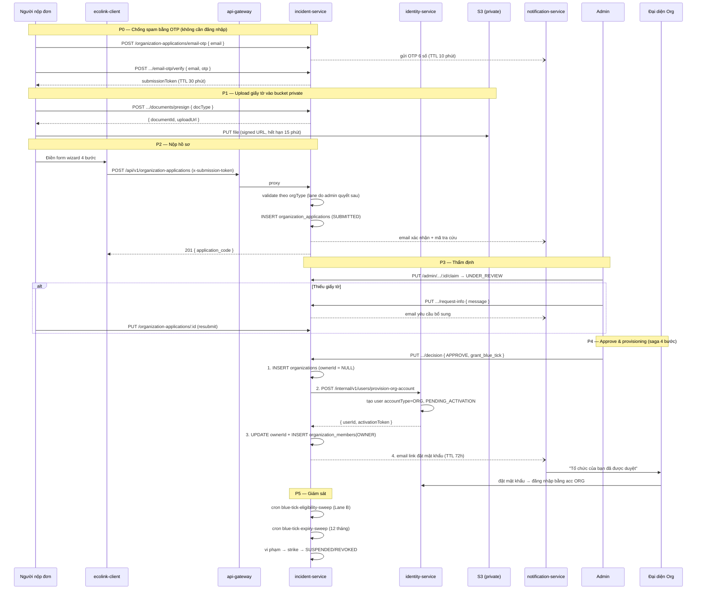
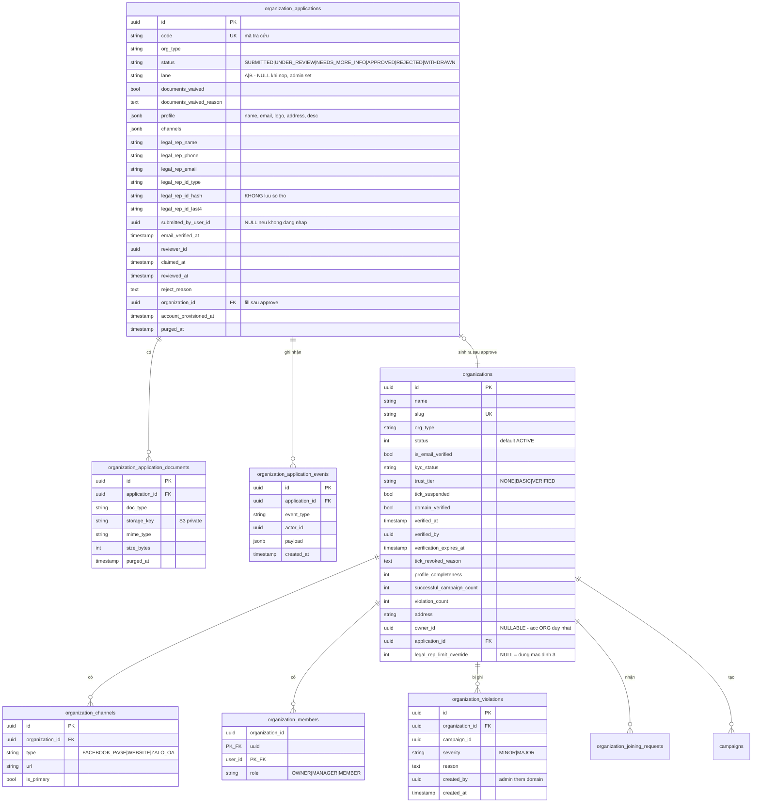

# 🛡️ Flow xác thực Organization & Blue Tick

> Tài liệu mô tả **thiết kế mục tiêu (to-be)** của luồng đăng ký — thẩm định — cấp tài khoản
> tổ chức trên Ecolink. Đi kèm với `ORG_CREATION_FLOW.md` (bản as-is).
> Mọi đường dẫn file được ghi tương đối từ thư mục gốc `ecolink/`.

> ⚠️ **Đã bị thay thế một phần (2026-09-26).** Mọi nội dung về **"một tài khoản ORG duy nhất"**
> (`accountType = ORG`, role `ORG_OWNER`, `organizations.ownerId`, saga `provision-org-account`,
> email kích hoạt tới email liên hệ, 2FA cho acc ORG) **không còn đúng**. Thay bằng mô hình nhiều
> owner — mỗi owner là một user cá nhân có membership `LEGAL_REPRESENTATIVE` / `OWNER`, phải tự
> xác nhận trước khi admin duyệt — trong `ORG_OWNERSHIP_FLOW.md` (thiết kế) và `ORG_CREATION_FLOW.md`
> (as-is). Các phần khác (5 trục trạng thái, lane A/B, giấy tờ private, Blue Tick) vẫn là to-be tham khảo.

---

## 📌 Tóm tắt thay đổi so với as-is

| | As-is | To-be |
| --- | --- | --- |
| Ai tạo được tổ chức | Mọi user đã đăng nhập, tạo trực tiếp | Nộp **application**, admin duyệt mới sinh tổ chức |
| Bảng `organizations` | Chứa cả bản ghi chờ duyệt (`PENDING`) | **Chỉ chứa tổ chức đã được duyệt** |
| Tài khoản quản lý | User cá nhân của người tạo | ~~**Tài khoản riêng** `accountType = ORG`, do hệ thống sinh~~ → **thay thế:** nhiều owner là user cá nhân (xem `ORG_OWNERSHIP_FLOW.md`) |
| Trạng thái | 2 trục (`status`, `isEmailVerified`) | **5 trục** độc lập (xem §1) |
| Hồ sơ pháp lý | Không có | `organization_applications` + file ở **private bucket** |
| Xuất bản chiến dịch | Luôn chờ admin duyệt | Org có **Blue Tick** → auto-publish + hậu kiểm *(phase sau)* |

Ba nguyên tắc xuyên suốt:

1. **Application là entity riêng, không phải Organization ở trạng thái nháp.**
   Organization chỉ tồn tại từ lúc admin approve → bảng `organizations` không bao giờ chứa rác.
2. **Dữ liệu KYC có vòng đời riêng và phải xoá được** (CCCD, giấy phép — Nghị định 13/2023).
3. **Approve ≠ cấp Blue Tick.** Hai quyết định khác nhau, hai endpoint, hai audit log.

---

## 1. Mô hình trạng thái — 5 trục độc lập

| Trục | Trường | Giá trị | Ai điều khiển |
| --- | --- | --- | --- |
| Vòng đời tổ chức | `organizations.status` | `ACTIVE(1)` / `INACTIVE(2)` | Admin |
| Sở hữu hòm mail | `organizations.isEmailVerified` | bool | Kế thừa từ OTP lúc nộp đơn |
| Loại chủ thể | `organizations.orgType` | `GOV` / `SCHOOL` / `CLUB` / `NGO` / `SOCIAL_ENTERPRISE` | User khai, admin xác nhận |
| Hồ sơ pháp lý | `organizations.kycStatus` | `NOT_SUBMITTED` / `APPROVED` / `EXPIRED` / `REVOKED` | Admin, qua application |
| Mức tin cậy | `organizations.trustTier` | `NONE` / `BASIC` / `VERIFIED` | Rule engine + Admin |

> ⚠️ **Không nhét Blue Tick vào `status`.** `kycStatus = APPROVED` nghĩa là hồ sơ hợp lệ;
> `trustTier = VERIFIED` nghĩa là *đang* được hưởng đặc quyền auto-publish. Lane B có thể ở
> `kycStatus = APPROVED` nhưng `trustTier = NONE` trong nhiều tháng (chờ đủ chiến dịch).

Vì `organizations` giờ chỉ chứa bản ghi đã duyệt nên **`_STATUS_PENDING (12)` không còn được
dùng làm default**. Giá trị default mới là `_STATUS_ACTIVE (1)`.

### Hai lane cấp Blue Tick

| | Lane A — Fast-track | Lane B — Standard |
| --- | --- | --- |
| Đối tượng | Trường học, cơ quan nhà nước | CLB, NGO, doanh nghiệp xã hội |
| Định danh | Email tên miền chính thức của đơn vị — **admin xác minh bằng mắt** | Giấy phép / quyết định thành lập + người đại diện |
| Lịch sử hoạt động | **Không yêu cầu** | ≥ 3 chiến dịch thành công, 0 vi phạm, tuổi org ≥ 90 ngày |
| Thời điểm cấp tick | Ngay khi admin approve application | Sau khi đủ điều kiện lịch sử, qua cron sweep |
| Hạn hiệu lực | Theo hiệu lực domain | 12 tháng, phải tái thẩm định |

---

## 2. 🗺️ Sơ đồ luồng



---

## 3. Pipeline chi tiết

### P0 — Xác thực email trước khi nộp (chống spam)

Form nộp đơn **không yêu cầu đăng nhập**, nên cổng chặn spam là OTP gửi về `contact_email`.

```
POST /api/v1/organization-applications/email-otp          { email }
POST /api/v1/organization-applications/email-otp/verify   { email, otp }
  → { submission_token }     // TTL 30 phút, one-time
```

Lợi ích kép: kết quả OTP được **kế thừa thẳng** thành `organizations.isEmailVerified = true`
khi approve → không phải verify email lần hai như flow cũ.

Rate limit: 3 OTP / email / giờ, 10 OTP / IP / giờ.

### P1 — Upload giấy tờ

```
POST /api/v1/organization-applications/documents/presign
  { doc_type: "ESTABLISHMENT_DECISION" | "BUSINESS_LICENSE" | "REP_ID_CARD" | "OTHER" }
  → { document_id, upload_url, expires_at }
```

Client `PUT` thẳng file lên **S3 private bucket** bằng `upload_url` (TTL 15 phút),
sau đó gắn `document_id` vào payload application.

> 🔴 **Không dùng Cloudinary unsigned preset** (cơ chế đang dùng cho logo/background).
> Đó là public URL — giấy phép và CCCD nằm ở đó là sự cố dữ liệu cá nhân, không phải bug.
> Logo/ảnh bìa vẫn đi Cloudinary như cũ; chỉ giấy tờ pháp lý đi S3 private.

Ràng buộc: ≤ 5 file / application, ≤ 10 MB / file, chỉ nhận `pdf | jpg | png`.

### P2 — Nộp hồ sơ

```
POST /api/v1/organization-applications
Header: x-submission-token
```

```json
{
  "org_type": "CLUB",
  "profile": {
    "name": "CLB Tình nguyện UIT",
    "contact_email": "clbtn@uit.edu.vn",
    "logo_url": "https://res.cloudinary.com/...",
    "background_url": "https://res.cloudinary.com/...",
    "address": "Khu phố 6, Linh Trung, Thủ Đức",
    "description": "..."
  },
  "channels": [
    { "type": "FACEBOOK_PAGE", "url": "https://facebook.com/..." },
    { "type": "WEBSITE",       "url": "https://..." },
    { "type": "ZALO_OA",       "url": "https://zalo.me/..." }
  ],
  "legal_representative": {
    "full_name": "Nguyễn Văn A",
    "id_type": "MSSV",
    "id_number": "22520001",
    "phone": "09xxxxxxxx",
    "position": "Chủ nhiệm CLB",
    "email": "vana@gmail.com"
  },
  "document_ids": ["uuid", "uuid"]
}
```

#### `legal_representative` — đúng một người, không hiển thị công khai

Đây là **dữ liệu thẩm định**, không phải dữ liệu hiển thị. Ràng buộc:

| | Quy tắc |
| --- | --- |
| Số lượng | Đúng 1 / application |
| Mục đích | Thẩm định KYC, quy trách nhiệm pháp lý khi có sự cố |
| Ai xem được | **Chỉ admin**, qua signed URL có ghi audit |
| Quyền đăng nhập | **Không** — chỉ acc `accountType = ORG` gắn `contact_email` đăng nhập được |
| Vòng đời | Purge sau 90 ngày kể từ `reviewedAt` |

Không thu thập ảnh chân dung người đại diện. Việc đối chiếu khuôn mặt với giấy tờ tuỳ thân
nằm ngoài phạm vi — admin chỉ thẩm định giấy tờ tổ chức và thông tin liên hệ.

> 🔴 Thông tin `legal_representative` tuyệt đối không xuất hiện ở endpoint public nào, không
> nằm trong response của `GET /api/v1/organizations/:id`, và không copy sang bảng
> `organizations` khi approve.

#### Validation theo `orgType`

| Nhóm điều kiện | GOV / SCHOOL (Lane A) | CLUB / NGO / SOCIAL_ENTERPRISE (Lane B) |
| --- | --- | --- |
| **Pháp lý & định danh** | Admin xác nhận email tên miền chính thức → **miễn** giấy tờ | ≥ 1 document pháp lý + đủ thông tin người đại diện |
| **Minh bạch hồ sơ** | name, logo, address, description | name, logo, address, description |
| | ≥ 1 kênh chính thức | ≥ 1 kênh chính thức |
| **Lịch sử hoạt động** | Miễn | Xét **sau khi** org đã hoạt động (§P5) |

#### Lane do admin quyết, không auto-detect

Hệ thống **không** tự tra tên miền. Không có bảng whitelist, không có regex chặn MSSV. Lý do:
`.edu.vn` do VNNIC cấp cho **cả cá nhân lẫn tổ chức** (phí ~1 triệu đồng/năm), nên whitelist
domain vừa không kín vừa tạo ảo giác an toàn; trong khi admin nhìn `2252xxxx@gm.uit.edu.vn`
một cái là biết đó không phải phòng công tác sinh viên.

Vì vậy `application.lane` **NULL khi nộp**, chỉ được set lúc admin ra quyết định:

```ts
// lúc nộp: không đoán lane
application.lane = null;
application.documentsWaived = false;   // mặc định: PHẢI nộp giấy tờ

// lúc admin decision:
{ lane: "A", documentsWaived: true, documentsWaivedReason: "Email tên miền uit.edu.vn" }
{ lane: "B", documentsWaived: false }
```

#### Mặc định bắt nộp giấy tờ, admin miễn sau

Đây là điểm thiết kế quan trọng nhất của thay đổi này. **Không** cho user tự khai
`orgType = SCHOOL` rồi được miễn giấy tờ — nếu vậy bất kỳ ai dùng Gmail cũng khai SCHOOL để
khỏi nộp.

| Cách làm | Sai sót gây ra |
| --- | --- |
| ❌ User khai SCHOOL → tự miễn giấy tờ | **Cho qua nhầm** — hồ sơ giả lọt vào hàng đợi, admin phải tự nhớ kiểm |
| ✅ Mặc định bắt nộp, admin bấm miễn | **Bắt nộp thừa** — trường thật phải chuẩn bị giấy tờ rồi được miễn |

Sai sót loại thứ hai gây phiền, loại thứ nhất gây thủng. Chọn loại thứ hai.

Ở form nộp đơn: khi user chọn `orgType = SCHOOL | GOV`, hiện dòng gợi ý *"Nếu bạn dùng email
tên miền chính thức của đơn vị, admin có thể miễn phần giấy tờ — bạn vẫn nên tải lên để hồ sơ
được duyệt nhanh hơn"*. Không phải một cái toggle bỏ qua bước upload.

Màn admin hiển thị `contact_email` **nổi bật ngay đầu hồ sơ**, tách rõ phần trước và sau dấu
`@`, để admin quyết trong một cái liếc. Kèm nút **"Miễn giấy tờ"** bắt buộc nhập lý do — lý do
này lưu vào `documentsWaivedReason` và ghi activity log, để sau này có tranh cãi thì truy được
ai đã miễn và vì sao.

Ràng buộc: một `contact_email` chỉ được có **1 application ở trạng thái mở**
(`SUBMITTED` / `UNDER_REVIEW` / `NEEDS_MORE_INFO`) tại một thời điểm.

### P3 — Thẩm định

```
GET  /api/v1/admin/organization-applications              ?status=&org_type=&lane=&q=
GET  /api/v1/admin/organization-applications/:id
PUT  /api/v1/admin/organization-applications/:id/claim           → UNDER_REVIEW
PUT  /api/v1/admin/organization-applications/:id/request-info    { message }
PUT  /api/v1/admin/organization-applications/:id/decision
     { decision: "APPROVE" | "REJECT", lane: "A" | "B",
       documents_waived?, documents_waived_reason?,
       reject_reason?, grant_blue_tick? }
```

- `claim` gán `reviewerId` + `claimedAt` để hai admin không cùng duyệt một hồ sơ.
- `request-info` → `NEEDS_MORE_INFO`, user sửa rồi `PUT /:id` để resubmit về `SUBMITTED`.
  **Đây là trạng thái quan trọng nhất**: phần lớn hồ sơ CLB sẽ thiếu giấy tờ, không có nó thì
  admin buộc phải reject và người ta nộp lại từ đầu.
- `grant_blue_tick` mặc định `true` cho Lane A, `false` cho Lane B.
- Xem document qua `GET /admin/.../documents/:docId/signed-url` (TTL 5 phút, ghi audit ai xem).

#### Vòng đời application

```
DRAFT ──submit──> SUBMITTED ──claim──> UNDER_REVIEW
                      ▲                    │
                      │            ┌───────┼────────┐
                   resubmit        ▼       ▼        ▼
                      └── NEEDS_MORE_INFO  APPROVED  REJECTED
                                              │
                                              └─> provisioning (P4)
WITHDRAWN ← user tự rút, từ bất kỳ trạng thái mở nào
```

### P4 — Provisioning: sinh Organization + tài khoản ORG

> ⚠️ **Đã bị thay thế** bởi `ORG_OWNERSHIP_FLOW.md` §Bước 4: duyệt tạo membership cho từng owner đã xác nhận, không tạo tài khoản ORG.

Đây là chỗ dễ vỡ nhất vì ghi vào **hai database khác nhau** (incident-service và
identity-service, không có FK xuyên service). Thứ tự bắt buộc:

```
1. [incident-service — 1 transaction]
     INSERT organizations {
       status = ACTIVE, isEmailVerified = true,   // kế thừa từ OTP
       orgType, kycStatus = APPROVED,
       trustTier = grantBlueTick ? VERIFIED : NONE,
       verifiedAt, verifiedBy,
       verificationExpiresAt = lane === "B" ? now + 12 tháng : null,
       ownerId = NULL                              // chưa có account
     }
     INSERT organization_channels (copy từ application)
     UPDATE organization_applications SET status = APPROVED, organizationId = ...

2. [→ identity-service — internal API, idempotent theo applicationId]
     POST /internal/v1/users/provision-org-account
       { applicationId, email, displayName, organizationId }
     → INSERT user { accountType: ORG, role: ORG_OWNER,
                     password: NULL, status: PENDING_ACTIVATION }
     → sinh activation token (type ORG_ACCOUNT_ACTIVATION, TTL 72h)
     → 200 { userId, activationToken }

3. [incident-service]
     UPDATE organizations SET ownerId = userId
     INSERT organization_members (organizationId, userId, role = OWNER)
     UPDATE organization_applications SET accountProvisionedAt = now()

4. [→ notification-service]
     Email tới contact_email (CC representative.email nếu có):
     link đặt mật khẩu + tóm tắt quyền của tài khoản ORG
```

Ba ràng buộc bắt buộc:

- **Bước 2 idempotent theo `applicationId`**, không phải theo email. Gọi lại lần hai phải trả
  về đúng user cũ chứ không tạo user trùng — bước này rất dễ fail (network, circuit breaker
  như `identity-user.client.ts` hiện có) và sẽ phải retry.
- **Không gửi mật khẩu tạm.** Chỉ gửi link đặt mật khẩu one-time, TTL 72h, có nút gửi lại.
  Mật khẩu tạm trong inbox là thứ tồn tại vĩnh viễn ở đó.
- **`organizations.ownerId` phải NULLABLE.** Org tồn tại với `ownerId = NULL` trong khoảng
  giữa bước 1 và 3. Mọi query `findByOwner` phải chịu được điều đó. Đặt `NOT NULL` → saga sập.

Nếu bước 2 fail hẳn: application ở `APPROVED` nhưng `accountProvisionedAt = NULL` →
cron `org-account-provision-retry` quét mỗi 5 phút và thử lại, đồng thời hiện cảnh báo đỏ ở
màn hình admin. **Không rollback org đã tạo.**

#### Một tài khoản đăng nhập duy nhất

Tách bạch ba thứ hay bị gộp làm một:

| Khái niệm | Lưu ở | Đăng nhập được | Hiển thị công khai |
| --- | --- | --- | --- |
| **Tài khoản ORG** | `organizations.ownerId` → user `accountType = ORG` | ✅ **duy nhất** | ❌ |
| **Thông tin liên hệ** | `organizations.contactEmail` + `organization_channels` | ❌ | ✅ |
| **Đại diện pháp lý** | `organization_applications.legal_rep_*` | ❌ | ❌ (chỉ admin) |

Người đại diện pháp lý **không** được render ở trang tổ chức. Thông tin liên hệ công khai chỉ
gồm `contactEmail` và các kênh chính thức (fanpage / website / Zalo OA) — đủ để người dùng
liên lạc mà không lộ danh tính cá nhân của ai.

Người nộp đơn (sinh viên nộp hộ CLB) không có quyền gì sau khi duyệt, kể cả khi họ chính là
người đại diện pháp lý. Email kích hoạt đi về `contact_email`, CC `legal_rep_email`.

> ⚠️ **Rủi ro chia sẻ mật khẩu.** Một acc cho cả tập thể nghĩa là mật khẩu sẽ được truyền tay
> và không ai biết ai vừa thao tác. Giảm thiểu bằng: bật 2FA bắt buộc cho `accountType = ORG`
> và ghi audit log mọi hành động của acc này. Về dài hạn nên cho acc ORG mời cá nhân vào
> `organization_members` với role `MANAGER` để mỗi người thao tác bằng acc riêng — phase sau.

### P5 — Blue Tick, auto-publish, thu hồi

> 🟡 **Ngoài phạm vi đợt này.** Đợt triển khai hiện tại chỉ làm tới hết P4 (application →
> approve → sinh Organization + tài khoản ORG). Toàn bộ §P5 là thiết kế đón đầu: schema được
> tạo sẵn, **logic chưa nối vào `campaign`**. Xem §6 để biết cái gì làm ngay, cái gì để sau.

#### Rule engine

Viết thành **hàm thuần** dùng chung cho 3 nơi (checklist của org, màn admin, cron sweep):

```ts
evaluateBlueTickEligibility(org): {
  eligible: boolean;
  lane: "A" | "B";
  criteria: { key: string; passed: boolean; current?: number; required?: number }[];
}
```

Lane B pass khi:

```
kycStatus === APPROVED
&& successfulCampaignCount >= 3
&& violationCount === 0
&& ageInDays >= 90
&& profileCompleteness === 100
&& channels.length >= 1
```

Nếu rải điều kiện vào controller thì 3 nơi sẽ lệch nhau — đây là lỗi chắc chắn xảy ra.

#### Auto-publish *(phase sau — chưa động vào campaign)*

Khi nào refactor `campaign`, điểm chèn là `createCampaign`:

```ts
const autoPublish =
  org.trustTier === TrustTier.VERIFIED &&
  org.status === GlobalStatus._STATUS_ACTIVE &&
  !org.tickSuspended;

campaign.status = autoPublish
  ? GlobalStatus._STATUS_ACTIVE
  : GlobalStatus._STATUS_PENDING;
```

Bỏ tiền kiểm thì **bắt buộc** có hậu kiểm, nếu không Blue Tick trở thành lỗ hổng:

- Mọi campaign auto-publish vẫn vào hàng đợi `post_moderation`, SLA 24h.
- Sampling 10–20% vẫn review thủ công dù có tick.
- Rate limit: tối đa N campaign auto-publish / tuần / org.
- Nút `unpublish` cho admin, ghi `organization_violations`.

#### Bảng thu hồi

| Sự kiện | Hệ quả |
| --- | --- |
| Đổi `contactEmail` | `isEmailVerified = false`; Lane A → `tickSuspended = true` cho tới khi verify lại |
| 1 vi phạm | strike +1, `tickSuspended = true`, campaign quay lại tiền kiểm |
| 3 strike / vi phạm nặng | `trustTier = NONE`, `kycStatus = REVOKED`, ghi `tickRevokedReason`, khoá nộp lại 6 tháng |
| Quá `verificationExpiresAt` | `kycStatus = EXPIRED`, `trustTier = NONE`, yêu cầu tái thẩm định |
| `status → INACTIVE` | `trustTier = NONE` theo |

Cron: `blue-tick-eligibility-sweep` (hằng ngày, đẩy Lane B đủ điều kiện vào hàng đợi admin +
báo owner), `blue-tick-expiry-sweep` (hằng ngày, nhắc trước 30 / 7 ngày).

---

## 4. 🗄️ Data model

### ERD



> `users`, `roles`, `auth_tokens` nằm ở **database riêng** của identity-service.
> `owner_id`, `user_id`, `reviewer_id` là UUID xuyên service, **không có foreign key**,
> resolve qua HTTP như hiện tại.

### Thay đổi trên bảng `organizations`

| Field | Kiểu | Ghi chú |
| --- | --- | --- |
| `orgType` | varchar(32) | **mới** |
| `kycStatus` | varchar(20) | **mới**, default `NOT_SUBMITTED` |
| `trustTier` | varchar(10) | **mới**, default `NONE` |
| `tickSuspended` | bool | **mới**, default `false` |
| `domainVerified` | bool | **mới** |
| `verifiedAt` / `verifiedBy` / `verificationExpiresAt` | ts / uuid / ts | **mới** |
| `tickRevokedReason` | text? | **mới** |
| `profileCompleteness` | int | **mới**, 0–100, tính lại mỗi lần update |
| `successfulCampaignCount` | int | **mới**, denormalized, cập nhật khi campaign kết thúc |
| `violationCount` | int | **mới**, denormalized từ `organization_violations` |
| `address` | varchar(500)? | **mới** |
| `applicationId` | uuid? | **mới**, truy vết ngược hồ sơ |
| `ownerId` | uuid **?** | **đổi thành NULLABLE** |
| `status` | int | **default đổi từ `12` → `1`** |

Index mới: `(trustTier, status)` cho query auto-publish, `(kycStatus, verificationExpiresAt)`
cho cron expiry, `applicationId`.

### Bảo vệ dữ liệu cá nhân

- Số CCCD/MSSV: lưu **hash + 4 ký tự cuối**, không lưu số thô. Đủ để đối chiếu khi khiếu nại.
- File giấy tờ: S3 private, signed URL TTL ≤ 5 phút, mọi lượt xem ghi
  `organization_application_events`.
- Job `application-purge` chạy hằng tuần: xoá file giấy tờ + `legal_rep_*` sau **90 ngày** kể từ
  `reviewedAt`, set `purgedAt`. Giữ lại `organization_application_events` làm bằng chứng đã
  thẩm định.
- Form nộp đơn phải có checkbox đồng ý xử lý dữ liệu cá nhân, lưu timestamp.

---

## 5. 🧹 Reset dữ liệu & phạm vi triển khai

### Xoá sạch dữ liệu cũ

Không backfill, không migration dữ liệu. Toàn bộ tổ chức hiện có bị xoá; mọi tổ chức về sau
đều phải đi qua pipeline application.

```sql
TRUNCATE TABLE organization_joining_requests,
               organization_members,
               organizations
  RESTART IDENTITY CASCADE;
```

Hệ quả cần dọn kèm:

| Nơi | Việc phải làm |
| --- | --- |
| `campaigns` | Campaign cũ trỏ tới `organizationId` đã xoá → xoá luôn hoặc set NULL trước khi TRUNCATE, nếu không CASCADE sẽ kéo theo ngoài ý muốn |
| identity-service | Xoá `auth_tokens` type `ORGANIZATION_CONTACT_EMAIL` còn tồn |
| Cloudinary | Logo/background mồ côi — dọn thủ công hoặc bỏ qua, không ảnh hưởng chức năng |
| `translation` jobs | Job `TRANSLATE_TEXT` với `resourceType: ORGANIZATION` đang trong SQS sẽ fail → purge queue |

Vì xoá sạch nên các thay đổi schema đều **an toàn, không cần chiến lược backfill**:
`status` đổi default, `ownerId` đổi sang NULLABLE, các cột mới đều NOT NULL kèm default.

### Khoá đường cũ

`POST /api/v1/organizations` hiện cho **mọi user đã đăng nhập** tạo org
(`organization.routes.ts:12`). Nếu không khoá, cả pipeline này chỉ là trang trí.

- Chuyển endpoint thành **internal-only** (`x-internal-api-key`), chỉ approve handler gọi được.
- Route client `/organizations/create` trỏ sang form application mới.
- Thêm `/organizations/email-verified` vào `src/routes/index.tsx` — route này đang **thiếu**
  và người dùng rơi vào NotFound khi verify lỗi (bug đã ghi trong doc as-is).

### Phạm vi đợt này

Chỉ làm phần **tạo tổ chức**. `campaign` giữ nguyên, không refactor.

| Hạng mục | Đợt này | Để sau |
| --- | --- | --- |
| Application + OTP + upload giấy tờ | ✅ | |
| Màn thẩm định của admin | ✅ | |
| Saga provisioning (Org + acc ORG) | ✅ | |
| Admin quyết lane + miễn giấy tờ, ghi activity log | ✅ | |
| Cột `trustTier` / `kycStatus` / `tickSuspended` | ✅ ghi dữ liệu | |
| Admin cấp/thu hồi tick thủ công | ✅ | |
| Hiển thị badge tick ở UI | ✅ | |
| `evaluateBlueTickEligibility()` + cron sweep | | ⏳ |
| Auto-publish trong `createCampaign` | | ⏳ |
| Hậu kiểm, sampling, rate limit | | ⏳ |
| `organization_violations` (bảng tạo sẵn, chưa có writer) | | ⏳ |

> ⚠️ **Hệ quả phải chấp nhận:** khi chưa nối vào `campaign`, Blue Tick chỉ là **nhãn hiển thị**,
> chưa mang đặc quyền nào. `successfulCampaignCount` và `violationCount` chưa có ai ghi nên
> **Lane B chưa tự đánh giá được** — đợt này admin cấp tick Lane B hoàn toàn thủ công. Chấp nhận
> được vì giai đoạn đầu số tổ chức còn ít, nhưng đừng để lâu: điều kiện xét sẽ trôi theo cảm tính
> của từng admin nếu không có rule engine.

### Migration mới

```
20260922100000_organization_applications
20260922100500_organization_application_documents
20260922101000_organization_application_events
20260922102000_organization_channels
20260922102500_organization_violations
20260922103000_organizations_trust_fields
20260922103500_organizations_owner_id_nullable
20260922104000_organizations_status_default_active
20260922104500_truncate_legacy_organizations
```

---

## 6. 📋 Tổng hợp API

| Method | Endpoint | Quyền |
| --- | --- | --- |
| POST | `/api/v1/organization-applications/email-otp` | public, rate-limited |
| POST | `/api/v1/organization-applications/email-otp/verify` | public |
| POST | `/api/v1/organization-applications/documents/presign` | `x-submission-token` |
| POST | `/api/v1/organization-applications` | `x-submission-token` |
| GET | `/api/v1/organization-applications/:id?token=` | link trong email |
| PUT | `/api/v1/organization-applications/:id` | chỉ khi `NEEDS_MORE_INFO` |
| POST | `/api/v1/organization-applications/:id/withdraw` | người nộp |
| GET | `/api/v1/admin/organization-applications` | admin |
| GET | `/api/v1/admin/organization-applications/:id` | admin |
| GET | `/api/v1/admin/organization-applications/:id/documents/:docId/signed-url` | admin, audit |
| PUT | `/api/v1/admin/organization-applications/:id/claim` | admin |
| PUT | `/api/v1/admin/organization-applications/:id/request-info` | admin |
| PUT | `/api/v1/admin/organization-applications/:id/decision` | admin |
| PUT | `/api/v1/admin/organizations/:id/trust-tier` | **super-admin** |
| GET | `/api/v1/organizations/:id/blue-tick-status` | owner → checklist |
| POST | `/internal/v1/users/provision-org-account` | internal (identity-service) |

Tách hẳn khỏi `PUT /api/v1/organizations/:id/verify` đang có. Đừng overload endpoint cũ —
hai quyết định khác nhau, audit log khác nhau, và phân quyền sẽ khác nhau (mod duyệt hồ sơ,
chỉ super-admin cấp/thu hồi tick).

---

## 7. ✅ Quyết định đã chốt & ❓ còn lại

### Đã chốt

1. **Không auto-detect tên miền, không auto-approve.** Bỏ hẳn bảng whitelist và logic regex.
   Admin nhìn `contact_email` rồi tự quyết lane; mặc định mọi hồ sơ phải nộp giấy tờ, admin bấm
   **miễn** kèm lý do. Chi tiết ở §P2.
2. **Một tài khoản đăng nhập duy nhất, không có bảng người đại diện công khai.** Chỉ giữ
   `legal_representative` (đúng 1 người, chỉ admin xem, không thu ảnh chân dung). Xác thực đi
   qua đúng một acc `accountType = ORG` gắn `contact_email`. Chi tiết ở §P4.

3. **Mọi quyết định miễn giấy tờ ghi activity log** (ai miễn, hồ sơ nào, lý do, thời điểm).
   Đây là thứ thay thế cho whitelist: không còn rule tự động thì audit trail là cơ chế kiểm soát
   duy nhất còn lại.
4. **Giới hạn số org một người đại diện được đứng tên: 3.**
   - Đếm theo `legal_rep_id_hash`, gồm org đang `ACTIVE` **cộng** application đang ở trạng thái
     mở — nếu chỉ đếm org đã duyệt thì một người nộp 10 đơn cùng lúc vẫn lọt.
   - Vượt ngưỡng → chặn ngay ở `POST /organization-applications`, trả `422` kèm thông báo rõ.
   - Admin có quyền cấp ngoại lệ thủ công (cột `legalRepLimitOverride`), ghi activity log.
   - ⚠️ Giới hạn này **không kín**: cùng một người khai hai số CCCD/MSSV khác nhau sẽ ra hai
     hash khác nhau. Nó chỉ chặn trường hợp vô ý và spam lười, không chặn được gian lận có chủ đích.

### Để lại phase sau

5. **2FA bắt buộc cho tài khoản ORG** — implement sau. Trong lúc chưa có, rủi ro chia sẻ mật
   khẩu (§P4) vẫn tồn tại; tối thiểu phải có **audit log cho acc ORG ngay từ đợt này**, nếu
   không thì lúc xảy ra sự cố sẽ không truy được ai làm.
6. **"Chiến dịch thành công" định nghĩa ra sao?** Input trực tiếp của rule engine Lane B.
7. **Ai tạo chiến dịch — acc ORG trực tiếp hay `MANAGER` được mời?**
8. **Rate limit auto-publish bao nhiêu / tuần / org?**