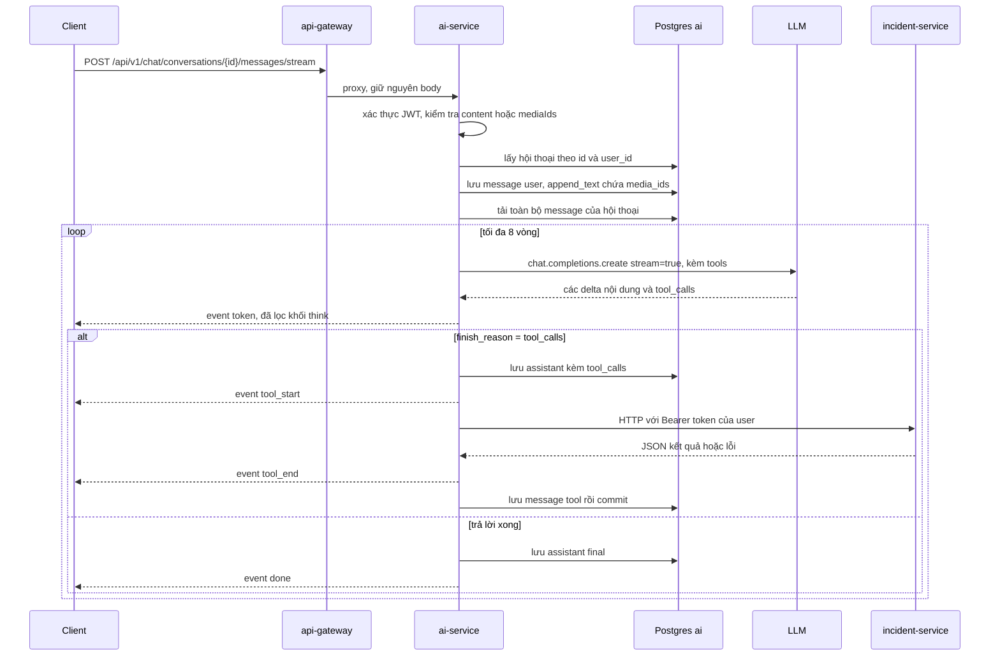

# ai-service

> Tài liệu viết hoàn toàn từ code Python trong `app/` (bỏ qua `.venv`). Đường dẫn bằng chứng tính từ `/Users/ngoc/ecolink`.
> Viết tắt: `AI` = `ecolink-server/services/ai-service`.

## 1. Trách nhiệm của service

FastAPI service (`AI/app/main.py`, uvicorn cổng 3004) cung cấp:

1. **Chat trợ lý EcoLink qua SSE**, có tool calling: tạo hội thoại, gửi tin nhắn và nhận luồng token, lưu lịch sử vào Postgres. Tool có thể gọi incident-service **bằng JWT của chính người dùng** (tạo report, tạo/tra cứu tổ chức, lấy media report). `AI/app/chat/service.py > stream_chat_turn()`
2. **Dịch Việt ↔ Anh** (translation assistant, trả JSON), cho người dùng (JWT) và cho service nội bộ (API key). `AI/app/chat/service.py > translate_text()`
3. **Sinh khuyến nghị dọn dẹp** (Markdown tiếng Việt) từ kết quả nhận diện rác của report. `AI/app/recommendation/service.py > generate_recommendation()`
4. **Sinh caption Facebook** cho chiến dịch đã hoàn thành. `AI/app/social/service.py > generate_campaign_facebook_caption()`

**LLM provider/model**: dùng thư viện `openai` (`AsyncOpenAI`, Chat Completions API). Model lấy từ `OPENAI_CHAT_MODEL`, **mặc định `gpt-4o-mini`**. Có thể trỏ sang provider tương thích OpenAI qua `OPENAI_BASE_URL`. Comment trong code nhắc tới MiniMax và DeepSeek-R1 như các provider có thể phát khối `<think>` (lý do có bộ lọc `thinking_strip`). Mọi tính năng (chat, dịch, recommendation, caption) dùng **cùng một model**. Bằng chứng: `AI/app/config.py > Settings`, `AI/app/llm/openai_chat.py > build_client()`, `AI/app/chat/service.py > translate_text()` (comment).

## 2. Cấu trúc thư mục / module chính

```
ai-service/app/
├─ main.py                 # FastAPI app, CORS, lifespan init_db, mount routers, ddtrace.auto
├─ config.py               # pydantic-settings (đọc .env)
├─ auth.py                 # JWT (HS256) + internal API key
├─ llm/openai_chat.py      # build_client() → AsyncOpenAI
├─ agents/prompts.py       # system prompt: ecolink_assistant, translation_assistant
├─ chat/
│  ├─ router.py            # /api/v1/chat/*
│  ├─ service.py           # stream_chat_turn (vòng lặp tool), translate_text
│  ├─ sse.py               # format_sse(event, data)
│  ├─ thinking_strip.py    # lọc khối think khi stream và khi lưu
│  ├─ user_message_media.py# media_ids ↔ append_text
│  └─ media_fetch.py       # id → URL từ ai_chat_media
├─ tools/
│  ├─ registry.py          # REGISTERED_AGENT_IDS, AGENT_TOOLS, legacy id map
│  ├─ definitions.py       # RegisteredTool, echo_message, get_platform_faq_excerpt
│  ├─ incident_client.py   # httpx gọi incident-service với Bearer token của user
│  ├─ report_api.py        # create_report
│  ├─ organization_api.py  # create_organization, list_organizations
│  ├─ report_media_api.py  # list_report_media_files_by_ids
│  └─ chat_media_api.py    # list_chat_media_by_ids
├─ internal/router.py      # /internal/v1/translate
├─ recommendation/         # /api/v1/recommendations/report
├─ social/                 # /api/v1/social/campaign-facebook-caption
├─ repositories/           # ChatRepository, chat_media helpers, deps
└─ db/                     # models.py (SQLAlchemy), session.py (async engine, init_db)
```

Không có Alembic/migration: bảng được tạo bằng `Base.metadata.create_all` khi khởi động nếu `AUTO_CREATE_DB_TABLES` bật (`AI/app/db/session.py > init_db()`).

## 3. Cơ chế xác thực & middleware

| Cơ chế | Cách hoạt động | Bằng chứng |
|---|---|---|
| JWT người dùng | Token lấy từ `Authorization: Bearer` (qua `HTTPBearer(auto_error=False)`), nếu không có thì cookie `accessToken`. Decode HS256 bằng `JWT_SECRET`. `user_id` lấy từ claim `userId` hoặc `user_id`. Thiếu token → `401 "Not authenticated"`; decode lỗi → `401 "Invalid or expired token"`; không có user id → `401 "Token missing user id"`; `JWT_SECRET` rỗng → `500`. **Không đọc/kiểm tra role.** | `AI/app/auth.py > get_auth_context()`, `_decode_user_id()` |
| Token forwarding | `AuthContext.access_token` được đưa vào context của tool, tool gọi incident-service với `Authorization: Bearer <token của user>`. | `AI/app/chat/service.py > stream_chat_turn()`, `AI/app/tools/incident_client.py > incident_request_json()` |
| API key nội bộ | Header `x-internal-api-key` so với `INTERNAL_AI_API_KEY` (so sánh `!=`). Env rỗng → `500`; sai → `401 "Invalid internal API key"`. | `AI/app/auth.py > require_internal_api_key()` |
| CORS | `CORSMiddleware` với `allow_origins=[CORS_ORIGIN]` hoặc `["*"]`, `allow_credentials=True`, mọi method/header. | `AI/app/main.py` |
| APM | `ddtrace.auto` import đầu tiên; `DD_SERVICE=ai-service` mặc định. | `AI/app/main.py` |

## 4. Danh sách API endpoint

**Tổng: 9 endpoint** (6 chat, 1 internal, 1 recommendation, 1 social) + `GET /health` = **10** nếu tính health. `/api/v1/translate` chỉ là alias do gateway rewrite, không phải route riêng.

Gateway chỉ proxy `/api/v1/chat/*` (→ `/api/v1/chat/*`, `parseReqBody: false` để giữ stream) và `/api/v1/translate` (→ `/api/v1/chat/translate`) (`ecolink-server/api-gateway/src/index.ts`). **`/api/v1/recommendations/*`, `/api/v1/social/*`, `/internal/v1/*` và `/health` không được gateway proxy**: chỉ gọi trực tiếp từ service khác.

### 4.1 Chat (`AI/app/chat/router.py`)

| Method | Path (qua gateway) | Auth | Role | Request (validation) | Response | Mã lỗi | Handler |
|---|---|---|---|---|---|---|---|
| GET | `/api/v1/chat/agents` | **Không** | — | — | `{ agents: [{ agent_id, tools: [{name, description}] }] }` | — | `router.py > list_agents_and_tools()` → `tools/registry.py > tool_catalog()` |
| POST | `/api/v1/chat/media` | JWT | Mọi user | Body `{ imageUrl }`: bắt đầu `https://` hoặc `http://`, dài ≤ 4096 | `{ media: { id, url, type: "chat_image", created_at } }` | `401`; `422` (pydantic) | `router.py > register_chat_media()` → `repositories/chat_media.py > create_chat_media_row()` |
| POST | `/api/v1/chat/conversations` | JWT | Mọi user | Body `{ agentId, title? }`; `agentId` ∈ `REGISTERED_AGENT_IDS` = (`ecolink_assistant`, `translation_assistant`) | `{ conversation: { id, agent_id, title, created_at } }` | `400 "Unknown agentId; allowed: [...]"`; `401`; `422` | `router.py > create_conversation()` → `ChatRepository.create_conversation()` |
| GET | `/api/v1/chat/conversations/{conversation_id}/messages` | JWT | Chủ hội thoại | Path UUID | `{ messages: [{ id, role, content, append_text, tool_calls, tool_call_id, created_at }] }` (bỏ role `system`, gồm cả message `tool`) | `404 "Conversation not found"` (không phải chủ hoặc không tồn tại); `401`; `422` | `router.py > list_messages()` → `ChatRepository.list_messages_for_user()` |
| POST | `/api/v1/chat/conversations/{conversation_id}/messages/stream` | JWT | Chủ hội thoại | Body `{ content?: string (strip), mediaIds?: string[] }`: `mediaIds` không phải list → `[]`; lấy tối đa **10** phần tử đầu, mỗi phần tử phải là UUID v1–v5, khử trùng lặp. Phải có `content` hoặc `mediaIds` | `text/event-stream` (xem 4.5) | `400 "Either content or mediaIds (non-empty) is required"`; `401`; `422` (mediaId sai). Lỗi nghiệp vụ trong stream trả qua event `error` với HTTP 200 | `router.py > stream_message()` → `chat/service.py > stream_chat_turn()` |
| POST | `/api/v1/chat/translate` và `/api/v1/translate` | JWT | Mọi user | Body `{ content: string }` (khác `""`) | `{ detected_language: "vi"\|"en", vn, en }` | `400 "content is required"`; `500` (RuntimeError: thiếu key, JSON sai, `detected_language` sai...); `401` | `router.py > translate_message()` → `translate_text()` |

### 4.2 Internal (`AI/app/internal/router.py`), gateway không proxy

| Method | Path | Auth | Role | Request | Response | Mã lỗi | Handler |
|---|---|---|---|---|---|---|---|
| POST | `/internal/v1/translate` | `x-internal-api-key` | Service nội bộ | `{ content: string }` (khác `""`) | Giống `/api/v1/chat/translate` | `400`; `401`; `500` (RuntimeError hoặc lỗi bất ngờ, detail `"<ExceptionType>: <msg>"`) | `internal/router.py > internal_translate()` |

### 4.3 Recommendation (`AI/app/recommendation/router.py`), gateway không proxy

| Method | Path | Auth | Role | Request | Response | Mã lỗi | Handler |
|---|---|---|---|---|---|---|---|
| POST | `/api/v1/recommendations/report` | **Không** | — | `{ image_urls: string[] (≥1), results: [{ source_url, detections?, predicted_url?, boxes: [{label, class_id, confidence, bbox: {..float} }] }] }` | `{ recommendation: string (Markdown tiếng Việt) }` | `500` (thiếu key / LLM trả rỗng); `422` | `recommendation/router.py > recommend_for_report()` → `recommendation/service.py > generate_recommendation()` (temperature 0.4) |

### 4.4 Social (`AI/app/social/router.py`), gateway không proxy

| Method | Path | Auth | Role | Request | Response | Mã lỗi | Handler |
|---|---|---|---|---|---|---|---|
| POST | `/api/v1/social/campaign-facebook-caption` | **Không** | — | `{ campaignTitle (1..500), volunteerCount (≥0), completedAt (1..80), bannerUrl? (≤2048, http(s)), description? (≤8000), volunteers?: [{ name (1..120, strip), email? (≤320, lower) }] (≤80) }` | `{ caption: string }` | `500`; `422` | `social/router.py > campaign_facebook_caption()` → `social/service.py > generate_campaign_facebook_caption()` (temperature 0.55, description cắt 4000 ký tự) |

### 4.5 Khác

| Method | Path | Auth | Response | Handler |
|---|---|---|---|---|
| GET | `/health` (không proxy) | Không | `{ status: "ok", service: "ai-service" }` | `AI/app/main.py > health()` |

### 4.6 Định dạng SSE

`format_sse(event, data)` → `event: <event>\ndata: <json>\n\n` (`AI/app/chat/sse.py`). Các event:

| Event | Data | Khi nào |
|---|---|---|
| `token` | `{ text }` | Mỗi đoạn nội dung đã lọc khối think |
| `tool_start` | `{ tool_call_id, name }` | Trước khi chạy tool |
| `tool_end` | `{ tool_call_id, name, result_preview }` (500 ký tự đầu) | Sau khi chạy tool |
| `done` | `{ message_id }` | Assistant trả lời xong (không gọi tool nữa) |
| `error` | `{ message }` | `"Conversation not found"`, `"OPENAI_API_KEY is not configured"`, `"Too many tool rounds; aborting."` |

## 5. Event/Job phát ra và lắng nghe

ai-service **không** phát/nhận SQS hay outbox (không có worker trong `app/`). Chỉ có HTTP.

### 5.1 HTTP ai-service gọi ra (tool → incident-service)

Base URL `INCIDENT_API_BASE_URL` (mặc định `http://localhost:3001`, gọi thẳng incident, không qua gateway), timeout 45s, header `Authorization: Bearer <JWT của user>`. Lỗi mạng / non-JSON / status ≥ 400 được gói thành chuỗi JSON `{"error": ...}` trả về cho LLM, không ném exception (`AI/app/tools/incident_client.py > incident_request_json()`).

| Tool (agent `ecolink_assistant`) | Gọi ra | Chi tiết | Bằng chứng |
|---|---|---|---|
| `create_report` | `POST {incident}/api/v1/reports` | Body `{ title, latitude, longitude, imageUrls, description, wasteType?, severityLevel?, detailAddress? }`. Mặc định title `"Báo cáo sự cố môi trường"`, description `"Báo cáo được gửi qua trợ lý EcoLink."`, lat/lng `1.0`. Kiểm lat ∈ [-90, 90], lng ∈ [-180, 180], `severity_level` ∈ {1, 2}. Cần ≥ 1 ảnh (từ `image_urls` http(s) và/hoặc `image_media_ids` ≤ 20, phải thuộc user trong `ai_chat_media`). | `AI/app/tools/report_api.py > _create_report()`, `_resolve_chat_media_urls()` |
| `create_organization` | `POST {incident}/api/v1/organizations` | Body `{ name, logoUrl, contactEmail, description?, backgroundUrl? }`. Bắt buộc `name`, `contact_email`. `logo_url` trống → lấy từ `logo_media_id` (ai_chat_media của user) → fallback `https://placehold.co/256x256/png?text=EcoLink`. | `AI/app/tools/organization_api.py > _create_organization()` |
| `list_organizations` | `GET {incident}/api/v1/organizations` | Query: `search`, `status` (lặp), `is_email_verified`, `request_status` (lặp), `page`, `limit`, `sortBy`, `sortOrder` | `organization_api.py > _list_organizations()` |
| `list_report_media_files_by_ids` | `GET {incident}/api/v1/reports/media-files/by-ids?mediaFileIds=...` | 1..100 UUID | `AI/app/tools/report_media_api.py > _list_report_media_files_by_ids()` |
| `list_chat_media_by_ids` | (DB nội bộ) | 1..50 UUID, chỉ trả bản ghi của user | `AI/app/tools/chat_media_api.py > _list_chat_media_by_ids()` |
| `get_platform_faq_excerpt` | (không gọi ra) | Trả đoạn FAQ cứng theo `topic` ∈ {reports, campaigns, organizations, general} | `AI/app/tools/definitions.py > _platform_faq()` |
| `echo_message` | (không gọi ra) | Trả `"echo: <text>"` (tool test) | `definitions.py > _echo()` |

Agent `translation_assistant`: không có tool (`AI/app/tools/registry.py > AGENT_TOOLS`).

Gọi ra OpenAI (hoặc provider tương thích): `chat.completions.create` ở `stream_chat_turn()` (stream, có tools), `translate_text()` (`response_format={"type": "json_object"}`), `generate_recommendation()`, `generate_campaign_facebook_caption()`.

### 5.2 Ai gọi vào ai-service

| Bên gọi | Endpoint | Bằng chứng |
|---|---|---|
| Frontend qua gateway | `/api/v1/chat/*`, `/api/v1/translate` | `ecolink-server/api-gateway/src/index.ts` |
| incident-service (translation worker) | `POST /internal/v1/translate` với `x-internal-api-key` | `ecolink-server/services/incident-service/src/modules/translation/translation.client.ts > translateText()` (dùng bởi `src/queue/worker/translation-worker.ts`) |
| reward-service (translation worker) | `POST /internal/v1/translate` | `ecolink-server/services/reward-service/src/modules/translation/translation.client.ts > translateText()` (dùng bởi `src/queue/workers/translation.worker.ts`) |
| incident-service (phân tích AI report) | `POST /api/v1/recommendations/report` (không auth, timeout 45s, lỗi chỉ log) | `ecolink-server/services/incident-service/src/modules/report/report-ai-analysis.service.ts > analyzeReport()` |
| reward-service (Facebook recognition) | `POST /api/v1/social/campaign-facebook-caption` | `ecolink-server/services/reward-service/src/modules/facebook-recognition/facebook-recognition.service.ts > fetchCaptionFromAi()` |

## 6. Job nền, cron, worker

Không có job nền, cron hay worker nào trong `app/`. [CHƯA HOÀN THIỆN] File `.env` của service có comment `# REPORT_SUBMITTED worker (python -m app.worker)` cùng các biến `SQS_AI_ANALYSIS_QUEUE_URL`, `AWS_*`, nhưng **không tồn tại `app/worker.py`** và không có code đọc các biến này.

### Luồng chat SSE (`AI/app/chat/service.py > stream_chat_turn()`)



Chi tiết:
1. `get_conversation_for_user(id, user_id)`; không thấy → event `error`.
2. `OPENAI_API_KEY` rỗng → event `error` (trước khi lưu message user).
3. Lưu message user (`content` đã strip, `append_text = "media_ids:\n<id>\n..."`), commit.
4. Dựng messages cho OpenAI (`build_openai_messages_from_rows()`): system prompt theo agent; message user có media → nội dung multi-part gồm text gợi ý `[User attached image(s). media_id values: ...]` + `image_url` cho các URL tìm được (chỉ media của user, URL bắt đầu `http`). Hỗ trợ định dạng cũ nhúng `media_ids:` trong `content`.
5. Vòng lặp ≤ 8 lần: stream; nội dung qua `ThinkingStreamFilter`; gom tool_calls theo `index`. Nếu `finish_reason == "tool_calls"`: lưu assistant + tool_calls, chạy tuần tự từng tool (`find_tool`; tool không tồn tại → `{"error": "Unknown tool: <name>"}`; exception → `{"error": str(e)}`; args JSON lỗi → `{}`), lưu message tool, commit, lặp tiếp. Ngược lại lưu assistant final (đã `strip_thinking`), event `done`.
6. Hết 8 vòng → event `error "Too many tool rounds; aborting."`.

### Luồng dịch (`translate_text()`)

System prompt `translation_assistant` → OpenAI với `response_format=json_object` → `strip_thinking` → `_extract_json_object()` (bỏ code fence, lấy object `{...}` ngoài cùng) → `json.loads` → kiểm `detected_language ∈ {vi, en}` và `vn`, `en` là string → **ép trường của ngôn ngữ nguồn bằng đúng input gốc** → trả `{ detected_language, vn, en }`. Mỗi bước lỗi → `RuntimeError` → HTTP 500.

## 7. Phụ thuộc vào service khác và dịch vụ bên ngoài

| Phụ thuộc | Mục đích | Bằng chứng |
|---|---|---|
| OpenAI Chat Completions (hoặc endpoint tương thích qua `OPENAI_BASE_URL`), model mặc định `gpt-4o-mini` | Chat, dịch, recommendation, caption | `AI/app/llm/openai_chat.py`, `AI/app/config.py` |
| incident-service | Tool tạo report, tổ chức, tra media | `AI/app/tools/incident_client.py` |
| PostgreSQL (SQLAlchemy async + asyncpg) | Lưu hội thoại, message, chat media | `AI/app/db/session.py` |
| Nơi host ảnh (client tự upload, ví dụ Cloudinary theo docstring) | ai-service chỉ lưu URL, không upload | `AI/app/db/models.py > AiChatMedia`, `AI/app/chat/router.py > register_chat_media()` |
| Datadog (`ddtrace`) | APM | `AI/app/main.py` |

Thư viện: `fastapi 0.115.6`, `uvicorn 0.34.0`, `sqlalchemy[asyncio] 2.0.36`, `asyncpg 0.30.0`, `pydantic-settings 2.7.0`, `openai 1.59.7`, `PyJWT 2.10.1`, `httpx 0.28.1`, `ddtrace 4.10.5` (`AI/requirements.txt`).

## 8. Biến môi trường

Service không có `.env.example`; danh sách dưới đây lấy từ `AI/app/config.py` và tên biến trong `.env`.

| Biến | Ý nghĩa | Mặc định trong code |
|---|---|---|
| `DATABASE_URL` | Postgres; tự đổi `postgres://`/`postgresql://` thành `postgresql+asyncpg://`, bỏ query `sslmode=`, `schema=` | `postgresql+asyncpg://...localhost:5432/ecolink` |
| `JWT_SECRET` | Verify JWT HS256 (phải trùng identity) | `""` (→ 500 khi gọi route cần JWT) |
| `INTERNAL_AI_API_KEY` | API key cho `/internal/v1/*` | `""` (→ 500) |
| `OPENAI_API_KEY` | Key LLM (không có trong `.env` hiện tại) | `""` |
| `OPENAI_BASE_URL` | Base URL provider tương thích OpenAI | `None` |
| `OPENAI_CHAT_MODEL` | Tên model | `gpt-4o-mini` |
| `AUTO_CREATE_DB_TABLES` | Chạy `create_all` khi khởi động | `True` |
| `CORS_ORIGIN` | Origin CORS | `*` |
| `INCIDENT_API_BASE_URL` | Base URL incident-service cho tool | `http://localhost:3001` |
| `DD_SERVICE`, `DD_ENV`, `DD_VERSION`, `DD_LOGS_INJECTION` (+ `DD_AGENT_HOST`) | Datadog (`setdefault` trong `main.py`) | `ai-service`, `local`, `dev`, `true` |
| `SQS_AI_ANALYSIS_QUEUE_URL`, `AWS_REGION`, `AWS_SQS_ENDPOINT`, `AWS_ACCESS_KEY_ID`, `AWS_SECRET_ACCESS_KEY` | Có trong `.env` nhưng **không được code đọc** (`extra="ignore"`) | — |

## 9. Vấn đề cần xác nhận / [CHƯA HOÀN THIỆN]

1. **Tool `create_organization` gần như chắc chắn hỏng**: incident-service `POST /api/v1/organizations` hiện yêu cầu `requireInternalIncidentApiKey` (`ecolink-server/services/incident-service/src/modules/organization/organization.routes.ts`), còn tool chỉ gửi Bearer JWT của user → sẽ nhận 401. Prompt hệ thống vẫn quảng bá "creating organizations".
2. **Report tạo qua chat luôn có toạ độ (1, 1)**: prompt bắt buộc `latitude=1, longitude=1` và cấm hỏi vị trí (`AI/app/agents/prompts.py`), mặc định trong tool cũng là 1.0. Dữ liệu vị trí sai (điểm ngoài khơi châu Phi); ảnh hưởng tìm kiếm theo khu vực, thông báo người dân gần đó...
3. **Endpoint không xác thực**: `/api/v1/recommendations/report` và `/api/v1/social/campaign-facebook-caption` gọi LLM mà không cần auth/API key. Gateway không proxy, nhưng nếu cổng 3004 lộ ra ngoài thì có thể bị lạm dụng chi phí LLM. `GET /api/v1/chat/agents` cũng công khai (chỉ lộ danh sách tool).
4. **So sánh API key không constant-time** (`!=`) ở `require_internal_api_key()`.
5. **`translation_assistant` tạo được hội thoại chat**: nằm trong `REGISTERED_AGENT_IDS` nên user có thể tạo conversation với agent này và chat (không tool, prompt yêu cầu JSON). Có thể không phải chủ ý.
6. **Legacy agent id** (`ecolink_support`, `campaign_helper`) vẫn chạy được với hội thoại cũ nhưng không tạo mới được.
7. **Lỗi giữa stream không được bắt**: exception từ OpenAI hoặc DB trong `stream_chat_turn()` không có try/except → luồng SSE đứt, không có event `error`; message user đã lưu, có thể còn assistant tool_calls lưu dở mà không có tool result (lịch sử dở dang có thể làm lượt sau bị OpenAI từ chối).
8. **Kết quả tool lưu và trả nguyên văn**: `GET .../messages` trả cả message role `tool` (body upstream của incident). Không giới hạn độ dài lưu.
9. **Không giới hạn**: số media đăng ký (`POST /media`), độ dài `content`, số hội thoại, số message; không rate limit. `imageUrl` cho phép `http://` và bất kỳ host nào; URL này được gửi cho LLM và cho incident (`imageUrls`).
10. **Thiếu API quản lý hội thoại** [CHƯA HOÀN THIỆN]: không có list conversations của user, đổi tên, xoá; `title` không tự sinh. `updated_at` của conversation không được cập nhật khi thêm message.
11. **Không có migration**: schema tạo bằng `create_all` (không thay đổi cột khi model đổi; ví dụ cột `append_text` thêm sau sẽ không tự có trên DB cũ).
12. **`init_db` lỗi vẫn khởi động** (log exception) → service "healthy" nhưng DB có thể chưa sẵn sàng.
13. **CORS** `allow_credentials=True` với origin `*` (Starlette sẽ phản hồi origin cụ thể khi có credentials; cần xác nhận chính sách).
14. **Worker REPORT_SUBMITTED** [CHƯA HOÀN THIỆN]: `.env` nhắc `python -m app.worker` nhưng không có module; các biến SQS/AWS không dùng.
15. **Không có `.env.example`** cho ai-service.
16. **`_list_organizations`**: `int(x)` trên `status`/`page`/`limit` không bắt lỗi → exception, được `stream_chat_turn` gói thành `{"error": ...}`.
17. **Model dùng chung cho mọi tác vụ**: `translate_text` dùng `response_format=json_object`; nếu `OPENAI_BASE_URL` trỏ sang provider không hỗ trợ tham số này có thể lỗi (code có xử lý khối think nhưng không xử lý lỗi tham số).
