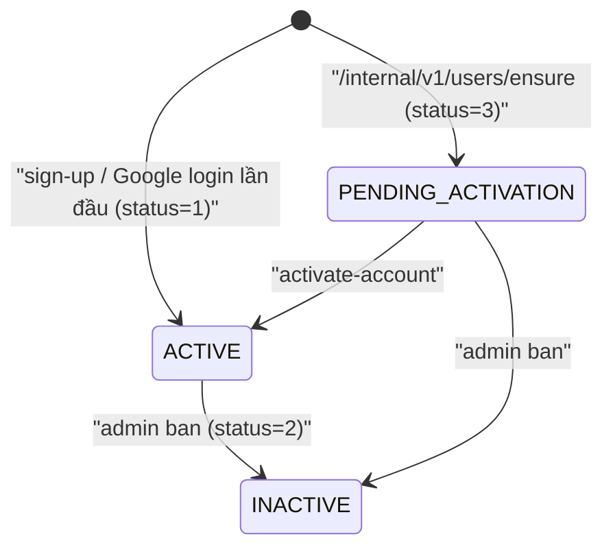
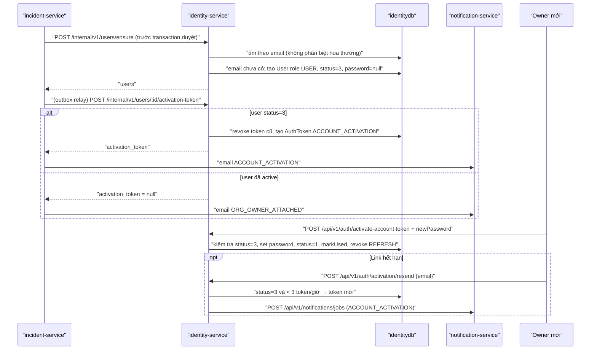
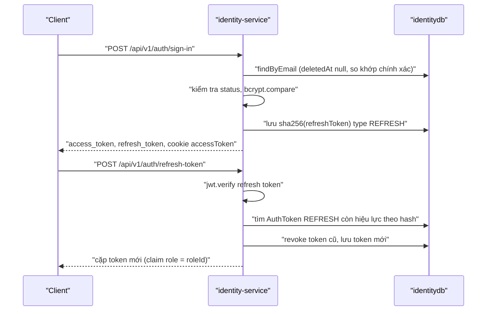

# identity-service

> Tài liệu được viết dựa hoàn toàn vào code tại `ecolink-server/services/identity-service` (đọc toàn bộ `src/`, `prisma/schema.prisma`, `prisma/migrations/*`, `prisma/seed.ts`, `.env.example`, `ecolink-server/scripts/seeds/identity-service-seed.sql`) và phần `ecolink-server/shared/da2-constants` mà service import. Mọi đường dẫn tính từ `/Users/ngoc/ecolink`.

## 1. Trách nhiệm của service

- Đăng ký, đăng nhập bằng email + mật khẩu, cấp JWT access/refresh token, xoay vòng (rotate) refresh token, đăng xuất.
- Đăng nhập bằng Google OAuth 2.0 (authorization code), tự tạo user mới nếu email chưa có.
- Đổi mật khẩu (đã đăng nhập), yêu cầu/đặt lại mật khẩu bằng token một lần.
- Khi incident-service duyệt hồ sơ tổ chức: tìm hoặc tạo **tài khoản cá nhân** cho từng owner (chưa có thì tạo ở `PENDING_ACTIVATION`, không mật khẩu), phát link kích hoạt một lần; người dùng tự yêu cầu gửi lại link từ trang đăng nhập. Không còn tài khoản riêng cho tổ chức (`accountType = ORG`, role `ORG_OWNER` đã bị xoá).
- Quản lý hồ sơ user (profile, vị trí, tuỳ chọn nhận thông báo), admin liệt kê user và ban user.
- Quản lý Role, PermissionSet (RBAC). Lưu ý: middleware kiểm tra permission có tồn tại nhưng không route nào dùng (xem mục 9).
- Cung cấp API nội bộ `/internal/v1/*` cho incident-service, notification-service, reward-service: tra email, tra user theo id, lọc user theo vị trí, lọc theo tuỳ chọn thông báo, token xác minh email liên hệ tổ chức, tra / tạo user cho owner tổ chức, phát token kích hoạt.

Bằng chứng: `ecolink-server/services/identity-service/src/index.ts` (mount các router), `ecolink-server/services/identity-service/package.json` (description "Identity service (auth + user + RBAC)").

## 2. Cấu trúc thư mục / module chính

```
ecolink-server/services/identity-service/
├── prisma/
│   ├── schema.prisma             # User, AuthToken, Role, PermissionSet, RolePermissionSet
│   ├── migrations/               # 12 migration, gồm seed role ADMIN/USER; `20260926100000_drop_org_accounts` xoá user ORG, cột account_type / provisioned_from_application_id và role ORG_OWNER
│   └── seed.ts                   # upsert role ADMIN, USER và permission set BASIC_ACCESS
├── src/
│   ├── index.ts                  # Express app, middleware toàn cục, mount router
│   ├── tracer.ts, logger.ts      # Datadog dd-trace + pino
│   ├── config/prisma.client.ts   # PrismaClient dùng thực tế
│   ├── config/database.ts        # PrismaClient singleton khác, KHÔNG được import ở đâu
│   ├── constants/                # AuthTokenType, UserStatus, re-export @da2/constants
│   ├── middleware/
│   │   ├── auth.middleware.ts                   # authenticate (JWT)
│   │   ├── authorize.middleware.ts              # authorize(...Permission) (không dùng)
│   │   ├── internal-identity-auth.middleware.ts # x-internal-api-key
│   │   ├── case-transform.middleware.ts         # body snake->camel, response camel->snake
│   │   └── error.middleware.ts                  # 500 toàn cục
│   ├── internal/internal.routes.ts # /internal/v1/*
│   ├── modules/
│   │   ├── auth/   (routes, controller, service, dto, auth_token.repository)
│   │   ├── oauth/  (Google: client, config, factory, google.service)
│   │   ├── user/   (routes, controller, service, repository, dto, entity)
│   │   └── role/   (routes, controller, service, repository, dto, permission.enum)
│   ├── openapi/                  # model cho Swagger (/openapi.json, /api-docs)
│   └── utils/                    # jwt.utils (sign/verify), token-hash (sha256, random opaque token)
```

Middleware toàn cục theo thứ tự (`ecolink-server/services/identity-service/src/index.ts`): `helmet({contentSecurityPolicy:false})` → `mountOpenApi` (`GET /openapi.json`, `/api-docs`) → `cors` (credentials: true; `CORS_ORIGIN` rỗng hoặc `*` thì phản chiếu mọi origin) → `express.json` → `express.urlencoded` → `cookieParser` → `caseTransformMiddleware` → routes → `errorHandler`.

Quy ước body/response (`ecolink-server/services/identity-service/src/middleware/case-transform.middleware.ts > caseTransformMiddleware()`):
- Key trong `req.body` được đổi đệ quy từ snake_case sang camelCase (client gửi `reject_reason` hay `rejectReason` đều được). Query string KHÔNG đổi (ví dụ `sort_by`, `sort_order` giữ nguyên).
- Mọi `res.json` được đổi key đệ quy sang snake_case (ví dụ `accessToken` → `access_token`, `userId` → `user_id`). Áp dụng cho cả route internal.
- Envelope chuẩn (`ecolink-server/shared/da2-constants/src/http-status.ts > sendSuccess()/sendError()`): thành công `{ success: true, code, message, data? }`; lỗi `{ success: false, code, message, ...additionalData }`.

## 3. Cơ chế xác thực & middleware

### 3.1 JWT (`authenticate`)
- `ecolink-server/services/identity-service/src/middleware/auth.middleware.ts > authenticate()`: lấy token từ header `Authorization: Bearer <token>`, nếu không có thì lấy cookie `accessToken`. Không có token → 401 `TOKEN_MISSING` ("Authentication token is required"). `jwt.verify` lỗi → 401 `TOKEN_INVALID` ("Invalid token"). Thành công: `req.user = { userId, email, role }`.
- Middleware chỉ verify chữ ký và hạn. KHÔNG kiểm tra user còn tồn tại, bị xoá mềm hay bị ban.
- Ký/verify: `ecolink-server/services/identity-service/src/utils/jwt.utils.ts > generateTokens()/verifyToken()`, HS256 mặc định của `jsonwebtoken`, secret `JWT_SECRET` (service throw khi khởi động nếu thiếu). Access token hết hạn theo `JWT_EXPIRES_IN` (mặc định trong code `30m`), refresh token theo `JWT_REFRESH_EXPIRES_IN` (mặc định `30d`). Cả hai token dùng CHUNG secret và CHUNG payload `{ userId, email, role }`, không có claim phân biệt loại token.
- Claim `role`: tên role (`role.name`, fallback `"USER"`) ở sign-in, Google login và refresh (refresh ghi `roleId` đã được sửa 2026-09-26).

### 3.2 Kiểm tra quyền admin
- `ecolink-server/services/identity-service/src/modules/user/user.controller.ts > requireAdmin()`: so `req.user.role.toLowerCase() === 'admin'`. Sai → 403 "Only admin can perform this action". Chỉ dùng cho `GET /api/v1/users` và `PUT /api/v1/users/:id/ban`.

### 3.3 RBAC theo permission (không được dùng)
- `ecolink-server/services/identity-service/src/middleware/authorize.middleware.ts > authorize(...requiredPermissions)`: load user → RolePermissionSet → PermissionSet → gộp `permissions`, yêu cầu có ĐỦ mọi permission. Không route nào gắn middleware này.

### 3.4 API key nội bộ
- `ecolink-server/services/identity-service/src/middleware/internal-identity-auth.middleware.ts > requireInternalIdentityApiKey()`: áp cho toàn bộ router `/internal/v1`. Nếu env `INTERNAL_IDENTITY_API_KEY` không có → 500 "INTERNAL_IDENTITY_API_KEY is not configured". Header `x-internal-api-key` thiếu hoặc khác → 401 "Invalid internal API key". So sánh bằng `!==` (không constant-time). Một key duy nhất dùng chung cho mọi service gọi vào.

### 3.5 Cookie
- Sign-in và Google callback set cookie `accessToken` (httpOnly, `secure` và `sameSite=strict` khi `NODE_ENV=production`, ngược lại `lax`; `maxAge` 15 phút cố định). Không set cookie `refreshToken` ở bất kỳ đâu, nhưng `refresh-token` có đọc cookie `refreshToken` và `logout` có xoá cookie này.

### 3.6 Token mờ (opaque token)
- `ecolink-server/services/identity-service/src/utils/token-hash.ts`: `generateOpaqueToken()` = 32 byte ngẫu nhiên base64url; DB chỉ lưu `hashOpaqueToken()` = SHA-256 hex. Refresh token (JWT) cũng được lưu dưới dạng SHA-256 của chuỗi JWT.
- `ecolink-server/services/identity-service/src/modules/auth/auth_token.repository.ts > findActiveByHashAndType()`: token hợp lệ khi `revokedAt IS NULL`, `usedAt IS NULL`, `expiresAt > now`, đúng `type`.

## 4. Danh sách API endpoint

Tổng: **37 endpoint** (handler riêng biệt, không tính Swagger `/openapi.json`, `/api-docs`):
- Auth: 11 (mount 2 lần: `/api/v1/auth/*` và `/auth/*`; `/auth/*` KHÔNG được gateway proxy, tồn tại để làm redirect URI Google mặc định `http://localhost:4000/auth/oauth/google/callback`).
- Users: 6. Roles + PermissionSets: 11. Internal: 8 (gateway KHÔNG proxy `/internal/v1`). Health: 1 (`GET /health`, không qua gateway).

Gateway: `/api/v1/auth`, `/api/v1/users`, `/api/v1/roles` được proxy nguyên path sang identity-service (`ecolink-server/api-gateway/src/index.ts`).

Viết tắt đường dẫn handler trong bảng: `AUTH_C` = `ecolink-server/services/identity-service/src/modules/auth/auth.controller.ts`, `AUTH_S` = `ecolink-server/services/identity-service/src/modules/auth/auth.service.ts`, `USER_C` = `ecolink-server/services/identity-service/src/modules/user/user.controller.ts`, `USER_S` = `ecolink-server/services/identity-service/src/modules/user/user.service.ts`, `ROLE_C` = `ecolink-server/services/identity-service/src/modules/role/role.controller.ts`, `ROLE_S` = `ecolink-server/services/identity-service/src/modules/role/role.service.ts`, `INT` = `ecolink-server/services/identity-service/src/internal/internal.routes.ts`, `GOOGLE_S` = `ecolink-server/services/identity-service/src/modules/oauth/google.service.ts`.

Mã lỗi chung: mọi handler bắt exception không nhận diện được → 500 `INTERNAL_SERVER_ERROR`. Endpoint có `authenticate` → 401 `TOKEN_MISSING` / `TOKEN_INVALID`.

### 4.1 Auth (`ecolink-server/services/identity-service/src/modules/auth/auth.routes.ts`)

| Method | Path | Auth | Role được phép | Request (validation) | Response | Mã lỗi | Handler |
|---|---|---|---|---|---|---|---|
| POST | /api/v1/auth/sign-up | Không | Public | body: `email` isEmail; `password` min 8; `name` notEmpty, trim; `roleId` optional isUUID | 201 `data`: `{id,email,name,role_id,avatar,bio,email_verified,created_at,updated_at}` | 400 VALIDATION_ERROR (message = lỗi đầu tiên); 409 "User with this email already exists"; 500 (thiếu role USER: "You are missing role" → vẫn trả 500 generic) | `AUTH_C > signup` → `AUTH_S > signup()` |
| POST | /api/v1/auth/sign-in | Không | Public | body: `email` isEmail; `password` notEmpty | 200 `data`: `{user:{id,email,name,role_id,avatar,bio}, access_token, refresh_token}` + cookie `accessToken` | 400 VALIDATION_ERROR; 401 INVALID_CREDENTIALS "Invalid email or password" (không có user / không có password / sai mật khẩu); 403 "Account banned" (status 2); 403 "This organization account has not been activated yet..." (status 3) | `AUTH_C > login` → `AUTH_S > login()` |
| GET | /api/v1/auth/oauth/google | Không | Public | query: `state` optional (string, chỉ được chuyển tiếp) | 200 `data`: `{authorization_url}` | 500 | `AUTH_C > googleAuthorize` → `GOOGLE_S > getAuthorizationUrl()` |
| GET | /api/v1/auth/oauth/google/callback | Không | Public | query: `code`, `error`, `state` (state bị bỏ qua) | 200 giống sign-in + cookie `accessToken` | 400 `<error>` hoặc "google_oauth_failed" (khi có `error`); 400 "no_code"; 403 "Account banned"; 403 "...not been activated yet..."; 500 "callback_failed" | `AUTH_C > googleCallback` → `GOOGLE_S > handleCallback()` |
| POST | /api/v1/auth/refresh-token | Không | Public | cookie `refreshToken` hoặc body `refreshToken` (không validate format) | 200 `data`: `{access_token, refresh_token, user:{id,email,name,role_id}}` | 401 "Refresh token not provided"; 401 "Invalid refresh token" (mọi lỗi bên trong đều trả về đây) | `AUTH_C > refreshToken` → `AUTH_S > refreshAccessToken()` |
| POST | /api/v1/auth/update-password | JWT | Mọi user đăng nhập | body: `oldPassword` notEmpty; `newPassword` min 8 | 200 "Password updated successfully" | 400 VALIDATION_ERROR; 401; 400 "Invalid old password" (cả khi user không có password) | `AUTH_C > updatePassword` → `AUTH_S > updatePassword()` |
| POST | /api/v1/auth/request-password-reset | Không | Public | body: `email` isEmail | 200 `data`: `{reset_token}` (token thô trả thẳng trong response) | 400 VALIDATION_ERROR (kèm `errors` array); 404 "User not found" | `AUTH_C > requestPasswordReset` → `AUTH_S > requestPasswordReset()` |
| POST | /api/v1/auth/reset-password | Không | Public | body: `resetToken` notEmpty; `newPassword` min 8 | 200 "Password reset successfully" | 400 VALIDATION_ERROR; 400 "Invalid or expired reset token" | `AUTH_C > resetPassword` → `AUTH_S > resetPassword()` |
| POST | /api/v1/auth/activate-account | Không (token một lần) | Public | body: `token` notEmpty; `newPassword` min 8 | 200 "Account activated" | 400 VALIDATION_ERROR; 400 "Invalid or expired activation token" (cả khi user không còn ở PENDING_ACTIVATION) | `AUTH_C > activateAccount` → `AUTH_S > activateAccount()` |
| POST | /api/v1/auth/activation/resend | Không | Public | body: `email` isEmail | 200 "If this email has an account waiting for activation, a new link is on its way" (luôn như vậy, kể cả khi lỗi) | 400 VALIDATION_ERROR | `AUTH_C > resendActivation` → `AUTH_S > requestActivationResend()` → `account-activation-notify.client.ts > enqueueAccountActivationEmail()` |
| GET | /api/v1/auth/me | JWT | Mọi user đăng nhập | — | 200 `data.user`: `{id,email,name,role_id,avatar,bio,phone_number,gender,date_of_birth,email_verified,created_at,updated_at,latitude,longitude,location_updated_at,detail_address,notification_preferences}` | 401; 404 "User not found" (đã xoá mềm) | `AUTH_C > me` → `AUTH_S > getMe()` |
| POST | /api/v1/auth/logout | JWT | Mọi user đăng nhập | — | 200 "Logged out successfully"; xoá cookie `refreshToken`, `accessToken` | 401 | `AUTH_C > logout` → `AUTH_S > logout()` |

### 4.2 Users (`ecolink-server/services/identity-service/src/modules/user/user.routes.ts`)

Response `user` (UserResponse, `ecolink-server/services/identity-service/src/modules/user/user.entity.ts > toUserResponse()`): `id, email, name, avatar, bio, phone_number, gender, date_of_birth, role_id, role_name (chỉ có khi admin list), email_verified, status, reject_reason, created_at, updated_at, latitude, longitude, location_updated_at, detail_address (4 field vị trí = null trừ khi includeLocation), notification_preferences`. Không bao giờ trả `password`.

| Method | Path | Auth | Role được phép | Request (validation) | Response | Mã lỗi | Handler |
|---|---|---|---|---|---|---|---|
| GET | /api/v1/users | JWT | Admin (`requireAdmin`) | query: `search` optional trim (ILIKE name/email); `status` optional int, chỉ 1 hoặc 2; `sort_by` ∈ created_at,name,email (mặc định created_at); `sort_order` ∈ asc,desc (mặc định desc); `page` int ≥1 (mặc định 1); `limit` int 1..100 (mặc định 10) | 200 `data`: `{users[], total, page, limit}` (có vị trí và role_name) | 400 VALIDATION_ERROR; 403 "Only admin can perform this action" | `USER_C > getAllUsers` → `USER_S > getAllUsers()` |
| GET | /api/v1/users/:id | JWT | Mọi user đăng nhập | param `id` (không validate UUID) | 200 `data.user`; vị trí chỉ có khi viewer = chính user | 404 "User not found"; 500 nếu id không phải UUID (lỗi Prisma) | `USER_C > getUserById` → `USER_S > getUserById()` |
| GET | /api/v1/users/email/:email | JWT | Mọi user đăng nhập | param `email` (không validate) | 200 `data.user`; vị trí chỉ khi viewer = chính user | 404 "User not found" | `USER_C > getUserByEmail` → `USER_S > getUserByEmail()` |
| PUT | /api/v1/users/:id/ban | JWT | Admin | param `id` isUUID; body `rejectReason` isString, trim, notEmpty, max 5000 | 200 "User banned successfully", `data.user` | 400 VALIDATION_ERROR; 403 non-admin; 400 "Cannot ban yourself"; 404 "User not found" | `USER_C > adminBanUser` → `USER_S > adminBanUser()` |
| PUT | /api/v1/users/:id | JWT | Mọi user đăng nhập (KHÔNG kiểm tra chủ sở hữu) | body tất cả optional: `name` trim; `avatar` null hoặc chuỗi bắt đầu `http(s)://`; `bio` trim; `roleId` isUUID; `latitude` null hoặc number -90..90; `longitude` null hoặc number -180..180 (phải đi cặp); `notificationPreferences` object, mỗi value boolean; `phoneNumber` null/chuỗi ≤20 ký tự khớp `^[0-9+\s\-().]{7,20}$` (chuỗi rỗng → null); `gender` null hoặc male/female/other/prefer_not_to_say; `dateOfBirth` null hoặc `YYYY-MM-DD` hợp lệ; `detailAddress` null hoặc chuỗi ≤255 | 200 `data.user` (luôn kèm vị trí) | 400 VALIDATION_ERROR; 404 "User not found"; 400 "latitude and longitude must be provided together" / "Invalid latitude/longitude pair"; 500 nếu `roleId` không tồn tại | `USER_C > updateUser` → `USER_S > updateUser()` |
| DELETE | /api/v1/users/:id | JWT | Mọi user đăng nhập (KHÔNG kiểm tra chủ sở hữu hay admin) | param `id` | 200 "User deleted successfully" (xoá mềm `deletedAt`) | 404 "User not found" | `USER_C > deleteUser` → `USER_S > deleteUser()` |

### 4.3 Roles & PermissionSets (`ecolink-server/services/identity-service/src/modules/role/role.routes.ts`)

Toàn bộ router KHÔNG có xác thực (dòng `import { authenticate }` bị comment out). Qua gateway ai cũng gọi được.

| Method | Path | Auth | Role được phép | Request (validation) | Response | Mã lỗi | Handler |
|---|---|---|---|---|---|---|---|
| POST | /api/v1/roles | Không | Bất kỳ ai | body: `name` notEmpty trim; `description` optional; `permissionSetIds` optional array, mỗi phần tử isUUID | 201 `data.role` `{id,name,description,permission_sets[],created_at,updated_at}` | 400 VALIDATION_ERROR; 409 "Role with this name already exists" | `ROLE_C > createRole` → `ROLE_S > createRole()` |
| GET | /api/v1/roles | Không | Bất kỳ ai | — | 200 `data.roles[]` | 500 | `ROLE_C > getAllRoles` → `ROLE_S > getAllRoles()` |
| GET | /api/v1/roles/permissions | Không | Bất kỳ ai | — | 200 `data.permissions` = giá trị enum `Permission` | 500 | `ROLE_C > getAvailablePermissions` |
| GET | /api/v1/roles/:id | Không | Bất kỳ ai | param `id` | 200 `data.role` | 404 "Role not found"; 500 nếu id không phải UUID | `ROLE_C > getRoleById` → `ROLE_S > getRoleById()` |
| PUT | /api/v1/roles/:id | Không | Bất kỳ ai | body: `name`, `description` optional; `permissionSetIds` optional array UUID (thay thế toàn bộ liên kết) | 200 `data.role` | 404 "Role not found"; 409 "Role with this name already exists" | `ROLE_C > updateRole` → `ROLE_S > updateRole()` |
| DELETE | /api/v1/roles/:id | Không | Bất kỳ ai | — | 200 "Role deleted successfully" (xoá mềm) | 404 "Role not found" | `ROLE_C > deleteRole` → `ROLE_S > deleteRole()` |
| POST | /api/v1/roles/permission-sets | Không | Bất kỳ ai | body: `name` notEmpty; `description` optional; `permissions` array min 1, mỗi phần tử string, phải thuộc enum `Permission` | 201 `data.permission_set` | 400 VALIDATION_ERROR; 400 "Invalid permissions: ..."; 500 nếu trùng name (unique DB) | `ROLE_C > createPermissionSet` → `ROLE_S > createPermissionSet()` |
| GET | /api/v1/roles/permission-sets | Không | Bất kỳ ai | — | Dự kiến 200 `data.permission_sets[]`, NHƯNG thực tế bị route `GET /:id` khai báo trước bắt mất (id = "permission-sets") → 500 | 500 | `ROLE_C > getAllPermissionSets` (không bao giờ tới được) |
| GET | /api/v1/roles/permission-sets/:id | Không | Bất kỳ ai | param `id` | 200 `data.permission_set` | 404 "Permission set not found" | `ROLE_C > getPermissionSetById` |
| PUT | /api/v1/roles/permission-sets/:id | Không | Bất kỳ ai | body: `name`, `description` optional; `permissions` optional array string thuộc enum | 200 `data.permission_set` | 404 "Permission set not found"; 400 "Invalid permissions: ..." | `ROLE_C > updatePermissionSet` → `ROLE_S > updatePermissionSet()` |
| DELETE | /api/v1/roles/permission-sets/:id | Không | Bất kỳ ai | — | 200 "Permission set deleted successfully" (xoá mềm) | 404 | `ROLE_C > deletePermissionSet` → `ROLE_S > deletePermissionSet()` |

### 4.4 Internal (`ecolink-server/services/identity-service/src/internal/internal.routes.ts`)

Mount tại `/internal/v1`, gateway KHÔNG proxy. Xác thực: header `x-internal-api-key` = `INTERNAL_IDENTITY_API_KEY` (mục 3.4). Lỗi validation trả 400 VALIDATION_ERROR kèm `errors` array.

| Method | Path | Bên gọi (theo code) | Request (validation) | Response | Mã lỗi | Handler |
|---|---|---|---|---|---|---|
| POST | /internal/v1/organization-contact-email/tokens | incident-service `ecolink-server/services/incident-service/src/modules/organization/identity-organization-contact-email.client.ts > issueOrganizationContactEmailToken()`, gọi từ `ecolink-server/services/incident-service/src/modules/organization/organization.service.ts` | body: `organizationId` isUUID; `contactEmail` isEmail; `ownerUserId` isUUID | 201 `data`: `{token}` (token thô) | 400 "Owner user not found"; 500 | `INT` handler → `AUTH_S > createOrganizationContactEmailToken()` |
| POST | /internal/v1/organization-contact-email/tokens/verify | incident-service `identity-organization-contact-email.client.ts > verifyAndConsumeOrganizationContactEmailToken()`, gọi từ `ecolink-server/services/incident-service/src/modules/organization/organization.controller.ts` | body: `token` isString notEmpty | 200 `data`: `{organization_id, contact_email}` | 404 "Invalid or expired token"; 500 | `AUTH_S > verifyAndConsumeOrganizationContactEmailToken()` |
| POST | /internal/v1/users/lookup-by-emails | incident-service `ecolink-server/services/incident-service/src/modules/organization_application/identity-owner.client.ts > lookupUsersByEmails()` (nộp đơn, xem chi tiết đơn ở admin) | body: `emails` mảng 1..20 isEmail | 200 `data`: `{users: [{id, email (lowercase), name, status, created_at}]}` (so không phân biệt hoa thường, bỏ user đã xoá) | 400; 500 | `AUTH_S > lookupUsersByEmails()` |
| POST | /internal/v1/users/ensure | incident-service `identity-owner.client.ts > ensureUsers()` (duyệt đơn, trước transaction) | body: `users` mảng 1..20 `{email isEmail, fullName ≤200}` | 200 `data`: `{users: [...]}` như trên; email chưa có user thì tạo user role USER, `password=null`, status 3, `emailVerified=true` | 400; 500 (thiếu role USER) | `AUTH_S > ensureUsersForOwners()` |
| POST | /internal/v1/users/:id/activation-token | incident-service `identity-owner.client.ts > issueActivationToken()`, gọi từ `organization-owner-onboard.publisher.ts` | param `id` isUUID | 200 `data`: `{activation_token (null nếu user không ở PENDING_ACTIVATION), expires_in_hours}` | 400; 500 | `AUTH_S > issueActivationToken()` |
| POST | /internal/v1/users/nearby-ids | incident-service `ecolink-server/services/incident-service/src/modules/organization/identity-user.client.ts > fetchUserIdsNearPoint()`, gọi từ `ecolink-server/services/incident-service/src/modules/campaign/campaign.service.ts` | body: `latitude` float -90..90; `longitude` float -180..180; `radiusMeters` optional float 1..200000 (mặc định 5000); `excludeUserIds` optional array ≤500 UUID | 200 `data`: `{user_ids[]}` | 500 | `USER_S > findUserIdsNearPointForInternal()` |
| POST | /internal/v1/users/distance-from-point | incident-service `identity-user.client.ts > fetchUsersWithDistanceFromPoint()` (hàm client có định nghĩa nhưng KHÔNG tìm thấy nơi gọi) | body: `latitude`, `longitude` như trên | 200 `data`: `{users:[{id,email,name,latitude,longitude,distance_meters}]}` (TẤT CẢ user chưa xoá, sắp theo khoảng cách) | 500 | `USER_S > findUsersWithDistanceFromPointForInternal()` |
| POST | /internal/v1/users/by-ids | incident-service `identity-user.client.ts > fetchIdentityUsersWithContactByIds()`, `fetchOrganizationOwnersByUserIds()` (nhiều nơi: organization, campaign, campaign_manager, campaign_joining_request, report); reward-service `ecolink-server/services/reward-service/src/utils/identity-user.client.ts > fetchUsersByIds()` (user-points, gamification-leaderboard, gift) | body: `ids` array 1..100, mỗi phần tử isUUID | 200 `data`: `{users: UserResponse[]}` (không có vị trí) | 500 | `USER_S > getUsersByIds()` |
| POST | /internal/v1/users/notification-prefs/filter | incident-service `identity-user.client.ts > filterUserIdsForNotificationKind()`, gọi từ `campaign/notification-jobs.client.ts`, `report/report-status-notify.client.ts` | body: `userIds` array 1..500 UUID; `kind` string notEmpty | 200 `data`: `{user_ids[]}` là các id không opt-out | 500 | `USER_S > filterUserIdsForNotificationKind()` |
| GET | /internal/v1/users/:id/email | notification-service `ecolink-server/services/notification-service/src/lib/identity-user.client.ts > fetchUserEmailById()`, gọi từ `ecolink-server/services/notification-service/src/channels/email/email.channel.ts` | param `id` isUUID | 200 `data`: `{email}` | 404 "User not found"; 500 | `USER_S > getUserEmailById()` |

### 4.5 Khác
| Method | Path | Auth | Response | Handler |
|---|---|---|---|---|
| GET | /health | Không | 200 `{status:"ok", service:"identity-service"}` | `ecolink-server/services/identity-service/src/index.ts` |

### 4.6 Business flow chính

#### 4.6.1 Trạng thái User



Xoá mềm (`deletedAt`) là trục độc lập với `status`. Không có endpoint unban.

#### 4.6.2 Tài khoản cho owner tổ chức và kích hoạt



#### 4.6.3 Đăng nhập và refresh



## 5. Event/Job phát ra và lắng nghe

- identity-service KHÔNG dùng SQS/`@da2/queue`, không có outbox, không phát event. Lời gọi HTTP nội bộ duy nhất: `POST {NOTIFICATION_SERVICE_URL}/api/v1/notifications/jobs` (dùng `fetch`, timeout 10s) khi gửi lại email kích hoạt (`src/modules/auth/account-activation-notify.client.ts`); thiếu cấu hình thì chỉ log cảnh báo.
- Gọi ra ngoài: Google OAuth (mục 7).
- Các luồng "gửi mail" liên quan identity đều do service khác làm:
  - Mail kích hoạt sau khi duyệt đơn: incident-service nhận token từ `/internal/v1/users/:id/activation-token` rồi tự enqueue mail (`ecolink-server/services/incident-service/src/modules/organization_application/organization-owner-onboard.publisher.ts > publish()`). Mail gửi lại do chính identity gửi (xem trên).
  - Mail xác minh email liên hệ tổ chức: incident-service lấy token từ `/internal/v1/organization-contact-email/tokens`.
  - Mail đặt lại mật khẩu: KHÔNG có. `requestPasswordReset` trả token trong response HTTP, không gửi mail (kind `RESET_PASSWORD` có trong `ecolink-server/shared/da2-constants/src/notification-preferences.ts` nhưng identity không dùng).

## 6. Job nền, cron, worker

Không có. Không có job dọn `auth_tokens` hết hạn (bảng chỉ có index `expires_at`).

## 7. Phụ thuộc vào service khác và dịch vụ bên ngoài

- PostgreSQL qua Prisma (`DATABASE_URL`). Truy vấn khoảng cách dùng Haversine bằng SQL thuần (`$queryRawUnsafe` có tham số `$1..$3`), không dùng PostGIS (`ecolink-server/services/identity-service/src/modules/user/user.repository.ts > findActiveUserIdsNearPoint()/findActiveUsersWithDistanceFromPoint()`).
- Google OAuth 2.0 (`ecolink-server/services/identity-service/src/modules/oauth/google-oauth.factory.ts > createConfig()`, `google-oauth.client.ts`): authorize `https://accounts.google.com/o/oauth2/v2/auth` (scope `openid email profile`, `access_type=offline`, `prompt=consent`), token `https://oauth2.googleapis.com/token`, userinfo `https://www.googleapis.com/oauth2/v2/userinfo`. Dùng `fetch` toàn cục.
- Datadog: `dd-trace` (`src/tracer.ts`), log `pino` + `pino-datadog-transport` khi có `DD_API_KEY` (`src/logger.ts`).
- Thư viện dùng chung: `@da2/constants` (HTTP_STATUS, sendSuccess/sendError, notification preferences), `@da2/express-swagger` (Swagger).
- Service gọi VÀO identity (không phải identity gọi ra): incident-service, notification-service, reward-service (mục 4.4).

## 8. Biến môi trường

| Biến | Ý nghĩa | Nguồn |
|---|---|---|
| PORT | Cổng HTTP, mặc định 4000 (Dockerfile `EXPOSE 3000`) | .env.example, `src/index.ts` |
| NODE_ENV | `production` bật cookie secure + sameSite strict; `development` log query Prisma và trả `stack` trong lỗi 500 | .env.example, `auth.controller.ts`, `error.middleware.ts`, `config/prisma.client.ts` |
| DATABASE_URL | Chuỗi kết nối Postgres | .env.example, `prisma/schema.prisma` |
| INTERNAL_IDENTITY_API_KEY | Key cho header `x-internal-api-key` của `/internal/v1` | .env.example, `internal-identity-auth.middleware.ts` |
| JWT_SECRET | Secret ký/verify JWT; thiếu thì service không khởi động | .env.example, `utils/jwt.utils.ts` |
| JWT_EXPIRES_IN | Hạn access token (code mặc định `30m`; .env.example đặt 30d) | .env.example, `utils/jwt.utils.ts` |
| JWT_REFRESH_EXPIRES_IN | Hạn refresh token (mặc định `30d`) | .env.example, `utils/jwt.utils.ts` |
| ORG_CONTACT_EMAIL_TOKEN_TTL_MS | Hạn token xác minh email liên hệ tổ chức (mặc định 72h) | .env.example (comment), `auth.service.ts` |
| ACCOUNT_ACTIVATION_TTL_MS | Hạn link kích hoạt (mặc định 72h); vẫn đọc `ORG_ACCOUNT_ACTIVATION_TTL_MS` làm dự phòng | .env.example (comment), `auth.service.ts` |
| NOTIFICATION_SERVICE_URL, INTERNAL_NOTIFICATION_API_KEY | Gửi lại email kích hoạt qua notification-service | .env.example (comment), `account-activation-notify.client.ts` |
| FRONTEND_APP_URL | Link `/activate-account?token=` trong email gửi lại | .env.example (comment), `account-activation-notify.client.ts` |
| APP_NAME | Tên ứng dụng trong email (mặc định `DA2`) | `account-activation-notify.client.ts` |
| PASSWORD_RESET_TTL_MS | Hạn token reset mật khẩu (mặc định 1h) | chỉ trong `auth.service.ts` (thiếu trong .env.example) |
| CORS_ORIGIN | Danh sách origin, phân tách dấu phẩy; rỗng hoặc `*` = cho mọi origin | .env.example, `src/index.ts` |
| GOOGLE_OAUTH_CLIENT_ID | Client id Google (mặc định chuỗi rỗng) | chỉ trong `google-oauth.factory.ts` |
| GOOGLE_OAUTH_CLIENT_SECRET | Client secret Google | chỉ trong `google-oauth.factory.ts` |
| GOOGLE_OAUTH_REDIRECT_URI | Redirect URI (mặc định `http://localhost:4000/auth/oauth/google/callback`) | chỉ trong `google-oauth.factory.ts` |
| SWAGGER_SERVER_URL | serverUrl trong OpenAPI spec | chỉ trong `src/index.ts` |
| DD_API_KEY, DD_SITE, DD_SERVICE, DD_ENV | Datadog log shipping | .env.example, `src/logger.ts`, `src/tracer.ts` |
| DD_VERSION | version cho tracer | chỉ trong `src/tracer.ts` |
| LOG_LEVEL | Mức log pino (mặc định info) | chỉ trong `src/logger.ts` |

## 9. Vấn đề cần xác nhận / [CHƯA HOÀN THIỆN]

Bảo mật (mức nghiêm trọng cao):
1. `POST /api/v1/auth/request-password-reset` trả `reset_token` thô trong response. Ai biết email là đổi được mật khẩu của người đó (chiếm tài khoản, kể cả ADMIN). Không có gửi mail. Endpoint cũng lộ việc email có tồn tại hay không (404). `ecolink-server/services/identity-service/src/modules/auth/auth.controller.ts > requestPasswordReset`, `auth.service.ts > requestPasswordReset()`.
2. `POST /api/v1/auth/sign-up` nhận `roleId` tuỳ ý từ client → tự đăng ký với role ADMIN (UUID role ADMIN trong seed SQL là cố định `11111111-1111-1111-1111-111111111111`). `auth.service.ts > signup()`.
3. `PUT /api/v1/users/:id` và `DELETE /api/v1/users/:id` không kiểm tra người gọi là chủ tài khoản hay admin → mọi user đăng nhập có thể sửa hồ sơ, đổi `roleId` (leo quyền), xoá mềm user khác. `user.controller.ts > updateUser/deleteUser`.
4. Toàn bộ `/api/v1/roles/*` không có xác thực (import `authenticate` bị comment out) → ai cũng tạo/sửa/xoá role và permission set. `role.routes.ts`.
5. `authenticate` không kiểm tra `status`/`deletedAt` → user bị ban hoặc bị xoá vẫn dùng access token còn hạn (với .env.example là 30 ngày). Ban/logout chỉ revoke refresh token.
6. Access và refresh token dùng chung secret và payload, không có claim loại token → refresh token dùng được như access token. Nếu `JWT_EXPIRES_IN` = `JWT_REFRESH_EXPIRES_IN` (như .env.example, cùng 30d) thì hai token ký cùng giây là GIỐNG HỆT nhau. `utils/jwt.utils.ts > generateTokens()`.
7. Google OAuth không kiểm tra `state` (CSRF), callback trả token dạng JSON chứ không redirect. `google.service.ts > handleCallback()` bỏ qua `_state`.
8. `GET /api/v1/users/:id` và `/users/email/:email`: mọi user đăng nhập xem được email, status, reject_reason, notification_preferences của user khác, và dò được email.
9. `/internal/v1/users/distance-from-point` trả email + toạ độ của TẤT CẢ user; client có định nghĩa nhưng không tìm thấy nơi gọi (comment "debug on campaign create").
10. API key nội bộ so sánh bằng `!==` (không constant-time); một key chung cho mọi service.

Bug logic:
11. ~~Refresh đặt claim `role = user.roleId`~~ — đã sửa 2026-09-26 (`refreshAccessToken()` đọc role và ký tên role).
12. `GET /api/v1/roles/permission-sets` bị `GET /:id` khai báo trước bắt mất → luôn 500 (id không phải UUID). `role.routes.ts`.
13. `replacePermissionSetsForRole` xoá mềm liên kết cũ rồi `createMany` → gắn lại cùng permission set sẽ vi phạm unique `(roleId, permissionSetId)` → 500. `role.repository.ts > replacePermissionSetsForRole()`.
14. Unique DB trên `users.email`, `roles.name`, `permission_sets.name` không tính `deletedAt`, trong khi code kiểm tra trùng có lọc `deletedAt: null` → tạo lại cùng email/name sau khi xoá mềm → lỗi Prisma P2002 → 500. Với `/internal/v1/users/ensure`, email của user đã xoá mềm: tạo lỗi, đọc lại không thấy (đã xoá) → 500 và duyệt đơn trả 503.
15. Email không được chuẩn hoá khi sign-up/sign-in (so khớp chính xác, phân biệt hoa thường), nhưng Google login và `ensure` lưu lowercase → cùng một người có thể có 2 tài khoản. `lookup-by-emails` / `ensure` so khớp không phân biệt hoa thường nên nhận ra tài khoản sign-up khác hoa thường.
16. ~~Không có cách cấp lại link kích hoạt~~ — đã có `POST /api/v1/auth/activation/resend` và mỗi lần onboarding retry đều phát token mới. Duyệt đơn lỗi sau `ensure` để lại user status 3 không có membership; lần duyệt sau dùng lại.
17. ~~Kích hoạt không kiểm tra status~~ — `activateAccount()` chỉ chấp nhận user đang `PENDING_ACTIVATION`.
18. ~~Hạn link lệch giữa identity và incident~~ — identity trả `expires_in_hours` cho incident.
19. `findActiveUserIdsNearPoint` có comment "Active users" nhưng chỉ lọc `deletedAt`, không lọc `status` → user bị ban/đang chờ kích hoạt vẫn được trả về.
20. Google user mới được lưu `password = crypto.randomUUID()` KHÔNG hash. bcryptjs trả false vì độ dài khác 60 nên không đăng nhập được bằng chuỗi này, nhưng user Google không thể dùng `update-password` (sai old password), phải qua reset.
21. Cookie `accessToken` `maxAge` cố định 15 phút, lệch với hạn JWT. Không set cookie `refreshToken` nhưng refresh/logout có dùng.
22. Hai lần refresh trong cùng một giây với cùng payload tạo token giống nhau → vi phạm unique `token_hash` → trả 401 sau khi token cũ đã bị revoke.
23. `errorHandler` luôn trả 500 (kể cả body JSON sai cú pháp).
24. `GET /api/v1/users?status=` chỉ chấp nhận 1 hoặc 2, không lọc được 3 (PENDING_ACTIVATION).
25. `updateUser` với `roleId` không tồn tại → lỗi Prisma → 500. Không kiểm tra độ dài `name`/`bio`.
26. `latitude`/`longitude` phải là kiểu number JSON; chuỗi số bị từ chối.
27. Admin có thể ban admin khác. Không có unban, không có thông báo sang service khác khi ban.

[CHƯA HOÀN THIỆN] / code chết:
28. `emailVerified` + `verificationToken`: không có luồng xác minh email cho user thường (luôn `false` khi sign-up).
29. `authorize()` middleware và enum `Permission` không được dùng cho route nào; permission trong seed (`READ_SELF`, `UPDATE_SELF`, `READ_ALL`, `WRITE_ALL`, `MANAGE_USERS`) không thuộc enum `Permission` (enum cũng không thể tạo các set này qua API).
30. Không dùng: `config/database.ts`, `jwt.utils.ts > decodeToken()`, `role.repository.ts > linkPermissionSetToRole()/unlinkPermissionSetFromRole()`, `user.repository.ts > findAll()`.
31. Seed SQL dùng hash mật khẩu giả (`$2b$10$seededhashedpasswordplaceholder`, không đủ 60 ký tự) → user seed không đăng nhập được bằng mật khẩu; seed refresh token hash là chuỗi giả.
32. `.env.example` thiếu `GOOGLE_OAUTH_*`, `APP_NAME`, `PASSWORD_RESET_TTL_MS`, `SWAGGER_SERVER_URL`, `LOG_LEVEL`, `DD_VERSION`.
33. Không có job dọn `auth_tokens` hết hạn/đã revoke.
