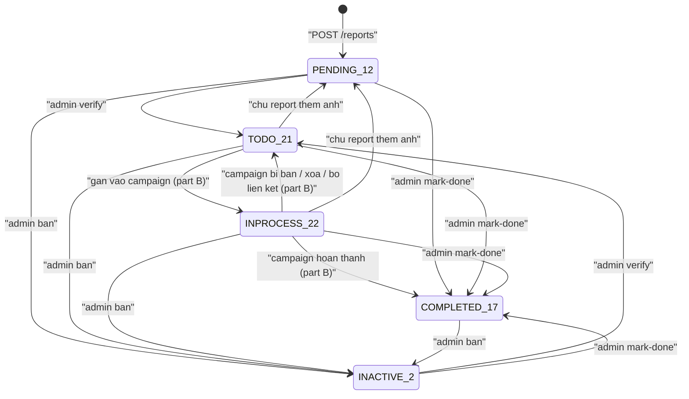
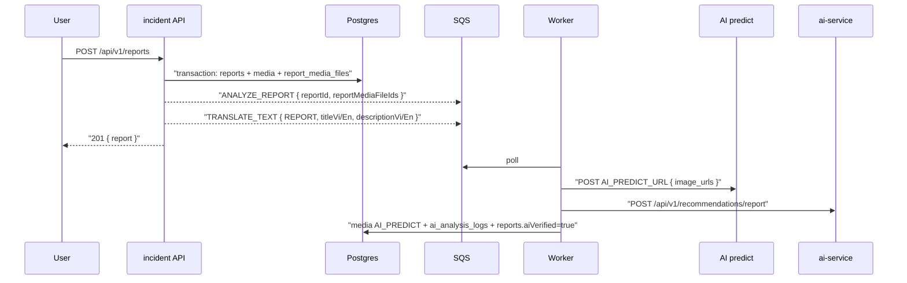
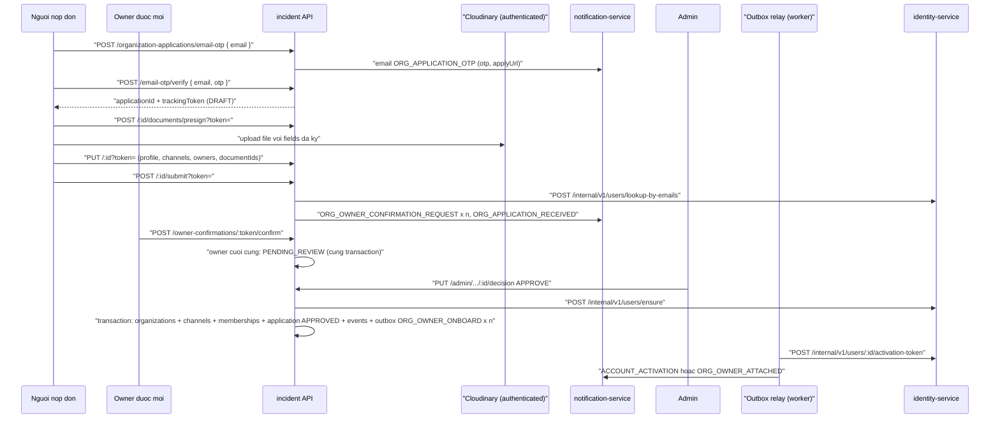
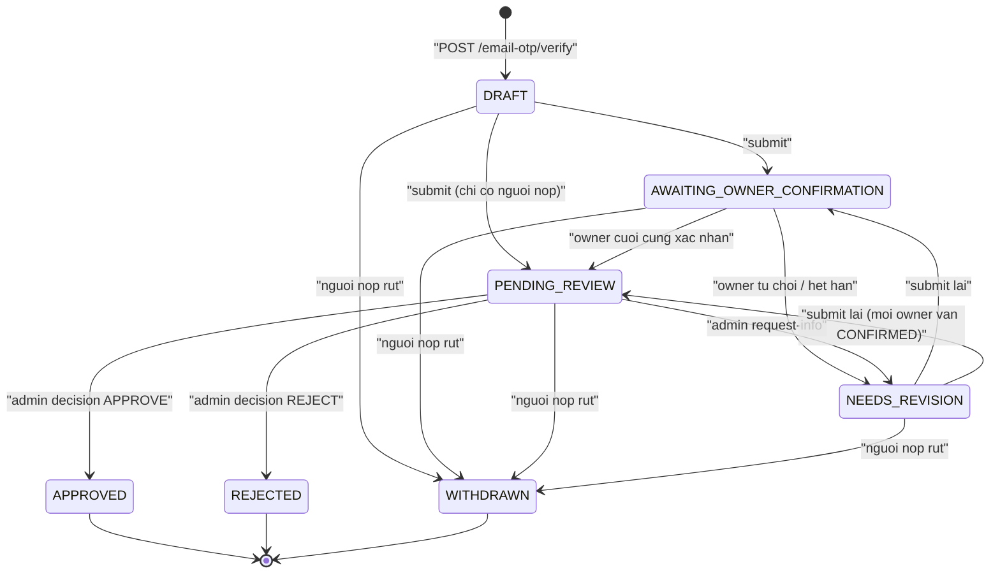

# incident-service

> Service lớn nhất trong hệ thống (cổng `3001`, DB `incidentdb`). Tài liệu chia làm 2 phần:
> - **Phần A**: report, vote, SOS, saved resource, media, organization, organization application, cùng auth và middleware dùng chung
> - **Phần B**: campaign (task, join request, điểm danh, submission, hoàn thành), reward client, translation, background job, outbox, queue, resilience
>
> Tổng endpoint: **96** (phần A 57, phần B 39), cộng `/health` và Swagger.
> Mọi đường dẫn tính từ `/Users/ngoc/ecolink`. Tiền tố `IS/` = `ecolink-server/services/incident-service/`.

**Mục lục:** [Phần A](#phan-a) · [Phần B](#phan-b)

<a id="phan-a"></a>

# PHẦN A — Report, Vote, SOS, Saved resource, Media, Organization, Organization application

> Tài liệu viết dựa hoàn toàn vào code tại `ecolink-server/services/incident-service`. Phạm vi phần A: `src/modules/report`, `src/modules/vote`, `src/modules/sos`, `src/modules/saved_resource`, `src/modules/media`, `src/modules/admin_media`, `src/modules/organization`, `src/modules/organization_application`, cùng hạ tầng dùng chung (`src/index.ts`, `src/worker.ts`, `src/middleware/*`, `src/config/*`, `src/utils/*`, `src/constants/*`), `prisma/schema.prisma` và `ecolink-server/shared/da2-constants/src/*`.
> Phần B (campaign, reward client, translation, background-job, outbox, queue, resilience) nằm ở Phần B phía dưới.
> Mọi đường dẫn tính từ `/Users/ngoc/ecolink`. Để gọn, trong bảng dùng tiền tố `IS/` = `ecolink-server/services/incident-service/` và `DC/` = `ecolink-server/shared/da2-constants/`.

## 1. Trách nhiệm của service (phần A)

- **Báo cáo sự cố môi trường (report)**: user tạo report kèm ảnh và toạ độ; tìm kiếm theo bộ lọc / khoảng cách PostGIS; chủ report sửa, thêm/xoá ảnh, xoá mềm; admin duyệt (verify), cấm (ban), đánh dấu hoàn thành (mark-done). Tạo report và thêm ảnh sẽ đẩy job phân tích ảnh AI (`ANALYZE_REPORT`) và job dịch (`TRANSLATE_TEXT`). Mark-done ghi outbox event cộng điểm xanh cho người báo cáo.
- **Vote**: upvote / downvote (toggle) cho report hoặc campaign; upvote report ghi outbox event mốc vote (`REPORT_VOTE_MILESTONE_GREEN_POINTS`).
- **SOS**: tạo yêu cầu khẩn cấp gắn với một campaign đang ACTIVE (toạ độ lấy từ campaign), liệt kê (có lọc theo khoảng cách), đánh dấu đã xử lý.
- **Saved resource**: lưu / bỏ lưu (toggle) report hoặc campaign, liệt kê danh sách đã lưu kèm dữ liệu chi tiết.
- **Admin media**: admin đăng ký một URL ảnh (đã upload ở nơi khác) thành bản ghi `Media` loại `OTHER`. Không có chức năng kiểm duyệt media. Thư mục `src/modules/media` chỉ có thư mục `__tests__` rỗng.
- **Organization**: danh sách / chi tiết tổ chức (kèm `owners[]`, `myRole`, `isOwner`), cập nhật hồ sơ (người có vai owner), xác minh email liên hệ, admin verify/ban, yêu cầu tham gia (join request), duyệt/huỷ/rời tổ chức, liệt kê thành viên. Endpoint tạo tổ chức trực tiếp chỉ còn dùng nội bộ (`x-internal-api-key`).
- **Organization application (đơn đăng ký tổ chức)**: form công khai không cần đăng nhập. OTP mở đơn `DRAFT` và cấp tracking token; người nộp lưu nháp (kèm danh sách owner), upload giấy tờ vào Cloudinary chế độ `authenticated`, nộp, gửi lại lời mời, rút. Mỗi owner xác nhận / từ chối qua link riêng (không đăng nhập); sweeper mỗi giờ xử lý link hết hạn. Admin chỉ thấy đơn từ `PENDING_REVIEW`; approve gọi identity `ensure` rồi, trong một transaction, tạo `organizations` + `organization_channels` + membership vai owner (advisory lock cho trần 3 tổ chức) + outbox `ORG_OWNER_ONBOARD`; relay gửi email kích hoạt hoặc "đã gắn vai". Thiết kế: `docs/ORG_OWNERSHIP_FLOW.md`.
- Ghi trường trust (Blue Tick): `orgType`, `kycStatus`, `trustTier`, `domainVerified`, `verifiedAt/By`, `verificationExpiresAt` chỉ được ghi đúng một lần, lúc approve đơn. Không có API nào sửa các trường này sau đó (xem mục 9). `orgType`, `kycStatus`, `trustTier`, `tickSuspended`, `verifiedAt`, `verificationExpiresAt` được trả ra (chỉ đọc) trong `OrganizationResponse`; `domainVerified`, `verifiedBy` không được trả ra.

Bằng chứng mount router: `IS/src/index.ts` (các dòng `app.use(...)`).

## 2. Cấu trúc thư mục / module chính

```
ecolink-server/services/incident-service/
├── prisma/schema.prisma            # 31 model (từ điển dữ liệu nằm trong ghi chú gửi điều phối)
├── src/
│   ├── index.ts                    # Express app; import "./worker" (xem mục 6, 9)
│   ├── worker.ts                   # startAllQueues() + startOutboxRelay()
│   ├── tracer.ts                   # dd-trace
│   ├── config/prisma.client.ts
│   ├── constants/                  # re-export @da2/constants; job-type.enum.ts
│   ├── middleware/
│   │   ├── auth.middleware.ts          # authenticate (JWT)
│   │   ├── internal-auth.middleware.ts # requireInternalIncidentApiKey
│   │   ├── rate-limit.middleware.ts    # otpPerEmailLimiter, otpPerIpLimiter, applicationPublicLimiter
│   │   ├── case-transform.middleware.ts
│   │   └── error.middleware.ts
│   ├── utils/                      # jwt.utils, token-hash, query-uuid-list, case-converter, resolve-request-locale
│   └── modules/
│       ├── report/                 # routes, controller, service, repository, report_media.repository,
│       │                           # report-ai-analysis.service (dùng bởi worker), report-status-notify.client
│       ├── vote/                   # routes, controller, service, repository, dto
│       ├── sos/                    # routes, controller, service, repository, dto, entity
│       ├── saved_resource/         # routes, controller, service, repository, dto
│       ├── admin_media/            # routes, controller
│       ├── media/                  # chỉ có __tests__/ rỗng
│       ├── organization/           # routes, controller, service, 3 repository, organization-membership.service, identity-user.client,
│       │                           # identity-organization-contact-email.client, *-notify.client, *-urls
│       └── organization_application/
│           ├── organization-application.{routes,controller,service,repository,dto}.ts
│           ├── organization-application-admin.{routes,controller,service}.ts
│           ├── organization-application-otp.{service,repository}.ts
│           ├── owner-candidates.ts                # validateOwnerList, snapshot, token xác nhận
│           ├── owner-confirmation.service.ts      # trang xác nhận, confirm, decline, expireOverdue
│           ├── owner-confirmation-expiry.job.ts   # sweeper mỗi giờ (chạy trong worker.ts)
│           ├── organization-owner-onboard.publisher.ts   # outbox ORG_OWNER_ONBOARD
│           ├── identity-owner.client.ts           # lookup-by-emails, ensure, activation-token
│           ├── organization-application-notify.client.ts
│           ├── organization-application-urls.ts
│           └── storage/{document-storage,cloudinary-document-storage}.ts
```

Middleware toàn cục theo thứ tự (`IS/src/index.ts`): `helmet({contentSecurityPolicy:false})` → `mountOpenApi` (Swagger) → `cors({ origin: CORS_ORIGIN || "*", credentials: true })` → `express.json` → `express.urlencoded` → `cookieParser` → `camelCaseRequestBody` → `snakeCaseResponseBody` → `GET /health` → routes → `errorHandler`.

Quy ước dữ liệu:
- `IS/src/middleware/case-transform.middleware.ts > camelCaseRequestBody()`: đổi đệ quy key của `req.body` từ snake_case sang camelCase. **Query string không đổi**, nên các tham số query như `wasteType`, `severityLevel`, `maxDistance`, `sortBy`, `reportIds`, `campaignId` phải gửi đúng camelCase (một số chỗ có hỗ trợ cả hai: `media_file_ids`, `is_email_verified`, `is_owner`, `request_status`, `user_id`, `sort_by`, `sort_order`, `org_type`).
- `snakeCaseResponseBody()`: đổi đệ quy mọi key trong `res.json` sang snake_case, kể cả JSON lưu trong DB (ví dụ `profile.contactEmail` → `profile.contact_email`, `channels[].isPrimary` → `is_primary`).
- Envelope (`DC/src/http-status.ts > sendSuccess()/sendError()`): thành công `{ success: true, code, message, data? }`; lỗi `{ success: false, code, message, ...additionalData }`. Lỗi validation: 400 `VALIDATION_ERROR` + `errors: [...]` (express-validator).
- `IS/src/middleware/error.middleware.ts > errorHandler()`: trả 500 `{ success:false, message }` (thêm `stack` khi `NODE_ENV=development`). Với Express 4.22, lỗi ném ra trong handler `async` KHÔNG tới được middleware này (xem mục 9).

## 3. Cơ chế xác thực & middleware (dùng chung toàn service)

### 3.1 JWT — `authenticate`
- `IS/src/middleware/auth.middleware.ts > authenticate()`: lấy token từ header `Authorization: Bearer <token>`; nếu header không bắt đầu bằng `Bearer ` thì lấy cookie `accessToken`. Không có token → 401 `TOKEN_MISSING` ("Authentication token is required"). Verify lỗi (sai chữ ký, hết hạn, sai định dạng) → 401 `TOKEN_INVALID` ("Invalid token"); mã `TOKEN_EXPIRED` không được dùng.
- `IS/src/utils/jwt.utils.ts > verifyToken()`: `jwt.verify(token, JWT_SECRET)` (thư viện `jsonwebtoken`, không truyền `algorithms`). Module throw ngay khi import nếu `JWT_SECRET` rỗng, nên cả API lẫn worker không khởi động được khi thiếu biến này.
- Payload gắn vào `req.user`: `{ userId: string, email: string, role?: string }` (`TokenPayload`). Không kiểm tra user còn tồn tại hay bị ban. `optionalAuthenticate()` (cùng file) gắn `req.user` nếu token hợp lệ, bỏ qua lỗi — dùng cho trang xác nhận owner.
- `decodeToken()` (decode không verify) có nhưng không được dùng.
- Token do identity-service ký với cùng `JWT_SECRET`. Ghi chú liên service: identity ký claim `role` = tên role khi sign-in (`ecolink-server/services/identity-service/src/modules/auth/auth.service.ts`, dòng `role: role?.name ?? "USER"`), nhưng khi refresh lại ký `role: user.roleId` (UUID). Mọi kiểm tra admin ở incident-service so sánh `role.toLowerCase() === "admin"`, nên admin dùng access token sinh từ refresh sẽ bị 403 (xem mục 9).

### 3.2 Kiểm tra quyền admin
Không có middleware role. Mỗi controller tự so sánh `req.user.role?.toLowerCase() === "admin"`:
- Report: `IS/src/modules/report/report.controller.ts > adminBanReport / adminVerifyReport / adminMarkReportDone` (403 "Only admin can ban a report" / "Only admin can verify a report" / "Only admin can mark report as done"). `IS/src/modules/report/report.service.ts > isAdminRole()` dùng để CẤM admin sửa/xoá report (403 "Admins cannot edit reports").
- Organization: `IS/src/modules/organization/organization.controller.ts > adminVerifyOrganization` (403 "Only admin can verify an organization").
- Organization application: `IS/src/modules/organization_application/organization-application-admin.controller.ts > requireAdmin()` (401 nếu không có userId; 403 "Only admin can review organization applications"). Comment trong code ghi rõ: spec dành quyền đổi trust tier cho super-admin, nhưng identity chỉ seed ADMIN và USER nên ADMIN dùng cho cả hai.
- Admin media: `IS/src/modules/admin_media/admin-media.controller.ts > assertAdmin()` (403 "Only admin can register catalog media").

### 3.3 Quyền chủ sở hữu (ownership)
- Report: chỉ `report.userId === req.user.userId` được sửa/thêm ảnh/xoá ảnh/xoá report, và report không ở trạng thái banned (`IS/src/modules/report/report.service.ts > assertReporterMayEditReport()`).
- Organization: chỉ user có membership vai `LEGAL_REPRESENTATIVE` hoặc `OWNER` (`organization_member.repository.ts > isOwner()`, `organization.service.ts > assertOwner()`) được update, resend email, xem/duyệt join request. Một tổ chức có thể có nhiều owner; tổ chức không có tài khoản đăng nhập.

### 3.4 API key nội bộ của incident-service
- `IS/src/middleware/internal-auth.middleware.ts > requireInternalIncidentApiKey()`: so sánh header `x-internal-api-key` với `INTERNAL_INCIDENT_API_KEY` bằng `!==`. Biến chưa cấu hình → 500 "INTERNAL_INCIDENT_API_KEY is not configured"; thiếu/sai key → 401 `UNAUTHORIZED` "Invalid internal API key". Chỉ dùng cho `POST /api/v1/organizations`.
- Khi incident-service gọi đi service khác: header `x-internal-api-key` với `INTERNAL_IDENTITY_API_KEY` (identity), `INTERNAL_NOTIFICATION_API_KEY` (notification). Các lời gọi AI trong phần A (`AI_PREDICT_URL`, `AI_SERVICE_URL/api/v1/recommendations/report`) không gửi header xác thực nào.

### 3.5 Token của form đăng ký tổ chức (không đăng nhập)
Tất cả lưu dạng sha256 hex trong bảng `organization_application_otps` (`IS/src/utils/token-hash.ts > hashOpaqueToken()`), cột `purpose`:

| Purpose | Sinh ở | TTL mặc định (env) | Dùng một lần | Dùng để |
| --- | --- | --- | --- | --- |
| `OTP` (6 chữ số, `randomInt`) | `requestOtp()` | 10 phút (`APPLICATION_OTP_TTL_MS`) | Có (`usedAt`), tối đa `APPLICATION_OTP_MAX_ATTEMPTS`=5 lần sai | Mở đơn DRAFT + nhận tracking token |
| `LINK` (32 byte base64url) | `requestOtp()` | bằng TTL của OTP | Không tiêu thụ, bị expire khi verify OTP thành công hoặc khi xin mã mới | Mở lại form với email khoá sẵn (`GET /email-otp/link`) |
| `TRACKING` | `issueTrackingToken()` lúc verify OTP, lúc nộp lần đầu, lúc admin request-info, lúc owner từ chối / hết hạn | 180 ngày (`APPLICATION_TRACKING_TOKEN_TTL_MS`) | Không | Query `?token=` để xem / lưu nháp / presign / nộp / gửi lại lời mời / rút |

Nguồn: `IS/src/modules/organization_application/organization-application-otp.service.ts`, `IS/src/modules/organization_application/organization-application-otp.repository.ts > OtpPurpose`.

- Tracking token gắn với **email**, không gắn với đơn cụ thể: service chỉ kiểm tra `application.submitterEmail === email` (`organization-application.service.ts > loadForApplicant()/getForApplicant()`). Token sai / hết hạn → 401 `TRACKING_TOKEN_INVALID`.
- **Token xác nhận owner** không nằm ở bảng này: 32 byte base64url, lưu sha256 ở `organization_application_owners.confirm_token_hash` (unique), hạn 14 ngày (`owner-candidates.ts > newConfirmToken()`); dùng trong path `/owner-confirmations/:token`.

### 3.6 Rate limit
`IS/src/middleware/rate-limit.middleware.ts` (express-rate-limit, bộ nhớ trong tiến trình, fixed window):
- Khoá mặc định theo IP lấy phần tử đầu của `X-Forwarded-For` (vì mọi request đi qua gateway), fallback `req.ip`.
- `otpPerEmailLimiter`: `OTP_RATE_MAX_PER_EMAIL` (3) / `OTP_RATE_WINDOW_MS` (1 giờ) theo `email` trong body; hoàn lại lượt khi response 4xx/5xx (`skipFailedRequests`).
- `otpPerIpLimiter`: `OTP_RATE_MAX_PER_IP` (10) / giờ theo IP; tính cả lượt lỗi.
- `applicationPublicLimiter`: `APPLICATION_RATE_MAX_PER_IP` (60) / `APPLICATION_RATE_WINDOW_MS` (1 giờ) theo IP cho các endpoint công khai còn lại.
- Vượt → 429 `TOO_MANY_REQUESTS` với message tương ứng.
- `rateLimitDisabled()`: chỉ tắt khi `NODE_ENV !== "production"` VÀ `APPLICATION_RATE_LIMIT_DISABLED === "true"`. Cờ này cũng tắt bộ đếm DB trong `requestOtp()`.
- Lớp thứ hai trong DB: `organization-application-otp.service.ts > requestOtp()` đếm số OTP đã phát cho email trong 1 giờ qua (`countIssuedSince`), `>= OTP_RATE_MAX_PER_EMAIL` → 429.

### 3.7 Endpoint công khai
Không qua `authenticate`: `GET /health`, `GET /api/v1/organizations/verify-contact-email`, toàn bộ `/api/v1/organization-applications/*` (dùng submission/tracking token). `POST /api/v1/organizations` dùng API key nội bộ.

## 4. Danh sách API endpoint

**Tổng số endpoint phần A: 54** (report 15, vote 2, SOS 3, saved resource 2, admin media 1, organization 16, organization application công khai 9, organization application admin 6). Ngoài ra service có `GET /health` và các route Swagger do `mountOpenApi` gắn.

Mọi prefix dưới đây đều được api-gateway proxy nguyên đường dẫn (`ecolink-server/api-gateway/src/index.ts`), riêng saved resource: gateway `/api/v1/incident/saved-resources` → upstream `/incident/saved-resources`. `POST /api/v1/organizations` vẫn đi qua gateway được nhưng cần `x-internal-api-key`.

Chú thích cột Auth: **JWT** = `authenticate`; **Public** = không xác thực; **Key** = `x-internal-api-key`; **Track** = query `token` (tracking token).

### 4.1 Report — `IS/src/modules/report/report.routes.ts` (prefix `/api/v1/reports`)

| Method | Path | Auth | Role | Request | Response (`data`) | Mã lỗi | Handler |
| --- | --- | --- | --- | --- | --- | --- | --- |
| POST | `/api/v1/reports` | JWT | Mọi user | Body: `title` bắt buộc (trim); `description?`, `titleVi?`, `titleEn?`, `descriptionVi?`, `descriptionEn?` (không validate), `wasteType?`, `severityLevel?` int 1..5, `latitude` bắt buộc float -90..90, `longitude` bắt buộc float -180..180, `detailAddress?`, `imageUrls` mảng ≥1 chuỗi không rỗng (không kiểm tra là URL) | 201 `{ report }` (ReportResponse) | 400 VALIDATION_ERROR; 401; 500 mọi lỗi khác | `IS/src/modules/report/report.controller.ts > createReport` → `report.service.ts > createReport()` |
| GET | `/api/v1/reports/search` | JWT | Mọi user | Query: `search?`, `status?` int, `statuses?` (lặp hoặc phẩy, ≤25 số nguyên), `wasteType?`, `severityLevel?` 1..5, `latitude?`, `longitude?`, `maxDistance?` int ≥1 (mét, mặc định 50000), `sortBy?` distance/createdAt/severityLevel, `sortOrder?` asc/desc, `page?` ≥1 (1), `limit?` 1..100 (10) | 200 `{ reports[], total, page, limit, totalPages }` (ReportDetailResponse có `mediaFiles`, `handledBy`, `votes`, `saved`, `user`, `distance?`) | 400; 500 | `report.controller.ts > searchReports` → `report.service.ts > searchReports()` |
| GET | `/api/v1/reports/my` | JWT | Chủ report | Như `/search` | Như `/search`, chỉ report của mình | 400; 401; 500 | `report.controller.ts > getMyReports` → `searchMyReports()` |
| GET | `/api/v1/reports/all` | JWT | Mọi user | — | 200 `{ reports[] }` — report `status = TODO(21)` (comment ghi "ACTIVE" nhưng code lọc TODO), không phân trang | 500 | `report.controller.ts > getAllActiveReports` → `getAllActiveReports()` → `report.repository.ts > findAllToDo()` |
| GET | `/api/v1/reports/by-ids` | JWT | Mọi user | Query `reportIds` bắt buộc, UUID, ≤100 (lặp hoặc phẩy) | 200 `{ reports[] }` theo thứ tự yêu cầu, bỏ id không tồn tại/đã xoá | 400 "reportIds is required" / "reportIds must be valid UUIDs with at most 100 values…"; 500 | `report.controller.ts > getReportsByIds` → `getReportsByIds()` |
| GET | `/api/v1/reports/media-files/by-ids` | JWT | Chủ report hoặc report `isVerify=true` | Query `mediaFileIds` (hoặc `media_file_ids`), UUID ≤100 | 200 `{ mediaFiles: [{ id, reportId, mediaId, url, type, createdAt }] }` | 400; 401; 500 | `report.controller.ts > getReportMediaFilesByIds` → `report_media.repository.ts > findManyByIdsVisibleToViewer()` |
| GET | `/api/v1/reports/:id/background-jobs/status` | JWT | Mọi user | Param `id` UUID | 200 `{ backgroundJobs: { allDone, jobCount, pendingOrInProcessCount } }` (đếm job `ANALYZE_REPORT` theo `payload.reportId`) | 400; 401; 404 REPORT_NOT_FOUND; 500 | `report.controller.ts > getReportBackgroundJobsStatus` → `getReportBackgroundJobsStatus()` |
| GET | `/api/v1/reports/:id` | JWT | Mọi user | Param `id` (không validate UUID) | 200 `{ report }` (ReportDetailResponse) | 404 REPORT_NOT_FOUND (không tồn tại, đã xoá, hoặc `status=INACTIVE` banned); 500 (kể cả id không phải UUID) | `report.controller.ts > getReportDetail` → `getReportDetail()` |
| PUT | `/api/v1/reports/:id` | JWT | Chủ report, không phải admin | Body tất cả optional: `title`, `titleVi`, `titleEn`, `description`, `descriptionVi`, `descriptionEn`, `lang` (vi/en, không dùng), `wasteType`, `severityLevel` 1..5, `latitude`, `longitude`, `detailAddress` | 200 `{ report }` | 400; 401; 403 "Admins cannot edit reports" / "Only the report owner can edit this report" / "This report has been banned and cannot be edited"; 404 REPORT_NOT_FOUND; 500 | `report.controller.ts > updateReport` → `updateReport()` |
| POST | `/api/v1/reports/:id/media` | JWT | Chủ report, không phải admin | Body `imageUrls` mảng ≥1 chuỗi không rỗng | 200 `{ report }` | 400 (validation, hoặc "imageUrls must contain at least one non-empty URL"); 401; 403 (như trên); 404; 500 | `report.controller.ts > addReportImages` → `addReportImages()` |
| DELETE | `/api/v1/reports/:id/media/:mediaFileId` | JWT | Chủ report, không phải admin | Param `mediaFileId` UUID | 200 "Report media file deleted successfully" `{ report }` | 400; 401; 403; 404 REPORT_NOT_FOUND / "Report media file not found"; 500 | `report.controller.ts > deleteReportMediaFile` → `deleteReportMediaFile()` |
| PUT | `/api/v1/reports/:id/verify` | JWT | admin | Param `id` UUID | 200 "Report verified successfully" `{ report }` | 400; 401; 403 "Only admin can verify a report"; 404; 500 | `report.controller.ts > adminVerifyReport` → `adminVerifyReport()` |
| PUT | `/api/v1/reports/:id/ban` | JWT | admin | Param `id` UUID; body `rejectReason` chuỗi, trim, không rỗng, ≤5000 | 200 "Report banned successfully" `{ report }` | 400 "reject_reason is required when banning a report"; 401; 403 "Only admin can ban a report"; 404; 500 | `report.controller.ts > adminBanReport` → `adminBanReport()` |
| PUT | `/api/v1/reports/:id/mark-done` | JWT | admin | Param `id` UUID | 200 "Report marked as done successfully" `{ report }` | 400; 401; 403 "Only admin can mark report as done"; 404; 500 | `report.controller.ts > adminMarkReportDone` → `adminMarkReportDone()` |
| DELETE | `/api/v1/reports/:id` | JWT | Chủ report, không phải admin | Param `id` (không validate) | 200 "Report deleted successfully" | 401; 403; 404; 500 | `report.controller.ts > deleteReport` → `deleteReport()` |

Chi tiết response `ReportResponse` (`IS/src/modules/report/report.entity.ts > toReportResponse()`, `report.dto.ts`): `id, userId, user {id,name,avatar,bio}|null, title (= titleVi ?? title), titleVi (= titleVi ?? title), titleEn, description (= descriptionVi ?? description), descriptionVi, descriptionEn, wasteType, severityLevel, latitude, longitude, detailAddress, status, isVerify, rejectReason, aiVerified, aiRecommendation, createdAt, updatedAt, distance?, votes {upvoteCount, downvoteCount, myVote}, saved`. `ReportDetailResponse` thêm `mediaFiles [{ id, mediaId, url, ai_analysis_url, uploadedBy, createdAt }]` và `handledBy { id, name, slug, logoUrl, backgroundUrl, contactEmail } | null` (tổ chức của campaign chứa report).

Lưu ý hiển thị:
- `/search`, `/my`, `/by-ids` không lọc theo trạng thái: report `PENDING` chưa duyệt và report bị ban (`INACTIVE`) vẫn trả về (chỉ loại report đã xoá mềm). Chỉ `GET /:id` ẩn report bị ban.
- `search` chỉ tìm trong `title`, `description` (không tìm `titleVi/titleEn`).
- Hồ sơ người báo cáo lấy từ identity (`fetchOrganizationOwnersByUserIds`); lỗi identity → `user = { id, name: "", avatar: null, bio: null }`.

### 4.2 Vote — `IS/src/modules/vote/vote.routes.ts` (prefix `/api/v1/incident/votes`)

| Method | Path | Auth | Role | Request | Response | Mã lỗi | Handler |
| --- | --- | --- | --- | --- | --- | --- | --- |
| POST | `/api/v1/incident/votes/upvote` | JWT | Mọi user | Body `resourceId` UUID, `resourceType` ∈ `report`, `campaign` | 200 `{ vote: { resourceId, resourceType, value } }` (value 1 hoặc 0) | 400; 401; 404 REPORT_NOT_FOUND / "Campaign not found"; lỗi khác bị `throw` (xem mục 9) | `IS/src/modules/vote/vote.controller.ts > upvote` → `vote.service.ts > upvote()` |
| POST | `/api/v1/incident/votes/downvote` | JWT | Mọi user | Như trên | 200 `{ vote }` (value -1 hoặc 0) | Như trên | `vote.controller.ts > downvote` → `vote.service.ts > downvote()` |

### 4.3 SOS — `IS/src/modules/sos/sos.routes.ts` (prefix `/api/v1/sos`)

| Method | Path | Auth | Role | Request | Response | Mã lỗi | Handler |
| --- | --- | --- | --- | --- | --- | --- | --- |
| POST | `/api/v1/sos` | JWT | Mọi user | Body `campaignId` UUID; `content` không rỗng, trim, ≤2000; `phone` trim, regex `^\+?\d{7,15}$` | 201 "SOS created successfully" `{ sos }` | 400 VALIDATION_ERROR; 400 "SOS can only be created for an active campaign"; 400 "Campaign does not have location coordinates"; 404 "Campaign not found"; 500 | `IS/src/modules/sos/sos.controller.ts > createSos` → `sos.service.ts > create()` |
| GET | `/api/v1/sos` | JWT | Mọi user | Query `campaignId?` UUID, `status?` int, `latitude?`, `longitude?`, `maxDistance?` int ≥1 (mét, mặc định 50000), `page?` (1), `limit?` 1..100 (20) | 200 `{ sos[] (kèm campaign), total, page, limit, totalPages }`; có lat+lng thì sắp theo khoảng cách tăng dần | 400; 500 | `sos.controller.ts > listSos` → `sos.service.ts > list()` |
| PUT | `/api/v1/sos/:id/solved` | JWT | Mọi user (không kiểm tra quyền) | Param `id` int ≥1 | 200 "SOS marked as solved" `{ sos }` | 400; 404 "SOS not found"; 500 | `sos.controller.ts > solveSos` → `sos.service.ts > solveSos()` |

`SosResponse`: `id (int), campaignId, campaign?, content, phone, address, detailAddress, latitude, longitude, status, createdBy, updatedBy, createdAt, updatedAt` (`IS/src/modules/sos/sos.entity.ts`). Không trả `contentVi/contentEn`. Khi có toạ độ, response không kèm `distanceMetres` (hàm `listNearby()` có trả nhưng không được gọi).

### 4.4 Saved resource — `IS/src/modules/saved_resource/saved_resource.routes.ts` (upstream `/incident/saved-resources`, gateway `/api/v1/incident/saved-resources`)

| Method | Path | Auth | Role | Request | Response | Mã lỗi | Handler |
| --- | --- | --- | --- | --- | --- | --- | --- |
| GET | `/api/v1/incident/saved-resources` | JWT | Chính user | Query `page?` ≥1 (1), `limit?` 1..100 (10), `resourceType?` report/campaign, `sortBy?` createdAt/updatedAt (createdAt), `sortOrder?` (desc) | 200 `{ saved_resource: { items: [{ id, userId, resourceId, resourceType, createdAt, updatedAt, deletedAt, resource }], total, page, limit, totalPages } }` | 400; 401; 500 | `IS/src/modules/saved_resource/saved_resource.controller.ts > list` → `saved_resource.service.ts > listForUser()` |
| POST | `/api/v1/incident/saved-resources/save` | JWT | Chính user | Body `resourceId` UUID, `resourceType` report/campaign | 200 `{ saved_resource: { …row, resource } }`; `deletedAt != null` nghĩa là vừa bỏ lưu | 400; 401; 404 REPORT_NOT_FOUND / "Campaign not found"; lỗi khác bị `throw` | `saved_resource.controller.ts > save` → `saved_resource.service.ts > save()` |

### 4.5 Admin media — `IS/src/modules/admin_media/admin-media.routes.ts` (prefix `/api/v1/admin/media`)

| Method | Path | Auth | Role | Request | Response | Mã lỗi | Handler |
| --- | --- | --- | --- | --- | --- | --- | --- |
| POST | `/api/v1/admin/media` | JWT | admin | Body `imageUrl` chuỗi, trim, không rỗng, `isURL()` | 201 `{ media: { id, url, type: "OTHER" } }` | 400; 401; 403 "Only admin can register catalog media"; 500 | `IS/src/modules/admin_media/admin-media.controller.ts > registerFromImageUrl` |

Validation chạy trước kiểm tra admin, nên user thường gửi body sai nhận 400 thay vì 403.

### 4.6 Organization — `IS/src/modules/organization/organization.routes.ts` (prefix `/api/v1/organizations`)

| Method | Path | Auth | Role | Request | Response | Mã lỗi | Handler |
| --- | --- | --- | --- | --- | --- | --- | --- |
| POST | `/api/v1/organizations` | Key | Service nội bộ | Body `ownerId` UUID bắt buộc; `name` ≤200 bắt buộc; `description?`/`descriptionVi?`/`descriptionEn?` ≤5000; `lang?`; `logoUrl` URL ≤2048 bắt buộc; `backgroundUrl?` URL ≤2048; `contactEmail` email ≤320 bắt buộc | 201 `{ organization }` (status ACTIVE; `ownerId` thành membership vai OWNER trong cùng transaction) | 400; 401 "Invalid internal API key"; 409 ORGANIZATION_ALREADY_EXISTS; 409 "Unable to allocate a unique slug"; 500 "INTERNAL_INCIDENT_API_KEY is not configured" | `IS/src/modules/organization/organization.controller.ts > createOrganization` → `organization.service.ts > createOrganization()` |
| GET | `/api/v1/organizations/verify-contact-email` | Public | — | Query `token` bắt buộc | 302 → `FRONTEND_APP_URL/organizations/<slug>?verifiedEmail=1`; lỗi → `FRONTEND_APP_URL/organizations/email-verified?error=invalid_or_expired|mismatch|not_found` | Không trả JSON | `organization.controller.ts > verifyOrganizationContactEmail` → `identity-organization-contact-email.client.ts > verifyAndConsumeOrganizationContactEmailToken()` → `organization.service.ts > confirmOrganizationContactEmail()` |
| GET | `/api/v1/organizations/join-requests/my` | JWT | Chính user | Query `organizationId?` UUID, `status?` int, `page?`, `limit?` ≤100 (10), `sortBy?` createdAt/updatedAt, `sortOrder?` | 200 `{ joinRequests: [{ id, organizationId, requesterId, requester, status, createdAt, updatedAt, organization? {id,name} }], total, page, limit, totalPages }` | 400; 401 | `organization.controller.ts > getMyJoinRequests` → `getMyJoinRequests()` |
| PUT | `/api/v1/organizations/join-requests/process` | JWT | Owner (bất kỳ) | Body `requestId` UUID, `approved` boolean | 200 `{ joinRequest }` | 400; 401; 403 "Only an organization owner can process join requests"; 404 JOIN_REQUEST_NOT_FOUND / "Organization not found"; 409 JOIN_REQUEST_ALREADY_PROCESSED | `organization.controller.ts > processJoinRequest` → `processJoinRequest()` |
| DELETE | `/api/v1/organizations/join-requests/cancel` | JWT | Người gửi yêu cầu | Body `requestId` UUID | 200 (không có data) | 400 validation / "Can only cancel pending requests"; 401; 403 "Cannot cancel another user's join request"; 404 JOIN_REQUEST_NOT_FOUND | `organization.controller.ts > cancelJoinRequest` → `cancelJoinRequest()` |
| GET | `/api/v1/organizations/my` | JWT | Chính user | Query `search?`, `status?` (lặp/phẩy, số nguyên), `isEmailVerified`/`is_email_verified` (true/false/1/0), `requestStatus`/`request_status` (lặp/phẩy), `isOwner`/`is_owner` (true: có vai owner; false: membership không phải owner), `page?`, `limit?` ≤100 (10), `sortBy?` createdAt/updatedAt/name, `sortOrder?` | 200 `{ organizations[], total, page, limit, totalPages }`; mỗi item có `members` (đếm mọi membership, kể cả owner), `isMember?`, `myRole`, `isOwner`, `requestStatus?`, `joinRequestId?` | 400; 401 | `organization.controller.ts > listMyOrganizations` → `listMyOrganizations()` |
| GET | `/api/v1/organizations` | JWT | Mọi user | Như `/my` trừ `isOwner` | Như `/my`; trả mọi trạng thái (kể cả banned) nếu không lọc `status` | 400; 401 | `organization.controller.ts > listOrganizations` → `listOrganizations()` |
| GET | `/api/v1/organizations/by-slug/:slug` | JWT | Mọi user | Param `slug` ≤220, regex `^[a-z0-9]+(?:-[a-z0-9]+)*$` | 200 `{ organization }` | 400; 401; 404 "Organization not found" (không tồn tại hoặc `status=INACTIVE`) | `organization.controller.ts > getOrganizationBySlug` → `getBySlug()` |
| PUT | `/api/v1/organizations/:id/verify` | JWT | admin | Param `id` UUID; body `status` ∈ {1, 2}; `rejectReason` bắt buộc (không rỗng) khi status=2, chuỗi hoặc null, ≤5000 | 200 "Organization verified successfully" / "Organization banned successfully" `{ organization }` | 400 (validation, "Organization cannot be approved/banned from its current status", "reject_reason is required when banning an organization"); 401; 403 "Only admin can verify an organization"; 404 "Organization not found" | `organization.controller.ts > adminVerifyOrganization` → `adminVerifyOrganization()` |
| PUT | `/api/v1/organizations/:id` | JWT | Owner | Param `id` UUID; body ít nhất một trong `name` (1..200), `description`/`descriptionVi`/`descriptionEn` (≤5000), `logoUrl` (URL ≤2048), `backgroundUrl` (URL ≤2048 hoặc `null` để xoá), `contactEmail` (email ≤320); `lang?` | 200 `{ organization }` | 400; 401; 403 "Only an organization owner can update this organization"; 404; 409 ORGANIZATION_ALREADY_EXISTS | `organization.controller.ts > updateOrganization` → `updateOrganization()` |
| POST | `/api/v1/organizations/:id/resend-contact-email` | JWT | Owner | Param `id` UUID | 200 "Verification email sent" `{ organization }` | 400 "Organization has no contact email to verify" / "Contact email is already verified"; 401; 403 "Only an organization owner can resend the verification email"; 404; 502 "Failed to send verification email; try again later" | `organization.controller.ts > resendOrganizationContactEmail` → `resendOrganizationContactVerificationEmail()` |
| GET | `/api/v1/organizations/:id` | JWT | Mọi user | Param `id` UUID | 200 `{ organization }` (kể cả tổ chức bị ban) | 400; 401; 404 NOT_FOUND | `organization.controller.ts > getOrganizationById` → `getById()` |
| POST | `/api/v1/organizations/:id/join-requests` | JWT | User chưa có membership nào | Param `id` UUID | 201 `{ joinRequest }` | 401; 404 "Organization not found"; 409 "Already a member of this organization"; 409 JOIN_REQUEST_ALREADY_EXISTS | `organization.controller.ts > createJoinRequest` → `createJoinRequest()` |
| GET | `/api/v1/organizations/:id/join-requests` | JWT | Owner | Param `id` UUID; query `status?` int, `requesterId?` UUID, `page?`, `limit?` ≤100, `sortBy?`, `sortOrder?` | 200 `{ joinRequests[], total, page, limit, totalPages }` | 400; 401; 403 "Only an organization owner can view join requests"; 404 | `organization.controller.ts > listJoinRequestsForOwner` → `listJoinRequestsForOwner()` |
| DELETE | `/api/v1/organizations/:id/members/me` | JWT | Thành viên không có vai owner | Param `id` UUID | 200 (không có data) | 409 ORG_MUST_HAVE_OWNER (owner cuối cùng); 400 "Organization owners cannot leave yet; ownership changes go through the platform" / "You are not a member of this organization"; 401; 404 | `organization.controller.ts > leaveOrganization` → `leaveOrganization()` |
| GET | `/api/v1/organizations/:id/members` | JWT | Mọi user (kiểm tra chủ sở hữu bị comment out) | Param `id` UUID; query `userId`/`user_id` UUID, `search?` (tên, lọc trong bộ nhớ), `page?`, `limit?` ≤100, `sortBy`/`sort_by`, `sortOrder`/`sort_order` | 200 `{ members: [{ organizationId, userId, role, user, createdAt }], total, page, limit, totalPages }` | 400; 401; 404 | `organization.controller.ts > listMembers` → `listMembersForOwner()` |

`OrganizationResponse` (`IS/src/modules/organization/organization.service.ts > organizationCoreFromRow()`): `id, name, slug, description (luôn null), descriptionVi (= descriptionVi ?? description), descriptionEn, logoUrl, backgroundUrl, contactEmail, isEmailVerified, status, rejectReason, orgType|null, kycStatus, trustTier, tickSuspended, verifiedAt|null, verificationExpiresAt|null, owners [{id,name,avatar,bio,role}], createdAt, updatedAt` + tuỳ endpoint (có người xem): `members`, `myRole`, `isOwner`, `isMember`, `requestStatus` (chỉ PENDING 12 hoặc APPROVED 14 và đang là thành viên), `joinRequestId` (khi PENDING). Client hiện Blue Tick khi `trust_tier === "VERIFIED"` và `!tick_suspended` (`FE/components/ui/BlueTickBadge.tsx > isBlueTickVisible()`). **Không có** `domainVerified`, `verifiedBy`, `tickRevokedReason`, `address`, `latitude/longitude`, `channels`.

### 4.7 Organization application — công khai — `IS/src/modules/organization_application/organization-application.routes.ts` (prefix `/api/v1/organization-applications`)

| Method | Path | Auth | Role | Request | Response | Mã lỗi | Handler |
| --- | --- | --- | --- | --- | --- | --- | --- |
| POST | `/api/v1/organization-applications/email-otp` | Public, `otpPerIpLimiter` + `otpPerEmailLimiter` | Ẩn danh | Body `email` email ≤320 | 200 `{ sent: true, sentAt, expiresAt }` | 400; 429 (limiter hoặc bộ đếm DB); 503 "Could not send the verification code, please try again" | `IS/src/modules/organization_application/organization-application.controller.ts > requestOtp` → `organization-application-otp.service.ts > requestOtp()` |
| GET | `/api/v1/organization-applications/email-otp/link` | Public, `applicationPublicLimiter` | Ẩn danh | Query `token` ≤128 | 200 `{ email, sentAt, expiresAt }` | 400 VALIDATION_ERROR; 400 OTP_INVALID "This link is invalid or has expired, please request a new code"; 429 | `…controller.ts > resolveEmailLink` → `resolveEmailLink()` |
| POST | `/api/v1/organization-applications/email-otp/verify` | Public, limiter | Ẩn danh | Body `email`, `otp` (4..10 ký tự) | 200 `{ applicationId, trackingToken, resumed }` (mở đơn DRAFT hoặc trả đơn đang mở) | 400; 400 OTP_INVALID; 429 OTP_TOO_MANY_ATTEMPTS | `…controller.ts > verifyOtp` → `verifyOtp()` → `organization-application.service.ts > openDraftForEmail()` |
| GET | `/api/v1/organization-applications/owner-confirmations/:token` | Public, limiter, `optionalAuthenticate` | Owner được mời | Param `token` ≤128 | 200 `{ confirmation: { status, applicationStatus, active, expired, expiresAt, applicationCode, organization {name, orgType, address, logoUrl, description}, submitterEmail, candidate, otherOwners[], sessionEmailMismatch } }` | 400; 404 OWNER_CONFIRMATION_NOT_FOUND | `…controller.ts > getOwnerConfirmation` → `owner-confirmation.service.ts > getSummary()` |
| POST | `/api/v1/organization-applications/owner-confirmations/:token/confirm` | Public, limiter | Owner được mời | Param `token` | 200 `{ alreadyDone, remaining, applicationStatus }` | 404; 409 ALREADY_DECLINED / APPLICATION_NOT_ACTIVE; 410 CONFIRM_EXPIRED | `…controller.ts > confirmOwner` → `confirm()` |
| POST | `/api/v1/organization-applications/owner-confirmations/:token/decline` | Public, limiter | Owner được mời | Param `token`; body `reason?` ≤1000, `blockFuture?` bool | 200 `{ applicationStatus }` | 404; 409 ALREADY_CONFIRMED / APPLICATION_NOT_ACTIVE | `…controller.ts > declineOwner` → `decline()` |
| POST | `/api/v1/organization-applications/:id/documents/presign` | Track, limiter | Chủ hòm mail | Param `id` UUID; query `token`; body `docType` ≤32, `fileName` ≤255, `mimeType` ≤100, `sizeBytes` int ≥1 | 201 `{ documentId, uploadUrl, fields, expiresAt }` | 400 INVALID_INPUT ("Unknown document type", "Only application/pdf, image/jpeg, image/png are accepted", "Each file must be at most 10 MB"); 401 TRACKING_TOKEN_INVALID; 404; 409 ORGANIZATION_APPLICATION_NOT_EDITABLE; 422 ORGANIZATION_DOCUMENT_LIMIT; 500 (thiếu cấu hình Cloudinary) | `…controller.ts > presignDocumentForApplication` → `presignDocumentForApplication()` |
| GET | `/api/v1/organization-applications/:id` | Track, limiter | Chủ hòm mail | Param `id` UUID; query `token` | 200 `{ application }` (public, xem dưới) | 400; 401; 404 | `…controller.ts > getApplication` → `getForApplicant()` |
| PUT | `/api/v1/organization-applications/:id` | Track (query hoặc body `token`), limiter | Chủ hòm mail | Param `id` UUID; body optional `orgType`, `profile`, `channels` (≤10), `legalRepresentative {idType?, idNumber?, phone?, position?}`, `owners[]` (≤5, `{email, fullName, isLegalRep?, nationalIdDocumentId?}`), `documentIds` (≤5 UUID), `removeDocumentIds` (≤5 UUID), `consent?` | 200 `{ application }` (status giữ nguyên) | 400; 401; 404 ORGANIZATION_APPLICATION_NOT_FOUND / ORGANIZATION_DOCUMENT_NOT_FOUND; 409 ORGANIZATION_APPLICATION_NOT_EDITABLE; 422 TOO_MANY_OWNERS / DUPLICATE_OWNER_EMAIL / ORGANIZATION_DOCUMENT_LIMIT | `…controller.ts > saveDraft` → `saveDraft()` |
| POST | `/api/v1/organization-applications/:id/submit` | Track, limiter | Chủ hòm mail | Param `id` UUID; body `consent?` | 200 `{ application }` (AWAITING_OWNER_CONFIRMATION hoặc PENDING_REVIEW) | 400; 401; 404; 409 NOT_EDITABLE; 422 AT_LEAST_ONE_OWNER / TOO_MANY_OWNERS / DUPLICATE_OWNER_EMAIL / SUBMITTER_MUST_BE_OWNER / EXACTLY_ONE_LEGAL_REP / OWNER_SUSPENDED / OWNER_QUOTA_EXCEEDED / TOO_MANY_PENDING_INVITES / OWNER_INVITE_BLOCKED / OWNER_DECLINED_MUST_BE_REPLACED; 503 identity lỗi | `…controller.ts > submitApplication` → `submitApplication()` |
| POST | `/api/v1/organization-applications/:id/owners/:candidateId/resend` | Track, limiter | Chủ hòm mail | Param `id`, `candidateId` UUID | 200 `{ application }` | 401; 404; 409 APPLICATION_NOT_ACTIVE; 429 RESEND_LIMIT_REACHED / RESEND_TOO_SOON | `…controller.ts > resendOwnerInvite` → `resendOwnerInvite()` |
| GET | `/api/v1/organization-applications/:id/documents/:docId/file` | Track (query `token`), limiter | Chủ hòm mail | Param `id`, `docId` UUID; query `token` | 200 stream file inline (`Cache-Control: no-store, private`), ghi event DOCUMENT_VIEWED (`actorId: null`, payload `viewer: "applicant"`) | 400; 401; 404 ORGANIZATION_APPLICATION_NOT_FOUND / ORGANIZATION_DOCUMENT_NOT_FOUND (khác hồ sơ hoặc đã purge) | `…controller.ts > openDocument` → `openDocumentForApplicant()` |
| POST | `/api/v1/organization-applications/:id/withdraw` | Track (query hoặc body `token`), limiter | Chủ hòm mail | Param `id` UUID | 200 `{ application }` (WITHDRAWN) | 400; 401; 404; 409 ORGANIZATION_APPLICATION_ALREADY_DECIDED | `…controller.ts > withdrawApplication` → `withdrawApplication()` |

`ApplicationPublicResponse` (`organization-application.service.ts > toPublicResponse()`): `id, code, type, orgType|null, status, submitterEmail, contactEmail, profile, channels, documents [{ id, docType, fileName, mimeType, sizeBytes, purgedAt, createdAt }], owners [{ id, email, fullName, isLegalRep, nationalIdDocumentId, status, isSubmitter, respondedAt, expiresAt, sentAt, sentCount, resendsLeft, nextResendAt, declineReason }] (không gồm owner đã gỡ), confirmedCount, totalOwners, legalRepresentative { fullName, email, idType, idLast4, phone, position }, reviewNote, rejectReason, organizationId, consentedAt, createdAt, submittedAt, reviewedAt`.

### 4.8 Organization application — admin — `IS/src/modules/organization_application/organization-application-admin.routes.ts` (prefix `/api/v1/admin/organization-applications`)

| Method | Path | Auth | Role | Request | Response | Mã lỗi | Handler |
| --- | --- | --- | --- | --- | --- | --- | --- |
| GET | `/api/v1/admin/organization-applications` | JWT | admin | Query `status`, `org_type`/`orgType`, `lane` (lặp/phẩy, tự upper-case), `q` (tìm `code`, `submitterEmail`, `contactEmail`, họ tên / email owner), `page?` ≥1 (1), `limit?` 1..100 (20) | 200 `{ applications[] (admin, events rỗng, owners không có thông tin tài khoản), total, page, limit, totalPages (≥1) }` sắp `submittedAt desc, createdAt desc`; **luôn loại DRAFT và AWAITING_OWNER_CONFIRMATION** | 400; 401; 403 | `IS/src/modules/organization_application/organization-application-admin.controller.ts > listApplications` → `organization-application-admin.service.ts > list()` |
| GET | `/api/v1/admin/organization-applications/:id` | JWT | admin | Param `id` UUID | 200 `{ application }` (admin đầy đủ + `events`; mỗi event có `actor_name` lấy từ identity; owners kèm `account` từ identity `lookup-by-emails`, `activeOwnerOrgCount`, `sameIpCluster`) | 400; 401; 403; 404 ORGANIZATION_APPLICATION_NOT_FOUND (kể cả đơn DRAFT / AWAITING) | `…admin.controller.ts > getApplication` → `getById()` |
| GET | `/api/v1/admin/organization-applications/:id/documents/:docId/file` | JWT | admin | Param `id`, `docId` UUID | 200 stream file (`Content-Type` từ Cloudinary, `Cache-Control: no-store, private`, `Content-Disposition: inline`) ; ghi event `DOCUMENT_VIEWED` | 400; 401; 403; 404 ORGANIZATION_DOCUMENT_NOT_FOUND / "This document has been erased by the retention policy"; 500 | `…admin.controller.ts > openDocument` → `openDocument()` |
| PUT | `/api/v1/admin/organization-applications/:id/claim` | JWT | admin | Param `id` UUID | 200 `{ application }` (status giữ PENDING_REVIEW) | 400; 401; 403; 404; 409 ALREADY_DECIDED / NOT_PENDING_REVIEW / ORGANIZATION_APPLICATION_CLAIMED | `…admin.controller.ts > claimApplication` → `claim()` |
| PUT | `/api/v1/admin/organization-applications/:id/request-info` | JWT | admin | Param `id` UUID; body `message` không rỗng ≤5000 | 200 `{ application }` (NEEDS_REVISION) | 400; 401; 403; 404; 409 ALREADY_DECIDED / NOT_PENDING_REVIEW | `…admin.controller.ts > requestMoreInfo` → `requestMoreInfo()` |
| PUT | `/api/v1/admin/organization-applications/:id/decision` | JWT | admin | Param `id` UUID; body `decision` (APPROVE/REJECT, không phân biệt hoa thường), `lane?` (A/B, bắt buộc khi approve), `documentsWaived?` bool, `documentsWaivedReason?` ≤5000, `rejectReason?` ≤5000 (bắt buộc khi reject), `grantBlueTick?` bool | 200 `{ application }` | 400 INVALID_INPUT "decision must be APPROVE or REJECT" / "lane must be A or B when approving"; 400 VALIDATION_ERROR "reject_reason is required when rejecting an application" / "documents_waived_reason is required when waiving the document requirement" / "This application has no documents; waive the requirement explicitly to approve it" / "The application profile is missing a name or logo"; 401; 403; 404; 409 ALREADY_DECIDED / NOT_PENDING_REVIEW / OWNERS_NOT_ALL_CONFIRMED; 409 "Unable to allocate a unique slug"; 422 OWNER_QUOTA_EXCEEDED / OWNER_SUSPENDED / AT_LEAST_ONE_OWNER; 503 identity lỗi | `…admin.controller.ts > decideApplication` → `decide()` → `reject()` / `approve()` |

`ApplicationAdminResponse` = public (owners mở rộng thêm `confirmIp, confirmUa, resolvedUserId, account {userId, status, createdAt}|null, activeOwnerOrgCount, sameIpCluster`) + `lane, documentsWaived, documentsWaivedReason, submittedByUserId, emailVerifiedAt, reviewerId, claimedAt, purgedAt, events [{ id, eventType, actorId, actorName, payload, createdAt }]` (`organization-application-admin.service.ts > toAdminResponse()`).

### 4.9 Business rule và flow chính

#### 4.9.1 Trạng thái Report (`reports.status`, số `GlobalStatus`)



- Tạo: `status = PENDING(12)`, `isVerify=false`, `aiVerified=false` (`report.service.ts > createReport()`).
- Verify: `isVerify=true`, `status=TODO(21)`, `rejectReason=null`; no-op nếu đã `isVerify` và không bị ban (`adminVerifyReport()`); gửi thông báo `REPORT_APPROVED`.
- Ban: bắt buộc `rejectReason`; `status=INACTIVE(2)`; nếu đã ban mà lý do khác → chỉ cập nhật lý do, không gửi thông báo lần hai (`adminBanReport()`); gửi `REPORT_REJECTED`.
- Mark-done: không kiểm tra trạng thái nguồn; nếu đã COMPLETED → no-op; trong một transaction: `status=COMPLETED(17)` + outbox `REPORT_COMPLETION_GREEN_POINTS` (nếu có `userId`), sau đó gửi thông báo `REPORT_STATUS` với `status: "COMPLETED"` (`adminMarkReportDone()`).
- Thêm ảnh: đặt lại `status=PENDING`, `aiVerified=false` nhưng giữ nguyên `isVerify` và `campaignId` (`addReportImages()`); xem mục 9.
- Xoá report: xoá mềm `deletedAt` (`report.repository.ts > softDelete()`), không xoá media liên kết.
- Chuyển trạng thái do campaign (TODO → INPROCESS, INPROCESS → TODO, → COMPLETED) nằm ở `IS/src/modules/campaign/campaign.service.ts > assignReportsToCampaign() / banCampaignAndUnlinkReports() / deleteCampaign() / adminFinalizeCampaignCompletion()` — chi tiết ở part B.

#### 4.9.2 Flow tạo report và phân tích AI



- Enqueue là best-effort: lỗi chỉ log, không rollback (`createReport()`, `enqueueReportTranslationJob()`).
- Dịch: ngôn ngữ nào user không gửi sẽ được ghi tạm bằng văn bản nguồn (ưu tiên `titleVi` → `titleEn` → `title`), rồi worker ghi đè (part B).
- `IS/src/modules/report/report-ai-analysis.service.ts > analyzeReport()`: không có file media hợp lệ → throw "No active report media files found for AI analysis"; predict không có kết quả → throw "AI predict API returned no results"; lỗi recommendation chỉ log. `aiVerified=true` nghĩa là đã phân tích xong, không phụ thuộc số `detections`.

#### 4.9.3 Vote

- Giá trị: `1` up, `-1` down, `0` huỷ (`DC/src/global-status.ts > VoteValue`). Upvote khi đang 1 → 0, ngược lại → 1; downvote khi đang -1 → 0, ngược lại → -1 (`vote.service.ts > nextUpvoteValue()/nextDownvoteValue()`). Một user có một dòng cho mỗi (resourceType, resourceId) (unique DB), vote huỷ vẫn giữ dòng với `value=0`.
- Tài nguyên phải tồn tại và chưa xoá mềm (`ensureVotableResource()`); không kiểm tra trạng thái (report PENDING/banned vẫn vote được) và không chặn tự vote report của mình.
- Upvote report (giá trị mới = 1) và report có `userId`: trong cùng transaction đếm số upvote hiện có, ghi outbox `REPORT_VOTE_MILESTONE_GREEN_POINTS` payload `{ reportId, reportCreatorUserId, voteCount }`, `dedupKey = REPORT_VOTE_MILESTONE_GREEN_POINTS:<reportId>:<voteCount>` (`emitReportVoteMilestoneIfNeeded()`). Việc xét mốc do reward-service quyết định. Downvote không dùng transaction và không phát event.
- Tổng vote hiển thị: đếm dòng `value=1` và `value=-1` chưa xoá (`vote.repository.ts > aggregateVoteCountsByResource()`).

#### 4.9.4 SOS

- Tạo: campaign phải tồn tại (chưa xoá), `status = ACTIVE(1)`, có `latitude/longitude`; SOS lấy `address = campaign.detailAddress ?? ""`, `detailAddress`, toạ độ của campaign; `status = ACTIVE(1)` (dù default DB là 12) (`sos.service.ts > create()`).
- Solve: `ACTIVE → COMPLETED(17)`, đã COMPLETED → no-op, ai đăng nhập cũng làm được (`solveSos()`).
- Campaign hoàn thành sẽ chuyển mọi SOS chưa COMPLETED của campaign sang COMPLETED (`IS/src/modules/campaign/campaign.service.ts > adminFinalizeCampaignCompletion()`, part B). `sosService.resolveAllByCampaignId()` và `listNearby()` không được gọi ở đâu.

#### 4.9.5 Saved resource

Toggle (`saved_resource.service.ts > save()`): chưa có dòng → tạo (đã lưu); có dòng `deletedAt != null` → khôi phục; đang lưu → xoá mềm. Tài nguyên phải tồn tại. Danh sách chỉ lấy dòng `deletedAt = null`, gắn `resource` (report detail hoặc campaign response; `null` nếu tài nguyên đã xoá).

#### 4.9.6 Luồng đăng ký tổ chức (application → organization → tài khoản ORG)



Rule lưu nháp (`organization-application.service.ts > saveDraft()`): chỉ DRAFT / NEEDS_REVISION (kiểm tra lại dưới row lock); chỉ kiểm tra hình thức: `orgType` hợp lệ nếu có; profile được merge vào bản cũ và trim (`sanitizeProfile()`: contactEmail hợp lệ nếu có, toạ độ trong khoảng); channels hợp lệ nếu có (không bắt buộc ≥ 1); KYC người đại diện (`sanitizeLegalRep()`: idType trong enum, idNumber ≥ 4 → `sha256(upper)` + 4 ký tự cuối, bỏ trống thì giữ); `owners` qua `normalizeOwnerInputs()` (≤ 5, email hợp lệ, họ tên 1..200, không trùng) rồi `syncOwners()` (thêm mới; gỡ = `removedAt` + event `OWNER_CANDIDATE_REMOVED`; thêm lại = về PENDING); `documentIds` phải do `submitterEmail` tải lên, tổng ≤ 5; `nationalIdDocumentId` phải là giấy tờ đang đính kèm; `consent=true` ghi `consentedAt`.

Rule nộp (`submitApplication()`):
- Consent (đã lưu hoặc trong body); `orgType` bắt buộc; profile có name + logoUrl, contactEmail mặc định `submitterEmail` (`validateProfile()`); channels ≥ 1.
- `validateOwnerList()` (1..5, không trùng, có người nộp, đúng 1 `isLegalRep`); owner DECLINED còn trong danh sách → 422.
- `assertOwnersEligible()`: identity `lookup-by-emails` (lỗi → 503); user status 2 → OWNER_SUSPENDED; ≥ `OWNER_ORG_LIMIT` (3) membership vai owner → OWNER_QUOTA_EXCEEDED; email có tên ở ≥ 2 đơn khác đang AWAITING / PENDING_REVIEW / NEEDS_REVISION → TOO_MANY_PENDING_INVITES; email trong `owner_invite_blocks` (trừ người nộp) → OWNER_INVITE_BLOCKED. Message dạng `"<mô tả>: <email>"`.
- Transaction (`lockForUpdate()` = `SELECT id … FOR UPDATE`): so `confirmationSnapshot.snapshot` với snapshot mới bằng JSON sắp key (`snapshotsDiffer()`); khác → owner CONFIRMED về PENDING + event `OWNER_CONFIRMATIONS_RESET`. Người nộp → CONFIRMED (IP từ `X-Forwarded-For` đầu tiên, UA). Owner EXPIRED, bị reset, hoặc PENDING không có token còn hạn → token mới (`sentCount++`, `expiresAt = +14 ngày`). Không còn owner chưa CONFIRMED → `PENDING_REVIEW` (+ event `READY_FOR_REVIEW`), ngược lại `AWAITING_OWNER_CONFIRMATION`. Ghi `submittedAt`, `confirmationSnapshot` (kèm fingerprint từng trường), xoá reviewer / reviewNote / rejectReason, event SUBMITTED (lần đầu) hoặc RESUBMITTED `{changedFields}`.
- Sau commit: `ORG_OWNER_CONFIRMATION_REQUEST` cho từng token mới (fire-and-forget), lần đầu thêm `ORG_APPLICATION_RECEIVED`.

Rule presign (`presignDocumentForApplication()`): chỉ DRAFT / NEEDS_REVISION; `docType` ∈ `ESTABLISHMENT_DECISION, BUSINESS_LICENSE, REP_ID_CARD, OTHER`; `mimeType` ∈ pdf/jpeg/png; `sizeBytes ≤ 10 MB`; số tài liệu chưa gắn đơn của email < 5 (422 ORGANIZATION_DOCUMENT_LIMIT). Tạo dòng `organization_application_documents` (`applicationId = null`) trước khi file được upload; lần lưu nháp sau mới gắn. Chữ ký Cloudinary gồm `folder = ecolink/organization-applications/<sha256(email)[0:16]>`, `public_id = <doctype>-<uuid>`, `timestamp`, `type = authenticated`; hết hạn sau 15 phút (`cloudinary-document-storage.ts > createSignedUpload()`).

Rule xác nhận owner (`owner-confirmation.service.ts`): xem `03-business-rules.md` BR-308..BR-310. Gửi lại (`resendOwnerInvite()`): đơn AWAITING / NEEDS_REVISION, owner PENDING, `sentCount < 1 + 3`, `sentAt + 1h ≤ now`.

Rule rút đơn (`withdrawApplication()`): từ DRAFT / AWAITING / PENDING_REVIEW / NEEDS_REVISION (409 ALREADY_DECIDED ngược lại); owner PENDING bị đặt `expiresAt = now` (giữ hash); event `WITHDRAWN`; sau commit gửi `ORG_APPLICATION_WITHDRAWN_NOTICE` cho owner CONFIRMED khác người nộp.

Rule admin (`organization-application-admin.service.ts`):
- `loadPendingReview()`: đơn DRAFT / AWAITING → 404; đã quyết định → 409 ALREADY_DECIDED; khác PENDING_REVIEW → 409 NOT_PENDING_REVIEW. Áp cho claim, request-info, decision.
- `claim()`: 409 CLAIMED khi đã có `reviewerId` khác người gọi; chỉ ghi `reviewerId`, `claimedAt`, event `CLAIMED`.
- `requestMoreInfo()`: NEEDS_REVISION, `reviewerId`, `reviewNote = message`, event `INFO_REQUESTED`, tracking token mới, email `ORG_APPLICATION_NEEDS_INFO` tới `submitterEmail`.
- `reject()`: bắt buộc `rejectReason`; transaction khoá đơn, kiểm lại PENDING_REVIEW; `REJECTED`, `reviewedAt`, event `REJECTED`, email `ORG_APPLICATION_REJECTED`.
- `approve()`: `lane` A/B bắt buộc; miễn giấy tờ phải có lý do; không miễn thì phải có ≥ 1 tài liệu; profile phải có name + logo; `grantBlueTick` mặc định theo lane A; slug cấp ngoài transaction. Trước transaction: identity `ensure` (lỗi → 503; user status 2 → OWNER_SUSPENDED). Trong transaction: khoá đơn, kiểm lại PENDING_REVIEW và mọi owner CONFIRMED; tạo organization (`status=ACTIVE`, `isEmailVerified = emailVerifiedAt && contactEmail === submitterEmail`, `kycStatus=APPROVED`, `trustTier`, `domainVerified`, `verifiedAt/By`, `verificationExpiresAt` lane B +365 ngày, `applicationId`); `organization_channels`; mỗi owner: `organization-membership.service.ts > assertOwnerQuota()` (`pg_advisory_xact_lock(hashtextextended(userId,0))` + đếm) và `grantMembership()` (vai `LEGAL_REPRESENTATIVE` / `OWNER`, `source = APPLICATION_APPROVAL`, `sourceRef = applicationId`; chặn tổ chức không ACTIVE), `resolvedUserId`, outbox `ORG_OWNER_ONBOARD` (dedup theo candidate); đơn APPROVED; event `APPROVED {ownerUserIds}` (+ `DOCUMENTS_WAIVED`). COMMIT chạy trigger `ORG_MUST_HAVE_OWNER`.
- Không yêu cầu claim trước khi request-info hoặc decision.

Onboarding (`organization-owner-onboard.publisher.ts > publish()`), chạy trong outbox relay qua `RoutingOutboxPublisher` (`IS/src/outbox/outbox-relay.bootstrap.ts > buildPublisher()`):
1. Kiểm payload đủ `applicationId, candidateId, organizationId, userId, email` (thiếu → throw).
2. `POST {IDENTITY_SERVICE_URL}/internal/v1/users/:userId/activation-token` (`identity-owner.client.ts > issueActivationToken()`, circuit identity).
3. Có token → email `ACCOUNT_ACTIVATION` (`FRONTEND_APP_URL/activate-account?token=…`, `expiresInHours` do identity trả); không có (user đã active) → email `ORG_OWNER_ATTACHED` (`FRONTEND_APP_URL/organizations/<slug>`).
4. Event `OWNER_ATTACHED`. Lỗi ở bất kỳ bước nào → throw, relay retry; lần retry phát token mới (token cũ bị thu hồi).

Sweeper hết hạn (`owner-confirmation-expiry.job.ts`, khởi động trong `IS/src/worker.ts`): chạy ngay khi start rồi mỗi `OWNER_CONFIRMATION_EXPIRY_INTERVAL_MS` (mặc định 1 giờ); tắt bằng `OWNER_CONFIRMATION_EXPIRY_ENABLED=false`; không chạy chồng (`running` flag).

#### 4.9.7 Vòng đời đơn đăng ký (`organization_applications.status`)

Xem sơ đồ đầy đủ (kèm trạng thái owner) ở `docs/04-state-machines.md` §7.



#### 4.9.8 Trạng thái Organization (`organizations.status`) và join request

- Tổ chức sinh từ approve hoặc từ `POST /organizations` nội bộ đều có `status=ACTIVE(1)` (`organization.repository.ts > create()`, `organization-application-admin.service.ts > approve()`).
- `PUT /:id/verify` (`organization.service.ts > adminVerifyOrganization()`):
  - status=1: nếu đang ACTIVE → no-op; cho phép từ `DRAFT(4) | INACTIVE(2) | INREVIEW(9) | PENDING(12)` → ACTIVE, `rejectReason = reason || null`, thông báo `ORGANIZATION_APPROVED`; trạng thái khác → 400.
  - status=2: bắt buộc lý do; nếu đang INACTIVE: cùng lý do → no-op, khác lý do → chỉ cập nhật lý do (không thông báo); cho phép từ `DRAFT | PENDING | INREVIEW | ACTIVE` → INACTIVE, thông báo `ORGANIZATION_REJECTED`.
  - Không đụng tới `trustTier`, `kycStatus`, `tickSuspended`.
- Join request (`organization_joining_requests.status`): tạo `PENDING(12)`; owner duyệt → `APPROVED(14)` + upsert thành viên vai `MEMBER` (transaction) hoặc `REJECTED(18)`; người gửi huỷ khi PENDING → xoá mềm. Rời tổ chức → xoá mềm `organization_members` (join request APPROVED cũ giữ nguyên; `requestStatus` bị ẩn khi user không còn là thành viên — `joinRequestStatusForOrganizationDetail()`).
- Email liên hệ (flow cũ vẫn chạy cho `POST /organizations` và khi đổi `contactEmail`): incident gọi identity `POST /internal/v1/organization-contact-email/tokens` lấy token, gửi email `ORGANIZATION_CONTACT_VERIFY` với link `PUBLIC_INCIDENT_API_URL/api/v1/organizations/verify-contact-email?token=…`; khi mở link, incident gọi identity `…/tokens/verify` rồi đặt `isEmailVerified=true` nếu email khớp (`queueOrganizationContactVerificationEmail()`, `confirmOrganizationContactEmail()`).
- Tên + email liên hệ phải là duy nhất trong các tổ chức chưa xoá và không bị ban (tên so sánh không phân biệt hoa thường) → 409 ORGANIZATION_ALREADY_EXISTS (`assertUniqueNameAndContactEmail()`); chỉ áp dụng cho `POST /organizations` và `PUT /:id`, không áp dụng khi approve đơn.
- Slug: `slugifyOrganizationName()` (bỏ dấu, `đ→d`, ký tự khác `[a-z0-9]` thành `-`, rỗng → `organization`), trùng thì `-2`, `-3`… tới 10000 (`DC/src/organization-slug.ts`); tính cả tổ chức đã xoá mềm; không đổi khi đổi tên.

## 5. Event/Job phát ra và lắng nghe (phần A)

| Tên | Loại | Payload | Khi nào | Bên nhận | Nơi phát |
| --- | --- | --- | --- | --- | --- |
| `ANALYZE_REPORT` | SQS job (`backgroundJobDispatcher`, queue `SQS_REPORT_ANALYSIS_QUEUE_URL`) | `{ reportId, reportMediaFileIds[] }` | Tạo report; thêm ảnh | `IS/src/queue/worker/report-analysis-worker.ts > process()` → `report-ai-analysis.service.ts > analyzeReport()` | `report.service.ts > createReport()/addReportImages()` |
| `TRANSLATE_TEXT` | SQS job (`SQS_INCIDENT_TRANSLATION_QUEUE_URL`) | `{ resourceType: "REPORT" \| "ORGANIZATION", resourceId, translations: [{ sourceText, viField?, enField? }] }` | Tạo/sửa report; tạo/sửa tổ chức khi thiếu một ngôn ngữ | `IS/src/queue/worker/translation-worker.ts` (part B) | `report.service.ts > enqueueReportTranslationJob()`, `organization.service.ts > enqueueOrganizationTranslationJob()` |
| `REPORT_COMPLETION_GREEN_POINTS` | Outbox → SQS reward intake | `{ reportId, userId, points }` (`points = REPORT_COMPLETION_GREEN_POINTS` env, mặc định 0); dedup `REPORT_COMPLETION_GREEN_POINTS:<reportId>` | Admin mark-done report có `userId` | reward-service (qua relay, part B) | `report.service.ts > adminMarkReportDone()` |
| `REPORT_VOTE_MILESTONE_GREEN_POINTS` | Outbox → SQS reward intake | `{ reportId, reportCreatorUserId, voteCount }`; dedup theo `reportId:voteCount` | Upvote report thành giá trị 1 | reward-service | `vote.service.ts > emitReportVoteMilestoneIfNeeded()` |
| `ORG_OWNER_ONBOARD` | Outbox → handler nội bộ (không qua SQS) | `{ applicationId, candidateId, organizationId, organizationName, organizationSlug, userId, email, fullName, isLegalRep }`; dedup `ORG_OWNER_ONBOARD:<candidateId>` | Admin approve đơn (mỗi owner một event) | `organization-owner-onboard.publisher.ts > publish()` → identity-service + notification-service | `organization-application-admin.service.ts > approve()` |
| Notification website `REPORT_STATUS` | HTTP `POST {NOTIFICATION_SERVICE_URL}/api/v1/notifications/jobs` `{ type:"website", kind, userId, payload }` | `{ reportId, reportTitle, status: "COMPLETED" }` | Mark-done | notification-service | `report-status-notify.client.ts > enqueueReportStatusWebsiteNotification()` |
| Notification website `REPORT_APPROVED` | HTTP như trên | `{ reportId, reportTitle }` | Admin verify | notification-service | `enqueueReportApprovedWebsiteNotification()` |
| Notification website `REPORT_REJECTED` | HTTP như trên | `{ reportId, reportTitle, rejectReason }` | Admin ban (lần đầu) | notification-service | `enqueueReportRejectedWebsiteNotification()` |
| Notification website `ORGANIZATION_APPROVED` / `ORGANIZATION_REJECTED` | HTTP | `{ organizationName, organizationId, organizationSlug?, rejectReason? }` | Admin verify/ban tổ chức (gửi mọi owner) | notification-service | `IS/src/modules/campaign/notification-jobs.client.ts` (gọi từ `organization.service.ts > notifyOwnerOfOrganizationVerified()`) |
| Notification website `VOLUNTEER_REQUEST` | HTTP | `{ volunteerName, reportTitle (= tên tổ chức), organizationId, organizationSlug }` | User gửi join request | mọi owner | `organization.service.ts > notifyOrganizationOwnerOfJoinRequest()` |
| Notification website `VOLUNTEER_APPROVED` / `VOLUNTEER_REJECTED` | HTTP | `{ reportTitle, organizationId, organizationSlug? }` | Owner duyệt / từ chối join request | người gửi yêu cầu | `organization.service.ts > processJoinRequest()` |
| Email `ORGANIZATION_CONTACT_VERIFY` | HTTP `{ type:"email", kind, payload }` | `{ toEmail, organizationName, verifyUrl, appName, organizationId, ownerUserId }` | Tạo tổ chức nội bộ; đổi contactEmail; resend | notification-service | `organization-contact-email-notify.client.ts` |
| Email `ORG_APPLICATION_OTP` | HTTP | `{ toEmail, otp, expiresInMinutes, applyUrl, locale:"vi", appName }` | Xin mã OTP | notification-service | `organization-application-notify.client.ts > enqueueApplicationOtpEmail()` |
| Email `ORG_APPLICATION_RECEIVED` | HTTP | `{ toEmail, organizationName, applicationCode, trackUrl, locale, appName }` | Nộp đơn lần đầu | notification-service | `enqueueApplicationReceivedEmail()` |
| Email `ORG_APPLICATION_NEEDS_INFO` | HTTP | `{ toEmail, organizationName, applicationCode, message, trackUrl, locale, appName }` | Request-info | notification-service | `enqueueApplicationNeedsInfoEmail()` |
| Email `ORG_APPLICATION_REJECTED` | HTTP | `{ toEmail, organizationName, applicationCode, rejectReason, locale, appName }` | Reject đơn | notification-service | `enqueueApplicationRejectedEmail()` |
| Email `ORG_OWNER_CONFIRMATION_REQUEST` | HTTP | `{ toEmail, candidateName, organizationName, orgType, address, submitterEmail, otherOwners, isLegalRep, confirmUrl, expiresAt, expiresInDays, locale, appName }` | Nộp / nộp lại / gửi lại | notification-service | `enqueueOwnerConfirmationRequestEmail()` (qua `owner-candidates.ts > sendConfirmationEmails()`) |
| Email `ORG_OWNER_DECLINED` | HTTP | `{ toEmail, organizationName, ownerEmail, reason, trackUrl, … }` | Owner từ chối | người nộp | `enqueueOwnerDeclinedEmail()` |
| Email `ORG_OWNER_CONFIRMATION_EXPIRED` | HTTP | `{ toEmail, organizationName, ownerEmails, trackUrl, … }` | Sweeper đặt owner EXPIRED | người nộp | `enqueueOwnerConfirmationExpiredEmail()` |
| Email `ORG_APPLICATION_WITHDRAWN_NOTICE` | HTTP | `{ toEmail, organizationName, submitterEmail, … }` | Rút đơn | owner đã xác nhận | `enqueueApplicationWithdrawnNoticeEmail()` |
| Email `ACCOUNT_ACTIVATION` | HTTP | `{ toEmail, fullName, organizationName, activationUrl, expiresInHours, locale, appName }` | Onboarding, user còn PENDING_ACTIVATION | owner mới | `enqueueAccountActivationEmail()` |
| Email `ORG_OWNER_ATTACHED` | HTTP | `{ toEmail, fullName, organizationName, isLegalRep, manageUrl, … }` | Onboarding, user đã active | owner đã có tài khoản | `enqueueOwnerAttachedEmail()` |

Thông báo website đều lọc qua tuỳ chọn người dùng: `POST {IDENTITY_SERVICE_URL}/internal/v1/users/notification-prefs/filter` (`identity-user.client.ts > filterUserIdsForNotificationKind()`), lỗi thì fail-open (gửi cho tất cả). Thiếu `NOTIFICATION_SERVICE_URL`/`INTERNAL_NOTIFICATION_API_KEY` → bỏ qua (log warn). Mọi thông báo phía report/organization là best-effort (lỗi không ảnh hưởng response). Riêng OTP: lỗi gửi → xoá dòng OTP/LINK vừa tạo và trả 503.

## 6. Job nền, cron, worker

- `IS/src/worker.ts`: `startAllQueues()` (ANALYZE_REPORT, TRANSLATE_TEXT), `startOutboxRelay()` và `startOwnerConfirmationExpiryJob()` (sweeper owner hết hạn, mỗi giờ); SIGINT/SIGTERM → dừng sweeper, dừng relay, disconnect Prisma, `process.exit(0)`. Cấu hình queue/relay ở part B.
- `IS/src/index.ts` có `import "./worker";` nên tiến trình API cũng khởi động poller SQS và outbox relay (ngoài tiến trình `npm run worker`). Xem mục 9.
- Ngoài sweeper owner hết hạn, không có cron nào trong phần A. Không có job retention/purge cho `purgedAt` của đơn và tài liệu, không có sweep Blue Tick hoặc hết hạn `verificationExpiresAt` [CHƯA HOÀN THIỆN].

## 7. Phụ thuộc vào service khác và dịch vụ bên ngoài (phần A)

| Đích | Endpoint | Dùng cho | Nơi gọi |
| --- | --- | --- | --- |
| identity-service | `POST /internal/v1/users/by-ids` `{ ids ≤100/lô }` | Hồ sơ owner/reporter/requester/member; tên người thao tác trong lịch sử hồ sơ đăng ký (`organization-application-admin.service.ts > getById()`) | `IS/src/modules/organization/identity-user.client.ts > fetchOrganizationOwnersByUserIds()`, `fetchIdentityUsersWithContactByIds()` |
| identity-service | `POST /internal/v1/users/notification-prefs/filter` `{ userIds ≤500/lô, kind }` | Lọc người nhận thông báo | `filterUserIdsForNotificationKind()` |
| identity-service | `POST /internal/v1/users/distance-from-point`, `POST /internal/v1/users/nearby-ids` | Được định nghĩa ở client này, dùng bởi campaign (part B) | `fetchUsersWithDistanceFromPoint()`, `fetchUserIdsNearPoint()` |
| identity-service | `POST /internal/v1/organization-contact-email/tokens`, `POST /internal/v1/organization-contact-email/tokens/verify` | Token xác minh email liên hệ | `IS/src/modules/organization/identity-organization-contact-email.client.ts` |
| identity-service | `POST /internal/v1/users/lookup-by-emails`, `POST /internal/v1/users/ensure`, `POST /internal/v1/users/:id/activation-token` | Kiểm tra owner lúc nộp; tìm hoặc tạo user lúc duyệt; token kích hoạt khi onboarding | `IS/src/modules/organization_application/identity-owner.client.ts > lookupUsersByEmails(), ensureUsers(), issueActivationToken()` |
| notification-service | `POST /api/v1/notifications/jobs` | Mọi email/in-app ở mục 5 | `report-status-notify.client.ts`, `organization-contact-email-notify.client.ts`, `organization-application-notify.client.ts`, `campaign/notification-jobs.client.ts` |
| AI predict (bên ngoài) | `POST AI_PREDICT_URL` `{ image_urls }`, timeout 45s | Nhận diện rác trong ảnh report | `report-ai-analysis.service.ts > analyzeReport()` |
| ai-service | `POST {AI_SERVICE_URL}/api/v1/recommendations/report` `{ image_urls, results }`, timeout 45s | Gợi ý xử lý (LLM) | `report-ai-analysis.service.ts > analyzeReport()` |
| Cloudinary | Upload có chữ ký (`https://api.cloudinary.com/v1_1/<cloud>/image/upload`), `private_download_url` (TTL 5 phút), `uploader.destroy` | Giấy tờ pháp lý của đơn | `IS/src/modules/organization_application/storage/cloudinary-document-storage.ts` |
| AWS SQS | Queue ANALYZE_REPORT, TRANSLATE_TEXT, reward intake | Job nền, outbox | part B |
| PostGIS | `ST_DWithin`, `ST_Distance` trên `geography` | Tìm report / SOS theo khoảng cách | `report.repository.ts > searchWithDistance()`, `sos.repository.ts > findNearby()` |

Lời gọi identity và notification chạy qua circuit breaker dùng chung theo tên (`HTTP_CIRCUIT_IDENTITY`, `HTTP_CIRCUIT_NOTIFICATION` trong `IS/src/resilience/http-circuit.ts`, part B). `fetchOrganizationOwnersByUserIds` nuốt lỗi và trả map rỗng; chỉ id đúng định dạng UUID RFC 4122 (version 1-8, variant 8/9/a/b) mới được gửi (`isIdentityCallableUserId()`).

## 8. Biến môi trường (phần A và hạ tầng)

| Biến | Ý nghĩa | Có trong `.env.example` |
| --- | --- | --- |
| `PORT` | Cổng API (mặc định 3001) | Có |
| `NODE_ENV` | `development` bật log query Prisma và `stack` trong lỗi 500; `production` khoá cờ tắt rate limit | Có |
| `DATABASE_URL` | Postgres (PostGIS, uuid-ossp) | Có |
| `JWT_SECRET` | Verify JWT; bắt buộc | Có |
| `JWT_EXPIRES_IN`, `JWT_REFRESH_EXPIRES_IN` | Có trong `.env.example` nhưng không được đọc trong code incident | Có |
| `CORS_ORIGIN` | Origin CORS (mặc định `*`) | Có |
| `SWAGGER_SERVER_URL` | Server URL trong OpenAPI | Không |
| `INTERNAL_INCIDENT_API_KEY` | Key cho `POST /api/v1/organizations` | Có (comment) |
| `IDENTITY_SERVICE_URL`, `INTERNAL_IDENTITY_API_KEY` | Gọi identity nội bộ | Có (comment) |
| `NOTIFICATION_SERVICE_URL`, `INTERNAL_NOTIFICATION_API_KEY` | Gửi job thông báo | Có (comment) |
| `APP_NAME` | Tên app trong email (mặc định `DA2`) | Có (comment) |
| `PUBLIC_INCIDENT_API_URL` | Base URL của link xác minh email liên hệ (mặc định `http://localhost:PORT`) | Có (comment) |
| `FRONTEND_APP_URL` | Base URL frontend cho redirect và link email (mặc định `http://localhost:3000`) | Có (comment) |
| `AI_PREDICT_URL` | Endpoint predict ảnh; mặc định cứng là một địa chỉ IP công khai trong code | Không |
| `AI_SERVICE_URL` | ai-service (mặc định `http://localhost:3004`) | Có |
| `ANALYZE_REPORT_CONCURRENCY`, `TRANSLATE_TEXT_CONCURRENCY` | Concurrency worker (mặc định 1) | Chỉ `TRANSLATE_TEXT_CONCURRENCY` |
| `SQS_REPORT_ANALYSIS_QUEUE_URL`, `SQS_INCIDENT_TRANSLATION_QUEUE_URL` | Queue job | Có |
| `REPORT_COMPLETION_GREEN_POINTS` | Số điểm trong event mark-done (mặc định 0) | Không |
| `CLOUDINARY_CLOUD_NAME`, `CLOUDINARY_API_KEY`, `CLOUDINARY_API_SECRET` | Ký upload / tải giấy tờ | Có (comment) |
| `OTP_RATE_WINDOW_MS`, `OTP_RATE_MAX_PER_EMAIL`, `OTP_RATE_MAX_PER_IP`, `APPLICATION_RATE_WINDOW_MS`, `APPLICATION_RATE_MAX_PER_IP` | Rate limit form đăng ký | Có (comment) |
| `APPLICATION_RATE_LIMIT_DISABLED` | Tắt rate limit ngoài production | Có (comment) |
| `APPLICATION_OTP_TTL_MS`, `APPLICATION_OTP_MAX_ATTEMPTS`, `APPLICATION_SUBMISSION_TOKEN_TTL_MS`, `APPLICATION_TRACKING_TOKEN_TTL_MS` | TTL/số lần thử token | Có (comment) |
| `OUTBOX_*`, `HTTP_BREAKER_*`, `AWS_*`, `SQS_REWARD_INTAKE_QUEUE_URL`, `REWARD_SERVICE_URL`, `INTERNAL_REWARD_API_KEY`, `INTERNAL_AI_API_KEY`, `CAMPAIGN_COMPLETION_ADMIN_NOTIFY_USER_IDS`, `DD_ENV`, `DD_VERSION`, `AWS_SQS_ENDPOINT` | Thuộc part B | — |

## 9. Vấn đề cần xác nhận / [CHƯA HOÀN THIỆN]

### 9.1 Bảo mật / phân quyền
1. **Liệt kê thành viên không kiểm tra quyền**: kiểm tra chủ sở hữu trong `IS/src/modules/organization/organization.service.ts > listMembersForOwner()` và tham số `userId` ở `organization.controller.ts > listMembers` bị comment out. Mọi user đăng nhập xem được danh sách thành viên của bất kỳ tổ chức nào, trong khi route comment ghi "owner only" [CHƯA HOÀN THIỆN].
2. **SOS**: bất kỳ user đăng nhập nào cũng đánh dấu solved được mọi SOS (`sos.service.ts > solveSos()`), và `GET /api/v1/sos` trả số điện thoại của mọi SOS cho mọi user.
3. **Report chưa duyệt / bị ban vẫn lộ**: `/search`, `/my`, `/by-ids`, saved list không lọc `status`; chỉ `GET /:id` ẩn report bị ban. `GET /:id/background-jobs/status` không kiểm tra quyền sở hữu.
4. ~~**Admin check dựa trên claim `role`**: identity ký `role = user.roleId` khi refresh token.~~ Đã sửa 2026-09-26: refresh ký tên role như login.
5. `authenticate` không kiểm tra user bị ban / `PENDING_ACTIVATION`.
6. `requireInternalIncidentApiKey` so sánh key bằng `!==` (không constant-time).
7. Upload giấy tờ: chữ ký Cloudinary không ràng buộc kích thước hay định dạng file; `mimeType`, `sizeBytes` do client tự khai. Presign tạo dòng tài liệu trước khi có file, approve chỉ đếm dòng nên có thể approve đơn mà file chưa từng được upload.
8. `AI_PREDICT_URL` có giá trị mặc định cứng là địa chỉ IP công khai (`report-ai-analysis.service.ts`); ảnh report được gửi tới đó khi thiếu biến môi trường. Lời gọi AI không có header xác thực.
9. `imageUrls` của report không được kiểm tra là URL.

### 9.2 Nghi bug
10. **Lỗi async không được bắt**: nhiều controller (`vote`, `saved_resource`, `organization`, `organization_application`, admin) làm `throw error` với lỗi không phải `HttpError` trong handler `async`. Express 4.22 không chuyển promise bị reject tới `errorHandler`; với Node 22 (Dockerfile `node:22-alpine`) unhandled rejection mặc định làm dừng tiến trình. Các lỗi dễ xảy ra: P2002 khi hai request vote/save đồng thời, P2002 slug hoặc `organizations.application_id` khi hai admin approve cùng lúc, lỗi Cloudinary/identity.
11. **Thêm ảnh vào report đã duyệt làm report kẹt**: `addReportImages()` đặt `status=PENDING` nhưng giữ `isVerify=true` và `campaignId`; sau đó `adminVerifyReport()` coi là "đã verify" và no-op (điều kiện `isVerify && status !== INACTIVE`), nên report không thể quay lại TODO. Report đang INPROCESS trong campaign cũng bị đưa về PENDING.
12. `adminMarkReportDone()` không kiểm tra trạng thái nguồn (PENDING, banned vẫn mark-done được và vẫn ghi event cộng điểm).
13. Route `GET /api/v1/reports/all` ghi "ACTIVE" nhưng code lọc `status = TODO(21)` (`report.repository.ts > findAllToDo()`).
14. `GET/PUT/DELETE /api/v1/reports/:id`, `POST /:id/media` không validate UUID → id sai định dạng gây lỗi Prisma và trả 500 thay vì 404.
15. ~~Email kích hoạt bị mất khi provisioning retry.~~ Không còn áp dụng: onboarding phát token mới ở mỗi lần retry; ngoài ra người dùng tự gửi lại được từ trang đăng nhập. Nếu ghi event `OWNER_ATTACHED` lỗi sau khi email đã đi, retry gửi email lần hai.
16. Owner là membership có `role`, nên `members` đếm cả owner, owner xuất hiện trong `GET /:id/members` (kèm `role`) và có `isMember=true`; client lọc owner ra khỏi danh sách thành viên thường.
17. `organizationCoreFromRow()` luôn trả `description: null`.
18. `getById()` trả tổ chức bị ban, `getBySlug()` trả 404 cho tổ chức bị ban; `GET /organizations` trả cả tổ chức bị ban.
19. `submittedByUserId` không còn được ghi ở đâu (luôn null).
20. Rule "một đơn mở cho mỗi email" không có ràng buộc DB: hai lần verify OTP đồng thời có thể tạo hai DRAFT. Kiểm tra chặn sớm lúc nộp (`assertOwnersEligible()`) chạy ngoài transaction nên hai đơn nộp cùng lúc có thể cùng vượt cap chống spam (trần 3 tổ chức vẫn được kiểm lại có khoá lúc duyệt).
21. `assertDocumentsOwnedBy()` không kiểm tra `applicationId IS NULL`; tài liệu đã gắn vào đơn khác (cùng email) có thể bị chuyển sang đơn mới qua `attachDocuments()`.
22. Approve cấp slug ngoài transaction và không kiểm tra rule tên + email duy nhất như `createOrganization`; không enqueue dịch mô tả nên `descriptionEn` luôn null với tổ chức sinh từ đơn.
23. Claim chỉ mang tính gợi ý: `requestMoreInfo()` và `decide()` không yêu cầu đã claim, không kiểm tra `reviewerId`.
24. ~~`ACTIVATION_TTL_HOURS = 72` cứng trong incident.~~ Đã bỏ: `expiresInHours` do identity trả.
25. `updateOrganization()` đổi `contactEmail` chỉ reset `isEmailVerified` và gửi link xác minh; không đụng trust fields.
26. Vote: upvote chạy trong transaction, downvote thì không; có thể tự upvote report của mình để kích hoạt event điểm mốc; vote được trên report PENDING/banned.
27. Rate limit bằng bộ nhớ trong tiến trình (reset khi deploy, riêng từng instance); comment trong code đã thừa nhận, có bộ đếm DB bổ sung cho OTP.
28. `IS/src/index.ts` import `./worker`, nên API process cũng chạy poller SQS và outbox relay; khi deploy riêng worker thì có hai nơi cùng poll (cần part B xác nhận relay có an toàn khi chạy song song). SIGINT/SIGTERM handler trong `worker.ts` gọi `process.exit(0)` cho cả API.

### 9.3 [CHƯA HOÀN THIỆN]
29. Trust / Blue Tick: `tickSuspended`, `tickRevokedReason`, `profileCompleteness`, `successfulCampaignCount`, `violationCount` không có writer; bảng `organization_violations` không có writer; `TrustTier.BASIC`, `KycStatus.EXPIRED/REVOKED` không được gán ở đâu; không có API nào trả các trường trust cho client.
30. `organization_channels` chỉ được ghi lúc approve; không có API đọc/sửa kênh.
31. Không có job purge (`purgedAt` trên đơn và tài liệu), `DocumentStorage.remove()` không được gọi. Tài liệu presign không gắn đơn (orphan) không bao giờ bị dọn.
32. `ApplicationType.ADD_OWNER`, vai `ADMIN` / `CAMPAIGN_MANAGER` trong `OrgMemberRole`, luồng thu hồi / chuyển giao owner chưa có (Phase 2 của `ORG_OWNERSHIP_FLOW.md`). `membershipVersion` chưa làm.
33. `src/modules/media` chỉ có thư mục test rỗng; không có chức năng kiểm duyệt media. Model `ReportIssue` không được code nào dùng.
34. `sosService.resolveAllByCampaignId()`, `sosService.listNearby()`, `reportService.getReportById()`, `updateReportStatus()`, `isReporter()` không được gọi; SOS `contentVi/contentEn` không bao giờ được ghi.
35. `.env.example` thiếu `AI_PREDICT_URL`, `REPORT_COMPLETION_GREEN_POINTS`, `ANALYZE_REPORT_CONCURRENCY`, `SWAGGER_SERVER_URL`.

### 9.4 Lệch giữa tài liệu cũ (`docs/ORG_CREATION_FLOW.md`, `docs/REFACTOR_ORG_CREATION_FLOW.md`) và code
36. ~~CC email người đại diện~~ không còn áp dụng: mỗi owner nhận email riêng.
37. ~~`legalRepLimitOverride`~~ đã bỏ (cột bị xoá); trần 3 tổ chức cố định theo user, không có ngoại lệ.
38. ~~`ORG_CREATION_FLOW.md` mô tả `BlueTickBadge` dựa trên `trust_tier` và ẩn khi `tick_suspended`; không endpoint nào của incident trả hai trường này.~~ Đã khớp từ 2026-09-24: `organizationCoreFromRow()` trả `trustTier`, `tickSuspended` nên badge hiển thị đúng.
39. ~~Bảng API thiếu endpoint~~ — `ORG_CREATION_FLOW.md` đã viết lại 2026-09-26.
40. `REFACTOR_ORG_CREATION_FLOW.md` (to-be) mô tả: approve và cấp Blue Tick là hai endpoint riêng (code: một endpoint `decision` với `grantBlueTick`); xem file qua `signed-url` TTL 5 phút (code: stream proxy); cron `org-account-provision-retry` (code: dùng outbox relay); user ORG role `ORG_OWNER` (đã bị thay bằng membership có `role`, xem `ORG_OWNERSHIP_FLOW.md`); S3 private bucket (code: Cloudinary `authenticated`); đổi `contactEmail` → `tickSuspended` và ban → `trustTier = NONE` (code không làm); vòng đời `DRAFT → SUBMITTED` (code: `DRAFT → AWAITING_OWNER_CONFIRMATION → PENDING_REVIEW`).
41. `UNDER_REVIEW` không còn tồn tại; claim không đổi status.


---

<a id="phan-b"></a>

# PHẦN B — Campaign, Reward client, Translation, Background job, Outbox, Queue, Resilience

> Phạm vi: `src/modules/campaign/**`, `src/modules/reward`, `src/modules/translation`, `src/modules/background-job`, `src/outbox`, `src/queue` (kèm worker), `src/resilience`, cùng thư viện dùng chung `ecolink-server/shared/da2-queue`.
> Phần A (report, sos, vote, saved_resource, organization, organization_application, admin_media) nằm ở Phần A phía trên. Mục 3 (xác thực) chỉ ghi phần riêng của campaign.
> Mọi đường dẫn tính từ `/Users/ngoc/ecolink`.

---

## 1. Trách nhiệm (phần B)

- Quản lý **chiến dịch dọn dẹp (Campaign)**: tạo campaign thuộc một Organization, gắn các Report vào campaign, admin duyệt hoặc cấm (ban), quản lý danh sách manager, task và phân công task, yêu cầu tham gia của tình nguyện viên, điểm danh tại chỗ bằng QR, bài nộp kết quả (submission/result), cộng đồng xác nhận "đã sạch / chưa sạch", manager gửi yêu cầu hoàn thành, admin duyệt hoàn thành.
- Khi admin duyệt hoàn thành: đổi trạng thái campaign, report, sos sang COMPLETED và **ghi sự kiện outbox** `CAMPAIGN_COMPLETION_GREEN_POINTS` để reward-service cộng điểm xanh cho những tình nguyện viên đã được duyệt **và** đã điểm danh.
- Gọi **reward-service** (HTTP nội bộ) để lấy bậc độ khó (`difficulty`): số điểm xanh và giới hạn tình nguyện viên.
- **Dịch nội dung** bất đồng bộ: API đẩy job `TRANSLATE_TEXT` vào SQS; worker gọi ai-service và ghi kết quả vào các cột `*Vi` / `*En`.
- Hạ tầng dùng chung của service: **transactional outbox relay** (đẩy sự kiện sang SQS của reward, hoặc gọi identity + notification để onboarding owner sau khi duyệt đơn), **queue runner** (SQS worker cho `ANALYZE_REPORT` và `TRANSLATE_TEXT`), **circuit breaker** cho các HTTP client (identity, reward, notification) và cho đường publish của outbox.

## 2. Cấu trúc thư mục / module chính

```
ecolink-server/services/incident-service/src/
├── index.ts                      # Express app; import "./worker" nên process API cũng chạy worker và outbox relay
├── worker.ts                     # startAllQueues() + startOutboxRelay(); SIGINT/SIGTERM → stop relay, disconnect prisma
├── modules/campaign/
│   ├── campaign.routes.ts        # 39 route, mount tại /api/v1/campaigns
│   ├── campaign.controller.ts    # validation express-validator + map lỗi
│   ├── campaign.service.ts       # nghiệp vụ campaign, verify/ban, completion, translation enqueue, notify
│   ├── campaign.repository.ts / campaign.entity.ts / campaign.dto.ts / campaign-i18n.ts
│   ├── campaign-completion-admin-notify.config.ts   # đọc CAMPAIGN_COMPLETION_ADMIN_NOTIFY_USER_IDS
│   ├── notification-jobs.client.ts                   # HTTP → notification-service /api/v1/notifications/jobs
│   ├── campaign_attendance/        # QR JWT + check-in
│   ├── campaign_completion_verification/  # vote sạch/chưa sạch
│   ├── campaign_joining_request/   # yêu cầu tham gia
│   ├── campaign_manager/           # manager roster + canManageCampaign
│   ├── campaign_submission/        # submission + result
│   └── campaign_task/              # task, assignment, task result
├── modules/reward/reward-service.client.ts     # HTTP → reward-service /internal/v1/difficulties*
├── modules/translation/translation.client.ts   # HTTP → ai-service /internal/v1/translate
├── modules/background-job/background-job.repository.ts  # đếm và hủy job theo payload (report module dùng)
├── outbox/ (outbox.types.ts, outbox.writer.ts, outbox-relay.ts, outbox-relay.bootstrap.ts, outbox-publisher.ts)
├── queue/ (register.ts, background-job-store.ts, report-sqs-queue-factory.ts, worker/translation-worker.ts, worker/report-analysis-worker.ts)
└── resilience/ (circuit-breaker.ts, http-circuit.ts)
```

Model Prisma liên quan (`ecolink-server/services/incident-service/prisma/schema.prisma`):

| Model | Bảng | Ghi chú quan trọng |
|---|---|---|
| `Campaign` | `campaigns` | `status` mặc định 12 (PENDING); `difficulty` Int mặc định 1 (khóa sang bảng difficulties của reward); `rejectReason`; `titleVi/En`, `descriptionVi/En`; `organizationId` bắt buộc; soft delete `deletedAt` |
| `CampaignManager` | `campaign_managers` | Khóa chính ghép `(campaignId, userId)`; soft delete |
| `CampaignJoiningRequest` | `campaign_joining_requests` | `status` mặc định 12; **không có unique `(campaignId, volunteerId)`** |
| `CampaignAttendanceCheckIn` | `campaign_attendance_check_ins` | `@@unique([campaignId, userId])`, cascade theo campaign |
| `CampaignTask` | `campaign_tasks` | `status` mặc định 12 (code tạo với 21 TODO), `priority` mặc định 2, `scheduledDate`, `scheduledTime` (varchar 50) |
| `CampaignTaskAssignment` | `campaign_task_assignments` | Không có unique `(taskId, volunteerId)` |
| `CampaignTaskResult` / `CampaignTaskResultFile` | `campaign_task_results` / `_files` | Mỗi task một result (`campaignTaskId @unique`); file trỏ tới `Media` |
| `CampaignSubmission` | `campaign_submissions` | `status` mặc định 12; code tạo với 9 (INREVIEW) |
| `CampaignResult` / `CampaignResultFile` | `campaign_results` / `_files` | `campaignSubmissionId` null nghĩa là bản nháp |
| `CampaignCompletionVerification` | `campaign_completion_verifications` | `@@unique([userId, campaignId])`, `value` 1 / -1 / 0 |
| `Media` | `media` | `type` "CAMPAIGN_TASK_RESULT" hoặc "CAMPAIGN_RESULT" với dữ liệu phần B |
| `BackgroundJob` | `background_jobs` | `status`, `attempts`, `maxAttempts` (mặc định 5, thư viện queue không dùng), `runAfter` (không dùng) |
| `OutboxEvent` | `outbox_events` | `dedupKey @unique`, `maxAttempts` mặc định 10, `runAfter`, `lastError` |

Giá trị trạng thái (`ecolink-server/shared/da2-constants/src/global-status.ts > GlobalStatus`; `TaskStatus`, `JoinRequestStatus`, `ResultStatus`, `ReportStatus` là alias của `GlobalStatus`): 1 ACTIVE, 2 INACTIVE, 4 DRAFT, 5 NEW, 6 WAITING_APPROVED, 7 WAITING_CONFIRMED, 9 INREVIEW, 11 CANCELED, 12 PENDING, 14 APPROVED, 17 COMPLETED, 18 REJECTED, 21 TODO, 22 INPROCESS, 23 FAILED.

## 3. Xác thực & phân quyền riêng của campaign

- Tất cả 39 route campaign đều dùng `authenticate` (JWT từ header `Authorization: Bearer` hoặc cookie `accessToken`, xác minh bằng `JWT_SECRET`; `req.user = { userId, email, role? }`). Không có route campaign nào cho khách ẩn danh. Không có route campaign nào dùng internal API key. Bằng chứng: `ecolink-server/services/incident-service/src/modules/campaign/campaign.routes.ts`, `ecolink-server/services/incident-service/src/middleware/auth.middleware.ts > authenticate()`.
- **Role admin** chỉ kiểm tra ở 3 handler, bằng cách so `req.user.role` (đã lowercase) với `"admin"`: `adminVerifyCampaign`, `adminReviewCampaignCompletion`, `getCampaignsAwaitingMultiSubmissionReview` (`ecolink-server/services/incident-service/src/modules/campaign/campaign.controller.ts`).
- Có **ba mô hình quyền "quản lý" khác nhau**, được dùng ở các nơi khác nhau:
  1. `ensureOwner(createdBy)`: chỉ người tạo campaign (`campaign.createdBy`). Dùng cho `PUT /:id`, `DELETE /:id`. Bằng chứng: `ecolink-server/services/incident-service/src/modules/campaign/campaign.service.ts > ensureOwner()`.
  2. `canManageCampaign`: người tạo **hoặc** manager đang hoạt động. Dùng cho add/remove manager, task CRUD, assign/unassign task, phát QR điểm danh, cập nhật task result. Bằng chứng: `ecolink-server/services/incident-service/src/modules/campaign/campaign_manager/campaign_manager.service.ts > canManageCampaign()`.
  3. `campaignManagerRepository.isManager`: **chỉ** bản ghi trong `campaign_managers` (không tính `createdBy`). Dùng cho mark-done, xem và xử lý join request, tạo và duyệt submission. Bằng chứng: `ecolink-server/services/incident-service/src/modules/campaign/campaign_manager/campaign_manager.repository.ts > isManager()`.
  Người tạo luôn được thêm làm manager lúc tạo campaign (`createCampaign > assignManagersToCampaign`), nhưng có thể bị manager khác gỡ (xem mục 9).
- Token QR điểm danh là JWT ký bằng **cùng `JWT_SECRET`** với access token, payload `{ purpose: "campaign_attendance_qr_v1", campaignId }`, hạn 3600 giây. Bằng chứng: `ecolink-server/services/incident-service/src/modules/campaign/campaign_attendance/campaign_attendance_jwt.util.ts`.
- Middleware toàn cục: `camelCaseRequestBody` chuyển key của body từ snake_case sang camelCase; `snakeCaseResponseBody` chuyển key của response sang snake_case. Query string **không** được chuyển (nên `GET /my` đọc `is_owner`, còn các route khác đọc `campaignIds`, `greenPointsFrom`, ... theo camelCase). Bằng chứng: `ecolink-server/services/incident-service/src/middleware/case-transform.middleware.ts`.
- Response chuẩn: `{ success, code, message, data? }`, lỗi thì `{ success:false, code, message, errors? }` (`ecolink-server/shared/da2-constants/src/http-status.ts > sendSuccess(), sendError()`). Lỗi validation: 400 `VALIDATION_ERROR` kèm `errors` của express-validator.

## 4. Danh sách API endpoint

**Tổng: 39 endpoint** (đều có tiền tố `/api/v1/campaigns`, được api-gateway proxy nguyên đường dẫn (`ecolink-server/api-gateway/src/index.ts`), nên client truy cập được toàn bộ). Chú thích: "Auth" = JWT; "Mgr(canManage)" = người tạo hoặc manager; "Mgr(table)" = chỉ bản ghi trong `campaign_managers`; "Owner" = `createdBy`.

Tất cả handler nằm trong `ecolink-server/services/incident-service/src/modules/campaign/` (viết tắt `campaign/` trong cột Handler); service tương ứng được ghi ở cột Response hoặc ở mục 9.

### 4.1 Campaign

| Method | Path | Auth | Role được phép | Request (validation) | Response | Mã lỗi | Handler |
|---|---|---|---|---|---|---|---|
| POST | `/api/v1/campaigns` | JWT | Owner của Organization (membership vai `LEGAL_REPRESENTATIVE` / `OWNER`, `organizationMemberRepository.isOwner()`) | body: `organizationId` UUID (bắt buộc); `title` bắt buộc; `banner?` ≤2048; `description?`; `titleVi?/titleEn?/descriptionVi?/descriptionEn?` (không validate); `startDate?/endDate?` ISO8601; `detailAddress?` ≤255; `latitude?` [-90,90]; `longitude?` [-180,180]; `radiusKm?` ≥0; `difficulty` int ≥1 (bắt buộc); `reportIds?` mảng UUID | 201 `{campaign}` (status=12 PENDING) | 400 validation; 404 "Organization not found"; 403 "Only the organization owner can create campaigns"; 400 "Invalid campaign difficulty; no matching tier in reward service"; 400 "One or more reportIds are invalid"; 500 nếu link report bị race ("Some reports could not be linked…"); 401 | `campaign/campaign.controller.ts > createCampaign` → `campaign.service.ts > createCampaign()` |
| GET | `/api/v1/campaigns` | JWT | Mọi user | query: `search?`, `status?` int, `statuses?` danh sách int phân cách bằng dấu phẩy, `createdBy?` UUID, `managerId?` UUID, `organizationId?` UUID, `latitude?`, `longitude?`, `radiusKm?`, `difficulty?` ≥1, `greenPointsFrom?`/`greenPointsTo?` ≥0, `page?` ≥1, `limit?` 1..100 (mặc định 10), `sortBy?` createdAt/updatedAt/title, `sortOrder?`, `lang?` hoặc Accept-Language | 200 `{campaigns,total,page,limit,totalPages}`; **loại trừ** campaign mà user tạo, quản lý hoặc đã được duyệt tham gia; mỗi item có `votes`, `completionVerification`, `saved`, `requestStatus?`, `canManageCampaign`, `owner`, `Organization`, `reports`, `managers` (có tên và avatar) | 400; 500 | `campaign/campaign.controller.ts > getCampaigns` → `campaign.service.ts > getCampaigns()` |
| GET | `/api/v1/campaigns/all` | JWT | Mọi user | — | 200 `{campaigns}`: toàn bộ campaign ACTIVE, không phân trang, sắp theo createdAt desc | 500 | `campaign/campaign.controller.ts > getAllActiveCampaigns` |
| GET | `/api/v1/campaigns/by-ids` | JWT | Mọi user | query `campaignIds` (bắt buộc, UUID, tối đa 100, phân cách bằng dấu phẩy hoặc lặp key) | 200 `{campaigns}` theo thứ tự id truyền vào, bỏ qua id không tồn tại; không lọc theo status | 400 "campaignIds is required" hoặc "campaignIds must be valid UUIDs…"; 500 | `campaign/campaign.controller.ts > getCampaignsByIds` |
| GET | `/api/v1/campaigns/my` | JWT | Mọi user | Giống `GET /` (không có createdBy/managerId) + `is_owner?` boolean | 200 phân trang. `is_owner=true`: campaign user tạo hoặc quản lý (mọi status). Còn lại: (user tạo/quản lý **và** status ACTIVE) **hoặc** user có join request APPROVED (mọi status) | 400; 401; 500 | `campaign/campaign.controller.ts > getMyCampaigns` → `campaign.repository.ts > findManyPaginated()` |
| GET | `/api/v1/campaigns/admin/awaiting-multi-submission-review` | JWT | admin | query `page`, `limit` 1..100, `sortBy` (mặc định updatedAt), `sortOrder` | 200 phân trang; item có thêm `awaitingSubmissionCount` (>1 submission ở status 9/6/12) | 403 "Only admin can access this list"; 401; 500 | `campaign/campaign.controller.ts > getCampaignsAwaitingMultiSubmissionReview` |
| GET | `/api/v1/campaigns/:id` | JWT | Mọi user | param `id` UUID; `lang?` | 200 `{campaign}` (mọi status, kể cả PENDING/INACTIVE) + `requestStatus` (12 hoặc 14) nếu viewer có join request | 400; 404 "Campaign not found"; 500 | `campaign/campaign.controller.ts > getCampaignById` |
| PUT | `/api/v1/campaigns/:id/verify` | JWT | admin | param UUID; body `status` ∈ {1,2}; `rejectReason` bắt buộc khi status=2 (không rỗng), ≤5000 | 200 `{campaign}`, message "Campaign verified successfully" hoặc "Campaign banned successfully" | 400 validation; 403 "Only admin can verify a campaign"; 404; 400 "Campaign cannot be approved/banned from its current status"; lỗi không phải HttpError bị **rethrow** (xem mục 9) | `campaign/campaign.controller.ts > adminVerifyCampaign` → `campaign.service.ts > adminVerifyCampaign()` |
| PUT | `/api/v1/campaigns/:id/mark-done` | JWT | Mgr(table) | param UUID | 200 `{campaign}` status=7, message "Campaign submitted for admin approval" | 404; 400 "Only campaign managers can submit completion for admin approval"; 400 "Some tasks is not completed"; **500** khi status không phải ACTIVE/INREVIEW (message "Campaign must be active…" không được map) | `campaign/campaign.controller.ts > markCampaignDone` → `campaign.service.ts > submitCampaignCompletionForAdminApproval()` |
| PUT | `/api/v1/campaigns/:id/completion-review` | JWT | admin | param UUID; body `decision` ∈ {approve, reject}; `rejectReason` bắt buộc khi reject, ≤5000 | 200 `{campaign}`; approve → status 17; reject → status 1 | 403 "Only admin can review campaign completion"; 404; 400 "Campaign must await admin completion approval…", "Some tasks is not completed", "Reject only applies to a pending completion approval"; 500 khi reward không trả tier ("Campaign difficulty missing in reward service") | `campaign/campaign.controller.ts > adminReviewCampaignCompletion` → `campaign.service.ts > adminReviewCampaignCompletion()` |
| PUT | `/api/v1/campaigns/:id` | JWT | Owner (`createdBy`) | param UUID; body giống create nhưng tùy chọn, các trường null được phép (startDate, endDate, detailAddress, lat, lng, radiusKm, banner); `status?` int **bất kỳ**; `difficulty?` ≥1; `reportIds?` UUID[] (thay toàn bộ); `managerIds?` UUID[] (đồng bộ, owner luôn được giữ) | 200 `{campaign}` | 404; 403 "Only campaign manager can modify campaign"; 400 reportIds / difficulty; 500 | `campaign/campaign.controller.ts > updateCampaign` → `campaign.service.ts > updateCampaign()` |
| DELETE | `/api/v1/campaigns/:id` | JWT | Owner | param UUID | 200 "Campaign deleted successfully" (soft delete, gỡ report: INPROCESS → TODO, campaignId=null) | 404; 403; 500 | `campaign/campaign.controller.ts > deleteCampaign` → `campaign.service.ts > deleteCampaign()` |

### 4.2 Manager

| Method | Path | Auth | Role | Request | Response | Mã lỗi | Handler |
|---|---|---|---|---|---|---|---|
| POST | `/api/v1/campaigns/:id/add-managers` | JWT | Mgr(canManage) | param UUID; body `userIds` mảng UUID, ≥1 phần tử | 201 `{managers:[{campaignId,userId,name,avatar,assignedBy,assignedAt}]}` (chỉ những người mới thêm) | 404; 403 "Only the campaign creator or campaign managers can assign managers"; 500 (P2002 nếu user từng bị gỡ, xem mục 9) | `campaign/campaign.controller.ts > addManagers` → `campaign_manager/campaign_manager.service.ts > addManagers()` |
| POST | `/api/v1/campaigns/:id/remove-manager` | JWT | Mgr(canManage) | body `userId` UUID | 200 "Manager removed successfully" (soft delete) | 404; 403; 403 `NOT_A_MANAGER` | `campaign/campaign.controller.ts > removeManager` → `campaign_manager.service.ts > removeManager()` |
| GET | `/api/v1/campaigns/:id/managers` | JWT | Mọi user | query `userId?`, `page`, `limit` ≤100, `sortBy` assignedAt/userId/createdAt, `sortOrder` | 200 phân trang `{managers,…}` | 404; 500 | `campaign/campaign.controller.ts > getCampaignManagers` → `campaign_manager.service.ts > listManagers()` |

### 4.3 Task

| Method | Path | Auth | Role | Request | Response | Mã lỗi | Handler |
|---|---|---|---|---|---|---|---|
| POST | `/api/v1/campaigns/:id/tasks` | JWT | Mgr(canManage) | `title` bắt buộc; `description?`; `priority?` 1..3 (mặc định 2); `scheduledDate?` ISO8601; `scheduledTime?` string | 201 `{task}` status=21 TODO | 404; 403 "Only the campaign creator or campaign managers can create tasks" | `campaign/campaign.controller.ts > createTask` → `campaign_task/campaign_task.service.ts > createTask()` |
| GET | `/api/v1/campaigns/:id/tasks` | JWT | Mọi user | param UUID | 200 `{tasks}` kèm `assignments`, `result` | 404 | `campaign/campaign.controller.ts > getCampaignTasks` |
| GET | `/api/v1/campaigns/tasks/my-assigned` | JWT | Mọi user | — | 200 `{tasks:[{assignment, task{…,campaign{id,title,status}}}]}` | 401; 500 | `campaign/campaign.controller.ts > getMyAssignedTasks` |
| GET | `/api/v1/campaigns/tasks/:taskId` | JWT | Mọi user | param UUID | 200 `{task}` kèm assignments | 404 | `campaign/campaign.controller.ts > getTaskById` |
| PUT | `/api/v1/campaigns/tasks/:taskId` | JWT | Trường task: Mgr(canManage); trường `result`: volunteer được giao **hoặc** Mgr(canManage) | `title?`, `description?`, `status?` int (không giới hạn giá trị), `priority?` 1..3, `scheduledDate?`, `scheduledTime?`, `result?{description?, file?: string[], fileKinds?: image/video/file}` | 200 `{task}` | 404 `TASK_NOT_FOUND`; 400 "Provide at least one task field or result field to update"; 403 | `campaign/campaign.controller.ts > updateTask` → `campaign_task.service.ts > updateTask(), updateTaskResult()` |
| DELETE | `/api/v1/campaigns/tasks/:taskId` | JWT | Mgr(canManage) | param UUID | 200 "Task deleted successfully" (soft delete) | 404; 403 | `campaign/campaign.controller.ts > deleteTask` |
| POST | `/api/v1/campaigns/tasks/:taskId/assign` | JWT | Mgr(canManage) | body `volunteerId` UUID | 201 `{assignment}`; task TODO → INPROCESS | 404; 403 "Volunteer must be approved for this campaign before being assigned tasks"; 409 "Volunteer is already assigned to this task" | `campaign/campaign.controller.ts > assignTask` → `campaign_task.service.ts > assignTask()` |
| POST | `/api/v1/campaigns/tasks/:taskId/unassign` | JWT | Mgr(canManage) | body `volunteerId` UUID | 200 "Volunteer unassigned successfully" (soft delete assignment) | 404 "Volunteer is not assigned to this task"; 403 | `campaign/campaign.controller.ts > unassignTask` |
| PUT | `/api/v1/campaigns/tasks/:taskId/status` | JWT | Volunteer được giao task | body `status` int (bất kỳ số nguyên nào) | 200 `{task}` | 404; 403 "You are not assigned to this task" | `campaign/campaign.controller.ts > updateTaskStatus` → `campaign_task.service.ts > updateTaskStatusByVolunteer()` |

### 4.4 Join request / volunteer

| Method | Path | Auth | Role | Request | Response | Mã lỗi | Handler |
|---|---|---|---|---|---|---|---|
| POST | `/api/v1/campaigns/volunteers/join-requests` | JWT | Mọi user | body `campaignId` không rỗng (không kiểm tra UUID) | 201 `{joinRequest}` status=12 | 404 "Campaign not found"; 409 "Join request already exists"; 500 nếu id không phải UUID | `campaign/campaign.controller.ts > createJoinRequest` → `campaign_joining_request/campaign_joining_request.service.ts > createJoinRequest()` |
| GET | `/api/v1/campaigns/volunteers/join-requests` | JWT | Mgr(table) | query `campaignId` bắt buộc, `status?`, `volunteerId?` UUID, phân trang, `sortBy` createdAt/updatedAt | 200 `{joinRequests,…}` kèm `volunteer{id,name,avatar,bio}` | 403 (message mặc định "Forbidden"); 500 | `campaign/campaign.controller.ts > getJoinRequests` |
| GET | `/api/v1/campaigns/volunteers/join-requests/my` | JWT | Mọi user | `campaignId?` UUID, `status?`, phân trang | 200 `{joinRequests}` kèm `campaign{id,title,status,difficulty}` | 500 | `campaign/campaign.controller.ts > getMyJoinRequests` |
| PUT | `/api/v1/campaigns/volunteers/join-requests/process` | JWT | Mgr(table) | body `requestId` không rỗng, `approved` boolean | approve: 200 `{joinRequest}` (status 14); reject: 200 `{deleted:true, requestId}` (soft delete) | 404 (message mặc định); 403; 409 "Join request already processed"; 400 "Campaign volunteer capacity exceeded for this difficulty (max N)"; 500 khi reward không trả tier ("Campaign difficulty missing") | `campaign/campaign.controller.ts > processJoinRequest` → `campaign_joining_request.service.ts > processJoinRequest()` |
| DELETE | `/api/v1/campaigns/volunteers/join-requests/cancel` | JWT | Chính volunteer đã tạo | body `requestId` | 200 "Join request cancelled successfully" (soft delete) | 404; 403 (message mặc định); 409 "Can only cancel pending requests" | `campaign/campaign.controller.ts > cancelJoinRequest` |
| GET | `/api/v1/campaigns/volunteers/approved` | JWT | Mọi user (**kiểm tra manager đã bị comment out**) | query `campaignId` UUID bắt buộc, `volunteerId?`, phân trang | 200 `{volunteers:[…, checkedInAt]}` | 400; 500 | `campaign/campaign.controller.ts > getApprovedVolunteers` → `campaign_joining_request.service.ts > getApprovedVolunteersForManager()` |

### 4.5 Điểm danh và xác nhận hoàn thành của cộng đồng

| Method | Path | Auth | Role | Request | Response | Mã lỗi | Handler |
|---|---|---|---|---|---|---|---|
| POST | `/api/v1/campaigns/:id/attendance-qr` | JWT | Mgr(canManage) | param UUID | 200 `{token, expiresAt}` (hạn 1 giờ) | 403 "Only campaign managers can generate attendance QR"; 404; 400 "Attendance QR is only available for active campaigns" | `campaign/campaign.controller.ts > issueCampaignAttendanceQr` → `campaign_attendance/campaign_attendance.service.ts > issueAttendanceQr()` |
| POST | `/api/v1/campaigns/:id/attendance-check-in` | JWT | Volunteer có join request APPROVED | body `token` string không rỗng | 200 `{checkedInAt, alreadyCheckedIn}` | 400 "This QR code does not match this campaign"; 404; 400 "This campaign is not accepting check-in"; 403 "You are not an approved member of this campaign"; **500** khi token sai hoặc hết hạn (Error thường, không phải HttpError) | `campaign/campaign.controller.ts > checkInCampaignAttendance` → `campaign_attendance.service.ts > checkInWithQrToken()` |
| POST | `/api/v1/campaigns/:id/completion-verification` | JWT | Mọi user | param UUID; body `value` ∈ {1, -1} | 200 `{completionVerification:{campaignId, value}}`; gửi lại cùng giá trị thì value = 0 (toggle) | 404; 400 "Completion verification is only available after the campaign is submitted for completion" (chỉ status 7 hoặc 17) | `campaign/campaign_completion_verification/campaign_completion_verification.controller.ts > submit` → `campaign_completion_verification.service.ts > submit()` |

### 4.6 Submission / result

| Method | Path | Auth | Role | Request | Response | Mã lỗi | Handler |
|---|---|---|---|---|---|---|---|
| POST | `/api/v1/campaigns/:id/submissions` | JWT | Mgr(table) | body `title?`, `description?` (không validate `:id`) | 201 `{submission}` status=9; gắn mọi CampaignResult nháp (`campaignSubmissionId=null`) của campaign | 403 (message mặc định); 500 | `campaign/campaign_submission/campaign_submission.controller.ts > createSubmission` → `campaign_submission.service.ts > createSubmission()` |
| GET | `/api/v1/campaigns/:id/submissions` | JWT | Mọi user | `status?`, `submittedBy?` UUID, `search?` (theo title), phân trang, `sortBy` createdAt/updatedAt/title | 200 `{submissions,…}` kèm results và files (chỉ `mediaId`, không có URL) | 400; 500 | `campaign_submission.controller.ts > getSubmissions` |
| GET | `/api/v1/campaigns/:id/submissions/current-results` | JWT | Mọi user | — | 200 `{results}` (các result nháp) | 500 | `campaign_submission.controller.ts > getCurrentResults` |
| GET | `/api/v1/campaigns/submissions/:submissionId` | JWT | Mọi user | — (không validate UUID) | 200 `{submission}` | 404 "Submission not found"; 500 | `campaign_submission.controller.ts > getSubmissionDetail` |
| POST | `/api/v1/campaigns/submissions/:submissionId/results` | JWT | Chính người nộp (`submittedBy`) | `title` bắt buộc; `description?`; `mediaUrls?` mảng (phần tử không validate) | 201 `{result{…, files}}` | 404; 403; 500 | `campaign_submission.controller.ts > addResult` → `campaign_submission.service.ts > addResultToSubmission()` |
| PUT | `/api/v1/campaigns/submissions/:submissionId/process` | JWT | Mgr(table) của campaign đó (có thể là chính người nộp) | body `approved` boolean | 200 `{submission}` status 14 hoặc 18 | 404; 403; 409 "Submission already processed" | `campaign_submission.controller.ts > processSubmission` → `campaign_submission.service.ts > processSubmission()` |

## 5. Event / Job phát ra và lắng nghe

### 5.1 Outbox (transactional)

| Event (`eventType`) | Ai ghi | Khi nào | Payload | dedupKey | Bên nhận |
|---|---|---|---|---|---|
| `CAMPAIGN_COMPLETION_GREEN_POINTS` | `ecolink-server/services/incident-service/src/modules/campaign/campaign.service.ts > adminFinalizeCampaignCompletion()` (cùng transaction Serializable với việc đổi status) | Admin approve completion, và chỉ khi có ít nhất 1 volunteer đã được duyệt **và** đã check-in | `{ campaignId, credits: [{ userId, points: tier.greenPoints }] }` | `CAMPAIGN_COMPLETION_GREEN_POINTS:<campaignId>` | Relay → SQS `SQS_REWARD_INTAKE_QUEUE_URL` → reward-service (intake queue, `ecolink-server/services/reward-service/src/queue/green-point-queue.bootstrap.ts`) |
| `CAMPAIGN_FACEBOOK_RECOGNITION` | [CHƯA HOÀN THIỆN] code emit đã bị comment ("TODO: re-enable Facebook recognition outbox event") | — | — | — | — |
| `REPORT_COMPLETION_GREEN_POINTS`, `REPORT_VOTE_MILESTONE_GREEN_POINTS`, `ORG_OWNER_ONBOARD` | Phần A (report.service, vote.service, organization-application-admin.service) | — | — | — | Relay dùng chung: `ORG_OWNER_ONBOARD` → `organizationOwnerOnboardPublisher` (gọi identity, notification); các loại còn lại → SQS reward intake |

Envelope gửi lên SQS: `{ jobId: <outbox id>, version: 1, jobType: eventType, createdAt, payload }` (`ecolink-server/services/incident-service/src/outbox/outbox-publisher.ts > SqsOutboxPublisher.publish()`).

### 5.2 Background job qua SQS (`@da2/queue`)

| jobType | Người đẩy | Queue (env) | Payload | Người xử lý |
|---|---|---|---|---|
| `TRANSLATE_TEXT` | `campaign.service.ts > enqueueCampaignTranslationJob()` gọi trong `createCampaign()` (fire-and-forget, lỗi chỉ log); phần A: report.service, organization.service | `SQS_INCIDENT_TRANSLATION_QUEUE_URL` | `{ resourceType: "CAMPAIGN", resourceId, translations: [{sourceText: title, viField:"titleVi", enField:"titleEn"}, {sourceText: description, viField:"descriptionVi", enField:"descriptionEn"}?] }` | `ecolink-server/services/incident-service/src/queue/worker/translation-worker.ts > TranslationWorker.process()`: gọi `translateText()` → ai-service, rồi `prisma.campaign/report/organization.update` |
| `ANALYZE_REPORT` | Phần A (report.service) | `SQS_REPORT_ANALYSIS_QUEUE_URL` | `{ reportId, reportMediaFileIds[] }` | `queue/worker/report-analysis-worker.ts` → `reportAiAnalysisService.analyzeReport()` (phần A) |

Việc dịch **chỉ** được enqueue khi tạo campaign; `updateCampaign` không enqueue lại và không cập nhật `titleVi/En`. Task, submission, result có cột `*Vi/*En` nhưng không có job dịch nào ghi vào.

### 5.3 HTTP đồng bộ sang service khác (phần B)

| Đích | Endpoint | Header | Gọi từ | Mục đích | Hành vi khi lỗi |
|---|---|---|---|---|---|
| reward-service | `GET {REWARD_SERVICE_URL}/internal/v1/difficulties` | `x-internal-api-key: INTERNAL_REWARD_API_KEY` | `modules/reward/reward-service.client.ts > getDifficulties()` | List bậc độ khó (dùng cho list campaign, lọc greenPoints) | Trả `[]` (nuốt lỗi), circuit `http->reward` |
| reward-service | `GET /internal/v1/difficulties/level/:level` | như trên | `getDifficultyByLevel()`, `assertCampaignHasCapacityForJoinApproval()` | Validate difficulty, lấy greenPoints / maxVolunteers | Trả `null` (nuốt lỗi) |
| notification-service | `POST {NOTIFICATION_SERVICE_URL}/api/v1/notifications/jobs` body `{type:"website", kind, userId, payload}` | `x-internal-api-key: INTERNAL_NOTIFICATION_API_KEY` | `modules/campaign/notification-jobs.client.ts > postWebsiteNotificationJob()` | Thông báo in-app | Thiếu env thì bỏ qua và log; lỗi thì throw (người gọi đều `void …catch(warn)`); circuit `http->notification` |
| identity-service | `POST /internal/v1/users/notification-prefs/filter` | `INTERNAL_IDENTITY_API_KEY` | `organization/identity-user.client.ts > filterUserIdsForNotificationKind()` | Lọc user đã tắt loại thông báo | Fail-open: trả toàn bộ id |
| identity-service | `POST /internal/v1/users/by-ids` | như trên | `fetchOrganizationOwnersByUserIds()` | Tên, avatar của manager, volunteer, owner | Trả map rỗng |
| identity-service | `POST /internal/v1/users/nearby-ids` | như trên | `fetchUserIdsNearPoint()` | User có vị trí đã lưu trong bán kính 5000 m | Trả `[]` |
| ai-service | `POST {AI_SERVICE_URL}/internal/v1/translate` body `{content}` | `x-internal-api-key: INTERNAL_AI_API_KEY` | `modules/translation/translation.client.ts > translateText()` (chỉ worker gọi) | Dịch vi/en | **Fallback: trả chính source text cho cả vi và en**, không throw, không có circuit breaker, không đặt timeout |

Các loại thông báo campaign (`kind`) được gửi:

| kind | Người nhận | Khi nào | Payload | Nguồn |
|---|---|---|---|---|
| `CAMPAIGN_CREATED` | Member của org (trừ người tạo) | Sau khi tạo campaign | organizationName, organizationId, campaignId, campaignTitle/En/Vi | `campaign.service.ts > notifyOrganizationMembersOfNewCampaign()` |
| `CAMPAIGN_VERIFY_INVITE` | Người dân trong bán kính 5 km (vị trí đã lưu ở identity + người từng gửi report có tọa độ), trừ admin, người tạo, manager | Admin verify campaign sang ACTIVE (cần lat/lng) | campaignId, campaignTitle* | `notifyNearbyCitizensToJoinApprovedCampaign()` |
| `CAMPAIGN_COMPLETION_PENDING_ADMIN` | UUID trong `CAMPAIGN_COMPLETION_ADMIN_NOTIFY_USER_IDS` (**không** lọc theo notification prefs) | mark-done | campaignTitle, campaignId | `notifyAdminsCampaignCompletionPendingApproval()` |
| `CAMPAIGN_COMPLETION_VERIFY_INVITE` | Người dân trong bán kính 5 km, trừ người gửi, người tạo, manager, volunteer đã duyệt | mark-done | campaignId, campaignTitle* | `notifyNearbyOnCampaignCompletionSubmitted()` |
| `CAMPAIGN_DONE` | **Mọi** volunteer đã được duyệt (không yêu cầu check-in) | Admin approve completion | campaignId, campaignName/En/Vi | `notifyApprovedVolunteersCampaignDone()` |
| `CAMPAIGN_COMPLETION_APPROVED_BY_ADMIN` | Owner của organization | Admin approve completion | campaignId, campaignTitle* | `notifyOrganizationOwnerOfCompletionReview()` |
| `CAMPAIGN_COMPLETION_REJECTED_BY_ADMIN` | Owner của organization | Admin reject completion | campaignId, rejectReason, campaignTitle* | như trên |
| `VOLUNTEER_REQUEST` | Các manager (trừ volunteer đó) | Tạo join request | volunteerName, reportTitle (= campaign.title gốc), campaignId | `campaign_joining_request.service.ts > notifyCampaignManagersOfVolunteerRequest()` |
| `VOLUNTEER_APPROVED` / `VOLUNTEER_REJECTED` | Volunteer | Duyệt hoặc từ chối join request | reportTitle, campaignId | `campaign_joining_request.service.ts > processJoinRequest()` |

Các hàm `enqueueCampaignSubmissionPendingReviewNotification`, `enqueueCampaignSubmissionApprovedNotification`, `enqueueCampaignCreatedWebsiteNotification`, `enqueueCampaignDoneWebsiteNotification`, `enqueueCampaignVerifyInviteNotification`, `enqueueCampaignCompletionVerifyInviteNotification`, các hàm `…ApprovedByAdmin/RejectedByAdmin…` được khai báo nhưng không có nơi nào gọi (flow submission không gửi thông báo). Ban campaign cũng không gửi thông báo.

## 6. Job nền, cron, worker

- **Điểm khởi chạy**: `ecolink-server/services/incident-service/src/worker.ts` gọi `startAllQueues()` và `startOutboxRelay()`. `src/index.ts` có `import "./worker"` nên **process API (`npm start`, Dockerfile `start:production`) cũng chạy toàn bộ worker và relay**. Ngoài ra còn script riêng `npm run worker`.
- **Queue runner** (`ecolink-server/services/incident-service/src/queue/register.ts`): khởi tạo `QueueRunner` ngay khi import. Nếu thiếu `SQS_REPORT_ANALYSIS_QUEUE_URL` hoặc `SQS_INCIDENT_TRANSLATION_QUEUE_URL` thì `ReportSqsQueueFactory.createQueue` throw và cả service không khởi động được. Mỗi route tạo 1 worker; trường `concurrency` (`ANALYZE_REPORT_CONCURRENCY`, `TRANSLATE_TEXT_CONCURRENCY`) được khai báo nhưng `QueueRunner` của `@da2/queue` **không sử dụng**.
- **Vòng đời job** (`ecolink-server/shared/da2-queue/src/infra/sqs-background-job-queue.ts`, `core/queue-worker.ts`, `ecolink-server/services/incident-service/src/queue/background-job-store.ts`):
  1. `enqueue`: tạo dòng `background_jobs` (status 12, attempts 0), gửi SQS. Thành công thì `markEnqueued` (vẫn 12); lỗi gửi thì `markFailedWithoutSend` (23) rồi throw.
  2. Worker long-poll (batch 5, wait 20s, visibility 120s). Envelope không hợp lệ → vào nhánh lỗi. jobType không khớp → `markFailed` và ack.
  3. `markProcessing`: chỉ khi status ∈ {12, 22} thì chuyển sang 22 và `attempts = ApproximateReceiveCount`. Nếu job đã COMPLETED/CANCELED/FAILED thì ack và bỏ qua (nhờ vậy việc hủy job qua `background-job.repository.ts > cancelPendingJobs()` có tác dụng).
  4. `process` thành công: ack, rồi `markSucceeded` (17).
  5. Lỗi: nếu `receiveCount >= maxRetries` (5) thì ack và `markFailed` (23); ngược lại đổi visibility `min(900, 30·2^(n-1))` giây và `markRetryScheduled` (12).
- **Outbox relay** (`ecolink-server/services/incident-service/src/outbox/outbox-relay.ts`): tắt được bằng `OUTBOX_RELAY_ENABLED=false`. Vòng lặp:
  - Nếu breaker OPEN: ngủ `pollIntervalMs` (mặc định 2000). Nếu HALF_OPEN: chỉ claim 1 dòng.
  - `claimBatch`: `SELECT … FROM outbox_events WHERE status=12 AND run_after<=now() ORDER BY created_at LIMIT n FOR UPDATE SKIP LOCKED`, rồi update sang 22, trong cùng một transaction.
  - `deliver`: publish; thành công → 17, `processedAt`, `lastError=null`, `breaker.onSuccess()`. Lỗi → `attempts+1`; nếu `>= max_attempts` (mặc định 10) thì 23 FAILED; ngược lại về 12 với `runAfter = now + min(maxRetryDelayMs=900000, retryBaseMs=30000·2^(attempts-1))`; `breaker.onFailure()`.
  - Breaker trip giữa batch: các dòng chưa giao được trả về 12 (`releaseToPending`).
  - Breaker của relay: `failureThreshold` 5, `openDurationMs` 30000, `successThreshold` 2 (env `OUTBOX_BREAKER_*`).
- **Circuit breaker HTTP** (`ecolink-server/services/incident-service/src/resilience/http-circuit.ts`, `circuit-breaker.ts`): mỗi tên dependency dùng một instance chung (`http->identity`, `http->reward`, `http->notification`). CLOSED → OPEN sau N lỗi liên tiếp (mặc định 5); OPEN trong 30s thì mọi lệnh `run` throw `CircuitOpenError`; hết thời gian thì HALF_OPEN (lệnh gọi kế tiếp được đi qua); mỗi lỗi ở HALF_OPEN mở lại, 2 lần thành công thì CLOSED. Mọi lỗi axios (kể cả 4xx) đều tính là failure.
- Không có cron nào trong phạm vi phần B.

## 7. Phụ thuộc

- **reward-service**: bậc độ khó (đồng bộ HTTP); cộng điểm xanh (bất đồng bộ qua outbox → SQS).
- **notification-service**: thông báo in-app.
- **identity-service**: hồ sơ user, user ở gần, lọc notification prefs.
- **ai-service**: dịch.
- **AWS SQS** (LocalStack khi chạy local): các queue `SQS_INCIDENT_TRANSLATION_QUEUE_URL`, `SQS_REPORT_ANALYSIS_QUEUE_URL`, `SQS_REWARD_INTAKE_QUEUE_URL`.
- **PostgreSQL/PostGIS**: `ST_DWithin` trong `reportRepository.findDistinctReporterUserIdsNearPoint()`, dùng để tìm người dân ở gần.
- Phần B không upload file: URL media (`result.file`, `mediaUrls`, `banner`) do client gửi lên dưới dạng chuỗi.

## 8. Biến môi trường (phần B dùng)

| Biến | Ý nghĩa |
|---|---|
| `JWT_SECRET` | Xác minh access token; ký/xác minh token QR điểm danh |
| `REWARD_SERVICE_URL`, `INTERNAL_REWARD_API_KEY` | Gọi API nội bộ difficulties của reward |
| `NOTIFICATION_SERVICE_URL`, `INTERNAL_NOTIFICATION_API_KEY` | Đẩy job thông báo (thiếu thì bỏ qua) |
| `IDENTITY_SERVICE_URL`, `INTERNAL_IDENTITY_API_KEY` | Hồ sơ user, user ở gần, notification prefs |
| `AI_SERVICE_URL` (mặc định `http://localhost:3004`), `INTERNAL_AI_API_KEY` | Dịch; thiếu key thì trả nguyên văn |
| `CAMPAIGN_COMPLETION_ADMIN_NOTIFY_USER_IDS` | Danh sách UUID admin (phân cách bằng dấu phẩy) nhận thông báo khi có mark-done |
| `AWS_REGION` (mặc định us-east-1), `AWS_SQS_ENDPOINT` / `AWS_ENDPOINT_URL`, `AWS_ACCESS_KEY_ID`, `AWS_SECRET_ACCESS_KEY` (mặc định "test") | Cấu hình SQS client |
| `SQS_INCIDENT_TRANSLATION_QUEUE_URL`, `SQS_REPORT_ANALYSIS_QUEUE_URL` | Queue của các job; **bắt buộc có khi khởi động** |
| `SQS_REWARD_INTAKE_QUEUE_URL` | Queue đích của outbox (chỉ bắt buộc khi có sự kiện reward) |
| `TRANSLATE_TEXT_CONCURRENCY`, `ANALYZE_REPORT_CONCURRENCY` | Khai báo nhưng thực tế không có tác dụng |
| `OUTBOX_RELAY_ENABLED`, `OUTBOX_RELAY_BATCH_SIZE` (20), `OUTBOX_RELAY_POLL_INTERVAL_MS` (2000), `OUTBOX_RELAY_RETRY_BASE_MS` (30000), `OUTBOX_RELAY_MAX_RETRY_DELAY_MS` (900000) | Relay |
| `OUTBOX_BREAKER_FAILURE_THRESHOLD` (5), `OUTBOX_BREAKER_OPEN_MS` (30000), `OUTBOX_BREAKER_SUCCESS_THRESHOLD` (2) | Breaker của relay |
| `HTTP_BREAKER_FAILURE_THRESHOLD` (5), `HTTP_BREAKER_OPEN_MS` (30000), `HTTP_BREAKER_SUCCESS_THRESHOLD` (2) | Breaker HTTP |
| `NODE_ENV` | Ở production thì tắt `debugWarn` và log lỗi của reward client |

## 9. Vấn đề cần xác nhận / [CHƯA HOÀN THIỆN]

**Bảo mật / phân quyền**
1. **Owner tự đổi `status` qua `PUT /:id`**: body `status` chỉ được kiểm tra `isInt()` và được ghi thẳng vào DB. Người tạo có thể tự đưa campaign PENDING/INACTIVE (bị ban) sang ACTIVE, hoặc sang COMPLETED, mà không qua admin (khi đó không có outbox và thông báo). Bằng chứng: `campaign.controller.ts > updateCampaign`, `campaign.service.ts > updateCampaign()` (`status: request.status`).
2. `PUT /:id` và `DELETE /:id` không kiểm tra trạng thái: có thể sửa hoặc xóa campaign COMPLETED hay đang WAITING_CONFIRMED; có thể đổi `difficulty` sau khi đã có volunteer.
3. `GET /volunteers/approved`: kiểm tra manager **bị comment out**, nên mọi user đăng nhập đều xem được danh sách volunteer và thời điểm check-in của bất kỳ campaign nào. [CHƯA HOÀN THIỆN] `campaign_joining_request.service.ts > getApprovedVolunteersForManager()`.
4. Các route đọc không giới hạn phạm vi: `GET /:id` trả cả campaign PENDING/INACTIVE; `GET /` không lọc status mặc định (bao gồm cả campaign bị ban/đang chờ duyệt); `GET /:id/tasks`, `/tasks/:taskId`, `/:id/managers`, `/:id/submissions*`, `/submissions/:id` đều mở cho mọi user.
5. Mâu thuẫn giữa 3 mô hình quyền (mục 3). Manager có thể gỡ **người tạo** khỏi `campaign_managers` (không có gì chặn). Khi đó người tạo vẫn còn quyền `canManageCampaign` và `ensureOwner`, nhưng mất quyền mark-done, xử lý join request, submission (`isManager`). Manager thường không sửa được thông tin campaign (chỉ `createdBy` được sửa). Message 403 "Only campaign manager can modify campaign" gây hiểu nhầm.
6. Manager tự duyệt submission của chính mình (không tách người nộp và người duyệt). Route comment ghi "Admin" ở danh sách review, nhưng việc process chỉ yêu cầu manager.
7. `add-managers`: không kiểm tra user có tồn tại hoặc thuộc organization không; manager bất kỳ đều thêm được manager khác.
8. Token QR: không gắn với thời gian diễn ra (`startDate/endDate`) hay vị trí; ai có ảnh QR trong 1 giờ đều check-in từ xa được. Token dùng chung `JWT_SECRET` với access token (được phân biệt bằng `purpose`).
9. `POST /:id/completion-verification`: mọi user (kể cả manager, volunteer, người ở xa) đều vote được; kết quả vote không ảnh hưởng tới việc admin duyệt.
10. Tạo campaign không kiểm tra trạng thái organization (org bị ban hay chưa active vẫn tạo được); chỉ kiểm tra `deletedAt` và membership vai owner.

**Logic / bug**
11. `markCampaignDone`: khi status không phải ACTIVE/INREVIEW, message "Campaign must be active before requesting completion approval" không khớp chuỗi nào trong controller nên trả **500**. Các chuỗi "must be in review", "not awaiting initial admin verification", "Reward service enqueue failed" (→502) là mã chết. Nếu campaign đã WAITING_CONFIRMED thì trả về ngay **trước** khi kiểm tra quyền manager.
12. Điều kiện "tất cả task COMPLETED" cho qua khi campaign **không có task nào**.
13. `adminVerifyCampaign` (controller) `throw error` với lỗi không phải HttpError. Express 4.22 không bắt lỗi của async handler nên đây là unhandled rejection và request bị treo. Ban không gửi thông báo; bỏ ban (INACTIVE → ACTIVE) được phép, nhưng các report đã bị gỡ khỏi campaign không được gắn lại.
14. `rejectReason` được dùng chung cho lý do ban **và** lý do từ chối hoàn thành: sau khi reject completion, campaign ACTIVE nhưng vẫn mang `rejectReason`.
15. Lọc list: `latitude`, `longitude`, `radiusKm`, `difficulty` được validate nhưng repository **bỏ qua** (`campaign.repository.ts > findManyPaginated()` không dùng). `search` chỉ tìm trên `title` gốc, không tìm `titleVi/En`.
16. `GET /campaigns` luôn loại trừ campaign của chính viewer (`excludeMyCampaignsUserId = userId`). `GET /my` (không có `is_owner`) chỉ trả campaign user làm owner/manager nếu ACTIVE. Cần xác nhận đây là hành vi mong muốn.
17. Dịch: job ghi đè `titleVi/titleEn` ngay cả khi client đã gửi bản dịch; khi ai-service lỗi thì ghi **nguyên văn** vào cả hai cột mà job vẫn được tính là thành công. `updateCampaign` không cập nhật `titleVi/En/descriptionVi/En` và không enqueue lại, trong khi response chọn `titleEn || titleVi || title`, nên **sau khi sửa title/description thì response vẫn hiển thị nội dung cũ**.
18. `rewardServiceClient` nuốt mọi lỗi và trả null/[]. Khi reward chết hoặc thiếu env: tạo campaign báo 400 "Invalid campaign difficulty" (sai bản chất); duyệt join request trả 500 "Campaign difficulty missing"; list hiển thị greenPoints 0 và maxMembers null. Các nhánh map lỗi "REWARD_SERVICE_URL/INTERNAL_REWARD_API_KEY" trong controller là mã chết. 4xx (ví dụ difficulty không tồn tại, nếu reward trả 404) cũng tính là failure của breaker, nên user gửi difficulty sai 5 lần có thể mở circuit `http->reward` trong 30s cho toàn service.
19. Kiểm tra sức chứa khi duyệt join request không atomic (đếm rồi mới update), nên có thể vượt `maxVolunteers` khi duyệt song song. `CampaignJoiningRequest` không có unique `(campaignId, volunteerId)`, nên tạo song song có thể sinh bản ghi trùng.
20. `createJoinRequest` không kiểm tra status campaign (join được campaign PENDING/INACTIVE/COMPLETED) và không chặn manager tự join. Bị từ chối (soft delete) thì có thể gửi lại ngay. Volunteer đã được duyệt không có API rời campaign. Status REJECTED (18) không bao giờ được lưu.
21. Task: `status` (cả manager lẫn volunteer) nhận **mọi số nguyên**, dù kiểu khai báo chỉ INPROCESS/COMPLETED. Tạo, sửa task không kiểm tra status campaign. `unassign` không đưa task về TODO. `scheduledDate` không xóa được. `result.fileKinds` được validate nhưng bị bỏ qua (không lưu). `getMyAssignedTasks` không lọc task hoặc campaign đã xóa.
22. `addManagers`: nếu user từng bị gỡ (dòng soft-deleted vẫn còn với khóa chính `(campaignId,userId)`), `assignManager` dùng `create` nên lỗi P2002 và trả 500 (trong khi `updateCampaign > assignManagersToCampaign` dùng upsert nên không lỗi).
23. Submission [CHƯA HOÀN THIỆN]: không có API nào tạo `CampaignResult` nháp (`campaignSubmissionId=null`), nên `current-results` luôn rỗng và bước "attach draft results" của `createSubmission` không có tác dụng. Submission approved/rejected không ảnh hưởng tới trạng thái campaign. Không có thông báo. Không kiểm tra campaign tồn tại (FK lỗi → 500). Không validate UUID của `:id` / `:submissionId`. Response file chỉ có `mediaId`, không có URL.
24. Check-in bằng token sai hoặc hết hạn: `verifyCampaignAttendanceQrToken` throw `Error` thường nên controller trả 500 thay vì 400/401.
25. Điểm xanh chỉ dành cho volunteer đã được duyệt **và** đã check-in. Thông báo `CAMPAIGN_DONE` gửi tới **mọi** volunteer đã được duyệt. Manager và người tạo không nhận điểm. Report chuyển sang COMPLETED qua campaign mà không phát `REPORT_COMPLETION_GREEN_POINTS` (cần phần A xác nhận có chủ ý hay không).
26. Tất cả notify đều là fire-and-forget sau khi commit (không qua outbox), nên có thể mất khi notification-service chết (circuit open → throw → chỉ log warn).

**Hạ tầng**
27. `index.ts` import `./worker`, nên mỗi replica API cũng chạy SQS worker và outbox relay (comment trong `register.ts` ghi "Call ONLY from the dedicated worker entry point"). An toàn nhờ `SKIP LOCKED` và SQS, nhưng không đúng thiết kế. `worker.ts` gọi `process.exit(0)` khi nhận SIGTERM mà không dừng queue worker hay HTTP server.
28. Outbox: dòng bị claim (22) mà process chết trước khi `deliver` sẽ **kẹt INPROCESS vĩnh viễn**, vì không có cơ chế thu hồi dòng quá hạn. Dòng FAILED (23) không có cơ chế replay trong code.
29. `BackgroundJob.maxAttempts` và `runAfter` không được thư viện queue dùng; số lần retry thực tế lấy từ `ApproximateReceiveCount` của SQS (5). `concurrency` trong route config bị bỏ qua.
30. `translateText` dùng `fetch` không có timeout và không qua circuit breaker, nên một lần gọi treo có thể chặn worker dịch (concurrency thực tế là 1).
31. `SqsOutboxPublisher` và `ReportSqsQueueFactory` mặc định credentials "test" khi thiếu env. `report-sqs-queue-factory.ts` có `console.log("QUEUE URL", …)` để lại từ lúc debug.
