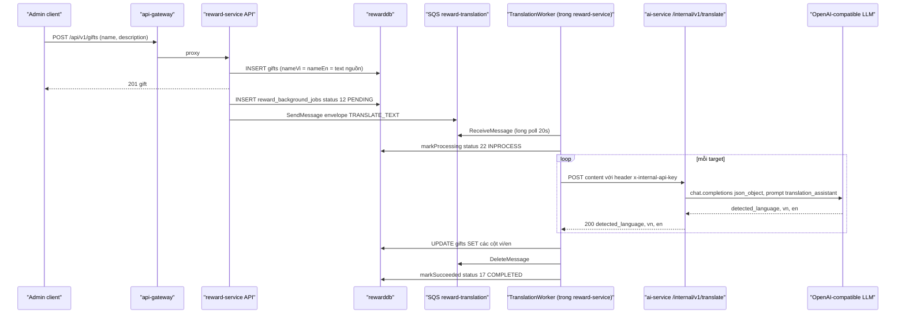

# Translation worker (dịch tự động vi/en)

> **Đây KHÔNG phải một service riêng.** Không có process, Dockerfile, DB hay cổng HTTP riêng cho "translation worker". Đây là một `QueueWorker` chạy bên trong process của reward-service (`ecolink-server/services/reward-service/src/queue/workers/translation.worker.ts`). incident-service có một bản sao gần như y hệt chạy trong process worker của incident-service (`ecolink-server/services/incident-service/src/queue/worker/translation-worker.ts`). Cả hai cùng gọi một endpoint dịch của ai-service.
>
> Tài liệu viết dựa trên code. Đường dẫn tính từ `/Users/ngoc/ecolink`.

## 1. Tổng quan

Mục tiêu: khi admin/người dùng lưu nội dung chỉ bằng một ngôn ngữ, hệ thống lưu ngay bản ghi (điền tạm text nguồn vào cả cột `*Vi` và `*En`), rồi dịch bất đồng bộ qua SQS và ghi đè cột ngôn ngữ còn thiếu. Request HTTP không phải chờ ai-service (comment trong `translation.worker.ts`).

| Thành phần | reward-service | incident-service |
|---|---|---|
| Job type | `TRANSLATE_TEXT` (`reward-service/src/modules/translation/translation.types.ts > TRANSLATE_TEXT_JOB_TYPE`) | `TRANSLATE_TEXT` (`incident-service/src/constants/job-type.enum.ts > ReportJobType.TRANSLATE_TEXT`) |
| Resource type | `GIFT`, `DIFFICULTY` | `REPORT`, `ORGANIZATION`, `CAMPAIGN` |
| Queue (env) | `SQS_REWARD_TRANSLATION_QUEUE_URL` | `SQS_INCIDENT_TRANSLATION_QUEUE_URL` |
| Bảng theo dõi job | `reward_background_jobs` (`RewardBackgroundJobStore`) | bảng background job của incident (`incident-service/src/queue/background-job-store.ts`) |
| Concurrency | `TRANSLATION_QUEUE_CONCURRENCY` (mặc định 1) | `TRANSLATE_TEXT_CONCURRENCY` (mặc định 1) |
| Ngưỡng retry | Đọc từ env `WORKER_*` (`reward-service/src/queue/register.ts`) | Truyền `{}` → dùng mặc định của `@da2/queue` (`incident-service/src/queue/register.ts`) |
| Client dịch | `reward-service/src/modules/translation/translation.client.ts > translateText()` | `incident-service/src/modules/translation/translation.client.ts > translateText()` (cùng logic) |
| Nơi chạy | Cả `dist/index.js` (API, vì `index.ts` import `./worker`) và `dist/worker.js` | Chỉ `incident-service/src/worker.ts > startAllQueues()` |

## 2. Payload job

```ts
// reward-service/src/modules/translation/translation.types.ts
interface TranslationFieldTarget { sourceText: string; viField?: string; enField?: string }
interface TranslationJobPayload {
  resourceType: "GIFT" | "DIFFICULTY";   // incident: "REPORT" | "ORGANIZATION" | "CAMPAIGN"
  resourceId: string;
  translations: TranslationFieldTarget[];
}
```

Envelope SQS do `@da2/queue` tạo: `{ jobId, version: 1, jobType: "TRANSLATE_TEXT", createdAt, payload }` (`ecolink-server/shared/da2-queue/src/infra/sqs-background-job-queue.ts > enqueue()`).

`viField`/`enField` là **tên cột Prisma** sẽ được ghi (ví dụ `nameVi`, `descriptionEn`). Field nào bỏ trống nghĩa là người dùng đã cung cấp ngôn ngữ đó, không được ghi đè.

## 3. Ai enqueue, khi nào

Mọi nơi enqueue đều theo mẫu "best-effort": gọi `backgroundJobDispatcher.enqueue(...)` không `await`, lỗi chỉ `console.error`, không rollback bản ghi chính và không trả lỗi cho client. Trước khi enqueue, danh sách target được lọc bỏ phần tử có `sourceText` rỗng hoặc không có cả `viField` lẫn `enField`; nếu rỗng thì không enqueue.

### 3.1 reward-service

| Hành động | Hàm enqueue | Text nguồn | Điều kiện | Target |
|---|---|---|---|---|
| Admin tạo Gift (`POST /api/v1/gifts`) | `gift.service.ts > create()` → `enqueueGiftTranslationJob()` | name: `nameVi` ‖ `nameEn` ‖ `name`; description: `descriptionVi` ‖ `descriptionEn` ‖ `description` | Thiếu `nameVi` hoặc `nameEn` (tương tự cho description) | `nameVi`/`nameEn`, `descriptionVi`/`descriptionEn` (chỉ cột mà người dùng không gửi) |
| Admin sửa Gift (`PUT /api/v1/gifts/:id`) | `gift.service.ts > updateById()` → `enqueueGiftTranslationJob()` | như trên, chỉ khi có gửi field tương ứng | như trên | như trên |
| Admin sửa Difficulty (`PUT /api/v1/difficulties/:id`) | `difficulty.service.ts > updateById()` → `enqueueDifficultyTranslationJob()` | `nameVi` ‖ `nameEn` ‖ `name` | Có text nguồn và thiếu `nameVi` hoặc `nameEn` | `nameVi`/`nameEn` |

Trước khi enqueue, service ghi tạm text nguồn vào cột còn thiếu ("pre-fill") để bản ghi đọc ra không rỗng trong lúc chờ worker (`gift.service.ts > create()`, `updateById()`; `difficulty.service.ts > updateById()`).

### 3.2 incident-service (chỉ phần liên quan dịch)

| Hành động | Hàm | Target |
|---|---|---|
| Tạo report | `incident-service/src/modules/report/report.service.ts > createReport()` → `enqueueReportTranslationJob()` | `titleVi`/`titleEn`, `descriptionVi`/`descriptionEn` (bỏ cột người dùng đã gửi) |
| Sửa report | `report.service.ts > updateReport()` | như trên |
| Tạo tổ chức | `incident-service/src/modules/organization/organization.service.ts > createOrganization()` → `enqueueOrganizationTranslationJob()` | `descriptionVi`/`descriptionEn` |
| Sửa tổ chức | `organization.service.ts > updateOrganization()` | `descriptionVi`/`descriptionEn` |
| Tạo chiến dịch | `incident-service/src/modules/campaign/campaign.service.ts > createCampaign()` → `enqueueCampaignTranslationJob()` | Luôn cả `titleVi`+`titleEn` (nguồn = `title`) và `descriptionVi`+`descriptionEn` nếu có mô tả |

Không tìm thấy enqueue dịch khi cập nhật chiến dịch.

## 4. Luồng xử lý đầu cuối



Các bước trong worker (`reward-service/src/queue/workers/translation.worker.ts > TranslationWorker.process()`):

1. Parse envelope. Payload thiếu `resourceId` hoặc `translations` rỗng → throw "Invalid translation payload" (đi nhánh retry).
2. Duyệt tuần tự từng target; bỏ qua target có `sourceText` rỗng hoặc không có field đích.
3. Gọi `translateText(sourceText)`; gán `updateData[viField] = result.vi`, `updateData[enField] = result.en`.
4. Không có gì để ghi → kết thúc (thành công).
5. `applyUpdate()`: `GIFT` → `prisma.gift.update`, `DIFFICULTY` → `prisma.difficulty.update` (where `id`). Resource type khác → throw "Unsupported translation resource type". incident-service tương tự cho `report`, `organization`, `campaign` (`incident-service/src/queue/worker/translation-worker.ts > applyUpdate()`).

## 5. Gọi dịch đến đâu

### 5.1 Client (reward-service và incident-service giống nhau)

`translateText(text)` (`reward-service/src/modules/translation/translation.client.ts`):

- URL: `POST {AI_SERVICE_URL || "http://localhost:3004"}/internal/v1/translate`, body `{ "content": "<text đã trim>" }`, header `x-internal-api-key: INTERNAL_AI_API_KEY`.
- Kết quả: `{ vi: data.vn, en: data.en }`.
- Không đặt timeout cho `fetch`.

### 5.2 ai-service

| Thành phần | Hành vi | Bằng chứng |
|---|---|---|
| Mount | `internal_router` tại prefix `/internal/v1`; comment ghi rõ api-gateway KHÔNG proxy `/internal/...` | `ecolink-server/services/ai-service/app/main.py` |
| Auth | `require_internal_api_key`: env `INTERNAL_AI_API_KEY` trống → 500 "AI service INTERNAL_AI_API_KEY is not configured"; header sai/thiếu → 401 "Invalid internal API key" | `ecolink-server/services/ai-service/app/auth.py > require_internal_api_key()` |
| Endpoint | `POST /internal/v1/translate`, body `InternalTranslateBody { content: str }`; `content == ""` → 400 "content is required"; `RuntimeError` → 500 `detail=str(e)`; lỗi khác → 500 kèm log traceback | `ecolink-server/services/ai-service/app/internal/router.py > internal_translate()` |
| Logic dịch | `translate_text()`: thiếu `OPENAI_API_KEY` → RuntimeError. Gọi `client.chat.completions.create(model=settings.openai_chat_model (mặc định gpt-4o-mini), response_format json_object, system prompt "translation_assistant")`. Bỏ khối `<think>`, tách object JSON ngoài cùng, kiểm tra `detected_language ∈ {vi, en}`, `vn`/`en` là string. Ép giữ nguyên text gốc ở cột ngôn ngữ nguồn | `ecolink-server/services/ai-service/app/chat/service.py > translate_text()` |
| Prompt | Chỉ vi↔en; phát hiện ngôn ngữ, giữ nguyên bản gốc, dịch sang ngôn ngữ kia, chỉ trả JSON `{detected_language, vn, en}` | `ecolink-server/services/ai-service/app/agents/prompts.py > AGENT_SYSTEM_PROMPTS["translation_assistant"]` |
| Client LLM | `AsyncOpenAI(api_key=OPENAI_API_KEY, base_url=OPENAI_BASE_URL nếu có)` | `ecolink-server/services/ai-service/app/llm/openai_chat.py > build_client()` |

Cùng hàm `translate_text()` còn được phục vụ cho client qua `POST /api/v1/chat/translate` (JWT người dùng, gateway proxy `/api/v1/translate` → `/api/v1/chat/translate`) — `ecolink-server/services/ai-service/app/chat/router.py > translate_message()`. Worker không dùng route này.

## 6. Ghi kết quả vào đâu

| Resource | Bảng | Cột có thể bị ghi |
|---|---|---|
| `GIFT` | `gifts` (reward) | `name_vi`, `name_en`, `description_vi`, `description_en` |
| `DIFFICULTY` | `difficulties` (reward) | `name_vi`, `name_en` |
| `REPORT` | reports (incident) | `titleVi`, `titleEn`, `descriptionVi`, `descriptionEn` |
| `ORGANIZATION` | organizations (incident) | `descriptionVi`, `descriptionEn` |
| `CAMPAIGN` | campaigns (incident) | `titleVi`, `titleEn`, `descriptionVi`, `descriptionEn` |

Worker chỉ ghi các cột có trong payload, trong một câu `update` duy nhất. Không có event/thông báo nào được phát sau khi dịch xong.

## 7. Xử lý lỗi và retry

### 7.1 Lỗi ở phía gọi dịch: **không retry, fallback về text gốc**

`translateText()` không bao giờ throw. Trong mọi trường hợp sau nó trả `{ vi: text, en: text }` và chỉ `console.warn`:
- `INTERNAL_AI_API_KEY` trống ở service gọi (bỏ qua, không gọi mạng);
- ai-service trả non-2xx (401, 400, 500 do LLM trả JSON sai, thiếu `OPENAI_API_KEY`...), log 500 ký tự đầu body;
- lỗi mạng hoặc parse JSON.

Hệ quả: job vẫn được coi là THÀNH CÔNG (`COMPLETED`), cột dịch bị ghi bằng chính text nguồn, không có lần thử lại. Nếu ai-service trả 200 nhưng thiếu `vn`/`en`, client ghi `""` (`data.vn ?? ""`).

### 7.2 Lỗi khác: retry theo `@da2/queue`

Các lỗi còn lại (payload không hợp lệ, resource type không hỗ trợ, `prisma.update` lỗi — ví dụ bản ghi đã bị xoá cứng → P2025, lỗi DB) làm `process()` throw và được xử lý bởi `QueueWorker.processMessage()` (`ecolink-server/shared/da2-queue/src/core/queue-worker.ts`):

| Tình huống | Hành động |
|---|---|
| `receiveCount < maxRetries` | `ChangeMessageVisibility` = `min(maxRetryDelaySeconds, retryBaseSeconds × 2^(receiveCount−1))`; job → `12 PENDING` (`markRetryScheduled`) |
| `receiveCount >= maxRetries` | Xoá message, job → `23 FAILED` (`markFailed`). Không có DLQ trong code |
| Envelope không parse được / thiếu `jobId` | Coi là lỗi, retry như trên; khi hết lượt thì xoá message (không có `jobId` để đánh dấu) |
| `jobType` khác `TRANSLATE_TEXT` | `markFailed` + xoá message ngay |
| Job đã COMPLETED/FAILED (SQS giao lại) | `markProcessing` trả false → xoá message, bỏ qua |

Mặc định reward-service: `WORKER_MAX_RECEIVE_COUNT=5`, `WORKER_RETRY_BASE_SECONDS=30`, `WORKER_MAX_RETRY_DELAY_SECONDS=900`, visibility 120 s, batch 5, long poll 20 s (`reward-service/src/queue/register.ts`). incident-service dùng mặc định thư viện (cùng giá trị).

### 7.3 Lỗi khi enqueue

`SqsBackgroundJobQueue.enqueue()`: tạo dòng job `PENDING` trước, sau đó `SendMessage`. Gửi thành công → `markEnqueued` (vẫn `PENDING`); gửi lỗi → `markFailedWithoutSend` (`FAILED`) và throw; service gọi nuốt lỗi. Không có cơ chế quét lại job `FAILED`/`PENDING` bị kẹt. Nếu ghi DB job lỗi thì không gửi SQS.

### 7.4 Trạng thái `reward_background_jobs.status` (GlobalStatus)

`12 PENDING` (tạo/enqueued/chờ retry) → `22 INPROCESS` (đang xử lý, `attempts` = receiveCount) → `17 COMPLETED` (có `processed_at`) hoặc `23 FAILED` (có `processed_at`) — `reward-service/src/queue/reward-background-job-store.ts`.

## 8. Biến môi trường liên quan

| Biến | Service | Ý nghĩa |
|---|---|---|
| `SQS_REWARD_TRANSLATION_QUEUE_URL` | reward | URL queue (thiếu → reward-service không khởi động được) |
| `SQS_INCIDENT_TRANSLATION_QUEUE_URL` | incident | URL queue |
| `TRANSLATION_QUEUE_CONCURRENCY` / `TRANSLATE_TEXT_CONCURRENCY` | reward / incident | Số worker. Lưu ý: `QueueRunner` của incident nhận `concurrency` nhưng `createWorkers` chỉ tạo 1 worker (cần xác nhận `QueueRunner` có dùng `concurrency` không — trong `@da2/queue/src/dispatcher/queue-runner.ts` không đọc field này) |
| `WORKER_MAX_RECEIVE_COUNT`, `WORKER_RETRY_BASE_SECONDS`, `WORKER_MAX_RETRY_DELAY_SECONDS`, `WORKER_SQS_VISIBILITY_TIMEOUT_SECONDS`, `WORKER_BATCH_SIZE`, `WORKER_SQS_WAIT_TIME_SECONDS` | reward | Ngưỡng worker |
| `AI_SERVICE_URL` (mặc định `http://localhost:3004`), `INTERNAL_AI_API_KEY` | reward, incident | Endpoint và khoá gọi ai-service |
| `INTERNAL_AI_API_KEY`, `OPENAI_API_KEY`, `OPENAI_BASE_URL`, `OPENAI_CHAT_MODEL` | ai-service | Khoá nhận, cấu hình LLM (`ecolink-server/services/ai-service/app/config.py`) |
| `AWS_*` endpoint/credential | reward, incident | Kết nối SQS/LocalStack |

## 9. Vấn đề cần xác nhận

1. Mọi lỗi dịch đều "thành công giả": job COMPLETED với bản dịch = text gốc, không retry, không có dấu hiệu nào trên bản ghi cho biết chưa được dịch.
2. Ghi đè muộn (race): job dịch được xử lý sau có thể ghi đè giá trị mà admin sửa tay sau thời điểm enqueue, vì worker không kiểm tra phiên bản/`updatedAt`.
3. Nhiều target trong một job được dịch tuần tự và không có timeout `fetch`; một lần gọi treo có thể giữ message quá visibility 120 s → SQS giao lại cho worker khác → dịch và ghi trùng.
4. `createCampaign()` (incident) luôn enqueue dịch cho cả `titleVi` và `titleEn` từ `title`, kể cả khi client đã gửi `titleVi`/`titleEn` → giá trị người dùng nhập có thể bị ghi đè. Không có dịch khi sửa chiến dịch.
5. `difficulty.service.ts > updateById()` pre-fill: khi request không gửi tên, `nameVi`/`nameEn` bị ghi thành `""` (xem reward-service.md mục 9) — không liên quan worker nhưng ảnh hưởng dữ liệu đa ngôn ngữ.
6. `viField`/`enField` được dùng trực tiếp làm key update Prisma (`data as never`); an toàn chỉ vì payload do chính service tạo.
7. reward-service chạy worker trong cả API process và worker process nếu triển khai cả hai → nhiều consumer hơn cấu hình `TRANSLATION_QUEUE_CONCURRENCY`.
